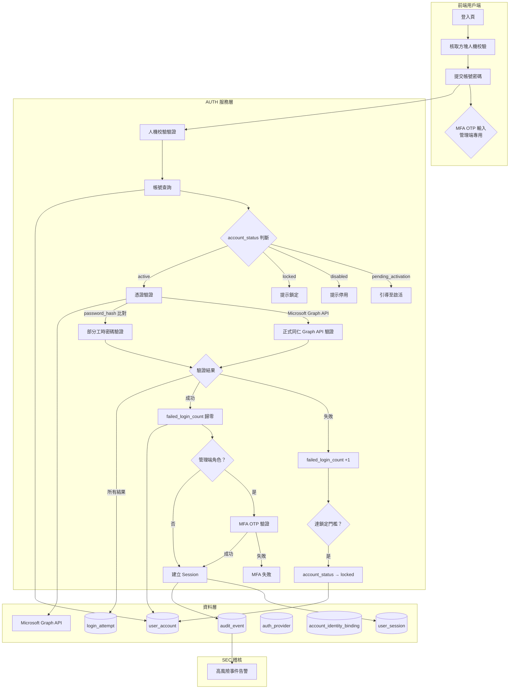
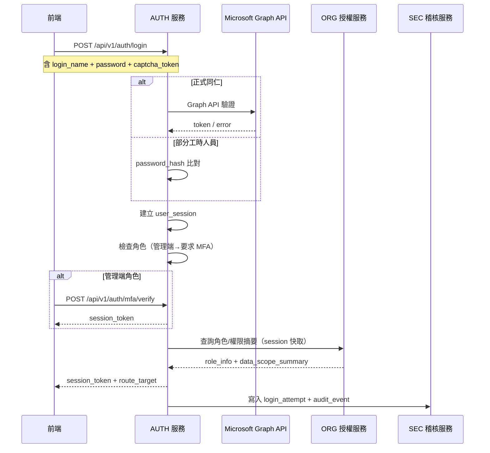
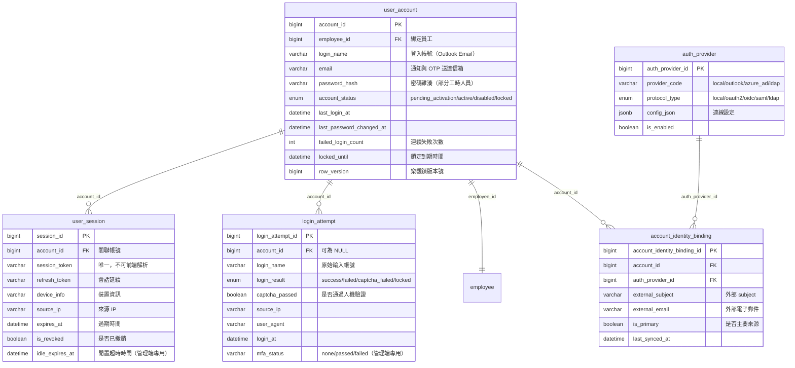
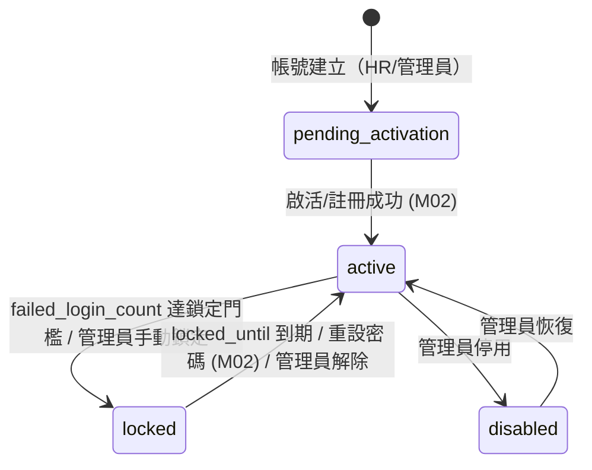
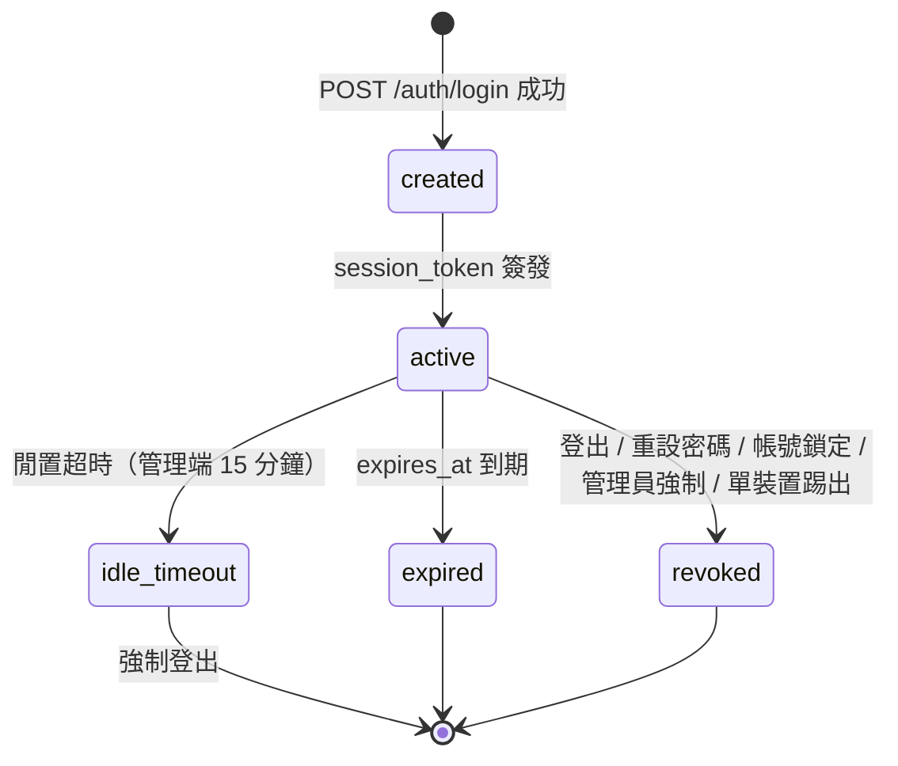

# PRD_M01_AUTH_Login_v2_20260703

> 版本：v2 | 日期：2026-07-03 | 模塊類型：底層能力模塊 | 所屬領域：AUTH 身份驗證

---

## 1. 模塊概述

### 1.1 功能定位

本模塊是整個臺鐵職工福利平台的身份入口與第一道安全閘門，負責處理使用者登入驗證、風險判斷、人機校驗、登入失敗計數、帳號鎖定、Session 建立與失效，以及高風險登入事件的稽核回傳。

### 1.2 業務價值

- 統一平台所有入口（前台 Portal、管理後台 Admin Console、資安後台 Security Console）的登入行為
- 降低弱密碼、暴力嘗試、異常來源登入帶來的風險
- 以 Session 為中心建立後續授權、通知、稽核與安全掃描的基礎能力
- 對管理端入口實施增強安全控制：強制 MFA、單一裝置登入限制、閒置自動登出

### 1.3 使用角色

| 角色 | 說明 |
|------|------|
| 一般職工（使用者） | 前台 Portal 登入，走 Microsoft Graph API（正式同仁）或內部帳號（部分工時人員） |
| 福利社承辦人（管理者） | 管理後台登入，密碼驗證後須完成 MFA |
| 審核主管（審閱者） | 管理後台登入，密碼驗證後須完成 MFA |
| 系統管理員（系統管理者） | 管理後台登入，密碼驗證後須完成 MFA |
| 資安稽核人員 | Security Console 登入，密碼驗證後須完成 MFA |

### 1.4 身份來源分流原則

- **正式同仁**（具 Outlook 信箱）：以 Microsoft Graph API 驗證為主，平台不留存其密碼
- **部分工時人員**（無 Outlook 信箱）：使用內部帳號與密碼（`password_hash` 不可逆雜湊存儲）
- 身份來源透過 `auth_provider` + `account_identity_binding` 表管理，支援未來多 IdP 擴展

---

## 2. 數據流圖

### 2.1 登入主流程數據流



### 2.2 跨模塊數據流



---

## 3. 數據庫設計

### 3.1 涉及數據表清單

| 表名 | 別名 | 用途 | 所屬模塊 |
|------|------|------|---------|
| `user_account` | AUTH-01 | 系統登入帳號主表 | AUTH |
| `user_session` | AUTH-02 | 使用者會話記錄 | AUTH |
| `login_attempt` | AUTH-03 | 登入嘗試紀錄 | AUTH |
| `auth_provider` | AUTH-05 | 身份提供者配置 | AUTH |
| `account_identity_binding` | AUTH-06 | 帳號身份綁定關係 | AUTH |
| `employee` | EMP-01 | 員工主檔（AUTH 讀取關聯） | EMP |
| `audit_event` | SEC-01 | 全域稽核日誌（AUTH 寫入） | SEC |

### 3.2 ER 圖



### 3.3 關鍵字段說明

**`user_account.account_status` ENUM**
- `pending_activation`：帳號已建立但尚未啟活，不可登入
- `active`：可正常登入
- `disabled`：被管理員停用，不可登入
- `locked`：因安全原因被鎖定，不可登入；`locked_until` 記錄到期時間

**`login_attempt.login_result` ENUM**
- `success`：登入成功
- `failed`：帳密錯誤
- `captcha_failed`：人機校驗失敗
- `locked`：因鎖定被拒絕

**`user_session.idle_expires_at`**：管理端專用欄位，記錄閒置逾時時間。每次請求時刷新，超時則強制登出。

---

## 4. 功能需求清單

### 4.1 核心功能點

| 編號 | 名稱 | 優先級 | 詳細說明 | 權限控制 |
|------|------|--------|---------|---------|
| AUTH-LOGIN-01 | 登入驗證 | P0 | 支援 Microsoft Graph API（正式同仁）與內部密碼（部分工時人員）兩種驗證方式。驗證成功後建立 Session | 所有角色 |
| AUTH-LOGIN-02 | 人機校驗 | P0 | 登入頁始終顯示核取方塊式非機器人行為校驗 | 所有角色 |
| AUTH-LOGIN-03 | 連續失敗風險控制 | P0 | failed_login_count 達門檻（系統參數設定）時加強校驗或鎖定帳號 | 系統自動 |
| AUTH-LOGIN-04 | 帳號狀態控制 | P0 | 依 account_status 判斷是否允許登入，不同狀態給出對應提示 | 系統自動 |
| AUTH-LOGIN-05 | Session 管理 | P0 | 登入成功後建立 user_session，支援 refresh_token 延續會話，登出/失效時撤銷 | 所有角色 |
| AUTH-LOGIN-06 | 管理端 MFA | P0 | 管理端角色密碼驗證成功後須完成 OTP 二次驗證方可建立 Session | 管理端角色 |
| AUTH-LOGIN-07 | 單裝置登入 | P0 | 管理端帳號僅允許單一裝置登入，新裝置登入時自動撤銷既有 Session | 管理端角色 |
| AUTH-LOGIN-08 | 閒置登出 | P0 | 管理端閒置 15 分鐘強制自動登出 | 管理端角色 |
| AUTH-LOGIN-09 | 入口分流 | P1 | 登入成功後依角色導向 Portal / Admin Console / Security Console | 系統自動 |
| AUTH-LOGIN-10 | 登入事件稽核 | P0 | 每次登入嘗試（成功/失敗/鎖定/人機失敗）均寫入 login_attempt 表；高風險事件同步寫入 audit_event | 系統自動 |
| AUTH-LOGIN-11 | 高風險增強驗證 | P1 | 來源 IP 異常、短時間多次嘗試時可觸發增強人機校驗 | 系統自動 |

### 4.2 功能權限矩陣

| 功能 | 一般職工 | 承辦人 | 審核主管 | 系統管理員 | 資安人員 |
|------|---------|--------|---------|-----------|---------|
| 登入（Graph API） | 正式同仁 | 正式同仁 | 正式同仁 | 正式同仁 | 正式同仁 |
| 登入（內部帳號） | 部分工時 | ✓ | ✓ | ✓ | ✓ |
| MFA | - | ✓ | ✓ | ✓ | ✓ |
| 登入記錄查詢 | 本人 | 所轄 | 所轄 | 全部 | 全部 |
| 強制撤銷 Session | - | - | - | ✓ | - |

---

## 5. 用例文檔

### 用例 5.1：正式同仁成功登入前台 Portal

- **前置條件**：帳號已啟活（`account_status` = `active`），存在有效的 Outlook 信箱
- **操作步驟**：
  1. 開啟登入頁，輸入 Outlook Email 與密碼
  2. 完成核取方塊式人機校驗
  3. 系統判斷為正式同仁，導向 Microsoft Graph API 驗證
  4. Graph API 驗證通過，`failed_login_count` 歸零
  5. 系統判斷為一般職工角色，跳過 MFA
  6. 建立 `user_session`，簽發 `session_token`
  7. 寫入 `login_attempt`（`login_result` = `success`）
  8. 導向前台 Portal
- **預期結果**：進入 Portal，可查看補助申請等核心功能
- **異常處理**：
  - Graph API 不可用：回傳「驗證服務暫時不可用，請稍後再試」，寫入高風險稽核
  - 帳號 `account_status` 非 `active`：依狀態給出對應提示，不繼續驗證

### 用例 5.2：管理端完成 MFA 雙因子驗證登入

- **前置條件**：管理端角色帳號（如系統管理員）已啟活，手機可用於接收 OTP
- **操作步驟**：
  1. 開啟登入頁，輸入帳號密碼
  2. 完成人機校驗，密碼驗證通過，`failed_login_count` 歸零
  3. 系統判斷為管理端角色，要求 MFA
  4. 前端彈出 MFA OTP 輸入框
  5. 使用者查看手機 OTP，輸入 6 碼驗證碼
  6. OTP 驗證通過，建立 `user_session`
  7. 檢查是否已有其他裝置的活動 Session → 有則自動撤銷舊 Session
  8. 導向 Admin Console
- **預期結果**：成功進入 Admin Console，舊裝置被登出並收到通知
- **異常處理**：
  - OTP 錯誤/過期：提示重新輸入或重新發送，記錄失敗次數
  - OTP 失敗達 3 次：中斷登入流程，寫入高風險稽核
  - MFA 連續失敗 5 次：暫停該帳號登入 30 分鐘

### 用例 5.3：帳號因連續失敗被鎖定

- **前置條件**：帳號已啟動，攻擊者嘗試暴力破解
- **操作步驟**：
  1. 攻擊者連續輸入錯誤密碼
  2. 每次失敗 `failed_login_count` +1
  3. 前 3 次失敗：人機校驗維持基礎校驗
  4. 第 4-5 次失敗：人機校驗增強（圖形驗證碼）
  5. 第 6 次失敗：`account_status` 更新為 `locked`，設定 `locked_until`
  6. 寫入 `audit_event`（`severity` = `high`），觸發 SEC 告警
- **預期結果**：帳號鎖定，後續登入嘗試被拒絕
- **異常處理**：
  - `locked_until` 到期後自動解除鎖定，`account_status` 恢復為 `active`
  - 管理員可手動解除鎖定（P1 功能）

### 用例 5.4：Session 過期重新登入

- **前置條件**：使用者已登入但 Session 已過期（`expires_at` 已過），或管理端閒置超過 15 分鐘
- **操作步驟**：
  1. 使用者在頁面上發起 API 請求
  2. 系統檢查 `user_session.expires_at` 或 `idle_expires_at`
  3. 發現已過期，回傳 401 Unauthorized
  4. 前端收到 401，清除本地狀態，顯示「登入已過期，請重新登入」
  5. 使用者重新導向登入頁
- **預期結果**：無法繼續操作，需重新登入
- **異常處理**：
  - 多標籤頁同時操作：任一端 Session 過期，所有標籤頁均需重新登入
  - 管理端閒置時間到：觸發強制登出，寫入稽核

### 用例 5.5：管理端單裝置踢出

- **前置條件**：管理員 A 已在裝置 1 登入
- **操作步驟**：
  1. 管理員 A 在裝置 2 上成功完成登入（含 MFA）
  2. 系統檢測該帳號已有活躍 Session
  3. 系統將裝置 1 的 Session 設為 `is_revoked` = 1
  4. 系統向裝置 1 發送通知：「您的帳號已在其他裝置登入」
  5. 裝置 1 下一次請求時被 401 拒絕
- **預期結果**：新裝置正常使用，舊裝置被自動登出
- **異常處理**：
  - 裝置 1 正在進行敏感操作（如審批）：不中斷當前請求，但之後的操作被拒絕

---

## 6. 界面與交互要求

### 6.1 頁面佈局原則

**登入頁區塊結構：**
1. 平台 Logo 與名稱（頂部置中）
2. 帳號輸入框（提示 Outlook Email 格式）
3. 密碼輸入框
4. 核取方塊式人機校驗區塊（始終顯示）
5. 登入按鈕（點擊後置灰，避免重複提交）
6. 忘記密碼入口 + 帳號啟活入口（底部）
7. 錯誤提示區（不區分「帳號不存在」或「密碼錯誤」）

**MFA 驗證彈窗（管理端專用）：**
1. OTP 6 碼輸入框（自動跳格）
2. OTP 剩餘有效時間倒數
3. 重新發送按鈕（冷卻時間限制）
4. 錯誤提示區

### 6.2 帳號狀態機



### 6.3 Session 生命週期狀態機



### 6.4 關鍵交互流程

1. **登入中按鈕置灰**：防止重複提交，使用 Idempotency-Key 防止重複建立 Session
2. **錯誤訊息統一化**：前台統一顯示「帳號或密碼錯誤」，不區分具體原因
3. **MFA 輸入自動跳格**：6 碼 OTP 自動跳轉下一個輸入框，提升操作效率
4. **Session 過期自動跳轉**：前端攔截 401 響應，清除本地狀態，重定向至登入頁
5. **路由守衛**：只做是否已登入判斷，不做真正授權決策（授權由 ORG 服務負責）

---

## 7. API 接口規格

### 7.1 端點定義

#### POST /api/v1/auth/login

登入驗證（返回是否需 MFA）。

**Request：**
```json
{
  "login_name": "user@railway.gov.tw",
  "password": "******",
  "captcha_token": "captcha_token_value",
  "source_ip": "203.0.113.1",
  "user_agent": "Mozilla/5.0...",
  "device_info": "device_fingerprint",
  "idempotency_key": "uuid-v4"
}
```

**Response 200（一般職工）：**
```json
{
  "login_result": "success",
  "session_token": "opaque_token_string",
  "refresh_token": "refresh_token_string",
  "session_expires_at": "2026-07-04T00:00:00Z",
  "mfa_required": false,
  "route_target": "portal",
  "user": {
    "employee_id": 12345,
    "employee_no": "A12345",
    "full_name": "張三",
    "role_tags": ["employee"]
  }
}
```

**Response 200（管理端，需 MFA）：**
```json
{
  "login_result": "success_partial",
  "mfa_required": true,
  "mfa_session_token": "temp_token_for_mfa",
  "mfa_expires_at": "2026-07-03T13:00:00Z",
  "route_target": null
}
```

**Response 401：**
```json
{
  "error_code": "AUTH-001",
  "message": "帳號或密碼錯誤",
  "detail_json": null
}
```

**錯誤碼：**
| 錯誤碼 | HTTP 狀態 | 說明 | 可公開訊息 |
|--------|----------|------|----------|
| AUTH-001 | 401 | 帳號或密碼錯誤 | 帳號或密碼錯誤 |
| AUTH-002 | 403 | 帳號已鎖定 | 帳號目前不可使用，請稍後再試 |
| AUTH-003 | 403 | 帳號停用 | 帳號目前不可使用 |
| AUTH-004 | 403 | 帳號待啟活 | 帳號尚未啟活，請先完成啟活流程 |
| AUTH-005 | 400 | 人機校驗失敗 | 請完成人機驗證 |
| AUTH-006 | 429 | 登入請求過於頻繁 | 請稍後再試 |
| GBL-001 | 500 | 系統錯誤 | 系統暫時不可用，請稍後再試 |

#### POST /api/v1/auth/mfa/verify

管理端 MFA 二次驗證。

**Request：**
```json
{
  "mfa_session_token": "temp_token_from_login",
  "mfa_otp": "123456",
  "idempotency_key": "uuid-v4"
}
```

**Response 200：**
```json
{
  "login_result": "success",
  "session_token": "opaque_token_string",
  "refresh_token": "refresh_token_string",
  "session_expires_at": "2026-07-04T00:00:00Z",
  "idle_timeout_seconds": 900,
  "route_target": "admin_console"
}
```

**錯誤碼：**
| 錯誤碼 | HTTP 狀態 | 說明 |
|--------|----------|------|
| AUTH-010 | 400 | MFA OTP 錯誤或已過期 |
| AUTH-011 | 400 | MFA Session 已過期，請重新登入 |
| AUTH-012 | 429 | MFA 驗證嘗試過於頻繁 |

#### POST /api/v1/auth/logout

登出（撤銷 Session）。

**Request：**
```json
{
  "session_token": "opaque_token_string"
}
```

**Response 200：**
```json
{
  "logout_result": "success"
}
```

#### POST /api/v1/auth/session/refresh

刷新 Session Token。

**Request：**
```json
{
  "refresh_token": "refresh_token_string"
}
```

**Response 200：**
```json
{
  "session_token": "new_opaque_token",
  "refresh_token": "new_refresh_token",
  "session_expires_at": "2026-07-05T00:00:00Z"
}
```

**錯誤碼：**
| 錯誤碼 | HTTP 狀態 | 說明 |
|--------|----------|------|
| AUTH-020 | 401 | Refresh Token 無效或已過期 |
| AUTH-021 | 401 | Session 已被撤銷 |

#### GET /api/v1/auth/sessions/current

查詢當前 Session 資訊。

**Response 200：**
```json
{
  "account_id": 12345,
  "employee_id": 12345,
  "full_name": "張三",
  "login_name": "user@railway.gov.tw",
  "session_created_at": "2026-07-03T10:00:00Z",
  "session_expires_at": "2026-07-04T00:00:00Z",
  "source_ip": "203.0.113.1",
  "device_info": "device_fingerprint"
}
```

#### GET /api/v1/auth/login-history

查詢登入記錄（本人或管理員查詢下級）。

**Query Parameters：**
| 參數 | 類型 | 必填 | 說明 |
|------|------|------|------|
| `account_id` | int | 否 | 查詢特定帳號（管理員用） |
| `page` | int | 否 | 分頁 |
| `size` | int | 否 | 每頁筆數 |
| `date_from` | date | 否 | 起始日期 |
| `date_to` | date | 否 | 結束日期 |

---

## 8. 非功能性需求

### 8.1 性能指標

| 指標 | 目標值 |
|------|--------|
| 登入 API 響應時間（P95） | < 500ms（Graph API 驗證 < 2s） |
| 同時在線 Session 數 | 支援 ≥ 5,000 並發 |
| Session 查詢 QPS | ≥ 200 |
| OTP 發送響應時間 | < 2s |
| 登入失敗計數寫入 | 即時（同步寫入） |

### 8.2 安全要求

- 全站強制 TLS 1.2/1.3（符合總體 PRD 5.4）
- 密碼以 bcrypt/argon2 不可逆雜湊存儲（`password_hash`）
- 正式同仁不留存密碼，走 Graph API 驗證
- `session_token`（VARCHAR(512)）不可攜帶明文權限資訊
- 登入錯誤訊息統一化，防止帳號枚舉
- 管理端強制 MFA（OTP 動態驗證碼）
- 管理端單裝置登入限制
- 管理端閒置 15 分鐘強制自動登出
- 核取方塊式人機校驗為基礎防線
- 高風險登入事件同步寫入稽核（`login_attempt` + `audit_event`）
- 部分工時人員密碼以不可逆雜湊存儲

### 8.3 可用性標準

| 指標 | 目標值 |
|------|--------|
| AUTH 服務可用性 | ≥ 99.9%（排除 Graph API 外部依賴） |
| Session 儲存 | Redis 主從 + PostgreSQL 持久化備份 |
| 登入頁加載時間 | < 2s |
| MFA OTP 送達率 | ≥ 99% |

---

## 9. 隱含需求補充

### 9.1 審計日誌

所有登入相關事件寫入以下兩張表：

| 事件類型 | login_attempt | audit_event | severity |
|---------|--------------|-------------------|----------|
| 登入成功 | ✓（非同步） | ✓（高風險同步，一般非同步） | info |
| 登入失敗（帳密錯誤） | ✓（同步） | ✓（同步） | low |
| 人機校驗失敗 | ✓（同步） | ✓（同步） | medium |
| 帳號鎖定 | ✓（同步） | ✓（同步） | high |
| MFA 失敗 | ✓（同步） | ✓（同步） | high |
| Session 過期 | - | ✓（非同步） | info |
| 管理端單裝置踢出 | - | ✓（同步） | medium |

### 9.2 數據一致性

- 登入成功/失敗計數更新與 Session 建立在同一事務中
- `failed_login_count` 歸零與 Session 建立：同一事務
- MFA 驗證通過後才建立 Session，防止驗證通過但 Session 建立失敗的髒狀態

### 9.3 並發控制（row_version 樂觀鎖）

- `user_account` 表使用 `row_version` 欄位
- 更新 `account_status`、`failed_login_count` 時須檢查 `row_version`
- 並發高情境下：同一帳號多次失敗，樂觀鎖保證計數器準確

### 9.4 錯誤恢復

- Graph API 不可用時：回退策略（記錄錯誤，不曝露內部細節）
- Session 儲存（Redis）故障時：降級為資料庫讀取，但效能受影響
- OTP 發送失敗：前端允許重試，後端限流防濫用

### 9.5 冪等性保障（Idempotency-Key）

- `POST /auth/login`：支援 Idempotency-Key，防止重複提交建立重複 Session
- `POST /auth/mfa/verify`：相同的 Idempotency-Key 返回相同結果
- Idempotency-Key 保留 24 小時

### 9.6 邊界情況處理

1. **帳號存在但無資料範圍**：不應在 AUTH 階段報錯，由 ORG 處理空列表
2. **前台多端同時登入**：允許多 Session 共存，登出一端不誤傷全部
3. **管理端角色同時具備前台身份**：以管理端角色為準，強制 MFA
4. **employee.employment_status = suspended**：與 `account_status` 聯動判斷
5. **正式同仁轉為部分工時**：需管理員手動調整身份來源配置
6. **多人共用同一裝置**：Session 綁定 device_info，離職時管理員批量撤銷
