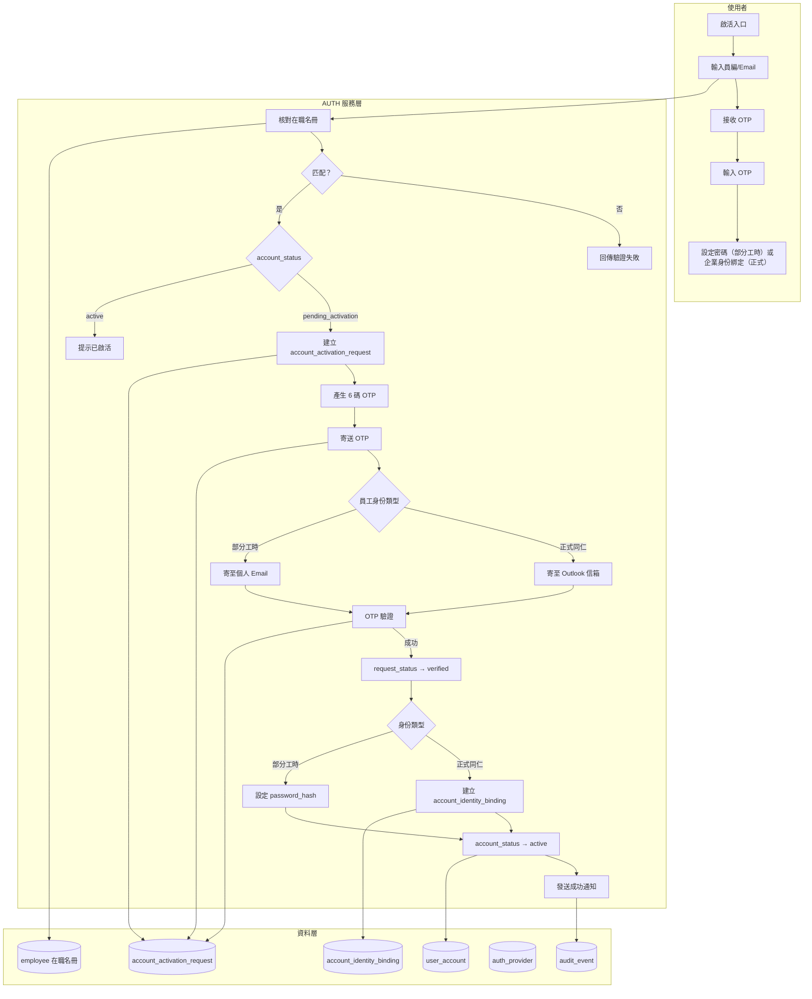
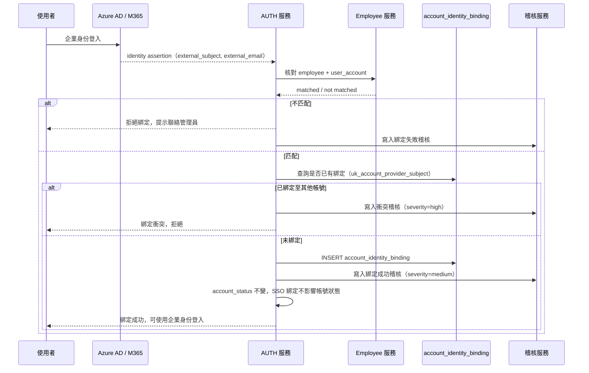
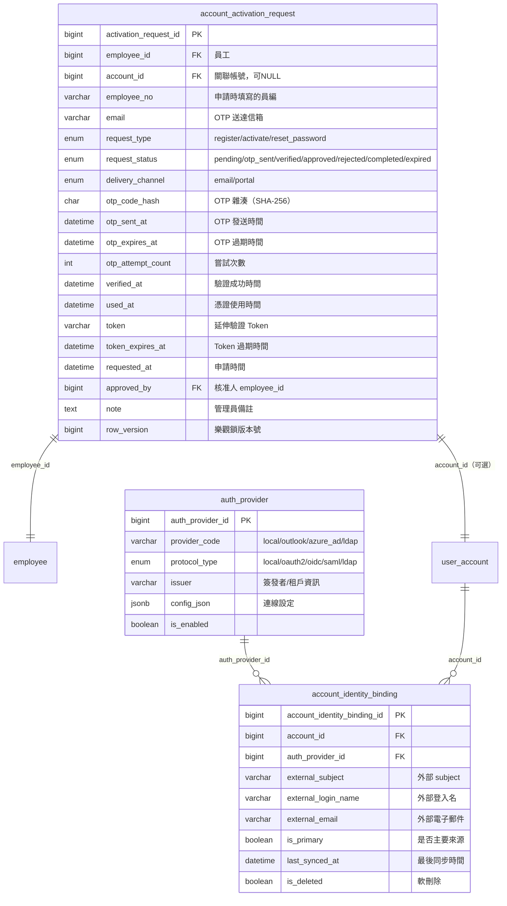
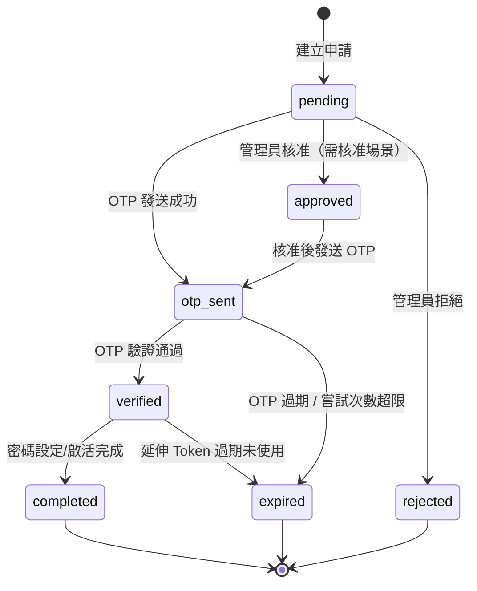

# PRD_M02_AUTH_Activation_v2_20260703

> 版本：v2 | 日期：2026-07-03 | 模塊類型：底層能力模塊 | 所屬領域：AUTH 身份驗證

---

## 1. 模塊概述

### 1.1 功能定位

本模塊是 AUTH 域中「非日常登入」但同樣關鍵的身份生命週期能力，負責處理帳號從不可用到可用、從失控到恢復，以及正式同仁企業身份與內部帳號映射的全過程。若 M01 解決的是「現在能不能登入」，M02 解決的是：「一個新帳號如何安全啟用」、「忘記密碼後如何安全恢復」、「正式同仁的企業身份如何和內部帳號正確映射」。

### 1.2 業務價值

- 建立標準化帳號生命週期治理，讓「待啟活 → 啟活可用 → 忘記密碼恢復」有一致規則
- 所有敏感身份操作（啟活、重設、綁定）均可稽核、可通知、可失效舊 Session
- 對齊原始 PRD 的註冊/重設要求：以 6 碼 OTP 為主，系統自動核對管理者預載之在職名冊
- 首次登入後銜接個資完整性檢查（`employee.contact_profile_completed`）

### 1.3 使用角色

| 角色 | 說明 |
|------|------|
| 一般職工（使用者） | 啟活自己的帳號、重設自己的密碼、綁定企業身份 |
| 系統管理員 | 重送啟活通知、強制重設密碼、查看綁定狀態、審批啟活申請 |
| 資安稽核人員 | 查核啟活/重設/綁定事件稽核紀錄 |

### 1.4 雙軌並行

系統支援純線上 OTP 驗證啟活，同時保留管理員可發起啟活申請的治理路徑。對正式同仁採用企業身份（Microsoft Graph API）綁定，部分工時人員採用內部帳號 + OTP。

---

## 2. 數據流圖

### 2.1 啟活流程數據流



### 2.2 SSO 綁定交互序列



---

## 3. 數據庫設計

### 3.1 涉及數據表清單

| 表名 | 別名 | 用途 | 所屬模塊 |
|------|------|------|---------|
| `account_activation_request` | AUTH-04 | 啟活/註冊/重設密碼申請記錄 | AUTH |
| `auth_provider` | AUTH-05 | 身份提供者配置 | AUTH |
| `account_identity_binding` | AUTH-06 | 帳號身份綁定關係 | AUTH |
| `user_account` | AUTH-01 | 帳號主表（M02 更新） | AUTH |
| `user_session` | AUTH-02 | 重設密碼後批量撤銷 | AUTH |
| `employee` | EMP-01 | 在職名冊校驗 | EMP |
| `audit_event` | SEC-01 | 高風險稽核寫入 | SEC |

### 3.2 ER 圖



### 3.3 關鍵字段說明

**`account_activation_request.request_type` ENUM**
| 值 | 用途 | 説明 |
|----|------|------|
| `register` | 新使用者註冊 | 員工識別 → OTP → 設定密碼 |
| `activate` | 預建帳號啟活 | 管理員建帳 → OTP → 設定密碼 |
| `reset_password` | 忘記密碼 | 身份驗證 → OTP → 新密碼 → Session 撤銷 |

**`account_activation_request.request_status` ENUM 流轉**
```
pending → otp_sent → verified → completed（成功結案）
                  ↘ expired（逾時或嘗試超限）
         → approved / rejected（需管理員核准時）
```

---

## 4. 功能需求清單

### 4.1 核心功能點

| 編號 | 名稱 | 優先級 | 詳細說明 | 權限控制 |
|------|------|--------|---------|---------|
| AUTH-ACT-01 | 帳號啟活 | P0 | 輸入員編/Email，核對在職名冊，發送 6 碼 OTP，驗證通過後設定密碼或綁定企業身份，`account_status` → `active` | 一般職工（本人） |
| AUTH-ACT-02 | 忘記密碼（OTP 重設） | P0 | 提交身份資訊，建立 `request_type=reset_password` 記錄，發送 OTP，驗證通過後設定新密碼，撤銷舊 Session，歸零 `failed_login_count` | 一般職工（本人） |
| AUTH-ACT-03 | OTP 生成與安全驗證 | P0 | 6 碼 OTP，`otp_code_hash` 雜湊存儲，`otp_expires_at` 控制時效，`otp_attempt_count` 限制重試 | 系統自動 |
| AUTH-ACT-04 | SSO 企業身份綁定 | P0 | 正式同仁透過 `account_identity_binding` 將企業身份映射到內部帳號，支援 `is_primary` 標記 | 系統管理員/正式同仁 |
| AUTH-ACT-05 | 重送啟活通知 | P1 | 管理員可對 `pending_activation` 帳號重送啟活通知，舊記錄設為 `expired`，建立新 `account_activation_request` | 系統管理員 |
| AUTH-ACT-06 | 強制重設密碼 | P1 | 管理員可強制指定帳號重設密碼，建立 `reset_password` 請求，撤銷既有 Session | 系統管理員 |
| AUTH-ACT-07 | 首次登入資料完整性檢查 | P0 | 首次登入後檢查 `employee.contact_profile_completed`，若為 0 則強制導向資料補件頁 | 一般職工 |
| AUTH-ACT-08 | 敏感操作通知 | P1 | 啟活成功、重設成功、SSO 綁定成功等事件發送站內通知 + Email | 系統自動 |

### 4.2 功能權限矩陣

| 功能 | 一般職工 | 系統管理員 | 資安稽核 |
|------|---------|-----------|---------|
| 啟活本人帳號 | ✓ | - | - |
| 忘記密碼（本人） | ✓ | - | - |
| SSO 綁定 | ✓（本人） | ✓（全部） | - |
| 重送啟活通知 | - | ✓ | - |
| 強制重設密碼 | - | ✓ | - |
| 查看啟活記錄 | 本人 | 全部 | 查核用 |
| 查核稽核事件 | - | - | ✓ |

---

## 5. 用例文檔

### 用例 5.1：新員工首次啟活帳號（部分工時人員）

- **前置條件**：HR 已建立 `employee` 主檔與 `user_account`（`account_status` = `pending_activation`），員工已知員編
- **操作步驟**：
  1. 從登入頁點擊「帳號啟活」
  2. 輸入員工編號與 Email
  3. 系統核對 `employee` 在職名冊，匹配成功
  4. 系統建立 `account_activation_request`（`request_type` = `activate`）
  5. 系統產生 6 碼 OTP，`otp_code_hash` 雜湊存儲，設定 `otp_expires_at`
  6. OTP 寄送至個人信箱
  7. 員工於時效內輸入 6 碼 OTP
  8. OTP 驗證通過，`request_status` → `verified`
  9. 員工設定密碼（符合複雜度規則）
  10. `user_account.password_hash` 更新，`account_status` → `active`
  11. `request_status` → `completed`
  12. 寫入稽核，發送啟活成功通知
  13. 導向登入頁
- **預期結果**：帳號可用，可走 M01 正常登入
- **異常處理**：
  - 員編/Email 不匹配：統一提示驗證失敗，不暴露具體不匹配項
  - OTP 過期：提示重新申請，原記錄 `request_status` → `expired`
  - OTP 嘗試超限（`otp_attempt_count` ≥ 系統上限）：申請失效，需重新發起

### 用例 5.2：正式同仁綁定企業身份（SSO）

- **前置條件**：正式同仁已有 `user_account`（`account_status` = `active`），且已有 Outlook 信箱
- **操作步驟**：
  1. 管理員（或員工本人）發起 SSO 綁定
  2. 系統導向 Azure AD 登入頁
  3. 員工以 Outlook 帳號完成企業身份驗證
  4. Microsoft Graph API 回傳 identity assertion（`external_subject`, `external_email`）
  5. 系統核對 `employee` + `user_account`，確認帳號存在
  6. 檢查 `account_identity_binding` 的 UNIQUE 約束（`auth_provider_id`, `external_subject`）
  7. 無衝突時，INSERT `account_identity_binding`（`is_primary` = 1）
  8. 寫入稽核，發送綁定成功通知
- **預期結果**：日後可使用 Outlook 帳號登入平台
- **異常處理**：
  - 外部身份已綁定到其他帳號：UNIQUE 約束觸發，寫入 `severity=high` 稽核
  - 員工在 EMP 表中不存在：拒絕綁定，提示聯絡管理員

### 用例 5.3：使用者忘記密碼（完整重設流程）

- **前置條件**：使用者知道員編/Email，有可接收 OTP 的信箱
- **操作步驟**：
  1. 從登入頁點擊「忘記密碼」
  2. 輸入員編或 Email
  3. 系統查詢 `user_account` 是否存在且可恢復（`active` 或 `locked`）
  4. 建立 `account_activation_request`（`request_type` = `reset_password`）
  5. 產生 6 碼 OTP，寄送至對應信箱
  6. 使用者輸入 OTP
  7. OTP 驗證通過，`request_status` → `verified`
  8. 使用者設定新密碼
  9. `user_account.password_hash` 更新，`last_password_changed_at` 刷新
  10. `user_session.is_revoked = 1`（該帳號所有未撤銷 Session）
  11. `user_account.failed_login_count` 歸零
  12. 寫入稽核，發送重設成功通知
- **預期結果**：可回到登入頁使用新密碼登入
- **異常處理**：
  - 帳號不存在：統一提示「若帳號存在將發送通知」，防止枚舉
  - OTP 過期/錯誤：`otp_attempt_count` +1，達到上限則申請失效
  - 新密碼不符合複雜度規則：即時提示，不允許儲存

### 用例 5.4：首次登入後資料完整性檢查強制補件

- **前置條件**：職工剛完成啟活，首次登入成功（`contact_profile_completed = 0`）
- **操作步驟**：
  1. 登入成功後，系統檢測 `employee.contact_profile_completed = 0`
  2. 系統強制重定向至個人資料維護頁
  3. 要求填寫：聯絡電話（`employee.phone`）、通訊地址（`employee.address`）、所屬福利社（`employee.welfare_branch_id`）
  4. 填寫完成後，`contact_profile_completed` 設為 1
  5. 導向 Portal 首頁
- **預期結果**：補件完成前無法使用補助申請等核心功能
- **異常處理**：
  - 頁面跳轉前離開：下次登入仍強制導向補件頁
  - 資料格式錯誤：即時提示，不允許提交

---

## 6. 界面與交互要求

### 6.1 頁面佈局原則

**啟活頁區塊（從上到下）：**
1. 員工識別資訊輸入區（員工編號 / Email）
2. 6 碼 OTP 驗證區（含剩餘有效時間倒數）
3. 初始密碼設定區（部分工時人員，顯示密碼強度提示）
4. 啟活按鈕
5. 成功/失敗提示區

**忘記密碼頁區塊：**
1. 帳號或員工編號輸入
2. 核取方塊式人機校驗（與 M01 登入頁一致）
3. 發送重設通知按鈕
4. 統一提示訊息（不區分帳號是否存在）

**重設密碼頁區塊：**
1. OTP 驗證輸入區（6 碼，自動跳格）
2. 新密碼 + 確認密碼
3. 密碼強度即時提示
4. 確認重設按鈕

### 6.2 申請記錄狀態機



### 6.3 關鍵交互規則

1. **啟活前不顯示過多個人資料**：只在啟活成功後展示姓名等基本資訊
2. **密碼規則即時校驗**：前端校驗 + 後端校驗雙重保護
3. **OTP 自動跳格**：6 碼輸入框自動跳到下一格
4. **冷卻時間限制**：重發 OTP 有冷卻時間（`auth.activation.resend_cooldown_seconds`）
5. **啟活成功後不自動登入**：建議返回登入頁，強制走完整登入流程

---

## 7. API 接口規格

### 7.1 端點定義

#### POST /api/v1/auth/activation/initiate

發起啟活申請。

**Request：**
```json
{
  "employee_no": "A12345",
  "email": "user@railway.gov.tw",
  "idempotency_key": "uuid-v4"
}
```

**Response 200：**
```json
{
  "activation_request_id": 10001,
  "request_type": "activate",
  "request_status": "otp_sent",
  "otp_expires_at": "2026-07-03T12:05:00Z",
  "delivery_channel": "email"
}
```

**錯誤碼：**
| 錯誤碼 | HTTP 狀態 | 說明 |
|--------|----------|------|
| AUTH-030 | 400 | 在職名冊校驗失敗 |
| AUTH-031 | 400 | 帳號已啟活（`account_status` 已是 `active`） |
| AUTH-032 | 429 | 短時間內重複申請，請稍後再試 |

#### POST /api/v1/auth/activation/verify

驗證 OTP 完成啟活或重設密碼。

**Request：**
```json
{
  "activation_request_id": 10001,
  "otp_code": "123456",
  "new_password": "new_secure_password",
  "idempotency_key": "uuid-v4"
}
```

**Response 200：**
```json
{
  "activation_result": "success",
  "account_status": "active",
  "session_revocation_count": 0
}
```

**錯誤碼：**
| 錯誤碼 | HTTP 狀態 | 說明 |
|--------|----------|------|
| AUTH-033 | 400 | OTP 錯誤或已過期 |
| AUTH-034 | 400 | OTP 嘗試次數已達上限，請重新申請 |
| AUTH-035 | 400 | 密碼不符合複雜度規則 |

#### POST /api/v1/auth/password-reset/initiate

忘記密碼申請發起。

**Request：**
```json
{
  "login_name": "user@railway.gov.tw",
  "captcha_token": "captcha_token_value",
  "idempotency_key": "uuid-v4"
}
```

**Response 200：**
```json
{
  "reset_request_id": 20001,
  "request_status": "otp_sent",
  "otp_expires_at": "2026-07-03T12:10:00Z"
}
```

**Response 200（帳號不存在，統一訊息）：**
```json
{
  "message": "若帳號存在將發送通知"
}
```

#### POST /api/v1/auth/password-reset/verify

驗證 OTP 並重設密碼。

**Request：**
```json
{
  "reset_request_id": 20001,
  "otp_code": "654321",
  "new_password": "new_secure_password",
  "idempotency_key": "uuid-v4"
}
```

**Response 200：**
```json
{
  "reset_result": "success",
  "session_revocation_count": 2,
  "failed_login_count_reset": true
}
```

#### POST /api/v1/auth/sso/bind

發起 SSO 企業身份綁定。

**Request：**
```json
{
  "account_id": 12345,
  "auth_provider_id": 1,
  "external_subject": "azure_ad_subject_id",
  "external_email": "user@railway.gov.tw",
  "is_primary": true,
  "idempotency_key": "uuid-v4"
}
```

**Response 200：**
```json
{
  "binding_result": "success",
  "binding_id": 50001,
  "is_primary": true
}
```

**錯誤碼：**
| 錯誤碼 | HTTP 狀態 | 說明 |
|--------|----------|------|
| AUTH-040 | 409 | 企業身份已綁定到其他帳號（UNIQUE 約束衝突） |
| AUTH-041 | 404 | 指定的 auth_provider 不存在或已停用 |

#### GET /api/v1/auth/identity-bindings

查詢帳號的身份綁定列表。

**Query Parameters：**
| 參數 | 類型 | 必填 | 說明 |
|------|------|------|------|
| `account_id` | int | 是 | 查詢的帳號 ID |

**Response 200：**
```json
{
  "bindings": [
    {
      "binding_id": 50001,
      "provider_code": "azure_ad",
      "provider_name": "Azure AD",
      "external_subject": "subject_id",
      "external_email": "user@railway.gov.tw",
      "is_primary": true,
      "last_synced_at": "2026-07-03T10:00:00Z"
    }
  ]
}
```

#### GET /api/v1/auth/activation-requests

查詢啟活/重設申請記錄（管理員用）。

**Query Parameters：**
| 參數 | 類型 | 必填 | 說明 |
|------|------|------|------|
| `employee_no` | string | 否 | 員編 |
| `request_type` | enum | 否 | 申請類型 |
| `request_status` | enum | 否 | 申請狀態 |
| `page` | int | 否 | 分頁 |
| `size` | int | 否 | 每頁筆數 |

---

## 8. 非功能性需求

### 8.1 性能指標

| 指標 | 目標值 |
|------|--------|
| OTP 生成 + 發送響應時間 | < 2s |
| OTP 驗證響應時間（P95） | < 300ms |
| 密碼重設後 Session 批量撤銷 | < 500ms（100 個 Session 以內） |
| SSO 綁定響應時間 | < 1s（排除 Azure AD 外部延遲） |

### 8.2 安全要求

- OTP 僅存雜湊（`otp_code_hash` CHAR(64)），不存明文
- OTP 一次性使用：驗證成功後立即更新 `request_status` = `verified`
- `otp_attempt_count` 限制重試，防暴力破解
- 延伸驗證 Token 僅傳遞不可預測的隨機值
- 所有敏感身份操作頁面強制 HTTPS（TLS 1.2/1.3）
- 文案避免暴露帳號存在與否（防枚舉）
- 重設密碼成功後通知原聯絡管道（變更告警）

### 8.3 可用性標準

| 指標 | 目標值 |
|------|--------|
| OTP 送達率（Email） | ≥ 99% |
| OTP 驗證服務可用性 | ≥ 99.9% |
| 身份綁定服務可用性 | ≥ 99.9%（排除 IdP 外部依賴） |

---

## 9. 隱含需求補充

### 9.1 審計日誌

所有敏感身份操作事件寫入 `audit_event`：

| 事件代碼 | 說明 | severity |
|---------|------|---------------|
| `activation_otp_sent` | 啟活 OTP 已發送 | info |
| `activation_success` | 啟活成功 | medium |
| `activation_failed` | 啟活失敗（OTP 錯誤/過期） | medium |
| `password_reset_requested` | 密碼重設申請 | medium |
| `password_reset_success` | 密碼重設成功 | medium |
| `password_reset_otp_invalid` | 重設 OTP 無效 | medium |
| `identity_binding_success` | 身份綁定成功 | medium |
| `identity_binding_conflict` | 身份綁定衝突 | high |
| `identity_binding_removed` | 身份綁定解除 | medium |

### 9.2 數據一致性

- `account_activation_request` 建立與 OTP 發送：Outbox 模式，防止 OTP 產生了但未成功發送
- 密碼重設的事務邊界：更新 `password_hash` + 撤銷 Session + 歸零 `failed_login_count` + 更新 `request_status` 須在同一資料庫事務
- SSO 綁定的 UNIQUE 約束：`uk_account_provider_subject` 防止雙重綁定

### 9.3 並發控制（row_version 樂觀鎖）

- `account_activation_request` 使用 `row_version`
- `user_account` 在啟活/重設期間防止並發覆蓋
- OTP 驗證操作：同一申請記錄的並發驗證請求只有第一個能成功

### 9.4 冪等性保障（Idempotency-Key）

- `POST /auth/activation/initiate`：防止重複建立啟活申請
- `POST /auth/activation/verify`：防止同一 OTP 被重複驗證（OTP 一次性）
- `POST /auth/password-reset/initiate`：防止短時間內重複申請
- `POST /auth/sso/bind`：防止重複綁定

### 9.5 錯誤恢復

- OTP 發送失敗：前端顯示「發送失敗，請重試」，後台排程重試（Outbox 模式）
- Email 服務不可用：降級為站內通知，管理後台告警
- 密碼複雜度驗證：前端可校驗基本規則，減少後端拒絕次數

### 9.6 邊界情況處理

1. **已啟活帳號再次啟活**：`account_status = active`，提示已啟活，引導至登入或忘記密碼
2. **OTP 已使用**：`request_status = completed` 或 `used_at` 不為 NULL，不允許再次使用
3. **重設通知重複提交**：限制冷卻時間（`auth.activation.resend_cooldown_seconds`）
4. **本地帳號停用但外部身份有效**：外部驗證成功仍不可登入，須服從 `account_status`
5. **帳號存在但無資料範圍**：不應在啟活/重設階段報錯，由 ORG 處理空列表
