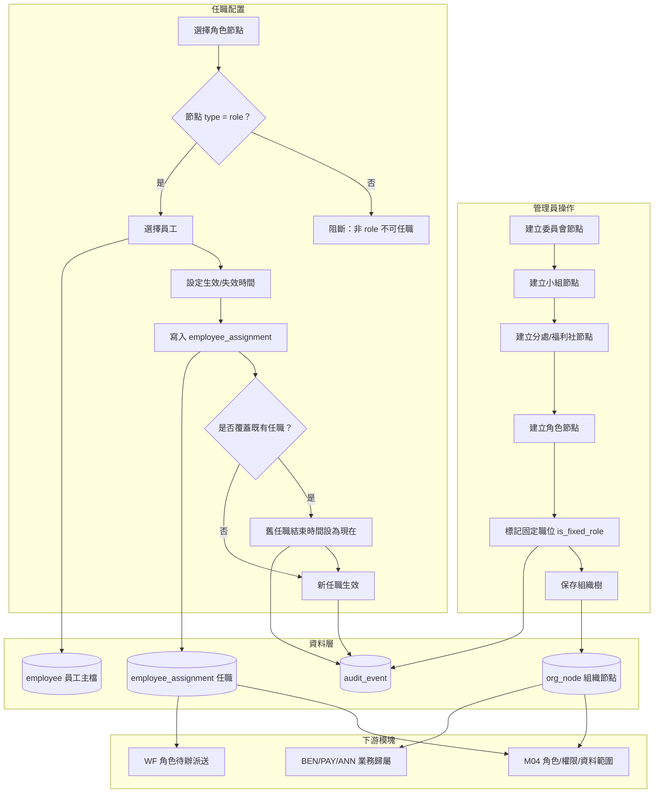
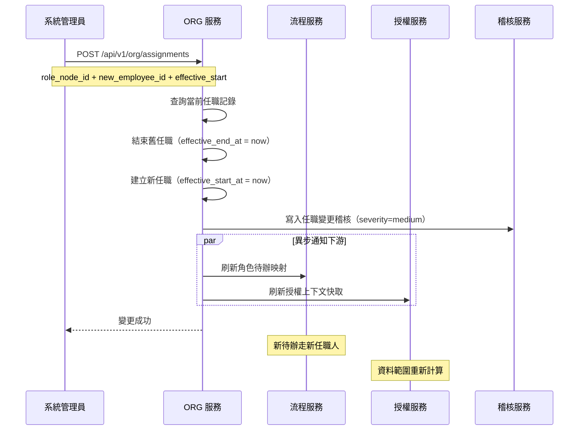
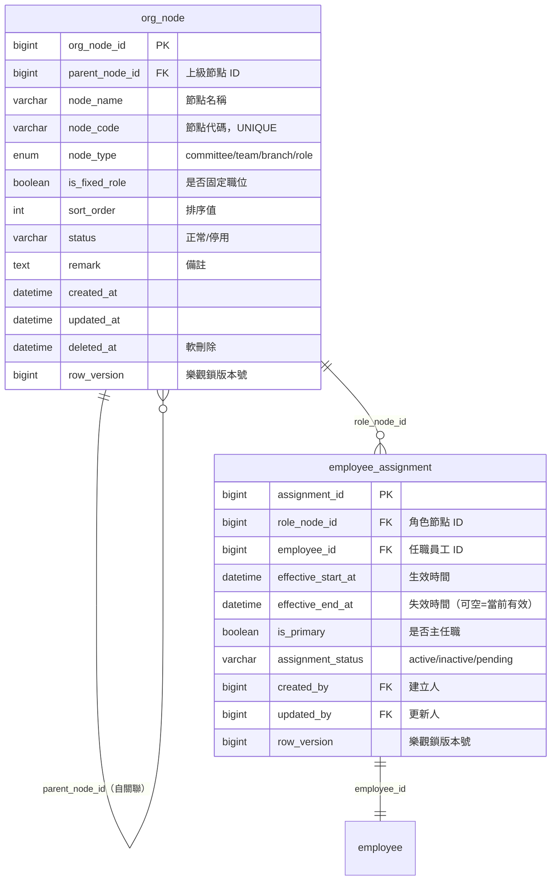
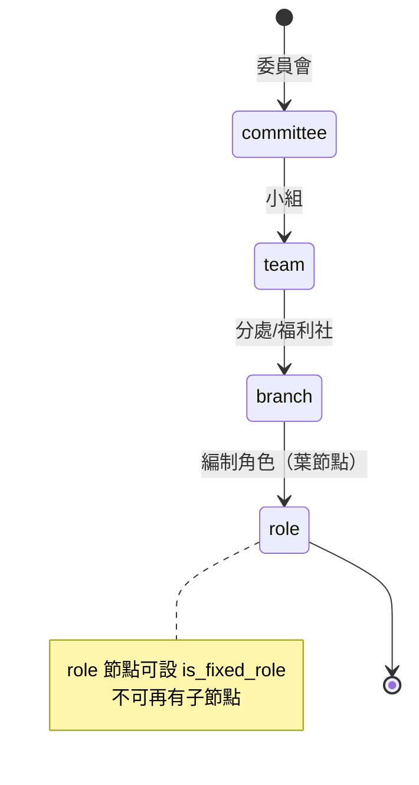

# PRD_M03_ORG_Tree_v2_20260703

> 版本：v2 | 日期：2026-07-03 | 模塊類型：後台頁面模塊 | 所屬領域：ORG 組織管理

---

## 1. 模塊概述

### 1.1 功能定位

本模塊是整個平台組織治理的骨架層，負責把福利平台中的委員會、小組、分處/福利社、編制角色節點，整理成一棵可配置、可追溯、可被其他模塊依賴的組織樹，並提供任職配置能力，將具體員工掛載到對應職位或節點上。

### 1.2 業務價值

- 建立平台唯一可信的組織樹，統一委員會、小組、分處/福利社與編制角色節點的表達方式
- 將制度型固定職位（`is_fixed_role`）與臨時人員任職分開治理，確保制度崗位不因人事變動被刪除
- 為 M04 的角色授權、資料範圍、WF 的角色待辦與後續業務資料歸屬提供穩定的組織主鍵與任職上下文

### 1.3 使用角色

| 角色 | 說明 |
|------|------|
| 系統管理員 | 組織樹與任職治理的主要操作者 |
| 福利社承辦人 | 有限查看與自己相關的組織上下文 |
| 審核主管 | 查看與自己相關的組織上下文 |
| 資安稽核人員 | 查看組織變更稽核，不做一般配置 |

### 1.4 模塊核心概念

本模塊回答三個問題：
- **組織長什麼樣**：`org_node` 構成四層樹狀結構（committee → team → branch → role）
- **位子在哪裡**：`role` 節點為制度型職位，`is_fixed_role` 標記固定職位
- **現在誰坐在這個位子上**：`employee_assignment` 記錄當前任職人與歷史任職

---

## 2. 數據流圖

### 2.1 組織樹建立與任職配置數據流



### 2.2 固定職位更換任職交互序列



---

## 3. 數據庫設計

### 3.1 涉及數據表清單

| 表名 | 別名 | 用途 | 所屬模塊 |
|------|------|------|---------|
| `org_node` | ORG-01 | 組織節點表 | ORG |
| `employee_assignment` | ORG-02 | 任職記錄表 | ORG |
| `employee` | EMP-01 | 員工主檔（任職配置引用） | EMP |
| `audit_event` | SEC-01 | 組織變更高風險稽核 | SEC |

### 3.2 ER 圖



### 3.3 關鍵字段說明

**`org_node.node_type` ENUM 層級約束**
```
committee（委員會）→ team（小組）→ branch（分處/福利社）→ role（編制角色）
```

**`org_node.is_fixed_role` 行為規則**
- `true`：制度型職位，不可刪除、不可停用、不可變更類型，只可更換任職人
- `false`：非制度型節點，可停用，可刪除（但需檢查下游引用）

**`employee_assignment` 區間排他約束**
同一 `role_node_id` 下的有效任職區間不可重疊（使用 PostgreSQL range + GiST 排他約束）

---

## 4. 功能需求清單

### 4.1 核心功能點

| 編號 | 名稱 | 優先級 | 詳細說明 | 權限控制 |
|------|------|--------|---------|---------|
| ORG-NODE-01 | 新增組織節點 | P0 | 受限於 `node_type` 四層結構，新增時自動檢查上級節點類型的合法性 | 系統管理員 |
| ORG-NODE-02 | 編輯組織節點 | P0 | 編輯節點名稱、代碼、排序、備註；固定職位不可變更類型 | 系統管理員 |
| ORG-NODE-03 | 查看組織樹 | P0 | 以樹狀結構展示全部組織節點，支援展開/收合、搜尋 | 所有管理端角色 |
| ORG-NODE-04 | 停用/啟用節點 | P0 | 非固定職位可停用；停用前須檢查下游引用（流程模板、資料範圍） | 系統管理員 |
| ORG-NODE-05 | 固定職位標記 | P0 | `is_fixed_role` 標記；固定職位不可刪除、不可停用 | 系統管理員 |
| ORG-ASGN-01 | 配置任職 | P0 | 為 `role` 類型節點指定任職員工，設定生效/失效時間 | 系統管理員 |
| ORG-ASGN-02 | 更換任職人 | P0 | 固定職位更換任職人：舊任職結束，新任職開始 | 系統管理員 |
| ORG-ASGN-03 | 查看任職歷史 | P1 | 查看角色節點的歷史任職記錄（含時間區間、任職人） | 系統管理員、審核主管 |
| ORG-ASGN-04 | 組織變更影響提示 | P1 | 節點結構調整或任職人變更時，提示可能影響的待辦、授權、資料範圍 | 系統管理員 |
| ORG-ASGN-05 | 組織引用檢查 | P1 | 刪除/停用節點前，檢查是否被流程模板、資料範圍、未完成待辦引用 | 系統管理員 |
| ORG-QRY-01 | 組織查詢 API | P0 | 提供給其他模塊的查詢能力：getOrgTree、getCurrentAssignee、listAssignmentsByEmployee | 系統自動 |

### 4.2 功能權限矩陣

| 功能 | 系統管理員 | 承辦人 | 審核主管 | 資安稽核 |
|------|-----------|--------|---------|---------|
| 查看組織樹 | ✓ | ✓（所轄） | ✓（所轄） | ✓ |
| 新增/編輯節點 | ✓ | - | - | - |
| 停用節點 | ✓ | - | - | - |
| 配置/更換任職 | ✓ | - | - | - |
| 查看任職歷史 | ✓ | ✓（所轄） | ✓（所轄） | ✓ |
| 查看變更稽核 | - | - | - | ✓ |

---

## 5. 用例文檔

### 用例 5.1：系統管理員建立完整組織樹

- **前置條件**：系統管理員已登入 Admin Console，具組織管理權限
- **操作步驟**：
  1. 進入「組織與權限 → 組織樹管理」
  2. 點擊「新增根節點」，選擇類型 `committee`，填寫委員會名稱
  3. 選中委員會節點，點擊「新增下級節點」，選擇類型 `team`
  4. 選中小組節點，點擊「新增下級節點」，選擇類型 `branch`
  5. 選中分處節點，點擊「新增下級節點」，選擇類型 `role`
  6. 勾選「是否為固定職位」，填寫角色名稱
  7. 保存，系統校驗層級合法性
- **預期結果**：組織樹展示完整的四層結構
- **異常處理**：
  - 嘗試建立 `committee` 以外的根節點：阻斷，提示根節點必須為 committee
  - 嘗試在 `role` 下新增子節點：阻斷，role 為葉節點不可再有子節點
  - 節點代碼重複：阻斷，提示代碼已存在

### 用例 5.2：固定職位更換任職人

- **前置條件**：某分處的審核主管（固定職位）離職，原任職人為張三
- **操作步驟**：
  1. 進入「組織與權限 → 任職配置」
  2. 選擇審核主管角色節點
  3. 檢視當前任職人：張三
  4. 點擊「更換任職人」
  5. 選擇新任職人：李四
  6. 設定生效時間：立即生效
  7. 系統提示變更影響（待辦、授權、資料範圍）
  8. 確認提交
  9. 系統：舊任職結束時間設為現在，新任職開始時間設為現在
  10. 系統寫入稽核，異步通知 WF 刷新待辦映射
- **預期結果**：新任職人李四立即獲得該角色的待辦與權限
- **異常處理**：
  - 李四已任職於同一角色節點（區間重疊）：GiST 排他約束阻斷
  - 節點有在途待辦：提示管理員可選擇保留給原處理人或轉派

### 用例 5.3：組織節點停用前引用檢查

- **前置條件**：某分處節點被流程模板和資料範圍引用
- **操作步驟**：
  1. 系統管理員嘗試停用分處節點
  2. 系統執行引用檢查
  3. 檢查結果：被 2 個流程模板引用、被 3 個資料範圍規則引用
  4. 系統展示引用清單明細
  5. 提示：如繼續停用，以下功能將受影響...
  6. 系統管理員評估後決定是否繼續
- **預期結果**：管理員獲得完整的引用影響資訊，可做出知情決策
- **異常處理**：
  - 節點下有未完成待辦：提示必須先處理待辦或轉派
  - 節點下有關聯的未結案補助案件：提示但不強制阻斷

### 用例 5.4：查詢員工當前任職

- **前置條件**：員工張三可能任職於多個角色節點
- **操作步驟**：
  1. 系統管理員進入任職配置頁
  2. 點擊「依員工查詢」
  3. 搜尋「張三」
  4. 系統展示張三的全部有效任職列表（含角色節點、所屬組織、生效時間）
- **預期結果**：展示完整的任職清單，包含多任職情況
- **異常處理**：
  - 員工無任職記錄：顯示「該員工目前無任職配置」
  - 員工已離職（`employment_status` = `retired`）：標記為離職狀態

---

## 6. 界面與交互要求

### 6.1 頁面佈局原則

**組織樹管理頁（左右分欄）：**
- 左側：組織樹區，以縮排 + 圖標展示節點類型
  - `committee`：建築圖標
  - `team`：群組圖標
  - `branch`：位置圖標
  - `role`：人員圖標（固定職位加鎖定徽章）
- 右側：節點詳情區
  - 節點名稱、代碼、類型、上級節點、排序值、是否固定職位、狀態、備註
  - 操作按鈕：新增下級、編輯、停用（非固定）、啟用、查看任職、查看引用影響

**任職配置頁（詳情抽屜）：**
- 角色節點摘要卡
- 當前任職人區（姓名、員編、生效時間）
- 歷史任職列表（時間軸樣式）
- 更換任職人彈窗（員工搜尋 + 生效時間設定）

### 6.2 關鍵交互規則

1. **只能對 `role` 節點配置任職**：其他類型節點不顯示任職配置入口
2. **固定職位不可刪除/停用**：UI 中隱藏或禁用刪除/停用按鈕，後端 API 雙重保護
3. **更換任職時自動結束舊任職**：不允許手動輸入結束時間，由系統計算
4. **引用檢查在停用/刪除前自動觸發**：展示影響清單後才可繼續操作
5. **樹狀結構拖曳排序**：支援同層級節點拖曳調整順序（需做循環依賴檢查）

### 6.3 組織節點類型層級約束



---

## 7. API 接口規格

### 7.1 端點定義

#### GET /api/v1/org/tree

獲取完整組織樹。

**Query Parameters：**
| 參數 | 類型 | 必填 | 說明 |
|------|------|------|------|
| `include_disabled` | boolean | 否 | 是否包含停用節點 |

**Response 200：**
```json
{
  "tree": [
    {
      "org_node_id": 1,
      "node_name": "臺鐵職福委員會",
      "node_code": "TRA_WELFARE",
      "node_type": "committee",
      "status": "active",
      "sort_order": 1,
      "children": [
        {
          "org_node_id": 10,
          "node_name": "第一小組",
          "node_type": "team",
          "children": [
            {
              "org_node_id": 100,
              "node_name": "臺北分處",
              "node_type": "branch",
              "children": [
                {
                  "org_node_id": 1001,
                  "node_name": "福利承辦人",
                  "node_type": "role",
                  "is_fixed_role": true,
                  "current_assignee": { "employee_id": 123, "full_name": "張三" }
                }
              ]
            }
          ]
        }
      ]
    }
  ]
}
```

#### POST /api/v1/org/nodes

新增組織節點。

**Request：**
```json
{
  "parent_node_id": 1,
  "node_name": "臺北分處",
  "node_code": "BRANCH_TPE",
  "node_type": "branch",
  "is_fixed_role": false,
  "sort_order": 1,
  "remark": "臺北地區分處"
}
```

**Response 201：**
```json
{
  "org_node_id": 100,
  "node_name": "臺北分處",
  "node_code": "BRANCH_TPE",
  "node_type": "branch",
  "status": "active"
}
```

**錯誤碼：**
| 錯誤碼 | HTTP 狀態 | 說明 |
|--------|----------|------|
| ORG-001 | 400 | 上級節點類型不允許此子節點類型 |
| ORG-002 | 409 | 節點代碼已存在 |
| ORG-003 | 400 | `is_fixed_role` 只適用於 `role` 類型節點 |
| ORG-004 | 404 | 上級節點不存在或已停用 |

#### PUT /api/v1/org/nodes/{node_id}

編輯組織節點。

**Request：**
```json
{
  "node_name": "臺北分處（更新後）",
  "sort_order": 2,
  "row_version": 1
}
```

**Response 200：**
```json
{
  "org_node_id": 100,
  "node_name": "臺北分處（更新後）"
}
```

**錯誤碼：**
| 錯誤碼 | HTTP 狀態 | 說明 |
|--------|----------|------|
| ORG-005 | 409 | 資料已被他人修改（row_version 不匹配） |
| ORG-006 | 403 | 固定職位不可更改 node_type |

#### DELETE /api/v1/org/nodes/{node_id}

刪除組織節點（軟刪除）。

**Response 200：**
```json
{
  "deleted": true,
  "referenced_by": null
}
```

**錯誤碼：**
| 錯誤碼 | HTTP 狀態 | 說明 |
|--------|----------|------|
| ORG-007 | 403 | 固定職位不可刪除 |
| ORG-008 | 409 | 節點被以下項目引用，請先處理... |

#### POST /api/v1/org/nodes/{node_id}/check-references

檢查節點引用。

**Response 200：**
```json
{
  "has_references": true,
  "references": {
    "workflow_templates": ["審核流程_A"],
    "data_scope_rules": ["資料範圍規則_B"],
    "active_assignments": ["張三"],
    "pending_tasks": 3
  }
}
```

#### POST /api/v1/org/assignments

配置或更換任職。

**Request：**
```json
{
  "role_node_id": 1001,
  "employee_id": 123,
  "effective_start_at": "2026-07-03T00:00:00Z",
  "is_primary": true,
  "idempotency_key": "uuid-v4"
}
```

**Response 200：**
```json
{
  "assignment_id": 5001,
  "role_node_id": 1001,
  "employee_id": 123,
  "effective_start_at": "2026-07-03T00:00:00Z",
  "previous_assignment_ended": true
}
```

**錯誤碼：**
| 錯誤碼 | HTTP 狀態 | 說明 |
|--------|----------|------|
| ORG-010 | 400 | 只有 `role` 節點可配置任職 |
| ORG-011 | 409 | 同一角色節點任職區間重疊 |
| ORG-012 | 404 | 員工不存在 |
| ORG-013 | 400 | 員工不在職（`employment_status` ≠ `active`） |

#### GET /api/v1/org/assignments

查詢任職記錄。

**Query Parameters：**
| 參數 | 類型 | 必填 | 說明 |
|------|------|------|------|
| `role_node_id` | int | 否 | 按角色節點查詢 |
| `employee_id` | int | 否 | 按員工查詢 |
| `include_history` | boolean | 否 | 是否包含歷史任職 |
| `page` | int | 否 | 分頁 |
| `size` | int | 否 | 每頁筆數 |

#### GET /api/v1/org/nodes/{node_id}/current-assignee

查詢指定角色節點當前任職人。

**Response 200：**
```json
{
  "assignment_id": 5001,
  "employee_id": 123,
  "employee_no": "A12345",
  "full_name": "張三",
  "effective_start_at": "2026-07-01T00:00:00Z",
  "is_primary": true
}
```

---

## 8. 非功能性需求

### 8.1 性能指標

| 指標 | 目標值 |
|------|--------|
| 組織樹查詢（完整樹，1000 節點） | < 500ms |
| 任職查詢（單一節點） | < 200ms |
| 更換任職響應時間 | < 1s（含異步通知） |
| 引用檢查響應時間 | < 500ms |

### 8.2 安全要求

- 組織節點新增/刪改：高風險操作，寫入 `audit_event`
- 固定職位不可刪除/停用：後端 API 與資料庫層雙重保護
- 任職變更需記錄前後差異（誰入職、誰離職）

### 8.3 可用性標準

- 組織樹查詢服務 ≥ 99.9%
- 任職變更後，WF 待辦映射刷新 ≤ 30s（非同步事件）

---

## 9. 隱含需求補充

### 9.1 審計日誌

以下事件寫入 `audit_event`：

| 事件 | severity | 說明 |
|------|---------------|------|
| 組織節點新增 | medium | 記錄節點名稱、上級、類型 |
| 組織節點編輯 | info | 記錄變更前後差異 |
| 組織節點停用 | high | 需記錄停用原因（必填） |
| 固定職位任職變更 | medium | 記錄新舊任職人 |
| 非 role 節點嘗試任職 | warning | 阻斷後記錄 |
| 固定職位嘗試刪除 | high | 阻斷後記錄 |

### 9.2 數據一致性

- 任職變更的事務邊界：結束舊任職 + 建立新任職 + 寫入稽核在同一事務
- `employee_assignment` 的 GiST 排他約束防止區間重疊
- 節點 `status` 變更時，須檢查所有子節點是否存在有效引用

### 9.3 並發控制（row_version 樂觀鎖）

- `org_node` 使用 `row_version`，防止多人同時編輯同一節點
- `employee_assignment` 使用 `row_version`，防止任職變更覆蓋

### 9.4 冪等性保障（Idempotency-Key）

- `POST /org/assignments`：相同 `role_node_id` + `employee_id` + 生效時間的請求，返回相同結果

### 9.5 邊界情況處理

1. **非 role 節點不可直接任職**：委員會、小組、分處不應直接配置任職人
2. **同一角色節點任職區間重疊**：GiST 排他約束自動阻斷
3. **節點停用但仍被引用**：出引用檢查提示，管理員可選擇強制停用
4. **有功能權限但無資料範圍**：不應在本模塊報錯，遵循 M04 的空列表原則
5. **停用角色後待辦處理**：已停用角色不可繼續收到待辦，既有待辦可保留或轉派
