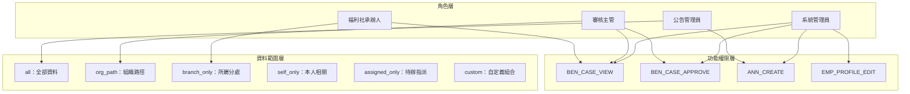
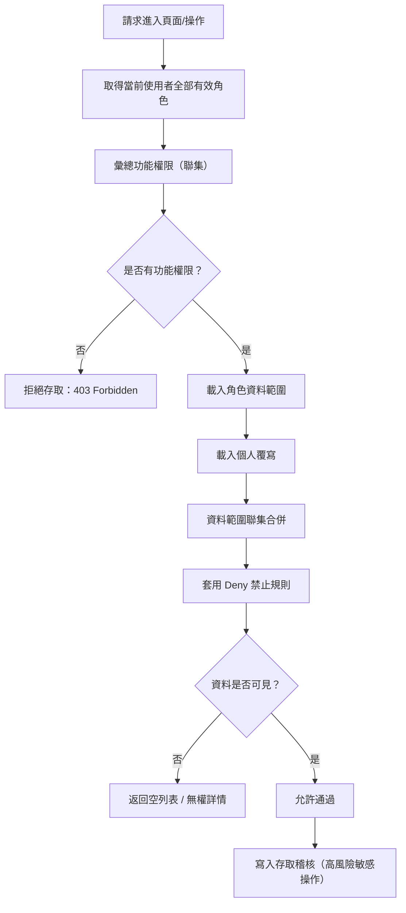
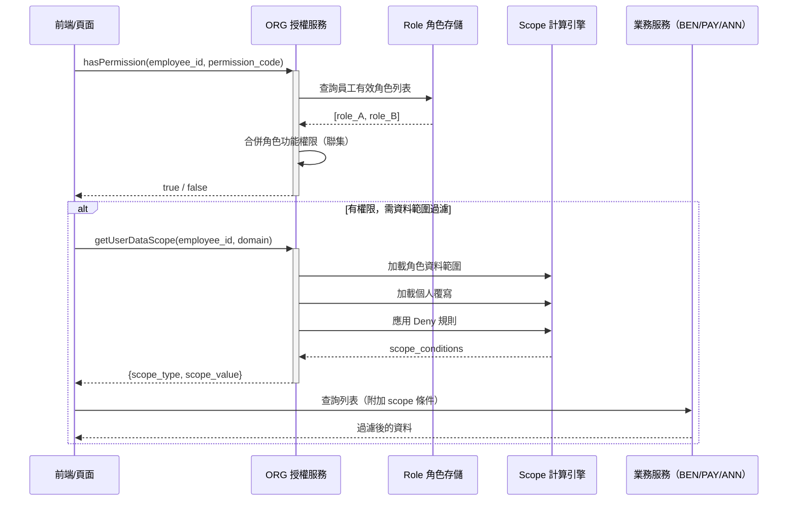
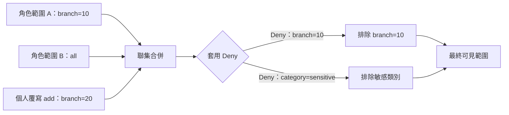
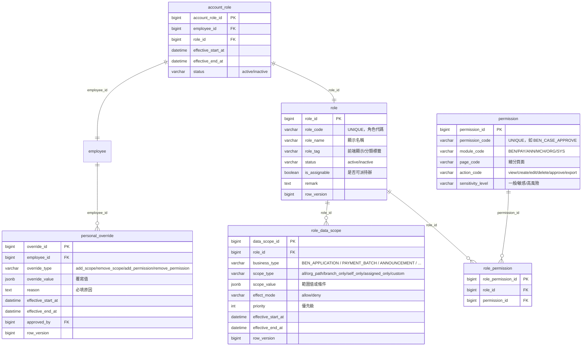
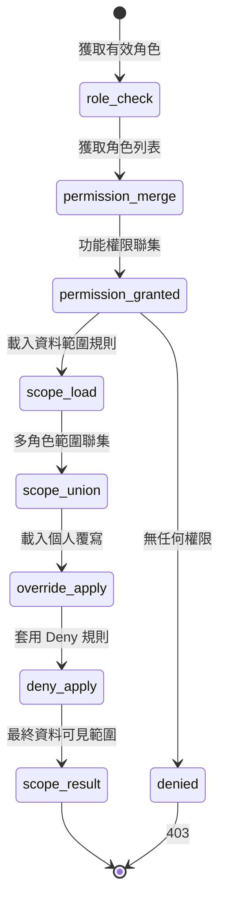

# PRD_M04_ORG_RBAC_v2_20260703

> 版本：v2 | 日期：2026-07-03 | 模塊類型：後台頁面模塊 | 所屬領域：ORG 組織管理

---

## 1. 模塊概述

### 1.1 功能定位

本模塊是整個平台「誰能做什麼、能看到什麼」的治理核心。基於 M03 的組織骨架與任職配置，在此基礎上建立「角色-功能權限-資料範圍」三層 RBAC 模型，支援角色繼承、多角色合併、Deny 優先規則及個人覆寫。

### 1.2 業務價值

- 建立統一的 RBAC 權限治理方式，將後台功能點、操作權限與角色映射標準化
- 建立可落地的資料範圍控制模型，支撐列表、詳情、待辦、查詢等場景的資料可見性判斷
- 明確多角色合併規則：「功能權限可疊加、資料範圍聯集、Deny 優先」
- `custom` 自定義範圍只允許預設條件組合，不允許任意 SQL，防止權限治理失控

### 1.3 使用角色

| 角色 | 說明 |
|------|------|
| 系統管理員 | 主要配置者：角色管理、功能權限、資料範圍、deny、個人覆寫 |
| 資安稽核人員 | 可查核權限變更，但不做一般授權配置 |
| 其他管理角色 | 原則上只讀或受限查看 |

### 1.4 RBAC 三層模型



---

## 2. 數據流圖

### 2.1 權限判斷決策流程



### 2.2 跨模塊授權調用序列



### 2.3 Deny 優先計算流程



---

## 3. 數據庫設計

### 3.1 涉及數據表清單

| 表名 | 別名 | 用途 | 所屬模塊 |
|------|------|------|---------|
| `role` | ORG-03 | 角色主資料 | ORG |
| `role_permission` | ORG-04 | 角色-功能權限映射 | ORG |
| `role_data_scope` | ORG-05 | 角色-資料範圍規則 | ORG |
| `account_role` | ORG-06 | 帳號-角色指派 | ORG |
| `personal_override` | ORG-07 | 個人資料範圍覆寫 | ORG |
| `deny_rule` | ORG-08 | Deny 禁止規則 | ORG |
| `permission` | ORG-09 | 功能權限字典 | ORG |
| `employee` | EMP-01 | 員工主檔（授權對象） | EMP |
| `audit_event` | SEC-01 | 權限變更高風險稽核 | SEC |

### 3.2 ER 圖



### 3.3 關鍵字段說明

**`role_data_scope.scope_type` 資料範圍類型**

| 值 | 說明 | 使用場景 |
|----|------|---------|
| `all` | 全部資料 | 系統管理員、資安人員 |
| `org_path` | 某組織路徑下全部資料 | 審核主管查看所轄分處 |
| `branch_only` | 僅所屬 branch | 承辦人只看自己分處 |
| `self_only` | 僅本人相關資料 | 職工只看自己申請 |
| `assigned_only` | 僅待辦/指派資料 | 待辦工作台 |
| `custom` | 預設條件組合（非 SQL） | 特殊權限場景 |

**Deny 規則設計**
Deny 是最終裁剪器，優先級最高。當角色 A 允許某範圍但角色 B deny 該範圍時，最終以 deny 為準。

---

## 4. 功能需求清單

### 4.1 核心功能點

| 編號 | 名稱 | 優先級 | 詳細說明 | 權限控制 |
|------|------|--------|---------|---------|
| ORG-RBAC-01 | 角色管理 | P0 | 新增/編輯/啟用/停用角色，設定角色標籤、可派待辦標記 | 系統管理員 |
| ORG-RBAC-02 | 功能權限配置 | P0 | 為角色分配頁面級與動作級功能點（三層樹：模塊→頁面→動作） | 系統管理員 |
| ORG-RBAC-03 | 資料範圍配置 | P0 | 為角色設定各業務域的資料可見範圍（scope_type + scope_value） | 系統管理員 |
| ORG-RBAC-04 | 角色指派（帳號-角色） | P0 | 將角色指派給員工，設定生效/失效時間 | 系統管理員 |
| ORG-RBAC-05 | 個人覆寫 | P1 | 為特定員工增加或縮減資料範圍（需填原因、有效期、核准人） | 系統管理員 |
| ORG-RBAC-06 | Deny 規則配置 | P1 | 在聯集結果上做最終裁剪，支援按組織或分類 deny | 系統管理員 |
| ORG-RBAC-07 | 授權模擬 | P1 | 選擇員工查看其全部有效角色、功能權限合併結果、資料範圍計算結果 | 系統管理員、資安稽核 |
| ORG-RBAC-08 | 授權結果快取 | P1 | 角色停用、資料範圍變更後即時失效快取 | 系統自動 |
| ORG-RBAC-09 | 權限變更高風險稽核 | P0 | 所有角色/權限/資料範圍/Deny/個人覆寫變更寫入稽核 | 系統自動 |

### 4.2 功能權限矩陣

| 功能 | 系統管理員 | 資安稽核 |
|------|-----------|---------|
| 角色 CRUD | ✓ | - |
| 功能權限配置 | ✓ | - |
| 資料範圍配置 | ✓ | - |
| 角色指派 | ✓ | - |
| 個人覆寫 | ✓ | - |
| Deny 規則 | ✓ | - |
| 授權模擬 | ✓ | ✓（只讀） |
| 查核變更稽核 | ✓ | ✓ |

---

## 5. 用例文檔

### 用例 5.1：系統管理員建立福利社承辦人角色並配置權限

- **前置條件**：系統管理員已登入 Admin Console，具權限管理權限
- **操作步驟**：
  1. 進入「組織與權限 → 角色管理」
  2. 點擊「新增角色」，填寫角色代碼 `BENEFIT_CLERK`、角色名稱「福利社承辦人」
  3. 設定角色標籤，啟用「可派待辦」
  4. 保存角色
  5. 進入「功能權限配置」
  6. 為該角色勾選功能點：
     - `BEN_CASE_VIEW`：補助案件檢視
     - `BEN_CASE_REVIEW`：補助案件初審
     - `PAY_BATCH_CREATE`：撥款批次建立
     - 不勾選 `BEN_CASE_APPROVE`（核准權限僅主管）
  7. 進入「資料範圍配置」
  8. 設定業務域 `BEN_APPLICATION` 的範圍類型為 `branch_only`
  9. 保存配置
- **預期結果**：福利社承辦人只能查看和初審所屬分處的補助案件，不能核准
- **異常處理**：
  - 角色代碼重複：阻斷，提示已存在
  - 嘗試為不可派待辦角色設定待辦相關範圍：提示警告

### 用例 5.2：同一員工具備多角色的權限合併

- **前置條件**：員工張三同時具備「福利社承辦人」與「公告管理員」角色
- **操作步驟**：
  1. 進入「組織與權限 → 授權模擬」
  2. 搜尋員工張三
  3. 系統展示張三的全部有效角色
  4. 功能權限合併結果（聯集）：
     - 承辦人權限：BEN_CASE_VIEW, BEN_CASE_REVIEW, PAY_BATCH_CREATE
     - 公告管理員權限：ANN_CREATE, ANN_EDIT, ANN_PUBLISH
     - 合併後：同時具備以上所有權限
  5. 資料範圍合併結果：
     - 承辦人：branch_only（分處 10）
     - 公告管理員：all（全部）
     - 聯集後：全部資料
  6. 如果有 Deny 規則：須在聯集後裁剪
- **預期結果**：張三可同時使用兩個角色的功能，資料範圍為聯集後再套用 Deny
- **異常處理**：
  - 角色停用：該角色不參與合併
  - 角色已過生效期：該角色不參與合併

### 用例 5.3：有頁面權限但無資料範圍

- **前置條件**：員工李四具有 BEN_CASE_VIEW 權限，但資料範圍規則結果為空
- **操作步驟**：
  1. 李四點擊「補助案件管理」
  2. 系統檢查功能權限 → `BEN_CASE_VIEW` = true → 允許進入頁面
  3. 頁面載入時請求資料列表
  4. 系統計算資料範圍 → 結果為空
  5. 頁面顯示空列表 + 提示「目前沒有可查看的案件」
- **預期結果**：不報系統錯誤，顯示空列表
- **異常處理**：
  - 不應顯示 500 錯誤頁面
  - 不應顯示「權限不足」的錯誤提示（因為功能權限是有的）

### 用例 5.4：Deny 規則優先裁剪

- **前置條件**：員工王五的資料範圍聯集結果包含 branch=10 全部資料，但 deny 規則禁止查看特定敏感分類
- **操作步驟**：
  1. 管理員設定 deny 規則：禁止 `branch=10 AND category=sensitive`
  2. 王五查詢 branch=10 的案件列表
  3. 系統計算聯集範圍：`branch=10`（全部）
  4. 系統套用 deny：排除 `category=sensitive` 的案件
  5. 返回過濾後的列表（不包含敏感分類案件）
- **預期結果**：敏感分類案件從王五的可見列表中移除
- **異常處理**：
  - 聯集 + deny 後完全為空：返回空列表，不報錯
  - Deny 規則衝突（多條 deny 指向同一範圍）：以優先級最高的 deny 為準

### 用例 5.5：權限變更後即時生效

- **前置條件**：系統管理員停用角色 A，該角色原本已指派給員工趙六
- **操作步驟**：
  1. 系統管理員進入角色管理，將角色 A 設為「停用」
  2. 系統檢查引用（流程待辦、授權上下文）
  3. 提示影響：角色 A 關聯 3 個流程模板、15 名員工
  4. 管理員確認停用
  5. 系統更新角色狀態為 inactive
  6. 系統失效相關授權快取
  7. 系統異步通知 WF 刷新待辦
  8. 趙六下一次請求時，角色 A 的權限不再生效
- **預期結果**：角色 A 停用後，趙六立刻失去該角色的所有權限，不再收到該角色的待辦
- **異常處理**：
  - 趙六正在進行中的審批操作：不中斷當前請求，但後續操作不可再使用該角色權限
  - 在途待辦：保留給原處理人，但管理員可轉派

---

## 6. 界面與交互要求

### 6.1 頁面佈局原則

**角色管理頁（列表 + 詳情抽屜）：**
- 角色列表：role_code、role_name、role_tag、status、is_assignable、更新時間、更新人
- 角色詳情抽屜：基本資訊 + 狀態 + 引用影響提示
- 操作：新增、編輯、停用/啟用、查看授權、查看引用

**功能權限配置頁（左-中-右三欄）：**
- 左欄：角色選擇區（下拉或卡片選擇）
- 中欄：功能樹（三層：模塊→頁面→動作），支援全選/半選
- 右欄：權限摘要區 + 變更差異提示

**資料範圍配置頁（Tab 切換）：**
- 角色摘要卡（固定頂部）
- 業務域 Tab：BEN / PAY / ANN / MCH / EMP
- 範圍類型設定區（scope_type 下拉 + scope_value 選取）
- `custom` 條件構造區（僅允許預設條件組合，不可輸入 SQL）
- Deny 規則區
- 結果預覽區（聯集前 vs deny 後）

**授權模擬頁（上查詢 + 下結果）：**
- 上方：員工搜尋
- 下方：有效角色列表 → 功能權限合併結果 → 資料範圍計算過程展示

### 6.2 關鍵交互規則

1. **功能樹支援全選/半選**：半選狀態表示部分子節點被選中
2. **敏感操作需二次確認**：如「核准」權限的配置、Deny 規則新增
3. **儲存前展示變更 diff**：讓管理員確認本次改動
4. **`custom` 不可輸入 SQL**：使用表單條件選擇器，預設條件白名單
5. **授權模擬結果可導出**：用於測試與治理驗證
6. **高風險變更須填寫原因**：個人覆寫、Deny 規則、批量授權等

### 6.3 權限計算狀態機



---

## 7. API 接口規格

### 7.1 端點定義

#### POST /api/v1/org/roles

新增角色。

**Request：**
```json
{
  "role_code": "BENEFIT_CLERK",
  "role_name": "福利社承辦人",
  "role_tag": "clerk",
  "is_assignable": true,
  "remark": "分處層級承辦人"
}
```

**Response 201：**
```json
{
  "role_id": 10,
  "role_code": "BENEFIT_CLERK",
  "role_name": "福利社承辦人",
  "status": "active"
}
```

**錯誤碼：**
| 錯誤碼 | HTTP 狀態 | 說明 |
|--------|----------|------|
| ORG-020 | 409 | 角色代碼已存在 |
| ORG-021 | 400 | 角色名稱不可為空 |

#### PUT /api/v1/org/roles/{role_id}

編輯角色（含啟用/停用）。

**Request：**
```json
{
  "role_name": "福利社承辦人（更新）",
  "is_assignable": false,
  "status": "inactive",
  "row_version": 1
}
```

**Response 200：**
```json
{
  "role_id": 10,
  "status": "inactive",
  "row_version": 2
}
```

**錯誤碼：**
| 錯誤碼 | HTTP 狀態 | 說明 |
|--------|----------|------|
| ORG-022 | 409 | row_version 不匹配 |
| ORG-023 | 409 | 角色被引用中，停用前請先檢查 |

#### GET /api/v1/org/roles/{role_id}/check-references

檢查角色引用。

**Response 200：**
```json
{
  "assigned_employees": 15,
  "referenced_workflow_templates": ["審核流程_A", "公告審批流程_B"],
  "pending_tasks": 5
}
```

#### POST /api/v1/org/role-permissions

配置角色功能權限（全量覆蓋）。

**Request：**
```json
{
  "role_id": 10,
  "permission_codes": [
    "BEN_CASE_VIEW",
    "BEN_CASE_REVIEW",
    "PAY_BATCH_CREATE"
  ],
  "row_version": 1
}
```

**Response 200：**
```json
{
  "role_id": 10,
  "permission_count": 3,
  "row_version": 2
}
```

#### GET /api/v1/org/role-permissions/{role_id}

查詢角色功能權限。

**Response 200：**
```json
{
  "role_id": 10,
  "role_name": "福利社承辦人",
  "permissions": [
    {
      "permission_code": "BEN_CASE_VIEW",
      "module_code": "BEN",
      "page_code": "case_list",
      "action_code": "view",
      "sensitivity_level": "一般"
    }
  ]
}
```

#### POST /api/v1/org/data-scopes

配置角色資料範圍。

**Request：**
```json
{
  "role_id": 10,
  "business_type": "BEN_APPLICATION",
  "scope_type": "branch_only",
  "scope_value": { "branch_ids": [10, 11] },
  "effect_mode": "allow",
  "effective_start_at": "2026-07-03T00:00:00Z",
  "effective_end_at": null,
  "row_version": 1
}
```

**Response 200：**
```json
{
  "data_scope_id": 100,
  "scope_type": "branch_only"
}
```

#### POST /api/v1/org/account-roles

指派角色給員工。

**Request：**
```json
{
  "employee_id": 123,
  "role_id": 10,
  "effective_start_at": "2026-07-03T00:00:00Z",
  "effective_end_at": null,
  "idempotency_key": "uuid-v4"
}
```

**Response 201：**
```json
{
  "account_role_id": 500,
  "employee_id": 123,
  "role_id": 10,
  "status": "active"
}
```

#### POST /api/v1/org/check-permission

授權判斷查詢。

**Request：**
```json
{
  "employee_id": 123,
  "permission_code": "BEN_CASE_APPROVE"
}
```

**Response 200：**
```json
{
  "has_permission": true,
  "roles": ["審核主管"],
  "data_scope": {
    "scope_type": "org_path",
    "scope_value": { "org_node_ids": [10, 11, 12] }
  }
}
```

#### POST /api/v1/org/simulate-authorization

授權模擬。

**Request：**
```json
{
  "employee_id": 123
}
```

**Response 200：**
```json
{
  "employee_id": 123,
  "full_name": "張三",
  "active_roles": [
    {
      "role_id": 10,
      "role_name": "審核主管",
      "status": "active",
      "effective_start_at": "2026-07-01T00:00:00Z",
      "effective_end_at": null
    }
  ],
  "permissions": {
    "union": ["BEN_CASE_VIEW", "BEN_CASE_APPROVE", "ANN_VIEW"],
    "by_role": {
      "審核主管": ["BEN_CASE_VIEW", "BEN_CASE_APPROVE"],
      "公告管理員": ["ANN_VIEW"]
    }
  },
  "data_scope": {
    "before_deny": { "scope_type": "union", "branches": [10, 11, 12] },
    "deny_rules": [{"branch_id": 12, "reason": "權限隔離"}],
    "after_deny": { "branches": [10, 11] }
  }
}
```

#### GET /api/v1/org/permissions

獲取功能權限字典（模塊樹結構）。

**Response 200：**
```json
{
  "modules": [
    {
      "module_code": "BEN",
      "module_name": "補助管理",
      "pages": [
        {
          "page_code": "case_list",
          "page_name": "案件列表",
          "actions": [
            { "action_code": "view", "action_name": "檢視", "sensitivity": "一般" },
            { "action_code": "approve", "action_name": "核准", "sensitivity": "敏感" }
          ]
        }
      ]
    }
  ]
}
```

---

## 8. 非功能性需求

### 8.1 性能指標

| 指標 | 目標值 |
|------|--------|
| 授權判斷查詢（`checkPermission`）P95 | < 100ms（快取命中）/< 500ms（未命中） |
| 授權模擬響應時間 | < 2s（含多角色計算） |
| 資料範圍過濾後的列表查詢 | < 1s（1000 條資料以內） |
| 權限變更後快取失效時間 | < 30s |

### 8.2 安全要求

- 權限配置本身是高風險操作，所有變更寫入 `audit_event`
- `custom` 不允許輸入任意 SQL，只允許預設條件白名單
- 授權結果可快取，但角色/範圍變更後須即時失效
- 授權模擬僅限系統管理員和資安稽核角色使用
- 所有高風險治理表使用 `row_version` 樂觀鎖

### 8.3 可用性標準

| 指標 | 目標值 |
|------|--------|
| 授權服務可用性 | ≥ 99.9% |
| 授權判斷失敗降級策略 | 返回最小權限（拒絕存取） |
| 快取失效事件可靠送達 | ≥ 99.9%（Outbox 模式） |

---

## 9. 隱含需求補充

### 9.1 審計日誌

以下權限變更事件寫入 `audit_event`：

| 事件 | severity | 說明 |
|------|---------------|------|
| 角色新增 | medium | 記錄角色基本資訊 |
| 角色停用 | high | 記錄受影響的員工數與待辦數 |
| 功能權限變更 | high | 記錄前後 permission 列表 diff |
| 資料範圍變更 | high | 記錄 scope 前後變化 |
| 個人覆寫設定 | high | 記錄覆寫原因（必填） |
| Deny 規則新增/變更 | high | 記錄規則內容 |
| 批量授權/撤權 | high | 記錄範圍與批次編號 |
| 授權模擬查詢 | info | 記錄查詢者與查詢對象 |

### 9.2 數據一致性

- 角色停用的事務邊界：更新角色 `status` + 失效快取 + 寫入稽核 + 通知 WF 在同一事務
- 個人覆寫與 Deny 規則載入順序：先載入角色範圍 + 個人覆寫聯集，最後套用 Deny
- `custom` 範圍的 scope_value 須符合預定義的 JSON Schema

### 9.3 並發控制（row_version 樂觀鎖）

- `role`、`role_permission`、`role_data_scope`、`personal_override` 等所有治理表使用 `row_version`
- 功能權限配置採用全量覆蓋策略（非增量 patch），避免多人同時編輯互相覆蓋

### 9.4 錯誤恢復

- 授權服務暫時不可用時：業務 API 返回最小權限（拒絕），不降級為「全部允許」
- 快取失效事件處理失敗：背景工作者定期輪詢補償
- 授權模擬結果不影響生產權限：計算僅查詢不寫入

### 9.5 邊界情況處理

1. **有功能權限但無資料範圍**：返回空列表，不報系統錯誤（總體 PRD 明確要求）
2. **多角色衝突**：A 角色允許某範圍、B 角色 deny 該範圍 → deny 優先
3. **停用角色**：不參與任何權限合併，不可繼續收到待辦
4. **`custom` 非法表達式**：不允許輸入任意 SQL，由前端預設條件選擇器約束
5. **權限變更並發覆蓋**：`row_version` 樂觀鎖防止多人同時編輯互相覆蓋
6. **歷史資料可見性**：新規則不破壞歷史稽核追溯；當前授權結果控制「現在能不能看」
7. **角色生效/失效時間邊界**：精確到秒，避免「2026-07-03 整天有效」的邊界誤差
