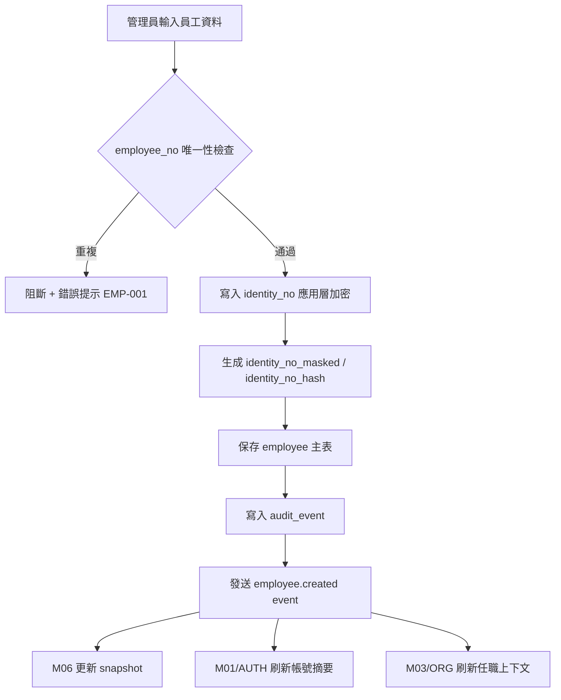
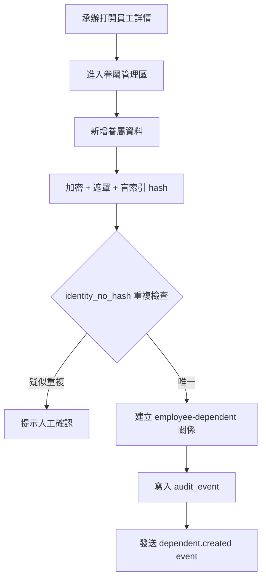
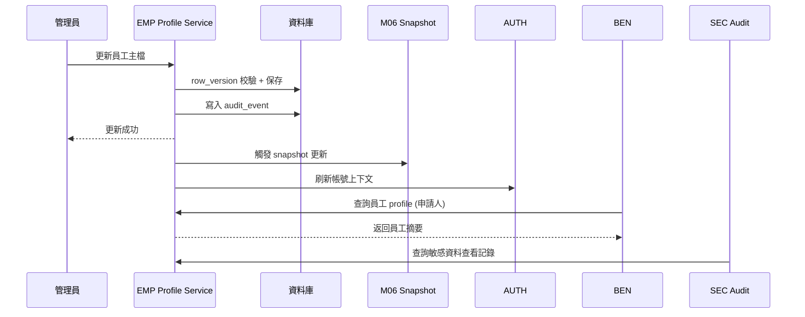
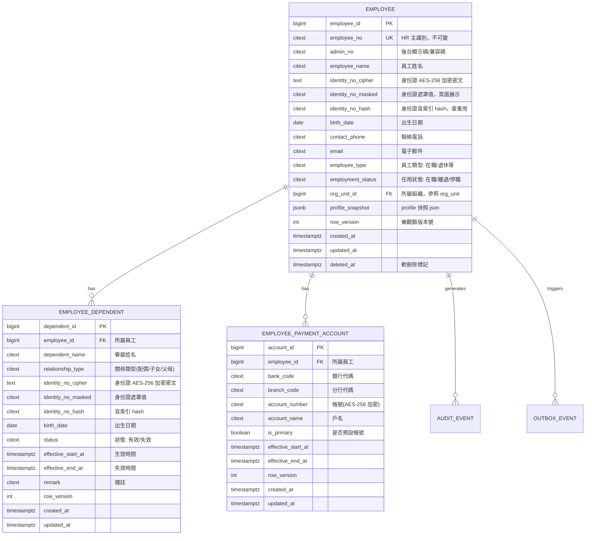
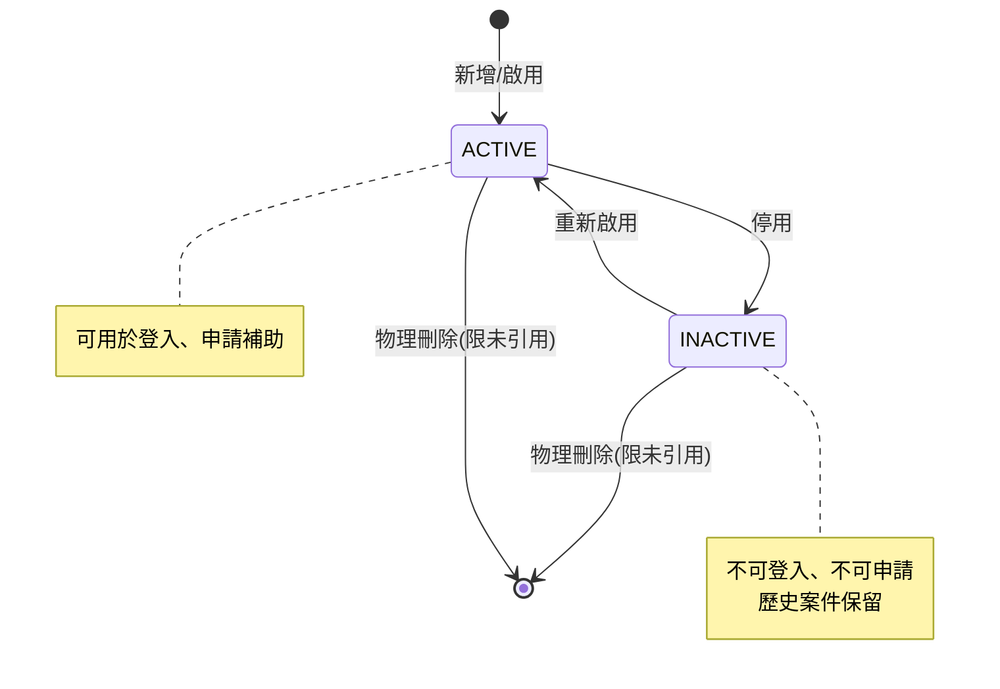

# PRD_M05_EMP_Master_v2_20260703

> 版本：v2 增強版 | 基於舊版 M05 子 PRD、工作說明書 SOW、資料庫優化報告、全域規範 v2 重構

---

## 1. 模塊概述

### 1.1 功能定位

EMP 員工主檔與眷屬管理模塊是整個福利平台的人員資料真源，負責維護「員工本人」與「眷屬」兩層核心人員主資料，為補助申請、資格校驗、流程派送、發款、公告投放、特約商店適用判斷與稽核追溯提供統一的人員主資料基礎。

### 1.2 業務價值

- 建立平台統一的員工主檔，確保所有業務以 `employee_id / employee_no` 為唯一人員識別依據
- 建立完整且可控的眷屬資料管理能力，支撐婚嫁、喪葬、子女教育等福利場景
- 將敏感個資治理內建於主檔設計中，遵守加密、遮罩與不可明文查詢要求
- 為 AUTH、ORG、BEN、PAY、WF、SEC 提供穩定的人員資料引用能力

### 1.3 使用角色

| 角色 | 權限範圍 |
|------|----------|
| 系統管理員 | 完整 CRUD、敏感字段查看、匯出 |
| 福利社承辦人 | 查看、局部維護所轄員工 |
| 審核主管 | 只讀必要範圍 |
| 資安稽核人員 | 查核敏感查看與匯出紀錄 |
| 職工（本人） | 僅查看本人基本資料 |

### 1.4 所屬領域與模塊類型

- **所屬領域**：EMP（Employee，職工人員域）
- **模塊類型**：底層能力模塊
- **依賴**：M07（SYS 字典）、M08（SYS 檔案資源中心）
- **被依賴**：M01/M02（AUTH）、M04（ORG RBAC）、M06（EMP 歷史/快照）、M13/M14/M15（BEN）、M10/M11（WF）

---

## 2. 數據流圖

### 2.1 員工主檔建立與維護數據流



### 2.2 眷屬管理數據流



### 2.3 跨模塊數據流向



---

## 3. 數據庫設計

### 3.1 涉及資料表

| 表名 | 用途 | 類型 |
|------|------|------|
| `employee` | 員工主檔 | 主表（row_version 樂觀鎖） |
| `employee_dependent` | 眷屬資料 | 從表（row_version 樂觀鎖） |
| `employee_payment_account` | 員工撥款帳號 | 從表（row_version 樂觀鎖） |
| `audit_event` | 審計日誌 | 追加寫 |
| `outbox_event` | Outbox 事件佇列 | 追加寫 |

### 3.2 ER 關係圖



### 3.3 關鍵字段說明

#### employee 主表關鍵字段

| 字段 | 約束 | 說明 |
|------|------|------|
| `employee_id` | PK, IDENTITY | 系統內部主鍵 |
| `employee_no` | UK, citext | HR 主識別，建立後不可變更 |
| `identity_no_cipher` | NOT NULL | AES-256 加密存儲，應用層加解密 |
| `identity_no_masked` | NOT NULL | 顯示用遮罩值，如 `A***123***` |
| `identity_no_hash` | NOT NULL | 不可逆盲索引(SHA-256 + salt)，供查重 |
| `org_unit_id` | FK→org_unit | 所屬組織節點 |
| `row_version` | DEFAULT 1 | 樂觀鎖，每次 UPDATE 遞增 |
| `deleted_at` | NULLABLE | 軟刪除標記，唯一索引排除 |

#### employee_dependent 關鍵字段

| 字段 | 約束 | 說明 |
|------|------|------|
| `dependent_id` | PK | 眷屬主鍵 |
| `employee_id` | FK→employee | 所屬員工 |
| `relationship_type` | FK→code_value | 關係類型字典碼 |
| `identity_no_hash` | UNIQUE | 防重複建檔 |
| `effective_start_at/end_at` | range 排他 | 同一員工的同一關係類型區間不可重疊 |

---

## 4. 功能需求清單

### 4.1 員工主檔管理

| ID | 名稱 | 優先級 | 說明 | 權限控制 |
|----|------|--------|------|----------|
| M05-F01 | 員工列表查詢 | P0 | 支援 employee_no、admin_no、姓名、狀態、org_unit_id 篩選 | 查看員工主檔 |
| M05-F02 | 新增員工 | P0 | 錄入 employee_no、姓名、身份資料，應用層自動加密+遮罩+hash | 新增/編輯員工主檔 |
| M05-F03 | 編輯員工 | P0 | 更新員工基本資料，身份證變更時重新計算 masked/hash | 新增/編輯員工主檔 |
| M05-F04 | 啟用/停用員工 | P0 | 停用後不可登入、不可申請補助 | 新增/編輯員工主檔 |
| M05-F05 | 查看主檔引用摘要 | P1 | 顯示該員工被哪些模塊引用(帳號、任職、申請等) | 查看員工主檔 |
| M05-F06 | 批量匯出員工 | P2 | 匯出含敏感欄位需額外權限與稽核 | 匯出主檔(高風險) |
| M05-F07 | 員工撥款帳號管理 | P1 | 維護每位員工的銀行帳號，加密存儲 | 新增/編輯員工主檔 |

### 4.2 眷屬管理

| ID | 名稱 | 優先級 | 說明 | 權限控制 |
|----|------|--------|------|----------|
| M05-F08 | 眷屬列表查詢 | P0 | 按 employee_id 查詢其眷屬 | 查看眷屬 |
| M05-F09 | 新增眷屬 | P0 | 身分資料加密+遮罩+hash，防重複檢查 | 新增/編輯眷屬 |
| M05-F10 | 編輯眷屬 | P0 | 更新眷屬資料 | 新增/編輯眷屬 |
| M05-F11 | 設定眷屬失效 | P1 | 設定 effective_end_at，不物理刪除 | 新增/編輯眷屬 |
| M05-F12 | 眷屬重複提示 | P1 | 若 identity_no_hash 已存在，提示疑似重複 | 查看眷屬 |
| M05-F13 | 查看眷屬引用情況 | P2 | 顯示該眷屬被哪些補助引用 | 查看眷屬 |

### 4.3 敏感資料保護

| ID | 名稱 | 優先級 | 說明 | 權限控制 |
|----|------|--------|------|----------|
| M05-F14 | 身份資料遮罩顯示 | P0 | 列表/詳情頁默認顯示 masked 值 | 查看員工主檔 |
| M05-F15 | 敏感欄位查看稽核 | P0 | 查看明文身份證需寫入 audit_event | 查看敏感字段(高風險) |
| M05-F16 | 明文查詢阻斷 | P0 | 不支持以明文身份證號作為查詢條件 | - |

---

## 5. 用例文檔

### 用例 1：建立員工主檔

**前置條件**：操作者具備「新增/編輯員工主檔」權限

**操作步驟**：
1. 進入員工主檔列表頁 → 點選「新增員工」
2. 填寫 employee_no、姓名、身份證號、email、聯絡電話
3. 選擇所屬組織、員工類型、任用狀態
4. 點選「保存」

**預期結果**：
- employee 表新增一筆記錄
- identity_no 以 AES-256 加密存儲於 `identity_no_cipher`
- 自動生成 `identity_no_masked`(e.g. `A******789`) 與 `identity_no_hash`
- 寫入 audit_event，action_code = `EMP.CREATE_EMPLOYEE`
- 發送 outbox_event: `employee.created`

**異常處理**：
| 異常場景 | 處理方式 | 錯誤碼 |
|----------|----------|--------|
| employee_no 已存在 | 阻斷並提示「員工編號重複」 | EMP-001 |
| 身份證號格式不合法 | 阻斷並提示格式錯誤 | EMP-002 |
| 必填字段缺失 | 前端即時校驗阻止提交 | EMP-003 |

### 用例 2：編輯員工主檔（含版本衝突）

**前置條件**：操作者具備編輯權限，目標員工存在且狀態為啟用

**操作步驟**：
1. 查詢目標員工 → 進入編輯頁面
2. 修改姓名、聯絡電話、email
3. 點選「保存」

**預期結果**：
- 非敏感字段直接更新
- `updated_at` 更新，`row_version` 遞增
- 寫入 audit_event，記錄 before/after 摘要
- 發送 outbox_event: `employee.updated`

**異常處理**：
| 異常場景 | 處理方式 | 錯誤碼 |
|----------|----------|--------|
| row_version 不匹配(他人已修改) | 返回 409 Conflict，提示重新讀取 | EMP-004 |
| 員工已被停用 | 阻斷編輯並提示 | EMP-005 |

### 用例 3：新增眷屬

**前置條件**：員工主檔已存在，操作者具備「新增/編輯眷屬」權限

**操作步驟**：
1. 打開員工詳情頁 → 進入眷屬管理區
2. 點選「新增眷屬」
3. 填寫眷屬姓名、關係類型、身份證號、出生日期
4. 點選「保存」

**預期結果**：
- dependent 表新增記錄
- 自動加密+遮罩+hash 身份資料
- 若 `employee_id + identity_no_hash` 已存在有效記錄，提示「疑似重複」
- 寫入 audit_event

**異常處理**：
| 異常場景 | 處理方式 | 錯誤碼 |
|----------|----------|--------|
| 同一員工的同一關係類型時間區間重疊 | 阻斷並提示區間衝突 | EMP-006 |
| 眷屬身份證號與其他員工的眷屬重複 | 提示人工確認，不強制阻斷 | EMP-007 |

### 用例 4：查看敏感身份資料

**前置條件**：操作者具備「查看敏感字段」權限

**操作步驟**：
1. 在員工詳情頁，點選身份證欄位的「查看」按鈕
2. 系統跳出二次確認對話框
3. 確認後顯示明文身份證號

**預期結果**：
- 寫入 audit_event，severity = `WARN`
- action_code = `EMP.VIEW_SENSITIVE_IDENTITY`
- 記錄查看人、時間

**異常處理**：
| 異常場景 | 處理方式 |
|----------|----------|
| 無敏感字段查看權限 | 遮罩值持續顯示，不顯示查看按鈕 |
| 稽核日誌寫入失敗 | 拒絕顯示明文，返回錯誤 |

### 用例 5：員工停用（含引用檢查）

**前置條件**：操作者具備編輯權限

**操作步驟**：
1. 在員工列表頁選擇目標員工 → 點選「停用」
2. 系統提示「停用後，該員工將無法登入系統與申請補助」
3. 確認後執行停用

**預期結果**：
- `employment_status` 更新為離職或停職
- 寫入 audit_event
- 發送 `employee.status_changed` 事件
- AUTH 收到事件後停用對應帳號
- BEN 在該員工的進行中申請不受影響

**異常處理**：
| 異常場景 | 處理方式 |
|----------|----------|
| 員工仍有進行中補助案件 | 提示但允許停用（案件繼續走完） |
| 員工為唯一帳號管理員 | 阻斷停用，提示需先轉移管理權 |

---

## 6. 界面與交互要求

### 6.1 頁面佈局原則

- **員工主檔列表頁**：上方查詢條件區(employee_no、姓名、狀態、組織)，下方列表區
- **員工詳情頁**：基本資料卡、身份資料區、帳號關聯摘要、任職摘要、眷屬管理區入口、引用摘要
- **眷屬管理抽屜**：員工摘要頭部、眷屬列表、眷屬表單

### 6.2 關鍵交互原則

- 身份證號默認只展示 masked 值，查看明文需二次確認 + 稽核
- 編輯敏感欄位需額外確認對話框
- 停用/刪除前檢查下游引用風險
- 並發編輯時衝突提示：`row_version` 不匹配時彈出「資料已被他人修改，請重新載入」

### 6.3 狀態轉換圖



---

## 7. API 接口規格

### 7.1 員工主檔管理

#### GET /api/v1/employees

查詢員工列表。

**參數**：
| 名稱 | 類型 | 必填 | 說明 |
|------|------|------|------|
| employee_no | string | N | HR 主識別(模糊查詢) |
| keyword | string | N | 姓名/管理編號模糊搜尋 |
| org_unit_id | integer | N | 所屬組織 ID |
| status | string | N | 狀態篩選 |
| page | integer | N | 頁碼(預設 1) |
| size | integer | N | 每頁筆數(預設 20) |

**響應**：
```json
{
  "code": 0,
  "data": {
    "items": [
      {
        "employee_id": 1,
        "employee_no": "TRA001",
        "admin_no": "A001",
        "employee_name": "張三",
        "identity_no_masked": "A******789",
        "org_unit_name": "台北站",
        "employment_status": "active",
        "account_status": "activated",
        "row_version": 3,
        "updated_at": "2026-07-03T10:00:00+08:00"
      }
    ],
    "total": 100,
    "page": 1,
    "size": 20
  }
}
```

**錯誤碼**：無

#### POST /api/v1/employees

新增員工。

**請求**：
```json
{
  "employee_no": "TRA001",
  "admin_no": "A001",
  "employee_name": "張三",
  "identity_no": "A123456789",
  "birth_date": "1990-01-01",
  "contact_phone": "0912345678",
  "email": "zhangsan@railway.gov.tw",
  "org_unit_id": 10,
  "employee_type": "formal",
  "employment_status": "active"
}
```

**響應** (201 Created)：
```json
{
  "code": 0,
  "data": {
    "employee_id": 1,
    "employee_no": "TRA001",
    "row_version": 1
  }
}
```

**錯誤碼**：
| 錯誤碼 | 說明 |
|--------|------|
| EMP-001 | employee_no 重複 |
| EMP-002 | 身份證號格式不合法 |
| EMP-003 | 必填字段缺失 |

#### PUT /api/v1/employees/{employee_id}

更新員工主檔。

**請求 Header**：`Idempotency-Key: uuid-v4`，`X-Row-Version: {current_row_version}`

**請求 Body**：
```json
{
  "employee_name": "張三(更名)",
  "contact_phone": "0998765432",
  "email": "newemail@railway.gov.tw"
}
```

**響應**：
```json
{
  "code": 0,
  "data": {
    "employee_id": 1,
    "row_version": 4
  }
}
```

**錯誤碼**：
| 錯誤碼 | 說明 |
|--------|------|
| EMP-004 | row_version 衝突(409 Conflict) |
| EMP-005 | 員工已停用 |

#### GET /api/v1/employees/{employee_id}

查詢員工詳情。

**響應**：
```json
{
  "code": 0,
  "data": {
    "employee_id": 1,
    "employee_no": "TRA001",
    "employee_name": "張三",
    "identity_no_masked": "A******789",
    "identity_no_cipher": null,
    "email": "z***@railway.gov.tw",
    "contact_phone": "091*****78",
    "org_unit_id": 10,
    "org_unit_name": "台北站",
    "employment_status": "active",
    "row_version": 3,
    "dependents_count": 2,
    "account_summary": {
      "has_account": true,
      "status": "activated"
    }
  }
}
```

> 注意：`identity_no_cipher` 字段預設為 null，僅在請求含 `X-View-Sensitive: true` header 且有權限時返回

### 7.2 眷屬管理

#### GET /api/v1/employees/{employee_id}/dependents

**參數**：
| 名稱 | 類型 | 必填 | 說明 |
|------|------|------|------|
| status | string | N | 篩選有效/無效眷屬 |

**響應**：
```json
{
  "code": 0,
  "data": [
    {
      "dependent_id": 1,
      "dependent_name": "李四",
      "relationship_type": "spouse",
      "relationship_type_label": "配偶",
      "identity_no_masked": "B******456",
      "birth_date": "1992-05-10",
      "status": "active",
      "effective_start_at": "2020-01-01T00:00:00+08:00",
      "effective_end_at": null,
      "row_version": 1
    }
  ]
}
```

#### POST /api/v1/employees/{employee_id}/dependents

**請求 Header**：`Idempotency-Key: uuid-v4`

**請求 Body**：
```json
{
  "dependent_name": "李四",
  "relationship_type": "spouse",
  "identity_no": "B123456789",
  "birth_date": "1992-05-10",
  "effective_start_at": "2020-01-01T00:00:00+08:00"
}
```

**響應** (201 Created)

**錯誤碼**：
| 錯誤碼 | 說明 |
|--------|------|
| EMP-006 | 有效區間與既有記錄重疊 |
| EMP-007 | 疑似重複眷屬(需人工確認) |

#### PUT /api/v1/employees/{employee_id}/dependents/{dependent_id}

**請求 Header**：`X-Row-Version: {current_row_version}`

#### DELETE /api/v1/employees/{employee_id}/dependents/{dependent_id}

邏輯刪除：設定 `effective_end_at` 與 `status = inactive`。若已被補助引用，提示不可刪除。

---

## 8. 非功能性需求

### 8.1 性能指標

| 指標 | 目標值 |
|------|--------|
| 員工列表查詢 (P95) | ≤ 500ms |
| 員工詳情查詢 (P95) | ≤ 300ms |
| 新增/編輯員工 (P95) | ≤ 1s (含加密運算) |
| 眷屬列表查詢 (P95) | ≤ 300ms |
| 並發查詢 | ≥ 100 TPS |

### 8.2 安全要求

- `identity_no` 採用 AES-256 應用層加密存儲，資料庫管理員不可讀明文
- `identity_no_hash` 使用 SHA-256 + 固定 salt 產生不可逆盲索引
- 頁面默認展示 `identity_no_masked`，查看明文需額外權限且寫入稽核
- 不支援以明文身份證號作為查詢條件
- 員工列表 API 默認不返回 `identity_no_cipher` 字段
- 所有高風險操作(敏感查看、匯出、批量編輯)寫入 audit_event
- 傳輸全程 TLS 1.2/1.3
- 撥款帳號加密存儲，查詢時遮罩

### 8.3 可用性標準

- 員工主檔服務 SLA ≥ 99.5%
- 離峰維護窗口可接受 30 分鐘停機
- 資料備份每日自動執行，RPO ≤ 15 分鐘

---

## 9. 隱含需求補充

### 9.1 審計日誌

以下操作必須寫入 `audit_event` 表：

| 操作 | action_code | severity | 說明 |
|------|-------------|----------|------|
| 新增員工 | EMP.CREATE | INFO | 記錄建立者與時間 |
| 編輯員工 | EMP.UPDATE | INFO | 記錄 before/after 摘要 |
| 停用員工 | EMP.DEACTIVATE | WARN | 記錄停用原因 |
| 查看敏感身份資料 | EMP.VIEW_SENSITIVE | WARN | 記錄查看人、時間 |
| 匯出員工清單 | EMP.EXPORT | WARN | 記錄篩選條件、匯出時間 |
| 新增眷屬 | EMP.DEPENDENT.CREATE | INFO | 記錄所屬員工 |
| 編輯眷屬 | EMP.DEPENDENT.UPDATE | INFO | 記錄 before/after |

### 9.2 數據一致性

- `employee_no` 作為 HR 主識別，建立後不可變更
- 員工主檔與眷屬資料透過 `employee_id` FK 強制關聯
- 區間類型欄位(`effective_start_at`/`end_at`)使用 PostgreSQL range + GiST 排他約束，防止重疊
- 身份資料的三個字段(`cipher`/`masked`/`hash`)必須在一次事務中同時寫入，不允許部分寫入
- 軟刪除使用 `deleted_at`，唯一索引排除 `deleted_at IS NOT NULL` 的記錄

### 9.3 並發控制 (row_version 樂觀鎖)

- `employee`、`employee_dependent`、`employee_payment_account` 表都包含 `row_version`
- 前端在編輯前必須先 GET 獲取當前 `row_version`
- PUT/PATCH 請求時在 Header 帶入 `X-Row-Version`
- 後端 UPDATE 時執行 `UPDATE ... WHERE employee_id = ? AND row_version = ?`
- 受影響行數為 0 時返回 409 Conflict
- 前端收到 409 後提示使用者重新載入

### 9.4 錯誤恢復

- 身份資料加密失敗時，整個事務回滾，不允許保存未加密的明文
- 員工主檔保存成功但 audit_event 寫入失敗 → 記錄錯誤日誌、後續離峰補寫
- 員工主檔保存成功但 outbox_event 寫入失敗 → 依賴資料庫事務完整性，兩者同庫寫入
- 夜間校正任務(依賴 M06) 負責補償 event 遺漏造成的 snapshot 不一致

### 9.5 冪等性保障

- 所有變更型 API 支援 `Idempotency-Key` header
- Idempotency-Key 有效期 24 小時
- 重複請求返回第一次執行的結果，不重複寫入
- 適用場景：新增員工、新增眷屬(防止網路抖動重複建檔)

### 9.6 邊界情況處理

| 邊界情況 | 處理方式 |
|----------|----------|
| employee_no 包含特殊字符 | 限制只允許英數字 + 部分符號 |
| 姓名超長 | 截斷至 128 字符 |
| email 格式錯誤 | 前端+後端雙重校驗 |
| 同一員工關聯 100+ 個眷屬 | 分頁查詢，無個數硬限制 |
| 員工已離職但仍有進行中補助 | 允許停用帳號，不阻斷進行中案件 |
| 眷屬在補助申請中被引用後修改 | 引用時凍結眷屬快照，修改不影響歷史申請 |
| 大規模批量匯入員工 | 支援非同步批次匯入，結果透過通知送達 |

### 9.7 與 M06 (EMP 歷史/快照) 的資料邊界

| 資料 | 歸屬 | 說明 |
|------|------|------|
| 員工當前 profile | M05 | employee 主表 |
| 員工 profile 變更過程 | M06 | change_log |
| 員工當前資格摘要 | M06 | employee_snapshot |
| 資格歷史區間 | M06 | eligibility_history |
| 當前眷屬資料 | M05 | employee_dependent |
| 眷屬變更歷史 | M06 | change_log |

M05 在每次更新後發出事件，M06 消費事件更新 snapshot 與 change_log。
