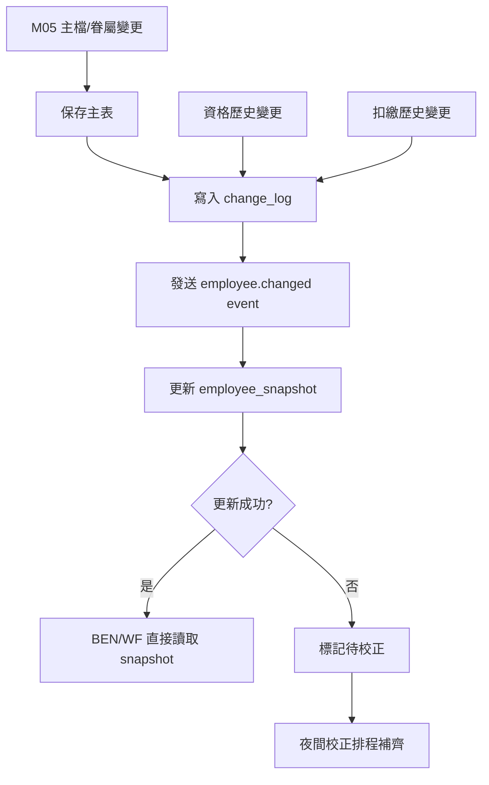
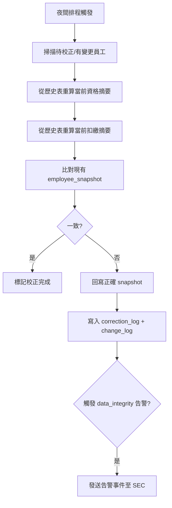
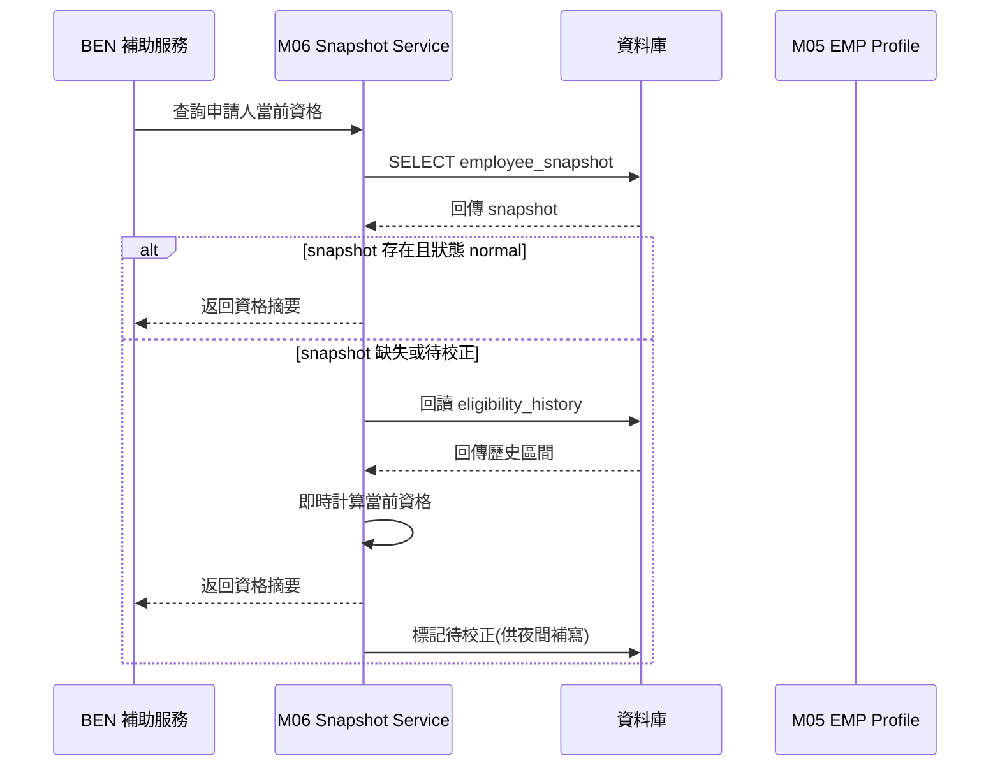
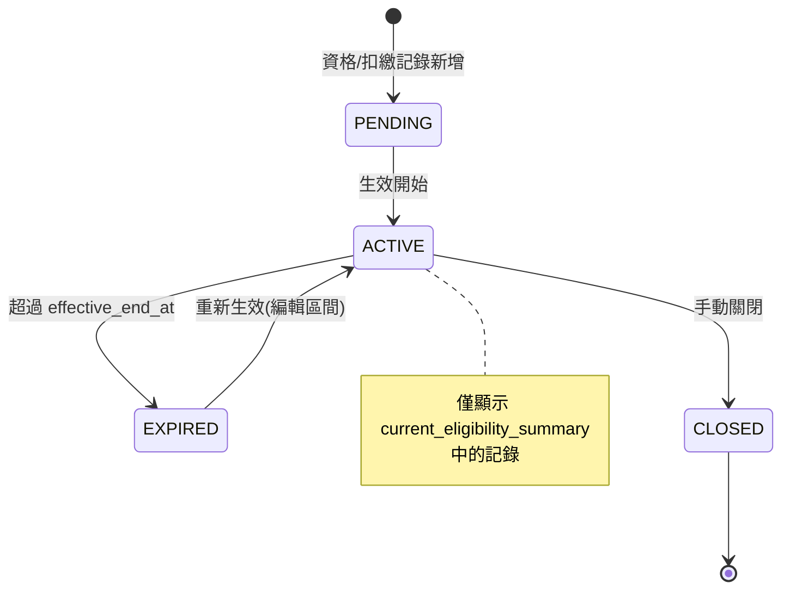
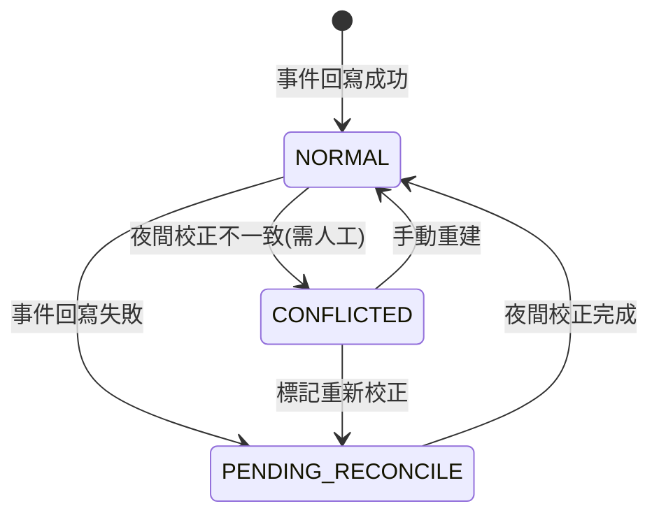

# PRD_M06_EMP_History_v2_20260703

> 版本：v2 增強版 | 基於舊版 M06 子 PRD、工作說明書 SOW、資料庫優化報告、全域規範 v2 重構

---

## 1. 模塊概述

### 1.1 功能定位

M06 是 EMP 域中的資料治理中台，負責把「員工當前有效狀態」與「歷史演變過程」分離管理。M05 解決「員工與眷屬現在是誰」，M06 則解決資格歷史追溯、扣繳歷史記錄、即時快照提供與變更日誌留存。

### 1.2 業務價值

- **資格歷史追溯**：BEN 在送審時檢查當前資格，稽核時可回溯申請當下的歷史快照
- **扣繳歷史記錄**：保留員工扣繳狀態的變遷過程，支撐資格判斷與財務查核
- **即時快照(Snapshot)**：讓 BEN、WF、AUTH 等高頻查詢場景不需即時聚合多表
- **變更日誌(Change Log)**：完整留痕所有 EMP 資料變更，支撐稽核與問題追查
- **夜間校正**：確保事件回寫遺漏時，快照仍與歷史一致

### 1.3 使用角色

| 角色 | 權限範圍 |
|------|----------|
| 系統管理員 | 查看/編輯歷史、手動重建快照 |
| 福利社承辦人 | 查看必要摘要 |
| 審核主管 | 僅讀資格結果 |
| 資安稽核人員 | 查看變更日誌與資料異常 |

### 1.4 所屬領域與模塊類型

- **所屬領域**：EMP（Employee，職工人員域）
- **模塊類型**：底層能力模塊
- **依賴**：M05（EMP 員工主檔）、M07（SYS 字典）
- **被依賴**：M13/M14/M15（BEN 資格檢查）、M10/M11（WF 上下文）

---

## 2. 數據流圖

### 2.1 歷史 + 快照雙軌數據流



### 2.2 夜間校正數據流



### 2.3 BEN 讀取資格快照序列



---

## 3. 數據庫設計

### 3.1 涉及資料表

| 表名 | 用途 | 類型 |
|------|------|------|
| `eligibility_history` | 資格歷史區間表 | 追加寫，不軟刪 |
| `deduction_history` | 扣繳歷史區間表 | 追加寫，不軟刪 |
| `employee_snapshot` | 員工即時快照表 | 覆蓋寫，row_version |
| `change_log` | 變更日誌 | 追加寫，不可變 |
| `correction_log` | 校正日誌 | 追加寫 |

### 3.2 ER 關係圖

```mermaid
erDiagram
    EMPLOYEE ||--o{ ELIGIBILITY_HISTORY : has
    EMPLOYEE ||--o{ DEDUCTION_HISTORY : has
    EMPLOYEE ||--|| EMPLOYEE_SNAPSHOT : has
    EMPLOYEE ||--o{ CHANGE_LOG : generates
    EMPLOYEE ||--o{ CORRECTION_LOG : may_have

    ELIGIBILITY_HISTORY {
        bigint eligibility_history_id PK
        bigint employee_id FK
        citext eligibility_type "資格類型(字典碼)"
        citext eligibility_status "資格狀態(字典碼)"
        timestamptz effective_start_at "區間起點"
        timestamptz effective_end_at "區間終點(NULL=至今有效)"
        citext source_type "來源: manual/import/rule/correction"
        citext source_ref_id "來源單據/規則 ID"
        jsonb metadata "額外上下文"
        int row_version
        timestamptz created_at
    }

    DEDUCTION_HISTORY {
        bigint deduction_history_id PK
        bigint employee_id FK
        citext deduction_type "扣繳類型(字典碼)"
        citext deduction_status "扣繳狀態(字典碼)"
        numeric amount "扣繳金額"
        timestamptz effective_start_at
        timestamptz effective_end_at
        citext source_type
        citext source_ref_id
        jsonb metadata
        int row_version
        timestamptz created_at
    }

    EMPLOYEE_SNAPSHOT {
        bigint employee_snapshot_id PK
        bigint employee_id FK UK "一員工一快照"
        jsonb profile_summary "員工主檔摘要(姓名/狀態/org)"
        jsonb eligibility_summary "當前資格摘要"
        jsonb deduction_summary "當前扣繳摘要"
        int snapshot_version "快照版本號"
        timestamptz last_event_applied_at "最近事件套用時間"
        timestamptz last_reconciled_at "最近夜間校正時間"
        citext snapshot_status "normal/pending_reconcile/conflicted"
        int row_version
        timestamptz created_at
        timestamptz updated_at
    }

    CHANGE_LOG {
        bigint change_log_id PK
        bigint employee_id FK
        citext target_type "目標類型: profile/dependent/eligibility/deduction/snapshot"
        bigint target_id "目標記錄主鍵"
        citext action_type "create/update/close/rebuild/correct"
        jsonb before_snapshot "變更前摘要(JSON)"
        jsonb after_snapshot "變更後摘要(JSON)"
        citext changed_by "操作人 account/employee_id"
        citext change_reason "變更原因"
        citext correlation_id "流程關聯 ID"
        timestamptz changed_at "變更時間"
    }

    CORRECTION_LOG {
        bigint correction_id PK
        bigint employee_id FK
        citext correction_type "snapshot/eligibility/deduction"
        jsonb before_value "校正前值"
        jsonb after_value "校正後值"
        citext trigger_source "event_replay/nightly_reconcile/manual"
        citext operator "操作人(手動時)"
        timestamptz corrected_at
    }
```

### 3.3 關鍵字段說明

#### eligibility_history 排他約束

使用 PostgreSQL range 類型 + GiST 排除約束：
```sql
ADD CONSTRAINT eligibility_no_overlap 
EXCLUDE USING GIST (
  employee_id WITH =,
  eligibility_type WITH =,
  tstzrange(effective_start_at, effective_end_at) WITH &&
)
```

#### employee_snapshot 特性

- 一員工只對應一筆 snapshot（UPSERT 語義）
- `snapshot_status` 用於指示快照可信度：
  - `normal`：事件回寫成功，與歷史一致
  - `pending_reconcile`：事件回寫失敗，待夜間校正
  - `conflicted`：夜間校正發現不一致，需人工介入

#### change_log 不可變原則

- 寫入後不可 UPDATE 或 DELETE
- 不保存 `identity_no` 等敏感欄位的明文，僅存 masked 值或摘要

---

## 4. 功能需求清單

### 4.1 資格歷史管理

| ID | 名稱 | 優先級 | 說明 | 權限控制 |
|----|------|--------|------|----------|
| M06-F01 | 新增資格歷史記錄 | P0 | 建立員工資格區間 | 編輯資格歷史(高風險) |
| M06-F02 | 編輯資格歷史 | P1 | 修改生效區間/狀態 | 編輯資格歷史(高風險) |
| M06-F03 | 關閉資格區間 | P1 | 設定 effective_end_at 終止資格 | 編輯資格歷史(高風險) |
| M06-F04 | 查詢當前資格 | P0 | 回傳最新有效資格摘要 | 查看資格歷史 |
| M06-F05 | 查詢某時間點資格 | P0 | 回溯指定時間的有效資格 | 查看資格歷史 |
| M06-F06 | 區間重疊檢查 | P0 | 新增/編輯時自動執行 | - |

### 4.2 扣繳歷史管理

| ID | 名稱 | 優先級 | 說明 | 權限控制 |
|----|------|--------|------|----------|
| M06-F07 | 新增扣繳歷史記錄 | P0 | 建立員工扣繳區間 | 編輯扣繳歷史(高風險) |
| M06-F08 | 編輯/終止扣繳區間 | P1 | 修改或關閉扣繳記錄 | 編輯扣繳歷史(高風險) |
| M06-F09 | 查詢當前扣繳狀態 | P0 | 回傳當前有效扣繳摘要 | 查看扣繳歷史 |
| M06-F10 | 查詢歷史扣繳記錄 | P0 | 列出所有扣繳區間 | 查看扣繳歷史 |

### 4.3 快照管理

| ID | 名稱 | 優先級 | 說明 | 權限控制 |
|----|------|--------|------|----------|
| M06-F11 | 事件回寫快照 | P0 | M05/M06 變更事件觸發快照即時更新 | - |
| M06-F12 | 手動重建單人快照 | P1 | 管理員手動觸發單人快照重算 | 手動重算快照(高風險) |
| M06-F13 | 夜間批量校正快照 | P0 | 排程掃描待校正員工並重算快照 | - |
| M06-F14 | 快照一致性檢查 | P1 | 比對快照與歷史推導結果是否一致 | 查看快照 |

### 4.4 變更日誌

| ID | 名稱 | 優先級 | 說明 | 權限控制 |
|----|------|--------|------|----------|
| M06-F15 | 記錄變更日誌 | P0 | 所有 EMP 資料變更自動寫入 | - |
| M06-F16 | 查詢變更日誌 | P1 | 按員工/目標類型/時間範圍查詢 | 查看變更日誌 |

### 4.5 資料一致性檢查

| ID | 名稱 | 優先級 | 說明 |
|----|------|--------|------|
| M06-F17 | 區間重疊自動檢查 | P0 | 資格/扣繳歷史寫入前強制檢查 |
| M06-F18 | 快照 vs 歷史比對 | P1 | 夜間校正執行一致性校驗 |
| M06-F19 | 快照缺失標記 | P1 | 有歷史但無快照時自動標記 pending_reconcile |

---

## 5. 用例文檔

### 用例 1：資格歷史區間新增（含重疊檢查）

**前置條件**：員工主檔存在，操作者具備編輯資格歷史權限

**操作步驟**：
1. 查詢目標員工 → 進入「資格歷史」區
2. 點選「新增資格記錄」
3. 選擇資格類型、狀態、生效起訖時間
4. 填寫來源類型與備註
5. 點選「保存」

**預期結果**：
- 系統自動檢查與該員工同類型既有區間是否重疊
- 無重疊：保存成功，更新 snapshot
- 重疊：阻斷並提示區間衝突

**異常處理**：
| 異常場景 | 處理方式 | 錯誤碼 |
|----------|----------|--------|
| 區間重疊 | 阻斷，提示重疊的既有記錄 ID 與區間 | EMP-008 |
| 生效時間大於失效時間 | 阻斷並提示 | EMP-009 |
| 資格類型為空 | 阻斷 | EMP-010 |

### 用例 2：BEN 送審時讀取資格快照

**前置條件**：員工已有資格歷史資料

**操作步驟**：
1. BEN 的 before_submit 鉤子調用 M06 的 getCurrentEligibility API
2. M06 優先讀取 employee_snapshot
3. 若 snapshot 正常，直接返回資格摘要
4. 若 snapshot 缺失或待校正，回讀歷史表即時計算

**預期結果**：
- 正常場景：響應時間 ≤ 100ms（snapshot 讀取）
- 降級場景：響應時間 ≤ 500ms（歷史表即時計算）

**異常處理**：
| 異常場景 | 處理方式 |
|----------|----------|
| 快照與歷史均無資料 | 返回「無資格資料」，由 BEN 判定為無資格 |
| 快照讀取超時 | 降級至歷史表查詢 |

### 用例 3：夜間校正排程執行

**前置條件**：系統時間為排程觸發時間(預設 02:00)

**操作步驟**：
1. 排程器查詢所有 `snapshot_status != normal` 或有 Event Replay Gap 的員工
2. 對每個員工重算資格摘要與扣繳摘要
3. 比對現有 snapshot
4. 不一致時回寫正確值，記錄 correction_log

**預期結果**：
- 所有待校正員工的 snapshot 更新為 normal
- correction_log 記錄每次校正的 before/after
- 若發現無法自動修復的衝突(如人工標記)，跳過並告警

**異常處理**：
| 異常場景 | 處理方式 |
|----------|----------|
| 校正過程資料庫壓力過大 | 批次大小限制(預設 200/批)，可配置 |
| 單員工校正失敗 | 跳過該員工，記錄錯誤，不影響批次繼續 |
| 人工已標記為「已確認」 | 跳過，不覆蓋人工修復結果 |

### 用例 4：手動重建快照

**前置條件**：操作者具備「手動重算快照」權限

**操作步驟**：
1. 進入快照檢查頁 → 搜尋目標員工
2. 查看當前快照摘要與歷史推導結果的差異
3. 點選「手動重建快照」
4. 確認對話框（高風險操作）

**預期結果**：
- 系統從歷史表重新計算資格/扣繳摘要
- 更新 employee_snapshot
- 寫入 change_log (action_type = rebuild)
- 寫入 audit_event (severity = WARN)

### 用例 5：查詢指定時間點的資格

**前置條件**：操作者具備查看資格歷史權限

**操作步驟**：
1. 進入資格歷史頁 → 選擇員工
2. 輸入目標時間點（如 2025-12-31）
3. 查詢

**預期結果**：
- 返回該時間點有效的資格記錄（`effective_start_at <= 時間點 AND (effective_end_at IS NULL OR effective_end_at > 時間點)`）
- 若無匹配記錄，返回「該時間點無有效資格」

---

## 6. 界面與交互要求

### 6.1 頁面佈局原則

- **資格/扣繳歷史頁**：員工摘要頭部 + 歷史區間時間軸列表 + 當前有效標記 + 區間衝突提示
- **快照檢查頁**：員工摘要 + 當前快照摘要 + 歷史推導結果 + 差異比對區 + 重建按鈕
- **變更日誌頁**：查詢條件區(員工/目標類型/時間) + 事件列表 + before/after 差異面板

### 6.2 狀態轉換圖



### 6.3 快照狀態轉換



---

## 7. API 接口規格

### 7.1 資格歷史

#### GET /api/v1/employees/{employee_id}/eligibility

查詢當前有效資格。

**參數**：
| 名稱 | 類型 | 必填 | 說明 |
|------|------|------|------|
| at_time | datetime | N | 查詢指定時間點(預設當前時間) |

**響應**：
```json
{
  "code": 0,
  "data": {
    "items": [
      {
        "eligibility_history_id": 10,
        "eligibility_type": "marriage",
        "eligibility_type_label": "結婚補助",
        "eligibility_status": "eligible",
        "eligibility_status_label": "具資格",
        "effective_start_at": "2024-01-01T00:00:00+08:00",
        "effective_end_at": null,
        "source_type": "import",
        "row_version": 1
      }
    ],
    "snapshot_status": "normal"
  }
}
```

#### POST /api/v1/employees/{employee_id}/eligibility

新增資格歷史記錄。

**請求 Header**：`Idempotency-Key: uuid-v4`

**請求**：
```json
{
  "eligibility_type": "marriage",
  "eligibility_status": "eligible",
  "effective_start_at": "2024-01-01T00:00:00+08:00",
  "effective_end_at": null,
  "source_type": "manual",
  "source_ref_id": null
}
```

**錯誤碼**：
| 錯誤碼 | 說明 |
|--------|------|
| EMP-008 | 區間重疊(409 Conflict) |
| EMP-009 | 生效時間大於失效時間 |

### 7.2 快照管理

#### GET /api/v1/employees/{employee_id}/snapshot

查詢員工當前快照。

**響應**：
```json
{
  "code": 0,
  "data": {
    "employee_id": 1,
    "snapshot_version": 5,
    "snapshot_status": "normal",
    "profile_summary": {
      "employee_name": "張三",
      "employment_status": "active",
      "org_unit_id": 10
    },
    "eligibility_summary": {
      "items": [
        { "type": "marriage", "status": "eligible" }
      ],
      "valid_as_of": "2026-07-03T10:00:00+08:00"
    },
    "deduction_summary": {
      "items": [],
      "valid_as_of": "2026-07-03T10:00:00+08:00"
    },
    "last_event_applied_at": "2026-07-03T10:00:00+08:00",
    "last_reconciled_at": "2026-07-03T02:00:00+08:00",
    "row_version": 3
  }
}
```

#### POST /api/v1/employees/{employee_id}/snapshot/rebuild

手動重建單人快照。

**請求 Header**：`Idempotency-Key: uuid-v4`

**響應** (202 Accepted)：
```json
{
  "code": 0,
  "message": "Snapshot rebuild accepted"
}
```

### 7.3 變更日誌

#### GET /api/v1/employees/{employee_id}/change-logs

**參數**：
| 名稱 | 類型 | 必填 | 說明 |
|------|------|------|------|
| target_type | string | N | profile/dependent/eligibility/deduction/snapshot |
| action_type | string | N | create/update/close/rebuild/correct |
| start_at | datetime | N | 開始時間 |
| end_at | datetime | N | 結束時間 |
| page | integer | N | 頁碼 |
| size | integer | N | 每頁筆數 |

---

## 8. 非功能性需求

### 8.1 性能指標

| 指標 | 目標值 |
|------|--------|
| 快照讀取 (P95) | ≤ 100ms |
| 資格歷史寫入 (P95) | ≤ 500ms (含重疊檢查) |
| 夜間校正批次 | ≥ 200 員工/分鐘 |
| 變更日誌查詢 (P95) | ≤ 1s |
| 事件→快照回寫延遲 | ≤ 3s (P99) |

### 8.2 安全要求

- change_log 不保存 `identity_no` 等敏感欄位的明文
- 手動重建快照、編輯歷史視為高風險操作，寫入 audit_event
- 夜間校正不覆蓋人工已確認的修復結果

### 8.3 可用性標準

- 資格/快照查詢服務 SLA ≥ 99.5%
- 夜間校正可在維運窗口 02:00-05:00 內完成
- 事件驅動回寫失敗不影響主交易

---

## 9. 隱含需求補充

### 9.1 審計日誌

| 操作 | action_code | severity |
|------|-------------|----------|
| 資格歷史新增 | EMP.ELIGIBILITY.CREATE | INFO |
| 資格歷史編輯 | EMP.ELIGIBILITY.UPDATE | WARN |
| 手動重建快照 | EMP.SNAPSHOT.REBUILD | WARN |
| 夜間校正 | EMP.SNAPSHOT.RECONCILE | INFO |
| 快照不一致告警 | EMP.SNAPSHOT.CONFLICT | WARN |

### 9.2 數據一致性

- 歷史表為真源，快照為讀取加速層；歷史不可篡改，快照可重建
- 夜間校正以歷史表為準重算快照，不一致時以歷史為正確
- 區間重疊檢查使用 PostgreSQL GiST 排除約束確保資料庫層級不可重疊
- 變更日誌寫入後不可變更

### 9.3 並發控制

- `eligibility_history`、`deduction_history`、`employee_snapshot` 均包含 `row_version`
- 夜間校正在校正前讀取當前 snapshot 的 `row_version`，校正時若版本號變更(白天有人操作)，跳過該員工
- 同日誌事件佇列需去重，防止同一事件多次套用

### 9.4 錯誤恢復

- 事件回寫失敗：不影響主交易，標記 `pending_reconcile`，夜間校正補齊
- 夜間校正失敗單一員工：跳過並記錄，不影響批次
- 快照不一致超出閾值(如 >5%)：觸發 `data_integrity` 告警

### 9.5 冪等性保障

- 資格歷史新增 API 支援 `Idempotency-Key`，防止重複建立同一區間
- 事件回寫處理需支援 exactly-once 語義(event_id 去重)
- 夜間校正為 power 操作(覆蓋寫)，相同輸入重複執行結果一致

### 9.6 邊界情況處理

| 邊界情況 | 處理方式 |
|----------|----------|
| 員工無任何資格歷史 | snapshot 中 eligibility_summary = empty array |
| 所有資格記錄均已過期 | snapshot 標記為「當前無有效資格」 |
| 同一員工同時觸發多次變更事件 | 合併處理或按序逐一套用 |
| 夜間校正期間 M05 發生變更 | 校正讀取的歷史表已包含該變更(同庫事務) |
| 歷史資料超過 10 年 | 不自動刪除，由封存策略決定 |
