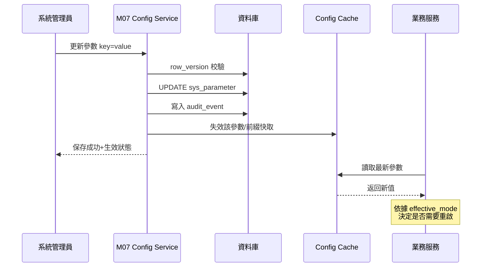
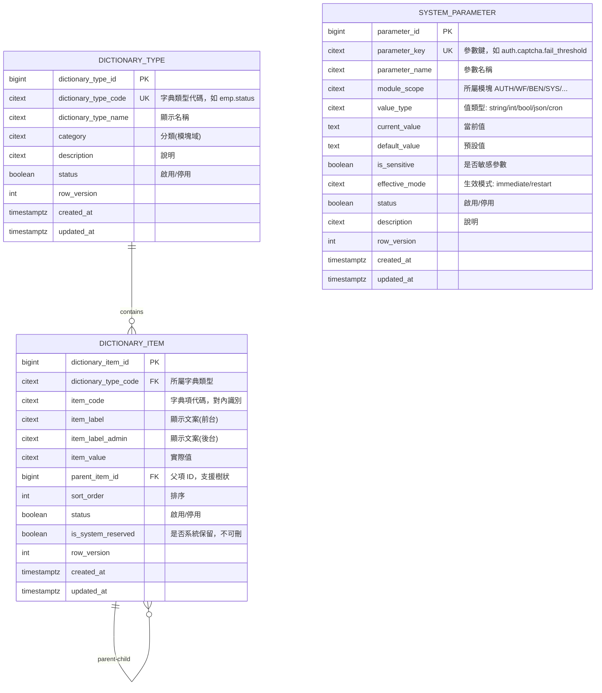
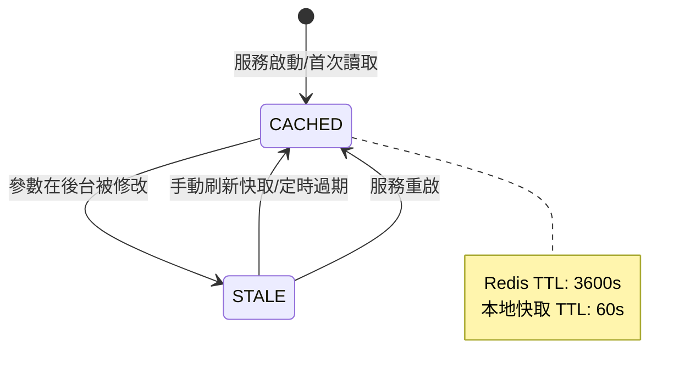

# PRD_M07_SYS_Dict_v2_20260703

> 版本：v2 增強版 | 基於舊版 M07 子 PRD、工作說明書 SOW、資料庫優化報告、全域規範 v2 重構

---

## 1. 模塊概述

### 1.1 功能定位

M07 是整個福利平台的「治理開關層」與「語義統一層」，負責提供兩類核心能力：
- **字典管理(Dictionary)**：所有業務狀態、類型、分類的代碼化治理
- **系統參數(System Configuration)**：開關、閾值、排程配置的統一管理

### 1.2 業務價值

- 消除前端硬編碼：所有下拉選單、狀態標籤、分類選項從字典讀取
- 降低硬編碼風險：安全閾值、排程開關、功能開關可配置化
- 跨模塊語義統一：BEN/PAY/ANN/MCH/EMP/WF 共享同一套字典
- 配置可審計：參數變更有 before/after 差異、變更人、變更時間

### 1.3 使用角色

| 角色 | 權限範圍 |
|------|----------|
| 系統管理員 | 完整 CRUD 字典與參數 |
| 資安稽核人員 | 查看配置變更記錄，不修改 |
| 其他管理角色 | 僅讀 |

### 1.4 所屬領域與模塊類型

- **所屬領域**：SYS（System，系統基礎設施域）
- **模塊類型**：底層能力模塊
- **被依賴**：全域模塊（無模塊不依賴字典）
- **依賴**：無

---

## 2. 數據流圖

### 2.1 字典驅動全站展示

```mermaid
flowchart LR
    A[系統管理員] -->|維護字典| B[sys_dictionary_type + item]
    B --> C[Dictionary Cache(Redis)]
    C --> D[業務服務 API]
    D --> E[前端頁面]
    E --> F[下拉選單/狀態標籤/分類篩選]
    
    G[系統管理員] -->|維護參數| H[sys_parameter]
    H --> I[Parameter Cache(本地+Redis)]
    I --> J[排程/校驗/開關/閾值]
```

### 2.2 參數變更生效序列



### 2.3 字典引用檢查

```mermaid
flowchart TD
    A[管理員停用字典項] --> B[系統檢查引用]
    B --> C{是否有業務表引用?}
    C -->|是| D[列表展示引用來源]
    D --> E[允許停用但不允許刪除]
    C -->|否| F[允許停用/刪除]
    
    note right of D
        引用來源包含:
        benefit_type.status
        employee.employment_status
        announcement.scope_type
    end note
```

---

## 3. 數據庫設計

### 3.1 涉及資料表

| 表名 | 用途 | 類型 |
|------|------|------|
| `dictionary_type` | 字典類型定義 | 主表(row_version) |
| `dictionary_item` | 字典項定義 | 主表(row_version) |
| `system_parameter` | 系統參數 | 主表(row_version) |

### 3.2 ER 關係圖



### 3.3 關鍵字段說明

#### dictionary_item 唯一約束

```sql
UNIQUE (dictionary_type_code, item_code)
```

#### system_parameter 參考

| 參數鍵範例 | 值類型 | 預設值 | 說明 |
|-----------|--------|--------|------|
| auth.captcha.fail_threshold | int | 5 | 連續失敗幾次觸發 Captcha |
| auth.session.ttl_minutes | int | 30 | Session 閒置逾時(分) |
| wf.timeout.scan.cron | cron | 0 0/30 * * * ? | 流程超時掃描排程 |
| emp.snapshot.reconcile.cron | cron | 0 0 2 * * ? | 員工快照夜間校正 |
| sys.file.max_size_mb | int | 20 | 單檔上傳上限(MB) |
| sys.notification.sender.batch_size | int | 100 | 通知發送批次大小 |
| sys.notification.retry.max_count | int | 3 | 通知最大重試次數 |

---

## 4. 功能需求清單

### 4.1 字典管理

| ID | 名稱 | 優先級 | 說明 | 權限控制 |
|----|------|--------|------|----------|
| M07-F01 | 字典類型列表 | P0 | 查詢/篩選所有字典類型 | 查看字典 |
| M07-F02 | 新增字典類型 | P0 | 建立新的字典類型 | 新增/編輯字典 |
| M07-F03 | 編輯字典類型 | P0 | 修改類型名稱、分類、說明 | 新增/編輯字典 |
| M07-F04 | 字典項列表 | P0 | 按字典類型查看所有字典項 | 查看字典 |
| M07-F05 | 新增字典項 | P0 | 在指定類型下新增字典項 | 新增/編輯字典 |
| M07-F06 | 編輯字典項 | P0 | 修改 label/value/排序/狀態 | 新增/編輯字典 |
| M07-F07 | 停用字典項 | P0 | 停用前檢查引用風險 | 停用字典項(高風險) |
| M07-F08 | 引用檢查 | P1 | 查詢字典項被哪些業務表引用 | 查看字典 |

### 4.2 系統參數管理

| ID | 名稱 | 優先級 | 說明 | 權限控制 |
|----|------|--------|------|----------|
| M07-F09 | 參數列表 | P0 | 按模塊分類查看所有參數 | 查看系統參數 |
| M07-F10 | 新增參數 | P0 | 建立新的系統參數 | 編輯系統參數(高風險) |
| M07-F11 | 編輯參數 | P0 | 修改當前值、生效模式 | 編輯系統參數(高風險) |
| M07-F12 | 重置預設值 | P1 | 恢復參數為 default_value | 編輯系統參數(高風險) |
| M07-F13 | 手動刷新快取 | P1 | 立即失效快取，讓服務重新載入 | 刷新參數快取(高風險) |
| M07-F14 | 參數變更歷史 | P1 | 查詢參數的變更記錄(before/after) | 查看系統參數 |

### 4.3 配置審計

| ID | 名稱 | 優先級 | 說明 |
|----|------|--------|------|
| M07-F15 | 配置變更日誌 | P1 | 所有字典/參數變更自動記錄 before/after |
| M07-F16 | 配置差異對比 | P2 | 查看任意兩次變更間的差異 |

---

## 5. 用例文檔

### 用例 1：建立字典類型與字典項

**前置條件**：操作者具備新增/編輯字典權限

**操作步驟**：
1. 進入系統設定 → 字典管理 → 新增字典類型
2. 輸入 `dictionary_type_code = "emp.status"`、名稱 = 「員工狀態」
3. 保存 → 進入字典項管理
4. 新增字典項：code="active", label="在職", value="active", sort=1
5. 新增字典項：code="inactive", label="離職", value="inactive", sort=2

**預期結果**：
- dictionary_type 與 dictionary_item 分別寫入
- 後續 M05 員工狀態欄位可直接引用此字典

**異常處理**：
| 異常場景 | 處理方式 | 錯誤碼 |
|----------|----------|--------|
| dictionary_type_code 重複 | 阻斷並提示 | SYS-001 |
| item_code 在類型內重複 | 阻斷並提示 | SYS-002 |

### 用例 2：修改系統參數

**前置條件**：操作者具備編輯系統參數權限

**操作步驟**：
1. 進入系統設定 → 系統參數 → 搜尋 `auth.captcha.fail_threshold`
2. 查看當前值=5，預設值=5
3. 修改為 3，填寫變更原因
4. 保存

**預期結果**：
- current_value 更新為 3
- 寫入 audit_event，action_code = `SYS.PARAMETER.UPDATE`
- 參數快取失效
- immediate 模式參數：服務下次讀取時取新值
- 頁面提示「參數已更新，快取將在數秒內生效」

**異常處理**：
| 異常場景 | 處理方式 | 錯誤碼 |
|----------|----------|--------|
| value_type=int 但輸入非數字 | 阻斷並提示 | SYS-003 |
| value_type=cron 但格式非法 | 阻斷並提示 | SYS-004 |
| value_type=json 但結構不合法 | 阻斷並提示 | SYS-005 |
| row_version 衝突 | 409 Conflict，需重新載入 | GBL-003 |

### 用例 3：字典項引用檢查

**前置條件**：字典項已被業務資料引用

**操作步驟**：
1. 選擇一個已被使用的字典項（如 emp.status 的 "active"）
2. 點選「停用」按鈕

**預期結果**：
- 系統執行引用檢查，返回引用清單：
  - employee 表：156 筆引用
  - benefit_application 表：23 筆引用
- 頁面提示風險：「該字典項被 2 個業務表、共 179 筆記錄引用」
- 允許停用（已引用的歷史記錄仍可正常顯示原值）
- 不允許直接刪除

**異常處理**：
| 異常場景 | 處理方式 |
|----------|----------|
| is_system_reserved = true | 不允許停用或刪除 |
| 引用檢查查詢逾時 | 返回部分結果 + 警告提示 |

### 用例 4：刷新參數快取

**前置條件**：某參數已被修改，但業務服務尚未載入新值

**操作步驟**：
1. 在參數列表頁找到目標參數
2. 點選「刷新快取」按鈕
3. 確認對話框

**預期結果**：
- 後台清理該參數的 Redis 快取
- 下次業務服務查詢時重新從 DB 載入
- 寫入 audit_event

---

## 6. 界面與交互要求

### 6.1 頁面佈局原則

- **字典類型列表頁**：搜尋篩選區 + 類型列表(code/name/category/state/item_count)
- **字典項管理頁**：類型摘要頭部 + 字典項列表(code/label/value/sort/status) + 拖拽排序
- **系統參數列表頁**：分類導航 + 參數列表(key/name/value_type/current_value/default_value/status) + 敏感標記(Tag)
- **配置變更記錄頁**：查詢條件 + 記錄列表 + before/after 差異面板

### 6.2 交互原則

- 字典項支援拖拽排序
- 停用前自動執行引用檢查
- 敏感參數在列表中遮罩顯示
- 參數保存後明確提示生效模式與快取狀態

### 6.3 快取策略



---

## 7. API 接口規格

### 7.1 字典 API

#### GET /api/v1/dictionaries

查詢所有字典類型。

#### GET /api/v1/dictionaries/{type_code}/items

查詢指定字典類型的所有字典項。

**參數**：
| 名稱 | 類型 | 必填 | 說明 |
|------|------|------|------|
| active_only | boolean | N | 只返回啟用項(預設 true) |

**響應**：
```json
{
  "code": 0,
  "data": {
    "type_code": "emp.status",
    "type_name": "員工狀態",
    "items": [
      { "code": "active", "label": "在職", "value": "active", "sort_order": 1 },
      { "code": "inactive", "label": "離職", "value": "inactive", "sort_order": 2 }
    ]
  }
}
```

> 此 API 為高頻讀取接口，預設走 Redis 快取。

#### POST /api/v1/dictionaries

新增字典類型。

#### POST /api/v1/dictionaries/{type_code}/items

新增字典項。

#### PUT /api/v1/dictionaries/{type_code}/items/{item_code}

更新字典項。

**請求 Header**：`X-Row-Version: {current_row_version}`

**錯誤碼**：
| 錯誤碼 | 說明 |
|--------|------|
| SYS-001 | dictionary_type_code 重複 |
| SYS-002 | item_code 在類型內重複 |

### 7.2 系統參數 API

#### GET /api/v1/parameters

查詢系統參數列表。

**參數**：`module_scope`（可選，前綴篩選）

#### GET /api/v1/parameters/{key}

查詢單一參數值。返回 `current_value`、`default_value`、`value_type`、`effective_mode`。

> 高頻讀取：此 API 也被內部服務調用，建議業務服務使用本地快取 + Redis 二級快取。

#### PUT /api/v1/parameters/{key}

更新參數值。

**請求 Header**：`Idempotency-Key: uuid-v4`，`X-Row-Version: {current_row_version}`

**請求 Body**：
```json
{
  "current_value": "3",
  "change_reason": "提高安全等級，降低 Captcha 觸發門檻"
}
```

**錯誤碼**：
| 錯誤碼 | 說明 |
|--------|------|
| SYS-003 | value_type 值類型不匹配 |
| SYS-004 | cron 格式非法 |
| SYS-005 | JSON 格式不合法 |

#### POST /api/v1/parameters/{key}/refresh-cache

手動刷新指定參數的快取。

---

## 8. 非功能性需求

### 8.1 性能指標

| 指標 | 目標值 |
|------|--------|
| 字典讀取 (P99) | ≤ 30ms(Redis 快取命中) |
| 參數讀取 (P99) | ≤ 30ms(快取) |
| 字典項更新→快取生效 | ≤ 5s |
| 參數變更→快取生效 | ≤ 10s(自動) / 即時(手動刷新) |

### 8.2 安全要求

- 敏感參數(`is_sensitive=true`)在 API 響應中遮罩顯示
- 字典/參數變更均須寫入 audit_event
- 高風險配置變更(影響全站的開關/閾值)建議二次確認
- 參數表加 `row_version` 防止並發覆蓋

### 8.3 可用性標準

- 字典/參數讀取服務 SLA ≥ 99.9%（快取層保護）
- 當 Redis 不可用時，降級至資料庫讀取
- 服務啟動時自動載入預設值作為 fallback

---

## 9. 隱含需求補充

### 9.1 審計日誌

| 操作 | action_code | severity |
|------|-------------|----------|
| 新增字典類型 | SYS.DICT_TYPE.CREATE | INFO |
| 新增字典項 | SYS.DICT_ITEM.CREATE | INFO |
| 停用字典項 | SYS.DICT_ITEM.DEACTIVATE | WARN |
| 更新參數 | SYS.PARAMETER.UPDATE | WARN |
| 重置參數為預設值 | SYS.PARAMETER.RESET | WARN |
| 刷新參數快取 | SYS.PARAMETER.REFRESH_CACHE | INFO |

### 9.2 數據一致性

- 字典類型與字典項透過 `dictionary_type_code` 強關聯
- 字典項停用後，歷史資料仍可正常顯示原值
- 系統參數在 DB 更新後需主動通知各服務節點快取失效(REDIS PUB/SUB)
- 服務啟動時若 DB 中無某參數，使用代碼中的硬編碼預設值

### 9.3 並發控制

- `dictionary_type`、`dictionary_item`、`system_parameter` 均使用 `row_version`
- 參數編輯衝突返回 409
- 字典項排序變更使用批量 API，在一次事務中更新多筆

### 9.4 錯誤恢復

- Redis 快取失效：下次查詢自動回退到 DB 讀取並重建快取
- 參數變更 DB 成功但快取失效失敗：定時任務每 60s 同步 DB→快取
- 配置損毀/誤操作：可透過變更日誌還原 before 值

### 9.5 冪等性保障

- 字典項新增/參數值更新支援 `Idempotency-Key`
- 參數讀取為冪等操作（GET 天然冪等）
- 快取刷新為冪等操作（多次執行結果相同）

### 9.6 邊界情況處理

| 邊界情況 | 處理方式 |
|----------|----------|
| 字典類型被業務引用後刪除類型 | 不允許刪除，須先刪除所有字典項 |
| 字典項被業務引用後停用 | 允許停用，歷史資料顯示原值 |
| 參數 key 格式非法 | 限制只允許 `[a-z].[a-z_]+` 格式 |
| 敏感參數被無權限者查詢 | API 返回 `current_value: "******"` |
| 快取與 DB 不一致 | 定時全量同步(每 5 分鐘) |
| 超過 10000 個字典項 | 支援分頁查詢 |
