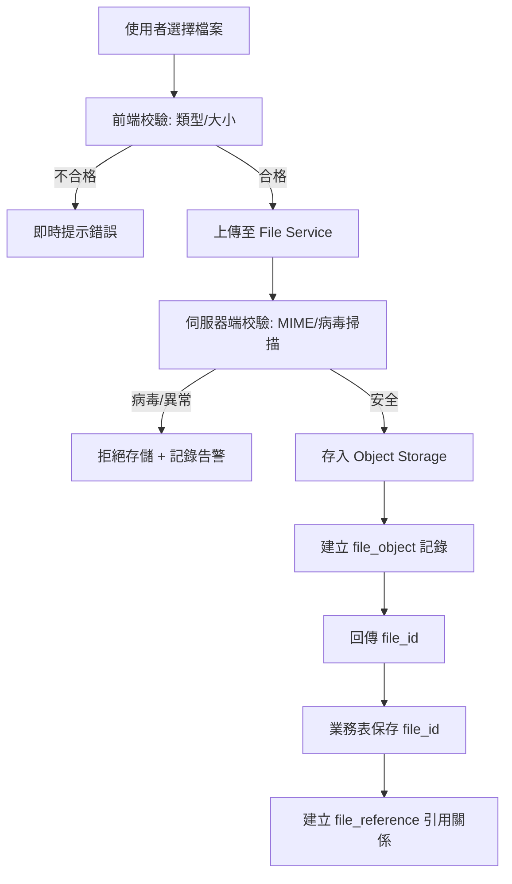
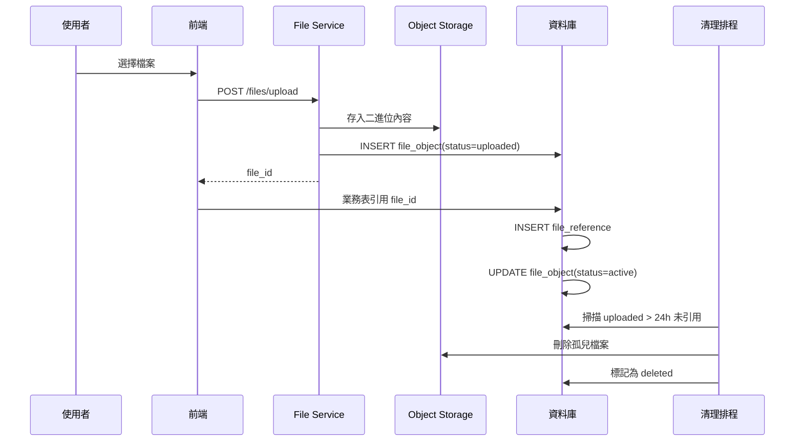
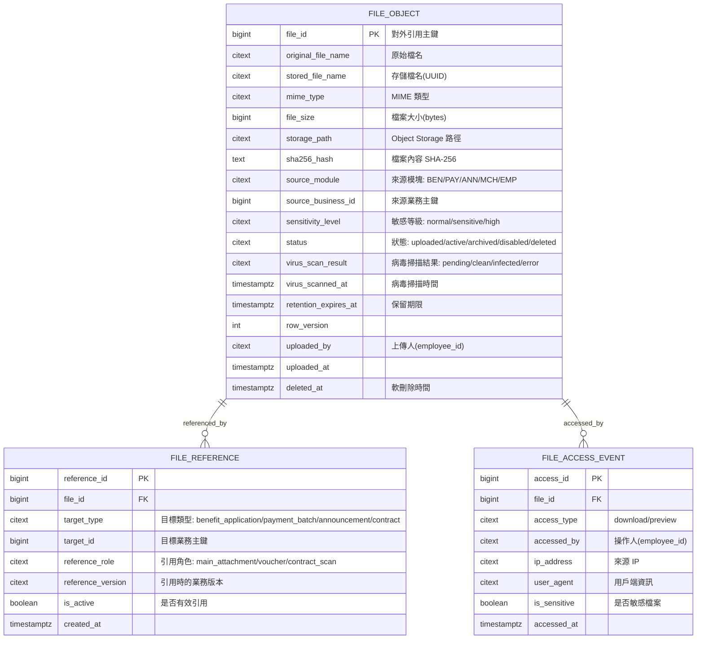
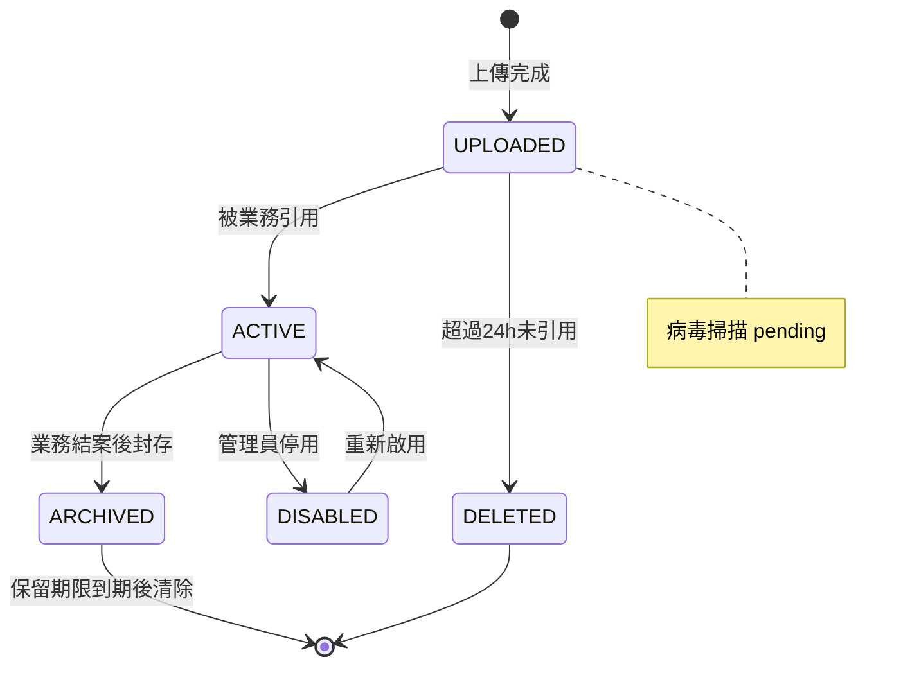

# PRD_M08_SYS_File_v2_20260703

> 版本：v2 增強版 | 基於舊版 M08 子 PRD、工作說明書 SOW、資料庫優化報告、全域規範 v2 重構

---

## 1. 模塊概述

### 1.1 功能定位

M08 是全平台所有附件、傳票、證明文件、公告附檔、商店合約附件的統一入口與統一存證層。檔案必須先存入 `file_object`（即舊版 `file_resource`），業務表只保存 `file_id`，全站檔案一律走同一套規則。

### 1.2 業務價值

- **統一治理**：BEN/PAY/ANN/MCH/EMP 不再各自發明一套附件路徑規則
- **安全可控**：敏感檔案下載需寫入稽核，未授權無法存取
- **生命週期管理**：上傳→引用→封存→清理，有一致規則
- **跨模塊引用**：同一檔案可被不同業務表引用，降低重複存儲

### 1.3 使用角色

| 角色 | 權限範圍 |
|------|----------|
| 職工(前台) | 上傳/查看本人申請附件 |
| 福利社承辦人 | 上傳/查看所轄業務附件 |
| 公告管理員 | 上傳公告附檔 |
| 商店承辦人 | 上傳合約附件 |
| 系統管理員 | 完整檔案治理 |
| 資安稽核人員 | 查看敏感下載記錄 |

### 1.4 所屬領域與模塊類型

- **所屬領域**：SYS（System，系統基礎設施域）
- **模塊類型**：底層能力模塊
- **依賴**：M07（SYS 字典，檔案狀態、類型、大小限制等參數）
- **被依賴**：M13(M14)(BEN 附件)、M17(PAY 傳票)、M19(ANN 公告附檔)、M21(MCH 合約)、M05(EMP 佐證)

---

## 2. 數據流圖

### 2.1 統一上傳與引用流程



### 2.2 下載與審計流程

```mermaid
flowchart TD
    A[請求下載 file_id] --> B[權限檢查]
    B -->|無權| X3[拒絕下載 + 記錄未授權嘗試]
    B -->|有權| C[讀取 file_object 元資料]
    C --> D{敏感檔案?}
    D -->|是| E[寫入 audit_event(severity=WARN)]
    D -->|否| F[生成臨時下載 URL(TTL 60s)]
    E --> F
    F --> G[回傳下載串流/URL]
    G --> H[記錄 file_access_event]
```

### 2.3 檔案生命週期



---

## 3. 數據庫設計

### 3.1 涉及資料表

| 表名 | 用途 | 類型 |
|------|------|------|
| `file_object` | 檔案元資料主表 | 主表(row_version) |
| `file_reference` | 檔案引用關係表 | 從表 |
| `file_access_event` | 檔案存取事件(下載/預覽) | 追加寫 |
| `audit_event` | 審計日誌(敏感下載) | 追加寫 |

### 3.2 ER 關係圖



### 3.3 關鍵字段說明

#### file_object 索引建議

```sql
-- 依狀態+上傳時間查詢清理對象
CREATE INDEX idx_file_status_uploaded ON file_object(status, uploaded_at) WHERE status = 'uploaded';

-- 依來源模塊查詢檔案
CREATE INDEX idx_file_source ON file_object(source_module, source_business_id);
```

#### sensitivity_level 決定

| 等級 | 定義 | 稽核要求 |
|------|------|----------|
| normal | 一般檔案 | 不強制稽核 |
| sensitive | 含個人資料(身分證影本、收據) | 每次下載記錄 audit_event |
| high | 含高度敏感資料 | 下載需更高權限 + 強制稽核 |

---

## 4. 功能需求清單

### 4.1 檔案上傳

| ID | 名稱 | 優先級 | 說明 | 權限控制 |
|----|------|--------|------|----------|
| M08-F01 | 單檔上傳 | P0 | 上傳單一檔案，回傳 file_id | 上傳檔案 |
| M08-F02 | 多檔上傳 | P0 | 批量上傳多個檔案，返回 file_id 列表 | 上傳檔案 |
| M08-F03 | 上傳前校驗 | P0 | 前端+後端校驗檔案類型、大小 | - |
| M08-F04 | 病毒掃描 | P0 | 上傳後非同步執行病毒掃描，非阻塞 | - |
| M08-F05 | 上傳進度 | P2 | 前端顯示上傳進度條 | - |

### 4.2 檔案管理

| ID | 名稱 | 優先級 | 說明 | 權限控制 |
|----|------|--------|------|----------|
| M08-F06 | 檔案列表查詢 | P0 | 按file_id/名稱/類型/狀態/來源模塊篩選 | 查看檔案詳情 |
| M08-F07 | 檔案詳情查看 | P0 | 查看file_id對應的完整元資料 | 查看檔案詳情 |
| M08-F08 | 檔案預覽 | P0 | 線上預覽(PDF/圖片)，受控權限 | 預覽檔案 |
| M08-F09 | 檔案下載 | P0 | 受控下載，敏感檔案寫稽核 | 下載檔案 |
| M08-F10 | 敏感檔案標記 | P1 | 人工/自動設定 sensitivity_level | 查看敏感檔案 |
| M08-F11 | 檔案狀態變更 | P1 | 停用/封存/還原檔案狀態 | 停用檔案(高風險) |

### 4.3 引用管理

| ID | 名稱 | 優先級 | 說明 |
|----|------|--------|------|
| M08-F12 | 引用檢查 | P1 | 查詢 file_id 被哪些業務表引用 |
| M08-F13 | 引用關係建立 | P0 | 業務引用檔案時自動建立 file_reference |

---

## 5. 用例文檔

### 用例 1：職工上傳補助附件

**前置條件**：職工已登入，正在填寫補助申請表單

**操作步驟**：
1. 在附件上傳區點選「選擇檔案」或拖拽檔案
2. 系統即時校驗：檔案類型(僅限 PDF/JPG/PNG)、大小(≤20MB)
3. 通過 → 顯示上傳進度條
4. 上傳完成 → 回傳 file_id，前端存於表單資料中

**預期結果**：
- `file_object` 新增記錄，status = `uploaded`
- 觸發非同步病毒掃描
- 前端獲得 file_id，與其他表單資料一併提交

**異常處理**：
| 異常場景 | 處理方式 | 錯誤碼 |
|----------|----------|--------|
| 格式不支援 | 前端即時阻斷 | - |
| 超過大小限制 | 前端即時阻斷 | - |
| 病毒掃描發現感染 | 標記 status=disabled + 記錄告警 | SYS-010 |
| 網路異常上傳中斷 | PWA 保留操作，可重試 | - |

### 用例 2：承辦下載申請附件（含敏感稽核）

**前置條件**：承辦有權限查看該補助案件

**操作步驟**：
1. 承辦在審核工作台點選附件預覽
2. 系統檢查該檔案 `sensitivity_level`
3. 若為 sensitive/high：寫入 audit_event
4. 返回受控下載連結(60s TTL)

**預期結果**：
- 敏感檔案下載寫入 `audit_event` + `file_access_event`
- 非敏感檔案僅記錄 `file_access_event`
- 下載連結時效 60s，過期需重新請求

**異常處理**：
| 異常場景 | 處理方式 |
|----------|----------|
| 檔案狀態為 disabled | 拒絕下載，提示 |
| 無下載權限 | 拒絕並記錄未授權嘗試 |
| TTL 過期 | 前端重新發送下載請求 |

### 用例 3：管理員清理孤兒檔案

**前置條件**：系統管理員執行清理排程

**操作步驟**：
1. 排程掃描 `status = uploaded AND uploaded_at < now() - interval '24h'`
2. 對每筆孤兒檔案檢查病毒掃描狀態
3. 若 clean → 刪除 Object Storage 中的二進位內容
4. 更新 status = deleted，保留元資料

**預期結果**：
- 未在 24h 內被業務引用的上傳檔案被清理
- 元資料保留，便於後續審計

**異常處理**：
| 異常場景 | 處理方式 |
|----------|----------|
| Object Storage 刪除失敗 | 重試 3 次，仍失敗則告警 |
| 病毒掃描仍 pending | 跳過，等待下次排程 |

### 用例 4：檔案被引用後嘗試刪除

**前置條件**：管理員嘗試刪除已被 BEN 申請引用的檔案

**操作步驟**：
1. 選擇檔案 → 點選「刪除」
2. 系統檢查 file_reference 表
3. 發現 2 筆有效引用 → 顯示引用清單
4. 不允許物理刪除，提示只可標記為 disabled

**預期結果**：
- 檔案狀態更新為 disabled
- 已發送的歷史通知/已審核的申請中仍可查看
- 新業務不可再引用該檔案

---

## 6. 界面與交互要求

### 6.1 頁面佈局原則

- **檔案列表頁**：查詢條件(file_id/名稱/類型/狀態/來源) + 列表 + 檔案摘要卡
- **檔案詳情頁**：基本資料卡 + 預覽區 + 引用關係區 + 下載歷史 + 稽核摘要
- **上傳組件**：拖拽區 + 檔案列表 + 進度條 + 校驗提示 + 回傳 file_id
- **共用組件**：所有業務模塊使用統一上傳組件

### 6.2 檔案狀態轉換



### 6.3 上傳組件交互

- 支援拖拽上傳與點選上傳
- 即時顯示單檔大小與類型校驗結果
- 上傳中顯示進度條與取消按鈕
- 上傳完成顯示 file_id 與檔案名稱
- 支援多檔模式(批量上傳)與單檔模式

---

## 7. API 接口規格

### 7.1 檔案上傳

#### POST /api/v1/files/upload

**請求**：`multipart/form-data`，欄位 `file` + `source_module` + `source_business_id` + `sensitivity_level`

**響應** (201 Created)：
```json
{
  "code": 0,
  "data": {
    "file_id": 1001,
    "original_file_name": "收據.pdf",
    "file_size": 1024000,
    "mime_type": "application/pdf",
    "virus_scan_status": "pending"
  }
}
```

**錯誤碼**：
| 錯誤碼 | 說明 |
|--------|------|
| SYS-006 | 檔案類型不允許 |
| SYS-007 | 檔案超過大小限制 |
| SYS-008 | 上傳失敗(存儲異常) |

### 7.2 檔案下載

#### GET /api/v1/files/{file_id}/download

**請求 Header**：
| Header | 說明 |
|--------|------|
| Authorization | Bearer token |

**響應**：
- Content-Type: 依 mime_type
- Content-Disposition: attachment; filename="原始檔名"
- 直接回傳二進位串流

**錯誤碼**：
| 錯誤碼 | 說明 |
|--------|------|
| SYS-009 | 無權限 |
| SYS-010 | 檔案已被停用或感染病毒 |
| SYS-011 | 檔案不存在或已被刪除 |

### 7.3 檔案預覽

#### GET /api/v1/files/{file_id}/preview

僅支援 PDF、圖片類型。回傳內容串流。

### 7.4 檔案查詢

#### GET /api/v1/files/{file_id}

查詢檔案元資料。

#### GET /api/v1/files

查詢檔案列表。支援 `source_module`、`status`、`sensitivity_level` 篩選。

#### GET /api/v1/files/{file_id}/references

查詢檔案的引用關係。

**響應**：
```json
{
  "code": 0,
  "data": {
    "file_id": 1001,
    "references": [
      {
        "target_type": "benefit_application",
        "target_id": 500,
        "reference_role": "main_attachment",
        "is_active": true
      }
    ],
    "can_delete": false
  }
}
```

### 7.5 檔案狀態管理

#### PATCH /api/v1/files/{file_id}/status

**請求**：
```json
{
  "status": "disabled",
  "reason": "附件內容有誤，需重新上傳"
}
```

**錯誤碼**：
| 錯誤碼 | 說明 |
|--------|------|
| SYS-012 | 檔案已被業務引用，不可物理刪除 |
| SYS-013 | 不允許的狀態轉換 |

---

## 8. 非功能性需求

### 8.1 性能指標

| 指標 | 目標值 |
|------|--------|
| 單檔上傳 (P95, ≤20MB) | ≤ 5s(含 Object Storage 寫入) |
| 檔案預覽 (P95) | ≤ 2s |
| 檔案下載 (P95) | ≤ 3s |
| 病毒掃描非同步延遲 | ≤ 30s(上傳完成後) |
| 並發上傳 | ≥ 50 同時 |

### 8.2 安全要求

- 上傳檔案需類型校驗(MIME + magic bytes 檢查)
- 所有上傳檔案非同步病毒掃描
- 敏感檔案下載強制寫入 `audit_event`
- 下載連結 60 秒 TTL，不暴露永久 Object Storage URL
- 未授權下載嘗試記錄 `file_access_event` + 告警
- Object Storage 存取使用臨時憑證(S3 presigned URL)

### 8.3 可用性標準

- 檔案上傳/下載服務 SLA ≥ 99.5%
- 病毒掃描服務故障不阻斷上傳主流程(先存後掃)
- Object Storage 異地備份

---

## 9. 隱含需求補充

### 9.1 審計日誌

| 操作 | action_code | severity |
|------|-------------|----------|
| 敏感檔案下載 | SYS.FILE.DOWNLOAD_SENSITIVE | WARN |
| 檔案刪除/停用 | SYS.FILE.DISABLE | WARN |
| 檔案病毒感染 | SYS.FILE.VIRUS_INFECTED | CRITICAL |
| 未授權下載嘗試 | SYS.FILE.UNAUTHORIZED_ACCESS | WARN |

### 9.2 數據一致性

- `file_object` 元資料與 Object Storage 二進位內容需一致
- 病毒掃描完成後更新 `virus_scan_result`，非同步不阻塞主流程
- 檔案被業務引用(`file_reference`)後不可物理刪除，只可邏輯停用
- 保留期限到期後可排程清理，元資料保留 `deleted_at` 時間戳

### 9.3 並發控制

- `file_object` 狀態變更使用 `row_version` 樂觀鎖
- 同一檔案多人同時下載：各自建立獨立的 `file_access_event`

### 9.4 錯誤恢復

- 上傳成功但業務保存失敗的孤兒檔案：24h 後排程清理
- Object Storage 寫入失敗：回滾 `file_object` 記錄
- 病毒掃描失敗：標記 `error`，由管理員決定處理方式

### 9.5 冪等性保障

- 檔案上傳不支援冪等(每次上傳產生新檔案)
- 檔案狀態變更支援 `Idempotency-Key`，防止重複變更

### 9.6 邊界情況處理

| 邊界情況 | 處理方式 |
|----------|----------|
| 上傳 0 bytes 檔案 | 前端阻斷，不允許上傳 |
| 上傳同名檔案 | 以 UUID 作為 stored_file_name，不覆蓋 |
| 病毒掃描 pending 時下載 | 允許下載但標記「掃描中」 |
| 檔案已被參考超過 100 次 | file_reference 分頁查詢 |
| 批次匯出檔案清單超過 10000 筆 | 非同步匯出，結果透過通知送達 |
