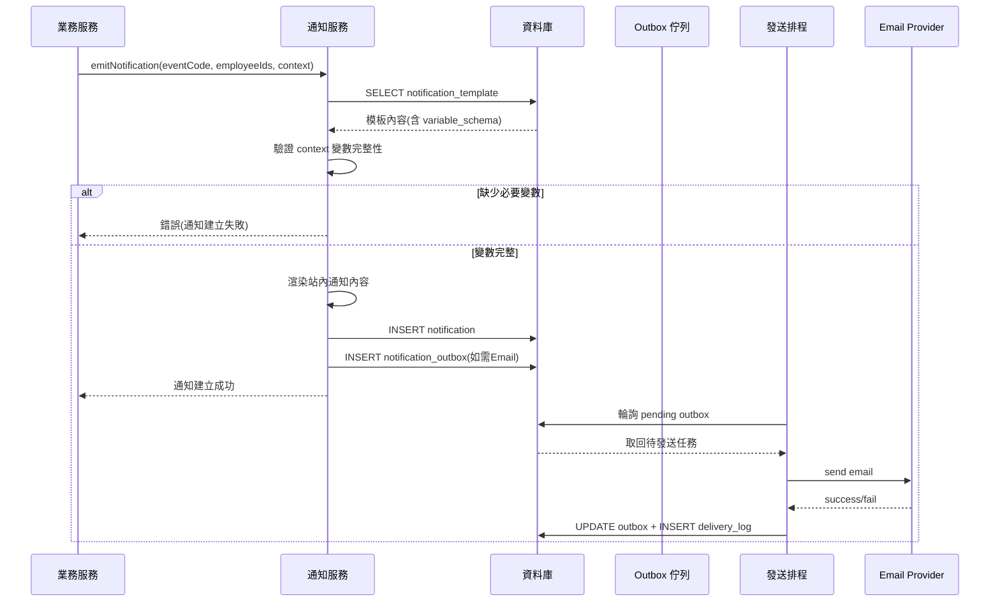
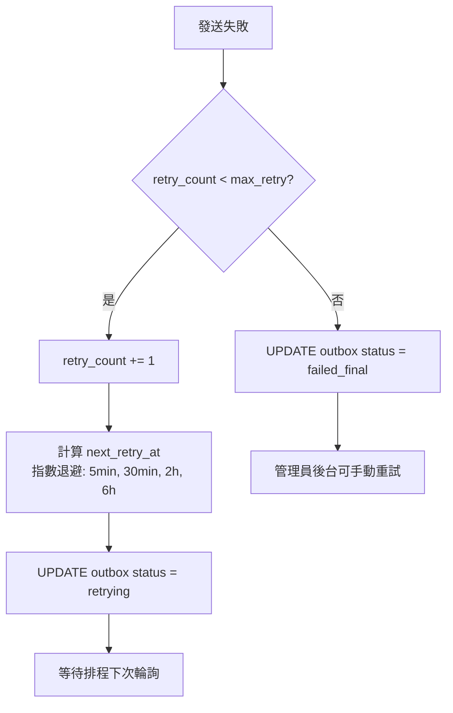
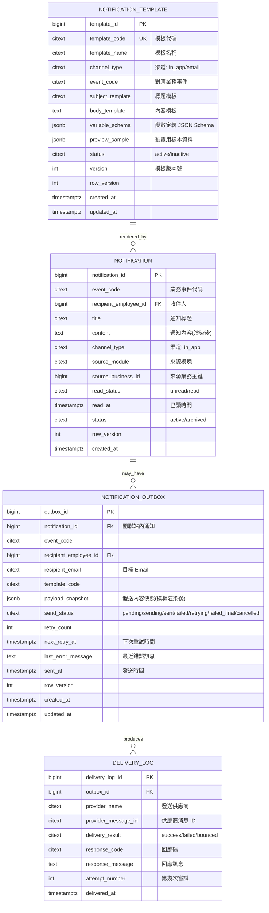
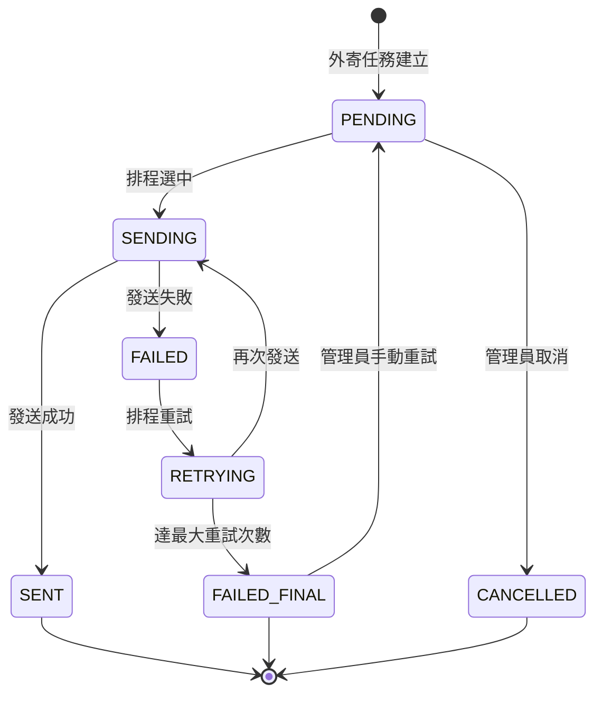

# PRD_M09_SYS_Notification_v2_20260703

> 版本：v2 增強版 | 基於舊版 M09 子 PRD、工作說明書 SOW、資料庫優化報告、全域規範 v2 重構

---

## 1. 模塊概述

### 1.1 功能定位

M09 是整個福利平台的統一消息中台，負責把 BEN、PAY、WF、ANN、SEC 等模塊產生的業務事件，轉換成可送達、可追蹤、可稽核的通知結果。核心能力包含：
- **站內通知中心**：同一業務事件至少產生一筆站內通知
- **通知模板**：模板變數填充與預覽
- **外寄任務佇列(Outbox)**：Email 等外部渠道的非同步發送
- **送達追蹤(Delivery Log)**：發送結果記錄與重試

### 1.2 業務價值

- **可靠通知**：借助 Outbox 模式，確保業務事件→通知不遺失
- **模板驅動**：通知內容不寫死在業務代碼中，後台可配置
- **渠道解耦**：站內通知與 Email 外寄分離，Email 失敗不影響主流程
- **送達可追蹤**：每個通知可追溯到是否已讀、是否送達

### 1.3 使用角色

| 角色 | 權限範圍 |
|------|----------|
| 系統管理員 | 管理模板、查看外寄任務與送達記錄 |
| 公告管理員 | 查看與自己業務相關的推播結果 |
| 福利社承辦人/主管 | 接收通知、查看本人通知 |
| 資安稽核人員 | 查看高風險事件的通知與送達紀錄 |

### 1.4 所屬領域與模塊類型

- **所屬領域**：SYS（System，系統基礎設施域）
- **模塊類型**：底層能力模塊
- **依賴**：M05（EMP，收件人聯絡資訊）、M07（SYS 字典，狀態/渠道/模板類型）、M08（SYS 檔案，附件引用）
- **被依賴**：M14(M15)(BEN 送審通知)、M17(M18)(PAY 撥款/領款/異議通知)、M11(WF 待辦通知)、M19(ANN 公告發布通知)、M24(SEC 告警通知)

---

## 2. 數據流圖

### 2.1 通知扇出總流程 (Outbox 模式)

```mermaid
flowchart TD
    A[業務事件發生] --> B[通知服務接收事件]
    B --> C[匹配通知模板]
    C --> D[填充變數 → 渲染內容]
    D --> E[INSERT notification(站內)]
    E --> F{是否需外寄 Email?}
    F -->|否| G[流程完成]
    F -->|是| H[INSERT notification_outbox<br/>(同 DB 事務)]
    H --> G
    
    I[Sender Scheduler 輪詢] --> J[SELECT pending outbox]
    J --> K[呼叫 Email Provider]
    K --> L{發送結果}
    L -->|成功| M[UPDATE outbox = sent]
    L -->|失敗| N[UPDATE outbox = failed<br/>排重試]
    M --> O[INSERT delivery_log]
    N --> O
    N --> P{重試次數 < max?}
    P -->|是| Q[設定 next_retry_at]
    Q --> I
    P -->|否| R[標記 outbox = failed_final]
```

### 2.2 通知模板渲染序列



### 2.3 Outbox 重試流程



---

## 3. 數據庫設計

### 3.1 涉及資料表

| 表名 | 用途 | 類型 |
|------|------|------|
| `notification` | 站內通知 | 主表(row_version) |
| `notification_template` | 通知模板 | 主表(row_version) |
| `notification_outbox` | 外寄任務佇列 | 狀態機(row_version) |
| `delivery_log` | 送達記錄 | 追加寫 |
| `outbox_event` | 通用 Outbox 事件(可選) | 追加寫 |

### 3.2 ER 關係圖



### 3.3 關鍵字段說明

#### notification_outbox 狀態機

```sql
-- 待發送任務索引
CREATE INDEX idx_outbox_pending ON notification_outbox(send_status, next_retry_at) 
WHERE send_status IN ('pending', 'retrying');
```

#### payload_snapshot 重要性

外寄任務保留 `payload_snapshot`（模板渲染後的最終內容），防止模板後續修改導致歷史通知內容變化。

#### 通知模板變數定義範例

```json
{
  "variable_schema": {
    "type": "object",
    "required": ["applicant_name", "benefit_type"],
    "properties": {
      "applicant_name": {"type": "string", "description": "申請人姓名"},
      "benefit_type": {"type": "string", "description": "補助類型名稱"},
      "application_id": {"type": "number", "description": "案件編號"}
    }
  }
}
```

---

## 4. 功能需求清單

### 4.1 站內通知

| ID | 名稱 | 優先級 | 說明 | 權限控制 |
|----|------|--------|------|----------|
| M09-F01 | 建立站內通知 | P0 | 業務服務調用 API 建立通知 | - |
| M09-F02 | 通知列表(收件人) | P0 | 按收件人查詢本人的通知列表 | 查看本人通知 |
| M09-F03 | 通知列表(管理) | P1 | 管理員可按事件/模塊/收件人查詢 | 查看通知 |
| M09-F04 | 標記已讀 | P0 | 收件人點擊通知後標記 read | 查看本人通知 |
| M09-F05 | 通知跳轉 | P1 | 通知內容中的業務連結可點擊跳轉 | - |
| M09-F06 | 通知封存 | P2 | 歷史通知定期封存 | - |

### 4.2 通知模板

| ID | 名稱 | 優先級 | 說明 | 權限控制 |
|----|------|--------|------|----------|
| M09-F07 | 模板列表查詢 | P0 | 按渠道/事件代碼分類查詢 | 管理通知模板 |
| M09-F08 | 新增模板 | P0 | 建立新模板(標題+內容+變數定義) | 管理通知模板(高風險) |
| M09-F09 | 編輯模板 | P0 | 修改模板內容 | 管理通知模板(高風險) |
| M09-F10 | 模板預覽 | P0 | 輸入測試樣本，即時預覽渲染效果 | 管理通知模板 |
| M09-F11 | 啟用/停用模板 | P1 | 停用前檢查是否被事件映射引用 | 管理通知模板(高風險) |
| M09-F12 | 模板版本管理 | P2 | 保留模板修改歷史，可回退 | 管理通知模板 |

### 4.3 外寄任務

| ID | 名稱 | 優先級 | 說明 | 權限控制 |
|----|------|--------|------|----------|
| M09-F13 | 建立外寄任務 | P0 | 基於事件與模板建立 outbox 記錄 | - |
| M09-F14 | 排程發送 | P0 | Sender Scheduler 輪詢並發送 | - |
| M09-F15 | 重試機制 | P0 | 指數退避重試(配置最大次數) | - |
| M09-F16 | 手動重試 | P1 | 管理員手動重新發送失敗任務 | 手動重試任務(高風險) |
| M09-F17 | 取消發送 | P1 | 管理員取消 pending 中的任務 | 手動重試任務(高風險) |

### 4.4 送達記錄

| ID | 名稱 | 優先級 | 說明 | 權限控制 |
|----|------|--------|------|----------|
| M09-F18 | 送達記錄查詢 | P1 | 按 outbox_id/收件人/時間查詢 | 查看送達記錄 |
| M09-F19 | 送達記錄匯出 | P2 | 匯出發送結果統計 | 匯出送達記錄(高風險) |

---

## 5. 用例文檔

### 用例 1：BEN 補助送審後通知審核人

**前置條件**：職工完成送審，BEN 通過基本校驗

**操作步驟**：
1. BEN 調用 `POST /api/v1/notifications/emit`
2. 請求：`eventCode = "benefit.submitted"`, `recipients = [審核人 employee_id]`, `context = {applicant_name, benefit_type, application_id}`
3. 通知服務查找 `notification_template` 中 event_code 匹配的模板
4. 驗證 context 包含所有 required 變數
5. 渲染站內通知，INSERT notification(status=active)
6. 因該事件配置了 Email 外寄，INSERT notification_outbox(status=pending)
7. Sender Scheduler 在下一輪輪詢中發送 Email

**預期結果**：
- 審核人在通知中心收到站內通知
- 審核人在 Email 信箱收到通知
- template_code、payload_snapshot 完整記錄

**異常處理**：
| 異常場景 | 處理方式 | 錯誤碼 |
|----------|----------|--------|
| 模板未配置 | 使用系統預設模板 | SYS-020 |
| 缺少必要變數 | 回傳錯誤，通知建立失敗 | SYS-021 |
| 收件人無有效 Email | 僅發送站內通知，outbox 標記 cancelled | SYS-022 |
| Email Provider 故障 | outbox 排程重試，站內通知不受影響 | - |

### 用例 2：管理員維護通知模板

**前置條件**：操作者具備管理通知模板權限

**操作步驟**：
1. 進入系統設定 → 通知模板 → 選擇「benefit.submitted」事件
2. 編輯站內版模板內容（標題 + 正文）
3. 在「預覽」頁簽中輸入測試樣本資料
4. 點選「預覽」，查看渲染結果
5. 確認後保存

**預期結果**：
- 模板更新成功，版本號遞增
- 後續該事件的通知使用新模板
- 寫入 audit_event

**異常處理**：
| 異常場景 | 處理方式 |
|----------|----------|
| 模板變數語法錯誤 | 即時提示，不可保存 |
| 模板被事件映射引用時停用 | 提示風險，確認後允許停用 |

### 用例 3：外寄任務失敗後自動重試

**前置條件**：Email Provider 暫時不可用

**操作步驟**：
1. Sender Scheduler 嘗試發送 Email，Provider 返回 503
2. outbox 記錄：`send_status = 'failed'`, `retry_count = 1`, `last_error_message = 'Service Unavailable'`
3. 計算 `next_retry_at = now + 5min`（第一次重試間隔）
4. 5 分鐘後排程重新輪詢到此任務，嘗試發送
5. 持續失敗，第三次重試後達到 `max_retry_count = 3`
6. outbox 更新為 `failed_final`
7. 管理員可在後台查看失敗記錄並決定是否手動重試

**預期結果**：
- 每次嘗試都記錄 delivery_log
- 站內通知不受影響
- 管理員可查看到完整的送達歷程

### 用例 4：管理員手動重試失敗任務

**前置條件**：outbox 狀態為 `failed_final`，管理員確認 Email Provider 已恢復

**操作步驟**：
1. 進入外寄任務頁 → 篩選 failed_final → 選擇任務
2. 點選「手動重試」
3. 確認對話框（高風險操作）

**預期結果**：
- outbox 狀態重置為 pending，retry_count 保留，send_status 變更
- Sender Scheduler 下次輪詢時重新發送
- 寫入 audit_event

### 用例 5：事件代碼與模板映射查詢

**前置條件**：多個模板已配置

**操作步驟**：
1. 進入通知模板頁 → 點選「事件映射」
2. 查看事件代碼 → 模板對應表

**預期結果**：
```json
{
  "benefit.submitted": { "in_app": "tmpl_001", "email": "tmpl_email_001" },
  "benefit.approved": { "in_app": "tmpl_002" },
  "payment.ack_pending": { "in_app": "tmpl_003", "email": "tmpl_email_002" }
}
```

---

## 6. 界面與交互要求

### 6.1 頁面佈局原則

- **通知中心頁**：搜尋篩選(事件/模塊/時間) + 通知列表(標題/收件人/已讀狀態/時間) + 詳情抽屜
- **模板管理頁**：模板分類樹 + 模板列表 + 編輯區(標題/內容) + 變數說明區 + 預覽區
- **外寄任務頁**：狀態篩選 + 任務列表 + 詳情區(含重試歷程) + 操作按鈕
- **送達記錄頁**：查詢條件 + 記錄列表 + provider 回應摘要

### 6.2 外寄任務狀態轉換



### 6.3 通知已讀狀態

- 通知列表顯示已讀/未讀標記
- 點擊通知自動標記已讀
- 支援批量標記已讀
- 通知中心顯示未讀計數(前台/後台頂部導航)

---

## 7. API 接口規格

### 7.1 通知發送

#### POST /api/v1/notifications/emit

發送業務通知（站內 + 可選外寄）。

**請求 Header**：`Idempotency-Key: uuid-v4`

**請求**：
```json
{
  "event_code": "benefit.submitted",
  "recipients": [1001, 1002],
  "context": {
    "applicant_name": "張三",
    "benefit_type": "結婚補助",
    "application_id": 5001
  },
  "source_module": "BEN",
  "source_business_id": 5001
}
```

**響應** (201 Created)：
```json
{
  "code": 0,
  "data": {
    "notification_ids": [2001, 2002],
    "outbox_ids": [3001, 3002]
  }
}
```

**錯誤碼**：
| 錯誤碼 | 說明 |
|--------|------|
| SYS-020 | 未找到匹配模板 |
| SYS-021 | 缺少必要變數 |
| SYS-022 | 收件人無效 |

### 7.2 通知查詢

#### GET /api/v1/notifications

查詢通知列表。

**參數**：
| 名稱 | 類型 | 必填 | 說明 |
|------|------|------|------|
| employee_id | integer | N | 篩選收件人 |
| read_status | string | N | unread/read |
| event_code | string | N | 事件代碼 |
| source_module | string | N | 來源模塊 |
| page | integer | N | 頁碼 |
| size | integer | N | 每頁筆數 |

**響應**：
```json
{
  "code": 0,
  "data": {
    "items": [
      {
        "notification_id": 2001,
        "title": "補助送審通知",
        "event_code": "benefit.submitted",
        "read_status": "unread",
        "created_at": "2026-07-03T10:00:00+08:00",
        "source_module": "BEN",
        "source_business_id": 5001
      }
    ],
    "unread_count": 3,
    "total": 100,
    "page": 1,
    "size": 20
  }
```

#### PATCH /api/v1/notifications/{notification_id}/read

標記通知為已讀。

#### POST /api/v1/notifications/read-batch

批量標記已讀。

**請求**：
```json
{
  "notification_ids": [2001, 2002, 2003]
}
```

### 7.3 模板管理

#### GET /api/v1/notification-templates

查詢模板列表。支援 `event_code`、`channel_type` 篩選。

#### POST /api/v1/notification-templates

新增模板。

**請求**：
```json
{
  "template_code": "benefit_submitted_inapp",
  "template_name": "補助送審通知(站內)",
  "channel_type": "in_app",
  "event_code": "benefit.submitted",
  "subject_template": "{{applicant_name}} 的 {{benefit_type}} 申請已送審",
  "body_template": "申請人 {{applicant_name}} 的 {{benefit_type}}(案件編號 {{application_id}}) 已送審，請至待辦中心處理。",
  "variable_schema": {
    "type": "object",
    "required": ["applicant_name", "benefit_type", "application_id"],
    "properties": {
      "applicant_name": {"type": "string"},
      "benefit_type": {"type": "string"},
      "application_id": {"type": "number"}
    }
  }
}
```

#### POST /api/v1/notification-templates/{code}/preview

預覽模板渲染結果。

**請求**：
```json
{
  "variables": {
    "applicant_name": "張三",
    "benefit_type": "結婚補助",
    "application_id": 5001
  }
}
```

**響應**：
```json
{
  "code": 0,
  "data": {
    "subject": "張三 的 結婚補助 申請已送審",
    "body": "申請人 張三 的 結婚補助(案件編號 5001) 已送審，請至待辦中心處理。"
  }
}
```

### 7.4 外寄任務管理

#### GET /api/v1/notification-outbox

查詢外寄任務列表。支援 `send_status`、`event_code` 篩選。

#### POST /api/v1/notification-outbox/{outbox_id}/retry

手動重試。

#### POST /api/v1/notification-outbox/{outbox_id}/cancel

取消發送。

### 7.5 送達記錄查詢

#### GET /api/v1/delivery-logs

查詢送達記錄。支援 `outbox_id`、`delivery_result` 篩選。

---

## 8. 非功能性需求

### 8.1 性能指標

| 指標 | 目標值 |
|------|--------|
| 通知建立 (P99) | ≤ 500ms (含模板渲染) |
| 通知列表查詢 (P95) | ≤ 300ms |
| 發送排程處理量 | ≥ 1000 outbox/分鐘 |
| 模板預覽 (P95) | ≤ 200ms |
| 通知總量 | 年 ≥ 100 萬筆 |

### 8.2 安全要求

- 通知內容不包含敏感個人資料明文
- 模板變數白名單機制，不允許任意腳本注入
- 高風險通知(安全告警等)需強制稽核
- audit_event 記錄模板變更、手動重試等高風險操作

### 8.3 可用性標準

- 通知建立服務 SLA ≥ 99.5%
- 發送排程故障時，通知仍可建立(僅延遲外寄)
- Email Provider 故障時，站內通知不受影響

---

## 9. 隱含需求補充

### 9.1 審計日誌

| 操作 | action_code | severity |
|------|-------------|----------|
| 新增模板 | SYS.NOTIFY.TEMPLATE.CREATE | INFO |
| 編輯模板 | SYS.NOTIFY.TEMPLATE.UPDATE | WARN |
| 手動重試外寄 | SYS.NOTIFY.OUTBOX.RETRY | WARN |
| 取消外寄任務 | SYS.NOTIFY.OUTBOX.CANCEL | INFO |
| 模板停用(有引用) | SYS.NOTIFY.TEMPLATE.DEACTIVATE | WARN |

### 9.2 數據一致性

- 站內通知與 outbox 在同一 DB 事務中寫入，確保不會站內通知成功但外寄任務遺失
- outbox 的 `payload_snapshot` 保存發送時的模板渲染結果，防止模板後改污染歷史
- delivery_log 每次發送嘗試獨立記錄，不可覆蓋

### 9.3 並發控制

- `notification`、`notification_template`、`notification_outbox` 均包含 `row_version`
- 多個 Sender Scheduler 實例需透過樂觀鎖避免同一 outbox 被重複選中：
  ```sql
  UPDATE notification_outbox 
  SET send_status = 'sending', row_version = row_version + 1 
  WHERE outbox_id = ? AND row_version = ?
  ```

### 9.4 錯誤恢復

- 模板渲染失敗：阻斷通知建立，返回錯誤，不發送空白/錯誤內容
- Email Provider 回傳錯誤：記錄錯誤訊息，排程重試
- Sender Scheduler 當機重啟：重新輪詢所有 pending/retrying 的 outbox
- 重試達到最大次數後標記 failed_final，保留現場供人工介入

### 9.5 冪等性保障

- `POST /notifications/emit` 支援 `Idempotency-Key`，防止同一事件重複發送
- outbox 的冪等透過 Idempotency-Key 唯一約束實現
- 模板查詢、預覽為天然冪等

### 9.6 邊界情況處理

| 邊界情況 | 處理方式 |
|----------|----------|
| 同一事件需通知 500+ 人 | 批次寫入 notification，分頁處理 |
| 收件人已離職/帳號停用 | 跳過發送，outbox 標記 cancelled |
| 模板缺少必要變數 | 通知建立失敗，返回詳細錯誤 |
| 通知內容超長 | Email 模板可設定截斷，站內通知不受限 |
| outbox 在 sending 狀態卡住 | 超時機制(如 5 分鐘)，自動回退為 pending |
| 歷史通知超過保留期限 | 定期排程封存至冷存儲 |
