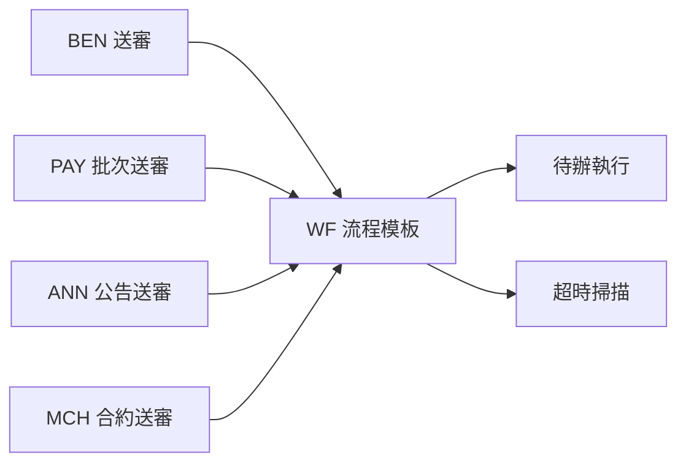
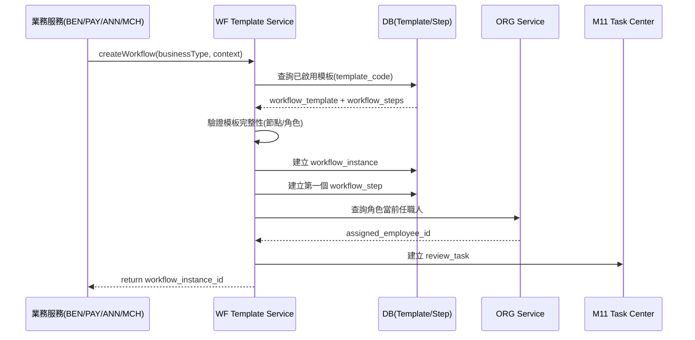
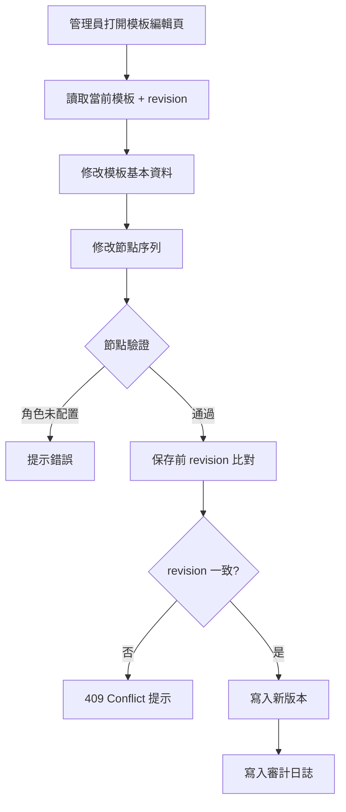
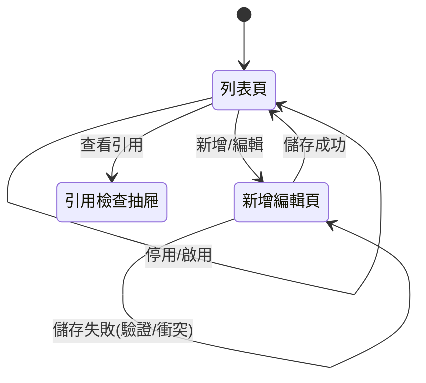

# PRD_M10_WF_Template_v2_20260703

> 版本記錄：v2 增強版，新增數據流圖、API 接口規格、用例文檔、跨模塊契約（冪等性、row_version、審計日誌）
>
> 本模塊為流程模板配置中心，BEN/PAY/ANN/MCH 共用同一套流程引擎，模板版本管理。

---

## 1. 模塊概述

### 1.1 功能定位

本模塊是福利平台的流程編排核心，負責把 BEN、PAY、ANN、MCH 等業務域中的「送審」抽象成可配置、可重用、可追蹤的流程模板。M10 解決的是「一筆業務送審時要走哪一套流程模板、模板裡有哪些節點、每個節點對應什麼角色與動作」。

### 1.2 業務價值

- **統一治理**：避免各業務域各自維護審批邏輯，降低硬編碼風險
- **可配置性**：退回策略、超時規則、審批角色均可在模板層配置
- **版本追溯**：模板版本管理確保歷史實例可還原
- **跨域復用**：BEN/PAY/ANN/MCH 共用同一套模板模型

### 1.3 使用角色

| 角色 | 操作範圍 |
|------|----------|
| 系統管理員 | 模板 CRUD、節點配置、版本管理 |
| 審核主管 | 查看模板、不直接維護 |
| 福利社承辦人 | 一般不直接修改模板 |
| 資安稽核人員 | 查看模板與流程規則 |

### 1.4 所屬領域與模塊類型

- 所屬領域：WF（Workflow）
- 模塊類型：底層能力模塊

---

## 2. 數據流圖

### 2.1 流程模板在整體主鏈路中的位置



### 2.2 模板匹配與流程實例創建數據流



### 2.3 模板編輯保存流程



---

## 3. 數據庫設計

### 3.1 涉及數據表

| 表名 | 用途 |
|------|------|
| workflow_template | 流程模板主檔 |
| workflow_step | 模板節點定義 |
| workflow_instance | 流程實例 |
| workflow_step_instance | 節點實例 |
| workflow_bridge | 業務域與流程的橋接關係 |

### 3.2 表間關聯

```mermaid
erDiagram
    WORKFLOW_TEMPLATE ||--o{ WORKFLOW_STEP : "contains"
    WORKFLOW_TEMPLATE ||--o{ WORKFLOW_INSTANCE : "instantiated"
    WORKFLOW_INSTANCE ||--o{ WORKFLOW_STEP_INSTANCE : "has"
    WORKFLOW_INSTANCE ||--o{ WORKFLOW_BRIDGE : "bridges"
    WORKFLOW_BRIDGE ||--|| BUSINESS: "links to"

    WORKFLOW_TEMPLATE {
        bigint workflow_template_id PK
        varchar template_code UK
        varchar template_name
        varchar process_type "benefit/payment/announcement/merchant"
        varchar business_type
        varchar default_return_mode "applicant/previous_step"
        boolean timeout_policy_enabled
        varchar status "draft/active/inactive/archived"
        bigint row_version "optimistic lock"
        timestamptz created_at
        timestamptz updated_at
        timestamptz deleted_at
    }

    WORKFLOW_STEP {
        bigint workflow_step_id PK
        bigint workflow_template_id FK
        varchar step_code
        varchar step_name
        int step_order
        varchar approver_role_code FK->role
        boolean allow_approve
        boolean allow_return
        boolean allow_reject
        varchar return_mode "applicant/previous_step"
        int timeout_minutes
        varchar auto_action_type "none/notify_only/reserved"
        bigint row_version
    }

    WORKFLOW_INSTANCE {
        bigint workflow_instance_id PK
        bigint workflow_template_id FK
        varchar instance_status "active/completed/terminated"
        varchar initiator_employee_id
        timestamptz created_at
        timestamptz completed_at
    }

    WORKFLOW_BRIDGE {
        bigint bridge_id PK
        bigint workflow_instance_id FK
        varchar source_module "BEN/PAY/ANN/MCH"
        bigint source_business_id
        varchar business_no
    }
```

### 3.3 關鍵字段說明

| 字段 | 說明 |
|------|------|
| `return_mode` | `applicant`=回申請人, `previous_step`=回上一節點（僅特殊模板） |
| `auto_action_type` | MVP 階段默認 `none`，僅白名單模板可開啟 |
| `row_version` | 樂觀鎖，所有模板與節點寫入前檢查 |
| `process_type` | 頂層分類，決定模板所屬業務域 |

---

## 4. 功能需求清單

| 編號 | 名稱 | 優先級 | 說明 | 權限控制 |
|------|------|--------|------|----------|
| M10-F01 | 流程模板列表查詢 | P0 | 查看所有模板，支援狀態/業務類型篩選 | 管理員、稽核員 |
| M10-F02 | 新增流程模板 | P0 | 創建新模板，含基本資料與節點配置 | 管理員 |
| M10-F03 | 編輯流程模板 | P0 | 修改模板資料，保存前 revision 檢查 | 管理員 |
| M10-F04 | 複製流程模板 | P1 | 基於現有模板快速建立新模板 | 管理員 |
| M10-F05 | 停用/啟用模板 | P0 | 狀態變更前檢查進行中實例 | 管理員 |
| M10-F06 | 節點序列配置 | P0 | 線性節點新增/排序/刪除 | 管理員 |
| M10-F07 | 節點角色綁定 | P0 | 為節點選擇 ORG 角色 | 管理員 |
| M10-F08 | 動作規則配置 | P0 | 核准/退回/駁起權限與流向 | 管理員 |
| M10-F09 | 退回策略配置 | P0 | 預設回申請人，特殊模板可回上一節點 | 管理員 |
| M10-F10 | 超時策略配置 | P1 | 超時分鐘數、通知角色、自動動作 | 管理員 |
| M10-F11 | 模板引用檢查 | P1 | 查看哪些業務類型/實例引用此模板 | 管理員、稽核員 |
| M10-F12 | 模板版本管理 | P1 | 模板變更保留版本歷史 | 管理員 |

---

## 5. 用例文檔

### 用例 1：建立並啟用補助申請流程模板

- **前置條件**：管理員已登入，ORG 角色已配置
- **操作步驟**：
  1. 進入流程管理 → 流程模板列表
  2. 點擊「新增模板」，輸入 template_code、template_name
  3. 選擇 process_type=`benefit`、business_type=`marriage_subsidy`
  4. 新增第一個節點：step_order=1, step_name=`初審`, approver_role=`WELFARE_CLERK`, 允許核准/退回
  5. 新增第二個節點：step_order=2, step_name=`主管核准`, approver_role=`WELFARE_MANAGER`, 允許核准/退回/駁回
  6. 設定退回模式：`return_mode=applicant`
  7. 儲存 → 狀態設為 `active`
- **預期結果**：模板建立成功，BEN 送審可正確匹配到此模板
- **異常處理**：節點未配置角色時保存被阻斷

### 用例 2：特殊模板允許退回上一節點

- **前置條件**：管理員已登入，模板處於 draft 狀態
- **操作步驟**：
  1. 編輯特殊模板（如三階簽核模板）
  2. 在第二節點設定 `return_mode=previous_step`
  3. 儲存
- **預期結果**：退回模式正確設為上一節點
- **異常處理**：非特殊模板時系統拒絕退出策略變更

### 用例 3：模板停用前檢查引用

- **前置條件**：模板當前為 active，且有進行中實例
- **操作步驟**：
  1. 點擊「停用模板」
  2. 系統執行引用檢查
  3. 顯示「存在 N 筆進行中實例」
- **預期結果**：提示風險，要求確認後僅影響新實例
- **異常處理**：可選擇強制停用（新實例不再使用），但舊實例繼續流轉

### 用例 4：並發編輯模板衝突

- **前置條件**：A 和 B 同時打開同一模板編輯頁
- **操作步驟**：
  1. A 先保存修改（revision 更新）
  2. B 後保存修改（使用舊 revision）
- **預期結果**：B 收到 409 Conflict，提示模板已被修改
- **異常處理**：B 需重新讀取最新版本後再編輯

### 用例 5：複製模板快速配置

- **前置條件**：存在一份完整的 active 模板
- **操作步驟**：
  1. 點擊「複製模板」
  2. 系統複製模板全部資料與節點
  3. 新模板狀態設為 draft
- **預期結果**：新模板所有欄位與節點完全相同
- **異常處理**：複製後需修改 template_code，不可重複

---

## 6. 界面與交互要求

### 6.1 頁面佈局原則

- 模板列表頁採用表格佈局，支援排序與篩選
- 模板編輯頁分左右兩欄：左側為模板基本資料，右側為節點序列視覺化
- 節點配置以線性卡片排列，可拖曳排序
- 操作按鈕統一放在右上角工具列

### 6.2 關鍵交互流程



### 6.3 節點編輯交互

- 節點卡片支持：新增（插入到當前位置）、刪除（最後一個節點不可刪除）、排序（上下拖曳）
- 每個節點卡片包含：名稱、角色選擇下拉、動作核取方塊（核准/退回/駁回）、退回模式、超時分鐘數
- 角色選擇下拉由 ORG 服務提供即時查詢

---

## 7. API 接口規格

### 7.1 模板管理

| 方法 | 路徑 | 說明 |
|------|------|------|
| GET | `/api/v1/wf/templates` | 查詢模板列表 |
| GET | `/api/v1/wf/templates/{id}` | 查詢模板詳情（含節點） |
| POST | `/api/v1/wf/templates` | 新增模板 |
| PUT | `/api/v1/wf/templates/{id}` | 更新模板 |
| PATCH | `/api/v1/wf/templates/{id}/status` | 變更模板狀態 |

#### POST `/api/v1/wf/templates`

**Request:**
```json
{
  "template_code": "BEN_MARRIAGE_V1",
  "template_name": "婚嫁補助審批流程",
  "process_type": "benefit",
  "business_type": "marriage_subsidy",
  "default_return_mode": "applicant",
  "timeout_policy_enabled": true,
  "steps": [
    {
      "step_code": "STEP01",
      "step_name": "初審",
      "step_order": 1,
      "approver_role_code": "WELFARE_CLERK",
      "allow_approve": true,
      "allow_return": true,
      "allow_reject": false,
      "return_mode": "applicant",
      "timeout_minutes": 1440
    },
    {
      "step_code": "STEP02",
      "step_name": "主管核准",
      "step_order": 2,
      "approver_role_code": "WELFARE_MANAGER",
      "allow_approve": true,
      "allow_return": true,
      "allow_reject": true,
      "return_mode": "applicant",
      "timeout_minutes": 2880
    }
  ]
}
```

**Response (201):**
```json
{
  "workflow_template_id": 1001,
  "template_code": "BEN_MARRIAGE_V1",
  "status": "draft",
  "row_version": 1,
  "steps": [
    { "workflow_step_id": 5001, "step_code": "STEP01", "step_order": 1 },
    { "workflow_step_id": 5002, "step_code": "STEP02", "step_order": 2 }
  ]
}
```

**Error Codes:**

| 錯誤碼 | HTTP Status | 說明 |
|--------|-------------|------|
| WF-001 | 400 | 模板代碼已存在 |
| WF-002 | 400 | 節點未配置角色 |
| WF-003 | 409 | row_version 衝突 |
| WF-004 | 400 | 退回模式違反平台規則 |
| WF-005 | 400 | 模板有進行中實例不可停用 |

### 7.2 模板匹配

| 方法 | 路徑 | 說明 |
|------|------|------|
| POST | `/api/v1/wf/templates/match` | 依業務類型匹配模板 |

#### POST `/api/v1/wf/templates/match`

**Request:**
```json
{
  "process_type": "benefit",
  "business_type": "marriage_subsidy"
}
```

**Response (200):**
```json
{
  "matched": true,
  "workflow_template_id": 1001,
  "template_code": "BEN_MARRIAGE_V1",
  "steps": [ ... ]
}
```

**Error Codes:**

| 錯誤碼 | HTTP Status | 說明 |
|--------|-------------|------|
| WF-010 | 404 | 未找到對應模板 |
| WF-011 | 500 | 匹配到多個模板（配置錯誤） |

### 7.3 流程實例創建

| 方法 | 路徑 | 說明 |
|------|------|------|
| POST | `/api/v1/wf/instances` | 建立流程實例 |

**Request:**
```json
{
  "workflow_template_id": 1001,
  "initiator_employee_id": "EMP001",
  "source_module": "BEN",
  "source_business_id": 20001,
  "business_no": "TP-115-06-001",
  "idempotency_key": "550e8400-e29b-41d4-a716-446655440000"
}
```

**Response (201):**
```json
{
  "workflow_instance_id": 30001,
  "instance_status": "active",
  "current_step_id": 5001,
  "task_id": 40001
}
```

---

## 8. 非功能性需求

### 8.1 性能指標

| 指標 | 目標值 |
|------|--------|
| 模板列表查詢 | < 500ms |
| 模板匹配 | < 200ms |
| 流程實例創建 | < 1s |
| 模板保存 | < 1s |

### 8.2 安全要求

- 模板修改操作寫入審計日誌（audit_event）
- 高風險操作（停用模板、修改節點角色）需二次確認
- 模板數據通過 API 傳輸時需 TLS 加密
- 模板操作權限嚴格按 RBAC 控制

### 8.3 可用性標準

- 模板服務可用性 ≥ 99.9%
- 模板配置維護窗口支援熱更新（不重啟服務）
- 模板版本支持回溯

---

## 9. 隱含需求補充

### 9.1 審計日誌

所有模板操作（新增、編輯、狀態變更、複製）必須寫入 `audit_event`：
```json
{
  "correlation_id": "UUID",
  "actor_id": "admin_employee_id",
  "action_code": "WF.TEMPLATE.UPDATE",
  "target_type": "workflow_template",
  "target_id": 1001,
  "payload": { "diff": { "timeout_minutes": [1440, 2880] } },
  "severity": "INFO"
}
```

### 9.2 冪等性（Idempotency-Key）

- POST `/api/v1/wf/instances` 必須支持 `Idempotency-Key` header
- 相同 `Idempotency-Key` 在 24 小時內返回相同結果
- 防止重試導致重複建立流程實例

### 9.3 並發控制（row_version）

- 所有模板與節點更新操作必須攜帶 `row_version`
- 服務端 UPDATE 時檢查 `WHERE row_version = :old_version`
- 不匹配返回 409 Conflict

### 9.4 Outbox 模式

- 流程實例創建成功後，如需扇出通知，透過 Outbox 事件投遞
- 業務操作與 Outbox 事件在同一資料庫事務中寫入

### 9.5 錯誤恢復

- 模板保存失敗時不殘留髒數據（事務回滾）
- 模板匹配失敗時業務域不可建立流程實例
- 模板狀態變更失敗時保持原狀態

### 9.6 邊界情況

- **無對應模板**：業務送審時找不到模板，直接阻斷並報錯
- **節點無角色**：模板不得啟用
- **退回模式違規**：非特殊模板不允許回上一節點
- **進行中實例**：停用模板需提示存在進行中實例
- **MVP 限制**：僅支援單線串簽，不支援會簽
