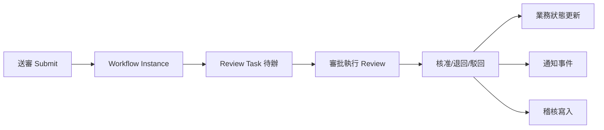
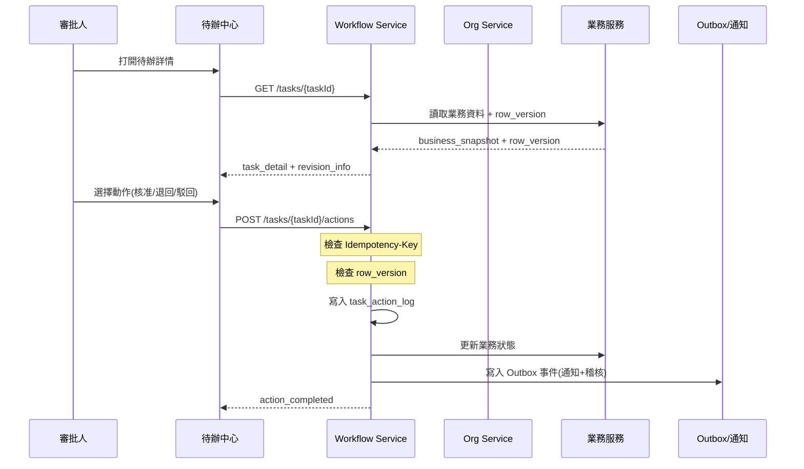
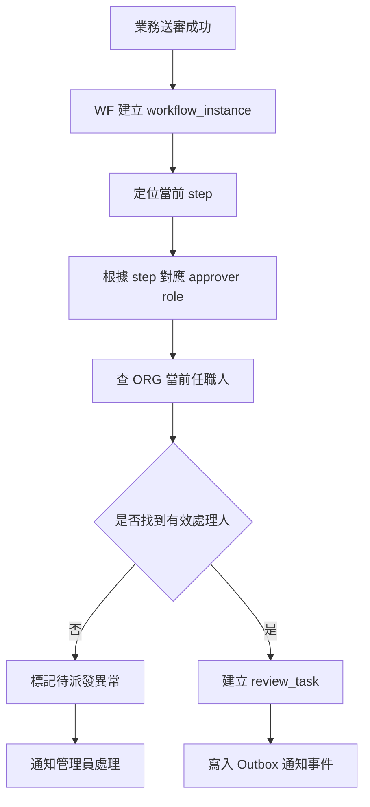
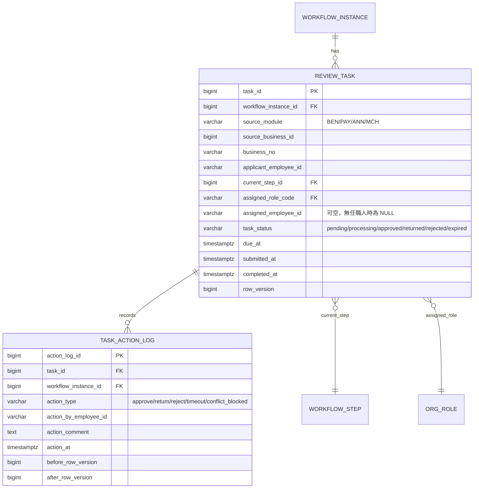
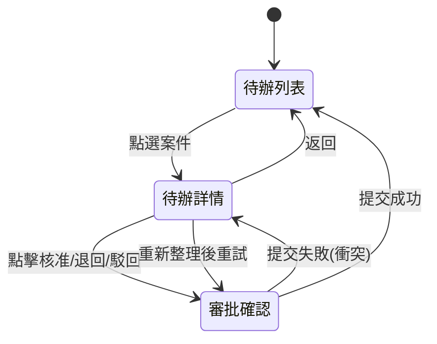

# PRD_M11_WF_TaskCenter_v2_20260703

> 版本記錄：v2 增強版，新增 API 規格、冪等性契約、row_version 並發控制、審計日誌補充、跨模塊數據流圖
>
> 待辦中心是跨模塊統一入口，審批動作需冪等性保障，支援核准/退回/駁回三種動作。

---

## 1. 模塊概述

### 1.1 功能定位

本模塊是流程引擎在管理後台的「執行面」，負責承接 M10 已定義好的流程模板，把抽象節點變成可由承辦人、主管或其他審批角色實際處理的待辦事項。待辦中心是跨模塊統一入口。

### 1.2 業務價值

- **統一入口**：BEN/PAY/ANN/MCH 所有待辦集中在一個頁面，審批角色不必切換模塊
- **標準化審批**：核准/退回/駁回三種動作統一執行模式
- **可追溯**：每個審批動作記錄操作人、時間、意見
- **版本安全**：審批提交前強制 revision 檢查，防止基於舊資料決策

### 1.3 使用角色

| 角色 | 操作範圍 |
|------|----------|
| 審核主管 | 主要審批角色，可核准/退回/駁回 |
| 福利社承辦人 | 承接初審待辦 |
| 公告管理員 | 查看公告審批結果 |
| 系統管理員 | 查看與治理異常待辦 |
| 資安稽核人員 | 查看審批軌跡 |

### 1.4 所屬領域與模塊類型

- 所屬領域：WF（Workflow）
- 模塊類型：業務支撐模塊（後台頁面）

---

## 2. 數據流圖

### 2.1 待辦中心在整體流程中的位置



### 2.2 審批執行序列圖



### 2.3 待辦建立流程



---

## 3. 數據庫設計

### 3.1 涉及數據表

| 表名 | 用途 |
|------|------|
| review_task | 待辦主表 |
| task_action_log | 審批動作日誌 |
| workflow_instance | 流程實例 |
| workflow_bridge | 橋接關聯 |

### 3.2 表間關聯



### 3.3 關鍵字段說明

| 字段 | 說明 |
|------|------|
| `task_status` | pending=待處理, processing=處理中, approved=已核准, returned=已退回, rejected=已駁回, expired=已超時 |
| `assigned_employee_id` | 可為 NULL，當角色無任職人時需標記異常 |
| `row_version` | 樂觀鎖，審批提交前必須檢查 |
| `due_at` | 由模板 timeout_minutes 推算，供 M12 超時掃描使用 |

---

## 4. 功能需求清單

| 編號 | 名稱 | 優先級 | 說明 | 權限控制 |
|------|------|--------|------|----------|
| M11-F01 | 我的待辦列表 | P0 | 顯示當前使用者所有待處理案件 | 本人 |
| M11-F02 | 已處理待辦查詢 | P0 | 顯示已處理的歷史待辦 | 本人 |
| M11-F03 | 待辦詳情查看 | P0 | 查看業務摘要、附件、流程、版本 | 待辦處理人 |
| M11-F04 | 核准 | P0 | 核准當前待辦，推進至下一節點 | 待辦處理人 |
| M11-F05 | 退回 | P0 | 退回至申請人（或上一節點） | 待辦處理人 |
| M11-F06 | 駁回 | P0 | 駁回並結束流程 | 待辦處理人 |
| M11-F07 | 審批意見填寫 | P0 | 核准/退回/駁回時填寫意見 | 待辦處理人 |
| M11-F08 | 版本衝突檢查 | P0 | 提交前檢查 row_version | 系統自動 |
| M11-F09 | 冪等性保障 | P0 | Idempotency-Key 防止重複提交 | 系統自動 |
| M11-F10 | 流程時間線 | P1 | 查看流程歷史與事件 | 待辦處理人 |
| M11-F11 | 超時標記展示 | P1 | 已超時待辦在列表中高亮 | 系統自動 |
| M11-F12 | 待辦匯出 | P2 | 匯出已處理紀錄 | 系統管理員 |

---

## 5. 用例文檔

### 用例 1：審核主管核准補助待辦

- **前置條件**：職工已送審，流程實例已建立，待辦已派發至主管
- **操作步驟**：
  1. 主管登入 → 待辦中心 → 我的待辦
  2. 點開補助案件待辦
  3. 查看申請資料、附件、規則檢查結果
  4. 點擊「核准」，填寫審批意見
  5. 系統檢查 row_version（一致）
  6. 提交成功
- **預期結果**：待辦狀態變為 approved，流程推進至下一節點或完成，業務狀態更新
- **異常處理**：row_version 不一致時提示版本衝突，禁止提交

### 用例 2：退回待辦並填寫原因

- **前置條件**：主管打開待辦詳情
- **操作步驟**：
  1. 點擊「退回」
  2. 系統彈出退回原因輸入框（必填）
  3. 輸入退件原因：「診斷證明書模糊不清，請重新上傳」
  4. 系統檢查 row_version
  5. 提交成功
- **預期結果**：待辦狀態變為 returned，案件回到退回狀態，申請人可在前台看到回退原因
- **異常處理**：退回原因為空時阻斷提交

### 用例 3：並發操作導致版本衝突

- **前置條件**：A（主管）和 B（承辦）同時打開同一案件
- **操作步驟**：
  1. B 先修改業務資料（row_version 從 1 變為 2）
  2. A 提交核准（仍使用 row_version=1）
- **預期結果**：系統檢查 row_version 不一致，返回 409 Conflict，提示「資料已更新，請重新整理」
- **異常處理**：A 需重新載入案件詳情獲取最新 row_version

### 用例 4：重複提交防止（冪等性）

- **前置條件**：主管提交核准，請求因網路超時未收到回應
- **操作步驟**：
  1. 前端自動重試相同 Idempotency-Key
  2. 服務端比對 Idempotency-Key
- **預期結果**：返回與第一次相同的成功結果，不重複寫入
- **異常處理**：Idempotency-Key 已過期（24h）則視為新請求

### 用例 5：無任職人時待辦派發異常

- **前置條件**：模板節點角色在 ORG 中無任職人
- **操作步驟**：
  1. BEN 送審成功，WF 建立流程
  2. 待辦派發發現無有效任職人
- **預期結果**：待辦標記為派發異常，系統管理員收到通知
- **異常處理**：管理員手動指定處理人或調整角色任職

---

## 6. 界面與交互要求

### 6.1 頁面佈局原則

- 待辦列表上方為統計摘要卡（待處理、已超時、本週處理量）
- 篩選區支援：來源模塊、業務類型、時間區間、狀態
- 列表欄位：案件編號、來源、申請人、當前節點、到期時間、超時標記
- 待辦詳情頁採內容區分欄：左側業務資料、右側流程資訊

### 6.2 關鍵交互流程



### 6.3 審批操作交互

- 核准/退回/駁回按鈕統一放在頁面底部操作區
- 核准按鈕：綠色，單擊彈出意見輸入框
- 退回按鈕：橙色，強制要求輸入退回原因
- 駁回按鈕：紅色，強制要求輸入駁回原因
- 提交前二次確認彈窗
- 提交後按鈕立即鎖定防止重複點擊

---

## 7. API 接口規格

### 7.1 待辦查詢

| 方法 | 路徑 | 說明 |
|------|------|------|
| GET | `/api/v1/wf/tasks` | 查詢待辦列表 |
| GET | `/api/v1/wf/tasks/{taskId}` | 查詢待辦詳情 |

#### GET `/api/v1/wf/tasks?status=pending&source_module=BEN`

**Response:**
```json
{
  "items": [
    {
      "task_id": 40001,
      "workflow_instance_id": 30001,
      "source_module": "BEN",
      "business_no": "TP-115-06-001",
      "applicant_name": "王小明",
      "current_step_name": "主管核准",
      "assigned_role_name": "福利社主管",
      "task_status": "pending",
      "submitted_at": "2026-07-01T10:00:00Z",
      "due_at": "2026-07-03T10:00:00Z",
      "is_timeout": false,
      "row_version": 3
    }
  ],
  "total": 1,
  "page": 1,
  "page_size": 20
}
```

### 7.2 審批動作執行

| 方法 | 路徑 | 說明 |
|------|------|------|
| POST | `/api/v1/wf/tasks/{taskId}/actions` | 執行審批動作 |

#### POST `/api/v1/wf/tasks/{taskId}/actions`

**Request:**
```json
{
  "action": "approve",
  "comment": "資料審核無誤，同意撥款",
  "row_version": 3,
  "idempotency_key": "660e8400-e29b-41d4-a716-446655440001"
}
```

**Response (200):**
```json
{
  "task_id": 40001,
  "action_log_id": 50001,
  "task_status": "approved",
  "new_row_version": 4,
  "next_step": {
    "step_name": "流程完成",
    "is_final": true
  }
}
```

### 7.3 待辦時間線

| 方法 | 路徑 | 說明 |
|------|------|------|
| GET | `/api/v1/wf/instances/{instanceId}/timeline` | 查詢流程時間線 |

**Response:**
```json
{
  "events": [
    { "event_type": "task_created", "action_at": "...", "description": "建立待辦" },
    { "event_type": "task_approved", "action_by": "EMP002", "action_at": "...", "comment": "核准" }
  ]
}
```

### 7.4 錯誤碼定義

| 錯誤碼 | HTTP Status | 說明 |
|--------|-------------|------|
| WF-020 | 400 | 待辦狀態不可執行此動作 |
| WF-021 | 409 | row_version 衝突，請重新整理 |
| WF-022 | 409 | 重複提交（Idempotency-Key 已存在但與當前請求不一致） |
| WF-023 | 400 | 退回原因為空 |
| WF-024 | 400 | 駁回原因為空 |
| WF-025 | 404 | 待辦不存在或已刪除 |
| WF-026 | 403 | 非當前待辦處理人 |

---

## 8. 非功能性需求

### 8.1 性能指標

| 指標 | 目標值 |
|------|--------|
| 待辦列表查詢 | < 500ms |
| 待辦詳情查詢 | < 800ms |
| 審批動作提交 | < 1s |
| 待辦列表支援分頁 | 每頁 20 筆 |
| 並發審批 | 支援 50 人同時操作 |

### 8.2 安全要求

- 審批動作必須驗證操作人為當前待辦處理人
- 所有審批動作寫入稽核日誌
- 退回/駁回原因強制必填
- 已完成待辦操作按鈕前後端雙重鎖定

### 8.3 可用性標準

- 待辦服務可用性 ≥ 99.9%
- 審批動作提交必須保證最終一致性
- 超時待辦列表高亮顯示

---

## 9. 隱含需求補充

### 9.1 審計日誌

所有審批動作必須寫入 `audit_event`：
```json
{
  "correlation_id": "UUID",
  "actor_id": "reviewer_employee_id",
  "action_code": "WF.TASK.APPROVE",
  "target_type": "review_task",
  "target_id": 40001,
  "old_status": "pending",
  "new_status": "approved",
  "payload": { "comment": "核准", "workflow_instance_id": 30001 },
  "severity": "INFO"
}
```

### 9.2 冪等性保障

- POST `/api/v1/wf/tasks/{taskId}/actions` 強制要求 `Idempotency-Key` header
- 服務端保留 24 小時，相同 key 返回相同結果
- 前端在提交按鈕點擊後立即生成 UUID v4 作為冪等鍵
- 網路超時重試時攜帶相同 key，防止重複核准/退回/駁回

### 9.3 並發控制（row_version）

- 待辦詳情打開時讀取當前 row_version
- 提交審批動作時攜帶此 row_version
- 服務端 UPDATE `review_task` 時檢查 `WHERE row_version = :old_version`
- 不匹配返回 409 Conflict，前端提示重新整理

### 9.4 Outbox 模式

- 審批動作完成後，業務狀態更新與 Outbox 事件在同一事務
- Outbox 工作者消費事件：寫入通知中心、稽核日誌等
- 確保審批結果不丟失

### 9.5 錯誤恢復

- 審批提交的事務中斷時，不殘留部分更新
- 待辦詳情讀取失敗時顯示友好錯誤頁面
- 業務服務不可用時，待辦中心仍可查看待辦列表（但不含業務詳情）

### 9.6 邊界情況

- **已處理待辦不可重複提交**：前端後端雙重鎖定
- **業務資料已被刪除**：待辦詳情顯示異常提示
- **角色已停用**：不可再建立新待辦至該角色
- **超時後處理**：待辦仍可被處理（非阻塞），但記錄超時背景
- **多角色任職**：只派發給對應角色的當前任職人
