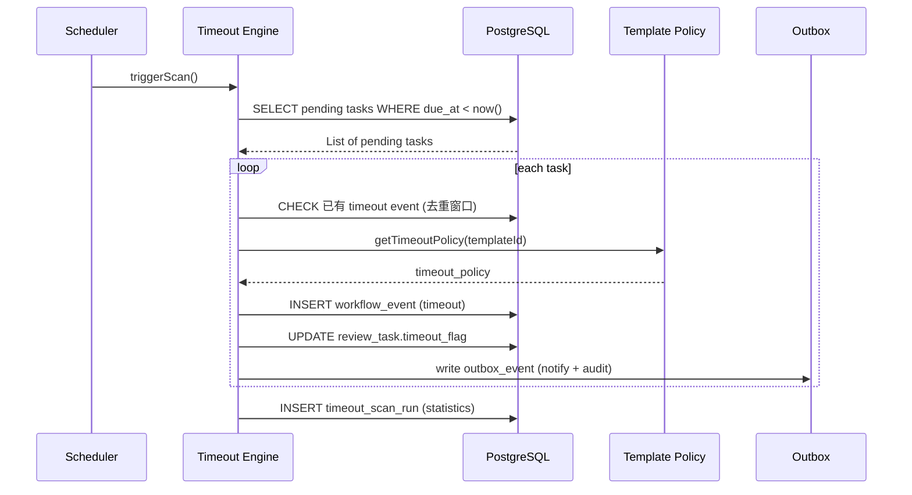
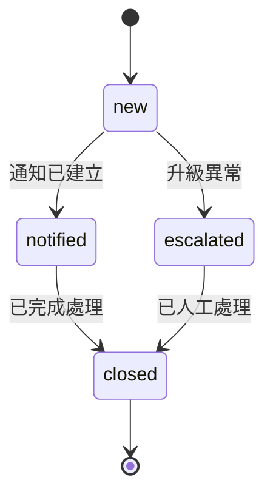
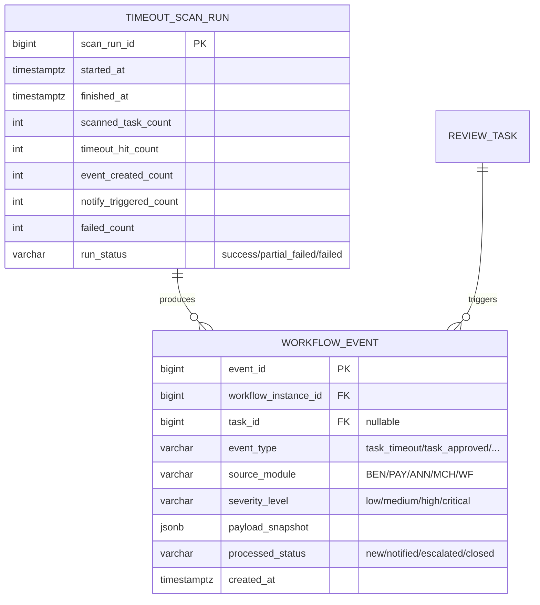
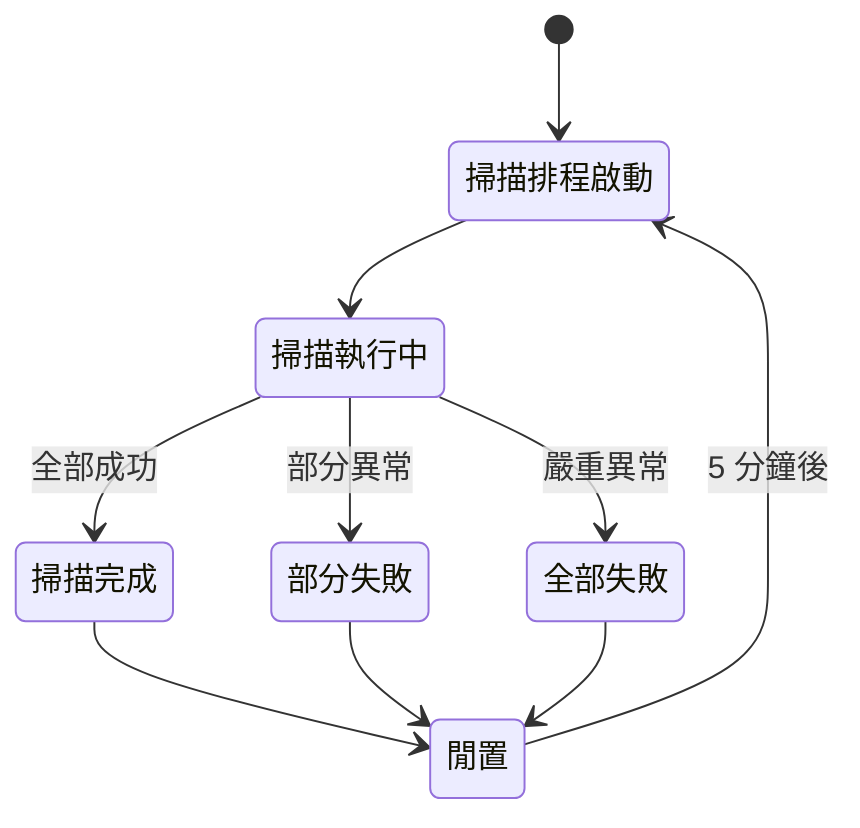

# PRD_M12_WF_Timeout_v2_20260703

> 版本記錄：v2 增強版，新增排程掃描數據流、事件去重邏輯、API 規格、異常升級流程
>
> 5 分鐘超時掃描 scheduler，只通知不自動核准（預設），流程事件標準化記錄。

---

## 1. 模塊概述

### 1.1 功能定位

本模塊是流程引擎的「時間治理層」與「事件中樞層」，負責按固定節奏掃描所有有效待辦，識別已超時的節點，產生標準化流程事件，輸出通知、稽核與時間線數據。

### 1.2 業務價值

- **時間治理**：確保流程不因審批人遺忘而永久停滯
- **事件標準化**：流程建立、待辦建立、超時、核准等均形成可追蹤事件
- **治理紅線**：嚴格遵守「未配置自動動作時不自動核准」的邊界

### 1.3 使用角色

| 角色 | 操作範圍 |
|------|----------|
| 系統管理員 | 查看掃描結果、治理異常、配置超時策略 |
| 審核主管 | 查看與自己相關的超時結果 |
| 福利社承辦人 | 查看業務相關流程停滯 |
| 資安稽核人員 | 查看超時異常事件 |

### 1.4 所屬領域與模塊類型

- 所屬領域：WF（Workflow）
- 模塊類型：底層能力模塊

---

## 2. 數據流圖

### 2.1 超時掃描主流程

```mermaid
flowchart TD
    A[Scheduler 每 5 分鐘啟動] --> B[讀取所有 pending review_task]
    B --> C[比對 due_at]
    C --> D{是否超時}
    D -->|否| E[跳過]
    D -->|是| F[事件去重檢查]
    F --> G{已有 timeout 事件?}
    G -->|是(去重窗口內)| E
    G -->|否| H[建立 timeout event]
    H --> I{模板是否配置自動動作}
    I -->|否| J[只記錄事件並通知]
    I -->|是(白名單)| K[執行允許的自動動作]
    J --> L[更新 task timeout 標記]
    K --> L
    L --> M[寫入流程歷程/稽核/通知事件]
```

### 2.2 超時掃描序列圖



### 2.3 流程事件生命週期



---

## 3. 數據庫設計

### 3.1 涉及數據表

| 表名 | 用途 |
|------|------|
| workflow_event | 流程事件主表 |
| timeout_scan_run | 掃描執行紀錄 |
| review_task | 待辦表（超時標記） |

### 3.2 表間關聯



### 3.3 關鍵字段說明

| 字段 | 說明 |
|------|------|
| `severity_level` | 供 SEC 治理使用，持續多輪超時自動升級 |
| `processed_status` | 事件處理狀態，新事件→已通知→已關閉 |
| `payload_snapshot` | JSON 快照，保存當時 step/role/business_no/due_at |
| `event_type` | 標準化事件類型，供 M09 通知和 M11 時間線消費 |

---

## 4. 功能需求清單

| 編號 | 名稱 | 優先級 | 說明 | 權限控制 |
|------|------|--------|------|----------|
| M12-F01 | 超時掃描排程 | P0 | 每 5 分鐘掃描 pending task | 系統自動 |
| M12-F02 | Timeout 判斷 | P0 | 比對 due_at/status 判斷是否超時 | 系統自動 |
| M12-F03 | 事件去重 | P0 | 去重窗口內不重複建立 timeout 事件 | 系統自動 |
| M12-F04 | 流程事件建立 | P0 | 超時後建立標準化 workflow_event | 系統自動 |
| M12-F05 | 通知觸發 | P0 | 超時後透過 Outbox 觸發通知事件 | 系統自動 |
| M12-F06 | 自動動作控制 | P1 | 白名單模板可配置自動動作 | 系統自動（受控） |
| M12-F07 | 超時監控頁 | P1 | 查看已超時/即將超時待辦 | 管理員/稽核員 |
| M12-F08 | 掃描執行紀錄 | P1 | 查看每輪掃描統計 | 管理員 |
| M12-F09 | 異常升級 | P2 | 連續多輪超時升級事件級別 | 系統自動 |
| M12-F10 | 手動重發通知 | P2 | 對已超時待辦重發通知 | 系統管理員 |

---

## 5. 用例文檔

### 用例 1：主管長時間未處理補助待辦

- **前置條件**：職工已送審，待辦已建立，due_at 已過
- **操作步驟**：
  1. Scheduler 每 5 分鐘觸發 M12
  2. M12 讀取所有 pending review_task
  3. 比對 `due_at < now()` → 發現超時
  4. 去重檢查（此 task 在窗口內無 timeout 事件）
  5. 建立 timeout event
  6. 檢查模板 `auto_action_type=none`
  7. 更新 `review_task.timeout_flag=true`
  8. 寫入 Outbox 事件（通知當前處理人 + 管理員）
- **預期結果**：超時事件記錄完成，待辦中心顯示超時標記
- **異常處理**：模板未配置自動動作，不可自動核准

### 用例 2：超時事件去重

- **前置條件**：同一待辦在三輪掃描中持續超時
- **操作步驟**：
  1. 第一輪：建立 timeout event（去重窗口起始）
  2. 第二輪（5 分鐘後）：去重窗口內，跳過
  3. 第三輪（10 分鐘後，窗口已過）：建立第二個 timeout event
- **預期結果**：去重窗口內不重複建立事件，防止通知轟炸
- **異常處理**：去重窗口可透過系統參數 `wf.timeout.event.dedup_window_minutes` 配置

### 用例 3：掃描批次部分失敗

- **前置條件**：某輪掃描中部分待辦處理時 DB 連線異常
- **操作步驟**：
  1. M12 已成功處理 50 筆待辦
  2. 第 51 筆 DB 連線失敗
  3. 掃描不整批回滾，保留成功部分
- **預期結果**：`run_status=partial_failed`，記錄失敗清單
- **異常處理**：失敗清單允許下一次掃描補掃

### 用例 4：系統管理員查看超時監控

- **前置條件**：存在已超時待辦
- **操作步驟**：
  1. 管理員進入超時監控頁
  2. 按來源模塊篩選 BEN
  3. 查看超時待辦列表、超時分鐘數、通知狀態
- **預期結果**：顯示所有 BEN 域已超時待辦
- **異常處理**：可手動重發超時通知

### 用例 5：角色停用導致超時通知失敗

- **前置條件**：待辦超時後對應角色已被停用
- **操作步驟**：
  1. M12 建立 timeout event
  2. 欲通知角色時查 ORG → 角色已停用
  3. 產生 assignment anomaly 事件
- **預期結果**：超時通知不丟失，但標記為異常
- **異常處理**：系統管理員收到異常通知

---

## 6. 界面與交互要求

### 6.1 頁面佈局原則

- 超時監控頁：表格列表展示已超時待辦，支援篩選與排序
- 風險摘要卡：顯示超時總數、高風險案件數、本日新增超時
- 掃描執行紀錄頁：卡片式展示每輪掃描統計

### 6.2 關鍵交互流程



---

## 7. API 接口規格

### 7.1 超時監控

| 方法 | 路徑 | 說明 |
|------|------|------|
| GET | `/api/v1/wf/timeout/dashboard` | 查詢超時監控數據 |
| GET | `/api/v1/wf/timeout/tasks` | 查詢超時待辦列表 |
| GET | `/api/v1/wf/timeout/scan-runs` | 查詢掃描執行紀錄 |

#### GET `/api/v1/wf/timeout/dashboard`

**Response:**
```json
{
  "total_timeout": 15,
  "new_today": 3,
  "high_risk": 2,
  "by_module": {
    "BEN": 8,
    "PAY": 4,
    "ANN": 2,
    "MCH": 1
  }
}
```

### 7.2 流程事件查詢

| 方法 | 路徑 | 說明 |
|------|------|------|
| GET | `/api/v1/wf/events` | 查詢流程事件 |
| GET | `/api/v1/wf/events/{eventId}` | 查詢事件詳情 |

#### GET `/api/v1/wf/events?workflow_instance_id=30001`

**Response:**
```json
{
  "items": [
    {
      "event_id": 70001,
      "workflow_instance_id": 30001,
      "task_id": 40001,
      "event_type": "task_timeout",
      "severity_level": "medium",
      "payload_snapshot": {
        "step_name": "主管核准",
        "role": "WELFARE_MANAGER",
        "business_no": "TP-115-06-001",
        "due_at": "2026-07-03T10:00:00Z",
        "overtime_minutes": 120
      },
      "processed_status": "notified",
      "created_at": "2026-07-03T12:00:00Z"
    }
  ]
}
```

### 7.3 觸發掃描（管理員手動）

| 方法 | 路徑 | 說明 |
|------|------|------|
| POST | `/api/v1/wf/timeout/scan` | 手動觸發超時掃描 |

**Response (202):**
```json
{
  "scan_run_id": 9001,
  "status": "accepted"
}
```

### 7.4 錯誤碼定義

| 錯誤碼 | HTTP Status | 說明 |
|--------|-------------|------|
| WF-030 | 500 | 掃描執行異常 |
| WF-031 | 400 | 去重窗口內不重複建立事件 |
| WF-032 | 400 | 模板不允許自動動作 |

---

## 8. 非功能性需求

### 8.1 性能指標

| 指標 | 目標值 |
|------|--------|
| 每輪掃描時間 | < 30 秒（含 1000 筆 pending task） |
| 掃描頻率 | 每 5 分鐘 |
| 事件去重窗口 | 可配置（預設 10 分鐘） |
| 掃描記錄保留 | 90 天 |

### 8.2 安全要求

- 未授權模板不可啟用自動動作
- 超時事件 payload 不可包含敏感資料
- 掃描執行紀錄不可刪除

### 8.3 可用性標準

- 掃描服務可用性 ≥ 99.9%
- 單輪掃描失敗不影響下一輪
- 部分失敗時不整批回滾

---

## 9. 隱含需求補充

### 9.1 審計日誌

所有超時事件寫入 `audit_event`：
```json
{
  "correlation_id": "UUID",
  "action_code": "WF.TIMEOUT.DETECTED",
  "target_type": "review_task",
  "target_id": 40001,
  "payload": { "overtime_minutes": 120, "severity": "medium" },
  "severity": "WARN"
}
```

### 9.2 冪等性

- 同一 task 在去重窗口內不會重複建立 timeout event
- 去重窗口可配置，預設 10 分鐘
- 自動動作執行同樣需要冪等性保障

### 9.3 並發控制

- 掃描使用樂觀鎖 `SELECT ... FOR UPDATE SKIP LOCKED`
- 避免多個 scheduler 實例同時處理同一筆 task
- 掃描執行紀錄使用 append-only 寫入方式

### 9.4 Outbox 模式

- 超時事件的通知透過 Outbox 可靠投遞
- 事件建立與 Outbox 寫入在同一事務
- 工作者消費 Outbox 後呼叫 M09 通知 API

### 9.5 錯誤恢復

- 單輪掃描失敗時保留掃描 run 紀錄（status=failed）
- 掃描中斷後下一輪自動補掃未處理的 task
- 資料庫連線中斷時 scheduler 捕獲異常，等待下一輪

### 9.6 邊界情況

- **已完成待辦**：掃描條件排除非 pending task
- **due_at 缺失**：產生配置異常事件
- **角色已停用**：超時通知失敗時產生 assignment anomaly
- **自動動作未配置**：嚴格遵守只記錄事件並通知
- **連續多輪超時**：自動升級 severity 等級
