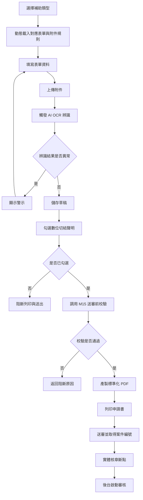
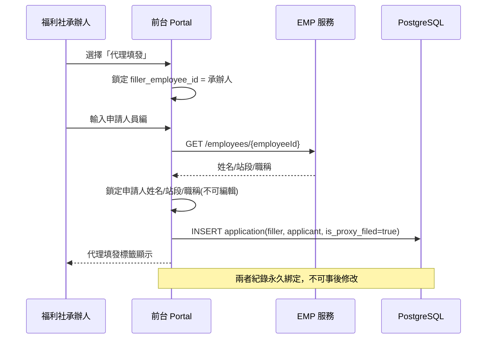
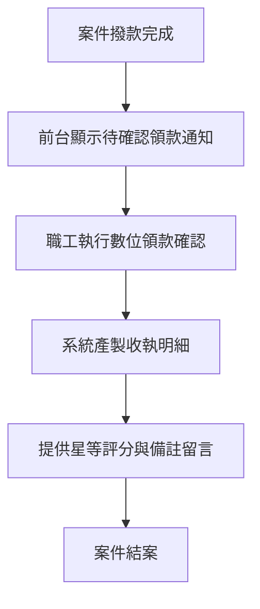
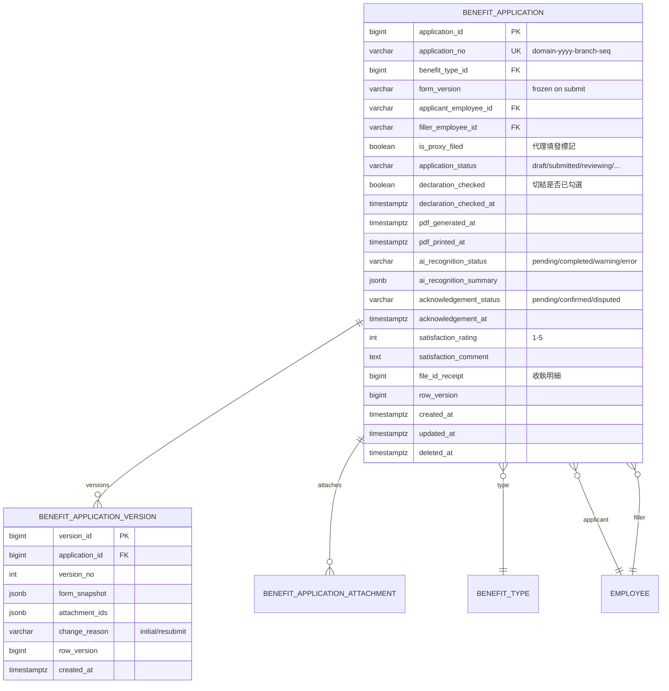
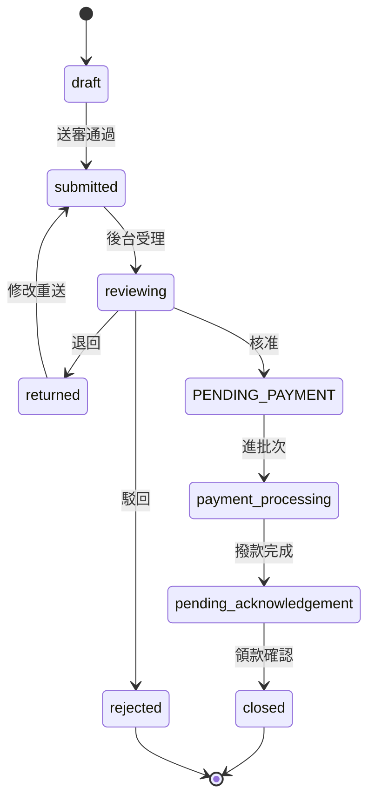

# PRD_M13_BEN_Portal_v2_20260703

> 版本記錄：v2 增強版，新增雙軌並行流程圖、API 接口規格、代理填發雙身分序列圖、數位切結狀態機
>
> 支援純線上 + 列印核章混合模式，代理填發雙身分追蹤，數位切結阻斷，PDF 產製。

---

## 1. 模塊概述

### 1.1 功能定位

本模塊是職工最直接、最高頻使用的功能入口，負責讓職工（或由福利社代理）在前台完成補助申請的全生命週期操作：從選擇補助類型、填寫表單、上傳附件、觸發 AI 辨識、數位切結、產製 PDF 列印、送審，到結案後的領款確認與服務回饋。

### 1.2 業務價值

- **雙軌並行**：同時支援純線上申請與「數位登錄 + 實體核章」混合模式
- **代理填發**：福利社承辦人可代偏遠站段職工申請，雙身分永久綁定
- **AI 輔助**：上傳附件後自動 OCR 辨識、影像品質檢測、重複申請攔截
- **數位切結**：送審前強制勾選無重複請領聲明，未勾選阻斷列印與送出

### 1.3 使用角色

| 角色 | 操作範圍 |
|------|----------|
| 一般職工 | 建立申請、填寫表單、上傳附件、送審、查詢、領款確認 |
| 福利社承辦人 | 代理填發、代替職工建立與送出申請 |

### 1.4 所屬領域與模塊類型

- 所屬領域：BEN（Benefit）
- 模塊類型：業務支撐模塊（前台 Portal）

---

## 2. 數據流圖

### 2.1 補助申請前台主流程



### 2.2 代理填發雙身分追蹤序列圖



### 2.3 結案收尾流程



---

## 3. 數據庫設計

### 3.1 涉及數據表

| 表名 | 用途 |
|------|------|
| benefit_application | 補助申請主表 |
| benefit_application_version | 申請版本快照（補件歷史） |
| benefit_application_attachment | 申請附件關聯表 |

### 3.2 表間關聯



### 3.3 關鍵字段說明

| 字段 | 說明 |
|------|------|
| `application_no` | 格式 `{domain}-{yyyy}-{branch}-{seq}`，送審時生成 |
| `form_version` | 送審時凍結，歷史回顯依此版本 |
| `is_proxy_filed` | 代理填發標記，用於收執明細顯示代填資訊 |
| `declaration_checked` | 數位切結勾選狀態，未勾選阻斷列印與送審 |
| `ai_recognition_status` | AI 辨識非阻塞依賴，失敗不阻斷主流程 |

---

## 4. 功能需求清單

| 編號 | 名稱 | 優先級 | 說明 | 權限控制 |
|------|------|--------|------|----------|
| M13-F01 | 補助類型選擇 | P0 | 兩大業務別 × 具體補助類型 | 職工/承辦人 |
| M13-F02 | 動態表單載入 | P0 | 依類型載入 schema 與附件規則 | 職工/承辦人 |
| M13-F03 | 表單填寫與校驗 | P0 | 動態欄位渲染、前端即時校驗 | 職工/承辦人 |
| M13-F04 | 草稿自動/手動保存 | P0 | 定時自動保存 + 離開提醒 | 職工/承辦人 |
| M13-F05 | 附件上傳 | P0 | 依類型顯示必填清單，走 M08 | 職工/承辦人 |
| M13-F06 | 代理填發 | P0 | 承辦人代填，雙身分追蹤 | 福利社承辦人 |
| M13-F07 | 數位切結聲明 | P0 | 強制勾選後才可列印與送審 | 職工/承辦人 |
| M13-F08 | 送審前校驗串接 | P0 | 調用 M15 統一檢查 | 系統自動 |
| M13-F09 | 標準化 PDF 產製 | P0 | 依 form_version 套模板 | 職工/承辦人 |
| M13-F10 | 送審與案號生成 | P0 | 建立流程實例，生成 application_no | 職工/承辦人 |
| M13-F11 | 我的申請查詢 | P0 | 按狀態/類型/時間查詢 | 本人 |
| M13-F12 | 退回修改重送 | P0 | 退回後修改補件，重新送審 | 本人 |
| M13-F13 | 領款確認 | P0 | 撥款後確認領款 | 本人 |
| M13-F14 | 服務滿意度回饋 | P1 | 星等評分 + 備註 | 本人 |
| M13-F15 | 申請詳情/流程進度 | P0 | 查看申請資料與流程時間線 | 本人 |

---

## 5. 用例文檔

### 用例 1：職工本人線上申請婚嫁補助

- **前置條件**：職工已登入，有婚嫁補助資格
- **操作步驟**：
  1. 選擇「個人福利補助 → 結婚補助」
  2. 系統自動載入婚嫁表單與必填附件清單（戶口名簿）
  3. 填寫申請人資料、結婚日期
  4. 上傳戶口名簿影像 → 系統觸發 AI OCR → 自動回填關鍵欄位
  5. 確認無誤後點擊「儲存草稿」
  6. 勾選數位切結聲明
  7. 點擊「送審」→ M15 校驗通過
  8. 系統產製 PDF，職工列印後送人事單位核章
- **預期結果**：送審成功，取得 application_no，流程進入審批
- **異常處理**：切結未勾選時列印與送審按鈕禁用

### 用例 2：福利社承辦人代理填發教育補助

- **前置條件**：承辦人已登入，有代理填發權限
- **操作步驟**：
  1. 選擇「代理填發」模式
  2. 輸入申請人（李先生）員編
  3. 系統自動從 EMP API 帶入姓名/站段/職稱並鎖定
  4. 填寫子女教育補助表單
  5. 上傳學生證影像
  6. 系統自動標註「由福利社代理登錄」
  7. 後續送審流程同用例 1
- **預期結果**：申請成立，收執明細上標明代填人員資訊
- **異常處理**：員編查無此人時代填被阻斷

### 用例 3：送審前數位切結未勾選

- **前置條件**：職工已填寫完表單但未勾選切結
- **操作步驟**：
  1. 職工點擊「列印」或「送審」
  2. 系統檢測 declaration_checked=false
  3. 阻斷操作並提示
- **預期結果**：操作被阻斷，無法列印或送審
- **異常處理**：職工勾選切結後操作恢復正常

### 用例 4：退回後補件重新送審

- **前置條件**：案件被主管退回，原因「診斷證明模糊」
- **操作步驟**：
  1. 職工在「我的申請」中看到退回標記與原因
  2. 點擊「修改重送」
  3. 重新上傳清晰的診斷證明
  4. AI 辨識重新觸發
  5. 重新勾選切結
  6. 點擊送審 → M15 重新校驗
- **預期結果**：再次送審成功，新版本快照保存
- **異常處理**：重送時規則重新計算，不能沿用舊結果

### 用例 5：草稿多裝置編輯衝突

- **前置條件**：職工在手機和電腦同時打開同一草稿
- **操作步驟**：
  1. 手機端先保存（row_version 更新）
  2. 電腦端保存（使用舊 row_version）
- **預期結果**：電腦端收到 409 Conflict 提示
- **異常處理**：電腦端需重新載入後再編輯

---

## 6. 界面與交互要求

### 6.1 頁面佈局原則

- 補助申請入口頁：業務別卡片式選擇，展開具體補助項目清單
- 申請表單頁：表單欄位動態渲染，附件區顯示必填清單與上傳進度
- 「我的申請」頁：狀態篩選標籤列 + 列表，支援快速操作入口

### 6.2 關鍵交互流程



### 6.3 送審操作交互

- 送審按鈕：頁面底部固定，點擊後觸發以下檢查：切結勾選 → M15 校驗 → revision 檢查
- 任一檢查失敗時，在按鈕上方顯示明確的錯誤提示區
- 全部通過後顯示送審成功頁，包含：application_no、流程狀態、下一步提示

---

## 7. API 接口規格

### 7.1 申請表單

| 方法 | 路徑 | 說明 |
|------|------|------|
| GET | `/api/v1/ben/applications` | 查詢我的申請列表 |
| POST | `/api/v1/ben/applications` | 建立申請（草稿） |
| GET | `/api/v1/ben/applications/{id}` | 查詢申請詳情 |
| PUT | `/api/v1/ben/applications/{id}` | 更新申請（草稿） |
| POST | `/api/v1/ben/applications/{id}/submit` | 送審 |

#### POST `/api/v1/ben/applications`

**Request:**
```json
{
  "benefit_type_id": 1,
  "applicant_employee_id": "EMP001",
  "is_proxy_filed": false,
  "form_data": { "spouse_name": "李四", "marriage_date": "2026-06-15" },
  "attachment_file_ids": [1001, 1002],
  "declaration_checked": false
}
```

**Response (201):**
```json
{
  "application_id": 20001,
  "application_no": null,
  "status": "draft",
  "row_version": 1
}
```

#### POST `/api/v1/ben/applications/{id}/submit`

**Request:**
```json
{
  "row_version": 5,
  "declaration_checked": true,
  "idempotency_key": "770e8400-e29b-41d4-a716-446655440002"
}
```

**Response (200):**
```json
{
  "application_id": 20001,
  "application_no": "TP-115-06-001",
  "status": "submitted",
  "validation_result": {
    "can_submit": true,
    "eligibility": "pass",
    "attachment": "pass",
    "annual_limit": "pass"
  },
  "workflow_instance_id": 30001
}
```

### 7.2 PDF 產製

| 方法 | 路徑 | 說明 |
|------|------|------|
| GET | `/api/v1/ben/applications/{id}/pdf` | 產製並下載 PDF |

### 7.3 領款確認

| 方法 | 路徑 | 說明 |
|------|------|------|
| POST | `/api/v1/ben/applications/{id}/acknowledge` | 領款確認 |

### 7.4 錯誤碼定義

| 錯誤碼 | HTTP Status | 說明 |
|--------|-------------|------|
| BEN-001 | 400 | 切結未勾選 |
| BEN-002 | 400 | 表單校驗失敗 |
| BEN-003 | 400 | M15 校驗不通過 |
| BEN-004 | 409 | row_version 衝突 |
| BEN-005 | 404 | 申請不存在 |
| BEN-006 | 400 | 代理填發員編查無此人 |
| BEN-007 | 400 | 申請已送審不可修改 |
| BEN-008 | 500 | PDF 產製失敗 |

---

## 8. 非功能性需求

### 8.1 性能指標

| 指標 | 目標值 |
|------|--------|
| 表單載入 | < 1s |
| 附件上傳 | < 3s（10MB 內） |
| 送審校驗 | < 2s |
| PDF 產製 | < 5s |
| 列表查詢 | < 500ms |

### 8.2 安全要求

- 代理填發身分欄位鎖定不可編輯
- 附件傳輸全程 TLS 加密
- 切結勾選時間戳記錄
- 所有關鍵操作寫入稽核日誌

### 8.3 可用性標準

- 前台 Portal 可用性 ≥ 99.9%
- AI 辨識服務不可用時不阻塞主流程
- PWA 支援離線草稿保存

---

## 9. 隱含需求補充

### 9.1 審計日誌

代理填發、送審、列印、領款確認等關鍵動作寫入 `audit_event`：
```json
{
  "correlation_id": "UUID",
  "actor_id": "employee_id",
  "action_code": "BEN.APPLICATION.SUBMIT",
  "target_type": "benefit_application",
  "target_id": 20001,
  "old_status": "draft",
  "new_status": "submitted",
  "payload": { "application_no": "TP-115-06-001" },
  "severity": "INFO"
}
```

### 9.2 冪等性

- POST `/api/v1/ben/applications/{id}/submit` 支援 `Idempotency-Key`
- 防止重試導致重複建立流程實例

### 9.3 並發控制（row_version）

- 草稿編輯時讀取當前 row_version
- 保存/送審時攜帶 row_version
- 多裝置衝突時返回 409

### 9.4 Outbox 模式

- 送審成功後通知透過 Outbox 投遞
- 狀態變更與 Outbox 事件在同一事務

### 9.5 錯誤恢復

- 附件上傳中斷允許重試，不影響已上傳成功部分
- 草稿自動保存定時執行，網路中斷後恢復連線可續填
- AI 辨識服務不可用時主流程不被阻斷

### 9.6 邊界情況

- **年度跨越**：上限校驗以送審時間為基準年度
- **退回重送**：規則重新計算
- **PDF 模板缺失**：阻斷送審
- **草稿無案號**：application_no 僅在正式送審時生成
- **實體核章**：送審成功頁明確提示需送紙本至人事單位
