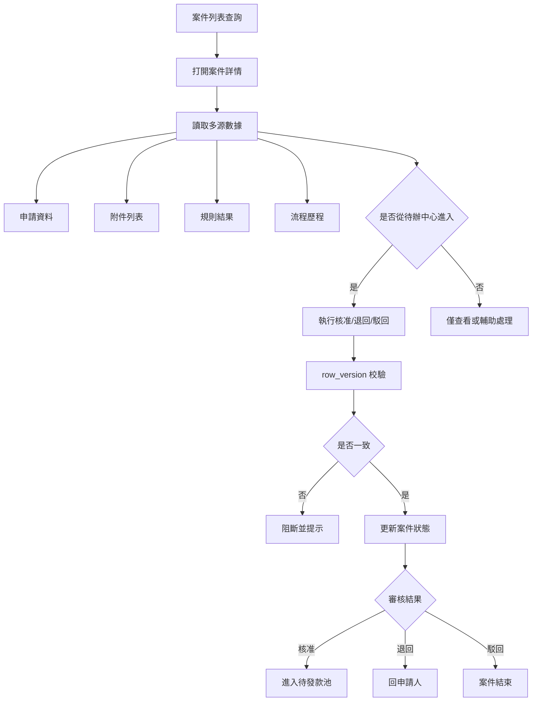
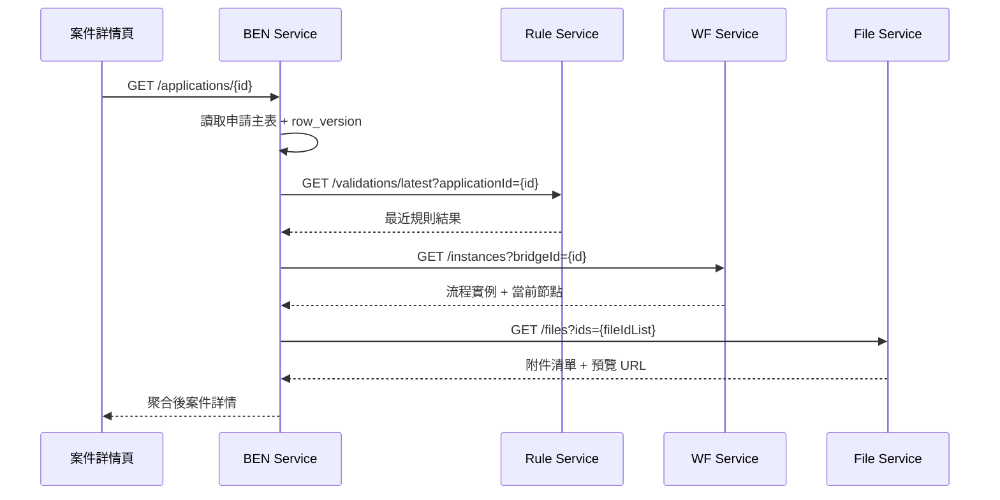
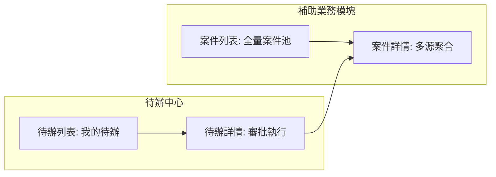
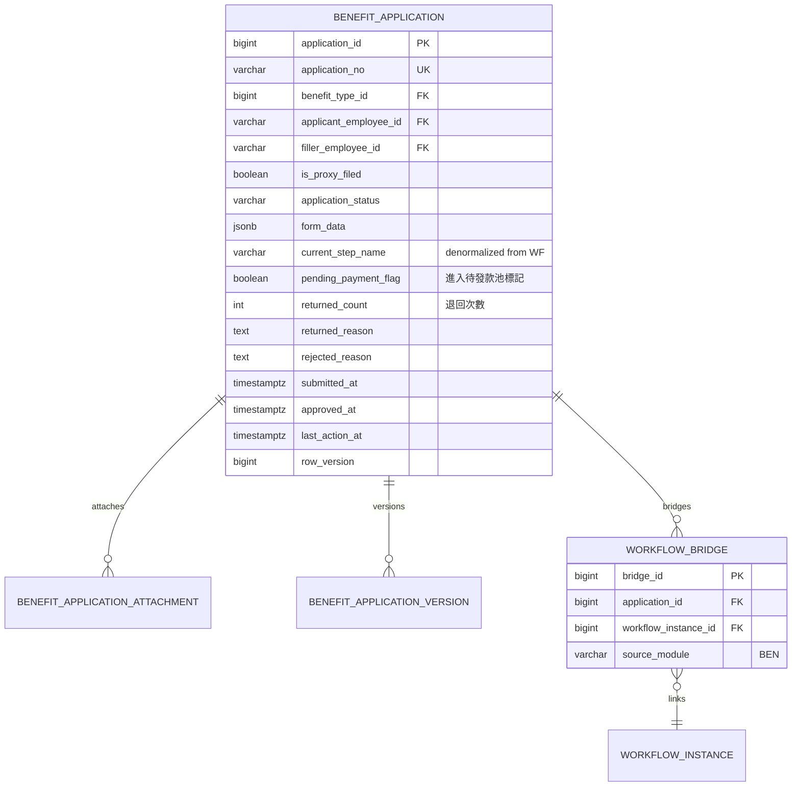
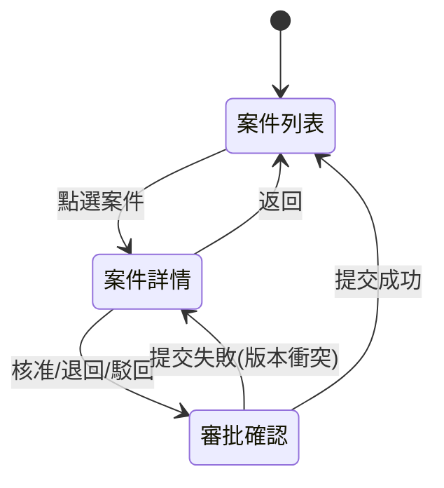

# PRD_M14_BEN_Admin_v2_20260703

> 版本記錄：v2 增強版，新增案件詳情聚合數據流、API 規格、版本衝突序列圖、多源數據整合要求
>
> 案件詳情頁承接多源數據（申請、附件、規則、流程），版本衝突檢查(row_version)。

---

## 1. 模塊概述

### 1.1 功能定位

本模塊是 BEN 在管理後台的業務承接面，負責把前台已建立的補助案件，轉換成承辦人與主管可查詢、可審核、可追蹤、可統計的後台作業對象。案件詳情頁整合申請資料、附件、規則檢查結果與流程歷程。

### 1.2 業務價值

- **全局案件管理**：不只從待辦處理，也能從案件池查看全量補助案件狀態
- **多源數據聚合**：案件詳情頁整合申請、附件、規則、流程四大數據源
- **銜接待發款**：核准後案件明確進入待發款池，與 PAY 穩定銜接

### 1.3 使用角色

| 角色 | 操作範圍 |
|------|----------|
| 福利社承辦人 | 查詢案件、查看詳情、輔助處理 |
| 審核主管 | 核准、退回、駁回 |
| 系統管理員 | 查看與治理異常案件 |
| 資安稽核人員 | 查看高風險案件操作軌跡 |

### 1.4 所屬領域與模塊類型

- 所屬領域：BEN（Benefit）
- 模塊類型：後台頁面模塊

---

## 2. 數據流圖

### 2.1 後台案件處理主流程



### 2.2 案件詳情多源聚合序列圖



### 2.3 案件列表與待辦中心分工



---

## 3. 數據庫設計

### 3.1 涉及數據表

| 表名 | 用途 |
|------|------|
| benefit_application | 補助申請主表 |
| benefit_application_attachment | 附件關聯 |
| benefit_application_version | 申請版本快照 |
| workflow_bridge | 流程橋接 |
| workflow_instance | 流程實例 |

### 3.2 表間關聯



### 3.3 關鍵字段說明

| 字段 | 說明 |
|------|------|
| `pending_payment_flag` | 核准後設為 true，供 PAY 待發款池消費 |
| `current_step_name` | 從 WF 去正規化到案件表，便於列表展示 |
| `returned_count` | 退回次數累計，用於案件治理 |
| `row_version` | 樂觀鎖，後台操作（審核、承辦修改）均需檢查 |

---

## 4. 功能需求清單

| 編號 | 名稱 | 優先級 | 說明 | 權限控制 |
|------|------|--------|------|----------|
| M14-F01 | 案件列表查詢 | P0 | 全量案件，支援多維度篩選 | 承辦人/主管/管理員 |
| M14-F02 | 案件詳情查看 | P0 | 展示申請、附件、規則、流程 | 承辦人/主管/管理員 |
| M14-F03 | 核准 | P0 | 核准後進待發款池 | 審核主管 |
| M14-F04 | 退回 | P0 | 退回申請人，必填原因 | 審核主管 |
| M14-F05 | 駁回 | P0 | 駁回結束流程，必填原因 | 審核主管 |
| M14-F06 | row_version 檢查 | P0 | 審批提交前強制檢查 | 系統自動 |
| M14-F07 | 案件時間線 | P0 | 流程歷程與狀態變更記錄 | 承辦人/主管 |
| M14-F08 | 案件匯出 | P1 | 案件列表匯出 | 系統管理員 |
| M14-F09 | 統計摘要 | P1 | 案件狀態統計卡 | 承辦人/主管 |
| M14-F10 | 退回補件追蹤 | P1 | 退回次數、補件差異 | 承辦人 |

---

## 5. 用例文檔

### 用例 1：承辦人查看全量案件

- **前置條件**：承辦人已登入管理後台
- **操作步驟**：
  1. 進入管理後台 → 補助業務
  2. 查看狀態統計卡（草稿/送審/核准/退回/駁回）
  3. 按補助類型篩選「結婚補助」
  4. 列表顯示符合條件的案件
- **預期結果**：案件列表正確顯示，統計數字與列表一致
- **異常處理**：列表支援分頁，預設每頁 20 筆

### 用例 2：主管從待辦進入案件詳情審核

- **前置條件**：主管有待辦案件
- **操作步驟**：
  1. 待辦中心 → 點選案件 → 進入 BEN 案件詳情頁
  2. 詳情頁展示：申請資料、附件預覽、規則檢查結果、流程歷程
  3. 底部操作區顯示核准/退回/駁回按鈕
  4. 主管點擊「核准」，填寫意見
  5. 系統檢查 row_version（一致）→ 提交成功
- **預期結果**：審批成功，案件狀態更新，進入待發款池
- **異常處理**：row_version 衝突時禁止提交並提示重新整理

### 用例 3：案件版本衝突

- **前置條件**：案件詳情頁已打開，row_version=3
- **操作步驟**：
  1. 承辦在後台修改補充字段（row_version 變為 4）
  2. 主管提交核准（仍使用 row_version=3）
- **預期結果**：返回 409 Conflict，提示「資料已更新」
- **異常處理**：主管刷新頁面後重新審核

### 用例 4：核准後進入待發款池

- **前置條件**：主管執行核准動作
- **操作步驟**：
  1. 核准提交成功
  2. 系統更新 `pending_payment_flag=true`
  3. 案件狀態變為 `PENDING_PAYMENT`
  4. 寫入 Outbox 事件（通知 PAY）
- **預期結果**：案件進入待發款池，PAY 可查到此案件
- **異常處理**：待發款標記在核准後自動設置，不臨時計算

### 用例 5：已進批次案件不可重複進池

- **前置條件**：案件已被 PAY 批次選中
- **操作步驟**：
  1. 承辦手動嘗試修改案件狀態回待發款
- **預期結果**：系統阻斷操作，提示「已進批次不可修改」
- **異常處理**：需透過 PAY 退回批次的標準流程

---

## 6. 界面與交互要求

### 6.1 頁面佈局原則

- 案件列表頁：上方統計卡（待審核、已核准、已退回）、中間篩選區、下方表格
- 案件詳情頁：分頁籤設計 → 申請資料 / 附件 / 規則結果 / 流程歷程
- 審核操作區統一在詳情頁底部

### 6.2 關鍵交互流程



---

## 7. API 接口規格

### 7.1 案件查詢

| 方法 | 路徑 | 說明 |
|------|------|------|
| GET | `/api/v1/ben/applications` | 查詢案件列表（含統計） |
| GET | `/api/v1/ben/applications/{id}` | 查詢案件詳情（聚合） |

#### GET `/api/v1/ben/applications?status=submitted&benefit_type_id=1`

**Response:**
```json
{
  "items": [
    {
      "application_id": 20001,
      "application_no": "TP-115-06-001",
      "benefit_type_name": "結婚補助",
      "applicant_name": "王小明",
      "application_status": "submitted",
      "current_step_name": "主管核准",
      "submitted_at": "2026-07-01T10:00:00Z",
      "pending_payment_flag": false,
      "returned_count": 0,
      "row_version": 3
    }
  ],
  "statistics": {
    "draft": 5,
    "submitted": 12,
    "PENDING_PAYMENT": 8,
    "returned": 3,
    "rejected": 2
  },
  "total": 30
}
```

### 7.2 案件詳情

#### GET `/api/v1/ben/applications/{id}`

**Response (200):**
```json
{
  "application_id": 20001,
  "application_no": "TP-115-06-001",
  "benefit_type": { "id": 1, "name": "結婚補助" },
  "applicant": { "employee_id": "EMP001", "name": "王小明", "org_unit": "台北機務段" },
  "is_proxy_filed": false,
  "application_status": "submitted",
  "form_data": { "spouse_name": "李四", "marriage_date": "2026-06-15" },
  "attachments": [
    { "file_id": 1001, "file_name": "戶口名簿.jpg", "status": "completed" }
  ],
  "validation_summary": {
    "eligibility": "pass",
    "attachment": "pass",
    "annual_limit": "pass",
    "validated_at": "2026-07-01T10:00:00Z"
  },
  "workflow": {
    "instance_id": 30001,
    "current_step": "主管核准",
    "status": "active"
  },
  "row_version": 3,
  "pending_payment_flag": false
}
```

### 7.3 審批操作（經由 WF)

| 方法 | 路徑 | 說明 |
|------|------|------|
| POST | `/api/v1/ben/applications/{id}/approve` | 核准（內部調用 WF） |
| POST | `/api/v1/ben/applications/{id}/return` | 退回 |
| POST | `/api/v1/ben/applications/{id}/reject` | 駁回 |

#### POST `/api/v1/ben/applications/{id}/approve`

**Request:**
```json
{
  "row_version": 3,
  "comment": "審核無誤，同意",
  "idempotency_key": "880e8400-e29b-41d4-a716-446655440003"
}
```

### 7.4 錯誤碼定義

| 錯誤碼 | HTTP Status | 說明 |
|--------|-------------|------|
| BEN-010 | 400 | 案件狀態不可執行此操作 |
| BEN-011 | 409 | row_version 衝突 |
| BEN-012 | 400 | 無有效待辦不可繞過流程審核 |
| BEN-013 | 400 | 已進批次不可修改 |
| BEN-014 | 400 | 退回/駁回原因為空 |

---

## 8. 非功能性需求

### 8.1 性能指標

| 指標 | 目標值 |
|------|--------|
| 案件列表查詢 | < 500ms |
| 案件詳情聚合 | < 1s |
| 審批動作提交 | < 1s |
| 列表匯出 | < 10s（1000 筆內） |

### 8.2 安全要求

- 審核動作必須經由當前有效待辦
- 敏感附件預覽與下載受權限控制
- 所有審批動作寫入稽核日誌

### 8.3 可用性標準

- 後台服務可用性 ≥ 99.9%
- 案件列表支援分頁與快照
- 待發款標記作為穩定狀態輸出

---

## 9. 隱含需求補充

### 9.1 審計日誌

所有審批動作、匯出、敏感附件下載寫入 `audit_event`：
```json
{
  "correlation_id": "UUID",
  "actor_id": "reviewer_employee_id",
  "action_code": "BEN.APPLICATION.APPROVE",
  "target_type": "benefit_application",
  "target_id": 20001,
  "old_status": "submitted",
  "new_status": "PENDING_PAYMENT",
  "severity": "INFO"
}
```

### 9.2 冪等性

- 所有審批 API 支援 `Idempotency-Key`
- 24 小時內相同 key 返回相同結果

### 9.3 並發控制（row_version）

- 案件詳情打開時讀取 row_version
- 審批提交時攜帶 row_version
- 不匹配返回 409 Conflict

### 9.4 Outbox 模式

- 審批完成後狀態更新與 Outbox 事件在同一事務
- 通知 PAY 待發款池事件透過 Outbox 投遞

### 9.5 錯誤恢復

- 無有效待辦時不可繞過流程直接審核
- 已駁回案件不可再次進流程
- 已進批次案件不可重複進池

### 9.6 邊界情況

- **核准後未進待發款池**：視為主鏈路斷裂
- **退回未回申請人**：除特殊流程外必須回申請人
- **已駁回案件**：若要再次申請應走新案件
- **業務資料已被刪除**：案件詳情顯示異常提示
