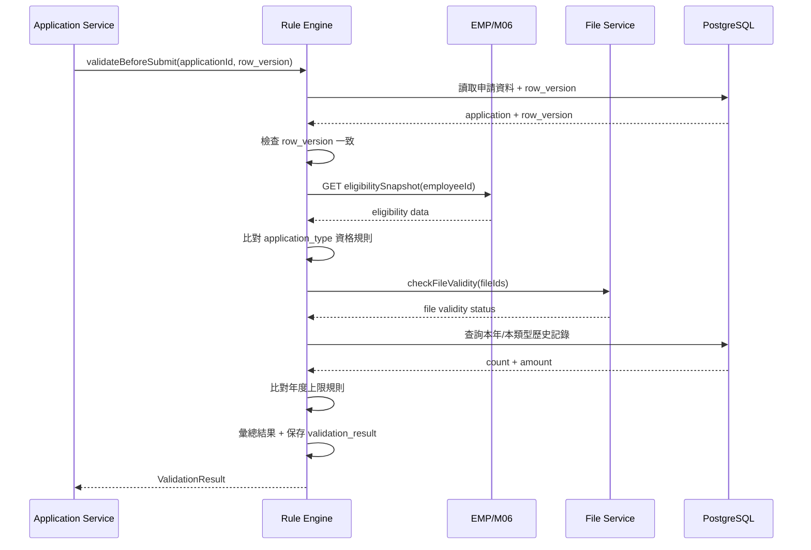
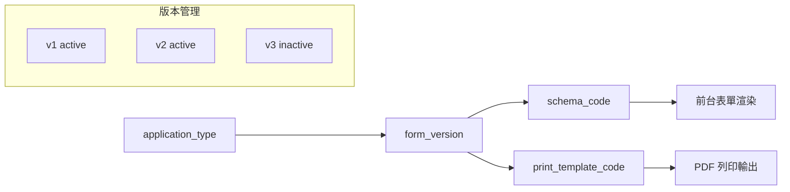
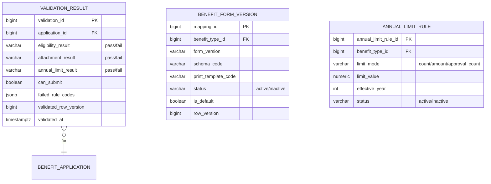
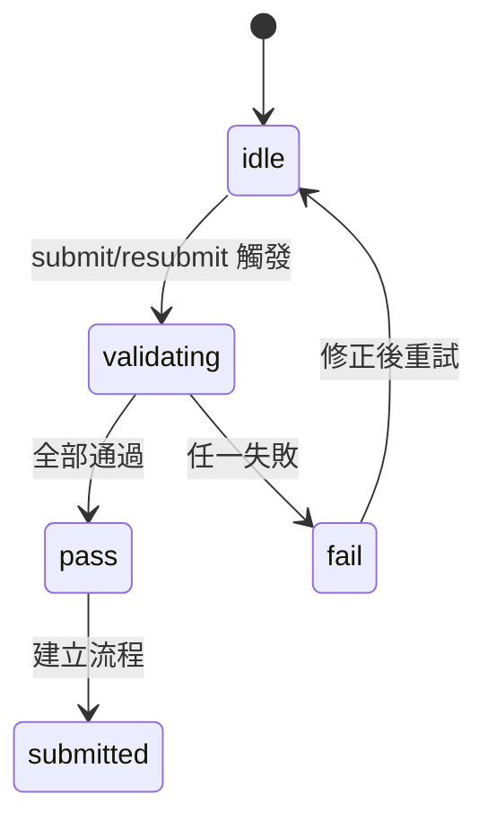

# PRD_M15_BEN_Rules_v2_20260703

> 版本記錄：v2 增強版，新增規則引擎序列圖、API 規格、表單版本凍結機制、年度上限規則配置
>
> 資格校驗引擎（調用 EMP/M06 快照）、年度上限、附件校驗（M08）、表單版本管理（frozen on submit）、列印模板映射。

---

## 1. 模塊概述

### 1.1 功能定位

本模塊是 BEN 的規則中樞，負責把補助申請中最容易散落在前端、後端、流程與報表中的共用規則，收斂成可被多個頁面與服務重複調用的能力層。包含資格校驗、附件校驗、年度上限、表單版本映射與列印模板映射五大能力。

### 1.2 業務價值

- **統一的送審阻斷閘門**：資格/附件/年度上限任一不通過即不可送審
- **規則與頁面分離**：規則集中治理，避免散落在前端與流程中
- **版本化**：表單版本送審時凍結，歷史回顯正確還原
- **可配置**：年度上限規則以 application_type_id 為粒度治理

### 1.3 使用角色

| 角色 | 操作範圍 |
|------|----------|
| 系統管理員 | 治理規則配置、版本映射、異常處理 |
| 福利社承辦人 | 查看規則結果、輔助排錯 |
| 審核主管 | 在後台查看校驗摘要 |

### 1.4 所屬領域與模塊類型

- 所屬領域：BEN（Benefit）
- 模塊類型：底層能力模塊

---

## 2. 數據流圖

### 2.1 送審前規則檢查總流程

```mermaid
flowchart TD
    A[submit(applicationId, row_version)] --> B[row_version 檢查]
    B --> C{版本一致?}
    C -->|否| D[返回 409 Conflict]
    C -->|是| E[資格校驗]
    E --> F[讀取 EMP 快照]
    F --> G{符合資格?}
    G -->|否| H[返回 eligibility_failed]
    G -->|是| I[附件校驗]
    I --> J[檢查 file_id 有效性]
    J --> K{附件完備?}
    K -->|否| L[返回 attachment_failed]
    K -->|是| M[年度上限校驗]
    M --> N[查詢本年申請記錄]
    N --> O{未超上限?}
    O -->|否| P[返回 annual_limit_failed]
    O -->|是| Q[允許 createWorkflow]
```

### 2.2 規則引擎序列圖



### 2.3 表單版本映射流程



---

## 3. 數據庫設計

### 3.1 涉及數據表

| 表名 | 用途 |
|------|------|
| validation_result | 規則檢查結果表 |
| benefit_form_version | 表單版本映射表 |
| annual_limit_rule | 年度上限規則表 |
| benefit_rule | 資格規則配置 |

### 3.2 表間關聯



### 3.3 關鍵字段說明

| 字段 | 說明 |
|------|------|
| `validation_result` | 每次送審校驗記錄摘要，供前台後台查詢 |
| `form_version` | 表單版本鍵，送審時凍結，歷史回顯依此版本 |
| `validated_row_version` | 校驗時對應的業務主表 row_version |
| `limit_mode` | count=次數上限, amount=金額上限, approval_count=核准次數上限 |

---

## 4. 功能需求清單

| 編號 | 名稱 | 優先級 | 說明 | 權限控制 |
|------|------|--------|------|----------|
| M15-F01 | 資格校驗 | P0 | 讀取 EMP 快照，判斷是否符合資格 | 系統自動 |
| M15-F02 | 附件校驗 | P0 | 檢查 file_id 有效性、必填附件完備 | 系統自動 |
| M15-F03 | 年度上限校驗 | P0 | 檢查本年/本類型次數與金額上限 | 系統自動 |
| M15-F04 | 綜合結果輸出 | P0 | 彙總三類校驗結果，輸出 can_submit | 系統自動 |
| M15-F05 | 表單 schema 映射 | P0 | 依 application_type + form_version 載入 schema | 系統自動 |
| M15-F06 | 列印模板映射 | P0 | 依 form_version 載入 print_template_code | 系統自動 |
| M15-F07 | 版本映射管理 | P1 | 配置各類型的表單版本與列印模板 | 系統管理員 |
| M15-F08 | 年度上限規則管理 | P1 | 配置上限規則（次數/金額） | 系統管理員 |
| M15-F09 | 規則結果查詢 | P1 | 查看最近一次規則檢查結果 | 承辦人/管理員 |
| M15-F10 | 版本凍結 | P0 | 送審時凍結 form_version | 系統自動 |

---

## 5. 用例文檔

### 用例 1：送審前規則全部通過

- **前置條件**：職工已填寫完婚嫁補助表單，附件已上傳
- **操作步驟**：
  1. 點擊「送審」
  2. 系統調用 validateBeforeSubmit
  3. 資格校驗：調用 EMP 快照 → 結婚補助資格有效
  4. 附件校驗：M08 確認戶口名簿 file_id 有效
  5. 年度上限：本年無結婚補助申請記錄
  6. 綜合結果：can_submit=true
- **預期結果**：送審通過，允許建立流程實例
- **異常處理**：任一校驗失敗時送審被阻斷

### 用例 2：年度上限超額阻斷

- **前置條件**：某員工本年已申請 2 次教育補助（上限 2 次）
- **操作步驟**：
  1. 職工點擊送審第 3 次教育補助
  2. 年度上限校驗查詢本年記錄
  3. 發現已達上限
- **預期結果**：返回 `annual_limit_failed`，送審被阻斷
- **異常處理**：前台顯示「已達本年度申請上限，無法送審」

### 用例 3：附件失效阻斷

- **前置條件**：附件 file_id 指向的檔案已被刪除
- **操作步驟**：
  1. 職工點擊送審
  2. 附件校驗調用 M08 檢查 file_id
  3. M08 返回檔案狀態=deleted
- **預期結果**：返回 `attachment_failed`，送審被阻斷
- **異常處理**：前台顯示「附件已失效，請重新上傳」

### 用例 4：退回重送時規則重新計算

- **前置條件**：案件被退回，退回原因為附件問題
- **操作步驟**：
  1. 職工補上正確附件
  2. 點擊重新送審
  3. 規則引擎重新執行全部三類校驗
- **預期結果**：所有規則重新計算，不沿用舊結果
- **異常處理**：即使上次校驗通過的項目也重新計算

### 用例 5：表單版本凍結

- **前置條件**：某補助類型在 2026-07-01 升級了表單版本（v1→v2）
- **操作步驟**：
  1. 職工在 2026-06-30 建立草稿（未送審，form_version=v1）
  2. 7 月 1 日表單升級為 v2
  3. 職工在 7 月 2 日送審
- **預期結果**：送審時使用 v2 版本（當前預設版）
- **異常處理**：已送審的舊案件回顯仍使用 v1 版本

---

## 6. 界面與交互要求

### 6.1 頁面佈局原則

- 規則結果頁：分段展示資格/附件/年度上限結果，每段標示 pass/fail
- 版本映射頁：表格展示各類型的版本對應關係
- 上限規則頁：按補助類型分組展示上限規則

### 6.2 關鍵交互流程



---

## 7. API 接口規格

### 7.1 送審校驗

| 方法 | 路徑 | 說明 |
|------|------|------|
| POST | `/api/v1/ben/validations/validate` | 執行送審前校驗 |

#### POST `/api/v1/ben/validations/validate`

**Request:**
```json
{
  "application_id": 20001,
  "row_version": 3
}
```

**Response (200):**
```json
{
  "can_submit": true,
  "eligibility": { "result": "pass", "message": null },
  "attachment": { "result": "pass", "message": null },
  "annual_limit": {
    "result": "pass",
    "message": null,
    "remaining_count": 2,
    "remaining_amount": 50000.00
  },
  "validation_id": 8001,
  "validated_at": "2026-07-03T10:00:00Z"
}
```

**Response (400) — 年度上限失敗:**
```json
{
  "can_submit": false,
  "eligibility": { "result": "pass" },
  "attachment": { "result": "pass" },
  "annual_limit": {
    "result": "fail",
    "message": "已達本年度申請上限（上限 2 次）",
    "current_count": 2,
    "limit_value": 2
  },
  "failed_rule_codes": ["ANNUAL_LIMIT_EXCEEDED"]
}
```

### 7.2 版本映射

| 方法 | 路徑 | 說明 |
|------|------|------|
| GET | `/api/v1/ben/form-versions` | 查詢版本映射列表 |
| GET | `/api/v1/ben/form-versions/current?benefit_type_id={id}` | 查詢當前預設版本 |
| GET | `/api/v1/ben/form-versions/resolve?benefit_type_id={id}&form_version={v}` | 解析 schema + print_template |

#### GET `/api/v1/ben/form-versions/resolve?benefit_type_id=1&form_version=v2`

**Response:**
```json
{
  "benefit_type_id": 1,
  "form_version": "v2",
  "schema_code": "MARRIAGE_FORM_V2",
  "print_template_code": "MARRIAGE_PRINT_V2",
  "status": "active"
}
```

### 7.3 年度上限規則

| 方法 | 路徑 | 說明 |
|------|------|------|
| GET | `/api/v1/ben/annual-limits` | 查詢年度上限規則 |
| PUT | `/api/v1/ben/annual-limits/{id}` | 更新年度上限規則 |

### 7.4 規則結果查詢

| 方法 | 路徑 | 說明 |
|------|------|------|
| GET | `/api/v1/ben/validations/latest?application_id={id}` | 查詢最近規則結果 |

### 7.5 錯誤碼定義

| 錯誤碼 | HTTP Status | 說明 |
|--------|-------------|------|
| BEN-020 | 400 | 資格不合格 |
| BEN-021 | 400 | 附件不完備或失效 |
| BEN-022 | 400 | 年度上限已達 |
| BEN-023 | 409 | row_version 不一致，重新校驗 |
| BEN-024 | 500 | 版本映射缺失（缺 schema 或 print template） |
| BEN-025 | 400 | 非 MVP 補助類型不可送審 |

---

## 8. 非功能性需求

### 8.1 性能指標

| 指標 | 目標值 |
|------|--------|
| 校驗執行時間 | < 1s |
| 版本映射解析 | < 200ms |
| 並發校驗 | 支援 100 TPS |

### 8.2 安全要求

- 規則配置變更需寫入審計日誌
- 資格資訊僅從 EMP 快照讀取，不直接操作人員主表
- 年度上限規則變更需保留歷史版本

### 8.3 可用性標準

- 規則引擎可用性 ≥ 99.9%
- EMP 服務不可用時規則校驗降級為 warn 而非硬阻斷
- M08 服務不可用時附件校驗降級為 warn

---

## 9. 隱含需求補充

### 9.1 審計日誌

規則配置變更、異常校驗結果寫入 `audit_event`：
```json
{
  "correlation_id": "UUID",
  "action_code": "BEN.VALIDATION.FAILED",
  "target_type": "validation_result",
  "target_id": 8001,
  "payload": { "failed_rules": ["ANNUAL_LIMIT_EXCEEDED"], "application_id": 20001 },
  "severity": "WARN"
}
```

### 9.2 冪等性

- POST `/api/v1/ben/validations/validate` 支援 `Idempotency-Key`
- 相同 application_id + row_version 在短時間內返回相同結果

### 9.3 並發控制

- 校驗前讀取 application row_version
- 校驗過程中資料被修改時返回 409
- 年度上限計數使用原子操作（`SELECT ... FOR UPDATE`）

### 9.4 版本凍結原則

- 送審時 `form_version` 使用當前默認版本（非草稿建立時的版本）
- 已送審案件的歷史回顯使用當時凍結的 `form_version`
- 表單版本升級不影響已送審案件的資料展示

### 9.5 錯誤恢復

- EMP 服務不可用時，資格校驗降級（不阻斷送審但記錄警告）
- 規則配置缺失時阻斷送審並報配置錯誤
- 年度上限計數異常時記錄錯誤事件

### 9.6 邊界情況

- **年度跨越**：上限以送審時間為基準年度
- **退回重送**：全部規則重新計算
- **非 MVP 類型**：無對應規則配置時不開放申請
- **附件 file_id 失效**：校驗失敗，不可視為存在
- **歷史列印**：使用歷史 form_version 對應的 print_template
