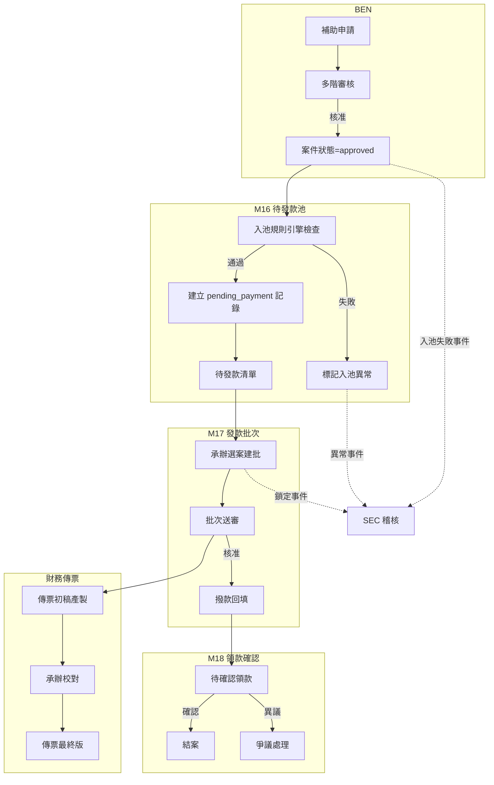
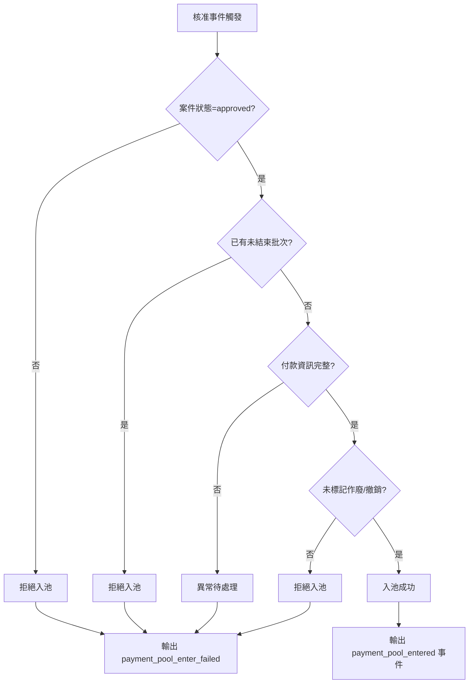
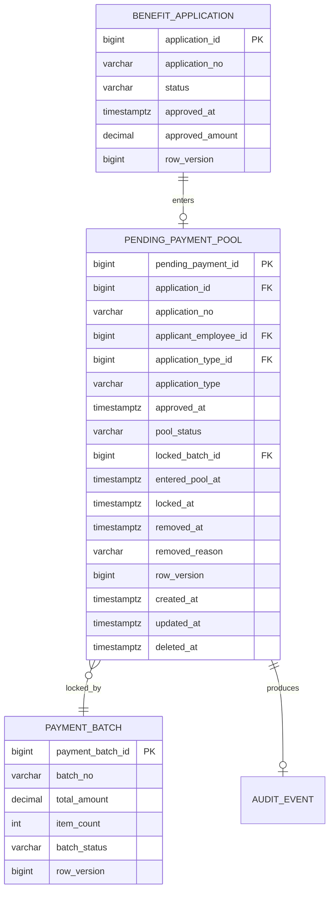
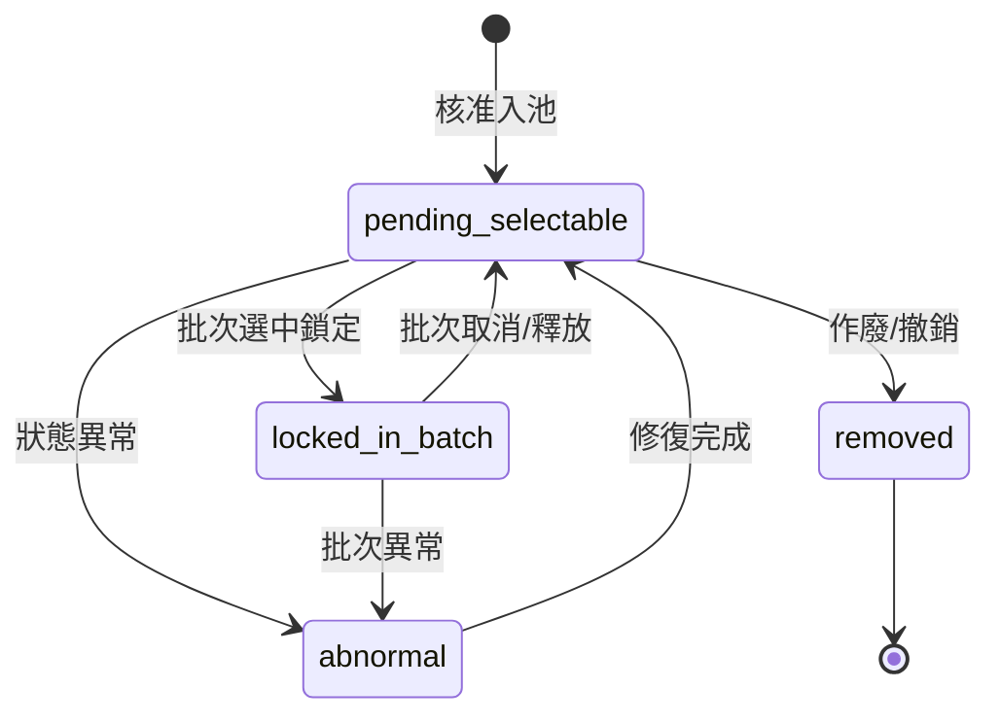

# PRD_M16_PAY_Pool_v2_20260703

> 來源註記：本文件為 M16《PAY－待發款池與案件入池規則》增強版本，保留舊版核心定位與功能拆解，依全域規範 v2 補充數據流圖、API 規格、用例文檔、界面交互要求及跨模塊契約（審計日誌、冪等性、樂觀鎖、Outbox 模式）。

---

## 1. 模塊概述

### 1.1 功能定位

本模塊是 BEN（補助案件）與 PAY（發款管理）之間的橋接層，負責把**已核准、可付款、尚未進入有效批次**的補助案件，轉換成承辦可操作的待發款清單，並作為 M17 建立發款批次的唯一案件源頭。

### 1.2 業務價值

- 建立核准到發款的標準銜接機制，確保只有已核准案件才可進入發款通道
- 防重複入批：同一案件不可同時存在於兩個未結束批次
- 入池規則引擎統一收束資格判定邏輯，避免各業務模塊各自檢查
- 入池結果可追蹤、可查詢、可回溯，滿足「每張申請、每次處理都有歷程可查」的平台目標

### 1.3 使用角色

| 角色 | 職責 | 操作範圍 |
|------|------|----------|
| 福利社承辦人 | 查看待發款清單、挑選案件建立批次 | 所轄 branch/domain |
| 審核主管 | 查看待發款狀態，不直接建批 | 所轄審批範圍 |
| 系統管理員 | 處理異常入池、手工解除鎖定、治理 | 全範圍 |
| 資安稽核人員 | 查看入池/移池異常與高風險操作 | 稽核範圍 |

### 1.4 所屬領域與模塊類型

- **領域**：PAY（撥款管理）
- **類型**：業務支撐模塊
- **上游依賴**：M14（補助案件後台）、WF（流程引擎）
- **下游供應**：M17（發款批次、送審與撥款回填）

---

## 2. 數據流圖

### 2.1 BEN→PAY→FIN 閉環數據流



### 2.2 入池規則引擎決策流



---

## 3. 數據庫設計

### 3.1 涉及數據表清單

| 表名 | 用途 | 所屬領域 |
|------|------|----------|
| `pending_payment_pool` | 待發款池主表 | PAY |
| `payment_batch` | 發款批次主表（關聯查詢） | PAY |
| `payment_batch_item` | 批次案件明細（關聯查詢） | PAY |
| `benefit_application` | 補助案件（來源表） | BEN |
| `employee` | 員工主檔 | ORG/EMP |
| `audit_event` | 稽核事件 | SEC |
| `outbox_event` | Outbox 可靠投遞 | SYS |

### 3.2 表間關聯（ER）



### 3.3 關鍵字段說明

| 字段 | 類型 | 說明 | 約束 |
|------|------|------|------|
| `pending_payment_id` | bigint | 待發款記錄主鍵 | PK, IDENTITY |
| `application_id` | bigint | 關聯補助案件 | UNIQUE（避免重複入池）, FK→benefit_application |
| `pool_status` | varchar(32) | 池內狀態枚舉 | CHECK: pending_selectable, locked_in_batch, removed, abnormal |
| `locked_batch_id` | bigint | 批次鎖定關聯 | FK→payment_batch, 可空 |
| `row_version` | bigint | 樂觀鎖版本號 | 併發控制 |

### 3.4 索引建議

- `(pool_status, entered_pool_at)` — 待發款清單查詢
- `(applicant_employee_id, pool_status)` — 按申請人查詢
- `(application_type_id, pool_status)` — 按補助類型統計
- `(locked_batch_id)` — 批次鎖定反向查詢
- `(application_id)` — UNIQUE 索引（防重複入池）

---

## 4. 功能需求清單

### 4.1 核心功能點

| 編號 | 功能名稱 | 優先級 | 說明 | 權限控制 |
|------|----------|--------|------|----------|
| M16-F01 | 核准案件自動入池 | P0 | 案件核准後自動執行入池規則，通過後寫入 pending_payment_pool | 系統自動 |
| M16-F02 | 入池前條件檢查 | P0 | 檢查案件狀態、批次關聯、付款資訊完整性 | 系統自動 |
| M16-F03 | 待發款清單查詢 | P0 | 按多條件查詢可建批案件列表 | 查看待發款清單 |
| M16-F04 | 待發款詳情查看 | P1 | 查看單筆待發款案件摘要與入池歷程 | 查看待發款詳情 |
| M16-F05 | 案件鎖定/釋放 | P0 | 批次建立時鎖定案件，批次取消/作廢時釋放 | 系統自動 |
| M16-F06 | 異常案件標記 | P1 | 狀態不一致案件自動標記為 abnormal | 系統自動 |
| M16-F07 | 手工解除鎖定 | P2 | 管理員手動解除異常鎖定 | 解除異常鎖定（高風險） |
| M16-F08 | 待發款清單匯出 | P2 | 匯出待發款清單供離線核對 | 匯出待發款清單（高風險） |
| M16-F09 | 入池事件輸出 | P1 | 入池成功/失敗事件寫入 outbox 與 audit_event | 系統自動 |
| M16-F10 | 長期未建批提醒 | P2 | 對停留池中超過配置天數的案件觸發提醒 | 系統自動 |

### 4.2 入池規則配置項

| 配置鍵 | 類型 | 預設值 | 說明 |
|--------|------|--------|------|
| `pay.pending_pool.auto_enter_after_approval` | boolean | true | 核准後自動入池開關 |
| `pay.pending_pool.block_if_batch_unfinished` | boolean | true | 已進未結束批次阻斷開關 |
| `pay.pending_pool.abnormal_aging_days` | int | 30 | 長期未建批提醒天數 |
| `pay.pending_pool.export_enabled` | boolean | true | 匯出功能開關 |

---

## 5. 用例文檔

### 5.1 用例一：核准案件自動入池（典型路徑）

- **前置條件**：補助案件已通過多階簽核，狀態為 `approved`；案件具備完整付款資訊
- **操作步驟**：
  1. 系統捕獲 `BEN.APPROVE` 事件
  2. 調用入池規則引擎執行資格判定
  3. 寫入 `pending_payment_pool`，狀態 `pending_selectable`
  4. 輸出 `payment_pool_entered` 事件至 outbox
  5. 待發款清單即時反映新入池案件
- **預期結果**：案件出現在待發款清單，狀態為可選
- **異常處理**：入池失敗時寫入 audit_event（severity=WARN），不阻塞後續核准流程

### 5.2 用例二：承辦從待發款清單選案建批

- **前置條件**：承辦登入管理後台，具備查看待發款清單權限
- **操作步驟**：
  1. 進入「發款管理→待發款清單」
  2. 使用篩選條件查找目標案件
  3. 勾選一筆或多筆待發款案件
  4. 點擊「建立批次」，系統調用 M17 createPaymentBatch
  5. M17 成功建立批次後，回寫 lock 狀態至 pending_payment_pool
- **預期結果**：批次建立成功，所選案件狀態變為 `locked_in_batch`
- **異常處理**：
  - 若選案過程中某案件已被其他批次鎖定，系統提示衝突清單，跳過衝突案件繼續建立
  - 若 revision 衝突，返回 409，前端需重新加載最新數據

### 5.3 用例三：批次取消後案件釋放回池

- **前置條件**：某發款批次狀態為 `draft`，尚未送審
- **操作步驟**：
  1. 承辦點擊取消/作廢批次
  2. 系統檢查批次狀態可取消
  3. 將該批次關聯的所有案件從 `locked_in_batch` 釋放回 `pending_selectable`
  4. 清空 `locked_batch_id`
  5. 輸出 `payment_pool_released` 事件
- **預期結果**：案件重新出現在待發款清單，可被其他批次選取
- **異常處理**：批次已送審或已核准時不可取消

### 5.4 用例四：狀態異常案件自動標記

- **前置條件**：案件已入池，但後續 BEN 端狀態發生變更（如被管理員撤回）
- **操作步驟**：
  1. 系統捕獲 BEN 端狀態變更事件
  2. 檢查 `pending_payment_pool` 中對應記錄
  3. 發現案件狀態 ≠ `approved`，觸發異常標記
  4. 將 `pool_status` 更新為 `abnormal`
  5. 輸出 `payment_pool_abnormal` 事件
- **預期結果**：案件在清單中顯示異常標識，不可被選取建批
- **異常處理**：管理員調查後可手工修復並釋放回可選狀態

### 5.5 用例五：手工解除異常鎖定（高風險）

- **前置條件**：管理員擁有「解除異常鎖定」權限
- **操作步驟**：
  1. 管理員進入待發款詳情頁
  2. 查看異常原因與歷程
  3. 點擊「解除鎖定」，填寫原因
  4. 系統寫入 audit_event（severity=WARN），記錄 before/after
  5. 更新 `pool_status` 為 `pending_selectable`
- **預期結果**：案件恢復可選狀態
- **異常處理**：若案件同時被批次鎖定，不可手工解除（需先處理批次）

---

## 6. 界面與交互要求

### 6.1 頁面佈局原則

- 待發款清單頁以表格為主，支援多條件篩選與排序
- 狀態欄位使用色彩標籤：綠色=pending_selectable、藍色=locked_in_batch、紅色=abnormal、灰色=removed
- 異常案件在列表中以紅色感嘆號標識，並在行首置頂顯示
- 已鎖定案件顯示對應 batch_no，並提供批次詳情鏈接
- 批量操作（建批、匯出）置於列表頂部工具欄

### 6.2 關鍵交互流程



### 6.3 頁面規劃

#### 頁面一：待發款清單頁
- **定位**：承辦挑選待付款案件的主入口
- **區塊**：統計卡 → 篩選區 → 列表區 → 批量操作區
- **篩選條件**：application_no、application_type、applicant_name/employee_no、approved_at區間、branch、pool_status
- **列表欄位**：application_no、application_type、applicant_name、approved_at、amount_summary、branch、pool_status、locked_batch_no、操作

#### 頁面二：待發款詳情抽屜
- **定位**：查看單筆待發款案件的付款前摘要
- **區塊**：案件摘要卡 → 申請人摘要 → 核准資訊 → 入池狀態區 → 批次鎖定摘要 → 歷史事件區

---

## 7. API 接口規格

### 7.1 待發款池查詢

```
GET /api/v1/pay/pending-pool
```

**請求參數：**

| 參數 | 類型 | 必填 | 說明 |
|------|------|------|------|
| application_no | string | N | 申請單號模糊查詢 |
| application_type_id | int | N | 補助類型 |
| applicant_name | string | N | 申請人姓名 |
| employee_no | string | N | 員工編號 |
| pool_status | string | N | 池內狀態篩選 |
| approved_at_from | date | N | 核准起始日 |
| approved_at_to | date | N | 核准截止日 |
| branch_id | int | N | 單位 ID |
| page | int | N | 頁碼，預設 1 |
| page_size | int | N | 每頁筆數，預設 20 |

**響應：**
```json
{
  "items": [
    {
      "pending_payment_id": 1001,
      "application_id": 5001,
      "application_no": "BEN-2026-0001",
      "application_type": "結婚補助",
      "applicant_name": "王小明",
      "employee_no": "TRA0001",
      "branch_name": "臺北機務段",
      "approved_at": "2026-07-01T10:00:00+08:00",
      "amount": 5000.00,
      "pool_status": "pending_selectable",
      "locked_batch_no": null,
      "entered_pool_at": "2026-07-01T10:00:05+08:00"
    }
  ],
  "total": 150,
  "page": 1,
  "page_size": 20
}
```

**錯誤碼：** PAY-001（查詢失敗）

### 7.2 待發款詳情

```
GET /api/v1/pay/pending-pool/{pending_payment_id}
```

**響應：**
```json
{
  "pending_payment_id": 1001,
  "application_id": 5001,
  "application_no": "BEN-2026-0001",
  "applicant": {
    "employee_id": 1,
    "name": "王小明",
    "employee_no": "TRA0001",
    "branch_name": "臺北機務段"
  },
  "application": {
    "type": "結婚補助",
    "approved_amount": 5000.00,
    "approved_at": "2026-07-01T10:00:00+08:00",
    "approved_by": "李主管"
  },
  "pool_status": "pending_selectable",
  "locked_batch": null,
  "entered_pool_at": "2026-07-01T10:00:05+08:00",
  "history_events": [
    {
      "event": "payment_pool_entered",
      "at": "2026-07-01T10:00:05+08:00",
      "detail": "自動入池成功"
    }
  ],
  "row_version": 1
}
```

### 7.3 案件入池（系統內部調用）

```
POST /api/v1/pay/pending-pool/enter
```

**請求：**
```json
{
  "application_id": 5001,
  "idempotency_key": "uuid-v4"
}
```

**響應：**
```json
{
  "pending_payment_id": 1001,
  "pool_status": "pending_selectable",
  "entered_pool_at": "2026-07-01T10:00:05+08:00"
}
```

**錯誤碼：**
- PAY-010：不合法的入池資格
- PAY-011：案件已存在於待發款池（冪等）
- GBL-001：Idempotency-Key 衝突

### 7.4 鎖定案件至批次（M17 調用）

```
POST /api/v1/pay/pending-pool/lock
```

**請求：**
```json
{
  "pending_payment_ids": [1001, 1002, 1003],
  "batch_id": 2001,
  "idempotency_key": "uuid-v4"
}
```

**響應：**
```json
{
  "locked_count": 3,
  "conflict_ids": [],
  "batch_id": 2001
}
```

**錯誤碼：**
- PAY-020：案件已被其他批次鎖定
- PAY-021：批量鎖定部分衝突

### 7.5 釋放案件（批次取消調用）

```
POST /api/v1/pay/pending-pool/release
```

**請求：**
```json
{
  "batch_id": 2001,
  "idempotency_key": "uuid-v4"
}
```

**響應：**
```json
{
  "released_count": 3
}
```

### 7.6 入池資格檢查

```
POST /api/v1/pay/pending-pool/check-eligibility
```

**請求：**
```json
{
  "application_id": 5001
}
```

**響應：**
```json
{
  "eligible": true,
  "checks": {
    "status_approved": true,
    "no_active_batch": true,
    "payment_info_complete": true,
    "not_cancelled": true
  }
}
```

---

## 8. 非功能性需求

### 8.1 性能指標

| 指標 | 目標值 |
|------|--------|
| 待發款清單查詢 P99 | ≤ 500ms |
| 入池操作 P99 | ≤ 200ms |
| 批量鎖定（100 筆）P99 | ≤ 1s |
| 支援並發查詢 | ≥ 50 QPS |

### 8.2 安全要求

- 待發款清單受資料範圍控制：承辦只能看到所轄 branch/domain 案件
- 手工解除鎖定為高風險操作，需記錄完整 before/after 至 audit_event
- 匯出功能受 RBAC 權限控制
- 入池規則引擎不暴露前端直接調用

### 8.3 可用性標準

- 待發款清單查詢可用性 ≥ 99.9%
- 入池操作遵循 BASE 原則：核准事件觸發入池，容許秒級延遲

---

## 9. 隱含需求補充

### 9.1 審計日誌

所有入池相關操作均寫入 `audit_event` 表：

| 操作 | action_code | severity | 說明 |
|------|------------|----------|------|
| 入池成功 | PAY.POOL.ENTER | INFO | 記錄 application_id、入池結果 |
| 入池失敗 | PAY.POOL.ENTER_FAILED | WARN | 記錄失敗原因 |
| 鎖定至批次 | PAY.POOL.LOCK | INFO | 記錄 batch_id、案件數 |
| 釋放 | PAY.POOL.RELEASE | INFO | 記錄 batch_id |
| 手工解除鎖定 | PAY.POOL.UNLOCK_MANUAL | WARN | 記錄操作人、原因、before/after |
| 異常標記 | PAY.POOL.ABNORMAL | WARN | 記錄異常原因 |

### 9.2 數據一致性

- `application_id` 在 `pending_payment_pool` 上設置 UNIQUE 約束，確保同一案件不可重複入池
- `pool_status` 與 `locked_batch_id` 聯合約束：當 `pool_status = locked_in_batch` 時，`locked_batch_id` 不可空
- 入池與鎖定操作使用 `row_version` 樂觀鎖，防止併發覆蓋
- 批次取消時釋放案件操作必須在同一資料庫事務中完成

### 9.3 併發控制（row_version）

- `pending_payment_pool` 表包含 `row_version` 字段
- 所有 UPDATE 操作必須攜帶 `row_version` 參數
- 版本不匹配時返回 HTTP 409，前端重新讀取最新數據

### 9.4 冪等性保障（Idempotency-Key）

- 入池操作要求 `Idempotency-Key` header（UUID v4）
- 相同 `Idempotency-Key` 在 24 小時內返回相同結果
- 防止核准事件重試導致的重複入池
- 鎖定/釋放操作同樣須支援冪等

### 9.5 Outbox 模式

- 入池成功/失敗事件寫入 `outbox_event` 表，與入池操作在同一事務中提交
- 後台工作者輪詢 outbox 表，執行通知投遞、稽核事件寫入等非同步操作
- 投遞成功後標記 `processed_at`

### 9.6 邊界情況

- **重複入池**：由 `application_id` UNIQUE 約束 + 冪等鍵雙重保障
- **案件核准後 BEN 端撤回**：入池後若 BEN 端狀態變更，由事件驅動標記 abnormal
- **批量鎖定部分衝突**：返回 conflict_ids 清單，不阻斷無衝突案件的鎖定
- **長期未建批**：配置 `abnormal_aging_days`，超時觸發營運提醒事件
- **軟刪除**：`pending_payment_pool` 支援 `deleted_at` 軟刪除，歷史記錄不可物理刪除

---

> **跨模塊契約：** 本模塊遵循全域規範 v2 約定，包含審計日誌（§3.3）、冪等性（§3.2）、樂觀鎖 row_version（§3.4）、Outbox 模式（§3.5）及錯誤碼體系 PAY-XXX（§3.6）。
