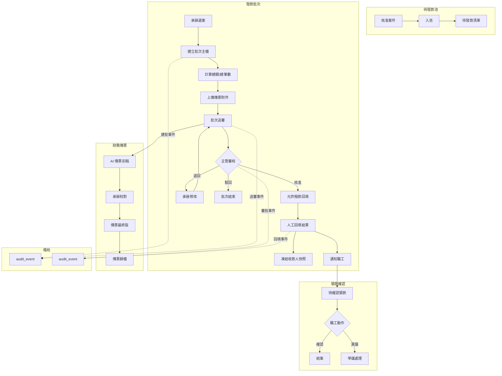
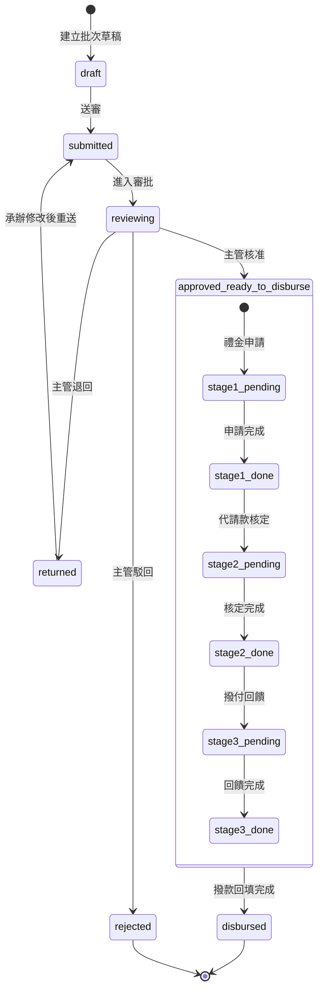
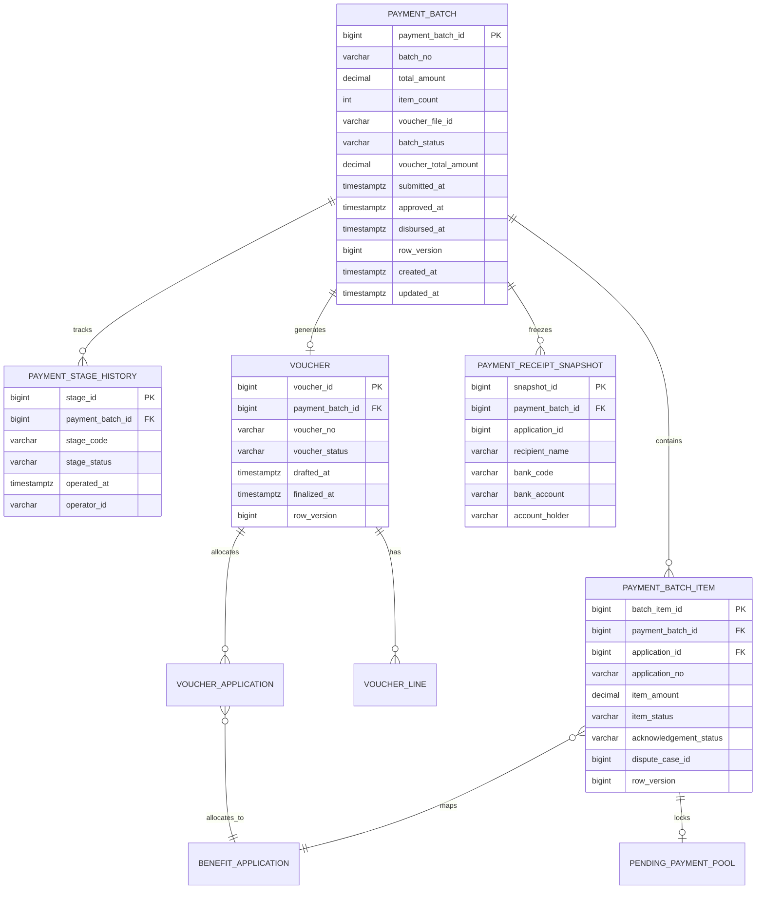
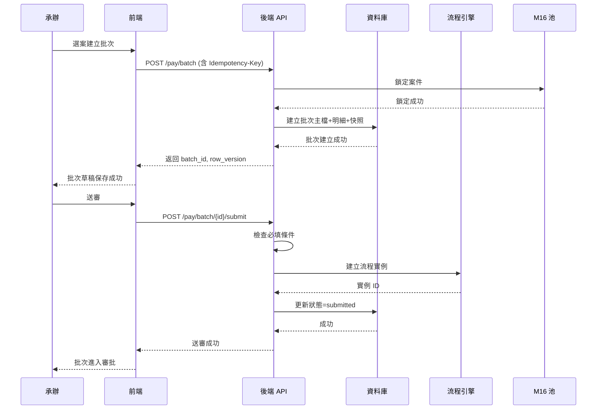

# PRD_M17_PAY_Batch_v2_20260703

> 來源註記：本文件為 M17《PAY－發款批次、送審與撥款回填》增強版本，保留舊版核心定位與功能拆解，依全域規範 v2 補充數據流圖、API 規格、用例文檔、三階段狀態機及跨模塊契約。

---

## 1. 模塊概述

### 1.1 功能定位

本模塊是 PAY 領域的主操作頁，負責把 M16 待發款池中的案件整理成**可審批、可追蹤、可回填、可對帳**的發款批次，並在撥款完成後將案件推向 M18 領款確認主鏈。

### 1.2 業務價值

- 批次化管理：將多筆已核准案件收斂為一個批次單位，降低逐筆操作的行政成本
- 金額一致性保障：批次總額 = 明細加總，傳票金額、批次金額、案件金額雙向可追溯
- 禮金三階段狀態機：禮金申請→代請款核定→撥付回饋，嚴格順序、不可跳階
- 收款人快照凍結：建批時凍結收款人與帳號，防止後續主檔修改破壞歷史對帳
- 傳票初稿輔助產製：系統生成 AI 傳票初稿，承辦校對後確認，草稿與最終版並存

### 1.3 使用角色

| 角色 | 職責 | 操作範圍 |
|------|------|----------|
| 福利社承辦人 | 建立批次、上傳傳票、送審、回填撥款結果 | 所轄 branch/domain |
| 審核主管 | 核准/退回/駁回批次 | 所轄審批範圍 |
| 財務人員 | 傳票校對（M17 輔助）、批次匯出 | 財務權限 |
| 系統管理員 | 治理異常批次、查看歷程 | 全範圍 |
| 資安稽核人員 | 查看高風險批次操作 | 稽核範圍 |

### 1.4 所屬領域與模塊類型

- **領域**：PAY（撥款管理）
- **類型**：後台頁面模塊
- **上游依賴**：M16（待發款池）、M08（檔案資源中心）
- **下游供應**：M18（領款確認與異議處理）、FIN（財務傳票）

---

## 2. 數據流圖

### 2.1 M16→M17→M18→FIN 主鏈數據流



### 2.2 批次狀態機（三階段禮金嵌入）



---

## 3. 數據庫設計

### 3.1 涉及數據表清單

| 表名 | 用途 | 所屬領域 |
|------|------|----------|
| `payment_batch` | 發款批次主表 | PAY |
| `payment_batch_item` | 批次案件明細 | PAY |
| `payment_stage_history` | 禮金三階段歷史 | PAY |
| `payment_receipt_snapshot` | 收款人/帳號快照 | PAY |
| `pending_payment_pool` | 待發款池（鎖定關聯） | PAY |
| `voucher` | 傳票主表 | FIN |
| `voucher_line` | 傳票明細行 | FIN |
| `voucher_application` | 傳票與案件關聯 | FIN |
| `benefit_application` | 補助案件 | BEN |
| `file_object` | 傳票附件檔案 | SYS |
| `audit_event` | 稽核事件 | SEC |
| `outbox_event` | Outbox 可靠投遞 | SYS |

### 3.2 表間關聯（ER）



### 3.3 關鍵字段說明

| 表 | 字段 | 說明 | 約束 |
|----|------|------|------|
| `payment_batch` | `batch_status` | 批次狀態: draft/submitted/reviewing/returned/approved_ready_to_disburse/disbursed/rejected | CHECK |
| `payment_batch` | `total_amount` | 批次總金額，由明細重算 | 非負 CHECK |
| `payment_batch` | `voucher_total_amount` | 傳票總金額，用於對帳 | 可空 |
| `payment_batch_item` | `item_status` | 明細狀態: pending/disbursed/failed | CHECK |
| `payment_batch_item` | `acknowledgement_status` | 領款確認狀態: pending/confirmed/disputed | CHECK |
| `payment_stage_history` | `stage_code` | 階段: stage1/stage2/stage3 | CHECK |
| `payment_stage_history` | `stage_status` | 階段狀態: pending/done | CHECK |

### 3.4 索引建議

- `(batch_status, created_at DESC)` — 批次列表查詢
- `(payment_batch_id, item_status)` — 批次內明細統計
- `(stage_code, payment_batch_id)` — 三階段進度查詢
- `(batch_no)` — 單號查詢
- `(voucher_id)` — 傳票反向關聯

---

## 4. 功能需求清單

### 4.1 核心功能點

| 編號 | 功能名稱 | 優先級 | 說明 | 權限控制 |
|------|----------|--------|------|----------|
| M17-F01 | 建立發款批次 | P0 | 從待發款池選案建立批次，計算總額總筆數 | 建立批次 |
| M17-F02 | 批次草稿保存 | P0 | 批次建立後保存為草稿，可後續編輯 | 編輯草稿批次 |
| M17-F03 | 傳票附件上傳/替換 | P0 | 上傳或替換傳票附件檔案 | 編輯草稿批次 |
| M17-F04 | 批次送審 | P0 | 提交批次進入 WF 審批流程 | 送審批次 |
| M17-F05 | 主管核准/退回/駁回 | P0 | 審批批次 | 核准/退回/駁回批次 |
| M17-F06 | 人工撥款回填 | P0 | 核准後回填撥款結果 | 回填撥款（高風險） |
| M17-F07 | 禮金三階段管理 | P1 | 禮金案件逐階推進狀態 | 回填撥款 |
| M17-F08 | 收款人快照凍結 | P1 | 建批時快照收款人與帳號 | 系統自動 |
| M17-F09 | AI 傳票初稿產製 | P1 | 批次送審後自動產製傳票初稿 | 系統自動 |
| M17-F10 | 批次內案件移除 | P1 | 草稿狀態下移除案件 | 編輯草稿批次 |
| M17-F11 | 批次匯出 | P2 | 匯出批次摘要與案件清單 | 匯出批次資料（高風險） |
| M17-F12 | 批次取消/作廢 | P1 | 草稿或退回狀態下取消批次 | 編輯草稿批次 |
| M17-F13 | 金額對帳檢查 | P1 | 傳票金額、批次金額、案件金額交叉比對 | 系統自動 |

### 4.2 批次狀態流轉規則

```
draft → submitted: 送審（需有傳票附件）
submitted → reviewing: 系統建立 WF 實例
reviewing → approved_ready_to_disburse: 主管核准
reviewing → returned: 主管退回
reviewing → rejected: 主管駁回
returned → submitted: 承辦修改後重送
approved_ready_to_disburse → disbursed: 回填完成
draft → [*]: 取消/作廢（僅草稿狀態可取消）
```

---

## 5. 用例文檔

### 5.1 用例一：承辦建立發款批次（典型路徑）

- **前置條件**：待發款池有 `pending_selectable` 案件；承辦擁有建立批次權限
- **操作步驟**：
  1. 進入「發款管理→建立發款批次」
  2. 系統加載待發款清單（M16 提供）
  3. 承辦勾選多筆案件
  4. 填寫批次備註（可選）
  5. 上傳傳票附件（PDF/圖片）
  6. 系統自動計算 `item_count` 與 `total_amount`
  7. 凍結收款人與帳號快照
  8. 點擊「保存草稿」
- **預期結果**：批次建立成功，狀態 `draft`，案件被鎖定
- **異常處理**：
  - 若選案中某案件已被鎖定，提示衝突清單，自動跳過
  - 傳票附件上傳失敗時不可送審（可保存草稿）
  - 收款人資訊缺失時標記異常，允許保存但不可送審

### 5.2 用例二：批次送審與主管核准

- **前置條件**：批次狀態為 `draft`，已上傳傳票附件
- **操作步驟**：
  1. 承辦點擊「送審」
  2. 系統檢查必填條件（傳票附件、案件清單非空）
  3. 系統建立 WF 流程實例，批次狀態轉為 `submitted` → `reviewing`
  4. 主管收到待辦通知
  5. 主管打開批次詳情，檢視總金額、案件清單、傳票
  6. 主管點擊「核准」
  7. 批次狀態轉為 `approved_ready_to_disburse`
  8. 系統自動產製 AI 傳票初稿
- **預期結果**：批次核准，承辦可進入回填頁
- **異常處理**：
  - 退回：主管填寫退回原因，批次回到 `returned`
  - 駁回：批次結束，案件釋放回待發款池
  - revision 衝突：返回 409，需刷新後重試

### 5.3 用例三：承辦回填撥款結果

- **前置條件**：批次狀態為 `approved_ready_to_disburse`；禮金三階段全部完成
- **操作步驟**：
  1. 承辦進入「撥款回填」頁面
  2. 逐筆或批量回填撥款結果（成功/失敗/部分金額）
  3. 填寫備註（如實際撥款日期、銀行回執編號）
  4. 系統比對回填總金額與批次總金額，不一致時提示
  5. 確認提交
  6. 批次狀態轉為 `disbursed`
  7. 系統寫入 `audit_event`，輸出通知至 M18/outbox
- **預期結果**：撥款完成，職工收到領款確認通知
- **異常處理**：
  - 回填總金額與批次總金額不一致：允許提交但需填寫差異原因
  - 部分失敗：僅更新失敗案件狀態，不影響其他案件
  - 回填後不可修改（除非走更正流程）

### 5.4 用例四：禮金三階段狀態推進

- **前置條件**：批次狀態為 `approved_ready_to_disburse`；禮金類案件
- **操作步驟**：
  1. 承辦進入禮金階段管理頁
  2. 當前階段為 `stage1_pending`（禮金申請）
  3. 承辦確認申請資料無誤，點擊「完成申請」
  4. 系統寫入 `payment_stage_history`，時間戳、操作者
  5. 狀態轉為 `stage1_done` → `stage2_pending`（代請款核定）
  6. 重複上述步驟逐階推進
- **預期結果**：三階段按順序完成，不可跳階
- **異常處理**：
  - 嘗試跳階操作：系統拒絕，返回 PAY-030
  - 回退操作：需走管理員更正流程

### 5.5 用例五：傳票校對與金額對帳

- **前置條件**：AI 傳票初稿已產製，批次已核准
- **操作步驟**：
  1. 財務人員打開傳票校對頁
  2. 系統展示 AI 初稿內容：借方/貸方科目、金額、案件明細
  3. 系統自動執行對帳：比對 `voucher.total` vs `payment_batch.total_amount`
  4. 不一致時標紅提示
  5. 財務人員手動校正，保存為最終版
  6. 最終版不可覆蓋草稿，兩版並存
- **預期結果**：傳票最終版保存，金額一致
- **異常處理**：金額不一致時強制填寫差異說明才可提交

---

## 6. 界面與交互要求

### 6.1 頁面佈局原則

- 批次列表頁以卡片+表格混合呈現，統計卡顯示各狀態批次數量
- 建立批次頁分左右兩欄：左欄待選清單、右欄已選清單
- 回填頁採用可編輯表格，支援逐筆和批量操作
- 狀態欄位使用色彩標籤，符合全域規範配色
- 所有提交操作需二次確認彈窗

### 6.2 關鍵交互流程



### 6.3 頁面規劃

| 頁面 | 定位 | 主要區塊 |
|------|------|----------|
| 發款批次列表頁 | 批次管理主入口 | 統計卡→篩選區→批次列表→匯出工具列 |
| 建立/編輯批次頁 | 批次建立與編輯 | 基本資料→待選案件區→已選案件清單→傳票上傳→總額摘要→操作區 |
| 批次詳情頁 | 批次完整檢視 | 摘要卡→案件清單→傳票附件→流程歷程→回填結果→操作區 |
| 撥款回填頁 | 核准後回填 | 批次摘要→案件回填清單（可編輯）→備註→確認提交區 |
| 禮金階段管理頁 | 三階段推進 | 階段進度條→當前階段操作區→歷史記錄 |

---

## 7. API 接口規格

### 7.1 建立批次（防重複建批）

```
POST /api/v1/pay/batch
```

**Headers:** `Idempotency-Key: uuid-v4`

**請求：**
```json
{
  "pending_payment_ids": [1001, 1002, 1003],
  "voucher_file_id": "file-uuid-123",
  "remark": "2026年7月結婚補助批次"
}
```

**響應（201 Created）：**
```json
{
  "payment_batch_id": 2001,
  "batch_no": "BATCH-202607-0001",
  "total_amount": 15000.00,
  "item_count": 3,
  "batch_status": "draft",
  "row_version": 1
}
```

**錯誤碼：**
- PAY-020：部分案件已被鎖定
- PAY-021：檔案 ID 無效
- GBL-001：Idempotency-Key 重複

### 7.2 批次送審

```
POST /api/v1/pay/batch/{batch_id}/submit
```

**Headers:** `Idempotency-Key: uuid-v4`

**請求：**
```json
{
  "row_version": 1
}
```

**響應：**
```json
{
  "payment_batch_id": 2001,
  "batch_status": "submitted",
  "workflow_instance_id": "wf-instance-001"
}
```

**錯誤碼：**
- PAY-022：批次狀態不可送審（非 draft）
- PAY-023：傳票附件缺失
- PAY-024：row_version 衝突（409）

### 7.3 審批批次（主管）

```
POST /api/v1/pay/batch/{batch_id}/review
```

**請求：**
```json
{
  "action": "approve",
  "comment": "核准",
  "row_version": 1
}
```

**action 可選值：** `approve` | `return` | `reject`

**響應：**
```json
{
  "payment_batch_id": 2001,
  "batch_status": "approved_ready_to_disburse"
}
```

### 7.4 撥款回填

```
POST /api/v1/pay/batch/{batch_id}/disburse
```

**Headers:** `Idempotency-Key: uuid-v4`

**請求：**
```json
{
  "row_version": 2,
  "items": [
    {
      "batch_item_id": 5001,
      "disbursement_status": "success",
      "actual_amount": 5000.00,
      "remark": "撥款成功"
    },
    {
      "batch_item_id": 5002,
      "disbursement_status": "failed",
      "actual_amount": 0,
      "remark": "帳號錯誤"
    }
  ],
  "total_actual_amount": 15000.00,
  "amount_diff_reason": ""
}
```

**響應：**
```json
{
  "payment_batch_id": 2001,
  "batch_status": "disbursed",
  "disbursed_at": "2026-07-03T14:00:00+08:00"
}
```

**錯誤碼：**
- PAY-025：批次未核准不可回填
- PAY-026：回填金額差異需填寫原因
- PAY-027：已回填批次不可重複回填

### 7.5 批次查詢

```
GET /api/v1/pay/batch?status=draft&page=1&page_size=20
```

**響應：**
```json
{
  "items": [
    {
      "payment_batch_id": 2001,
      "batch_no": "BATCH-202607-0001",
      "total_amount": 15000.00,
      "item_count": 3,
      "batch_status": "draft",
      "voucher_file_id": "file-uuid-123",
      "created_at": "2026-07-01T10:00:00+08:00",
      "submitted_at": null,
      "approved_at": null,
      "disbursed_at": null
    }
  ],
  "total": 10,
  "page": 1,
  "page_size": 20
}
```

### 7.6 批次詳情

```
GET /api/v1/pay/batch/{batch_id}
```

**響應：**
```json
{
  "payment_batch_id": 2001,
  "batch_no": "BATCH-202607-0001",
  "total_amount": 15000.00,
  "item_count": 3,
  "batch_status": "approved_ready_to_disburse",
  "voucher": {
    "voucher_id": 3001,
    "voucher_no": "VC-202607-0001",
    "voucher_status": "draft"
  },
  "stages": [
    {"stage_code": "stage1", "stage_status": "done", "operated_at": "...", "operator_id": "..."},
    {"stage_code": "stage2", "stage_status": "done", "operated_at": "...", "operator_id": "..."},
    {"stage_code": "stage3", "stage_status": "done", "operated_at": "...", "operator_id": "..."}
  ],
  "items": [
    {
      "batch_item_id": 5001,
      "application_no": "BEN-2026-0001",
      "item_amount": 5000.00,
      "item_status": "pending",
      "acknowledgement_status": "pending"
    }
  ],
  "row_version": 2,
  "created_at": "2026-07-01T10:00:00+08:00",
  "submitted_at": "2026-07-02T09:00:00+08:00",
  "approved_at": "2026-07-02T15:00:00+08:00"
}
```

### 7.7 禮金階段推進

```
POST /api/v1/pay/batch/{batch_id}/stage/advance
```

**請求：**
```json
{
  "row_version": 2
}
```

**響應：**
```json
{
  "current_stage": "stage2",
  "stage_status": "pending",
  "previous_stage": "stage1",
  "previous_status": "done"
}
```

**錯誤碼：** PAY-030：階段跳階不允許

### 7.8 批次取消/作廢

```
POST /api/v1/pay/batch/{batch_id}/cancel
```

**請求：**
```json
{
  "row_version": 1,
  "reason": "批次資料錯誤"
}
```

**響應：**
```json
{
  "payment_batch_id": 2001,
  "batch_status": "cancelled",
  "released_items_count": 3
}
```

---

## 8. 非功能性需求

### 8.1 性能指標

| 指標 | 目標值 |
|------|--------|
| 批次建立 P99 | ≤ 1s（含 100 筆案件） |
| 批次查詢 P99 | ≤ 500ms |
| 送審操作 P99 | ≤ 1s（含 WF 橋接） |
| 回填操作 P99 | ≤ 500ms |
| 批次列表查詢 | ≤ 300ms |

### 8.2 安全要求

- 核准、回填、取消、匯出均為高風險操作，需寫入 audit_event
- 批次內案件金額視為敏感資料，下載傳票附件需獨立稽核
- 批次取消時釋放案件+寫入稽核須在單一事務完成
- 收款人快照凍結後不可修改（歷史證據）

### 8.3 可用性標準

- 批次管理 API 可用性 ≥ 99.9%
- 批次建立與送審操作在資料庫層支援事務回滾
- 金額對帳檢查在每次關鍵操作前執行

---

## 9. 隱含需求補充

### 9.1 審計日誌

| 操作 | action_code | severity | 說明 |
|------|------------|----------|------|
| 建立批次 | PAY.BATCH.CREATE | INFO | 記錄案件數、總金額 |
| 送審 | PAY.BATCH.SUBMIT | INFO | 記錄 WF 實例 ID |
| 核准 | PAY.BATCH.APPROVE | INFO | 記錄核准人 |
| 退回/駁回 | PAY.BATCH.RETURN / REJECT | WARN | 記錄原因 |
| 回填 | PAY.BATCH.DISBURSE | INFO | 記錄回填結果明細 |
| 批次取消 | PAY.BATCH.CANCEL | WARN | 記錄原因、釋放案件數 |
| 階段推進 | PAY.BATCH.STAGE_ADVANCE | INFO | 記錄階段編號 |
| 傳票校對 | PAY.VOUCHER.FINALIZE | INFO | 記錄校對人 |

### 9.2 數據一致性

- `total_amount` 不可直接寫入，須在服務層由 `payment_batch_item.item_amount` 加總重算
- 回填後檢查 `sum(actual_amount)` 是否等於 `total_amount`
- 傳票產製時比對 `voucher_total` = `batch.total_amount`，不一致時強制攔截
- 批次取消時，釋放案件與批次狀態更新在同一 DB 事務
- 已回填批次禁止修改案件明細

### 9.3 併發控制（row_version）

- `payment_batch` 與 `payment_batch_item` 均有 `row_version`
- 送審、回填、取消、階段推進均校驗 `row_version`
- 併發衝突返回 409，前端需因應用戶重新操作

### 9.4 冪等性保障（Idempotency-Key）

- 建立批次、送審、回填、階段推進均要求 `Idempotency-Key`
- 鍵有效期 24 小時
- 防止因網路重試導致的重複建批、重複送審、重複回填

### 9.5 Outbox 模式

- 回填完成後，通知職工事件寫入 `outbox_event`
- 傳票 AI 產製任務通過 outbox 觸發
- 階段推進完成後，下一階段通知通過 outbox 投遞

### 9.6 收款人快照凍結

- 建批時從 `employee_payment_account` 當前值快照至 `payment_receipt_snapshot`
- 後續員工修改帳號不影響已建批的快照
- 快照包含：收款人姓名、銀行代碼、帳號、戶名

### 9.7 傳票版本管理

- AI 初稿與最終版分開保存（`voucher_status = draft` vs `finalized`）
- 最終版不可覆蓋草稿，兩版均可查閱
- 傳票修改歷程寫入 `audit_event`

### 9.8 邊界情況

- **空批次**：不可建立 item_count = 0 的批次
- **金額為零**：允許，但標記為異常（用於禮金類 $0 案件）
- **批次長期未送審**：配置提醒天數，超時觸發營運通知
- **部分回填失敗**：批次仍可 `disbursed`，失敗案件單獨標記
- **三階段跳階**：服務層嚴格校驗，資料庫 CHECK 輔助

---

> **跨模塊契約：** 本模塊遵循全域規範 v2 約定，包含審計日誌（§3.3）、冪等性（§3.2）、樂觀鎖 row_version（§3.4）、Outbox 模式（§3.5）及錯誤碼體系 PAY-XXX（§3.6）。
