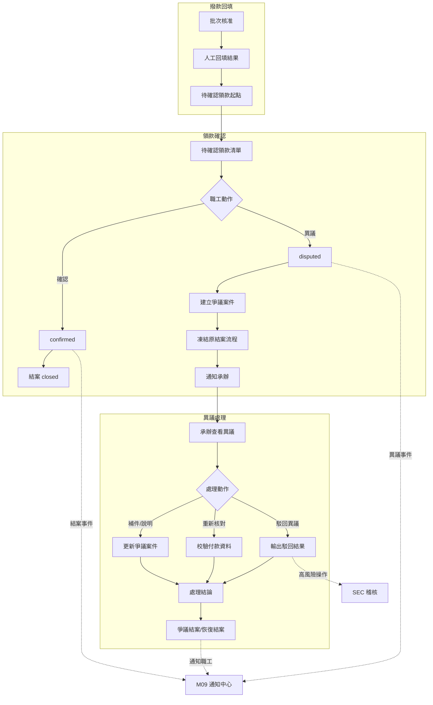
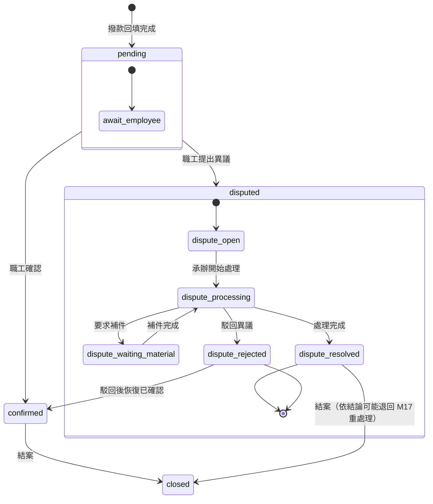
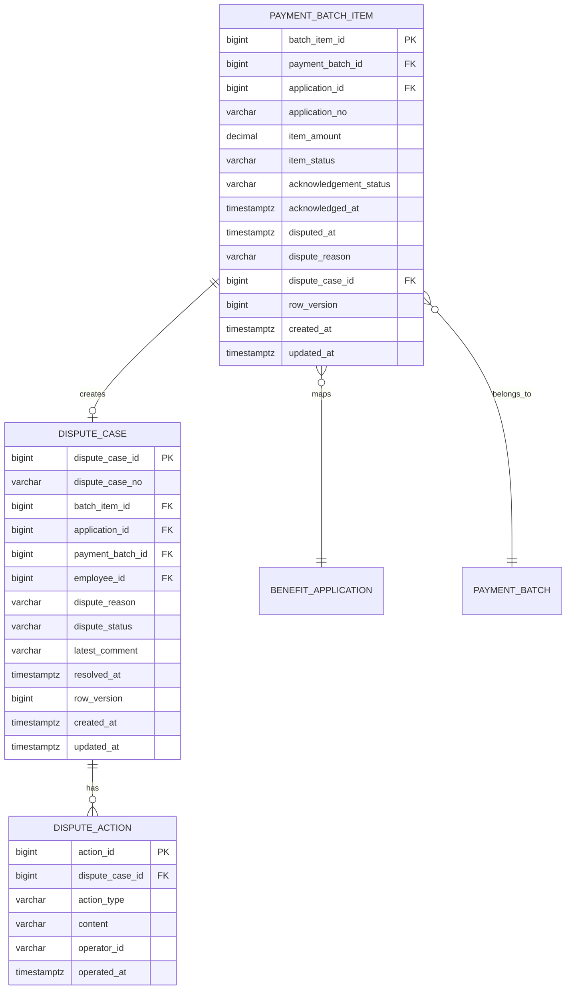
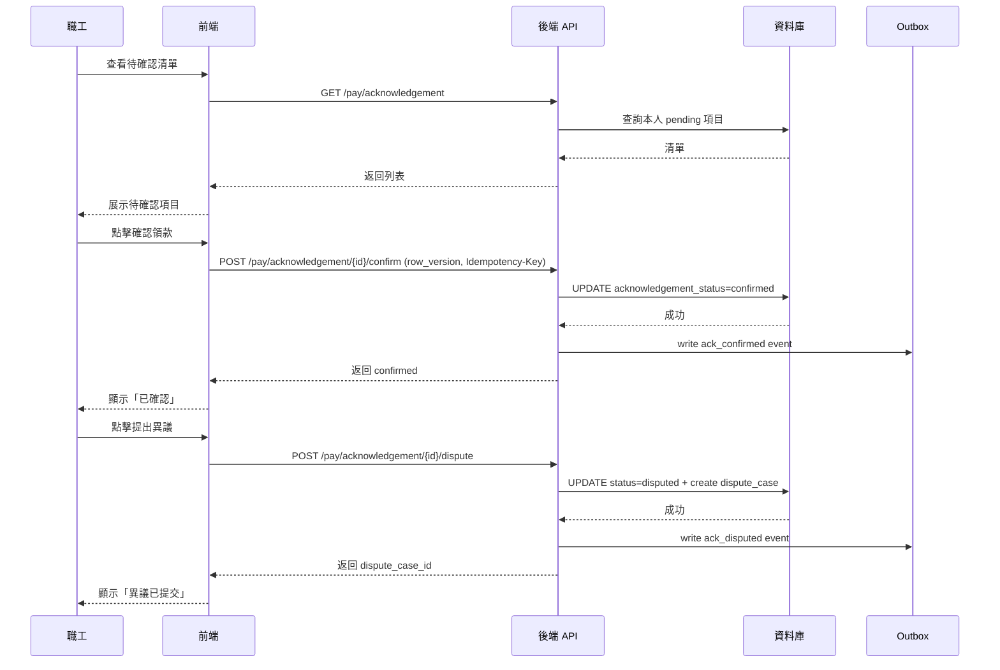

# PRD_M18_PAY_Confirm_v2_20260703

> 來源註記：本文件為 M18《PAY－領款確認與異議處理》增強版本，保留舊版核心定位與功能拆解，依全域規範 v2 補充數據流圖、API 規格、用例文檔、異議處理閉環及跨模塊契約。

---

## 1. 模塊概述

### 1.1 功能定位

本模塊是臺鐵職福平台「發款主鏈」的收口層，承接 M17 撥款回填後的職工確認動作。職工對結果無疑義時完成結案；有疑義時分流為正式爭議處理流程。每次確認、每次異議、每筆處理都有歷程可查。

### 1.2 業務價值

- 責任閉環：撥款結果不只停留在後台回填，由職工完成最終確認
- 爭議分流：金額不符或資料異常時，不可直接覆寫原狀態，須進入可追蹤的異議處理
- 凍結機制：一旦 disputed，原結案流程凍結，異議處理結論為最終依據
- 不可逆約束：disputed 不可直接改回 confirmed，確保稽核完整性

### 1.3 使用角色

| 角色 | 職責 | 操作範圍 |
|------|------|----------|
| 一般職工 | 查看待確認領款、確認領款、提出異議 | 本人案件 |
| 福利社承辦人 | 查看與處理異議案件、補件、說明、重新核對 | 所轄範圍 |
| 審核主管 | 查看高級別異議結果或特殊升級處理 | 所轄審批範圍 |
| 系統管理員 | 治理異常案件、強制關閉爭議 | 全範圍 |
| 資安稽核人員 | 查看高風險爭議處理操作 | 稽核範圍 |

### 1.4 所屬領域與模塊類型

- **領域**：PAY（撥款管理）
- **類型**：業務支撐模塊（含前台職工端 + 後台管理端）
- **上游依賴**：M17（發款批次、送審與撥款回填）
- **協作模塊**：M09（通知中心）、M08（檔案資源中心）

---

## 2. 數據流圖

### 2.1 M17→M18→結案/異議閉環



### 2.2 acknowledgement 與 dispute 雙層狀態機



---

## 3. 數據庫設計

### 3.1 涉及數據表清單

| 表名 | 用途 | 所屬領域 |
|------|------|----------|
| `payment_batch_item` | 批次明細（含 acknowledgement 狀態） | PAY |
| `dispute_case` | 爭議案件主表 | PAY |
| `dispute_action` | 爭議處理動作記錄 | PAY |
| `payment_batch` | 發款批次（關聯查詢） | PAY |
| `benefit_application` | 補助案件（關聯查詢） | BEN |
| `employee` | 員工主檔 | ORG/EMP |
| `file_object` | 爭議附件 | SYS |
| `audit_event` | 稽核事件 | SEC |
| `outbox_event` | Outbox 可靠投遞 | SYS |

### 3.2 表間關聯（ER）



### 3.3 關鍵字段說明

| 表 | 字段 | 說明 | 約束 |
|----|------|------|------|
| `payment_batch_item` | `acknowledgement_status` | 領款確認狀態: pending/confirmed/disputed | CHECK |
| `payment_batch_item` | `acknowledged_at` | 職工確認時間 | 可空 |
| `payment_batch_item` | `disputed_at` | 職工提出異議時間 | 可空 |
| `payment_batch_item` | `dispute_case_id` | 關聯爭議案件 | FK, 可空 |
| `dispute_case` | `dispute_status` | 爭議狀態: open/processing/waiting_material/resolved/rejected | CHECK |
| `dispute_case` | `dispute_case_no` | 爭議單號對外識別 | UNIQUE |
| `dispute_action` | `action_type` | 動作類型: view/respond/supplement/recheck/reject/resolve | CHECK |

### 3.4 索引建議

- `(employee_id, acknowledgement_status)` — 職工待確認清單
- `(acknowledgement_status, created_at DESC)` — 後台清單查詢
- `(dispute_status, created_at DESC)` — 爭議案件查詢
- `(batch_item_id)` — 反向關聯查詢
- `(dispute_case_id)` — 爭議動作查詢

---

## 4. 功能需求清單

### 4.1 核心功能點

| 編號 | 功能名稱 | 優先級 | 說明 | 權限控制 |
|------|----------|--------|------|----------|
| M18-F01 | 待確認領款清單（前台） | P0 | 職工查看本人待確認領款列表 | 本人案件 |
| M18-F02 | 領款確認（前台） | P0 | 職工確認領款，寫入 acknowledged_at | 本人案件 |
| M18-F03 | 提出異議（前台） | P0 | 職工填寫異議原因後提出 | 本人案件 |
| M18-F04 | 爭議案件列表（後台） | P0 | 承辦查看所有爭議案件 | 查看異議案件 |
| M18-F05 | 爭議案件詳情（後台） | P0 | 承辦查看爭議完整資訊 | 查看異議案件 |
| M18-F06 | 爭議處理動作 | P0 | 承辦補件/說明/重新核對/駁回 | 補件/說明/駁回 |
| M18-F07 | 凍結結案流程 | P0 | disputed 後凍結原確認流程 | 系統自動 |
| M18-F08 | 爭議狀態更新通知 | P1 | 爭議處理進度通知職工 | 系統自動 |
| M18-F09 | 爭議案件匯出 | P2 | 匯出爭議案件清單 | 匯出（高風險） |
| M18-F10 | 強制關閉爭議（管理員） | P2 | 異常狀態下管理員強制關閉 | 強制關閉（高風險） |

### 4.2 狀態約束規則

- `pending` → `confirmed`：職工執行確認操作
- `pending` → `disputed`：職工提出異議，需填寫原因
- `disputed` → `confirmed`：**不允許直接轉換**
- `disputed` → `pending`：**不允許**
- `confirmed` → `closed`：系統自動結案
- 同一個 `batch_item_id` 既有異議未結束前，不可再次建立新的 open 爭議

---

## 5. 用例文檔

### 5.1 用例一：職工確認領款（典型路徑）

- **前置條件**：M17 撥款回填完成；職工已登入前台
- **操作步驟**：
  1. 職工進入「待確認領款」列表
  2. 點擊某筆待確認項目進入詳情
  3. 核對金額、補助類型、申請單號
  4. 點擊「確認領款」
  5. 二次確認彈窗，職工確認
  6. `acknowledgement_status` 更新為 `confirmed`
  7. 寫入 `acknowledged_at`、`acknowledged_by`
  8. 案件結案，輸出通知
- **預期結果**：領款確認完成，案件結案
- **異常處理**：
  - 版本衝突（batch_item row_version 已變）：提示重新加載
  - 非本人操作：前端不顯示非本人案件

### 5.2 用例二：職工提出異議

- **前置條件**：職工查看待確認領款詳情，發現金額不符
- **操作步驟**：
  1. 點擊「提出異議」
  2. 填寫異議原因（必填，如「實際金額為 5000 元，系統顯示 5500 元」）
  3. 上傳補充附件（可選）
  4. 確認提交
  5. `acknowledgement_status` 更新為 `disputed`
  6. 建立 `dispute_case` 記錄，狀態 `open`
  7. 凍結原結案流程，通知承辦
- **預期結果**：異議提交成功，承辦收到通知
- **異常處理**：
  - 既有異議處理未結束：提示「已有進行中的異議，請等待處理」
  - 附件過大：限制 10MB，超過提示壓縮後上傳

### 5.3 用例三：承辦處理爭議案件

- **前置條件**：承辦收到異議通知；爭議狀態 `open`
- **操作步驟**：
  1. 承辦進入「異議案件列表」，找到目標案件
  2. 點擊進入詳情：查看異議原因、原付款資料、批次資訊、附件
  3. 選擇處理動作：
     - **補件**：上傳補充文件，寫入 `dispute_action`（action_type=supplement）
     - **說明**：填寫說明文字，寫入 `dispute_action`（action_type=respond）
     - **重新核對**：標記為需重新校驗，寫入 `dispute_action`（action_type=recheck）
     - **駁回異議**：填寫駁回理由，寫入 `dispute_action`（action_type=reject）
  4. 若駁回異議：`dispute_status` → `rejected`，`acknowledgement_status` → `confirmed`
  5. 若處理完成：`dispute_status` → `resolved`
  6. 通知職工處理結果
- **預期結果**：爭議案件處理完畢，職工收到通知
- **異常處理**：
  - 駁回異議時需填寫詳細理由，reason 不可空
  - 強制關閉需管理員權限，寫入 high-severity audit_event

### 5.4 用例四：爭議駁回後恢復確認

- **前置條件**：承辦駁回異議，`dispute_status = rejected`
- **操作步驟**：
  1. 系統自動將 `acknowledgement_status` 更新為 `confirmed`
  2. 寫入 `acknowledged_at` = 駁回時間（系統自動）
  3. 寫入 `acknowledged_by` = 承辦（系統自動）
  4. 輸出 `dispute_case_rejected` + `ack_confirmed` 事件
  5. 通知職工：異議已被駁回，領款狀態恢復為已確認
- **預期結果**：領款狀態恢復，案件可結案
- **異常處理**：若職工對駁回結果不滿，可聯繫管理員升級處理

### 5.5 用例五：強制關閉爭議（管理員）

- **前置條件**：爭議案件異常（如承辦離職、資料遺失）；管理員擁有權限
- **操作步驟**：
  1. 管理員進入爭議案件詳情
  2. 查看異常原因與處理歷程
  3. 點擊「強制關閉」，填寫關閉原因
  4. 選擇關閉後狀態（`resolved` 或 `rejected`）
  5. 寫入 audit_event（severity=WARN, action_code=PAY.DISPUTE.FORCE_CLOSE）
  6. 更新 `dispute_status`，記錄操作人
- **預期結果**：爭議強制關閉
- **異常處理**：強制關閉後不可撤銷，需在關閉前二次確認

---

## 6. 界面與交互要求

### 6.1 頁面佈局原則

- 前台頁面避免技術術語：使用「確認領款」「提出異議」「等待承辦處理」
- 前台領款列表僅展示當前職工本人案件，不可出現他人資料
- 後台爭議列表以卡片+表格形式，狀態用色彩標籤
- 所有確認/提交操作需二次確認彈窗
- disputed 狀態後前台按鈕切換為「已提交異議，等待處理」

### 6.2 關鍵交互流程



### 6.3 頁面規劃

| 頁面 | 端 | 定位 | 主要區塊 |
|------|----|------|----------|
| 待確認領款列表 | 前台 | 職工主入口 | 統計卡→篩選區→列表（狀態、金額、時間、操作入口） |
| 領款確認詳情 | 前台 | 確認/異議主頁 | 摘要卡→申請資料→金額資訊→操作區（確認/異議） |
| 提出異議表單 | 前台 | 異議資訊收集 | 問題描述區→原付款摘要→補充附件→提交確認 |
| 異議案件列表 | 後台 | 承辦處理入口 | 統計卡→篩選區→列表（no、申請、批次、狀態、時間） |
| 異議案件詳情 | 後台 | 爭議處理主頁 | 爭議摘要→原付款資料→異議原因→補件區→處理結果→歷程 |

---

## 7. API 接口規格

### 7.1 待確認領款清單（前台）

```
GET /api/v1/pay/acknowledgement?status=pending&page=1&page_size=20
```

**請求 Headers：** `Authorization: Bearer <token>`（自動識別職工身份）

**響應：**
```json
{
  "items": [
    {
      "batch_item_id": 5001,
      "application_no": "BEN-2026-0001",
      "batch_no": "BATCH-202607-0001",
      "benefit_type": "結婚補助",
      "amount": 5000.00,
      "disbursed_at": "2026-07-02T14:00:00+08:00",
      "acknowledgement_status": "pending",
      "dispute_case_no": null
    }
  ],
  "total": 3,
  "page": 1,
  "page_size": 20
}
```

### 7.2 領款確認詳情

```
GET /api/v1/pay/acknowledgement/{batch_item_id}
```

**響應：**
```json
{
  "batch_item_id": 5001,
  "application_no": "BEN-2026-0001",
  "batch_no": "BATCH-202607-0001",
  "application_type": "結婚補助",
  "applicant_name": "王小明",
  "amount": 5000.00,
  "disbursed_at": "2026-07-02T14:00:00+08:00",
  "voucher_no": "VC-202607-0001",
  "acknowledgement_status": "pending",
  "row_version": 1
}
```

### 7.3 確認領款

```
POST /api/v1/pay/acknowledgement/{batch_item_id}/confirm
```

**Headers：** `Idempotency-Key: uuid-v4`

**請求：**
```json
{
  "row_version": 1
}
```

**響應：**
```json
{
  "batch_item_id": 5001,
  "acknowledgement_status": "confirmed",
  "acknowledged_at": "2026-07-03T10:00:00+08:00"
}
```

**錯誤碼：**
- PAY-040：領款狀態不可確認（非 pending）
- PAY-041：row_version 衝突（409）
- PAY-042：非本人領款

### 7.4 提出異議

```
POST /api/v1/pay/acknowledgement/{batch_item_id}/dispute
```

**Headers：** `Idempotency-Key: uuid-v4`

**請求：**
```json
{
  "row_version": 1,
  "dispute_reason": "實際金額為 5000 元，系統顯示 5500 元",
  "attachment_file_ids": ["file-uuid-456"]
}
```

**響應（201 Created）：**
```json
{
  "batch_item_id": 5001,
  "acknowledgement_status": "disputed",
  "dispute_case_id": 7001,
  "dispute_case_no": "DSP-202607-0001",
  "disputed_at": "2026-07-03T10:05:00+08:00"
}
```

**錯誤碼：**
- PAY-040：領款狀態不可異議（非 pending）
- PAY-043：既有異議未結束，不可重複提出
- PAY-044：異議原因不可為空
- PAY-045：附件檔案 ID 無效

### 7.5 爭議案件列表（後台）

```
GET /api/v1/pay/dispute-case?status=open&page=1&page_size=20
```

**響應：**
```json
{
  "items": [
    {
      "dispute_case_id": 7001,
      "dispute_case_no": "DSP-202607-0001",
      "application_no": "BEN-2026-0001",
      "batch_no": "BATCH-202607-0001",
      "applicant_name": "王小明",
      "dispute_reason": "實際金額為 5000 元，系統顯示 5500 元",
      "dispute_status": "open",
      "dispute_created_at": "2026-07-03T10:05:00+08:00",
      "latest_action_at": "2026-07-03T10:05:00+08:00"
    }
  ],
  "total": 5,
  "page": 1,
  "page_size": 20
}
```

### 7.6 爭議案件詳情

```
GET /api/v1/pay/dispute-case/{dispute_case_id}
```

**響應：**
```json
{
  "dispute_case_id": 7001,
  "dispute_case_no": "DSP-202607-0001",
  "batch_item_id": 5001,
  "application": {
    "application_id": 3001,
    "application_no": "BEN-2026-0001",
    "benefit_type": "結婚補助",
    "approved_amount": 5000.00
  },
  "payment_batch": {
    "batch_id": 2001,
    "batch_no": "BATCH-202607-0001",
    "total_amount": 15000.00
  },
  "employee": {
    "employee_id": 1,
    "name": "王小明",
    "employee_no": "TRA0001"
  },
  "dispute_reason": "實際金額為 5000 元，系統顯示 5500 元",
  "dispute_status": "open",
  "actions": [
    {
      "action_type": "respond",
      "content": "已核對原始收據，系統金額為正確值 5500 元",
      "operator_id": "clerk001",
      "operated_at": "2026-07-04T09:00:00+08:00"
    }
  ],
  "row_version": 2
}
```

### 7.7 爭議處理動作

```
POST /api/v1/pay/dispute-case/{dispute_case_id}/action
```

**請求：**
```json
{
  "action_type": "reject",
  "content": "經核對原始收據，系統顯示金額正確，駁回異議",
  "attachment_file_ids": ["file-uuid-789"],
  "row_version": 2
}
```

**action_type 可選值：** `respond` | `supplement` | `recheck` | `reject` | `resolve`

**響應：**
```json
{
  "dispute_case_id": 7001,
  "dispute_status": "rejected",
  "acknowledgement_status": "confirmed",
  "row_version": 3
}
```

**錯誤碼：**
- PAY-050：爭議狀態不允許此動作
- PAY-051：row_version 衝突
- PAY-052：駁回原因不可為空

### 7.8 強制關閉爭議（管理員）

```
POST /api/v1/pay/dispute-case/{dispute_case_id}/force-close
```

**請求：**
```json
{
  "target_status": "resolved",
  "reason": "承辦已離職，依管理員職權關閉",
  "row_version": 2
}
```

**響應：**
```json
{
  "dispute_case_id": 7001,
  "dispute_status": "resolved"
}
```

**錯誤碼：** PAY-053：非管理員無權操作

---

## 8. 非功能性需求

### 8.1 性能指標

| 指標 | 目標值 |
|------|--------|
| 前台待確認清單查詢 P99 | ≤ 300ms |
| 確認/異議操作 P99 | ≤ 500ms |
| 後台爭議清單查詢 P99 | ≤ 500ms |
| 爭議處理動作提交 P99 | ≤ 500ms |

### 8.2 安全要求

- 前台 API 自動識別當前登入職工身份，僅返回匹配 `employee_id` 的案件
- 駁回異議、強制關閉、匯出為高風險操作，寫入 audit_event
- 爭議附件存取受 RBAC 控制
- disputed 狀態下前端隱藏確認按鈕，後端也拒絕 confirm API

### 8.3 可用性標準

- 領款確認 API 可用性 ≥ 99.9%
- 爭議處理狀態轉換在資料庫層保證原子性

---

## 9. 隱含需求補充

### 9.1 審計日誌

| 操作 | action_code | severity | 說明 |
|------|------------|----------|------|
| 確認領款 | PAY.ACK.CONFIRM | INFO | 記錄 batch_item_id、確認人 |
| 提出異議 | PAY.ACK.DISPUTE | INFO | 記錄異議原因、附件 |
| 爭議處理動作 | PAY.DISPUTE.ACTION | INFO | 記錄 action_type、內容 |
| 駁回異議 | PAY.DISPUTE.REJECT | WARN | 記錄駁回理由 |
| 強制關閉 | PAY.DISPUTE.FORCE_CLOSE | WARN | 記錄原因、管理員 |
| 爭議解決 | PAY.DISPUTE.RESOLVE | INFO | 記錄處理結論 |

### 9.2 數據一致性

- `batch_item_id` 在同一 `dispute_case` 的 UNIQUE 約束確保單一爭議
- `dispute_case` 建立時同時更新 `payment_batch_item.acknowledgement_status = disputed`，在單一事務中完成
- 駁回異議時自動將 `acknowledgement_status` 改回 `confirmed`，不可分步操作
- 強制關閉不影響 `acknowledgement_status`（管理員另選目標狀態）

### 9.3 併發控制（row_version）

- `payment_batch_item` 與 `dispute_case` 均有 `row_version`
- 確認領款、提出異議、處理動作均校驗 `row_version`
- 衝突返回 409，前端提示用戶刷新

### 9.4 冪等性保障（Idempotency-Key）

- 確認領款、提出異議、處理動作均要求 `Idempotency-Key`
- 防止因前端重試導致的重複確認或重複異議
- 鍵有效期 24 小時

### 9.5 Outbox 模式

- 確認領款事件 → outbox → M09 通知
- 異議提出事件 → outbox → M09 通知承辦
- 爭議處理事件 → outbox → M09 通知職工

### 9.6 邊界情況

- **重複確認**：由 `row_version` + `Idempotency-Key` 雙重保障
- **重複異議**：檢查既有異議未結束時拒絕
- **異議後職工再點確認**：前端隱藏按鈕，後端 API 拒絕（PAY-040）
- **非本人操作**：後端驗證 `employee_id`，不匹配時返回 403
- **爭議長時間未處理**：配置提醒天數（預設 14 天），超時觸發營運通知
- **爭議附件**：支援多附件上傳，單文件 ≤ 10MB，總大小 ≤ 50MB
- **職工離職後異議**：需管理員承接，走強制關閉或重新指派
- **結案後再爭議**：不允許，需走紙本更正流程

### 9.7 前台文案規範

| 狀態 | 前台顯示文案 |
|------|-------------|
| `pending` | 待確認領款 |
| `confirmed` | 已確認 ✔ |
| `disputed` | 已提交異議，等待承辦處理 |
| `dispute_open` | 承辦正在查看中 |
| `dispute_processing` | 承辦正在處理 |
| `dispute_resolved` | 異議已解決 |
| `dispute_rejected` | 異議已駁回 |

---

> **跨模塊契約：** 本模塊遵循全域規範 v2 約定，包含審計日誌（§3.3）、冪等性（§3.2）、樂觀鎖 row_version（§3.4）、Outbox 模式（§3.5）及錯誤碼體系 PAY-XXX（§3.6）。
