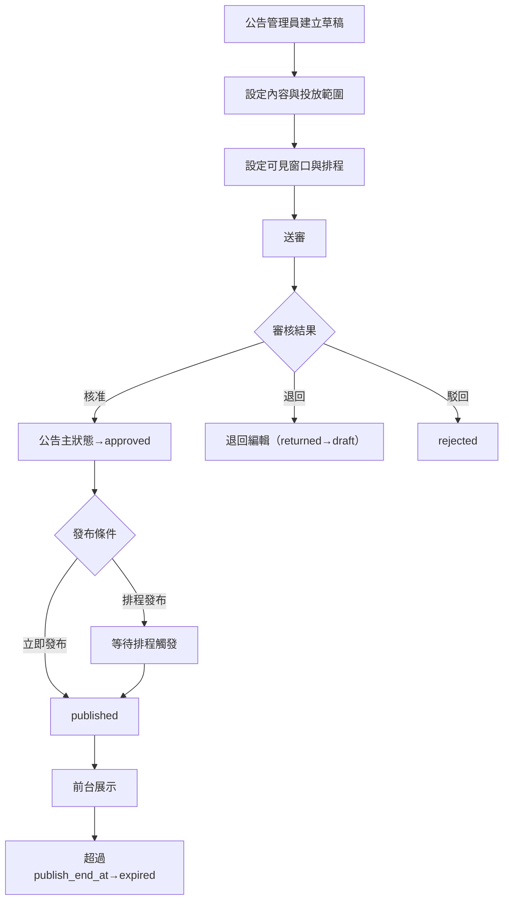
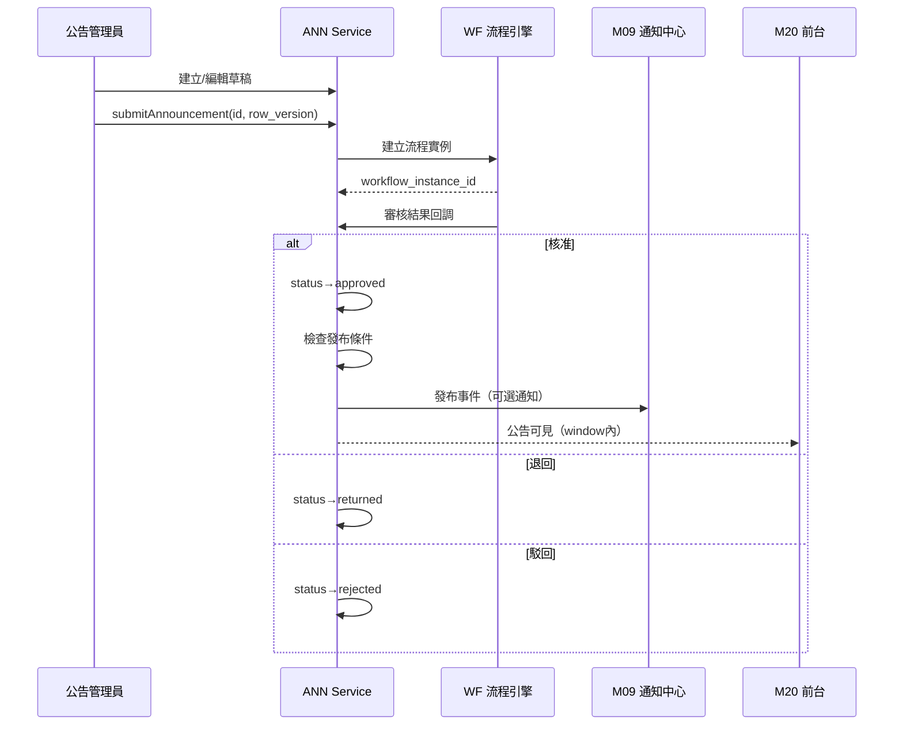
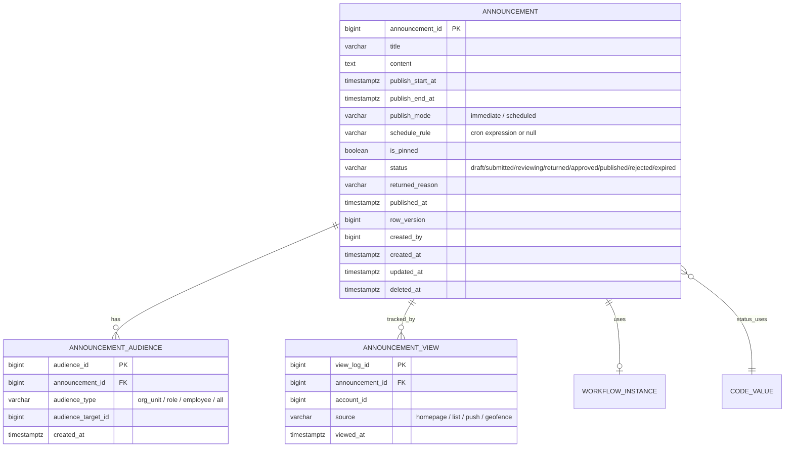
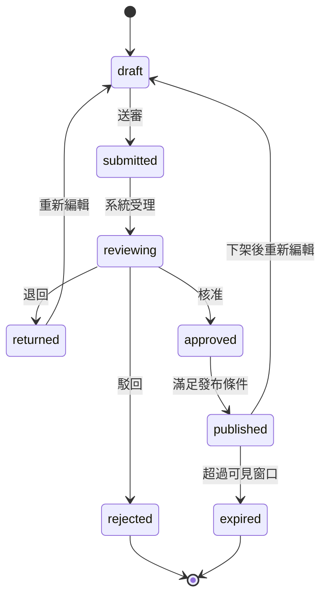

# PRD_M19_ANN_Draft_v2_20260703

> 版本記錄：v2 增強版，基於舊版 M19 子 PRD、工作說明書及資料庫優化報告重構。新增資料流圖、ER 圖、API 規格、用例文檔及跨模塊契約。

---

## 1. 模塊概述

| 項目 | 內容 |
|------|------|
| 模塊名稱 | ANN－公告草稿、審批與發布 |
| 模塊類型 | 後台頁面模塊 |
| 所屬領域 | ANN（公告與訊息） |
| 功能定位 | 福利平台中「公告、規章、通知性內容」的內容生產與發布中樞，負責將公告從草稿編輯、投放配置、可見窗口與排程設定，推進到送審、核准、發布與前台展示 |
| 業務價值 | 建立標準化公告審批流程，取代臨時貼文與人工轉發；拆分「可見窗口」與「排程規則」兩類時間語義，確保前台展示一致性 |
| 使用角色 | 公告管理員（建立草稿、設定投放、送審）、審核主管（核准/退回/駁回）、系統管理員（治理異常公告） |

### 1.1 生命週期

公告內容與通知投遞分離：M19 負責內容審批生命週期（草稿→送審→核准→發布），通知投遞（站內信、Email、推播）由 M09 通知中心承接。核准後的公告可選擇立即發布或排程發布，不受通知投遞狀態影響。

---

## 2. 數據流圖

### 2.1 公告發布主流程



### 2.2 跨模塊數據流



---

## 3. 數據庫設計

### 3.1 涉及數據表清單

| 表名 | 說明 | 歸屬 |
|------|------|------|
| `announcement` | 公告主檔 | ANN |
| `announcement_audience` | 投放範圍子表 | ANN |
| `announcement_view` | 瀏覽紀錄（M20 共用） | ANN |
| `workflow_instance` | 流程實例關聯 | WF |
| `audit_event` | 稽核事件 | SEC |
| `file_object` | 附件檔案（若有） | SYS |

### 3.2 ER 圖



### 3.3 關鍵字段說明

| 字段 | 說明 |
|------|------|
| `publish_start_at / publish_end_at` | 前台可見窗口，嚴格控制展示權 |
| `publish_mode` | 立即發布/排程發布，不覆蓋窗口語義 |
| `schedule_rule` | cron 表達式，用於排程觸發發布任務 |
| `is_pinned` | 置頂標記，前台排序優先 |
| `row_version` | 樂觀鎖版本號，防止併發覆蓋 |
| `content` | 白名單富文本內容，保存前經 XSS 清洗 |

---

## 4. 功能需求清單

| 編號 | 名稱 | 優先級 | 說明 | 權限控制 |
|------|------|--------|------|----------|
| ANN-F01 | 建立公告草稿 | P0 | 提供標題、富文本內容編輯器 | 公告管理員 |
| ANN-F02 | 編輯公告草稿 | P0 | draft/returned 狀態下可編輯 | 公告管理員 |
| ANN-F03 | 設定投放範圍 | P0 | 選擇角色/組織/全體 | 公告管理員 |
| ANN-F04 | 設定可見窗口 | P0 | publish_start_at / publish_end_at | 公告管理員 |
| ANN-F05 | 設定排程規則 | P1 | 立即/排程發布 | 公告管理員 |
| ANN-F06 | 送審公告 | P0 | 送審後狀態→submitted | 公告管理員 |
| ANN-F07 | 核准公告 | P0 | 核准後狀態→approved | 審核主管 |
| ANN-F08 | 退回公告 | P0 | 退回編輯並記錄原因 | 審核主管 |
| ANN-F09 | 駁回公告 | P0 | 駁回終止流程 | 審核主管 |
| ANN-F10 | 依條件發布 | P0 | 核准後判斷是否立即/排程發布 | 系統自動 |
| ANN-F11 | 設定置頂 | P1 | 控制前台排序優先度 | 公告管理員 |
| ANN-F12 | 查看排程監看 | P1 | 待生效/已發布/異常公告列表 | 公告管理員、系統管理員 |
| ANN-F13 | 富文本安全過濾 | P0 | 白名單清洗，防 XSS | 後端強制 |
| ANN-F14 | 公告下架 | P1 | 手動下架或到期自動 expired | 公告管理員 |

---

## 5. 用例文檔

### 用例 1：建立並送審公告（主路徑）

- **前置條件**：公告管理員已登入後台，具備公告建立權限
- **操作步驟**：
  1. 進入後台→公告管理→建立公告
  2. 填寫標題、富文本內容
  3. 設定投放範圍（如：全體職工）
  4. 設定可見窗口（如：2026-08-01 ~ 2026-09-30）
  5. 選擇發布模式為「立即發布」
  6. 點擊「送審」
- **預期結果**：公告狀態變為 `submitted`，審核主管收到待辦
- **異常處理**：未設定投放範圍或窗口時阻斷送審，提示「請完成配置」

### 用例 2：主管退回公告（異常分支）

- **前置條件**：公告狀態為 `submitted`，審核主管有退回權限
- **操作步驟**：
  1. 主管進入待辦→公告審核
  2. 檢視內容、投放範圍、窗口配置
  3. 點擊「退回」，填寫退回原因
- **預期結果**：公告狀態變為 `returned`，公告管理員可重新編輯
- **異常處理**：退回原因為必填，未填寫時阻斷

### 用例 3：核准後排程發布

- **前置條件**：公告已送審，設定發布模式為「排程發布」，schedule_rule 為每日 08:00
- **操作步驟**：
  1. 主管核准公告
  2. 公告狀態→approved
  3. 排程任務在指定時間觸發
  4. 公告狀態→published
- **預期結果**：前台在 publish_start_at 內可看到公告
- **異常處理**：排程任務執行失敗時記錄錯誤，保留重試機制（最多 3 次）

### 用例 4：富文本 XSS 攻擊防護

- **前置條件**：公告管理員嘗試在 content 中插入 `<script>alert('xss')</script>`
- **操作步驟**：
  1. 管理員編輯公告，輸入惡意 HTML
  2. 點擊保存
- **預期結果**：後端白名單過濾器清洗腳本標籤，保存安全子集
- **異常處理**：清洗後內容為空時阻斷保存，提示「內容格式不合規」

### 用例 5：公告到期自動下架

- **前置條件**：公告狀態為 `published`，當前時間超過 `publish_end_at`
- **操作步驟**：
  1. 每日到期掃描排程執行
  2. 掃描所有 `published` 且 `publish_end_at < now()` 的公告
  3. 批量更新狀態為 `expired`
- **預期結果**：前台不再展示該公告
- **異常處理**：掃描批次部分失敗時記錄明細，支援補跑

---

## 6. 界面與交互要求

### 6.1 頁面佈局原則

- 公告列表頁：狀態統計卡 + 搜尋篩選區 + 公告列表（含標題、狀態、窗口、置頂標記）+ 批量操作
- 草稿編輯頁：標題區 + 富文本編輯區 + 投放範圍卡 + 可見窗口卡 + 排程規則卡 + 置頂設定 + 保存/送審按鈕
- 審核頁：公告摘要 + 內容預覽 + 配置摘要 + 流程歷程 + 核准/退回/駁回操作區
- 排程監看頁：待生效 / 已發布 / 異常公告分頁展示

### 6.2 狀態轉換圖



### 6.3 交互要求

- audience/window/schedule 三塊視覺分區明確，用不同色塊卡片區隔
- 送審前顯示配置摘要面板供管理員確認
- returned 狀態公告可直接進入草稿編輯頁修改
- 富文本編輯器限制白名單格式，禁用 script/iframe/事件處理器

---

## 7. API 接口規格

### 7.1 公告草稿管理

#### POST /api/v1/announcements

建立公告草稿。

| 參數 | 類型 | 必填 | 說明 |
|------|------|------|------|
| title | string | 是 | 公告標題 |
| content | string | 是 | 富文本內容 |
| publish_start_at | timestamptz | 是 | 可見開始時間 |
| publish_end_at | timestamptz | 是 | 可見結束時間 |
| publish_mode | string | 否 | immediate / scheduled |
| schedule_rule | string | 否 | cron 表達式 |
| is_pinned | boolean | 否 | 是否置頂 |
| audience | array | 是 | 投放範圍配置 |

**響應**：
```json
{
  "announcement_id": 1001,
  "status": "draft",
  "row_version": 1
}
```

#### PUT /api/v1/announcements/{id}

更新公告草稿。需傳入 `row_version` 做樂觀鎖。

| 參數 | 類型 | 必填 | 說明 |
|------|------|------|------|
| row_version | bigint | 是 | 當前版本號 |
| title | string | 否 | 標題 |
| content | string | 否 | 內容 |

**錯誤碼**：
| 錯誤碼 | 說明 |
|--------|------|
| ANN-001 | 公告不存在 |
| ANN-002 | row_version 衝突（409 Conflict） |
| ANN-003 | 當前狀態不可編輯 |
| ANN-004 | 富文本內容不合規 |

### 7.2 送審與審批

#### POST /api/v1/announcements/{id}/submit

送審公告。

| 參數 | 類型 | 必填 | 說明 |
|------|------|------|------|
| row_version | bigint | 是 | 樂觀鎖版本號 |

**響應**：`{ "status": "submitted", "workflow_instance_id": 5001 }`

#### POST /api/v1/announcements/{id}/approve

核准公告。

| 參數 | 類型 | 必填 | 說明 |
|------|------|------|------|
| row_version | bigint | 是 | 樂觀鎖版本號 |
| comment | string | 否 | 審核意見 |

#### POST /api/v1/announcements/{id}/return

退回公告。

| 參數 | 類型 | 必填 | 說明 |
|------|------|------|------|
| row_version | bigint | 是 | 樂觀鎖版本號 |
| reason | string | 是 | 退回原因 |

#### POST /api/v1/announcements/{id}/reject

駁回公告。參數同退回。

### 7.3 查詢與列表

#### GET /api/v1/announcements

查詢公告列表。

| 參數 | 類型 | 必填 | 說明 |
|------|------|------|------|
| status | string | 否 | 篩選狀態 |
| title | string | 否 | 標題模糊搜尋 |
| page | int | 否 | 頁碼（預設 1） |
| page_size | int | 否 | 每頁筆數（預設 20） |

#### GET /api/v1/announcements/{id}

查詢公告詳情。

---

## 8. 非功能性需求

| 類別 | 指標 | 說明 |
|------|------|------|
| 性能 | 公告列表查詢 < 1s | 含狀態、窗口過濾，支援分頁 |
| 性能 | 草稿保存 < 500ms | 含富文本清洗 |
| 安全 | 富文本 XSS 防護 | 白名單清洗，禁止 script/iframe/on* |
| 安全 | 投放範圍校驗 | 送審前強制檢查 audience 配置 |
| 安全 | 敏感操作稽核 | 建立/編輯/送審/核准/退回/駁回/置頂/下架均寫入 audit_event |
| 可用性 | 排程發布準確度 | cron 觸發延遲 < 60s |
| 可用性 | 到期自動下架 | 每日排程掃描，延遲 < 24h |
| 並發控制 | row_version 樂觀鎖 | 所有 UPDATE 操作檢查 row_version |

---

## 9. 隱含需求補充

### 審計日誌

以下操作必須寫入 `audit_event`：
- 建立/編輯/送審/核准/退回/駁回公告
- 變更置頂設定
- 手動下架公告
- 富文本內容更新

### 數據一致性

- 公告狀態與前台可見性分層：`published` 不等於前台可見，需同時滿足窗口條件
- 排程執行結果不可覆蓋可見窗口語義
- 公告主檔物理刪除不允許，採軟刪除（`deleted_at`）或狀態 expired

### 並發控制

- `announcement` 表使用 `row_version` 樂觀鎖
- 已送審公告被他人更新時返回 409 Conflict

### 錯誤恢復

- 排程發布任務失敗時自動重試（最多 3 次），超過後記錄錯誤並通知系統管理員
- 到期掃描批次部分失敗時記錄明細，支援補跑

### 冪等性保障

- 送審 API 支援 `Idempotency-Key` header，防止重複送審

### 邊界情況

- 不允許公告窗口結束時間早於開始時間
- 不允許無 audience scope 的公告送審
- 已發布公告不可直接刪除，應走 expired 或下架
- 置頂公告數量由系統參數 `ann.pin.max_count` 控制
- 前台渲染只使用安全 HTML 子集，與富文本編輯器白名單一致
