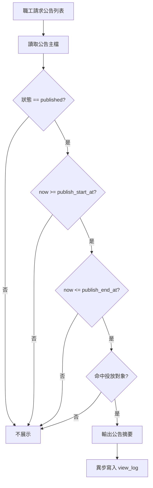
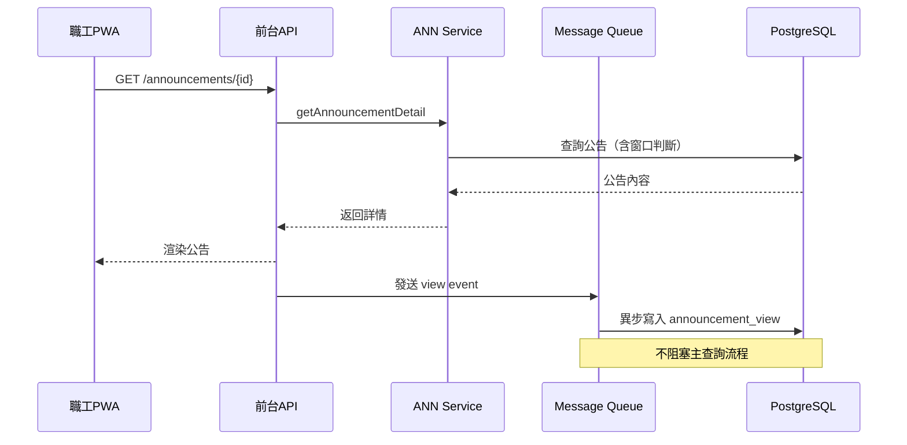
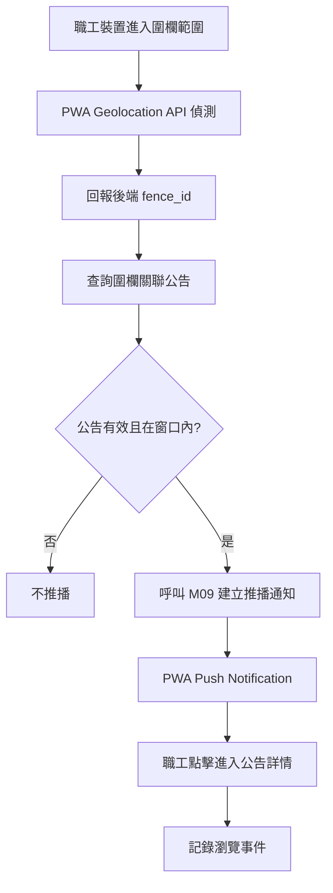
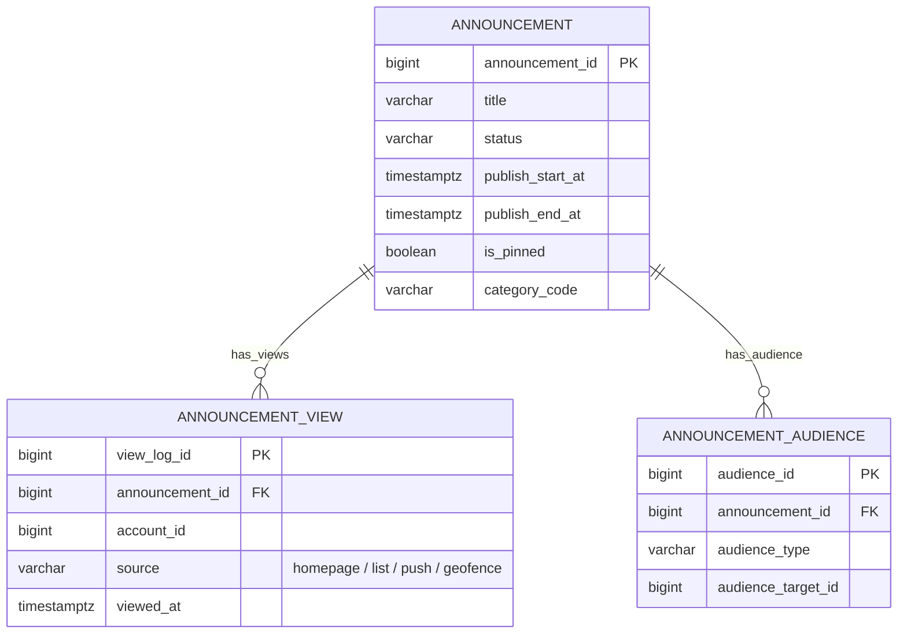
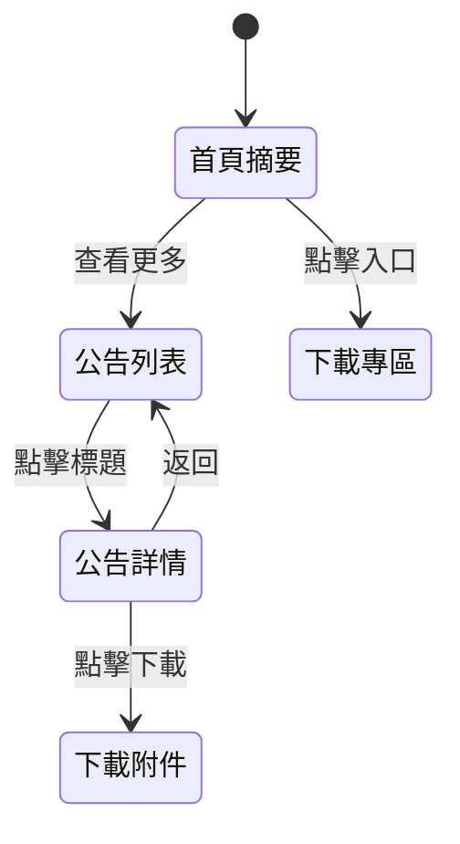

# PRD_M20_ANN_Portal_v2_20260703

> 版本記錄：v2 增強版，基於舊版 M20 子 PRD、工作說明書及資料庫優化報告重構。

---

## 1. 模塊概述

| 項目 | 內容 |
|------|------|
| 模塊名稱 | ANN－前台公告中心與瀏覽追蹤 |
| 模塊類型 | 業務支撐模塊 |
| 所屬領域 | ANN（公告與訊息） |
| 功能定位 | 承接 M19 已發布公告，轉化為職工可瀏覽、可篩選、可接收推播的前台體驗，同步記錄瀏覽行為供觸及率統計 |
| 業務價值 | 讓職工即時獲取福利公告與規章；提供管理端觸及數據以評估訊息傳達率 |
| 使用角色 | 一般職工（瀏覽公告、下載規章）、公告管理員（查看觸及統計）、系統管理員（配置參數） |

---

## 2. 數據流圖

### 2.1 前台公告展示主流程



### 2.2 瀏覽追蹤與觸及統計



### 2.3 地理圍欄推播流程



---

## 3. 數據庫設計

### 3.1 涉及數據表清單

| 表名 | 說明 | 歸屬 |
|------|------|------|
| `announcement` | 公告主檔（M19 共用，M20 唯讀） | ANN |
| `announcement_audience` | 投放範圍子表（M19 共用） | ANN |
| `announcement_view` | 瀏覽紀錄 | ANN |
| `notification` | 通知紀錄（M09 共用） | SYS |
| `file_object` | 福利規章文件 | SYS |

### 3.2 ER 圖



### 3.3 關鍵字段說明

| 字段 | 說明 |
|------|------|
| `announcement_view.source` | 瀏覽來源，用於統計分析各渠道觸及效果 |
| `announcement_view.viewed_at` | 瀏覽時間，用於去重統計時間窗口 |
| `announcement.category_code` | 五種分類標籤（一般公告/活動通知/補助業務/特約商店/系統公告） |

---

## 4. 功能需求清單

| 編號 | 名稱 | 優先級 | 說明 | 權限控制 |
|------|------|--------|------|----------|
| ANN-F20 | 首頁公告摘要區 | P0 | Portal 首頁展示置頂+最新公告 | 一般職工 |
| ANN-F21 | 公告列表頁 | P0 | 分類篩選+關鍵字搜尋+分頁 | 一般職工 |
| ANN-F22 | 公告詳情頁 | P0 | 白名單渲染+附件下載 | 一般職工 |
| ANN-F23 | 瀏覽事件記錄 | P0 | 異步寫入 view_log | 後臺自動 |
| ANN-F24 | 觸及人次統計 | P0 | 獨立使用者去重統計 | 公告管理員 |
| ANN-F25 | 地理圍欄推播 | P1 | 進入指定範圍觸發 PWA 推播 | 一般職工（接收端） |
| ANN-F26 | 福利規章下載專區 | P1 | 列表展示可下載文件 | 一般職工 |
| ANN-F27 | 瀏覽統計匯出 | P2 | 匯出報表供營運分析 | 公告管理員 |

---

## 5. 用例文檔

### 用例 1：職工瀏覽公告列表

- **前置條件**：職工已登入 PWA
- **操作步驟**：
  1. 登入後首頁自動載入公告摘要區
  2. 點擊「查看更多」進入公告列表
  3. 選擇分類標籤「補助業務」篩選
  4. 點擊公告標題進入詳情
- **預期結果**：列表僅顯示 published 且在窗口內、命中投放範圍的公告
- **異常處理**：無公告時顯示「目前沒有公告」

### 用例 2：公告過期自動下架

- **前置條件**：公告狀態為 `published`，當前時間超過 `publish_end_at`
- **操作步驟**：
  1. 職工重新載入公告列表
  2. 已過期公告不出現在列表中
- **預期結果**：前台自動隱藏過期公告
- **異常處理**：若因快取延遲展示，最長不超過 5 分鐘

### 用例 3：地理圍欄推播

- **前置條件**：職工已授權 PWA 地理位置與通知權限
- **操作步驟**：
  1. 職工進入某車站範圍（圍欄半徑 500m）
  2. PWA 偵測到進入區域，回報後端
  3. 後端驗證公告有效性，呼叫 M09 推播
  4. 職工收到通知，點擊進入公告詳情
- **預期結果**：推播通知正確顯示，點擊可直達公告
- **異常處理**：地理權限未授權時靜默降級，不影響其他功能

### 用例 4：重複瀏覽不重複計數

- **前置條件**：同一職工在 5 分鐘內兩次查看同一公告
- **操作步驟**：
  1. 職工首次進入公告詳情，寫入 view_log
  2. 返回列表後再次點擊同一公告
- **預期結果**：觸及人次仍為 1（同一人去重）
- **異常處理**：去重時間窗口由系統參數 `ann.view.dedup_window_minutes` 控制

### 用例 5：福利規章下載

- **前置條件**：後台已上傳福利規章文件並標記為有效
- **操作步驟**：
  1. 職工進入下載專區
  2. 瀏覽文件列表（名稱、日期、大小）
  3. 點擊下載按鈕
- **預期結果**：文件經 M08 受控路徑下載
- **異常處理**：文件不存在時顯示「檔案已移除」

---

## 6. 界面與交互要求

### 6.1 頁面佈局原則

- 首頁公告摘要區：置頂卡片 + 最新公告列表 + 查看更多入口
- 公告列表頁：分類標籤 Tab + 搜尋框 + 分頁列表 + 空狀態提示
- 公告詳情頁：標題/分類/日期 + 觸及人次 + 安全富文本渲染 + 附件下載
- 福利規章下載專區：文件分類篩選 + 列表（名稱/日期/大小/下載按鈕）

### 6.2 狀態轉換圖



### 6.3 交互要求

- 分類標籤支援單選或「全部」，以 Tab 或 Chip 形式呈現
- 置頂公告永遠排在列表最上方
- view log 異步寫入，不影響頁面渲染
- 觸及人次格式如「1,234 人次」，大型數字簡化顯示

---

## 7. API 接口規格

### 7.1 前台公告查詢

#### GET /api/v1/portal/announcements

查詢可見公告列表。

| 參數 | 類型 | 必填 | 說明 |
|------|------|------|------|
| category | string | 否 | 分類代碼篩選 |
| keyword | string | 否 | 標題關鍵字 |
| page | int | 否 | 頁碼 |
| page_size | int | 否 | 每頁筆數 |

**響應**：
```json
{
  "items": [
    {
      "announcement_id": 1001,
      "title": "113學年度子女教育補助公告",
      "category_code": "subsidy",
      "published_at": "2026-08-01T00:00:00Z",
      "is_pinned": true,
      "view_count": 1250
    }
  ],
  "total": 15,
  "page": 1,
  "page_size": 20
}
```

#### GET /api/v1/portal/announcements/{id}

查詢公告詳情。同時觸發異步 view_log 寫入。

**響應**：包含完整的 `title`, `content`（安全渲染）, `category_code`, `published_at`, `view_count`, `attachments[]`

### 7.2 瀏覽統計

#### GET /api/v1/admin/announcements/{id}/stats

查詢觸及統計。

| 參數 | 類型 | 必填 | 說明 |
|------|------|------|------|
| date_from | date | 是 | 起始日期 |
| date_to | date | 是 | 結束日期 |
| group_by | string | 否 | day / source |

**錯誤碼**：
| 錯誤碼 | 說明 |
|--------|------|
| ANN-020 | 公告不存在 |
| ANN-021 | 公告尚未發布 |
| ANN-022 | 無權限查看統計 |

### 7.3 福利規章下載

#### GET /api/v1/portal/welfare-documents

查詢可下載的福利規章列表。

#### GET /api/v1/portal/welfare-documents/{fileId}/download

下載指定文件（302 重定向至 M08 受控下載 URL）。

### 7.4 地理圍欄

#### POST /api/v1/portal/geofence/enter

職工裝置回報進入圍欄。

| 參數 | 類型 | 必填 | 說明 |
|------|------|------|------|
| fence_id | bigint | 是 | 圍欄 ID |
| latitude | float | 是 | 當前緯度 |
| longitude | float | 是 | 當前經度 |

---

## 8. 非功能性需求

| 類別 | 指標 | 說明 |
|------|------|------|
| 性能 | 公告列表 < 500ms | 含可見性判斷，支援分頁 |
| 性能 | 公告詳情 < 300ms | view_log 異步不阻塞 |
| 性能 | 觸及人次更新 < 5s | 異步去重計數器更新 |
| 可用性 | 地理圍欄推播冷卻 | 同一圍欄同一公告不重複推播，冷卻時間可配置 |
| 安全 | 前台僅讀 published 公告 | 絕不讀取草稿或未發布內容 |
| 安全 | 下載走 M08 受控路徑 | 不直接暴露檔案存儲位置 |

---

## 9. 隱含需求補充

### 審計日誌

- 瀏覽統計匯出操作寫入 `audit_event`
- 福利規章敏感文件下載寫入 `audit_event`
- 地理圍欄推播記錄留存在 `notification` 表

### 數據一致性

- 前台可見性判斷必須與 M19 的 `publish_start_at / publish_end_at` 嚴格一致
- view_log 去重以獨立使用者（account_id）為單位，時間窗口可配置
- 後台下架福利規章後，前台在快取失效（最長 5 分鐘）內移除

### 邊界情況

- Geolocation 未授權時圍欄推播靜默降級
- 同時大量職工進入同一圍欄時，推播請求佇列化處理
- 同一職工短時間重複瀏覽不重複計數
- 附件下載失敗時顯示友善提示，不影響公告內容展示
