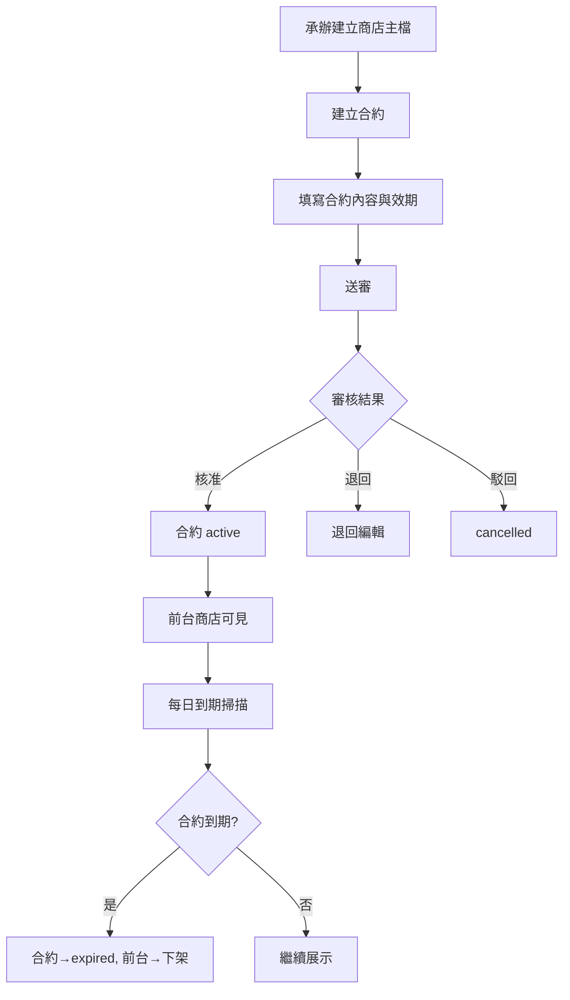
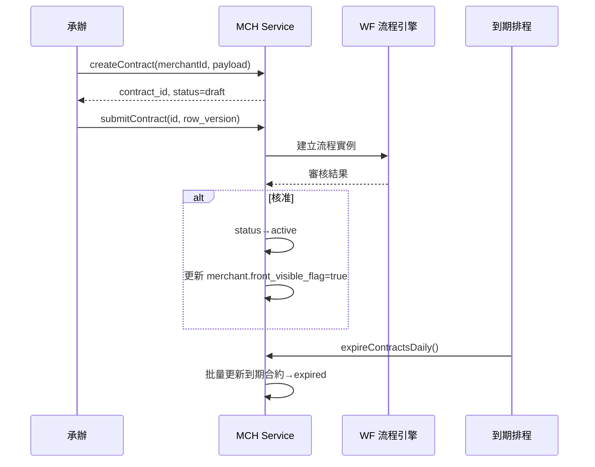
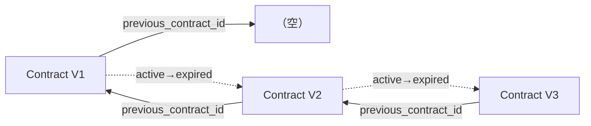
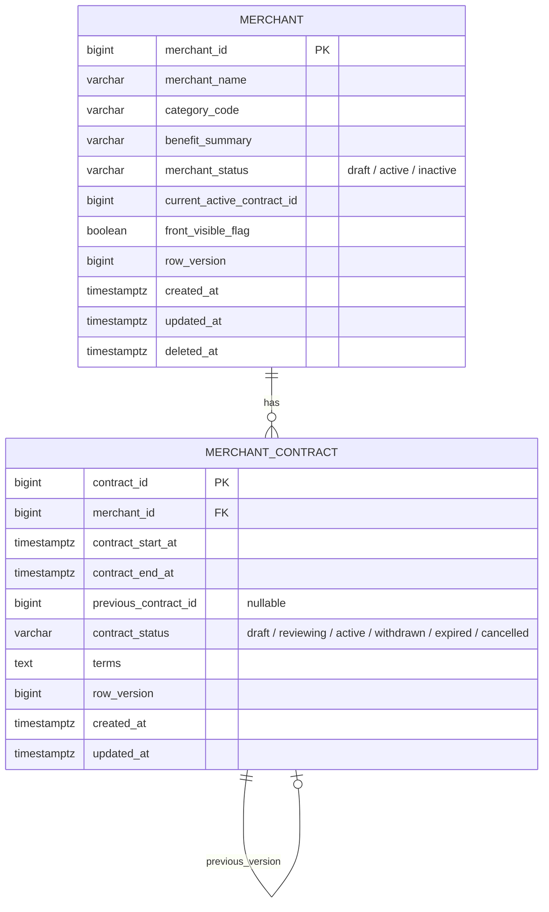
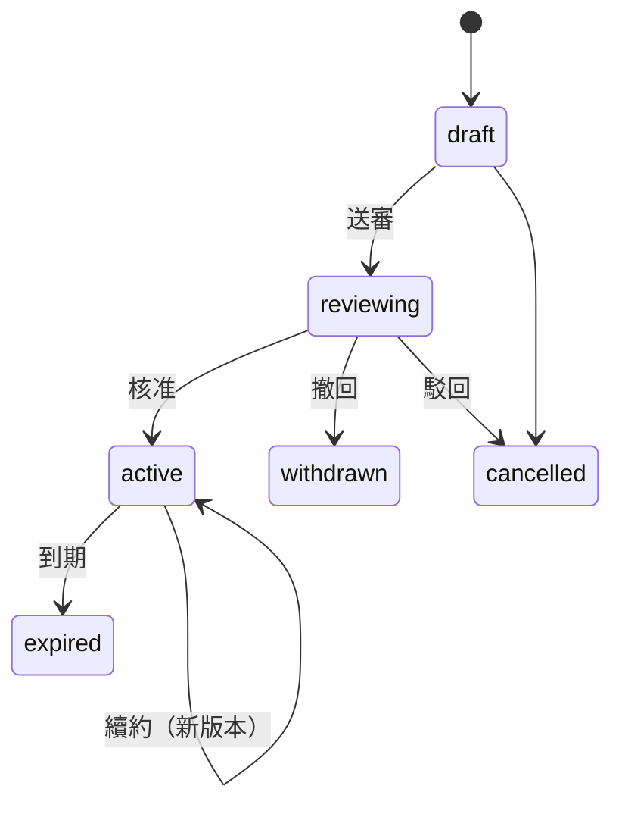

# PRD_M21_MCH_Shop_v2_20260703

> 版本記錄：v2 增強版，基於舊版 M21 子 PRD、工作說明書及資料庫優化報告重構。

---

## 1. 模塊概述

| 項目 | 內容 |
|------|------|
| 模塊名稱 | MCH－商店主檔與合約管理 |
| 模塊類型 | 後台頁面模塊 |
| 所屬領域 | MCH（特約商店） |
| 功能定位 | 特約商店的主資料中樞，將「商店基本資訊」與「合約生效邏輯」分層治理，用合約生命週期決定前台是否展示 |
| 業務價值 | 建立標準化商店建檔與合約審批流程；合約到期 30/14/7 天三階段提醒確保及時續約 |
| 使用角色 | 福利社承辦人（建立商店/合約/送審）、審核主管（核准/退回/駁回）、系統管理員（治理異常） |

---

## 2. 數據流圖

### 2.1 商店與合約主鏈

### 2.2 合約版本鏈

### 2.3 續約版本鏈

---

## 3. 數據庫設計

### 3.1 涉及數據表清單

| 表名 | 說明 | 歸屬 |
|------|------|------|
| `merchant` | 商店主檔 | MCH |
| `merchant_contract` | 合約主檔 | MCH |
| `merchant_category` | 商店分類（字典） | SYS |
| `workflow_instance` | 流程實例 | WF |
| `notification` | 到期提醒通知 | SYS |
| `audit_event` | 稽核事件 | SEC |

### 3.2 ER 圖

### 3.3 關鍵字段說明

| 字段 | 說明 |
|------|------|
| `merchant.front_visible_flag` | 前台可見標記，由合約狀態驅動更新 |
| `merchant.current_active_contract_id` | 當前有效合約 ID，加速前台查詢 |
| `contract.contract_start_at / end_at` | 合約生效/到期時間 |
| `contract.previous_contract_id` | 前一版合約 ID，串接版本鏈 |
| `contract.contract_status` | 合約生命週期狀態 |

---

## 4. 功能需求清單

| 編號 | 名稱 | 優先級 | 說明 | 權限控制 |
|------|------|--------|------|----------|
| MCH-F01 | 建立商店主檔 | P0 | 建立商店基本資料 | 福利社承辦人 |
| MCH-F02 | 編輯商店主檔 | P0 | 修改商店資訊（含 row_version） | 福利社承辦人 |
| MCH-F03 | 建立合約 | P0 | 填寫合約內容、效期 | 福利社承辦人 |
| MCH-F04 | 編輯合約草稿 | P0 | draft 狀態下可編輯 | 福利社承辦人 |
| MCH-F05 | 送審合約 | P0 | 送審後狀態→reviewing | 福利社承辦人 |
| MCH-F06 | 核准合約 | P0 | 核准後狀態→active，前台可見 | 審核主管 |
| MCH-F07 | 退回合約 | P0 | 退回編輯 | 審核主管 |
| MCH-F08 | 駁回合約 | P0 | 駁回→cancelled | 審核主管 |
| MCH-F09 | 續約合約 | P0 | 基於舊合約建立新版 | 福利社承辦人 |
| MCH-F10 | 每日到期掃描 | P0 | 排程更新到期合約 | 系統自動 |
| MCH-F11 | 到期提醒通知 | P1 | 到期前 30/14/7 天通知承辦 | 系統自動 |
| MCH-F12 | 查看到期監看 | P1 | 即將到期/已到期合約列表 | 福利社承辦人 |

---

## 5. 用例文檔

### 用例 1：建立商店並送審合約（主路徑）

- **前置條件**：承辦已登入後台，具商店建立權限
- **操作步驟**：
  1. 進入後台→特約商店→建立商店
  2. 填寫商店名稱、分類、優惠摘要
  3. 保存後進入合約建立頁
  4. 填寫合約起訖日期、條款內容
  5. 送出審
- **預期結果**：商店主檔建立完成，合約狀態→reviewing
- **異常處理**：商店名稱、分類為必填，合約結束日期須大於開始日期

### 用例 2：合約核准後前台可見

- **前置條件**：合約狀態為 reviewing，審核主管有核准權限
- **操作步驟**：
  1. 審核主管核准合約
  2. 合約狀態→active
  3. `merchant.front_visible_flag` → true
  4. 前台商店中心可看到該商店
- **預期結果**：商店在前台正確顯示
- **異常處理**：同商店不可同時存在多個 active 合約

### 用例 3：合約到期自動下架

- **前置條件**：合約狀態為 active，`contract_end_at` 小於當前時間
- **操作步驟**：
  1. 每日到期掃描排程觸發
  2. 掃描所有 active 且過期的合約
  3. 批量更新為 expired
  4. `merchant.front_visible_flag` → false
- **預期結果**：前台商店列表不再顯示該商店
- **異常處理**：掃描批次部分失敗時記錄明細

### 用例 4：合約續約形成版本鏈

- **前置條件**：商店存在 active 或 expired 合約
- **操作步驟**：
  1. 承辦進入續約頁面
  2. 系統自動帶入前一版合約摘要
  3. 承辦更新效期及條款
  4. 保存後 `previous_contract_id` 指向舊合約
- **預期結果**：新合約建立，版本鏈完整
- **異常處理**：續約時不可覆蓋舊合約，強制新建版本

### 用例 5：合約到期前 30/14/7 天提醒

- **前置條件**：合約狀態為 active，距離到期日分別為 30/14/7 天
- **操作步驟**：
  1. 每日提醒排程掃描即將到期的合約
  2. 檢查是否已發送過提醒（避免重複）
  3. 呼叫 M09 發送通知給承辦
- **預期結果**：承辦收到到期提醒通知
- **異常處理**：通知發送失敗時記錄並重試

---

## 6. 界面與交互要求

### 6.1 頁面佈局原則

- 商店列表頁：狀態統計卡 + 搜尋（名稱/分類/前台可見）+ 列表（名稱/分類/摘要/合約狀態/前台標記）
- 商店編輯頁：基本資料區 + 分類設定 + 優惠摘要 + 關聯合約區
- 合約詳情頁：合約版本鏈時間線 + 摘要卡 + 內容區 + 狀態歷程 + 操作區（送審/續約/取消）
- 到期監看頁：到期統計卡 + 即將到期列表（30/14/7）+ 已到期列表 + 排程異常列表

### 6.2 狀態轉換圖

### 6.3 交互要求

- 版本鏈用時間線視圖展示，可展開檢視各版本摘要
- 續約時自動帶出前一版資訊，但不覆蓋原資料
- 到期監看頁用三色標示：30天（黃）、14天（橙）、7天（紅）
- 到期提醒支援批量操作

---

## 7. API 接口規格

### 7.1 商店主檔

#### POST /api/v1/merchants

建立商店主檔。

| 參數 | 類型 | 必填 | 說明 |
|------|------|------|------|
| merchant_name | string | 是 | 商店名稱 |
| category_code | string | 是 | 分類代碼 |
| benefit_summary | string | 否 | 優惠摘要 |

#### PUT /api/v1/merchants/{id}

更新商店資訊。需 `row_version`。

### 7.2 合約管理

#### POST /api/v1/merchants/{merchantId}/contracts

建立合約。

| 參數 | 類型 | 必填 | 說明 |
|------|------|------|------|
| contract_start_at | timestamptz | 是 | 生效起日 |
| contract_end_at | timestamptz | 是 | 到期日 |
| terms | text | 否 | 條款內容 |
| previous_contract_id | bigint | 否 | 續約時傳入 |

#### POST /api/v1/contracts/{id}/submit

送審合約。

#### POST /api/v1/contracts/{id}/approve

核准合約。

#### POST /api/v1/contracts/{id}/renew

續約合約。返回新的 contract_id。

**錯誤碼**：
| 錯誤碼 | 說明 |
|--------|------|
| MCH-001 | 商店不存在 |
| MCH-002 | 合約不存在 |
| MCH-003 | row_version 衝突（409） |
| MCH-004 | 合約狀態不可操作 |
| MCH-005 | 同商店已存在 active 合約 |

### 7.3 到期掃描

#### POST /api/v1/admin/contracts/expire-daily

手動觸發每日到期掃描（管理用）。

#### GET /api/v1/admin/contracts/expiring

查詢即將到期合約。

| 參數 | 類型 | 必填 | 說明 |
|------|------|------|------|
| days_before | int | 是 | 距離到期天數 |

---

## 8. 非功能性需求

| 類別 | 指標 | 說明 |
|------|------|------|
| 性能 | 商店列表查詢 < 500ms | 含前台可見標記 |
| 性能 | 到期掃描 < 5min | 全量 active 合約掃描 |
| 安全 | 僅 active 合約前台可見 | 其他狀態一律阻斷 |
| 安全 | 敏感操作稽核 | 建立/編輯/送審/核准/退回/駁回/續約均入 audit |
| 可用性 | 到期掃描準確度 | 每日排程，延遲 < 1h |
| 可用性 | 三階段提醒準確度 | 30/14/7 天到期日當天觸發 |

---

## 9. 隱含需求補充

### 審計日誌

以下操作必須寫入 `audit_event`：
- 商店主檔建立/編輯
- 合約建立/編輯/送審/核准/退回/駁回/續約
- 到期掃描執行
- 手動修改合約狀態

### 數據一致性

- 不允許同一商店同時存在多個 active 合約
- `merchant.front_visible_flag` 必須與合約狀態一致
- 到期掃描後，前台可見性更新必須在相同批次完成

### 並發控制

- `merchant` 與 `merchant_contract` 均使用 `row_version` 樂觀鎖
- 已送審合約被他人更新時返回 409

### 冪等性保障

- 送審 API 支援 `Idempotency-Key` header
- 到期掃描支援批次冪等

### 邊界情況

- 商店有主檔但無有效合約：允許存在但前台不可見
- 已到期合約不得重新 active，必須建立續約
- 續約一定新建版本，不覆蓋舊合約
- 合約開始日期不可早於前一版的結束日期
