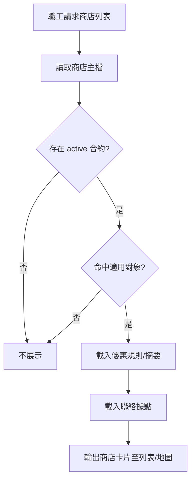
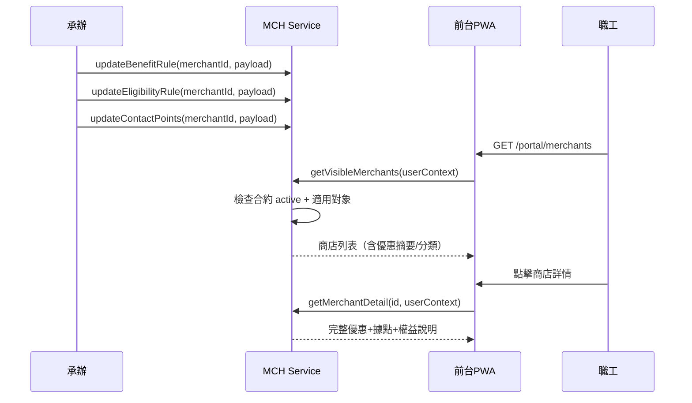
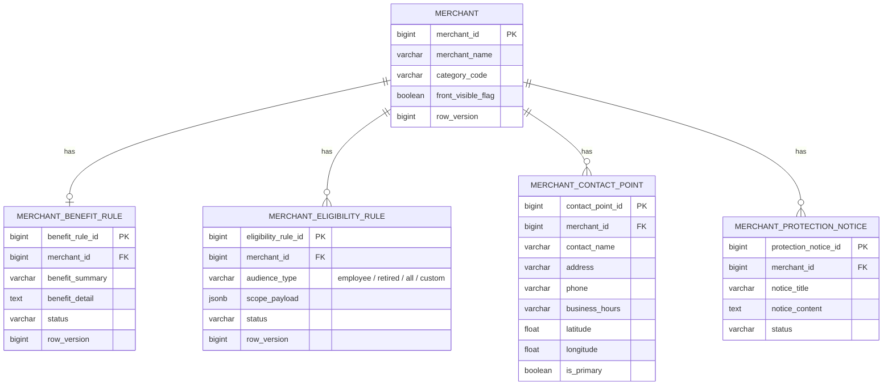

# PRD_M22_MCH_Offer_v2_20260703

> 版本記錄：v2 增強版，基於舊版 M22 子 PRD、工作說明書及資料庫優化報告重構。

---

## 1. 模塊概述

| 項目 | 內容 |
|------|------|
| 模塊名稱 | MCH－優惠規則、適用對象、聯絡據點與前台商店中心 |
| 模塊類型 | 業務支撐模塊 |
| 所屬領域 | MCH（特約商店） |
| 功能定位 | 承接 M21 有效商店與合約，配置優惠內容、適用對象、據點與權益說明，並提供前台商店列表+地圖展示 |
| 業務價值 | 讓職工以列表和地圖雙模式查詢適用優惠商店；前台保護機制防止資料被大量擷取 |
| 使用角色 | 福利社承辦人（配置優惠/對象/據點）、一般職工（瀏覽商店）、系統管理員 |

---

## 2. 數據流圖

### 2.1 前台商店展示流程



### 2.2 商店內容配置與前台展示



---

## 3. 數據庫設計

### 3.1 涉及數據表清單

| 表名 | 說明 | 歸屬 |
|------|------|------|
| `merchant` | 商店主檔（M21 共用） | MCH |
| `merchant_contract` | 合約主檔（M21 共用） | MCH |
| `merchant_benefit_rule` | 優惠規則 | MCH |
| `merchant_eligibility_rule` | 適用對象規則 | MCH |
| `merchant_contact_point` | 聯絡據點 | MCH |
| `merchant_protection_notice` | 權益保障說明 | MCH |
| `merchant_category` | 商店分類 | SYS |

### 3.2 ER 圖



### 3.3 關鍵字段說明

| 字段 | 說明 |
|------|------|
| `benefit_summary` | 前台列表顯示的短版優惠摘要 |
| `benefit_detail` | 前台詳情頁完整優惠說明 |
| `eligibility_rule.audience_type` | 適用類型，決定適用對象篩選邏輯 |
| `eligibility_rule.scope_payload` | JSON 結構化條件，如角色/組織/群組 |
| `contact_point.latitude/longitude` | 地圖模式定位 |

---

## 4. 功能需求清單

| 編號 | 名稱 | 優先級 | 說明 | 權限控制 |
|------|------|--------|------|----------|
| MCH-F20 | 優惠規則配置 | P0 | 設定優惠摘要與詳情 | 福利社承辦人 |
| MCH-F21 | 適用對象配置 | P0 | 設定哪些人可使用優惠 | 福利社承辦人 |
| MCH-F22 | 聯絡據點配置 | P0 | 維護門市地址、電話、營業時間 | 福利社承辦人 |
| MCH-F23 | 權益保障配置 | P1 | 使用限制與注意事項 | 福利社承辦人 |
| MCH-F24 | 前台商店列表 | P0 | 依分類篩選+關鍵字搜尋 | 一般職工 |
| MCH-F25 | 前台商店詳情 | P0 | 完整優惠+據點+權益展示 | 一般職工 |
| MCH-F26 | 地圖模式查詢 | P0 | 地圖顯示商店位置 + popup 摘要 | 一般職工 |
| MCH-F27 | 前台保護機制 | P1 | 登入限制、防爬蟲、禁止複製 | 系統強制 |
| MCH-F28 | 瀏覽統計預留 | P2 | 商店點擊/詳情查看統計 | 福利社承辦人 |

---

## 5. 用例文檔

### 用例 1：職工以分類瀏覽商店

- **前置條件**：職工已登入 PWA
- **操作步驟**：
  1. 進入前台→特約商店
  2. 選擇分類「餐飲」篩選
  3. 瀏覽商店卡片列表（名稱 + 分類 + 優惠摘要）
  4. 點擊進入商店詳情
- **預期結果**：僅顯示 active 合約且命中適用對象的商店
- **異常處理**：無符合商店時顯示「目前沒有適用商店優惠」

### 用例 2：職工以地圖查詢鄰近商店

- **前置條件**：職工已登入，裝置支援地圖顯示
- **操作步驟**：
  1. 切換至地圖模式
  2. 地圖顯示所有可見商店位置標記
  3. 點擊標記彈出 popup（商店名 + 優惠摘要）
  4. 點擊 popup「查看詳情」進入詳情頁
- **預期結果**：地圖正確定位，popup 資訊正確
- **異常處理**：地圖 API 載入失敗時降級為列表模式

### 用例 3：承辦配置適用對象規則

- **前置條件**：商店已有 active 合約
- **操作步驟**：
  1. 進入商店詳情→適用對象
  2. 選擇「特定組織適用」
  3. 勾選指定分處/單位
  4. 保存
- **預期結果**：只有所選組織的職工在前台可看到該商店
- **異常處理**：未設定任何對象時，提示「至少設定一個適用對象」

### 用例 4：前台保護機制生效

- **前置條件**：未登入使用者嘗試訪問商店列表 API
- **操作步驟**：
  1. 未登入瀏覽器直接請求 `/api/v1/portal/merchants`
- **預期結果**：返回 401 Unauthorized
- **異常處理**：登入 session 過期時重定向至登入頁

### 用例 5：合約到期商店自動下架（M21→M22 聯動）

- **前置條件**：M21 每日到期掃描已將合約更新為 expired
- **操作步驟**：
  1. M21 更新 `merchant.front_visible_flag` = false
  2. 職工重新載入商店列表
- **預期結果**：商店不再出現在列表與地圖
- **異常處理**：若快取延遲，最長不超過 5 分鐘

---

## 6. 界面與互動要求

### 6.1 頁面佈局原則

- 後台配置頁：商店摘要頭（M21 共用）+ 分頁籤（優惠規則/適用對象/聯絡據點/權益保障）
- 前台列表頁：搜尋列 + 分類標籤篩選 + 列表/地圖切換 + 商店卡片（名稱/分類/摘要）
- 前台詳情頁：商店名稱與分類 + 優惠詳情區 + 適用對象說明 + 聯絡據點列表（含地圖）+ 權益保障
- 地圖模式：全屏地圖 + 標記 + popup 摘要 + 詳情入口

### 6.2 交互要求

- 列表與地圖支援無縫切換
- 商店卡片重點展示：商店名、分類、優惠摘要
- 詳情頁再展開：適用對象、據點、權益說明
- 前台文案避免技術術語
- 列表支援下拉載入更多（infinite scroll）或分頁

---

## 7. API 接口規格

### 7.1 前台商店查詢

#### GET /api/v1/portal/merchants

查詢可見商店列表。

| 參數 | 類型 | 必填 | 說明 |
|------|------|------|------|
| category | string | 否 | 分類篩選 |
| keyword | string | 否 | 名稱關鍵字 |
| mode | string | 否 | list / map |
| latitude | float | 否 | 地圖模式：中心緯度 |
| longitude | float | 否 | 地圖模式：中心經度 |
| radius_km | float | 否 | 地圖模式：查詢半徑 |
| page | int | 否 | 頁碼 |
| page_size | int | 否 | 每頁筆數 |

**響應**：
```json
{
  "items": [{
    "merchant_id": 1,
    "merchant_name": "台鐵便當本舖",
    "category_code": "dining",
    "benefit_summary": "持識別證享 9 折優惠",
    "primary_contact": {
      "address": "臺北車站 1F",
      "latitude": 25.0478,
      "longitude": 121.5170
    }
  }]
}
```

#### GET /api/v1/portal/merchants/{id}

商店詳情（含完整優惠、適用對象、據點、權益保障）。

### 7.2 後台配置

#### PUT /api/v1/merchants/{id}/benefit-rule

更新優惠規則。

| 參數 | 類型 | 必填 | 說明 |
|------|------|------|------|
| row_version | bigint | 是 | 樂觀鎖 |
| benefit_summary | string | 是 | 優惠摘要 |
| benefit_detail | text | 否 | 優惠詳情 |

#### PUT /api/v1/merchants/{id}/eligibility-rules

更新適用對象。`scope_payload` 為 JSON 結構化條件。

#### PUT /api/v1/merchants/{id}/contact-points

更新聯絡據點列表（全量取代）。

#### PUT /api/v1/merchants/{id}/protection-notices

更新權益保障說明（全量取代）。

**錯誤碼**：
| 錯誤碼 | 說明 |
|--------|------|
| MCH-020 | 商店不存在或無有效合約 |
| MCH-021 | row_version 衝突 |
| MCH-022 | 適用對象規則不可為空 |
| MCH-023 | 優惠摘要為必填 |

---

## 8. 非功能性需求

| 類別 | 指標 | 說明 |
|------|------|------|
| 性能 | 商店列表 < 500ms | 含適用對象判斷 |
| 性能 | 地圖模式查詢 < 1s | 含地理範圍過濾 |
| 安全 | 前台必須登入 | 未登入回傳 401 |
| 安全 | 禁用直接複製 | CSS user-select: none + JS 防護 |
| 安全 | 防爬蟲 | API 速率限制 + CAPTCHA |
| 可用性 | 地圖 API 降級 | 地圖載入失敗時自動切換列表 |

---

## 9. 隱含需求補充

### 審計日誌

以下操作寫入 `audit_event`：
- 優惠規則/適用對象/據點/權益保障的配置變更
- 前台商店清單匯出
- 敏感附件下載

### 冪等性保障（Idempotency-Key）

- PUT benefit-rule、eligibility-rules、contact-points 等配置變更 API 支援 `Idempotency-Key` header（UUID v4）
- 相同 `Idempotency-Key` 在 24 小時內返回相同結果
- 前台商品查詢為天然冪等

### 數據一致性

- 前台商店列表只顯示 `merchant.front_visible_flag = true` 的商店
- 適用對象判斷結果與前台展示一致，不可出現後台配置不適用但前台可見的情況
- 合約到期後前台同步下架

### 並發控制

- 優惠規則、適用對象、據點配置均使用 `row_version` 樂觀鎖

### 邊界情況

- 商店有主檔但無優惠摘要：前台可顯示但價值較低，後台提示補全
- 多個據點資訊缺失：前台顯示「請洽商店確認」
- 適用對象為空時視為不適用，前台不展示
