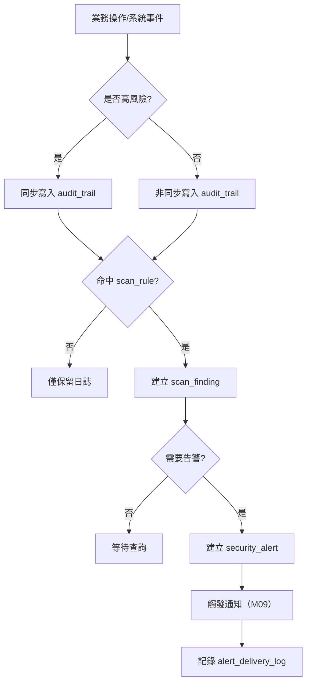
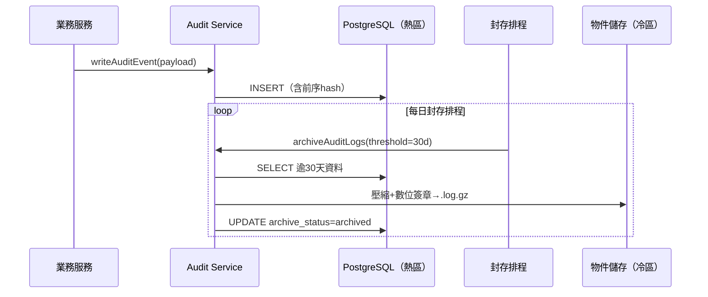
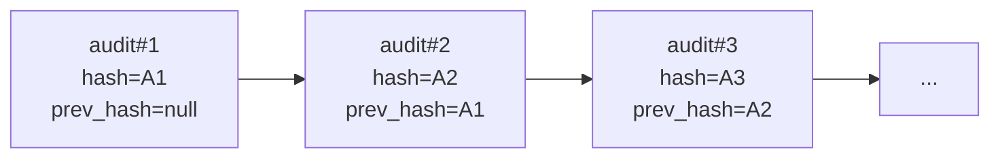
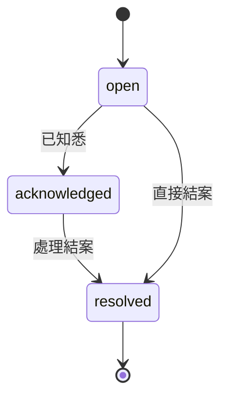

# PRD_M23_SEC_Audit_v2_20260703

> 版本記錄：v2 增強版，基於舊版 M23 子 PRD、工作說明書及資料庫優化報告重構。

---

## 1. 模塊概述

| 項目 | 內容 |
|------|------|
| 模塊名稱 | SEC－稽核日誌、告警與掃描規則 |
| 模塊類型 | 底層能力模塊 |
| 所屬領域 | SEC（安全稽核） |
| 功能定位 | 全平台安全治理底座，將跨模塊的高風險操作、異常事件收斂為可查、可掃、可告警、可封存的安全事件體系 |
| 業務價值 | 滿足資安 C 級合規要求；所有高風險操作可稽核、封存與追溯；30 天熱查 + 至少 3 年封存保存 |
| 使用角色 | 資安稽核人員、系統管理員 |

### 1.1 核心設計原則

- **追加寫入**：稽核事件只追加，不修改，不刪除
- **哈希鏈防篡改**：每條 audit 記錄前一條 hash，形成證據鏈
- **敏感值遮罩**：日誌中的身分證號、帳號等敏感欄位僅記錄遮罩值
- **熱冷分區**：近期資料（熱）高效查詢，歷史資料（冷）壓縮封存
- **3 年保存**：原始需求明確至少 3 年封存保存

---

## 2. 數據流圖

### 2.1 安全事件主流程



### 2.2 熱冷分層與封存



### 2.3 哈希鏈防篡改示意



---

## 3. 數據庫設計

### 3.1 涉及數據表清單

| 表名 | 說明 | 歸屬 |
|------|------|------|
| `audit_event` | 稽核事件主表 | SEC |
| `security_rule` | 掃描規則定義 | SEC |
| `scan_run` | 掃描執行紀錄 | SEC |
| `security_alert` | 安全告警 | SEC |
| `alert_delivery_log` | 告警送達紀錄 | SEC |
| `audit_archive` | 封存批次記錄 | SEC |
| `report_export` | 報告輸出紀錄 | SEC |

### 3.2 ER 圖

```mermaid
erDiagram
    AUDIT_EVENT ||--o{ SECURITY_ALERT : may_raise
    SECURITY_RULE ||--o{ SCAN_RUN : executed_as
    SCAN_RUN ||--o{ SECURITY_ALERT : produces
    SECURITY_ALERT ||--o{ ALERT_DELIVERY_LOG : has_delivery

    AUDIT_EVENT {
        bigint audit_id PK
        varchar correlation_id UUID
        varchar actor_employee_id
        varchar action_code
        varchar target_type
        bigint target_id
        varchar severity_level "low / medium / high / critical"
        varchar rule_category "auth / data_integrity / permission / operation_anomaly"
        varchar event_result "success / failed / blocked"
        text payload
        text previous_hash
        text event_hash
        jsonb role_snapshot
        jsonb masked_fields
        varchar archive_status "hot / archived"
        timestamptz created_at
    }

    SECURITY_RULE {
        bigint scan_rule_id PK
        varchar rule_name
        varchar rule_category
        varchar severity_level
        boolean is_enabled
        text rule_expression
        bigint row_version
    }

    SECURITY_ALERT {
        bigint alert_id PK
        bigint audit_id FK
        varchar alert_title
        varchar alert_status "open / acknowledged / resolved"
        varchar severity_level
        varchar assigned_to
        timestamptz acknowledged_at
        timestamptz resolved_at
        text resolution_note
    }
```

### 3.3 關鍵字段說明

| 字段 | 說明 |
|------|------|
| `previous_hash` | 前一筆 audit 的 event_hash，形成鏈 |
| `event_hash` | 本筆事件的 SHA-256 哈希 |
| `masked_fields` | JSON 記錄哪些敏感欄位已被遮罩 |
| `rule_category` | 四大分類：auth/data_integrity/permission/operation_anomaly |
| `archive_status` | 熱/冷分層標記 |

---

## 4. 功能需求清單

| 編號 | 名稱 | 優先級 | 說明 | 權限控制 |
|------|------|--------|------|----------|
| SEC-F01 | 稽核事件寫入 | P0 | 同步/非同步寫入 audit_event | 系統服務 |
| SEC-F02 | 哈希鏈防篡改 | P0 | 每筆記錄前序 hash | 系統強制 |
| SEC-F03 | 敏感值遮罩 | P0 | 日誌中敏感欄位自動遮罩 | 系統強制 |
| SEC-F04 | 掃描規則管理 | P0 | 四大規則分類 CRUD | 資安稽核人員 |
| SEC-F05 | 掃描執行 | P0 | 排程/手動執行規則掃描 | 資安稽核人員 |
| SEC-F06 | 安全告警建立 | P0 | 命中規則升為告警 | 系統自動 |
| SEC-F07 | 告警送達紀錄 | P1 | 記錄告警通知送達結果 | 系統自動 |
| SEC-F08 | 熱冷封存 | P0 | 逾 30 天資料轉冷封存 | 系統排程 |
| SEC-F09 | 稽核報告輸出 | P1 | 期間稽核/告警報告 | 資安稽核人員 |
| SEC-F10 | 封存查詢 | P1 | 封存資料索引查詢 | 資安稽核人員 |

---

## 5. 用例文檔

### 用例 1：高風險操作同步寫入稽核

- **前置條件**：登入異常事件發生（如連續 5 次失敗登入）
- **操作步驟**：
  1. AUTH 模組呼叫 `writeAuditEvent`
  2. 事件同步寫入 audit_event 表
  3. 計算 event_hash = SHA256(previous_hash + payload + timestamp)
- **預期結果**：稽核事件即時可查
- **異常處理**：同步寫入失敗時阻斷操作或降級（由業務模組決定）

### 用例 2：掃描規則命中建立告警

- **前置條件**：`auth.failed_login_threshold` 規則已啟用
- **操作步驟**：
  1. 掃描排程執行，掃描近期 audit_event
  2. 統計同一帳號短期內失敗次數
  3. 超過閾值時建立 scan_finding
  4. 升級為 security_alert（severity=high）
- **預期結果**：告警建立，通知送達資安人員
- **異常處理**：告警建立失敗時記錄錯誤

### 用例 3：稽核事件哈希鏈驗證

- **前置條件**：audit_event 表已有連續紀錄
- **操作步驟**：
  1. 選取第 N 筆與第 N+1 筆事件
  2. 計算第 N 筆的 event_hash
  3. 比對第 N+1 筆的 previous_hash
- **預期結果**：哈希值匹配，證據鏈完整
- **異常處理**：哈希不匹配時觸發 data_integrity 告警

### 用例 4：熱資料封存

- **前置條件**：audit_event 超過 30 天且 archive_status=hot
- **操作步驟**：
  1. 每日封存排程觸發
  2. 讀取逾 30 天且未封存的資料
  3. 壓縮為 .log.gz 並加數位簽章
  4. 存入冷存儲，更新 archive_status=archived
- **預期結果**：封存批次完成，熱區空間釋放
- **異常處理**：封存失敗時記錄錯誤並重試（最多 3 次）

### 用例 5：敏感資料查詢的稽核遮罩

- **前置條件**：承辦查詢職工身分證號
- **操作步驟**：
  1. 查詢操作觸發 audit_event 寫入
  2. payload 中身分證號自動遮罩（如 A12*****789）
  3. masked_fields 記錄遮罩欄位
- **預期結果**：稽核日誌中敏感欄位已遮罩
- **異常處理**：遮罩規則未生效時告警

---

## 6. 界面與交互要求

### 6.1 頁面佈局原則

- 稽核日誌頁：多條件查詢（時間/操作人/目標類型/嚴重等級）+ 事件列表 + 詳情抽屜 + hash 鏈驗證入口
- 掃描規則頁：四大分類導航 + 規則列表 + 啟停開關 + 命中統計
- 安全告警頁：告警統計卡 + 告警列表（含嚴重度/狀態/處理人）+ 詳情與處置區
- 封存與報告頁：封存批次列表 + 封存查詢 + 報告輸出區

### 6.2 告警生命週期



### 6.3 交互要求

- 稽核查詢支援高維度條件組合
- 告警詳情頁同時展示：告警本體 + 來源 audit + 送達狀態 + 處置記錄
- 封存查詢與熱資料查詢在 UI 上明確區隔
- 長期 unresolved 告警以醒目色標示

---

## 7. API 接口規格

### 7.1 稽核事件寫入

#### POST /api/v1/audit/events

寫入稽核事件。

| 參數 | 類型 | 必填 | 說明 |
|------|------|------|------|
| correlation_id | uuid | 是 | 關聯 ID |
| actor_employee_id | string | 是 | 操作人 |
| action_code | string | 是 | 操作代碼 |
| target_type | string | 是 | 目標類型 |
| target_id | bigint | 是 | 目標 ID |
| severity_level | string | 是 | 嚴重等級 |
| rule_category | string | 否 | 規則分類 |
| event_result | string | 是 | 操作結果 |
| payload | jsonb | 否 | 事件內容 |
| role_snapshot | jsonb | 否 | 角色快照 |

**同步模式**：`X-Sync-Audit: true` header 控制同步/非同步。

### 7.2 稽核查詢

#### GET /api/v1/audit/events

查詢稽核事件列表。

| 參數 | 類型 | 必填 | 說明 |
|------|------|------|------|
| actor_employee_id | string | 否 | 操作人篩選 |
| action_code | string | 否 | 操作代碼 |
| target_type | string | 否 | 目標類型 |
| severity_level | string | 否 | 最低嚴重等級 |
| time_from | timestamptz | 是 | 起始時間 |
| time_to | timestamptz | 是 | 結束時間 |
| archive_status | string | 否 | hot / archived |
| page | int | 否 | 頁碼 |
| page_size | int | 否 | 每頁筆數 |

#### GET /api/v1/audit/events/{id}/verify

驗證指定 audit 的哈希鏈完整性。

### 7.3 掃描規則與告警

#### GET /api/v1/security/rules

查詢掃描規則列表。

#### POST /api/v1/security/rules/{id}/toggle

啟停規則。

#### GET /api/v1/security/alerts

查詢告警列表。

#### POST /api/v1/security/alerts/{id}/acknowledge

已知悉告警。

| 參數 | 類型 | 必填 | 說明 |
|------|------|------|------|
| comment | string | 否 | 備註 |

#### POST /api/v1/security/alerts/{id}/resolve

結案告警。

| 參數 | 類型 | 必填 | 說明 |
|------|------|------|------|
| resolution_note | string | 是 | 處理說明 |

### 7.4 封存

#### POST /api/v1/admin/audit/archive

手動觸發封存（排程用）。

#### GET /api/v1/admin/audit/archives

查詢封存批次列表。

**錯誤碼**：
| 錯誤碼 | 說明 |
|--------|------|
| SEC-001 | 稽核事件寫入失敗 |
| SEC-002 | 掃描規則不存在 |
| SEC-003 | 告警狀態轉換不合法 |
| SEC-004 | 封存批次進行中 |
| SEC-005 | hash 驗證不匹配 |

---

## 8. 非功能性需求

| 類別 | 指標 | 說明 |
|------|------|------|
| 性能 | 同步寫入 < 200ms | 含 hash 計算 |
| 性能 | 非同步寫入 < 50ms | 寫入佇列即返回 |
| 性能 | 熱資料查詢 < 3s | 30 天內資料 |
| 存儲 | 熱區保留 30 天 | 可配置 |
| 存儲 | 冷區封存 ≥ 3 年 | 壓縮+數位簽章 |
| 安全 | hash 鏈防篡改 | 每筆記錄前序 hash |
| 安全 | 敏感值遮罩 | 身分證/帳號等自動遮罩 |

---

## 9. 隱含需求補充

### 審計日誌

- audit_event 本身的變更（如封存狀態更新）須寫入操作紀錄
- 掃描規則啟停/修改須寫入 audit_event
- 報告匯出操作寫入 audit_event

### 數據一致性

- event_hash = SHA256(previous_hash + payload + created_at + actor)
- 封存批次完成後熱區資料不可刪除，只標記 archived
- 封存包包含批次摘要、數位簽章、保留期限

### 冪等性保障

- 稽核事件寫入使用 correlation_id 去重
- 掃描執行使用 scan_run_id 防重複

### 邊界情況

- 高風險操作同步寫入失敗時：由業務模組決定是否阻斷或降級
- 告警送達失敗時保留失敗紀錄，不影響告警狀態
- 封存失敗時保留原始資料在熱區並告警
- 查詢封存資料時透過索引或報告摘要而非全量載入
