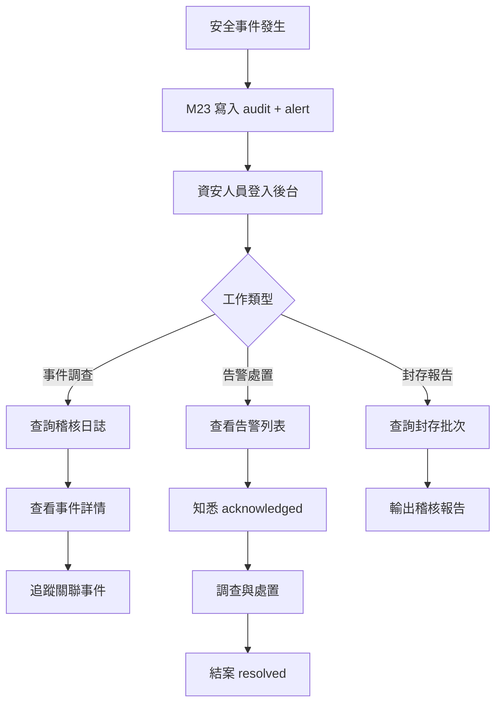
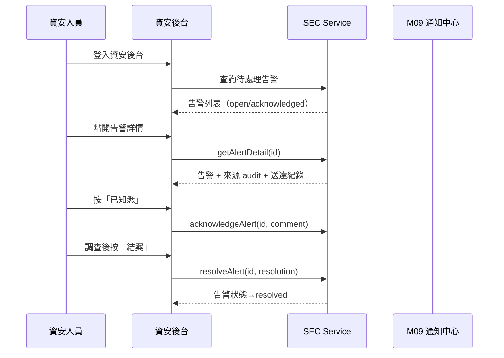
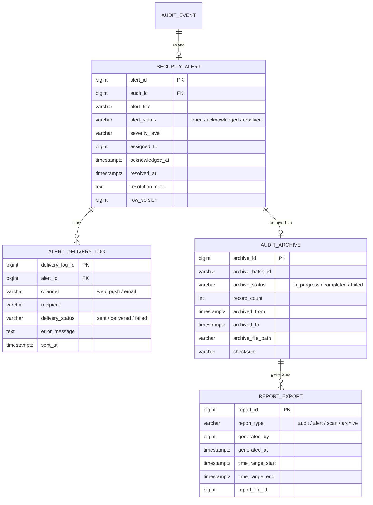
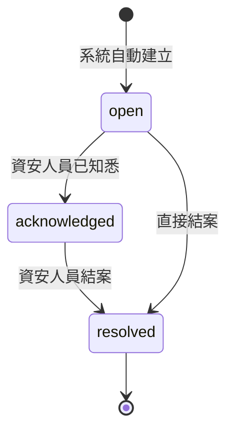

# PRD_M24_SEC_Security_v2_20260703

> 版本記錄：v2 增強版，基於舊版 M24 子 PRD、工作說明書及資料庫優化報告重構。

---

## 1. 模塊概述

| 項目 | 內容 |
|------|------|
| 模塊名稱 | SEC－資安後台、告警處置與封存報告 |
| 模塊類型 | 後台頁面模塊 |
| 所屬領域 | SEC（安全稽核） |
| 功能定位 | M23 安全能力的操作工作台，提供資安人員查詢稽核日誌、處置告警、管理掃描規則、查詢封存與輸出報告 |
| 業務價值 | 將安全事件從記錄轉為可處置的工作流程；滿足資安合規的查詢、封存與報告需求 |
| 使用角色 | 資安稽核人員（主要使用者）、系統管理員 |

---

## 2. 數據流圖

### 2.1 資安後台操作主流程

### 2.2 告警處置序列

---

## 3. 數據庫設計

### 3.1 涉及數據表清單

| 表名 | 說明 | 歸屬 |
|------|------|------|
| `audit_event` | 稽核事件（M23 共用，M24 讀取） | SEC |
| `security_rule` | 掃描規則（M23 共用） | SEC |
| `scan_run` | 掃描執行紀錄（M23 共用） | SEC |
| `security_alert` | 安全告警（M23 共用） | SEC |
| `alert_delivery_log` | 告警送達紀錄（M23 共用） | SEC |
| `audit_archive` | 封存批次 | SEC |
| `report_export` | 報告輸出紀錄 | SEC |

### 3.2 ER 圖

---

## 4. 功能需求清單

| 編號 | 名稱 | 優先級 | 說明 | 權限控制 |
|------|------|--------|------|----------|
| SEC-F20 | 稽核日誌查詢 | P0 | 多條件查詢 audit_event | 資安稽核人員 |
| SEC-F21 | 事件詳情查看 | P0 | 含來源 audit + 關聯告警 | 資安稽核人員 |
| SEC-F22 | 告警列表 | P0 | 依狀態/嚴重度篩選 | 資安稽核人員 |
| SEC-F23 | 已知悉告警 | P0 | 標記告警為 acknowledged | 資安稽核人員 |
| SEC-F24 | 結案告警 | P0 | 填寫處理結果後 resolved | 資安稽核人員 |
| SEC-F25 | 告警送達查看 | P1 | 查看告警通知送達紀錄 | 資安稽核人員 |
| SEC-F26 | 掃描規則管理 | P1 | 規則列表/啟停/編輯 | 資安稽核人員 |
| SEC-F27 | 掃描執行查看 | P1 | 查看掃描執行紀錄 | 資安稽核人員 |
| SEC-F28 | 封存批次查詢 | P1 | 查看封存歷史與摘要 | 資安稽核人員 |
| SEC-F29 | 報告匯出 | P1 | 稽核/告警/掃描報告輸出 | 資安稽核人員 |

---

## 5. 用例文檔

### 用例 1：資安人員追查異常登入事件

- **前置條件**：系統偵測到異常登入，已寫入 audit 並建立 alert
- **操作步驟**：
  1. 資安人員登入資安後台
  2. 進入安全告警頁，篩選「open + high severity」
  3. 點開告警，查看來源 audit 詳情（操作人、IP、時間）
  4. 查看告警送達紀錄
  5. 按「已知悉」填寫備註
- **預期結果**：告警狀態→acknowledged
- **異常處理**：告警詳情中關聯 audit 不存在時顯示提示

### 用例 2：結案告警並填寫處理結果

- **前置條件**：告警狀態為 acknowledged，已完成調查
- **操作步驟**：
  1. 點開告警詳情
  2. 填寫處理結果說明（必填）
  3. 按「結案」
- **預期結果**：告警狀態→resolved，處理結果存入 resolution_note
- **異常處理**：處理結果為空白時阻斷結案

### 用例 3：匯出稽核報告

- **前置條件**：稽核人員有報告匯出權限
- **操作步驟**：
  1. 進入封存與報告頁
  2. 選擇報告類型「稽核報告」
  3. 設定時間區間
  4. 點擊「產製報告」
  5. 系統非同步產製，完成後可下載
- **預期結果**：報告檔案產製完成，匯出紀錄寫入 report_export
- **異常處理**：產製時間過長時顯示「產製中，完成後將通知您」

### 用例 4：封存資料查詢

- **前置條件**：存在已封存的 audit 資料
- **操作步驟**：
  1. 進入封存與報告頁
  2. 封存批次列表中選擇批次
  3. 點擊「查詢封存摘要」
- **預期結果**：顯示封存批次時間範圍、筆數、壓縮檔案路徑
- **異常處理**：封存檔案損毀時提示並觸發告警

### 用例 5：管理掃描規則

- **前置條件**：資安人員有規則管理權限
- **操作步驟**：
  1. 進入掃描規則頁
  2. 依分類導航選擇「auth」
  3. 啟用「異常登入偵測」規則
  4. 設定閾值：5 次失敗/10 分鐘
- **預期結果**：規則啟用，下次掃描將套用新閾值
- **異常處理**：規則啟用失敗時保留原狀態並提示

---

## 6. 界面與交互要求

### 6.1 頁面佈局原則

- 資訊架構分四大入口：稽核日誌 / 安全告警 / 掃描規則 / 封存與報告
- 稽核日誌頁：查詢條件列（時間/操作人/目標/嚴重度）+ 事件列表（含 hash 驗證按鈕）+ 詳情抽屜
- 安全告警頁：統計卡（open/acknowledged/resolved 數量）+ 告警列表（嚴重度色標）+ 詳情與處置區
- 掃描規則頁：四大分類導航 + 規則列表（啟停開關、命中統計）+ 最近掃描結果摘要
- 封存與報告頁：封存政策摘要 + 批次列表 + 報告產製與下載區

### 6.2 告警處置流程狀態轉換

### 6.3 交互要求

- 告警詳情頁同時展示：告警資訊 + 來源 audit + 送達紀錄 + 處置記錄
- 稽核查詢結果支援排序與匯出
- 長期未處理告警（>72h）以紅色標記
- 報告產製完成後透過 M09 通知資安人員

---

## 7. API 接口規格

### 7.1 稽核日誌查詢

#### GET /api/v1/admin/audit/events

查詢稽核事件。

| 參數 | 類型 | 必填 | 說明 |
|------|------|------|------|
| actor_employee_id | string | 否 | 操作人 |
| action_code | string | 否 | 操作代碼 |
| target_type | string | 否 | 目標類型 |
| severity_level | string | 否 | 最低嚴重等級 |
| time_from | timestamptz | 是 | 起始時間 |
| time_to | timestamptz | 是 | 結束時間 |
| archive_status | string | 否 | hot / archived |
| page | int | 否 | 預設 1 |
| page_size | int | 否 | 預設 20 |

#### GET /api/v1/admin/audit/events/{id}

事件詳情（含 hash 鏈前後關聯）。

### 7.2 告警處置

#### GET /api/v1/admin/security/alerts

告警列表。

| 參數 | 類型 | 必填 | 說明 |
|------|------|------|------|
| alert_status | string | 否 | open / acknowledged / resolved |
| severity_level | string | 否 | 篩選 |
| assigned_to | string | 否 | 處理人 |

#### GET /api/v1/admin/security/alerts/{id}

告警詳情（含來源 audit + 送達紀錄）。

#### POST /api/v1/admin/security/alerts/{id}/acknowledge

已知悉。

| 參數 | 類型 | 必填 | 說明 |
|------|------|------|------|
| comment | string | 否 | 備註 |
| row_version | bigint | 是 | 樂觀鎖 |

#### POST /api/v1/admin/security/alerts/{id}/resolve

結案。

| 參數 | 類型 | 必填 | 說明 |
|------|------|------|------|
| resolution_note | string | 是 | 處理結果 |
| row_version | bigint | 是 | 樂觀鎖 |

### 7.3 報告匯出

#### POST /api/v1/admin/reports/export

產製報告（非同步）。

| 參數 | 類型 | 必填 | 說明 |
|------|------|------|------|
| report_type | string | 是 | audit / alert / scan / archive |
| time_from | date | 是 | 起始日期 |
| time_to | date | 是 | 結束日期 |

**響應**：`{ "report_id": 1001, "status": "processing" }`

#### GET /api/v1/admin/reports/export/{id}/download

下載已產製的報告（302 至 M08 下載 URL）。

**錯誤碼**：
| 錯誤碼 | 說明 |
|--------|------|
| SEC-020 | 告警不存在 |
| SEC-021 | row_version 衝突 |
| SEC-022 | 告警狀態轉換不合法 |
| SEC-023 | 報告產製失敗 |
| SEC-024 | 無權限操作 |

---

## 8. 非功能性需求

| 類別 | 指標 | 說明 |
|------|------|------|
| 性能 | 稽核查詢 < 3s | 含 30 天熱資料 |
| 性能 | 告警列表 < 2s | 含統計卡 |
| 安全 | 告警處置需 row_version | 防併發覆蓋 |
| 安全 | 報告匯出入 audit | 匯出操作本身須稽核 |
| 可用性 | 未處理告警超時提醒 | >72h 自動通知 |
| 可用性 | 報告非同步產製 | 不阻塞後台操作 |

---

## 9. 隱含需求補充

### 審計日誌

以下操作必須寫入 `audit_event`：
- 告警 acknowledge / resolve
- 掃描規則啟停/編輯
- 報告匯出與下載
- 封存操作

### 數據一致性

- 告警 closed 時需有 resolution_note
- 報告產製使用 correlation_id 去重
- 封存狀態與 audit_event.archive_status 保持一致

### 並發控制

- `security_alert` 與 `security_rule` 使用 `row_version` 樂觀鎖

### 邊界情況

- 告警 resolved 後不可再次 open
- 封存後資料不可修改，只可透過索引或報告查詢
- 報告匯出失敗時保留產製紀錄，支援重試
- 非資安角色不可操作告警處置
- 告警送達失敗不影響告警存在的有效性
