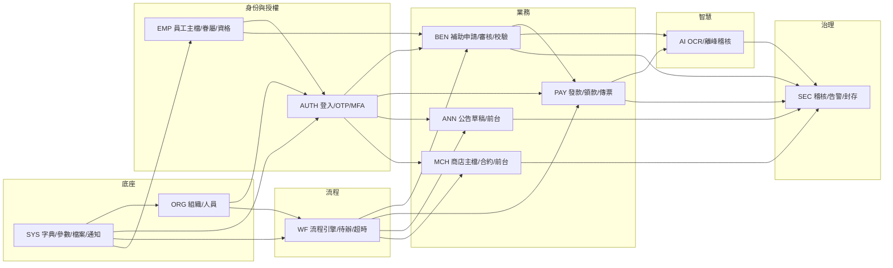

# PRD_M25_INDEX_v2_20260703

> 版本記錄：v2 增強版，基於舊版 M25 子 PRD、工作說明書及資料庫優化報告重構。更新模塊依賴矩陣與研發排期。

---

## 1. 文件定位

本文件為 26 份子 PRD 的總控索引，用於對齊：
- 模塊清單完整性
- 模塊命名與邊界一致性
- 模塊間依賴合理性
- 研發排期優先保障核心主鏈

---

## 2. 26 份子 PRD 索引（v2 增強版）

| 編號 | 模塊名稱 | 所屬域 | 類型 | 主要定位 | v2 文件 |
|------|----------|--------|------|----------|---------|
| M01 | AUTH－登入與帳號安全 | AUTH | 底層能力 | Graph 驗證、Session、OTP、MFA | `PRD_M01_AUTH_Login_v2_20260703.md` |
| M02 | AUTH－帳號啟活、重設密碼與 SSO 綁定 | AUTH | 底層能力 | OTP 啟活/重設、身份映射 | `PRD_M02_AUTH_Activate_v2_20260703.md` |
| M03 | ORG－組織樹與任職配置 | ORG | 底層能力 | 組織骨架、職位節點 | `PRD_M03_ORG_Tree_v2_20260703.md` |
| M04 | ORG－角色、功能權限與資料範圍 | ORG | 底層能力 | RBAC、Data Scope | `PRD_M04_ORG_RBAC_v2_20260703.md` |
| M05 | EMP－員工主檔與眷屬管理 | EMP | 底層能力 | 員工資料、眷屬、個資 | `PRD_M05_EMP_Profile_v2_20260703.md` |
| M06 | EMP－資格歷史、扣繳歷史、快照與變更日誌 | EMP | 底層能力 | 資格快照、夜間校正 | `PRD_M06_EMP_History_v2_20260703.md` |
| M07 | SYS－字典與系統參數 | SYS | 底層能力 | 字典、參數、全域配置 | `PRD_M07_SYS_Dict_v2_20260703.md` |
| M08 | SYS－檔案資源中心 | SYS | 底層能力 | 檔案上傳/下載/病毒掃描 | `PRD_M08_SYS_File_v2_20260703.md` |
| M09 | SYS－通知中心、模板與外寄任務 | SYS | 底層能力 | Outbox、模板、送達紀錄 | `PRD_M09_SYS_Notify_v2_20260703.md` |
| M10 | WF－流程模板與節點配置 | WF | 底層能力 | 固定審批鏈配置 | `PRD_M10_WF_Template_v2_20260703.md` |
| M11 | WF－待辦中心與審批執行 | WF | 業務支撐 | 核准/退回/駁回 | `PRD_M11_WF_Task_v2_20260703.md` |
| M12 | WF－超時掃描與流程事件 | WF | 底層能力 | 超時掃描、自動動作 | `PRD_M12_WF_Timeout_v2_20260703.md` |
| M13 | BEN－補助申請前台 | BEN | 業務支撐 | 動態表單、附件上傳、切結 | `PRD_M13_BEN_Apply_v2_20260703.md` |
| M14 | BEN－補助案件後台 | BEN | 後台頁面 | 案件審核承接 | `PRD_M14_BEN_Admin_v2_20260703.md` |
| M15 | BEN－資格校驗、附件校驗、年度上限 | BEN | 底層能力 | 送審阻斷規則 | `PRD_M15_BEN_Rules_v2_20260703.md` |
| M16 | PAY－待發款池與案件入池規則 | PAY | 底層能力 | 案件入池、防重複入批 | `PRD_M16_PAY_Pool_v2_20260703.md` |
| M17 | PAY－發款批次、送審與撥款回填 | PAY | 後台頁面 | 建批、送審、傳票關聯 | `PRD_M17_PAY_Batch_v2_20260703.md` |
| M18 | PAY－領款確認與異議處理 | PAY | 業務支撐 | 領款確認、異議、結案 | `PRD_M18_PAY_Confirm_v2_20260703.md` |
| M19 | ANN－公告草稿、審批與發布 | ANN | 後台頁面 | 公告草稿、送審、窗口與排程 | `PRD_M19_ANN_Draft_v2_20260703.md` |
| M20 | ANN－前台公告中心與瀏覽追蹤 | ANN | 業務支撐 | 公告列表、觸及統計、下載專區 | `PRD_M20_ANN_Portal_v2_20260703.md` |
| M21 | MCH－商店主檔與合約管理 | MCH | 後台頁面 | 商店建檔、合約治理、到期提醒 | `PRD_M21_MCH_Shop_v2_20260703.md` |
| M22 | MCH－優惠規則、適用對象、聯絡據點與前台商店中心 | MCH | 業務支撐 | 列表+地圖商店中心、前台保護 | `PRD_M22_MCH_Offer_v2_20260703.md` |
| M23 | SEC－稽核日誌、告警與掃描規則 | SEC | 底層能力 | 哈希鏈、熱冷分區、掃描規則 | `PRD_M23_SEC_Audit_v2_20260703.md` |
| M24 | SEC－資安後台、告警處置與封存報告 | SEC | 後台頁面 | 資安工作台、處置流、封存報表 | `PRD_M24_SEC_Security_v2_20260703.md` |
| M25 | 全模塊子 PRD 索引總表＋模塊依賴矩陣＋建議研發排期順序 | INDEX | 總控 | 子 PRD 總控文件 | `PRD_M25_INDEX_v2_20260703.md` |
| M26 | AI－影像辨識與智慧化輔助 | AI | 底層能力 | OCR、品質檢測、離峰稽核 | `PRD_M26_AI_OCR_v2_20260703.md` |

---

## 3. 模塊依賴矩陣（更新版）

### 3.1 高層依賴關係



### 3.2 依賴矩陣表

| 模塊域 | 直接依賴 | 被誰依賴 | 說明 |
|--------|----------|----------|------|
| SYS | 無 | 全域 | 字典、檔案、通知是平台底座 |
| ORG | SYS | AUTH、WF、Admin | 組織與授權前提 |
| EMP | SYS | AUTH、BEN、WF | 員工身份、資格、快照前提 |
| AUTH | ORG、EMP、SYS | Portal、Admin、Security Console | 三大入口前置 |
| WF | ORG、EMP、SYS | BEN、PAY、ANN、MCH | 共用審批鏈 |
| BEN | AUTH、EMP、WF、SYS、AI | PAY | 核准後銜接待發款池 |
| PAY | AUTH、WF、SYS、BEN | Portal 領款鏈 | 發款與領款確認 |
| ANN | AUTH、WF、SYS | Portal | 公告後台→前台 |
| MCH | AUTH、WF、SYS | Portal | 商店合約→前台 |
| SEC | SYS，消費全域事件 | Security Console | 高風險事件治理 |
| AI | BEN、PAY、SEC | BEN、PAY、SEC | 輔助層，不反客為主 |

---

## 4. 核心主鏈

### 4.1 補助與發款主鏈

```
登入 → 建立申請 → 上傳附件(→ AI OCR) → 數位切結 → 送審 
→ 承辦初審 → 主管核准 → 入待發款池 → 建批 → 批次核准 
→ 撥款回填 → 職工領款確認/異議 → 結案
```

### 4.2 公告主鏈

```
公告草稿 → 設定投放對象 → 設定窗口/排程 → 送審 
→ 核准 → 發布 → 前台公告中心展示 → 瀏覽追蹤
```

### 4.3 商店主鏈

```
商店建檔 → 建立合約 → 送審 → 核准(active) 
→ 前台列表+地圖展示 → 到期排程下架
```

### 4.4 治理主鏈

```
登入/授權/檔案/通知/審批事件 → 稽核日誌(hash鏈) 
→ 離峰掃描 → 必要時告警 → 資安工作台處置 → 封存報表
```

---

## 5. 建議研發排期（v2 更新版）

### Phase 0：底座先行

**M07、M08、M09、M23（最小骨架）**

先立字典、檔案、通知、稽核事件模型，否則後續模塊反覆返工。M23 先做到 audit_event 追加寫入與 hash 鏈，告警與封存後續補全。

### Phase 1：身份、組織、員工

**M01~M06**

先立身份、組織、權限、員工與資格底座。Portal / Admin / Security Console 三大入口都要先經過這一層。M01-M02（AUTH）與 M03-M04（ORG）可平行開發。

### Phase 2：流程引擎

**M10、M11、M12**

先把固定審批鏈、待辦與超時事件打通，供 BEN/PAY/ANN/MCH 共用。WF 的流程定義、待辦中心、超時掃描為共用基礎設施。

### Phase 3：補助申請主鏈 + AI 輔助

**M13、M14、M15、M26**

先打通補助申請主鏈（動態表單、附件、切結、審核、校驗），M26 AI 僅作輔助（OCR、品質檢測、重複攔截），不阻斷核心流程。

### Phase 4：發款與領款

**M16、M17、M18**

完成待發款池、建批、人工回填、領款確認與異議處理。PAY 為資金鏈核心，需嚴格驗證金額對帳與快照一致性。

### Phase 5：公告與商店

**M19、M20、M21、M22**

完成公告與商店兩條「審批後前台展示」鏈。M19+M20 與 M21+M22 可平行開發。

### Phase 6：資安完整化

**M24 與 M23 完整化**

把資安工作台、告警處置、封存報表與離峰掃描收口。此階段確保 C 級合規要求全部落地。

---

## 6. 跨模塊契約檢查

本 v2 版本已統一以下跨模塊契約：

| 契約 | 說明 | 適用範圍 |
|------|------|----------|
| 冪等性 | 變更型 API 支援 Idempotency-Key | M01-M26 所有變更 API |
| 審計日誌 | 狀態轉換/敏感查詢/權限變更/金額操作入 audit_event | 全域 |
| 樂觀鎖 | 主數據表使用 row_version | 所有可維護主表 |
| Outbox 模式 | 業務事務與非同步事件同一事務寫入 | M09 通知、M26 OCR |
| 錯誤碼 | [模塊前綴]-001~099 | 各模塊獨立編碼 |
| 狀態機 | 業務狀態由服務層狀態機控制 | BEN/PAY/ANN/MCH/WF |
| 敏感資料 | 身分證加密+遮罩，日誌僅存遮罩值 | EMP/AUDIT |
| 軟刪除 | 主檔可軟刪除，業務事件不可刪除 | 全域 |
