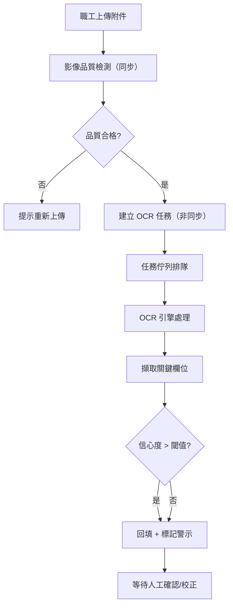
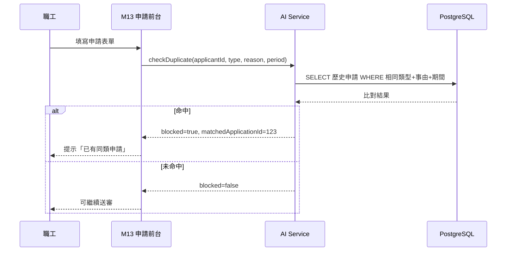
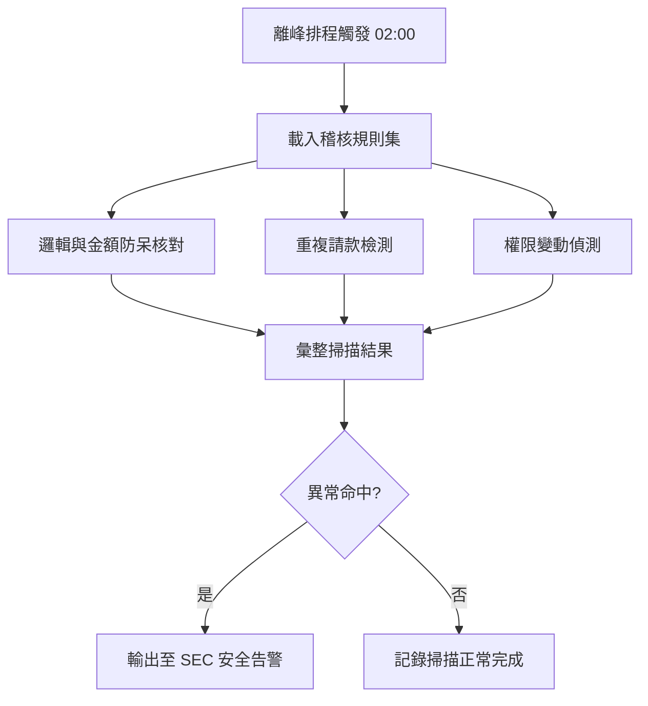
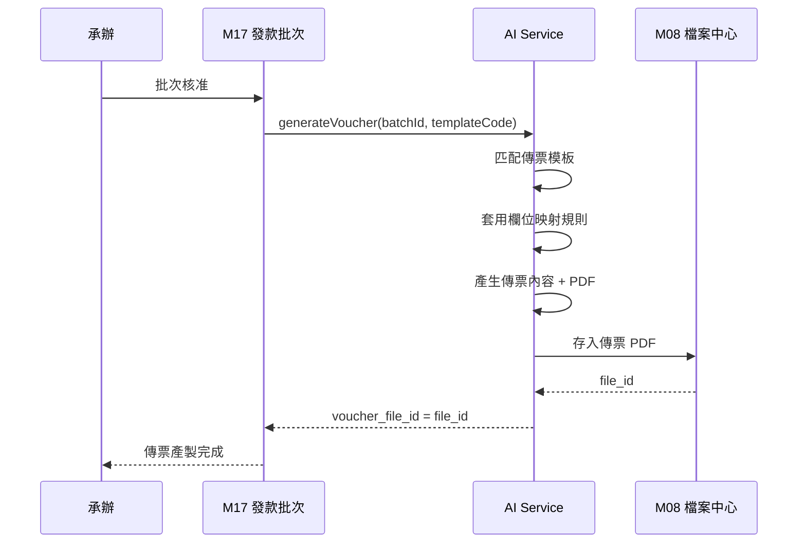
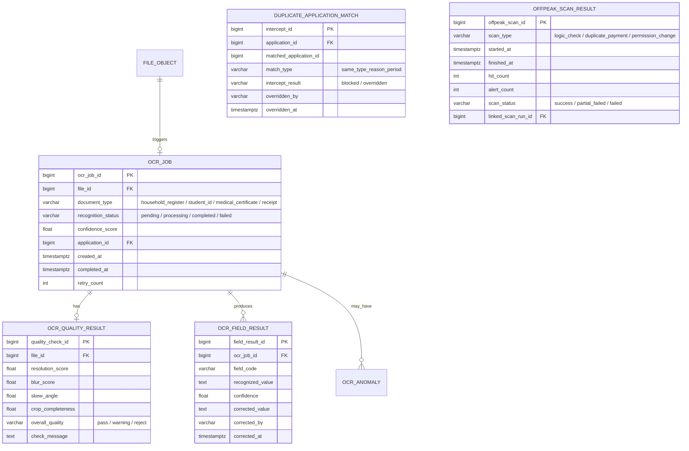
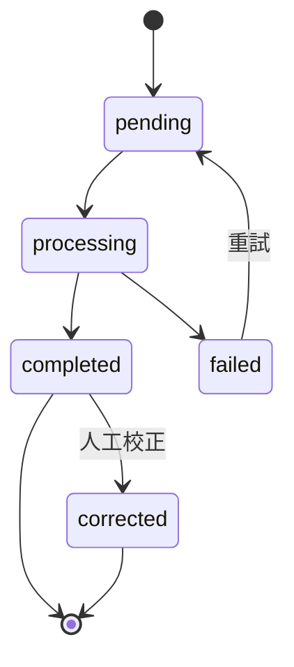

# PRD_M26_AI_OCR_v2_20260703

> 版本記錄：v2 增強版，基於舊版 M26 子 PRD、工作說明書及資料庫優化報告重構。

---

## 1. 模塊概述

| 項目 | 內容 |
|------|------|
| 模塊名稱 | AI－影像辨識與智慧化輔助 |
| 模塊類型 | 底層能力模塊 |
| 所屬領域 | AI（智慧化輔助） |
| 功能定位 | 福利平台的智慧化能力底座，提供 OCR 辨識、影像品質檢測、重複申請攔截、學年進度比對、傳票自動產製與離峰稽核 |
| 業務價值 | 降低承辦人工核對負擔；減少重複申請；自動化傳票產製提升財務效率；離峰離峰稽核不影響前台服務 |
| 使用角色 | 一般職工（間接使用者）、審閱者/承辦人（查看校正）、系統管理員（配置參數） |

### 1.1 核心設計原則

- **非同步不阻塞**：OCR 辨識採用非同步任務模式，不阻塞職工上傳流程；品質檢測同步即時回饋
- **僅輔助不取代**：AI 結果僅供輔助，不取代人工複核；失敗時不阻斷業務主流程
- **離峰自動稽核**：利用離峰時段進行邏輯與金額防呆核對，與 SEC 形成協同

---

## 2. 數據流圖

### 2.1 OCR 辨識主流程



### 2.2 重複申請攔截流程



### 2.3 離峰自動稽核



### 2.4 傳票自動產製



---

## 3. 數據庫設計

### 3.1 涉及數據表清單

| 表名 | 說明 | 歸屬 |
|------|------|------|
| `ocr_job` | OCR 任務主表 | AI |
| `ocr_quality_result` | 影像品質檢測結果 | AI |
| `ocr_field_result` | OCR 欄位辨識結果 | AI |
| `ocr_anomaly` | OCR 異常事件 | AI |
| `duplicate_application_match` | 重複申請攔截紀錄 | AI |
| `voucher_template` | 傳票模板 | PAY |
| `voucher` | 傳票主檔 | PAY |
| `offpeak_scan_result` | 離峰稽核掃描結果 | AI |
| `file_object` | 原始影像/產出檔案 | SYS |
| `audit_event` | 稽核事件 | SEC |

### 3.2 ER 圖



### 3.3 關鍵字段說明

| 字段 | 說明 |
|------|------|
| `ocr_job.recognition_status` | 任務生命週期：pending→processing→completed/failed |
| `ocr_field_result.confidence` | 0~1 信心度，低於閾值時標記警示 |
| `ocr_quality_result.overall_quality` | pass/warning/reject 三級品質判定 |
| `duplicate_application_match.match_type` | 比對維度，預設 same_type_reason_period |
| `offpeak_scan_result.scan_type` | 三種掃描類型，與 SEC 規則體系對齊 |

---

## 4. 功能需求清單

| 編號 | 名稱 | 優先級 | 說明 | 權限控制 |
|------|------|--------|------|----------|
| AI-F01 | 影像品質檢測 | P0 | 同步檢測模糊/傾斜/裁切/解析度 | 系統自動 |
| AI-F02 | OCR 欄位辨識 | P0 | 非同步辨識戶口名簿/學生證/診斷書/收據 | 系統自動 |
| AI-F03 | 辨識結果回填 | P0 | 信心度高自動回填，低信心標記警示 | 系統自動 |
| AI-F04 | 人工校正 | P0 | 審閱者校正辨識欄位 | 審閱者/承辦人 |
| AI-F05 | 重複申請攔截 | P0 | 比對類型+事由+期間，攔截阻斷送審 | 系統自動 |
| AI-F06 | 學年進度比對 | P1 | 教育補助學年/學期合理性檢查 | 系統自動 |
| AI-F07 | 財務傳票產製 | P1 | 批次核准後自動產製傳票 PDF | 承辦人觸發 |
| AI-F08 | 離峰自動稽核 | P1 | 邏輯/金額防呆+重複請款+權限變動 | 系統排程 |
| AI-F09 | 辨識統計儀表板 | P2 | 辨識成功率/攔截率/校正率統計 | 系統管理員 |
| AI-F10 | 任務佇列監控 | P2 | 佇列深度/失敗重試/執行狀態 | 系統管理員 |

---

## 5. 用例文檔

### 用例 1：職工上傳戶口名簿觸發 OCR

- **前置條件**：職工申請結婚補助，已填寫基本資料
- **操作步驟**：
  1. 職工上傳戶口名簿影像
  2. 系統同步執行品質檢測→通過
  3. 系統建立非同步 OCR 任務
  4. OCR 辨識完成，擷取配偶姓名、身分證號、戶籍地址
  5. 信心度 > 0.85，自動回填表單
- **預期結果**：表單欄位自動填入，標記「AI 辨識完成」
- **異常處理**：品質檢測不合格時提示「影像模糊，請重新拍攝」

### 用例 2：OCR 低信心度需人工校正

- **前置條件**：上傳的診斷證明書為手寫，字跡潦草
- **操作步驟**：
  1. OCR 辨識完成，部分欄位信心度 < 0.6
  2. 系統填入但標記黃色警示
  3. 承辦人打開校正頁，對照原始影像修正錯誤欄位
  4. 送出校正
- **預期結果**：校正前後值差異寫入 `ocr_field_result.corrected_value`
- **異常處理**：校正時欄位衝突（辨識值與已填值不一致）提示選擇

### 用例 3：重複申請被攔截

- **前置條件**：職工已申請 113 學年度上學期子女教育補助
- **操作步驟**：
  1. 職工再次以相同子女、相同學期送出申請
  2. 系統執行 `checkDuplicateApplication`
  3. 命中歷史紀錄
  4. 阻斷送審，提示「您已申請過相同補助（案件編號：XXX）」
- **預期結果**：送審被阻斷，不能重複申請
- **異常處理**：審閱者可人工放行（需權限），放行紀錄寫入 `overridden_by`

### 用例 4：傳票自動產製

- **前置條件**：發款批次已核准，承辦有傳票產製權限
- **操作步驟**：
  1. 承辦進入批次詳情，點擊「產製傳票」
  2. 系統讀取批次明細資料
  3. 匹配支出傳票模板
  4. 套用欄位映射，產生傳票 PDF
  5. 存入 M08，綁定 `voucher_file_id`
- **預期結果**：傳票格式與紙本憑證 1:1 對齊，可預覽/下載/列印
- **異常處理**：模板缺失時提示「傳票模板未配置」

### 用例 5：離峰稽核發現金額不一致

- **前置條件**：離峰排程（02:00）觸發
- **操作步驟**：
  1. 載入邏輯與金額防呆規則
  2. 掃描某批次：批次總額 100,000 但明細加總 99,500
  3. 命中異常，彙整掃描結果
  4. 輸出至 SEC 安全告警
- **預期結果**：SEC 告警建立，資安人員可查
- **異常處理**：掃描執行失敗時記錄錯誤，下次排程重試

---

## 6. 界面與交互要求

### 6.1 頁面佈局原則

- AI 辨識結果校正頁：原始影像預覽（左）+ 辨識欄位列表（右，含信心度色標）+ 人工校正編輯區
- AI 辨識統計儀表板：總量卡 + 成功率趨勢圖 + 攔截率 + 校正率 + 文件類型分布
- 傳票產製管理頁：任務列表（含狀態）+ 預覽/下載區 + 失敗重試入口
- 離峰稽核結果頁：掃描批次列表 + 命中異常摘要 + 各掃描類型結果（可作為 M24 子頁面）

### 6.2 OCR 任務狀態轉換



### 6.3 交互要求

- 低信心度欄位以黃/紅色標示
- 校正頁支援逐欄位修正與批次確認
- 傳票產製前可預覽，確認格式後正式輸出
- 校正前後差異可回溯

---

## 7. API 接口規格

### 7.1 影像品質檢測（同步）

#### POST /api/v1/ai/quality-check

上傳附件後即時品質檢測。

| 參數 | 類型 | 必填 | 說明 |
|------|------|------|------|
| file_id | bigint | 是 | 已上傳檔案 ID |

**響應**：
```json
{
  "quality_check_id": 5001,
  "overall_quality": "pass",
  "blur_score": 0.95,
  "skew_angle": 1.2,
  "resolution_score": 0.98,
  "check_message": "品質符合辨識要求"
}
```

### 7.2 OCR 辨識（非同步）

#### POST /api/v1/ai/recognize

觸發 OCR 辨識。

| 參數 | 類型 | 必填 | 說明 |
|------|------|------|------|
| file_id | bigint | 是 | 檔案 ID |
| document_type | string | 是 | 文件類型 |
| application_id | bigint | 是 | 關聯申請 ID |

**響應**：
```json
{
  "ocr_job_id": 10001,
  "status": "pending",
  "estimated_completion_seconds": 15
}
```

#### GET /api/v1/ai/recognize/{jobId}

查詢任務狀態與結果。

### 7.3 人工校正

#### PUT /api/v1/ai/recognize/{jobId}/fields/{fieldCode}

校正單一欄位。

| 參數 | 類型 | 必填 | 說明 |
|------|------|------|------|
| corrected_value | string | 是 | 校正後的值 |

### 7.4 重複申請攔截

#### POST /api/v1/ai/duplicate-check

檢查重複申請。

| 參數 | 類型 | 必填 | 說明 |
|------|------|------|------|
| applicant_id | bigint | 是 | 申請人 |
| benefit_type | string | 是 | 補助類型 |
| reason | string | 是 | 申請事由 |
| period | string | 是 | 期間（如 113S1） |

**響應**：
```json
{
  "blocked": true,
  "matched_application_id": 12345,
  "match_detail": {
    "benefit_type": "education",
    "semester": "113S1"
  }
}
```

### 7.5 傳票產製

#### POST /api/v1/ai/voucher/generate

產製傳票。

| 參數 | 類型 | 必填 | 說明 |
|------|------|------|------|
| payment_batch_id | bigint | 是 | 發款批次 ID |
| voucher_template_code | string | 是 | 傳票模板代碼 |

**錯誤碼**：
| 錯誤碼 | 說明 |
|--------|------|
| AI-001 | 影像品質不合格 |
| AI-002 | OCR 辨識失敗 |
| AI-003 | 無匹配模板 |
| AI-004 | 傳票產製失敗 |
| AI-005 | 離峰掃描執行失敗 |

---

## 8. 非功能性需求

| 類別 | 指標 | 說明 |
|------|------|------|
| 性能 | 品質檢測 < 2s | 同步返回結果 |
| 性能 | OCR 辨識 < 30s | 佇列正常時完成 |
| 性能 | 傳票產製 < 60s | 含 PDF 生成 |
| 性能 | 重複攔截 < 1s | 含歷史查詢 |
| 可用性 | OCR 失敗不阻斷申請 | 降級為純人工 |
| 可用性 | 離峰稽核 02:00-05:00 | 不影響前台 |
| 安全 | 辨識結果身分證遮罩 | 顯示 A12***789 |
| 安全 | 校正操作寫入稽核 | 入 audit_event |

---

## 9. 隱含需求補充

### 審計日誌

- OCR 任務建立/完成/失敗寫入 audit_event
- 人工校正操作寫入 audit_event（校正前/後值）
- 重複申請攔截/放行寫入 audit_event
- 傳票產製與下載寫入 audit_event
- AI 參數變更寫入 audit_event

### 數據一致性

- OCR 辨識結果與原始影像並存，不走覆蓋
- 傳票草稿、校對版、最終版不可互相覆蓋
- 離峰稽核結果與 SEC 告警體系一致

### 冪等性保障

- OCR 任務建立使用 file_id + document_type 去重
- 傳票產製使用 payment_batch_id + template_code 防重複
- 重複申請攔截支援 Idempotency-Key

### 邊界情況

- OCR 完全失敗時：轉人工處理，不可阻塞申請流程
- 辨識結果與已填內容衝突：提示選擇，不可靜默覆蓋
- 品質檢測可配置閾值，避免誤判
- 重複攔截可被有權限者人工放行
- AI 模型更新後歷史辨識結果不應被覆蓋
- 任務佇列積壓時啟用降級策略
