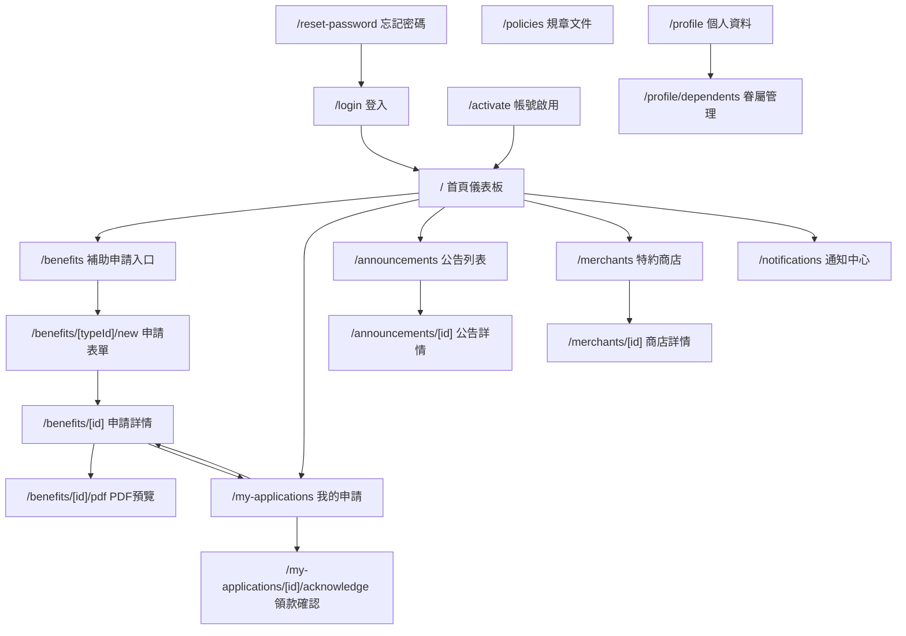

# 職工端 Sitemap

## 路由架構圖

## 各頁面摘要

| 路由 | 標題 | 權限 | 說明顯示 |
|------|------|------|----------|
| /login | 登入 | 未登入 | OTP 登入 |
| /activate | 帳號啟用 | 未啟用 | 首次登入設定 |
| /reset-password | 忘記密碼 | 未登入 | 三步驟重設 |
| / | 首頁 | 已登入職工 | 入口聚合 |
| /benefits | 補助申請入口 | 已登入職工 | 業務別卡片 |
| /benefits/[typeId]/new | 申請表單 | 已登入職工/承辦人 | 動態表單+附件 |
| /benefits/[id] | 申請詳情 | 本人/承辦人(代理) | 歷程+進度 |
| /benefits/[id]/pdf | PDF預覽 | 本人 | 列印預覽 |
| /my-applications | 我的申請 | 本人 | 列表+狀態篩選 |
| /my-applications/[id]/acknowledge | 領款確認 | 本人 | 確認/異議/評分 |
| /announcements | 公告中心 | 已登入職工 | 公告列表 |
| /announcements/[id] | 公告詳情 | 已登入職工 | 公告內容 |
| /policies | 規章文件 | 已登入職工 | 文件下載 |
| /merchants | 特約商店 | 已登入職工 | 列表+地圖 |
| /merchants/[id] | 商店詳情 | 已登入職工 | 優惠+據點 |
| /profile | 個人資料 | 本人 | 基本資料 |
| /profile/dependents | 眷屬管理 | 本人 | 眷屬列表 |
| /notifications | 通知中心 | 已登入職工 | 通知列表 |
