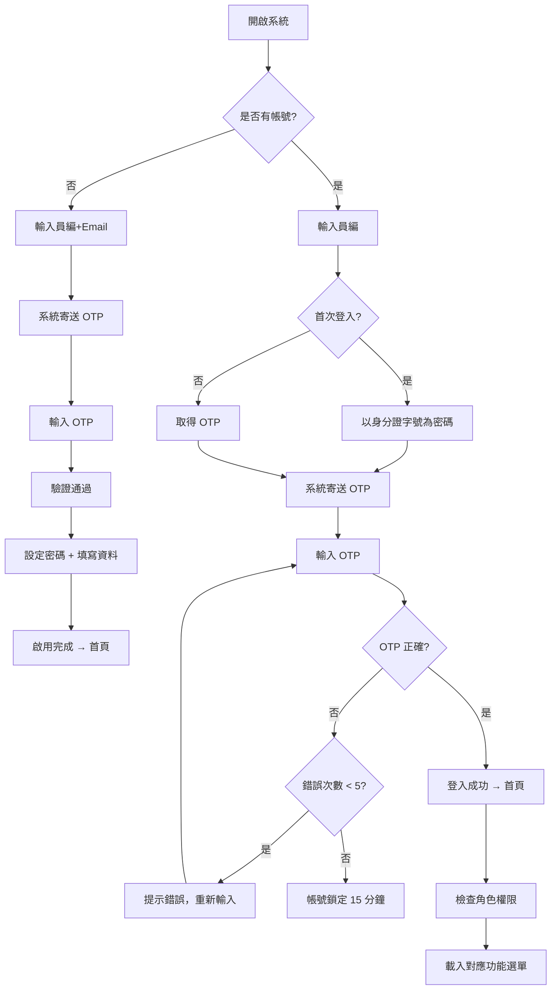

# 登入與帳號啟用

## 1. 功能概述

提供職工端身分驗證入口，含首次啟用、OTP 登入、忘記密碼三步驟救援。管理端 OTP + MFA 另見管理端文件。

## 2. 頁面架構

### 2.1 登入頁（/login）

```
+----------------------------------+
|           品牌 Logo               |
|         臺鐵職福會 LOGO           |
|                                  |
|   ┌──────────────────────────┐   |
|   │ 員工編號                    │   |
|   └──────────────────────────┘   |
|                                  |
|   ┌──────────────────────────┐   |
|   │ 身分證字號 (首次) / OTP    │   |
|   └──────────────────────────┘   |
|                                  |
|   [  取得驗證碼  ]  [  登入  ]   |
|                                  |
|   ─── 或 ───                    |
|   忘記密碼？                      |
+----------------------------------+
```

### 2.2 帳號啟用頁（/activate）

```
三步驟流程：
Step 1: 輸入員編 + Email → 寄送 OTP
Step 2: 輸入 OTP 驗證
Step 3: 設定密碼 + 填寫聯絡資料
```

### 2.3 忘記密碼頁（/reset-password）

```
三步驟流程：
Step 1: 輸入員編 + Email → 驗證身份
Step 2: 收取 OTP → 輸入驗證碼
Step 3: 設定新密碼
```

## 3. 頁面元素與 DB 欄位對應

### 登入頁

| UI 元素 | 組件類型 | API/DB 對應 | 驗證規則 |
|---------|----------|-------------|----------|
| 員工編號 Input | Input | login_name | 必填，6-10 碼 |
| 身分證/OTP Input | Input | identity_no_hash / otp_code_hash | 首次：身分證；其後：6 碼 OTP |
| 取得驗證碼 Button | Button | POST /auth/otp | 60s 冷卻 |
| 登入 Button | Button | POST /auth/login | - |
| 忘記密碼連結 | Link | → /reset-password | - |

### 啟用頁

| UI 元素 | 組件類型 | API/DB 對應 |
|---------|----------|-------------|
| 員編 Input | Input | employee_no |
| Email Input | Input | email |
| OTP Input | OTPInput (×6) | otp_code_hash |
| 密碼 Input | Input (password) | password_hash |
| 密碼確認 Input | Input (password) | - |
| 手機 Input | Input | phone |
| 地址 Input | Input | address |
| Step Indicator | Stepper | - |

## 4. Shadcn UI 組件建議

| 組件 | 用途 | 備註 |
|------|------|------|
| `<Card>` | 登入表單容器 | 置中，max-w-sm |
| `<Input>` | 文字輸入 | 員編、Email |
| `<Input type="password">` | 密碼輸入 | 附顯示/隱藏切換 |
| `<Button>` | 操作按鈕 | 登入/取得驗證碼/送出 |
| `<OTPInput>` (自訂) | 6 碼 OTP | 自動跳到下一格 |
| `<Stepper>` (自訂) | 步驟指示 | 用於啟用與重設密碼 |
| `<Form>` + `<FormField>` | 表單驗證 | react-hook-form + zod |
| `<Alert>` | 錯誤提示 | OTP 錯誤、帳號鎖定 |
| `<Separator>` | 分隔線 | 登入頁或忘記密碼 |
| `<Toast>` (Sonner) | 操作成功/失敗 | OTP 發送成功 |

## 5. 業務流程圖



## 6. 互動與狀態

| 狀態 | 處理方式 |
|------|----------|
| Loading | 登入中 → Button 顯示 spinner，disabled |
| Error - OTP 錯誤 | Alert 顯示「驗證碼錯誤，剩餘 X 次機會」 |
| Error - 帳號鎖定 | Alert 顯示「帳號已鎖定，請於 X 分鐘後再試」 |
| Error - 員編不存在 | Alert 顯示「此員工編號未註冊」 |
| Error - Email 寄送失敗 | Alert 顯示「驗證碼寄送失敗，請稍後再試」 |
| Success | Toast「登入成功」→ 導回首頁 |
| Edge - OTP 逾時 | 提示「驗證碼已過期，請重新取得」 |
| Edge - 重複點擊 | Button disabled + 60s 倒數計時 |

## 7. 權限控管

- 未登入者僅能存取 /login、/activate、/reset-password
- 已登入者自動導向 /（首頁）
- 已啟用帳號不可再存取 /activate
