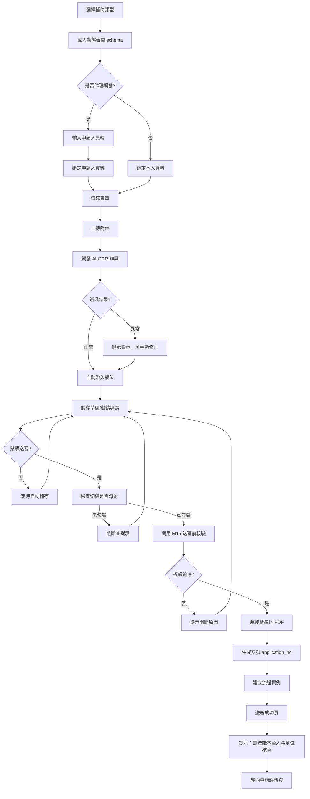

# 補助申請入口與表單

## 1. 功能概述

職工（或代理承辦人）選擇補助類型，填寫動態表單，上傳證明文件，經 AI OCR 輔助辨識後送審或儲存草稿。支援一般申請與代理填發雙模式。

## 2. 頁面架構

### 2.1 補助申請入口（/benefits）

```
+------------------------------------------+
|  申請補助                                 |
+------------------------------------------+
|  ┌──── 個人福利補助 ──────────────────┐  |
|  │  ┌─────┐ ┌─────┐ ┌─────┐ ┌─────┐ │  |
|  │  │結婚  │ │生育  │ │子女  │ │喪葬  │ │  |
|  │  │補助  │ │補助  │ │教育  │ │補助  │ │  |
|  │  └─────┘ └─────┘ └─────┘ └─────┘ │  |
|  │  ┌─────┐ ┌─────┐ ┌─────┐         │  |
|  │  │傷病  │ │三節  │ │生日  │         │  |
|  │  │慰問  │ │禮金  │ │禮金  │         │  |
|  │  └─────┘ └─────┘ └─────┘         │  |
|  └────────────────────────────────────┘  |
|  ┌──── 社團活動補助 ──────────────────┐  |
|  │  ┌─────┐                          │  |
|  │  │社團  │                          │  |
|  │  │申請  │                          │  |
|  │  └─────┘                          │  |
|  └────────────────────────────────────┘  |
+------------------------------------------+
```

### 2.2 申請表單（/benefits/[typeId]/new）

```
+------------------------------------------+
|  ← 返回          結婚補助申請      草稿儲存 |
+------------------------------------------+
|  ┌── 申請人資訊 ──────────────────────┐  |
|  │   姓名：王小明 (不可編輯)            │  |
|  │   單位：臺北機務段                   │  |
|  │   📎 代理填發 (由福利社代登錄)       │  |
|  └────────────────────────────────────┘  |
|  ┌── 申請資料 ───────────────────────┐  |
|  │   配偶姓名    [________________]   │  |
|  │   結婚日期    [____/__/__]         │  |
|  │   登記地點    [________________]   │  |
|  └────────────────────────────────────┘  |
|  ┌── 應備文件 ───────────────────────┐  |
|  │   📄 戶口名簿 (必填)  [選擇檔案]    │  |
|  │      ⬆ 已上傳: IMG_001.jpg  ✅     │  |
|  │      🔍 AI 辨識中...               │  |
|  │   📄 結婚證書 (選填)  [選擇檔案]    │  |
|  └────────────────────────────────────┘  |
|  ┌── AI 辨識結果 ────────────────────┐  |
|  │   系統已自動帶入以下欄位，請確認      │  |
|  │   ✓ 配偶姓名：李四                  │  |
|  │   ✓ 結婚日期：2026-06-15           │  |
|  │   ⚠ 登記地點：未辨識，請手動輸入     │  |
|  └────────────────────────────────────┘  |
+------------------------------------------+
|  □ 本人聲明無重複請領，並同意上述資料正確  |
|  [  儲存草稿  ]    [  送審  ]            |
+------------------------------------------+
```

## 3. 頁面元素與 DB 欄位對應

| UI 元素 | 組件類型 | API/DB 對應 |
|---------|----------|-------------|
| 業務別切換 | TabList | domain_code: individual_subsidy / community_business |
| 補助類型卡片 | Card (selectable) | application_type.type_code, type_name |
| 補助類型圖示 | Icon | 依 type_code 映射 |
| 申請人姓名 | Text | employee.full_name (唯讀) |
| 代理填發標籤 | Badge | benefit_application.is_proxy_filed |
| 代理填發按鈕 | Button | 切換代理模式 → 輸入申請人員編 |
| 動態表單欄位 | DynamicForm (FormField) | benefit_form_version.schema_json |
| 附件上傳區 | FileUploader | benefit_application_attachment.file_id |
| 必填文件清單 | List + Badge | application_type.requires_attachment |
| AI 辨識結果 | OCRResultCard (自訂) | ai_document_recognition.recognized_fields_json |
| 數位切結 Checkbox | Checkbox | benefit_application.declaration_checked |
| 儲存草稿 Button | Button | PUT /ben/applications/{id} |
| 送審 Button | Button | POST /ben/applications/{id}/submit |
| 草稿自動儲存 Toast | Toast (Sonner) | 每 60s 自動保存 |

## 4. Shadcn UI 組件建議

| 組件 | 用途 | 備註 |
|------|------|------|
| `<Tabs>` | 業務別切換 (個人/社團) | value=domainCode |
| `<Card>` (selectable) | 補助類型選擇 | 點選後導向表單 |
| `<Form>` + `<FormField>` | 動態表單容器 | react-hook-form |
| `<Input>` | 文字/數字/日期 | 依 schema 動態渲染 |
| `<Select>` | 下拉選單 | 字典值來源 |
| `<RadioGroup>` | 單選 | 選項較少時使用 |
| `<Checkbox>` | 多選/切結 | declaration_checked |
| `<Textarea>` | 多行文字 | 備註欄位 |
| `<FileUploader>` (自訂) | 附件上傳 | 拖放+進度+預覽 |
| `<Progress>` | 上傳進度條 | 每個檔案獨立進度 |
| `<Badge>` | 必填/選填標記 | variant 區分 |
| `<Separator>` | 區塊分隔線 | 申請人/表單/附件 |
| `<Button>` | 儲存草稿/送審 | 送審含 loading |
| `<Alert>` | AI 辨識警示 | 金額不符、異常 |
| `<Toast>` | 自動儲存提示 | 草稿儲存成功 |
| `<Dialog>` | 代理填發員編輸入 | 搜尋員工 |
| `<Stepper>` (自訂) | 步驟指示器 | 表單填寫進度 |

## 5. 業務流程圖



## 6. 互動與狀態

| 狀態 | 處理方式 |
|------|----------|
| Loading - schema | Skeleton 填入表單區域 |
| Loading - OCR | Badge「辨識中」+ spinner |
| Empty - 無可用補助 | 顯示「目前無可申請的補助項目」 |
| Error - 表單校驗 | 紅框標示錯誤欄位 + 提示訊息 |
| Error - 附件過大 | Alert「檔案超過 10MB 限制」 |
| Error - 送審衝突 (409) | AlertDialog「資料已更新，請重新整理」 |
| Edge - 草稿版本衝突 | Toast「草稿已在其他地方更新」 |
| Edge - 年度上限已滿 | Card 顯示「本年度申請次數已達上限」 |
| Edge - 代理填發員編查無此人 | Alert「查無此員工編號」 |
| Edge - AI 服務異常 | 不阻斷，顯示「辨識服務暫時無法使用」 |

## 7. 權限控管

- 一般職工：僅能申請本人案件，申請人鎖定不可編輯
- 福利社承辦人：可切換代理模式，輸入申請人員編後鎖定申請人資料
- 代理填發案件永久標記 `is_proxy_filed=true`

## 8. 相關頁面與路由

- 上一頁：/（首頁）或 /benefits（入口頁）
- 下一頁（送審成功）：/benefits/[id]（申請詳情）
- 橫向：/my-applications（我的申請列表）
