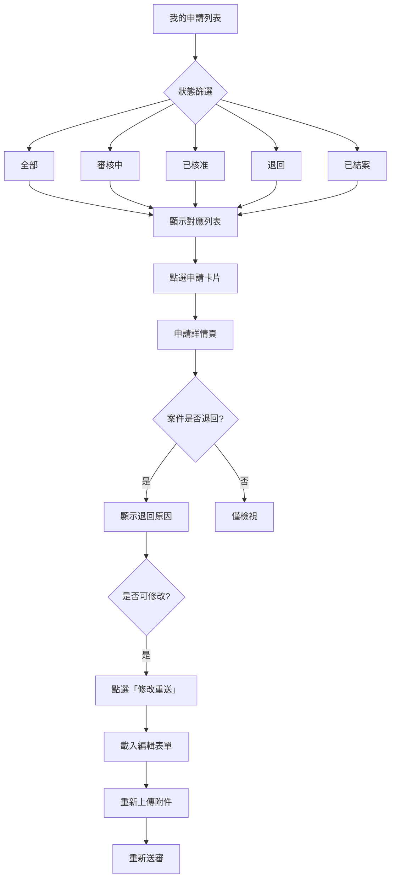

# 申請詳情與進度查詢

## 1. 功能概述

職工查詢單一補助申請的完整資料、流程進度與歷程。支援退回後修改重送。從「我的申請」列表進入。

## 2. 頁面架構

### 2.1 我的申請列表（/my-applications）

```
+------------------------------------------+
|  我的申請                                 |
+------------------------------------------+
|  [全部] [審核中] [已核准] [退回] [已結案]   |
+------------------------------------------+
|  ┌──────────────────────────────────────┐ |
|  │ TP-115-06-001  結婚補助  審核中  ⏳  │ |
|  │ 王小明 · 2026/06/15 · $12,000       │ |
|  │ [查看詳情]                           │ |
|  ├──────────────────────────────────────┤ |
|  │ TP-115-06-002  子女教育  退回    🔴  │ |
|  │ 原因：診斷證明模糊                    │ |
|  │ [修改重送]    [查看詳情]              │ |
|  ├──────────────────────────────────────┤ |
|  │ TP-115-05-010  喪葬補助  已核准  ✅  │ |
|  │ 2026/05/20 · $30,000                │ |
|  │ [查看詳情]                           │ |
|  └──────────────────────────────────────┘ |
+------------------------------------------+
```

### 2.2 申請詳情（/benefits/[id]）

```
+------------------------------------------+
|  ← 我的申請      申請單號：TP-115-06-001   |
+------------------------------------------+
|  狀態：審核中      ⏳                      |
|  ┌── 流程進度 ────────────────────────┐  |
|  │  ● 送出申請          06/15 10:00    │  |
|  │  ● 承辦初審          06/16 14:30    │  |
|  │  ○ 主管核准          待處理          │  |
|  │  ○ 待發款                            │  |
|  └────────────────────────────────────┘  |
|  ┌── Tab: 申請資料 │ 附件 │ 歷程 ────┐  |
|  │  [申請資料內容]                     │  |
|  │  配偶姓名：李四                     │  |
|  │  結婚日期：2026-06-15              │  |
|  │  申請金額：$12,000                 │  |
|  └────────────────────────────────────┘  |
|  ┌── 退回原因 (若退回) ──────────────┐  |
|  │  🔴 診斷證明模糊，請重新上傳清晰影像   │  |
|  │  [修改重送]                        │  |
|  └────────────────────────────────────┘  |
+------------------------------------------+
```

## 3. 頁面元素與 DB 欄位對應

| UI 元素 | 組件類型 | API/DB 對應 |
|---------|----------|-------------|
| 申請單號 | Text | benefit_application.application_no |
| 狀態 Badge | StatusBadge | benefit_application.status |
| 流程時間線 | WorkflowTimeline | workflow_step + workflow_action_log |
| 申請資料 Tab | Tabs + DynamicForm | benefit_application_form.form_payload_json |
| 附件列表 Tab | Tabs + AttachmentList | benefit_application_attachment |
| 流程歷程 Tab | Tabs + Table | workflow_action_log |
| 退回原因區 | Alert | benefit_application.returned_reason |
| 修改重送 Button | Button | 導向 /benefits/[id]/edit |
| 狀態篩選標籤列 | Tabs (list) | benefit_application.status |
| 申請卡片 | Card | 列表項目 |
| PDF 預覽 Button | Button | GET /ben/applications/{id}/pdf |
| 分頁 | Pagination | 列表分頁 |

## 4. Shadcn UI 組件建議

| 組件 | 用途 | 備註 |
|------|------|------|
| `<Tabs>` | 列表狀態篩選 | 全部/審核中/已核准/退回/已結案 |
| `<Card>` | 申請列表項目 | 含狀態、金額、日期 |
| `<Badge>` | 狀態標籤 | StatusBadge 封裝 |
| `<Pagination>` | 列表分頁 | 每頁 10 筆 |
| `<Button>` | 查看詳情/修改重送 | variant 區分 |
| `<Tabs>` | 詳情頁分頁籤 | 申請資料/附件/歷程 |
| `<DetailPanel>` (自訂) | 詳情聚合容器 | 多源資料 |
| `<WorkflowTimeline>` (自訂) | 流程時間線 | 垂直時間軸 |
| `<Alert>` | 退回原因 | variant="destructive" |
| `<Separator>` | 區塊分隔 | - |
| `<Skeleton>` | 載入中 | 列表/詳情 |

## 5. 業務流程圖



## 6. 互動與狀態

| 狀態 | 處理方式 |
|------|----------|
| Loading - 列表 | Skeleton × 5 行 |
| Loading - 詳情 | Skeleton 填入各區塊 |
| Empty - 無申請 | 插圖 +「尚未提出任何補助申請」+「立即申請」按鈕 |
| Empty - 篩選結果 | 插圖 +「無符合條件的申請」 |
| Error | Alert + 重試按鈕 |
| Edge - 案件已取消 | Badge + 淡化顯示 |
| Edge - 退回重送 | 退回原因 Alert 醒目顯示 |

## 7. 權限控管

- 一般職工：僅能看到本人的申請案件
- 福利社承辦人（代理填發者）：可看到其代填的案件，並於詳情頁標示「由福利社代理登錄」

## 8. 相關頁面與路由

- 上一頁：/（首頁）
- 點選申請卡片 → /benefits/[id]（詳情）
- 修改重送 → /benefits/[typeId]/new?applicationId=[id]（帶入原資料）
- PDF 預覽 → /benefits/[id]/pdf
