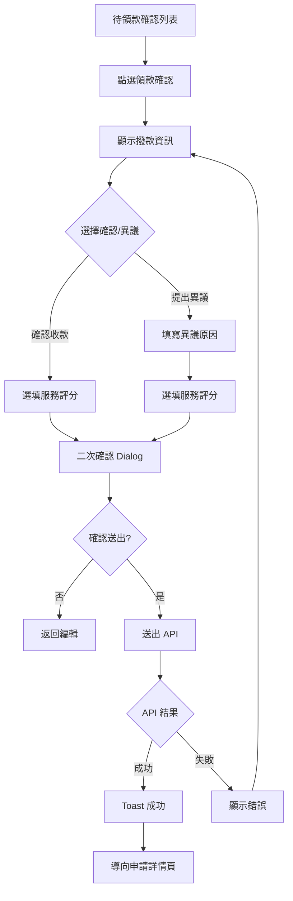

# 領款確認與異議

## 1. 功能概述

案件撥款完成後，職工於前台進行數位領款確認、提出異議申請，並提供服務滿意度評分與回饋。

## 2. 頁面架構

```
+------------------------------------------+
|  ← 我的申請      領款確認                  |
+------------------------------------------+
|  申請單號：TP-115-06-001                  |
|  結婚補助 · $12,000                       |
+------------------------------------------+
|  ┌── 撥款資訊 ────────────────────────┐  |
|  │   撥款日期：2026/07/01              │  |
|  │   撥款金額：$12,000                 │  |
|  │   匯入帳戶：郵局 (700) 0001234****  │  |
|  └────────────────────────────────────┘  |
|                                          |
|  ┌── 領款確認 ────────────────────────┐  |
|  │                                     │  |
|  │  ○ 確認收到款項                      │  |
|  │  ○ 款項有問題，提出異議              │  |
|  │                                     │  |
|  │  [若選異議] 異議原因:                │  |
|  │  ┌──────────────────────────────┐  │  |
|  │  │ ____________________________  │  │  |
|  │  └──────────────────────────────┘  │  |
|  └────────────────────────────────────┘  |
|                                          |
|  ┌── 服務回饋 (選填) ────────────────┐  |
|  │   滿意度：★★★☆☆                    │  |
|  │   備註：                            │  |
|  │   ┌──────────────────────────────┐  │  |
|  │   │ ____________________________  │  │  |
|  │   └──────────────────────────────┘  │  |
|  └────────────────────────────────────┘  |
|                                          |
|  [  送出確認  ]                          |
+------------------------------------------+
```

## 3. 頁面元素與 DB 欄位對應

| UI 元素 | 組件類型 | API/DB 對應 |
|---------|----------|-------------|
| 申請單號 | Text | benefit_application.application_no |
| 撥款日期 | Text | payment_batch_item.disbursed_at |
| 撥款金額 | Text | payment_batch_item.amount |
| 匯入帳戶 | Text (masked) | employee_payment_account (遮罩) |
| 領款確認 RadioGroup | RadioGroup | payment_acknowledgement.acknowledgement_status |
| 異議原因 Textarea | Textarea | payment_dispute_case.dispute_reason |
| 滿意度 Rating | RadioGroup (×5) | payment_acknowledgement.satisfaction_rating |
| 服務回饋 Textarea | Textarea | payment_acknowledgement.satisfaction_comment |
| 送出確認 Button | Button | POST /ben/applications/{id}/acknowledge |

## 4. Shadcn UI 組件建議

| 組件 | 用途 | 備註 |
|------|------|------|
| `<Card>` | 各區塊容器 | 撥款資訊/領款確認/回饋 |
| `<RadioGroup>` | 領款確認選擇 | 確認/異議 |
| `<Textarea>` | 異議原因 | 選異議時顯示 |
| `<Rating>` (自訂) | 滿意度星等 | 1-5 星點擊 |
| `<Button>` | 送出確認 | variant="default" |
| `<AlertDialog>` | 送出前二次確認 | 「確認送出後不可修改」 |
| `<Toast>` | 送出成功 | 導向申請詳情 |
| `<Separator>` | 區塊分隔 | - |

## 5. 業務流程圖



## 6. 互動與狀態

| 狀態 | 處理方式 |
|------|----------|
| Loading | Skeleton 填入各區塊 |
| Error - 送出失敗 | Alert「送出失敗，請稍後再試」 |
| Success | Toast「領款確認成功」+ 導回詳情頁 |
| Edge - 異議原因空白 | 選異議時阻斷送出，提示「請填寫異議原因」 |
| Edge - 已確認過 | 顯示「已於 2026/07/02 完成領款確認」，按鈕 disabled |
| Edge - 已提出異議 | 顯示異議處理中 StatusBadge，按鈕 disabled |

## 7. 權限控管

- 僅限申請人本人進行領款確認
- 代理填發案件由實際申請人確認，非代理承辦人

## 8. 相關頁面與路由

- 上一頁：/my-applications（我的申請）
- 下一頁（送出後）：/benefits/[id]（申請詳情）
