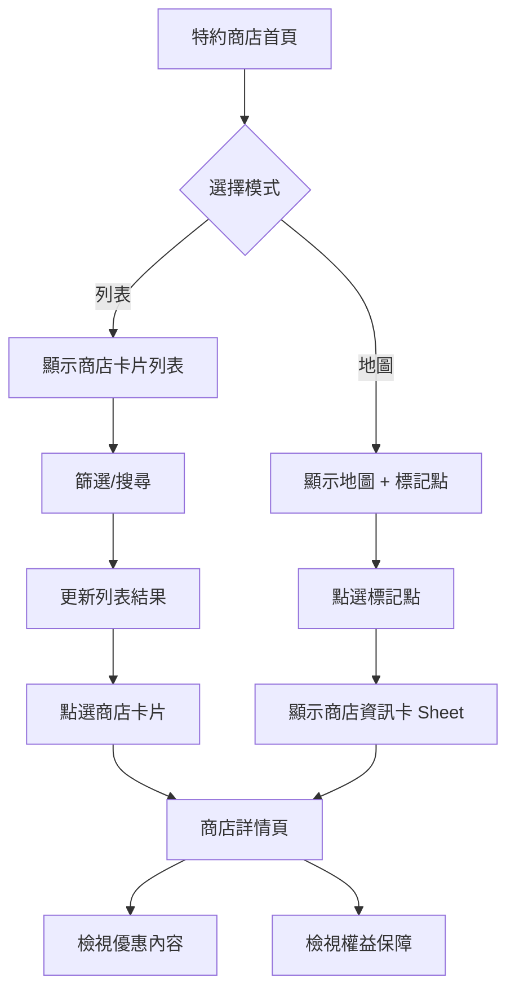

# 特約商店

## 1. 功能概述

職工瀏覽特約商店列表，以分類或地圖模式查詢商店位置與優惠內容，支援距離排序與行動裝置查詢。

## 2. 頁面架構

### 2.1 商店列表／地圖（/merchants）

```
+------------------------------------------+
|  特約商店                                 |
+------------------------------------------+
|  [列表模式]  [地圖模式]                    |
+------------------------------------------+
|  ┌── 篩選列 ─────────────────────────┐  |
|  │  分類：[全部 v]  地區：[全部 v]      │  |
|  │  關鍵字：[________________]  🔍     │  |
|  └────────────────────────────────────┘  |
|                                          |
|  ┌──── 列表模式 ───────────────────┐  |
|  │  ┌────────────────────────────┐ │  |
|  │  │ 🏪 臺鐵便當本鋪 (臺北站)    │ │  |
|  │  │ 優惠：持識別證享 9 折       │ │  |
|  │  │ 📍 臺北市中正區北平西路 3 號 │ │  |
|  │  │ [查看優惠]                  │ │  |
|  │  └────────────────────────────┘ │  |
|  │  ┌────────────────────────────┐ │  |
|  │  │ 🏪 欣欣診所                │ │  |
|  │  │ 優惠：掛號費減免 50 元      │ │  |
|  │  │ 📍 臺北市大安區...          │ │  |
|  │  │ [查看優惠]                  │ │  |
|  │  └────────────────────────────┘ │  |
|  └──────────────────────────────────┘  |
|                                          |
|  ┌──── 地圖模式 ───────────────────┐  |
|  │  [地圖容器，顯示商店標記點]       │  |
|  │  📍📍📍📍📍                   │  |
|  │  點選標記顯示商店資訊卡           │  |
|  └──────────────────────────────────┘  |
+------------------------------------------+
```

### 2.2 商店詳情（/merchants/[id]）

```
+------------------------------------------+
|  ← 特約商店      欣欣診所                  |
+------------------------------------------+
|  🏪 欣欣診所 · 醫療保健                  |
+------------------------------------------+
|  ┌── 店家資訊 ────────────────────────┐  |
|  │   電話：02-1234-5678               │  |
|  │   地址：臺北市大安區忠孝東路 4 段... │  |
|  │   營業時間：週一至週五 09:00-17:00  │  |
|  └────────────────────────────────────┘  |
|  ┌── 優惠內容 ────────────────────────┐  |
|  │   🏷️ 持職福會識別證享掛號費減免    │  |
|  │      50 元                          │  |
|  │   適用對象：在職員工、退休員工        │  |
|  │   效期：2026/01/01 - 2026/12/31    │  |
|  └────────────────────────────────────┘  |
|  ┌── 權益保障說明 ────────────────────┐  |
|  │  本商店為臺鐵職福會特約商店...       │  |
|  └────────────────────────────────────┘  |
+------------------------------------------+
```

## 3. 頁面元素與 DB 欄位對應

| UI 元素 | 組件類型 | API/DB 對應 |
|---------|----------|-------------|
| 列表/地圖切換 | Tabs | 前端狀態切換 |
| 分類篩選 Select | Select | merchant_category.category_code |
| 地區篩選 Select | Select | merchant_contact_point (region) |
| 關鍵字搜尋 | Input | merchant_name LIKE |
| 商店卡片 | Card | contract_merchant.merchant_name |
| 優惠摘要 | Text | merchant_benefit.benefit_summary |
| 商店標記點 | MapMarker | merchant_contact_point (lat, lng) |
| 商店名稱 | Text | contract_merchant.merchant_name |
| 商店型態 | Badge | contract_merchant.merchant_type |
| 分類名稱 | Badge | merchant_category.category_name |
| 電話 | Text | merchant_contact_point.contact_phone |
| 地址 | Text | merchant_contact_point.address_text |
| 營業時間 | Text | merchant_contact_point.business_hours |
| 優惠標題 | Text | merchant_benefit.benefit_title |
| 優惠明細 | Text | merchant_benefit.benefit_detail |
| 適用對象 | Tag/List | merchant_eligibility_rule.audience_type |
| 權益保障 | Text | merchant_protection_notice.notice_text |

## 4. Shadcn UI 組件建議

| 組件 | 用途 | 備註 |
|------|------|------|
| `<Tabs>` | 列表/地圖切換 | value="list" | "map" |
| `<Select>` | 分類/地區篩選 | placeholder="全部" |
| `<Input>` | 關鍵字搜尋 | 附搜尋 icon |
| `<Card>` | 商店列表項 | 點選導向詳情 |
| `<Badge>` | 商店型態 | variant 依 type 映射 |
| `<MapContainer>` (自訂) | 地圖渲染 | 第三方地圖 API |
| `<Sheet>` | 地圖點選資訊卡 | 從底部彈出 |
| `<Separator>` | 優惠區塊分隔 | - |
| `<Skeleton>` | 載入中 | 列表/地圖 |

## 5. 業務流程圖



## 6. 互動與狀態

| 狀態 | 處理方式 |
|------|----------|
| Loading - 列表 | Skeleton × 3 卡片 |
| Loading - 地圖 | Spinner 疊加於地圖 |
| Empty - 無結果 | 「無符合條件的商店」+ 建議調整篩選 |
| Error - 地圖 API 失敗 | Alert「地圖服務暫時無法使用」+ 降級為列表模式 |
| Edge - 商店已過期 | 自動隱藏 (contract_end_at 判斷) |

## 7. 權限控管

- 所有已登入職工均可瀏覽查詢
- 商店資料維護限管理端（見管理端文件）

## 8. 相關頁面與路由

- 商店列表/地圖：/merchants
- 商店詳情：/merchants/[id]
