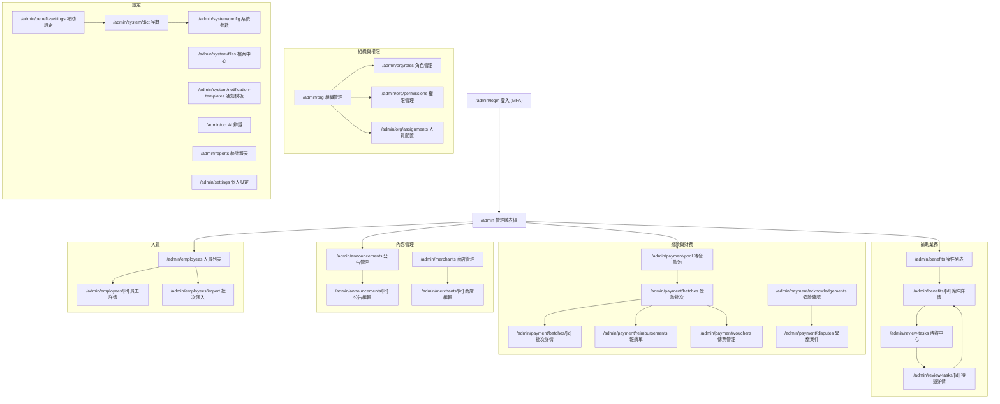

# 管理端 Sitemap

## 路由架構圖

## 各頁面摘要

| 路由 | 標題 | 角色 |
|------|------|------|
| /admin/login | 管理端登入 | 未登入 |
| /admin | 管理儀表板 | 全域 |
| /admin/benefits | 案件列表 | 承辦人/主管/管理者 |
| /admin/benefits/[id] | 案件詳情 | 承辦人/主管/管理者 |
| /admin/review-tasks | 待辦中心 | 承辦人/主管 |
| /admin/review-tasks/[id] | 待辦詳情 | 承辦人/主管 |
| /admin/payment/pool | 待發款池 | 承辦人/財務 |
| /admin/payment/batches | 發款批次 | 承辦人/財務 |
| /admin/payment/batches/[id] | 批次詳情 | 承辦人/財務 |
| /admin/payment/reimbursements | 報銷單 | 財務 |
| /admin/payment/vouchers | 傳票管理 | 財務 |
| /admin/payment/acknowledgements | 領款確認 | 承辦人/財務 |
| /admin/payment/disputes | 異議案件 | 承辦人/財務 |
| /admin/announcements | 公告管理 | 承辦人/主管 |
| /admin/announcements/[id] | 公告編輯 | 承辦人 |
| /admin/merchants | 商店管理 | 承辦人 |
| /admin/merchants/[id] | 商店編輯 | 承辦人 |
| /admin/org | 組織管理 | 系統管理者 |
| /admin/org/roles | 角色管理 | 系統管理者 |
| /admin/org/permissions | 權限管理 | 系統管理者 |
| /admin/org/assignments | 人員配置 | 系統管理者 |
| /admin/employees | 人員列表 | 系統管理者/承辦人 |
| /admin/employees/[id] | 員工詳情 | 系統管理者/承辦人 |
| /admin/employees/import | 批次匯入 | 系統管理者 |
| /admin/benefit-settings | 補助設定 | 系統管理者 |
| /admin/system/dict | 字典管理 | 系統管理者 |
| /admin/system/config | 系統參數 | 系統管理者 |
| /admin/system/files | 檔案中心 | 系統管理者 |
| /admin/system/notification-templates | 通知模板 | 系統管理者 |
| /admin/ocr | AI 辨識管理 | 承辦人/系統管理者 |
| /admin/reports | 統計報表 | 承辦人/主管/管理者 |
| /admin/settings | 個人設定 | 全域 |
