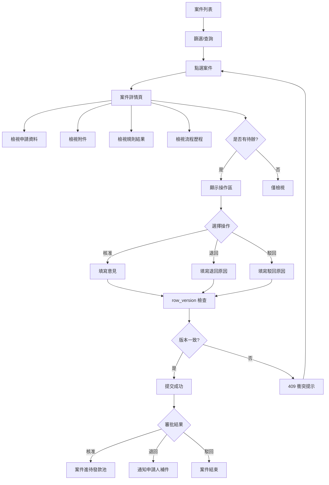

# 補助案件管理

## 1. 功能概述

管理端檢視全量補助案件，支援多維度篩選、案件詳情多源聚合、審批操作（核准/退回/駁回）、案件匯出。詳情頁整合申請資料、附件、規則校驗結果與流程歷程四大資料源。

## 2. 頁面架構

### 案件列表（/admin/benefits）

```
+------------------------------------------+
|  補助案件管理                      [匯出] |
+------------------------------------------+
|  統計摘要                                |
|  [草稿 5] [送審 12] [審核中 8] [核准 6]   |
|  [退回 3] [駁回 2] [已結案 15]            |
+------------------------------------------+
|  篩選條件                                |
|  申請類型：[全部 v]   狀態：[全部 v]       |
|  福利社：[全部 v]     關鍵字：[________]  |
|  申請日期：[____] ~ [____]  [查詢] [重置] |
+------------------------------------------+
|  ┌────┬──────┬──────┬──────┬──────┬──┐  |
|  │案號 │類型  │申請人│金額  │狀態  │操作 │  |
|  ├────┼──────┼──────┼──────┼──────┼──┤  |
|  │TP.. │結婚  │王小明│12,000│審核中│[查看]│  |
|  │TP.. │子女  │李四  │8,000 │退回  │[查看]│  |
|  │...  │      │      │      │      │    │  |
|  └────┴──────┴──────┴──────┴──────┴──┘  |
|                                          |
|                   1  2  3 ...  20         |
+------------------------------------------+
```

### 案件詳情（/admin/benefits/[id]）

```
+------------------------------------------+
|  ← 案件列表    TP-115-06-001   審核中 ⏳  |
+------------------------------------------+
|  ┌── 申請資料 │ 附件 │ 規則結果 │ 流程 ─┐ |
|  │  [Tab 1: 申請資料]                    │ |
|  │   配偶姓名：李四                       │ |
|  │   結婚日期：2026-06-15                │ |
|  │   申請金額：$12,000                   │ |
|  │   申請人：王小明 · 臺北機務段          │ |
|  │   填寫人：王小明 (本人)               │ |
|  │   表單版本：v1                        │ |
|  └────────────────────────────────────┘  |
|                                          |
|  ┌── 操作區 (固定底部) ──────────────┐  |
|  │  審核意見：[_____________________] │  |
|  │  [核准]  [退回]  [駁回]            │  |
|  └────────────────────────────────────┘  |
+------------------------------------------+
```

## 3. 頁面元素與 DB 欄位對應

| UI 元素 | 組件類型 | API/DB 對應 |
|---------|----------|-------------|
| 統計摘要卡 | StatCard | GET /ben/applications/statistics |
| 篩選列 | SearchFilterBar | 多維度 query params |
| 案件表格 | DataTable | benefit_application + domain/status/amount |
| 申請單號連結 | Link | application_no → 詳情 |
| 案件詳情聚合 | DetailPanel (Tabs) | GET /ben/applications/{id} (聚合) |
| 流程時間線 | WorkflowTimeline | workflow_step + workflow_action_log |
| 附件預覽 | FileViewer | benefit_application_attachment |
| 規則結果 | ValidationResultCard | benefit_validation_result |
| 審核意見 Textarea | Textarea | workflow_action_log.action_note |
| 核准 Button | Button | POST /ben/applications/{id}/approve |
| 退回 Button | Button | POST /ben/applications/{id}/return |
| 駁回 Button | Button | POST /ben/applications/{id}/reject |
| 匯出 Button | Button | GET /ben/applications/export |

## 4. Shadcn UI 組件建議

| 組件 | 用途 | 備註 |
|------|------|------|
| `<DataTable>` (自訂) | 案件列表表格 | 排序/分頁/欄位選擇 |
| `<SearchFilterBar>` (自訂) | 多維度篩選 | 類型/狀態/福利社/日期 |
| `<StatCard>` (自訂) | 統計卡 | 點選篩選 |
| `<DetailPanel>` (自訂) | 多源聚合 | Tabs 切換 |
| `<WorkflowTimeline>` (自訂) | 流程時間線 | 垂直 |
| `<Tabs>` | 申請資料/附件/規則/流程 | 預設「申請資料」 |
| `<Badge>` | 狀態標籤 | StatusBadge |
| `<Textarea>` | 審核意見 | 必填（退回/駁回） |
| `<Button>` | 核准/退回/駁回 | variant 區分 (success/destructive/warning) |
| `<ConfirmDialog>` (自訂) | 審批二次確認 | 退回/駁回需輸入原因 |
| `<AlertDialog>` | 版本衝突 | row_version 不一致 |
| `<Pagination>` | 列表分頁 | 每頁 20 筆 |
| `<Skeleton>` | 載入中 | 列表/詳情 |

## 5. 業務流程圖



## 6. 互動與狀態

| 狀態 | 處理方式 |
|------|----------|
| Loading - 列表 | DataTable Skeleton × 5 rows |
| Loading - 詳情 | DetailPanel Skeleton |
| Empty - 無案件 | 「尚無補助案件」 |
| Empty - 篩選結果 | 「無符合條件的案件」 |
| Error - 詳情聚合失敗 | Alert「無法載入案件詳情」+ 重試 |
| Edge - 版本衝突 (409) | AlertDialog「資料已更新，請重新整理」 |
| Edge - 退回/駁回原因空白 | 阻斷提交，提示必填 |
| Edge - 已進批次不可操作 | 操作按鈕 disabled + 提示 |

## 7. 權限控管

| 角色 | 列表檢視 | 詳情檢視 | 核准 | 退回 | 駁回 |
|------|----------|----------|------|------|------|
| 福利社承辦人 | 所轄範圍 | 所轄範圍 | - | - | - |
| 審核主管 | 所轄範圍 | 所轄範圍 | ✓ | ✓ | ✓ |
| 系統管理員 | 全署 | 全署 | - | - | - |
| 財務 | 僅核准後 | 僅核准後 | - | - | - |

## 8. 相關頁面與路由

- 案件列表：/admin/benefits
- 案件詳情：/admin/benefits/[id]
- 從待辦中心進入：/admin/review-tasks → 點選 → /admin/benefits/[id]
