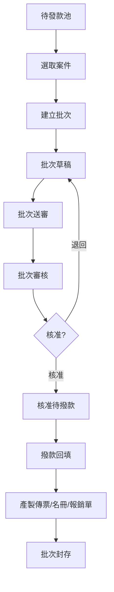

# 撥款管理

## 1. 功能概述

管理核准後補助案件的發款流程，含待發款池管理、發款批次建批/送審/核准/撥款回填，以及報銷單管理。

## 2. 頁面架構

### 待發款池（/admin/payment/pool）

```
+------------------------------------------+
|  待發款池                                 |
+------------------------------------------+
|  ┌──────────────────────────────────────┐ |
|  │ 可入批案件：12 筆，總金額 $240,000   │ |
|  │ [新增批次]                           │ |
|  └──────────────────────────────────────┘ |
|                                          |
|  ┌────┬──────┬──────┬──────┬──────┐     |
|  │案號 │類型  │申請人│金額  │核准日 │     |
|  ├────┼──────┼──────┼──────┼──────┤     |
|  │TP.. │結婚  │王小明│12,000│06/20 │     |
|  │TP.. │子女  │李四  │8,000 │06/19 │     |
|  │...  │      │      │      │      │     |
|  └────┴──────┴──────┴──────┴──────┘     |
+------------------------------------------+
```

### 發款批次列表（/admin/payment/batches）

```
+------------------------------------------+
|  發款批次                         [+新增] |
+------------------------------------------+
|  [全部] [草稿] [已送審] [已核准] [已撥款]  |
+------------------------------------------+
|  ┌──────┬────┬──────┬──────┬──────┬──┐  |
|  │批次號  │筆數│總金額│狀態  │建立日│操作│  |
|  ├──────┼────┼──────┼──────┼──────┼──┤  |
|  │B-006  │8   │120K │已核准│06/20 │[查看]│
|  │B-005  │5   │80K  │草稿  │06/18 │[編輯]│
|  └──────┴────┴──────┴──────┴──────┴──┘  |
+------------------------------------------+
```

### 批次詳情（/admin/payment/batches/[id]）

```
+------------------------------------------+
|  ← 發款批次    B-006   已核准 ✅          |
+------------------------------------------+
|  基本資訊                                |
|  福利社：臺北福利社   總金額：$120,000    |
|  建立人：王承辦     建立日：2026/06/20   |
|  傳票號碼：V-2026-001                    |
+------------------------------------------+
|  ┌────┬──────┬──────┬──────┬──────┬──┐  |
|  │案號 │申請人│金額  │明細狀態│領款狀態│操作│  |
|  ├────┼──────┼──────┼──────┼──────┼──┤  |
|  │TP.. │王小明│12,000│已撥付  │待確認  │   │
|  │TP.. │李四  │8,000 │已撥付  │已確認  │   │
|  └────┴──────┴──────┴──────┴──────┴──┘  |
|                                          |
|  [批次送審] [核准] [撥款回填] [產製傳票] |
|  [匯出名冊] [匯出報銷單]                 |
+------------------------------------------+
```

## 3. 頁面元素與 DB 欄位對應

| UI 元素 | 組件類型 | API/DB 對應 |
|---------|----------|-------------|
| 待發款案件表格 | DataTable | benefit_application (pending_payment_flag=true) |
| 新增批次 Button | Button | POST /payment/batches (批次建立) |
| 批次列表 | DataTable | payment_batch |
| 批次詳情 | DetailPanel | payment_batch + payment_batch_item |
| 明細狀態 | StatusBadge | payment_batch_item.status |
| 批次狀態 | StatusBadge | payment_batch.status |
| 批次送審 Button | Button | POST /payment/batches/{id}/submit |
| 核准 Button | Button | POST /payment/batches/{id}/approve |
| 撥款回填 Button | Button | POST /payment/batches/{id}/disburse |
| 產製傳票 Button | Button | POST /payment/batches/{id}/generate-voucher |
| 匯出名冊 Button | Button | GET /payment/batches/{id}/export-roster |
| 匯出報銷單 Button | Button | GET /payment/batches/{id}/export-reimbursement |

## 4. Shadcn UI 組件建議

| 組件 | 用途 | 備註 |
|------|------|------|
| `<DataTable>` (自訂) | 表格 | 待發款池/批次列表/批次明細 |
| `<Tabs>` | 批次狀態篩選 | 全部/草稿/送審/核准/撥款 |
| `<StatusBadge>` (自訂) | 批次/明細狀態 | - |
| `<Card>` | 批次摘要 | 總金額/筆數 |
| `<Button>` | 各項操作 | variant 區分 |
| `<ConfirmDialog>` (自訂) | 送審/核准確認 | - |
| `<Pagination>` | 分頁 | - |

## 5. 業務流程圖



## 6. 權限控管

| 角色 | 待發款池 | 建立批次 | 批次送審 | 核准 | 撥款回填 | 產製傳票 |
|------|----------|----------|----------|------|----------|----------|
| 承辦人 | 檢視 | ✓ | ✓ | - | - | - |
| 財務 | 檢視 | - | - | ✓ | ✓ | ✓ |
| 審核主管 | 檢視 | - | - | ✓ | - | - |

## 7. 相關頁面與路由

- 待發款池：/admin/payment/pool
- 發款批次列表：/admin/payment/batches
- 批次詳情：/admin/payment/batches/[id]
- 報銷單：/admin/payment/reimbursements
- 傳票管理：/admin/payment/vouchers
