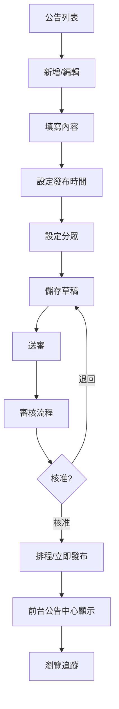

# 公告管理

## 1. 功能概述

管理端建立、編輯、送審、發布公告。支援分眾設定（region/branch/role）、發布排程、置頂設定與瀏覽統計。

## 2. 頁面架構

### 公告列表（/admin/announcements）

```
+------------------------------------------+
|  公告管理                          [+新增] |
+------------------------------------------+
|  [全部] [草稿] [待審核] [已發布] [已下架]   |
+------------------------------------------+
|  ┌──────┬──────┬──────┬──────┬──────┬──┐  |
|  │標題  │分類  │狀態  │發布日│瀏覽  │操作│  |
|  ├──────┼──────┼──────┼──────┼──────┼──┤  |
|  │子女..│福利  │已發布│06/20│156   │[編輯]│
|  │春節..│系統  │草稿  │-     │-     │[編輯]│
|  └──────┴──────┴──────┴──────┴──────┴──┘  |
+------------------------------------------+
```

### 公告編輯（/admin/announcements/[id]）

```
+------------------------------------------+
|  ← 公告列表    編輯公告                    |
+------------------------------------------+
|  標題：[___________________________]      |
|  分類：[福利資訊 v]                       |
|  內容：[Rich Text Editor]                 |
|                                          |
|  ┌── 發布設定 ────────────────────────┐  |
|  │  發布起始：[____/__/__ __:__]       │  |
|  │  發布結束：[____/__/__ __:__]       │  |
|  │  置頂：□                            │  |
|  └────────────────────────────────────┘  |
|                                          |
|  ┌── 分眾設定 ────────────────────────┐  |
|  │  範圍類型：[區域 v]                   │  |
|  │  範圍值：[臺北區 v] (可複選)         │  |
|  │  (或) 全體職工 □                     │  |
|  └────────────────────────────────────┘  |
|                                          |
|  [儲存草稿]  [送審]                      |
+------------------------------------------+
```

## 3. 頁面元素與 DB 欄位對應

| UI 元素 | 組件類型 | API/DB 對應 |
|---------|----------|-------------|
| 公告列表 | DataTable | announcement |
| 狀態篩選 | Tabs | announcement.status |
| 標題 Input | Input | announcement.title |
| 分類 Select | Select | announcement_category |
| 內容編輯器 | RichTextEditor | announcement.content |
| 發布起始時間 | DateTimePicker | announcement.publish_start_at |
| 發布結束時間 | DateTimePicker | announcement.publish_end_at |
| 置頂 Checkbox | Checkbox | announcement.is_pinned |
| 分眾範圍 Select | Select | announcement_audience_scope |
| 全體職工 Checkbox | Checkbox | scope_type = 'all' |
| 儲存草稿 Button | Button | PUT /announcements/{id} |
| 送審 Button | Button | POST /announcements/{id}/submit |

## 4. Shadcn UI 組件建議

| 組件 | 用途 | 備註 |
|------|------|------|
| `<DataTable>` (自訂) | 公告列表 | - |
| `<Tabs>` | 狀態篩選 | - |
| `<Input>` | 標題 | - |
| `<Select>` | 分類/分眾 | - |
| `<RichTextEditor>` (自訂) | 公告內容 | 基於 TipTap 或類似 |
| `<DateTimePicker>` (自訂) | 時間選擇 | 結合 Popover + Calendar |
| `<Checkbox>` | 置頂/全體 | - |
| `<Button>` | 儲存/送審 | - |
| `<Pagination>` | 分頁 | - |

## 5. 業務流程圖



## 6. 權限控管

- 承辦人：建立/編輯草稿、送審
- 審核主管：核准/退回公告
- 系統管理者：所有公告管理權限

## 7. 相關頁面與路由

- 公告列表：/admin/announcements
- 公告編輯：/admin/announcements/[id]（id=new 為新增）
