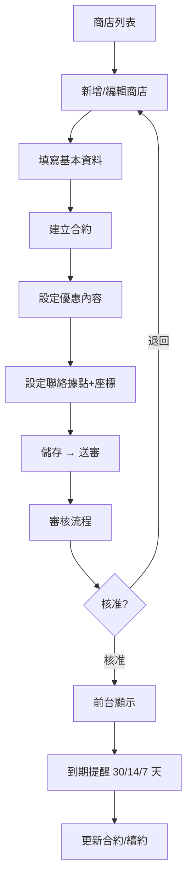

# 特約商店管理

## 1. 功能概述

管理端維護特約商店資料，含商店建檔、分類管理、合約維護、優惠設定、據點管理與到期提醒。

## 2. 頁面架構

### 商店列表（/admin/merchants）

```
+------------------------------------------+
|  特約商店管理                       [+新增] |
+------------------------------------------+
|  篩選列                                  |
|  分類：[全部 v]   狀態：[全部 v]           |
+------------------------------------------+
|  ┌──────┬──────┬──────┬──────┬──────┬──┐  |
|  │商店名稱│分類  │類型  │狀態  │合約到期│操作│  |
|  ├──────┼──────┼──────┼──────┼──────┼──┤  |
|  │欣欣診所│醫療  │單店  │啟用  │12/31  │[編輯]│
|  │臺鐵...│餐飲  │連鎖  │合約..│07/15  │[編輯]│
|  │...    │      │      │到期  │       │⚠  │
|  └──────┴──────┴──────┴──────┴──────┴──┘  |
+------------------------------------------+
```

### 商店編輯（/admin/merchants/[id]）

```
+------------------------------------------+
|  ← 商店列表   欣欣診所                     |
+------------------------------------------+
|  ┌── 基本資料 ────────────────────────┐  |
|  │  商店名稱：[欣欣診所]                │  |
|  │  商店代碼：[M-001]                   │  |
|  │  分類：[醫療保健 v]                   │  |
|  │  型態：[單店 v]                      │  |
|  └────────────────────────────────────┘  |
|                                          |
|  ┌── 合約管理 ────────────────────────┐  |
|  │  ┌──────┬──────┬──────┬──────┬──┐  │  |
|  │  │版本  │起始  │結束  │狀態  │操作│  │  |
|  │  ├──────┼──────┼──────┼──────┼──┤  │  |
|  │  │v3    │01/01 │12/31 │啟用  │[檢視]│  │  |
|  │  └──────┴──────┴──────┴──────┴──┘  │  |
|  │  [+ 新增合約]                        │  |
|  └────────────────────────────────────┘  |
|                                          |
|  ┌── 優惠內容 ────────────────────────┐  |
|  │  [掛號費減免 50 元] [編輯] [刪除]    │  |
|  │  [+ 新增優惠]                        │  |
|  └────────────────────────────────────┘  |
|                                          |
|  ┌── 聯絡據點 ────────────────────────┐  |
|  │  📍 臺北市大安區... [編輯] [刪除]    │  |
|  │  [+ 新增據點]  [地圖預覽]            │  |
|  └────────────────────────────────────┘  |
|                                          |
|  [儲存]  [送審]                          |
+------------------------------------------+
```

## 3. 頁面元素與 DB 欄位對應

| UI 元素 | 組件類型 | API/DB 對應 |
|---------|----------|-------------|
| 商店列表 | DataTable | contract_merchant |
| 分類管理 Button | Button | → /admin/merchants/categories |
| 商店名稱 Input | Input | contract_merchant.merchant_name |
| 分類 Select | Select | merchant_category |
| 型態 Select | Select | contract_merchant.merchant_type |
| 合約表格 | Table | merchant_contract |
| 新增合約 Dialog | Dialog | merchant_contract create form |
| 優惠 Card | Card | merchant_benefit |
| 優惠編輯 Dialog | Dialog | merchant_benefit form |
| 據點 Card | Card | merchant_contact_point |
| 據點編輯 Dialog | Dialog | 含地址/座標/營業時間 |
| 據點地圖預覽 | MapContainer | 第三方地圖 |
| 儲存 Button | Button | PUT /merchants/{id} |
| 送審 Button | Button | POST /merchants/{id}/submit |

## 4. Shadcn UI 組件建議

| 組件 | 用途 | 備註 |
|------|------|------|
| `<DataTable>` (自訂) | 商店列表 | - |
| `<SearchFilterBar>` (自訂) | 篩選 | 分類/狀態 |
| `<Tabs>` (於編輯頁) | 基本資料/合約/優惠/據點 | - |
| `<Form>` | 商店/合約/優惠/據點表單 | - |
| `<Input>` | 文字輸入 | - |
| `<Select>` | 分類/型態選擇 | - |
| `<DatePicker>` | 合約起訖日期 | - |
| `<Dialog>` | 新增/編輯子表單 | 合約/優惠/據點 |
| `<Table>` | 合約列表 | - |
| `<Card>` | 優惠/據點卡片 | - |
| `<Button>` | 操作按鈕 | - |
| `<MapContainer>` (自訂) | 據點地圖預覽 | - |
| `<Badge>` | 到期提醒 | variant 區分 |

## 5. 業務流程圖



## 6. 權限控管

- 承辦人：維護商店資料、送審
- 審核主管：核准/退回商店

## 7. 相關頁面與路由

- 商店列表：/admin/merchants
- 商店編輯：/admin/merchants/[id]
- 分類管理：/admin/merchants/categories
