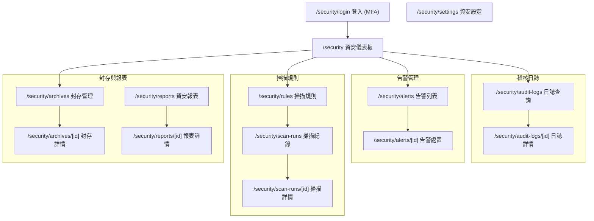

# 稽核系統後台 Sitemap

## 路由架構圖

## 各頁面摘要

| 路由 | 標題 | 角色 |
|------|------|------|
| /security/login | 資安後台登入 | 未登入 |
| /security | 資安儀表板 | 稽核者/管理者 |
| /security/audit-logs | 稽核日誌查詢 | 稽核者 |
| /security/audit-logs/[id] | 日誌詳情 | 稽核者 |
| /security/alerts | 告警列表 | 稽核者 |
| /security/alerts/[id] | 告警處置 | 稽核者 |
| /security/rules | 掃描規則 | 稽核者/管理者 |
| /security/scan-runs | 掃描紀錄 | 稽核者 |
| /security/scan-runs/[id] | 掃描詳情 | 稽核者 |
| /security/archives | 封存管理 | 稽核者/管理者 |
| /security/archives/[id] | 封存包詳情 | 稽核者/管理者 |
| /security/reports | 資安報表 | 稽核者/管理者 |
| /security/reports/[id] | 報表詳情 | 稽核者/管理者 |
| /security/settings | 資安設定 | 系統管理者 |
