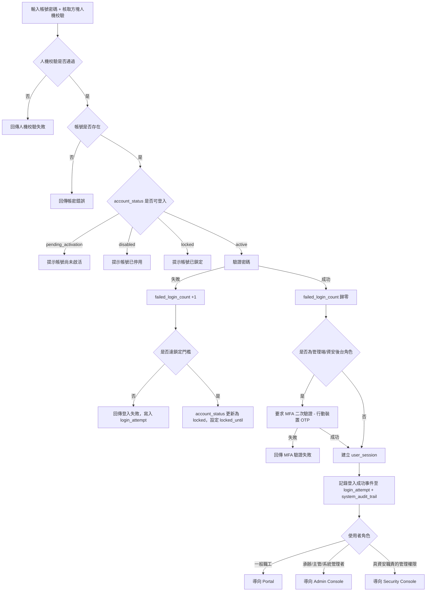
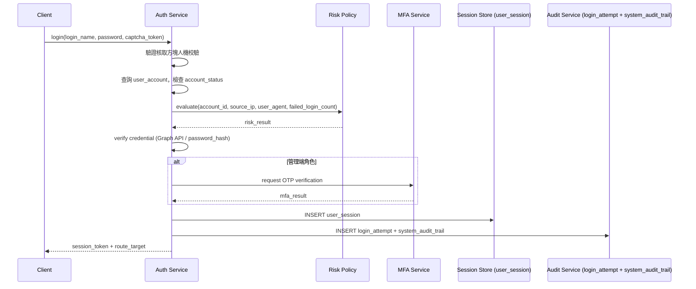
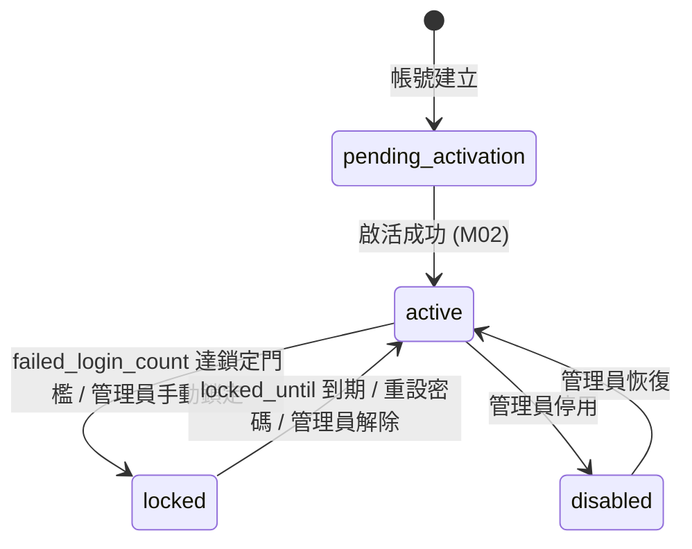
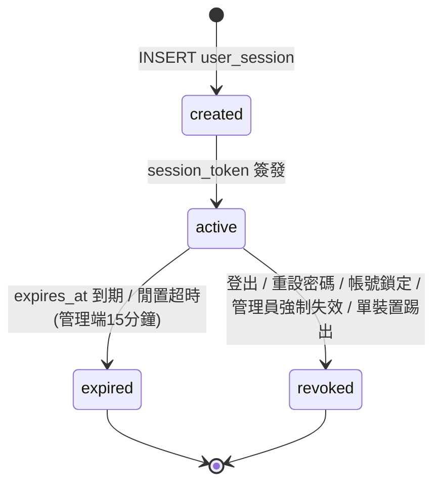

# M01《AUTH－登入與帳號安全》子 PRD

> 來源註記：本文件保留既有模塊拆分方式。凡文中未被客戶原始 PRD 明文定義的欄位、狀態碼、流程抽象或工程命名，均視為內部設計建議，不作為客戶權威需求表述。
>
> 對齊口徑：本文件已按主 PRD `v1.1` 與 `sql/tra_welfare_platform.sql` `v3.0-full` 收斂；凡提及身份來源、Session、鎖定、欄位命名與治理表，均以「當前系統實作」為準，不等同客戶原始需求原文。

---

[toc]

---

## 1. 模塊名稱

AUTH－登入與帳號安全

## 2. 模塊類型

底層能力模塊

## 3. 模塊定位

本模塊是整個臺鐵職工福利平台的身份入口與第一道安全閘門，負責處理使用者登入驗證、風險判斷、人機校驗、登入失敗計數、帳號鎖定、Session 建立與失效，以及高風險登入事件的稽核回傳。客戶原始 PRD 對登入主軸的要求其實相當明確：正式同仁以 Microsoft Graph API 驗證為主，無 Outlook 帳號的部分工時人員才使用內部帳號；平台不得保存正式同仁個人密碼；登入時導入核取方塊式之非機器人行為校驗；管理端強制啟用多因子驗證（MFA），管理帳號限制單一裝置登入，並設定閒置 15 分鐘強制自動登出。

<!-- 修改說明：原文聲稱「連續失敗3次觸發Captcha」和「opaque token」為總體PRD明確要求，但總體PRD原文未使用這些具體術語。已改為引用總體PRD實際措辭。新增MFA、單裝置登入、15分鐘自動登出等總體PRD第五章明確要求。 -->

## 4. 設計目標

本模塊設計目標有五個：

1. 統一平台所有入口的登入行為，支撐前台 Portal、管理後台 Admin Console、資安後台 Security Console 的身份進入。總體 PRD 的角色入口圖已明確三類入口皆從登入頁開始分流。
2. 降低弱密碼、暴力嘗試、異常來源登入帶來的風險，將登入安全與帳號狀態治理制度化。
3. 以 Session 為中心建立後續授權、通知、稽核與安全掃描的基礎能力，讓登入不只是驗證成功，而是安全上下文的建立。
4. 對齊客戶原始驗證邏輯：正式同仁走 Microsoft Graph API，部分工時人員走內部帳號；同時保留身份綁定與後續擴充邊界，但不把「Local-first」寫成客戶需求。
5. 對管理端入口實施增強安全控制：強制 MFA 二次驗證、單一裝置登入限制、閒置自動登出，符合總體 PRD 第五章的明確要求。

<!-- 修改說明：新增第5點，對應總體PRD第五章 5.2/5.3 對管理端的安全要求。 -->

## 5. 業務場景

### 場景 A：一般職工登入前台

一般職工完成身分驗證後進入前台 Portal；正式同仁應走 Microsoft Graph API 驗證，無 Outlook 帳號者才走內部帳號驗證。登入時需通過核取方塊式人機校驗。登入後仍須先完成資料完整性檢查，才能進入補助申請等核心功能。

<!-- 修改說明：補充總體PRD要求的核取方塊式人機校驗。 -->

### 場景 B：承辦/主管/管理員登入管理後台

福利社承辦人、審核主管與系統管理員登入成功後，須額外通過 MFA 二次驗證（行動裝置 OTP 動態驗證碼），方可進入管理後台。管理帳號僅允許單一裝置登入，閒置超過 15 分鐘須強制自動登出。進入後由 ORG 模塊做功能權限與資料範圍判定。AUTH 只解決「能否進入」與「身份可信度」，不直接決定某頁面是否可操作。

<!-- 修改說明：新增MFA、單裝置登入、15分鐘閒置登出要求，對應總體PRD第五章 5.2「後台開放性存取控制：管理端入口雖開放於互聯網，但必須強制啟用多因子驗證(MFA)」及 5.3「系統須設定『強制自動登出』時間（如靜置15分鐘），並限制同一管理帳號僅能由單一裝置登入」。 -->

### 場景 C：具資安職責的管理人員登入資安後台

具資安職責的管理人員登入後，同樣須通過 MFA 驗證，進入 Security Console 查看高風險事件、告警與掃描結果。若登入過程本身具有異常特徵，也應成為 SEC 模塊的稽核輸入。總體 PRD 已將「異常登入」列為應寫入稽核日誌並視情況觸發告警的事件類型。

### 場景 D：異常登入風險處理

當使用者連續登入失敗次數達到系統設定門檻，或登入來源具備高風險特徵，系統需在登入流程中加強人機校驗；若風險繼續上升，則應進一步鎖定帳號、阻擋會話建立，並寫入稽核日誌。總體 PRD 要求平台導入非機器人行為校驗以防範自動化攻擊，具體的失敗次數門檻值（如 3 次）屬工程細化建議。

<!-- 修改說明：原文聲稱「連續失敗3次觸發Captcha」為總體PRD直接規定，實際上總體PRD僅要求「導入核取方塊式之非機器人行為校驗」，具體門檻值為工程建議。已修正來源歸屬。 -->

## 6. 業務流程解讀

### 6.1 主流程解讀

AUTH 的主流程不是單純的「帳密比對」，而是「人機校驗 → 身份驗證 → 風險判斷 → 會話建立 → MFA（管理端） → 入口分流 → 稽核留痕」流程。
這樣設計的原因是，平台不只有前台職工，也有管理員與資安人員；不同入口對風險承受度不同，但統一都從 AUTH 出發。

### 6.2 建議登入流程

<!-- 修改說明：(1)新增核取方塊人機校驗為登入流程第一步，對應總體PRD；(2)帳號狀態判斷改用DB ENUM實際值 pending_activation/disabled/locked/active；(3)新增管理端MFA流程，對應總體PRD 5.3；(4)鎖定流程補充locked_until欄位；(5)稽核記錄明確寫入 login_attempt + system_audit_trail 兩張表。 -->

### 6.3 流程說明

1. 登入頁始終顯示核取方塊式人機校驗（總體 PRD 明確要求）。
2. 先校驗帳號是否存在與 `user_account.account_status` 是否可登入（`active` 方可繼續）。
3. 密碼校驗成功後，若為管理端或資安後台角色，需額外通過 MFA 二次驗證（總體 PRD 5.3 明確要求）。
4. 驗證通過後於 `user_session` 表建立會話記錄，簽發 `session_token`，不把可解讀資訊暴露給前端。
5. 依角色身份導向對應入口。
6. 登入成功、登入失敗、人機校驗失敗、帳號鎖定等事件同步寫入 `login_attempt` 表與 `system_audit_trail` 表。

## 7. 核心功能拆解

### 7.1 登入驗證

提供混合登入能力：正式同仁以 Microsoft Graph API 驗證為主（平台不留存其密碼）；無 Outlook 帳號的部分工時人員使用內部帳號與密碼（以 `password_hash` 不可逆雜湊存儲）。登入成功後建立 session；登入失敗後更新失敗計數。若後續需要更多身份提供者整合，應透過 `auth_provider` 與 `account_identity_binding` 表擴展，而不是把目前的正式同仁登入誤寫成 Local-first。

> **資料庫映射：**
> - 主表：`user_account`（AUTH-01）— 存儲帳號、密碼雜湊、狀態、失敗計數
> - 記錄表：`login_attempt`（AUTH-03）— 記錄每次登入嘗試的結果、來源 IP、User Agent
> - 身份綁定：`auth_provider`（AUTH-05）+ `account_identity_binding`（AUTH-06）— 管理 local/outlook/azure_ad 等多身份來源
> - 關聯表：`employee`（EMP-01）— 透過 `user_account.employee_id` 關聯員工主檔

### 7.2 人機校驗與風險觸發

總體 PRD 明確要求登入時「導入核取方塊式之非機器人行為校驗，有效防範自動化程式攻擊」。此校驗應作為登入流程的固定環節。

子 PRD 工程細化建議：當連續失敗次數達到系統設定門檻（建議值 3 次，由 `user_account.failed_login_count` 追蹤），或登入來源具備高風險特徵時，可在核取方塊基礎上加強驗證強度（如圖形驗證碼）。「高風險來源」建議抽象成風險策略介面，首版可先支持固定規則，例如異常 IP、短時間多次嘗試、裝置指紋異常；之後再擴充更細策略。

<!-- 修改說明：原文聲稱「連續失敗3次」和「高風險來源觸發Captcha」均為總體PRD直接規定，實際上總體PRD僅要求核取方塊式校驗。已將門檻值歸類為工程建議，並區分基礎校驗（總體PRD要求）與增強校驗（工程細化）。 -->

> **資料庫映射：**
> - `user_account.failed_login_count`（INT）— 連續登入失敗次數計數器
> - `login_attempt.captcha_passed`（TINYINT）— 記錄該次登入是否通過人機驗證
> - `login_attempt.login_result` ENUM 含 `captcha_failed` — 區分人機校驗失敗與帳密錯誤

### 7.3 帳號狀態控制

AUTH 模塊需識別以下帳號狀態，對應 `user_account.account_status` 的 ENUM 定義：

- `pending_activation`：帳號已建立但尚未啟活，不可登入
- `active`：可正常登入
- `disabled`：被管理員停用，不可登入
- `locked`：因安全原因被鎖定，不可登入；鎖定到期時間記錄於 `locked_until`

<!-- 修改說明：原文使用 inactive 狀態，但資料庫 ENUM 實際為 pending_activation/active/disabled/locked 四值。inactive 不存在於 DB。已修正為與 user_account.account_status ENUM 完全一致。 -->

> **資料庫映射：**
> - `user_account.account_status` ENUM(`pending_activation`, `active`, `disabled`, `locked`)
> - `user_account.locked_until`（DATETIME）— 鎖定到期時間，支持限時鎖定自動解除

### 7.4 Session 建立與管理

登入驗證成功後（管理端須額外通過 MFA），系統於 `user_session` 表建立會話記錄。`session_token` 採用不可前端解析的長隨機字串（VARCHAR(512)），會話狀態由服務端控制。

子 PRD 細化為：

- 登入成功後簽發唯一 `session_token`，記錄於 `user_session` 表
- Session 綁定 `account_id`、`device_info`、`source_ip`、`expires_at`
- 支持 `refresh_token` 機制以延續會話
- 登出時將 `is_revoked` 設為 1，主動失效
- 密碼重設成功、帳號鎖定、管理員停用帳號時，需批量將該帳號所有未撤銷 Session 的 `is_revoked` 設為 1
- 管理端帳號閒置超過 15 分鐘須強制自動登出（總體 PRD 5.3 明確要求）
- 管理端帳號僅允許單一裝置登入；新裝置登入時須撤銷既有 Session（總體 PRD 5.3 明確要求）
- 後續 API 以 Session 中介層驗證當前身份

<!-- 修改說明：(1)欄位名稱修正：expired_at→expires_at，last_active_at 在DB中不存在已移除，補充 device_info/source_ip/refresh_token/is_revoked 等實際DB欄位；(2)新增管理端15分鐘閒置登出和單裝置登入要求，對應總體PRD 5.3。 -->

> **資料庫映射：**
> - 主表：`user_session`（AUTH-02）
> - 關鍵欄位：`session_token`（VARCHAR(512), UNIQUE）、`refresh_token`、`device_info`、`source_ip`、`expires_at`、`is_revoked`
> - 索引：`uk_session_token`（唯一）、`idx_session_account`（帳號查詢）、`idx_session_expires`（過期清理）
> - FK：`account_id` → `user_account(account_id)`

### 7.5 高風險事件留痕

登入失敗、連續錯誤、帳號鎖定、異常來源登入、敏感入口登入成功等事件，都應寫入稽核記錄。總體 PRD 明確要求「完整記錄使用者登入、資料存取、申請單異動、權限變更等行為，包含 Event ID、操作時間、執行人員、來源 IP 與狀態碼」，且日誌須保存至少 3 年並具備完整性校驗機制。

> **資料庫映射：**
> - 登入層紀錄：`login_attempt`（AUTH-03）— 記錄每一次登入嘗試，含 `login_result` ENUM(`success`, `failed`, `captcha_failed`, `locked`)、`source_ip`、`user_agent`
> - 全域稽核：`system_audit_trail`（SEC-01）— 高風險登入事件同步寫入，含 `action_code`、`result_code`、`severity_level`、`detail_json`

### 7.6 入口分流

登入成功後按身份導向：

- 一般職工 → Portal
- 福利社承辦人 / 審核主管 / 系統管理員 → Admin Console
- 具資安職責之管理權限 → Security Console

此分流邏輯應回到原始 PRD 的管理角色與後台區塊設計理解，而不是額外擴充新的客戶角色。總體 PRD 的角色權限矩陣定義了系統管理者、管理者、審閱者、使用者四大角色，以及各角色對各模組的瀏覽/編輯權限。

> **資料庫映射：**
> - 角色判定依據來自 ORG 模塊的角色指派表，AUTH 僅負責將已驗證的 `account_id` 傳遞給 ORG 進行角色解析
> - `user_account.employee_id` → `employee(employee_id)` → ORG 角色指派

### 7.7 管理端多因子驗證（MFA）

總體 PRD 第五章 5.2/5.3 明確要求：「管理入口雖對外開放，但系統必須具備多因子驗證（MFA）機制。管理員登入時，除基本帳號密碼外，須透過行動裝置（如 OTP 動態簡訊或訊息認證碼）進行二次驗證，以防止駭客利用暴力破解或竊取管理憑證入侵。」

子 PRD 細化為：

- 管理端與資安後台角色在密碼驗證成功後，須額外完成 MFA
- MFA 方式：行動裝置 OTP 動態驗證碼
- MFA 驗證失敗不建立 Session，視同登入未完成
- MFA 事件（成功/失敗）寫入 `login_attempt` 與 `system_audit_trail`

<!-- 修改說明：新增本節。原子PRD完全缺失MFA相關描述，但總體PRD 5.2/5.3 對管理端MFA有明確且強制的要求。 -->

> **資料庫映射：**
> - MFA 驗證紀錄可複用 `login_attempt` 表（以 `login_result` 區分階段），或視實作需要另建 MFA 驗證表
> - MFA 的 OTP 機制可參考 `account_activation_request`（AUTH-04）的 `otp_code_hash`、`otp_expires_at`、`otp_attempt_count` 設計模式

## 8. 與其他模塊的聯動關係

### 8.1 與 ORG 的聯動

AUTH 負責「認證」，ORG 負責「授權」。
AUTH 產出登入身份與當前 Session，ORG 再基於角色、功能權限、資料範圍做是否可看、可編輯、可審批的判定。總體 PRD 也已把 ORG 定義為組織、角色、功能權限與資料範圍的治理中樞。

### 8.2 與 EMP 的聯動

AUTH 中的帳號透過 `user_account.employee_id` 外鍵綁定員工身份主檔 `employee` 表，可關聯 `employee_id`、`employee_no`、`full_name` 等核心字段。總體 PRD 的員工與帳號字段區也把這些帳號/員工字段放在同一組高頻詞彙中。首次登入後的資料完整性檢查（`employee.contact_profile_completed`）亦依賴此關聯。

<!-- 修改說明：補充實際DB外鍵關係和 contact_profile_completed 欄位引用。 -->

### 8.3 與 SYS 的聯動

人機校驗開關、風險策略閾值、Session TTL、鎖定時長、MFA 開關、閒置登出時長、通知模板等，建議全部走 SYS 字典/參數治理，而不是硬編碼。這也符合總體 PRD 的系統治理原則：狀態與配置應由系統字典和參數驅動。

### 8.4 與 SEC 的聯動

AUTH 是 SEC 的上游高風險事件來源之一。異常登入、失敗登入、帳號鎖定都屬 `auth` 類規則輸入；高風險事件要同步寫入 `system_audit_trail` 表，必要時觸發安全告警（寫入 `security_alert` 表）。這是總體 PRD 對 SEC 的明確要求。

### 8.5 與後續 M02 的聯動

本模塊只處理「登入與安全」，不展開帳號啟活、忘記密碼、SSO 綁定的具體流程細節，這些內容在下一份子 PRD M02 詳寫。對應資料庫表 `account_activation_request`（AUTH-04）的業務邏輯由 M02 負責。本模塊只定義它們與登入的邊界：

- 啟活成功後 `account_status` 由 `pending_activation` 變為 `active`，方可登入
- 重設密碼成功後需批量撤銷既有 Session（`user_session.is_revoked` = 1）
- SSO 綁定成功後透過 `account_identity_binding` 表建立新的身份來源關聯

## 9. 頁面規劃

本模塊不是頁面模塊，但仍涉及 1 個共用登入頁與 2 個狀態輔助頁，建議簡要規劃如下。

### 9.1 登入頁

區塊結構：

1. 平台 Logo 與名稱
2. 帳號輸入框（Outlook Email 格式）
3. 密碼輸入框
4. 核取方塊式人機校驗區塊（始終顯示，總體 PRD 明確要求）
5. 登入按鈕
6. 忘記密碼入口
7. 帳號啟活入口
8. 錯誤提示區

<!-- 修改說明：(1)Captcha區塊改為始終顯示的核取方塊式，對應總體PRD「導入核取方塊式之非機器人行為校驗」；(2)帳號輸入框標註Outlook Email格式，對應總體PRD「使用者輸入完整的員工帳號（Outlook Email）」。 -->

交互規則：

- 登入頁始終顯示核取方塊式人機校驗（總體 PRD 要求）
- 登入中按鈕置灰，避免重複提交
- 錯誤訊息避免透露「帳號不存在」或「密碼錯誤」的差異過細內容，前台統一顯示為「帳號或密碼錯誤」
- 管理端角色密碼驗證成功後，彈出 MFA OTP 驗證步驟

### 9.2 鎖定提示頁/彈窗

當帳號 `account_status` = `locked` 時，需顯示：

- 當前狀態：帳號已鎖定
- 建議動作：稍後再試 / 聯絡管理員 / 進行密碼重設
- 不顯示內部風險規則細節

### 9.3 會話失效提示

當 session 過期（`expires_at` 已過）、被撤銷（`is_revoked` = 1）、密碼重設導致失效時：

- 顯示「登入已過期，請重新登入」
- 支援返回登入頁
- 不保留敏感頁面內容

## 10. 底層能力說明

### 10.1 能力邊界

本模塊負責：

- 帳號登入驗證（含 Microsoft Graph API 分流）
- 人機校驗
- 管理端 MFA 二次驗證
- Session 建立、刷新、失效
- 登入安全事件稽核輸出
- 成功後入口分流

本模塊不負責：

- 功能權限與資料範圍判定（ORG）
- 業務表單合法性（BEN / PAY / ANN / MCH）
- 通知模板內容管理（SYS）
- 啟活 / 重設密碼 / SSO 綁定細流程（M02）

### 10.2 輸入輸出

**輸入**

- `login_name`：登入帳號（對應 `user_account.login_name`）
- `password`：密碼
- `captcha_token`：核取方塊式人機校驗 Token
- `login_context`：`source_ip`、`user_agent`、`device_info`、`request_time`
- `mfa_otp`：MFA 動態驗證碼（管理端，條件性）

<!-- 修改說明：(1)account 改為 login_name 以對齊 DB 欄位；(2)login_context 內的欄位名改為 DB 實際使用的名稱；(3)新增 mfa_otp 輸入；(4)captcha_token 改為始終必需。 -->

**輸出**

- `login_result`：`success` / `failed` / `captcha_failed` / `locked`（對應 `login_attempt.login_result` ENUM）
- `session_token`（對應 `user_session.session_token`）
- `session_expires_at`（對應 `user_session.expires_at`）
- `user_identity_summary`
- `route_target`：portal / admin / security_console
- `mfa_required`：布林值，指示是否需要 MFA 二次驗證

<!-- 修改說明：login_result 的值改為與 login_attempt.login_result ENUM 完全一致：success/failed/captcha_failed/locked。原文的 fail/captcha_required/inactive 均不存在於 DB ENUM。 -->

### 10.3 建議能力接口

## 11. 角色權限與操作路徑

### 11.1 可使用角色

總體 PRD 定義四大角色類型：

- 使用者（一般職工）
- 審閱者（審核主管）
- 管理者（福利社承辦人、公告管理員）
- 系統管理者（主任委員、總幹事、資訊管理者）

以上皆來自總體 PRD 第三章 2.2 節角色權限矩陣。其中身分可多重存在（總體 PRD：「使用者同時可為審閱者，也可另搭配管理者的多重身分」）。

### 11.2 操作路徑

- 前台使用者：登入頁 → 人機校驗 → AUTH 驗證 → Portal
- 後台作業人員：登入頁 → 人機校驗 → AUTH 驗證 → MFA → Admin Console
- 資安人員：登入頁 → 人機校驗 → AUTH 驗證 → MFA → Security Console

### 11.3 特殊權限說明

AUTH 不做細粒度功能授權，但需支援：

- `account_status` = `disabled` 的帳號不可登入
- `account_status` = `locked` 的帳號不可登入
- `account_status` = `pending_activation` 的帳號不可登入，引導至啟活流程
- 資安/管理員可查詢特定高風險登入歷程（實際查詢頁在 SEC，資料來源為 `login_attempt` 與 `system_audit_trail`）

## 12. 關鍵字段/配置項說明

### 12.1 核心字段（按資料庫表組織）

以下字段以 `sql/tra_welfare_platform.sql` 的實際表結構為準。

**`user_account` 表（AUTH-01：系統登入帳號）**

| DB 字段名                  | 類型            | 中文名稱         | 用途                       | 備註                                              |
| -------------------------- | --------------- | ---------------- | -------------------------- | ------------------------------------------------- |
| `account_id`               | BIGINT UNSIGNED | 帳號主鍵         | 主鍵，自增                 | PK                                                |
| `employee_id`              | BIGINT UNSIGNED | 員工 ID          | 帳號綁定員工主鍵           | FK → `employee(employee_id)`                      |
| `login_name`               | VARCHAR(150)    | 登入帳號         | 登入識別（Outlook Email）  | UNIQUE                                            |
| `email`                    | VARCHAR(255)    | 登入信箱         | 通知與 OTP 送達            |                                                   |
| `password_hash`            | VARCHAR(255)    | 密碼雜湊         | 不可逆雜湊，部分工時人員用 | 正式同仁走 Graph API，此欄位可為空值佔位          |
| `account_status`           | ENUM            | 帳號狀態         | 控制是否允許登入           | `pending_activation`/`active`/`disabled`/`locked` |
| `last_login_at`            | DATETIME        | 最後登入時間     | 安全審計與閒置判斷         |                                                   |
| `last_password_changed_at` | DATETIME        | 最後修改密碼時間 | 密碼策略判斷               |                                                   |
| `failed_login_count`       | INT             | 連續登入失敗次數 | 人機校驗增強/鎖定策略判斷  | DEFAULT 0                                         |
| `locked_until`             | DATETIME        | 鎖定到期時間     | 限時鎖定自動解除           |                                                   |

<!-- 修改說明：完全重構核心字段表。原表混入了不屬於 user_account 的欄位（如 session_token 屬於 user_session、identity_provider 不存在於 user_account），account_status 值使用了不存在的 inactive。現改為嚴格按 DB 表結構組織。 -->

**`user_session` 表（AUTH-02：使用者會話）**

| DB 字段名       | 類型            | 中文名稱      | 用途                 | 備註                |
| --------------- | --------------- | ------------- | -------------------- | ------------------- |
| `session_id`    | BIGINT UNSIGNED | 會話主鍵      | PK                   |                     |
| `account_id`    | BIGINT UNSIGNED | 帳號 ID       | 關聯帳號             | FK → `user_account` |
| `session_token` | VARCHAR(512)    | Session Token | 服務端不可解析 Token | UNIQUE              |
| `refresh_token` | VARCHAR(512)    | Refresh Token | 會話延續             |                     |
| `device_info`   | VARCHAR(255)    | 裝置資訊      | 裝置識別與單裝置控制 |                     |
| `source_ip`     | VARCHAR(64)     | 來源 IP       | 安全審計             |                     |
| `expires_at`    | DATETIME        | 過期時間      | Session TTL          | NOT NULL            |
| `is_revoked`    | TINYINT(1)      | 是否已撤銷    | 登出/強制失效        | DEFAULT 0           |

**`login_attempt` 表（AUTH-03：登入嘗試紀錄）**

| DB 字段名          | 類型            | 中文名稱         | 用途                      | 備註                                         |
| ------------------ | --------------- | ---------------- | ------------------------- | -------------------------------------------- |
| `login_attempt_id` | BIGINT UNSIGNED | 登入紀錄主鍵     | PK                        |                                              |
| `account_id`       | BIGINT UNSIGNED | 對應帳號         | 可為 NULL（帳號不存在時） | FK → `user_account`                          |
| `login_name`       | VARCHAR(150)    | 嘗試登入帳號     | 原始輸入記錄              | NOT NULL                                     |
| `login_result`     | ENUM            | 登入結果         | 稽核與統計                | `success`/`failed`/`captcha_failed`/`locked` |
| `captcha_passed`   | TINYINT(1)      | 是否通過人機驗證 | 區分人機校驗狀態          | DEFAULT 0                                    |
| `source_ip`        | VARCHAR(64)     | 來源 IP          | 安全審計                  |                                              |
| `user_agent`       | VARCHAR(500)    | 瀏覽器資訊       | 裝置與環境識別            |                                              |
| `login_at`         | DATETIME        | 登入時間         | 時序追蹤                  | DEFAULT CURRENT_TIMESTAMP                    |

### 12.2 關聯表字段參考

以下表由其他模塊主責，但 AUTH 有讀取或寫入需求：

**`employee` 表（EMP-01）AUTH 相關欄位：**
- `employee_id`（PK）— 帳號綁定主鍵
- `employee_no`（VARCHAR(50), UNIQUE）— 員工編號
- `full_name`（VARCHAR(100)）— 員工姓名，登入後展示
- `employment_status` ENUM(`active`, `leave`, `retired`, `suspended`)— 在職狀態，可作為登入資格的輔助判斷
- `contact_profile_completed`（TINYINT(1)）— 首次登入資料完整性檢查標記

**`auth_provider` 表（AUTH-05）：**
- `provider_code`（VARCHAR(50), UNIQUE）— 身份提供者代碼：`local`/`outlook`/`azure_ad`/`ldap`
- `protocol_type` ENUM(`local`, `oauth2`, `oidc`, `saml`, `ldap`)

**`account_identity_binding` 表（AUTH-06）：**
- `account_id` FK → `user_account` + `auth_provider_id` FK → `auth_provider`
- `external_subject`（VARCHAR(255)）— 外部 subject/object ID
- `is_primary`（TINYINT(1)）— 是否主要身份來源

**`system_audit_trail` 表（SEC-01）AUTH 寫入欄位：**
- `action_code`（VARCHAR(100)）— 操作代碼（login_success / login_failed / account_locked 等）
- `result_code` ENUM(`success`, `warning`, `failed`, `blocked`)
- `severity_level` ENUM(`info`, `low`, `medium`, `high`, `critical`)

<!-- 修改說明：(1)原12.2為「建議新增字段」，其中 last_login_at 已存在於 user_account，session_expired_at 對應 user_session.expires_at，device_fingerprint 對應 user_session.device_info，不應列為「新增建議」。(2)原文的 identity_provider 欄位不存在於 user_account 表，DB 採用 auth_provider + account_identity_binding 正規化設計，已重新描述。(3)改為「關聯表字段參考」，列出 AUTH 模塊需要讀寫的跨模塊表。 -->

### 12.3 建議配置項

建議由 SYS 管理：

- `auth.captcha.enabled` = true（核取方塊式人機校驗，預設啟用）
- `auth.captcha.enhanced_threshold` = 3（連續失敗後加強驗證的門檻，工程建議值）
- `auth.lock.fail_threshold` = 5 或 10（鎖定門檻，待業務確認）
- `auth.lock.duration_minutes`（鎖定時長，對應 `locked_until` 計算）
- `auth.session.ttl.portal`
- `auth.session.ttl.admin`
- `auth.session.ttl.security_console`
- `auth.session.idle_timeout.admin` = 15（管理端閒置自動登出分鐘數，總體 PRD 明確要求）
- `auth.mfa.enabled` = true（管理端 MFA，總體 PRD 明確要求）
- `auth.mfa.otp_ttl_seconds`（MFA OTP 有效秒數）
- `auth.admin.single_device` = true（管理帳號單裝置登入，總體 PRD 明確要求）
- `auth.risk.ip_whitelist`
- `auth.risk.ip_blocklist`
- `auth.audit.high_risk_sync_enabled`

<!-- 修改說明：新增 idle_timeout、mfa、single_device 等配置項，對應總體PRD第五章要求。 -->

## 13. 異常情況與邊界條件

### 13.1 帳密正確但帳號停用/未啟活

不允許登入。若 `account_status` = `disabled`，提示「帳號目前不可使用」；若 `account_status` = `pending_activation`，引導至啟活流程。提示統一避免洩漏內部狀態過多。

### 13.2 連續登入失敗達門檻

工程建議：當 `user_account.failed_login_count` 達到系統設定門檻值（建議 3 次），在核取方塊基礎上加強人機校驗。總體 PRD 要求平台具備非機器人行為校驗能力，具體門檻值由系統參數 `auth.captcha.enhanced_threshold` 控制。

<!-- 修改說明：原文聲稱「連續失敗3次觸發Captcha」為總體PRD明確要求，已修正來源歸屬。 -->

### 13.3 高風險來源但首次登入

即使首次登入失敗次數尚未到門檻，若來源具備高風險特徵，也可加強人機校驗。此邏輯為工程細化建議，符合總體 PRD 防範自動化攻擊的精神。

<!-- 修改說明：原文聲稱此邏輯「來自總體PRD」，實際上總體PRD未明確區分風險來源觸發條件。已修正來源歸屬。 -->

### 13.4 人機校驗失敗

不進入帳密校驗階段；寫入 `login_attempt` 表，`login_result` = `captcha_failed`，與帳密錯誤（`failed`）分開記錄，便於 SEC 判斷是機器人流量還是使用者失誤。

### 13.5 Session 過期

使用者再次訪問時檢查 `user_session.expires_at`，若已過期需重新登入；管理端另需檢查閒置時間，超過 15 分鐘（`auth.session.idle_timeout.admin`）須強制登出。後台高風險頁面過期後不允許繼續停留並提交。

### 13.6 多端登入

總體 PRD 第五章 5.3 明確要求：「限制同一管理帳號僅能由單一裝置登入，防止管理權限遭濫用。」因此：

- **管理端/資安後台帳號：** 強制單裝置登入。新裝置登入時，系統自動將該 `account_id` 下所有既有未撤銷 Session 的 `is_revoked` 設為 1，並通知原裝置「您的帳號已在其他裝置登入」。
- **前台一般職工帳號：** 總體 PRD 未限制是否允許多端共存，建議先採「允許多 Session 共存，但支援管理端強制失效全部 Session」的方案。

<!-- 修改說明：原文稱「總體PRD未限制是否允許多端共存」，但總體PRD 5.3 明確要求管理帳號單裝置登入。已修正：管理端強制單裝置，前台允許多端。 -->

### 13.7 權限變更後既有 Session

當 ORG 中的角色/資料範圍調整時，若採 Session 快取角色摘要，需支援：

- 即時刷新
  或
- 下次請求重新拉取授權上下文
  否則會出現登入後權限殘留。

### 13.8 異常登入稽核

總體 PRD 明確指出異常登入是 SEC 追查的高風險來源之一，因此登入鏈路不能只回傳錯誤，還必須保證稽核留痕。每次登入嘗試（無論成功或失敗）均寫入 `login_attempt` 表；高風險事件額外同步寫入 `system_audit_trail` 表。

## 14. Mermaid 圖

### 14.1 帳號狀態機

<!-- 修改說明：(1)初始狀態從 inactive 改為 pending_activation，與 user_account.account_status ENUM 一致；(2)鎖定條件補充 failed_login_count 和 locked_until 欄位引用；(3)啟活標註由 M02 負責。 -->

### 14.2 Session 生命週期

<!-- 修改說明：(1)補充 expires_at 欄位引用；(2)新增閒置超時（管理端15分鐘）觸發條件；(3)revoked 觸發條件新增「單裝置踢出」場景。 -->

## 15. 研發落地建議

### 15.1 架構建議

- AUTH 服務與 ORG 授權服務分層，避免認證與授權耦合。
- Session 儲存建議使用可快速失效的集中式存儲（如 Redis），`user_session` 表作持久化備份。
- `session_token` 只作索引鍵（VARCHAR(512), UNIQUE），不攜帶明文權限資訊。

### 15.2 安全建議

- 密碼以 `password_hash`（VARCHAR(255)）不可逆雜湊存儲，避免任何可逆加密方案。總體 PRD 要求敏感個資採 AES-256 加密，但密碼應採單向雜湊（如 bcrypt/argon2）而非加密。
- 登入錯誤訊息統一化，防止帳號枚舉。
- 核取方塊式人機校驗為基礎防線；連續失敗或高風險時可加強驗證。
- 管理端強制 MFA，符合總體 PRD「防止駭客利用暴力破解或竊取管理憑證入侵」的要求。
- 高風險事件同步寫入 `login_attempt` + `system_audit_trail`；一般登入成功事件可非同步補寫，但關鍵失敗事件建議同步。這與總體 PRD 的「高風險同步、其他可非同步」原則一致。
- 全站強制 TLS 1.2/1.3（總體 PRD 5.4 明確要求）。

### 15.3 前後端協作建議

- 前端不自行解析任何 Session 權限內容。
- 路由守衛只做是否已登入判斷，不做真正授權決策。
- 登入頁、鎖定提示、會話失效提示三種狀態頁保持文案統一。
- 管理端登入流程需預留 MFA 輸入步驟的 UI 狀態。

### 15.4 與未來 SSO 的兼容建議

- 身份提供者透過 `auth_provider` 表管理，支持 `local`/`oauth2`/`oidc`/`saml`/`ldap` 協定類型
- `account_identity_binding` 表將同一 `account_id` 綁定多個身份來源（如 local + azure_ad），`is_primary` 標記主要來源
- SSO 成功後仍回到同一套 `user_session` 管理
  這樣未來接 Azure AD / Microsoft 365 時，只是在 `auth_provider` 新增一筆記錄並建立 `account_identity_binding`，不改整個後續授權與路由鏈路。總體 PRD 已要求預留此能力。

<!-- 修改說明：原文使用「帳號主實體保留 identity_provider」，但 user_account 表無此欄位。DB 採用 auth_provider + account_identity_binding 正規化設計。已修正為實際DB架構描述。 -->

## 16. 測試驗收要點

### 16.1 功能驗收

1. 正確帳密 + 人機校驗可成功登入並建立 `user_session` 記錄。
2. 不同角色可正確導向 Portal / Admin Console / Security Console。
3. 管理端角色密碼驗證成功後，須完成 MFA OTP 二次驗證方可建立 Session（總體 PRD 5.3）。
4. 管理帳號新裝置登入時，舊裝置 Session 自動撤銷（總體 PRD 5.3 單裝置要求）。
5. 管理端閒置超過 15 分鐘後，Session 自動失效並強制登出（總體 PRD 5.3）。
6. `account_status` 為 `locked` 的帳號不可登入，顯示鎖定提示。
7. `account_status` 為 `pending_activation` 的帳號不可登入，引導啟活。
8. `account_status` 為 `disabled` 的帳號不可登入，顯示停用提示。
9. Session 過期（`expires_at` 已過）後需重新登入。

### 16.2 安全驗收

1. `session_token`（VARCHAR(512)）不可被前端解析出身份資訊。
2. 登入錯誤訊息不應暴露帳號是否存在。
3. 每次登入嘗試在 `login_attempt` 表可查到對應記錄。
4. 異常登入、鎖定事件在 `system_audit_trail` 表可查到對應記錄。
5. `account_status` 改為 `locked` 後，既有請求不可再建立新 `user_session`。
6. 高風險事件送出後，若配置告警，需在 `security_alert` 表產生告警記錄。
7. 部分工時人員的密碼以 `password_hash` 不可逆雜湊存儲，正式同仁走 Graph API 不留存密碼。
8. 全站通訊強制 TLS 1.2/1.3。

### 16.3 邊界驗收

1. 有功能權限但登入成功後無資料範圍，不應在 AUTH 階段報錯，而應交由 ORG/業務頁顯示空列表。總體 PRD 已對此類權限邊界有明確原則。
2. 密碼重設後，`user_session` 中該帳號所有未撤銷 Session 的 `is_revoked` 須設為 1。
3. 前台一般職工多端同時登入時，登出一端不應誤傷全部端。
4. 管理端帳號多端登入時，依單裝置策略自動撤銷舊 Session，並通知原裝置。
5. 後台與資安後台 Session TTL 若配置不同，需分別生效。
6. `employee.employment_status` 為 `suspended` 或 `retired` 時，登入行為應與 `account_status` 聯動判斷（具體規則由業務確認）。
