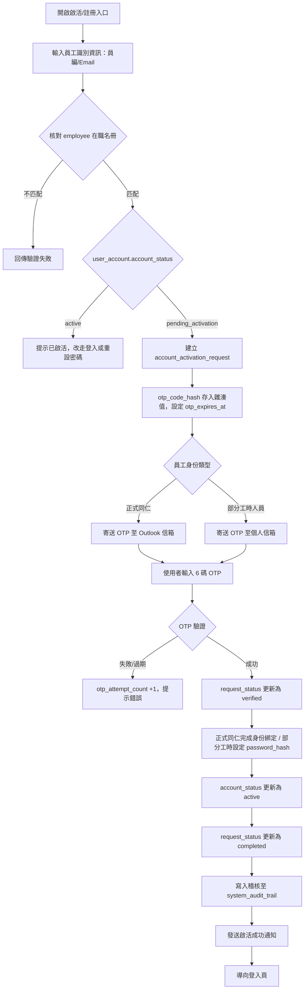
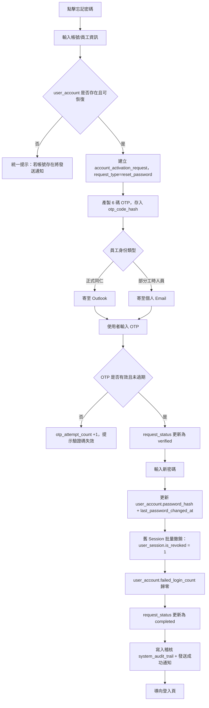
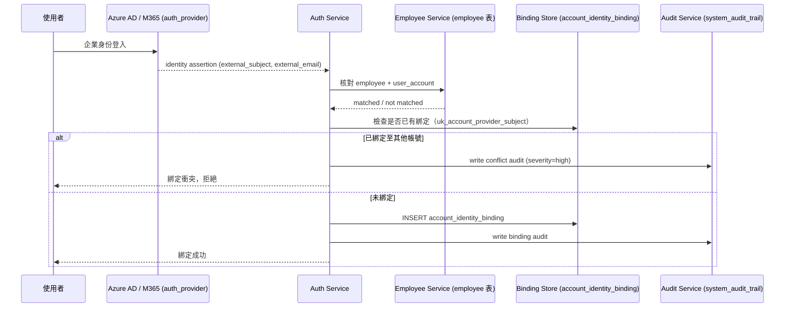
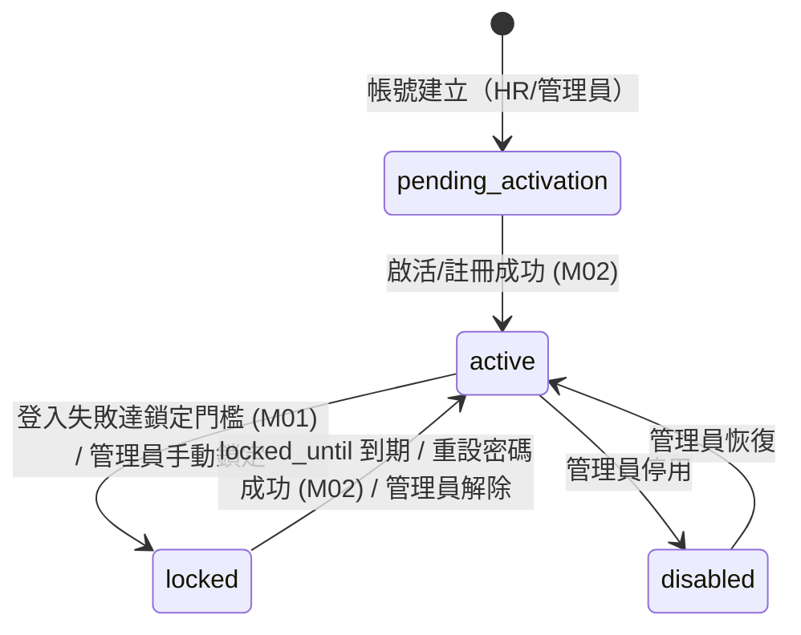
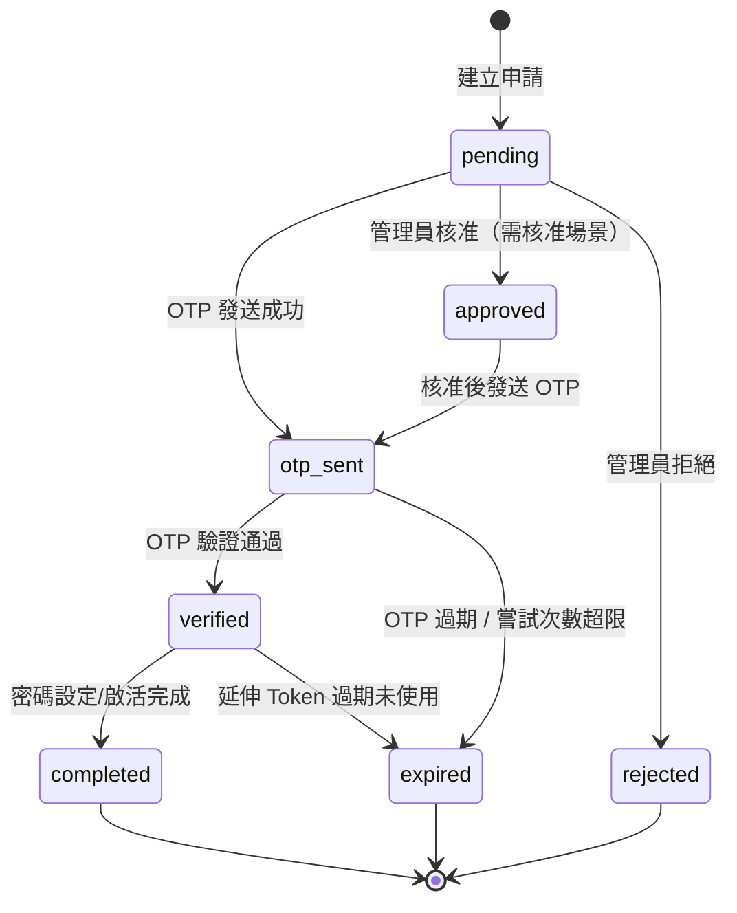

# M02《AUTH－帳號啟活、重設密碼與 SSO 綁定》子 PRD

> 來源註記：本文件保留既有模塊拆分方式。凡文中未被客戶原始 PRD 明文定義的欄位、狀態碼、流程抽象或工程命名，均視為內部設計建議，不作為客戶權威需求表述。
>
> 對齊口徑：本文件已按主 PRD `v1.1` 與 `sql/tra_welfare_platform.sql` `v3.0-full` 收斂；啟活、OTP、身份綁定與本地帳號僅作當前系統落地說明，不直接替代客戶原始身分規範。


---

[toc]

---

## 1. 模塊名稱

AUTH－帳號啟活、重設密碼與 SSO 綁定

## 2. 模塊類型

底層能力模塊

## 3. 模塊定位

本模塊是 AUTH 域中「非日常登入」但同樣關鍵的身份生命週期能力，負責處理帳號從不可用到可用、從失控到恢復，以及正式同仁企業身份與內部帳號映射的全過程。
若 M01 解決的是「現在能不能登入」，那 M02 解決的就是：

- 一個新帳號如何安全啟用（總體 PRD 稱之為「註冊」）
- 忘記密碼後如何安全恢復
- 正式同仁的企業身份如何和內部帳號正確映射
- 這些操作完成後，如何與 Session、通知、稽核、安全策略聯動

總體 PRD 已將 AUTH 定義為同時包含登入、帳號啟活（註冊）、忘記密碼、Session 管理與 SSO 綁定的統一模塊，因此這三塊必須獨立成文，而不能併到登入頁描述中。

> **資料庫核心表：** `account_activation_request`（AUTH-04）為本模塊主表，以 `request_type` ENUM 區分註冊（`register`）、啟活（`activate`）、重設密碼（`reset_password`）三種申請類型。SSO 綁定涉及 `auth_provider`（AUTH-05）與 `account_identity_binding`（AUTH-06）兩張擴充表。

## 4. 設計目標

本模塊設計目標如下：

1. 建立標準化帳號生命週期，讓「待啟活（`pending_activation`） → 啟活可用（`active`） → 忘記密碼恢復」有一致規則，並正確區分正式同仁與部分工時人員的身份驗證路徑。
2. 將敏感身份操作從一般登入流程中拆分，降低風險與耦合。
3. 所有啟活、重設、綁定動作都必須可稽核、可通知、可失效舊 Session，符合整體平台高風險可追溯原則。
4. 對齊原始 PRD 的註冊/重設要求：以 6 碼 OTP 為主（`account_activation_request.otp_code_hash`），系統自動核對管理者預載之在職名冊（`employee` 表），正式同仁寄送至 Outlook 信箱，部分工時人員寄送至個人信箱；登入後並需銜接個資完整性檢查（`employee.contact_profile_completed`）。

<!-- 修改說明：(1) inactive→pending_activation；(2)新增在職名冊校驗和個資完整性檢查的引用，對應總體PRD第158、160行；(3)補充DB表引用。 -->

## 5. 業務場景

### 場景 A：新使用者首次啟活帳號

HR 或管理員已在 `employee` 主檔與 `user_account` 帳號體系中建立基礎帳號（`account_status` = `pending_activation`），但使用者尚未啟活。使用者透過啟活入口提交員工識別資訊，系統自動核對管理者預載之在職名冊（總體 PRD 明確要求），通過身分檢核後發送 6 碼 OTP 至指定電子郵件（正式同仁至 Outlook 信箱，部分工時人員至個人信箱）。使用者於時效內回填 OTP 完成驗證；正式同仁完成企業身份對齊，部分工時人員設定內部密碼。啟活成功後，`account_status` 由 `pending_activation` 轉為 `active`，之後才能走一般登入。

<!-- 修改說明：(1) inactive→pending_activation，與 user_account.account_status ENUM 一致；(2)補充在職名冊校驗要求（總體PRD line 158：「系統會自動核對管理者預載之在職名冊，通過身分檢核後隨機產製六位數金鑰」）；(3)補充 OTP 送達通道分流（Outlook vs 個人信箱）。 -->

### 場景 B：使用者忘記密碼

使用者無法登入時，透過忘記密碼流程提交身份資訊，系統核對 `employee` 表與 `user_account` 表確認帳號存在且可恢復（`account_status` 為 `active` 或 `locked`），建立 `account_activation_request` 記錄（`request_type` = `reset_password`），發送 6 碼 OTP。正式同仁寄至 Outlook、部分工時人員寄至個人信箱（`delivery_channel` = `email`）。使用者完成 OTP 驗證並設定新密碼成功後，`user_account.password_hash` 更新、`last_password_changed_at` 刷新，舊 Session 須全部撤銷（`user_session.is_revoked` = 1）。

<!-- 修改說明：補充具體DB操作路徑和欄位引用。 -->

### 場景 C：管理員治理帳號狀態

系統管理員在管理後台可能需要查看帳號是否已啟活（`account_status`）、是否已綁定身份提供者（`account_identity_binding`）、是否需要重送啟活通知（新建 `account_activation_request`）、是否強制重設密碼。此處實際操作頁可以先放在系統管理或人員管理模塊中，但能力邏輯仍歸屬 M02。角色權限與帳號治理責任在總體 PRD 的角色描述中已有明確分工。

### 場景 D：企業身份與內部帳號映射過渡

正式同仁應以 Microsoft Graph API 為主要驗證方式，部分工時人員才使用內部帳號；身份來源透過 `auth_provider` 表管理，帳號綁定關係透過 `account_identity_binding` 表建立。若後續有額外身份提供者整合需求，可在不破壞員工主身份的前提下在 `auth_provider` 新增記錄並建立綁定，但不應倒推成目前客戶需求是「先本地、後企業身份」。

### 場景 E：首次登入資料完整性檢核

總體 PRD 明確要求：同仁成功登入後，平台會立即啟動資料完整性檢核，若偵測到初次登入或關鍵聯繫資料缺失，系統將強制重定向至個人資料維護頁面，補齊聯絡電話（`employee.phone`）、通訊地址（`employee.address`）、所屬福利社（`employee.welfare_branch_id`），並將 `employee.contact_profile_completed` 標記為 1。在完成補件前，系統將鎖定補助申請等核心功能。

<!-- 修改說明：新增場景E。總體PRD line 160 明確要求首次登入資料完整性檢核，原子PRD在設計目標中提及但未展開為獨立場景。 -->

## 6. 業務流程解讀

### 6.1 啟活流程解讀

啟活（總體 PRD 稱「註冊」）不是單純設密碼，而是「核對在職名冊驗證身份 → OTP 驗證郵件所有權 → 設定憑證 → 帳號狀態切換」的完整流程。

建議流程如下：



<!-- 修改說明：(1)流程中引用實際DB欄位和表名；(2)新增在職名冊校驗步驟（總體PRD明確要求）；(3)帳號狀態判斷使用DB ENUM值 pending_activation/active；(4)OTP送達分流至Outlook/個人信箱（總體PRD line 158）；(5)新增 otp_attempt_count 計數和 request_status 狀態更新。 -->

### 6.2 重設密碼流程解讀

重設密碼的核心不是發一封信，而是建立一個可控、一次性、短時效的 OTP 驗證流程。
建議流程如下：



<!-- 修改說明：流程中引用實際DB欄位和表名，補充 request_status 狀態流轉和 otp_attempt_count。 -->

### 6.3 SSO 綁定流程解讀

企業身份綁定本質上是把「外部身份」映射到「內部員工帳號」。
原始 PRD 對正式同仁已明確要求 Microsoft Graph API 驗證，因此需要把映射與落權邊界定清楚：

1. 外部身份成功驗證不等於可直接建立新內部身份
2. 必須先找到既有 `employee` + `user_account` 實體
3. 綁定成功後在 `account_identity_binding` 表建立記錄，`is_primary` 標記主要來源
4. 日後可使用企業身份登入，但仍沿用同一組內部帳號、權限與資料範圍



<!-- 修改說明：(1)參與者標註對應DB表名；(2)補充 uk_account_provider_subject 唯一約束的衝突檢查；(3)綁定衝突產生高風險稽核事件。 -->

### 6.4 流程原則

本模塊的三條流程都遵循相同原則：

- 涉及身份控制的敏感操作必須可稽核（寫入 `system_audit_trail`）
- OTP 憑證為一次性、可過期（`otp_expires_at`）、可撤銷（`request_status` = `expired`）
- 成功後要與通知、Session（`user_session.is_revoked`）、帳號狀態（`user_account.account_status`）聯動
- 前台提示應避免暴露過多帳號存在性資訊
- 與登入解耦，但必須與登入結果一致銜接

這些原則與總體 PRD 對 AUTH、SYS、SEC 的設計方向一致。

## 7. 核心功能拆解

### 7.1 帳號啟活（註冊）

功能目標：讓預建立帳號安全轉為可登入狀態。
核心能力包括：

- 啟活入口（登入頁的「帳號啟活」連結）
- 啟活前身份比對：核對 `employee` 在職名冊（總體 PRD 明確要求：「系統會自動核對管理者預載之在職名冊」）
- 6 碼 OTP 驗證：`otp_code_hash` 雜湊存儲，`otp_expires_at` 控制時效，`otp_attempt_count` 限制重試
- 初始密碼設定（部分工時人員）或企業身份綁定（正式同仁）
- 啟活成功後 `account_status` 由 `pending_activation` 切換為 `active`
- 啟活結果通知（站內通知 + Email 外寄）
- 啟活失敗與 OTP 失效處理

總體 PRD 明確將此功能列為 AUTH 一級功能，並描述了完整的 OTP 驗證流程。

> **資料庫映射：**
> - 主表：`account_activation_request`（AUTH-04），`request_type` = `register` 或 `activate`
> - `request_status` 流轉：`pending` → `otp_sent` → `verified` → `completed`（成功）/ `expired`（逾時）/ `rejected`（審核拒絕）
> - 狀態切換：`user_account.account_status`：`pending_activation` → `active`
> - 在職名冊校驗：`account_activation_request.employee_no` / `employee_id` → `employee` 表比對

### 7.2 忘記密碼

功能目標：在不登入情況下，提供受控的憑證恢復機制。
核心能力包括：

- 忘記密碼入口（登入頁的「忘記密碼」連結）
- 帳號查找與可恢復性判斷（`account_status` 須為 `active` 或 `locked`）
- 6 碼 OTP 生成與雜湊存儲
- OTP 寄送：正式同仁至 Outlook，部分工時人員至個人信箱（`delivery_channel`）
- 新密碼設定（更新 `user_account.password_hash`）
- 舊會話批量撤銷（`user_session.is_revoked` = 1）
- `failed_login_count` 歸零
- 稽核與告警

> **資料庫映射：**
> - 主表：`account_activation_request`（AUTH-04），`request_type` = `reset_password`
> - `request_status` 流轉：`pending` → `otp_sent` → `verified` → `completed`
> - 密碼更新：`user_account.password_hash` + `last_password_changed_at`
> - Session 撤銷：`user_session.is_revoked` = 1（該 `account_id` 下所有未撤銷 Session）

### 7.3 SSO 綁定

功能目標：為企業身份接入建立穩定映射關係。
核心能力包括：

- 身份提供者管理：`auth_provider` 表維護 `provider_code`（local/outlook/azure_ad/ldap）、`protocol_type`、連線設定
- 外部身份識別存儲：`account_identity_binding.external_subject`、`external_login_name`、`external_email`
- 綁定前員工身份比對（`employee` + `user_account` 必須存在）
- 綁定衝突處理：同一 `(auth_provider_id, external_subject)` 已有 UNIQUE 約束，阻止一對多
- 綁定解除 / 重新綁定（`account_identity_binding.is_deleted` 軟刪除）
- 綁定成功後登入路徑兼容 local 與 SSO（同一 `account_id` 可綁定多個身份來源，`is_primary` 標記主要來源）

總體 PRD 已明確正式同仁走 Microsoft Graph API，系統需預留 Azure AD / Microsoft 365 接入能力。

<!-- 修改說明：原文引用 identity_provider 欄位，但 user_account 表無此欄位。已改為引用實際的 auth_provider + account_identity_binding 表結構。 -->

> **資料庫映射：**
> - `auth_provider`（AUTH-05）：`provider_code` (UNIQUE)、`protocol_type` ENUM(`local`/`oauth2`/`oidc`/`saml`/`ldap`)、`config_json`、`is_enabled`
> - `account_identity_binding`（AUTH-06）：`account_id` FK、`auth_provider_id` FK、`external_subject`、`external_email`、`is_primary`、`last_synced_at`
> - UNIQUE 約束：`uk_account_provider_subject (auth_provider_id, external_subject)` — 確保同一外部身份不可綁定多個帳號

### 7.4 敏感操作通知

因平台總體要求「同一個業務事件至少能產生一筆站內通知；Email 為可選外寄管道」，因此啟活成功、重設密碼成功、重新寄送啟活通知、SSO 綁定成功等事件，建議全部納入通知模板與外寄任務體系。OTP 發送本身也是通知的一種，`delivery_channel` 欄位記錄送達管道（`email` / `portal`）。

> **資料庫映射：**
> - `account_activation_request.delivery_channel` ENUM(`email`, `portal`)
> - `account_activation_request.otp_sent_at` — OTP 發送時間記錄
> - 通知模板與外寄佇列：`notification_template` + `outbound_task`（SYS 模塊）

### 7.5 敏感操作稽核

總體 PRD 要求高風險操作同步寫入，SEC 規則中也將 `auth` 作為一級規則分類，因此以下事件建議定義為至少 medium 以上稽核事件，寫入 `system_audit_trail` 表：

| 事件代碼                     | 說明                      | 建議 severity_level |
| ---------------------------- | ------------------------- | ------------------- |
| `activation_otp_sent`        | 啟活 OTP 已發送           | info                |
| `activation_success`         | 啟活成功                  | medium              |
| `activation_failed`          | 啟活失敗（OTP 錯誤/過期） | medium              |
| `password_reset_requested`   | 密碼重設申請              | medium              |
| `password_reset_success`     | 密碼重設成功              | medium              |
| `password_reset_otp_invalid` | 重設 OTP 無效             | medium              |
| `identity_binding_success`   | 身份綁定成功              | medium              |
| `identity_binding_conflict`  | 身份綁定衝突              | high                |
| `identity_binding_removed`   | 身份綁定解除              | medium              |

> **資料庫映射：**
> - `system_audit_trail.action_code` — 存放上述事件代碼
> - `system_audit_trail.result_code` ENUM(`success`/`warning`/`failed`/`blocked`)
> - `system_audit_trail.severity_level` ENUM(`info`/`low`/`medium`/`high`/`critical`)

## 8. 與其他模塊的聯動關係

### 8.1 與 M01《登入與帳號安全》的聯動

M02 不直接替代登入，而是為登入提供前置與恢復能力：

- `account_status` = `pending_activation` 的帳號不可登入（M01 流程中攔截）
- 重設密碼成功後，回到登入頁重新登入；舊 Session 已全部撤銷
- SSO 綁定成功後，M01 可透過 `account_identity_binding` 增加新的身份驗證入口

### 8.2 與 EMP 的聯動

啟活與 SSO 綁定都不能脫離員工主檔 `employee` 表。
至少要能關聯以下字段：

- `employee_id`（PK）— 帳號綁定主鍵
- `employee_no`（UNIQUE）— HR 主識別，啟活時校驗在職名冊
- `full_name` — 員工姓名
- `employment_status` — 在職狀態，啟活時需確認為 `active`
- `email` — 個人信箱，部分工時人員的 OTP 送達地址
- `contact_profile_completed` — 首次登入資料完整性標記

EMP 是員工身份真源，AUTH 不能獨立生成一套游離的帳號身份。總體 PRD 已將 `employee_no` 定義為 HR 主識別。

### 8.3 與 SYS 的聯動

本模塊高度依賴 SYS：

- 系統參數：OTP 有效期、重試次數上限、密碼規則、通知開關
- 通知模板：啟活成功、重設密碼、綁定成功等模板
- 外寄任務：Email 發送佇列
- 字典：`account_status` ENUM 值、`request_type` / `request_status` ENUM 值

總體 PRD 已將通知中心、模板、外寄任務佇列納入 SYS。

### 8.4 與 SEC 的聯動

所有敏感身份操作都應回流 SEC，寫入 `system_audit_trail` 表並歸入 `auth` 類安全規則。綁定衝突等高風險事件可觸發 `security_alert`。總體 PRD 對高風險同步寫入與 `auth` 規則分類已有明確定義。

### 8.5 與 ORG 的聯動

SSO 綁定不改變角色與資料範圍，仍由 ORG 決定登入後可操作內容。
也就是說：

- AUTH 決定你是誰
- ORG 決定你能做什麼

### 8.6 與 Portal / Admin Console 的聯動

啟活、忘記密碼主要走前台共用入口；
重送啟活、強制重設、查看綁定狀態等治理操作則通常在後台進行。總體 PRD 的角色入口與後台治理定位支持這種分工。

## 9. 頁面規劃

本模塊不是頁面模塊，但涉及 5 類共用頁/彈窗，仍需做頁面規劃。

### 9.1 帳號啟活頁

區塊建議：

1. 員工識別資訊輸入區（員工編號 / Email）
2. 6 碼 OTP 驗證區（顯示 OTP 剩餘有效時間）
3. 初始密碼設定區（部分工時人員）
4. 密碼強度提示
5. 啟活按鈕
6. 成功/失敗提示區

交互要求：

- 啟活前不顯示過多個人資料
- 員工識別資訊須核對在職名冊（`employee` 表），不匹配時統一提示
- 密碼規則即時校驗
- OTP 超過 `otp_attempt_count` 限制時需重新申請
- 啟活成功後不自動登入，建議回登入頁

### 9.2 忘記密碼申請頁

區塊建議：

1. 帳號或員工編號輸入
2. 身份輔助校驗資訊
3. 核取方塊式人機校驗（與 M01 登入頁一致）
4. 發送重設通知按鈕
5. 統一提示訊息

交互要求：

- 無論帳號是否存在，前端提示保持一致（防帳號枚舉）
- 一段時間內限制頻繁提交（`auth.activation.resend_cooldown_seconds`）

### 9.3 重設密碼頁

區塊建議：

1. OTP 驗證輸入區（6 碼）
2. 新密碼
3. 確認密碼
4. 密碼強度提示
5. 確認重設按鈕

### 9.4 綁定狀態頁（後台/個人資料區）

展示內容建議：

- 當前綁定的身份來源（`auth_provider.provider_name`）
- 是否已綁定企業身份（`account_identity_binding` 記錄是否存在）
- 最近綁定/同步時間（`last_synced_at`）
- 外部身份識別（`external_login_name` / `external_email`）
- 是否為主要來源（`is_primary`）
- 解綁 / 重新綁定操作入口

### 9.5 管理端帳號治理區塊

可放在後續 SYS/EMP 管理後台中：

- 重寄啟活通知（建立新的 `account_activation_request`，原有記錄 `request_status` 設為 `expired`）
- 強制重設密碼
- 查看最近重設狀態（`account_activation_request` 查詢）
- 查看 SSO 綁定狀態（`account_identity_binding` 查詢）

## 10. 底層能力說明

### 10.1 能力邊界

本模塊負責：

- 帳號啟活（註冊）
- 密碼恢復
- 身份綁定（`auth_provider` + `account_identity_binding`）
- OTP 生成與驗證
- Session 失效聯動
- 稽核與通知輸出

本模塊不負責：

- 日常登入校驗（M01）
- 功能授權（ORG）
- 員工主資料治理（EMP）
- 通知模板具體維護頁（SYS）
- 稽核查詢頁（SEC）

### 10.2 輸入輸出

**輸入**

- `login_name` / `employee_no` / 身份輔助資訊（對應 `user_account.login_name`、`employee.employee_no`）
- `otp_code`：6 碼 OTP（驗證時與 `otp_code_hash` 比對）
- `new_password`：新密碼
- `external_identity_assertion`：外部 IdP 的身份斷言（含 `external_subject`、`external_email`）

<!-- 修改說明：(1)account 改為 login_name 對齊DB欄位；(2)activation_token/reset_token 改為 otp_code，因DB用統一的 OTP 機制而非分離的 token；(3)identity_provider 改為 external_identity_assertion。 -->

**輸出**

- `activation_result`：成功/失敗/OTP 過期/已啟活
- `reset_result`：成功/失敗/OTP 過期
- `binding_result`：成功/失敗/衝突
- `account_status`：更新後的帳號狀態
- `session_revocation_count`：撤銷的 Session 數量
- `audit_event_id`：`system_audit_trail` 記錄 ID
- `notification_task_id`：通知任務 ID

### 10.3 資料庫申請記錄模型

DB 以單一 `account_activation_request` 表統一管理啟活、註冊、重設密碼三種申請，透過 `request_type` ENUM 區分：

| request_type     | 用途         | 典型流程                                                              |
| ---------------- | ------------ | --------------------------------------------------------------------- |
| `register`       | 新使用者註冊 | 員工識別 → OTP → 設定密碼 → `account_status` = `active`               |
| `activate`       | 預建帳號啟活 | 管理員建帳 → 使用者 OTP 驗證 → 設定密碼 → `account_status` = `active` |
| `reset_password` | 忘記密碼     | 身份驗證 → OTP → 新密碼 → Session 撤銷                                |

**申請狀態流轉（`request_status` ENUM）：**

```
pending → otp_sent → verified → completed（成功結案）
                  ↘ expired（逾時）
         → approved / rejected（需管理員核准時）
```

**OTP 安全機制：**
- `otp_code_hash`（CHAR(64)）：僅存雜湊，不保存明文
- `otp_expires_at`：OTP 有效期（由 `auth.activation.token_ttl_minutes` 控制）
- `otp_attempt_count`：限制重試次數，防暴力破解
- `token`（VARCHAR(255)）+ `token_expires_at`：延伸驗證 Token（如密碼重設頁的一次性連結）

<!-- 修改說明：原10.3建議抽象3類token的獨立模型，但DB實際用單一 account_activation_request 表以 request_type 區分。已改為與DB架構一致的描述。 -->

### 10.4 觸發機制

- 建立帳號後（`account_status` = `pending_activation`），可由系統或管理員觸發啟活通知
- 忘記密碼頁提交後，建立 `account_activation_request`（`request_type` = `reset_password`），觸發 OTP 發送
- 首次企業身份登入或管理端發起綁定時，觸發 `account_identity_binding` 綁定流程
- 重設成功後，觸發 Session 批量撤銷與通知
- 首次登入成功後，檢查 `employee.contact_profile_completed`，若為 0 則強制導向資料補件

## 11. 角色權限與操作路徑

### 11.1 使用者角色

可涉及的角色包括：

- 一般職工（使用者）
- 系統管理員
- 具資安職責的管理人員（查核，不直接執行一般恢復）
- 必要時的 HR/承辦協作角色（管理者）

總體 PRD 已明確平台角色範圍與管理員治理責任。

### 11.2 操作路徑

- 使用者啟活：登入頁 → 帳號啟活 → 核對在職名冊 → OTP 驗證 → 設定密碼 → 返回登入頁
- 使用者重設：登入頁 → 忘記密碼 → OTP 發送 → OTP 驗證 → 重設密碼 → 返回登入頁
- 管理員重送啟活：管理後台 → 帳號治理 → 重送啟活通知（新建 `account_activation_request`）
- 綁定企業身份：個人資料 / 後台帳號治理 → 發起綁定 → Azure AD 驗證 → `account_identity_binding` 建立 → 綁定完成

### 11.3 權限規則

- 一般使用者只能操作自己的啟活/重設/綁定
- 系統管理員可重送啟活通知、查看綁定狀態、解除異常綁定、審批啟活申請（`approved_by`）
- 資安稽核人員只能查核 `system_audit_trail` 紀錄，不介入一般身份操作內容

## 12. 關鍵字段/配置項說明

### 12.1 核心表結構

以下字段以 `sql/tra_welfare_platform.sql` 的實際表結構為準。

**`account_activation_request` 表（AUTH-04：帳號啟活/註冊/重設密碼申請）**

| DB 字段名               | 類型            | 中文名稱           | 用途             | 備註                                                                        |
| ----------------------- | --------------- | ------------------ | ---------------- | --------------------------------------------------------------------------- |
| `activation_request_id` | BIGINT UNSIGNED | 主鍵               | 申請記錄 PK      | AUTO_INCREMENT                                                              |
| `employee_id`           | BIGINT UNSIGNED | 對應員工           | 在職名冊校驗     | FK → `employee`，可 NULL                                                    |
| `employee_no`           | VARCHAR(50)     | 申請時填寫的員編   | 身份比對         |                                                                             |
| `email`                 | VARCHAR(255)    | 申請時填寫的 Email | OTP 送達地址     |                                                                             |
| `request_type`          | ENUM            | 申請類型           | 區分業務場景     | `register`/`activate`/`reset_password`                                      |
| `request_status`        | ENUM            | 申請狀態           | 流程追蹤         | `pending`/`otp_sent`/`verified`/`approved`/`rejected`/`completed`/`expired` |
| `delivery_channel`      | ENUM            | 驗證送達管道       | OTP 發送通道     | `email`/`portal`                                                            |
| `otp_code_hash`         | CHAR(64)        | OTP 雜湊           | 6碼 OTP 安全存儲 | 不保存明文                                                                  |
| `otp_sent_at`           | DATETIME        | OTP 發送時間       | 時序追蹤         |                                                                             |
| `otp_expires_at`        | DATETIME        | OTP 過期時間       | 有效期控制       |                                                                             |
| `otp_attempt_count`     | INT             | OTP 嘗試次數       | 防暴力破解       | DEFAULT 0                                                                   |
| `verified_at`           | DATETIME        | 驗證成功時間       | 稽核用           |                                                                             |
| `used_at`               | DATETIME        | 憑證使用時間       | 密碼設定完成時間 |                                                                             |
| `token`                 | VARCHAR(255)    | 延伸驗證 Token     | 重設密碼連結等   |                                                                             |
| `token_expires_at`      | DATETIME        | Token 過期時間     | 連結有效期       |                                                                             |
| `requested_at`          | DATETIME        | 申請時間           | 流程起點         | DEFAULT CURRENT_TIMESTAMP                                                   |
| `approved_at`           | DATETIME        | 核准時間           | 管理員核准       |                                                                             |
| `approved_by`           | BIGINT UNSIGNED | 核准人             | 管理員 ID        | FK → `employee`                                                             |
| `note`                  | TEXT            | 備註               | 管理員備註       |                                                                             |

<!-- 修改說明：完全重構核心字段表。原12.1列出的 session_token、identity_provider 等欄位不屬於本模塊主表或根本不存在於 user_account。原12.2列出的「建議新增字段」多數已存在於 account_activation_request 表中（如 otp_code_hash、otp_expires_at、verified_at 等），不應列為新增建議。現改為嚴格按 DB 表結構組織。 -->

**`auth_provider` 表（AUTH-05：身份提供者）**

| DB 字段名          | 類型            | 中文名稱        | 備註                                        |
| ------------------ | --------------- | --------------- | ------------------------------------------- |
| `auth_provider_id` | BIGINT UNSIGNED | PK              |                                             |
| `provider_code`    | VARCHAR(50)     | 提供者代碼      | UNIQUE，`local`/`outlook`/`azure_ad`/`ldap` |
| `provider_name`    | VARCHAR(100)    | 提供者名稱      |                                             |
| `protocol_type`    | ENUM            | 協定類型        | `local`/`oauth2`/`oidc`/`saml`/`ldap`       |
| `issuer`           | VARCHAR(255)    | 簽發者/租戶資訊 | Azure AD tenant 等                          |
| `config_json`      | JSON            | 連線設定        | client_id、secret 等                        |
| `is_enabled`       | TINYINT(1)      | 是否啟用        | DEFAULT 1                                   |

**`account_identity_binding` 表（AUTH-06：帳號身份綁定）**

| DB 字段名                     | 類型            | 中文名稱      | 備註                                       |
| ----------------------------- | --------------- | ------------- | ------------------------------------------ |
| `account_identity_binding_id` | BIGINT UNSIGNED | PK            |                                            |
| `account_id`                  | BIGINT UNSIGNED | 帳號 ID       | FK → `user_account`                        |
| `auth_provider_id`            | BIGINT UNSIGNED | 身份提供者 ID | FK → `auth_provider`                       |
| `external_subject`            | VARCHAR(255)    | 外部 subject  | UNIQUE(auth_provider_id, external_subject) |
| `external_login_name`         | VARCHAR(255)    | 外部登入名    |                                            |
| `external_email`              | VARCHAR(255)    | 外部電子郵件  |                                            |
| `is_primary`                  | TINYINT(1)      | 是否主要來源  | DEFAULT 0                                  |
| `last_synced_at`              | DATETIME        | 最後同步時間  |                                            |

### 12.2 關聯表 AUTH 相關欄位

**`user_account`（AUTH-01）M02 涉及欄位：**
- `account_status` ENUM(`pending_activation`/`active`/`disabled`/`locked`) — 啟活前後切換
- `password_hash`（VARCHAR(255)）— 重設密碼時更新
- `last_password_changed_at`（DATETIME）— 重設完成時刷新
- `failed_login_count`（INT）— 重設完成後歸零
- `locked_until`（DATETIME）— 若因鎖定而重設，需清除

**`employee`（EMP-01）M02 涉及欄位：**
- `employee_no`（VARCHAR(50), UNIQUE）— 在職名冊校驗主識別
- `email`（VARCHAR(255)）— 部分工時人員 OTP 送達地址
- `employment_status` ENUM — 啟活時須確認在職
- `contact_profile_completed`（TINYINT(1)）— 首次登入補件檢查

**`user_session`（AUTH-02）M02 涉及欄位：**
- `is_revoked`（TINYINT(1)）— 重設密碼後批量撤銷

### 12.3 建議配置項

建議由 SYS 參數治理：

- `auth.activation.otp_ttl_minutes`（OTP 有效期，對應 `otp_expires_at` 計算）
- `auth.activation.otp_max_attempts`（OTP 最大重試次數，對應 `otp_attempt_count` 上限）
- `auth.activation.resend_cooldown_seconds`（重發冷卻時間）
- `auth.reset.otp_ttl_minutes`（重設 OTP 有效期）
- `auth.reset.daily_limit`（每日重設申請上限）
- `auth.password.min_length`（密碼最小長度）
- `auth.password.complexity_rule`（密碼複雜度規則）
- `auth.password.history_count`（密碼歷史不可重複次數）
- `auth.sso.enabled`（SSO 是否啟用）
- `auth.sso.allowed_providers`（允許的身份提供者列表）
- `auth.sso.auto_bind_policy`（自動綁定策略）

總體 PRD 已要求系統行為盡量透過字典與系統參數治理，而非硬編碼。

## 13. 異常情況與邊界條件

### 13.1 已啟活帳號再次啟活

`account_status` = `active` 時，應提示帳號已啟活，不再允許重複啟活；可引導使用登入或忘記密碼流程。

### 13.2 OTP 過期

`otp_expires_at` 已過時，應允許重新申請（建立新的 `account_activation_request`），原記錄 `request_status` 更新為 `expired`。原 OTP 雜湊自動失效。

### 13.3 重設通知重複提交

需限制短時間頻繁提交（`auth.activation.resend_cooldown_seconds`），避免被濫用造成通知轟炸或帳號枚舉風險。可透過查詢最近一筆 `account_activation_request.requested_at` 判斷冷卻期。

### 13.4 OTP 已使用

`request_status` = `completed` 或 `used_at` 不為 NULL 的記錄，其 OTP 視為已失效，不允許再次使用。

### 13.5 密碼重設後舊 Session 處理

`user_session` 中該 `account_id` 的所有未撤銷記錄需批量設定 `is_revoked` = 1。至少對高風險後台 Session 全部失效。這是對總體 PRD 中 Session 統一治理與高風險可控原則的工程化補足。

### 13.6 外部身份已綁到其他帳號

`account_identity_binding` 的 UNIQUE 約束 `uk_account_provider_subject (auth_provider_id, external_subject)` 會自動阻斷。應產生 `severity_level` = `high` 的稽核事件，避免一個企業身份映射多個員工帳號。

### 13.7 本地帳號停用但外部身份有效

外部身份驗證成功仍不可登入，因為最終仍須服從 `user_account.account_status`。`disabled` 或 `locked` 狀態的帳號，無論身份來源如何，均不可建立 Session。

### 13.8 帳號存在但無資料範圍

這不屬於 M02 異常，不應在啟活/重設/綁定階段報錯；登入後由 ORG 依規則處理。總體 PRD 已對無資料範圍時顯示空列表而非報系統錯誤給出原則。

### 13.9 OTP 嘗試次數超限

`otp_attempt_count` 達到系統設定上限（`auth.activation.otp_max_attempts`）時，該次申請 `request_status` 應設為 `expired`，使用者需重新發起申請。

<!-- 修改說明：新增13.9。DB有 otp_attempt_count 欄位，原子PRD未描述超限處理邏輯。 -->

## 14. Mermaid 圖

### 14.1 帳號狀態機（account_status ENUM）



<!-- 修改說明：(1)狀態值改為 DB ENUM 實際值，移除不存在的 inactive/reset_pending/sso_bound；(2)SSO 綁定不改變 account_status，不應出現在帳號狀態機中；(3)重設密碼中的流程狀態（如等待OTP驗證）由 account_activation_request.request_status 追蹤，不影響 account_status。 -->

### 14.2 申請記錄狀態流轉（request_status ENUM）



<!-- 修改說明：原14.2為「憑證狀態圖」，使用 issued/used/expired/revoked 等非DB值。改為與 account_activation_request.request_status ENUM 完全對齊的狀態流轉圖。 -->

## 15. 研發落地建議

### 15.1 資料設計建議

- OTP 僅存雜湊（`otp_code_hash` CHAR(64)），不存明文
- 延伸驗證 Token（`token` VARCHAR(255)）同樣只傳遞不可預測的隨機值
- `account_activation_request` 統一管理三種申請類型，避免表膨脹
- `auth_provider` + `account_identity_binding` 獨立於 `user_account` 主表，支持未來多 provider 擴展

### 15.2 安全建議

- 啟活、重設、綁定相關頁面全部強制 HTTPS（TLS 1.2/1.3，總體 PRD 5.4 要求）
- OTP 一次性使用：驗證成功後立即更新 `request_status` = `verified`，不可重複驗證
- `otp_attempt_count` 限制重試，防暴力破解
- 所有成功與失敗操作都要記稽核（`system_audit_trail`）
- 文案避免暴露帳號存在與否
- 重設密碼成功後通知原聯絡管道，形成「變更告警」

### 15.3 架構建議

- OTP 驗證、通知發送、Session 撤銷拆為可重用服務
- SSO 接入層（`auth_provider` 配置）和內部帳號綁定邏輯（`account_identity_binding`）分層
- 未來增加其他 provider 時，在 `auth_provider` 新增記錄、實現 Protocol Adapter 即可，不動主流程

### 15.4 與 MVP 範圍對齊建議

MVP 先做：

- local 帳號啟活（`request_type` = `activate`）
- 忘記密碼（`request_type` = `reset_password`）
- 啟活/重設通知（`delivery_channel` = `email`）
- Session 失效聯動（`user_session.is_revoked`）
- `auth_provider` 資料模型預留（先建 `local` 記錄）
- Azure AD / Microsoft 365 綁定流程留接口、不必真正開放（`auth_provider.is_enabled` = 0）

這與總體 PRD 的「正式同仁 Graph 驗證、部分工時人員內部帳號與 OTP 維護」完全一致。

## 16. 測試驗收要點

### 16.1 啟活驗收

1. `account_status` = `pending_activation` 的帳號可完成啟活並轉為 `active`。
2. `account_status` = `active` 的帳號不可重複啟活，提示引導至登入或重設密碼。
3. `otp_expires_at` 已過的 OTP 不可使用，`request_status` 應為 `expired`。
4. `otp_attempt_count` 超過上限時，該申請自動失效。
5. 啟活時 `employee_no` 與 `employee` 表不匹配時，拒絕並統一提示。
6. 啟活成功後可正常走 M01 登入流程。
7. 首次登入後，若 `contact_profile_completed` = 0，強制導向資料補件頁（總體 PRD 要求）。

### 16.2 重設密碼驗收

1. 忘記密碼可成功建立 `account_activation_request`（`request_type` = `reset_password`）並發送 OTP。
2. OTP 過期（`otp_expires_at`）、重複使用（`used_at` 不為 NULL）、偽造時均需阻斷。
3. 新密碼設定成功後，`user_account.password_hash` 更新、`last_password_changed_at` 刷新。
4. 舊 Session 正確批量撤銷（`user_session.is_revoked` = 1）。
5. 重設完成後 `failed_login_count` 歸零。

### 16.3 SSO 綁定驗收

1. `user_account` 可與指定 `auth_provider` 成功建立 `account_identity_binding`。
2. 同一 `(auth_provider_id, external_subject)` 不可綁定多個帳號（UNIQUE 約束）。
3. `account_status` = `disabled` 或 `locked` 時，即使外部 IdP 驗證成功也不可登入。
4. 綁定、解綁、衝突事件都可在 `system_audit_trail` 查到紀錄。
5. `is_primary` 標記正確設定。

### 16.4 通知與稽核驗收

1. 啟活、重設、綁定成功後通知模板可正常扇出。
2. 高風險身份操作可同步寫入 `system_audit_trail`，含正確的 `action_code`、`severity_level`。
3. 告警規則啟用時，異常綁定衝突（`severity_level` = `high`）可產生 `security_alert` 記錄。

這些驗收點與總體 PRD 對 SYS 通知能力、SEC 高風險同步寫入、`auth` 類規則分類要求一致。
