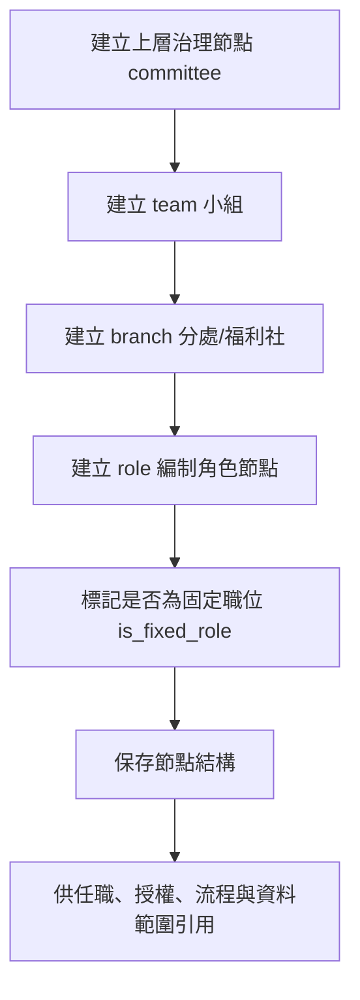
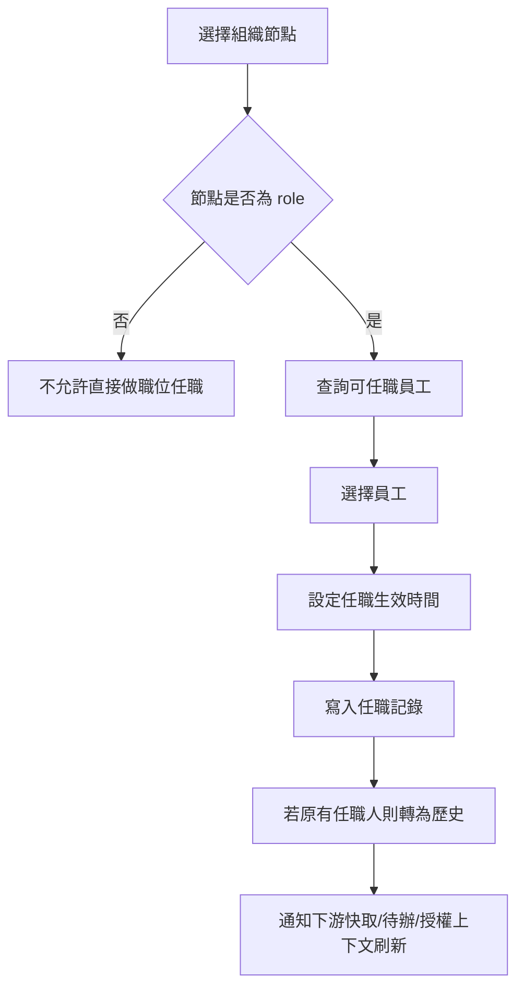
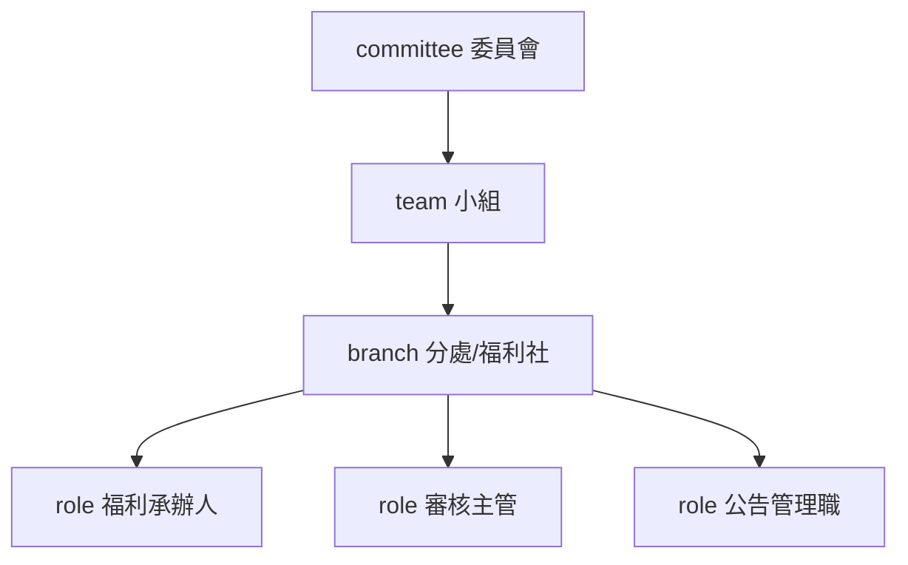
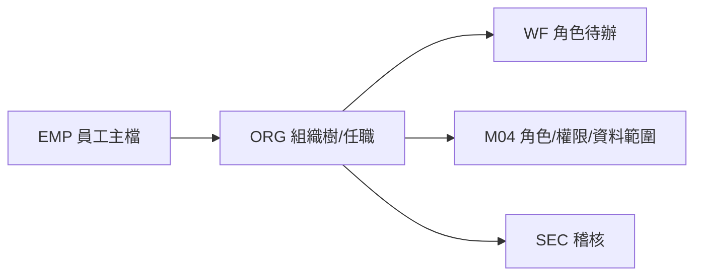
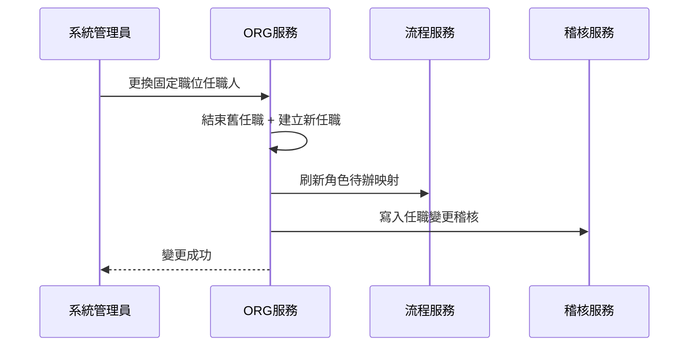

# M03《ORG－組織樹與任職配置》子 PRD

> 來源註記：本文件保留既有模塊拆分方式。凡文中未被客戶原始 PRD 明文定義的欄位、狀態碼、流程抽象或工程命名，均視為內部設計建議，不作為客戶權威需求表述。
>
> 對齊口徑：本文件已按主 PRD `v1.1` 與 `sql/tra_welfare_platform.sql` `v3.0-full` 收斂；組織節點、任職配置與責任範圍屬當前系統實作模型，應與客戶原始行政結構分層理解。

---

[toc]

---

## 1. 模塊名稱

ORG－組織樹與任職配置

## 2. 模塊類型

後台頁面模塊

## 3. 模塊定位

本模塊是整個平台組織治理的骨架層，負責把福利平台中的委員會、小組、分處／福利社、編制角色節點，整理成一棵可配置、可追溯、可被其他模塊依賴的組織樹，並提供任職配置能力，將具體員工掛載到對應職位或節點上。總體 PRD 已將 ORG 定義為平台中負責「組織、角色、功能權限與資料範圍」的治理中樞，並把「組織樹管理」與「人員任職配置」列為一級功能。

本模塊不是在做一般人員主檔維護，而是在解決下面幾件事：

- 平台裡有哪些正式組織層級
- 哪些節點是制度型固定職位，不能被誤刪
- 哪些員工現在正任職於哪些組織角色
- 審批、待辦、資料歸屬、前後台責任分工要基於哪一套組織主線運作

換句話說，M03 回答的是「**組織長什麼樣、位子在哪裡、現在誰坐在這個位子上**」。

## 4. 設計目標

本模塊設計目標如下：

1. 建立平台唯一可信的組織樹，統一委員會、小組、分處／福利社與編制角色節點的表達方式，避免各業務模塊各自維護一套組織結構。總體 PRD 已明確規定 `org_node.node_type` 只能是四種固定類型。
2. 將制度型固定職位與臨時人員任職分開治理，確保制度崗位不因人事變動被刪除。總體 PRD 已明確要求 `is_fixed_role` 表示制度型職位，不可刪除與停用，只能更換任職人。
3. 為 M04 的角色授權、資料範圍、WF 的角色待辦與後續業務資料歸屬提供穩定的組織主鍵與任職上下文。總體 PRD 的模塊關係圖與權限決策流程都顯示 WF 與 ORG 有直接依賴。
4. 支撐 MVP 所要求的 RBAC + Data Scope 基礎治理，但將「組織骨架與任職」和「角色權限與資料範圍」拆為兩份子 PRD，降低工程實施複雜度。總體 PRD 已把 RBAC + Data Scope 納入 MVP 範圍。

## 5. 業務場景

### 場景 A：建立福利治理的正式組織結構

系統管理員需要在後台建立一棵完整組織樹，例如某個福利委員會下有哪些小組、小組下有哪些分處／福利社、每個分處下有哪些制度型職位。這些節點之後會被補助業務、流程引擎、權限控制與稽核使用。總體 PRD 已把 ORG 視為平台治理規則的基礎域之一。

### 場景 B：制度型職位的人員異動

某個分處的福利承辦人或審核主管換人時，不能把整個職位刪掉重建，只能把任職人改成新的員工。這正是 `is_fixed_role` 的設計目的。

### 場景 C：流程待辦找到正確處理人

WF 在建立角色待辦時，不一定直接指定某個員工，而是指定某個角色／職位節點；系統再透過本模塊查出當前任職人，將待辦派送到正確的人。總體 PRD 已將「角色待辦」列為 WF 一級功能，並在模塊關係圖中畫出 WF 對 ORG 的依賴。

### 場景 D：角色還在，但任職暫時空缺

制度上某個職位存在，但當前無人任職。此時節點仍應存在，不可刪除；只是後續待辦派送、資料範圍與審批鏈路需要有明確補救策略。這是固定職位治理在工程上必須面對的真實場景。其制度基礎來自 `is_fixed_role` 不能刪除停用的要求。

## 6. 業務流程解讀

### 6.1 組織樹建立流程

組織樹不是自由畫樹，而是受節點類型與層級語義限制的樹狀結構。
總體 PRD 已固定四類節點，因此子 PRD 建議對層級採以下約束：

- `committee`：委員會級節點
- `team`：小組級節點
- `branch`：分處／福利社級節點
- `role`：編制角色節點

建議流程如下：

### 6.2 任職配置流程

任職配置不是在創建角色，而是在既有組織樹與職位節點上掛載員工。
建議流程如下：

### 6.3 固定職位的人員替換流程

對固定職位來說，真正變動的是「任職人」，不是「職位本身」。
因此系統應支持：

1. 固定職位節點保留不動
2. 原任職記錄結束
3. 新任職記錄生效
4. 下游待辦與授權上下文切換到新任職人

### 6.4 本模塊在整體權限鏈路中的位置

總體 PRD 的權限決策流程是「先有功能權限，再讀角色資料範圍，再做聯集與 deny 規則」。M03 雖不直接配置功能權限與資料範圍，但它提供了這一切成立的前提：**角色與資料範圍所掛載的組織骨架，以及角色待辦所需的任職人對應關係**。

## 7. 核心功能拆解

### 7.1 組織樹節點管理

提供組織樹節點的新增、編輯、排序、停用與查看能力，但要受節點類型限制。總體 PRD 已明確 `org_node.node_type` 只能是 `committee / team / branch / role` 四種。

子能力建議包括：

- 新增節點
- 編輯節點名稱/代碼/排序
- 查看節點上下層關係
- 停用非固定節點
- 批量展開/收合組織樹
- 檢查非法層級關係

### 7.2 固定職位標記

提供 `is_fixed_role` 標記與只讀展示能力。
當節點為固定職位時：

- 不允許刪除
- 不允許停用
- 不允許把節點改成其他語義類型
- 只允許更換任職人或調整顯示信息

這是總體 PRD 的直接要求。

### 7.3 任職配置

支援在 `role` 節點下配置當前任職人與歷史任職記錄。
核心包括：

- 為角色節點指定任職員工
- 設定生效／失效時間
- 查看當前任職與歷史任職
- 更換任職人
- 任職空缺提示

### 7.4 任職有效期與歷程

雖然總體 PRD 未把任職歷史單獨列欄，但整個平台在 EMP、資格歷史、扣繳歷史等領域都明確偏好「歷史可追溯、區間不可重疊」的設計，因此本模塊建議沿用相同治理原則：任職記錄需保留歷史，且同一角色節點的有效任職區間不可重疊。這是對總體 PRD 整體資料治理風格的延伸式工程細化。

### 7.5 組織查詢與引用

提供給其他模塊調用的查詢能力，例如：

- 查某員工目前任職於哪些角色節點
- 查某角色節點目前任職人是誰
- 查某 branch 下有哪些 role
- 查某組織節點的上行路徑
- 查某員工所屬的 branch / team / committee 上下文

### 7.6 組織變更影響提示

當節點結構調整或任職人變更時，系統需提示其可能影響：

- 待辦派發
- 角色授權映射
- 資料範圍結果
- 稽核追蹤與責任歸屬

## 8. 與其他模塊的聯動關係

### 8.1 與 M04《角色、功能權限與資料範圍》的聯動

M03 定義組織骨架與任職，M04 在這個骨架上掛角色授權、功能權限與資料範圍。
兩者邊界如下：

- M03 管「樹、節點、職位、人」
- M04 管「角色、功能點、資料範圍規則」

總體 PRD 已將 ORG 的五個功能列為同域功能，但為了工程落地，子 PRD 做了邊界拆分。

### 8.2 與 EMP 的聯動

任職配置不能脫離員工主檔。
被任命的人員必須來自 EMP 的有效員工資料，至少要依賴 `employee_id`、`employee_no`、`employee_name` 等核心字段。總體 PRD 已將這些字段列為員工與帳號高頻字段。

### 8.3 與 WF 的聯動

WF 的角色待辦、節點審批、退回與核准都依賴 ORG 查出當前任職人。總體 PRD 已將「角色待辦」列為 WF 功能，且模塊關係圖中 WF 對 ORG 有直接依賴。

### 8.4 與 AUTH 的聯動

AUTH 負責登入與身份識別；ORG 進一步決定登入後所對應的後台組織上下文與角色位置。若員工同時任多職，登入後的預設組織上下文、切換機制與入口展示可依本模塊輸出決定。總體 PRD 的角色入口圖也表明後台使用者是以承辦／主管／管理員等組織角色進入的。

### 8.5 與 BEN / PAY / ANN / MCH 的聯動

這些業務模塊都需要知道：

- 某筆資料屬於哪個組織 branch
- 某個節點應由誰承辦／審批
- 某角色應看到哪個分處的資料

尤其總體 PRD 已把「組織權限與資料範圍」列為整個平台核心價值之一，並將其納入 MVP 驗收重點。

### 8.6 與 SEC 的聯動

組織節點新增、刪改、任職變更、固定職位被嘗試停用等都屬高風險治理操作。總體 PRD 已將權限變更與高風險操作納入稽核追蹤範圍。

## 9. 頁面規劃

本模塊作為後台頁面模塊，建議至少包含 3 個頁面：

### 9.1 頁面一：組織樹管理頁

**定位**：建立與維護整棵組織骨架。
**頁面區塊**：

1. 左側組織樹區
2. 右側節點詳情區
3. 節點操作工具列
4. 搜尋與快速定位區
5. 結構校驗提示區

**左側組織樹展示建議**

- 樹狀展開/收合
- 節點類型標籤顯示
- 固定職位節點顯示鎖定/徽章樣式
- 可按節點狀態顯示停用/正常

**右側詳情欄位建議**

- 節點名稱
- 節點代碼
- 節點類型
- 上級節點
- 排序值
- 是否固定職位
- 狀態
- 備註
- 建立/更新資訊

**操作按鈕建議**

- 新增下級節點
- 編輯
- 停用
- 啟用
- 查看任職
- 查看引用影響

### 9.2 頁面二：任職配置頁

**定位**：給角色節點配置當前任職人與查看歷史任職。
**頁面區塊**：

1. 角色節點摘要卡
2. 當前任職人區
3. 歷史任職列表
4. 更換任職人彈窗
5. 生效時間設定區

**核心交互**

- 只能對 `role` 類型節點配置任職
- 固定職位可更換任職，但不可刪除職位
- 更換任職人時，舊任職自動失效，新任職生效
- 若節點已被流程模板引用，提示變更影響

### 9.3 頁面三：組織引用檢查頁/抽屜

**定位**：在做組織變更前，先看該節點是否被其他模塊引用。
**展示內容建議**

- 是否被流程模板引用
- 是否被角色資料範圍引用
- 是否有現任任職人
- 是否關聯未完成待辦
- 是否有歷史審批資料歸屬

這個頁面屬於工程風險控制補強，總體 PRD 雖未單列頁名，但符合其強調可治理、可追溯的產品原則。

## 10. 底層能力說明

本模塊屬頁面模塊，但同時需要輸出可被其他系統調用的組織查詢能力。

### 10.1 能力邊界

本模塊負責：

- 組織節點主資料
- 樹結構關係
- 固定職位標記
- 人員任職配置
- 任職歷史
- 組織查詢能力

本模塊不負責：

- 角色權限定義
- 功能點授權
- 資料範圍聯集與 deny 規則計算
- 員工主資料維護
- 登入與 Session

### 10.2 建議查詢能力

- `getOrgTree()`
- `getNodeDetail(nodeId)`
- `getCurrentAssignee(roleNodeId)`
- `listAssignmentsByEmployee(employeeId)`
- `listRoleNodesByBranch(branchId)`
- `getOrgPath(nodeId)`

## 11. 角色權限與操作路徑

### 11.1 主要角色

- 系統管理員：負責組織樹與任職治理
- 福利社承辦人：通常只讀或有限查看，不建議具備大範圍組織編輯權
- 審核主管：通常只查看與自己相關的組織上下文
- 資安稽核人員：查看組織變更稽核，不做一般配置

總體 PRD 對角色說明中，系統管理員明確負責角色、權限、字典、模板、帳號等平台治理事項。

### 11.2 操作路徑

管理後台 → 組織與權限 → 組織樹管理
管理後台 → 組織與權限 → 任職配置
管理後台 → 組織與權限 → 節點引用檢查

### 11.3 權限建議

- 查看組織樹
- 新增節點
- 編輯節點
- 停用節點
- 配置任職
- 查看歷史任職
- 匯出任職清單

其中「停用節點」「配置固定職位任職」「批量調整任職」建議視為高風險操作，進入 SEC 稽核。總體 PRD 已要求高風險操作可被追蹤。

## 12. 關鍵字段/配置項說明

### 12.1 核心節點字段

總體 PRD 已明確以下關鍵字段與約束：`org_node.node_type`、`is_fixed_role`。

| 字段名         | 中文名稱     | 用途           | 備註                       |
| -------------- | ------------ | -------------- | -------------------------- |
| org_node_id    | 組織節點 ID  | 組織節點主鍵   | 建議系統內唯一             |
| parent_node_id | 上級節點 ID  | 表示樹關係     | 根節點為空                 |
| node_name      | 節點名稱     | 顯示名稱       | 中英文可擴充               |
| node_code      | 節點代碼     | 對內識別碼     | 建議唯一                   |
| node_type      | 節點類型     | 控制節點語義   | committee/team/branch/role |
| is_fixed_role  | 是否固定職位 | 表示制度型職位 | 固定職位不可刪停           |
| sort_order     | 排序         | 控制同層排序   | 後台展示用                 |
| status         | 狀態         | 正常/停用      | 由字典治理                 |
| remark         | 備註         | 補充說明       | 可選                       |

### 12.2 任職字段

| 字段名             | 中文名稱    | 用途                    | 備註             |
| ------------------ | ----------- | ----------------------- | ---------------- |
| assignment_id      | 任職記錄 ID | 任職主鍵                | 可追溯           |
| role_node_id       | 角色節點 ID | 指向 `role` 節點        | 只能掛 role 類型 |
| employee_id        | 任職員工 ID | 指向 EMP                | 必須存在         |
| effective_start_at | 生效時間    | 任職開始                | 必填             |
| effective_end_at   | 失效時間    | 任職結束                | 可空             |
| is_primary         | 是否主任職  | 多任職時區分主職        | 建議補充         |
| assignment_status  | 任職狀態    | active/inactive/pending | 建議字典化       |
| created_by         | 建立人      | 稽核用途                | 通用欄位         |
| updated_by         | 更新人      | 稽核用途                | 通用欄位         |

### 12.3 建議配置項

建議由 SYS 參數治理：

- org.allow_multi_assignment_same_employee
- org.require_effective_date_on_assignment
- org.block_disable_if_active_assignment_exists
- org.block_delete_if_workflow_template_referenced
- org.default_empty_assignment_handling
- org.assignment_change_notify_enabled

## 13. 異常情況與邊界條件

### 13.1 非法節點類型

節點類型必須限制在 `committee / team / branch / role` 四種，不允許自創其他類型。這是總體 PRD 明確要求。

### 13.2 固定職位不可刪除或停用

若 `is_fixed_role=true`，則任何刪除與停用操作都應被阻斷，只允許更換任職人。這是總體 PRD 的直接約束。

### 13.3 非 role 節點不可直接任職

委員會、小組、分處節點不應直接配置任職人；任職應掛在 `role` 節點上，避免組織與職位語義混亂。

### 13.4 同一角色節點任職區間重疊

同一 `role_node_id` 下的 active 任職區間不應重疊，否則會造成 WF 找不到唯一處理人或責任歸屬不清。

### 13.5 節點停用但仍被引用

若某節點被流程模板、資料範圍、現任任職或未完成待辦引用，不應直接停用，至少要先出引用檢查與風險提示。

### 13.6 有功能權限但無資料範圍

這不應在本模塊報系統錯誤；總體 PRD 明確規定，使用者有功能權限但無資料範圍時應顯示空列表。此規則屬整體權限邊界，但 M03 在組織配置時要避免把它誤處理成組織錯誤。

### 13.7 停用角色配置不可繼續收到待辦

總體 PRD 已明確指出已被停用的角色配置不可繼續收到待辦，因此任職變更或節點停用後，必須通知 WF 刷新派送結果。

## 14. Mermaid 圖

### 14.1 組織節點模型圖

### 14.2 任職與下游聯動圖

### 14.3 固定職位更換任職流程圖

## 15. 研發落地建議

### 15.1 資料模型建議

- `org_node` 與 `employee_assignment` 分表設計
- 節點表保存結構與語義；任職表保存人員映射與有效期
- 固定職位以字段約束 + 後端防呆雙重保護
- 所有高風險主表保留 `revision`，符合總體 PRD 的工程原則。

### 15.2 組織樹實作建議

- 優先採 parent-child 結構，配合 path/cache 做查詢優化
- 列表頁與授權查詢盡量使用預計算的上下文快取
- 節點移動操作需做循環依賴檢查，避免形成髒樹

### 15.3 任職切換建議

- 任職切換採「關閉舊記錄 + 開啟新記錄」而非直接覆蓋
- 與 WF 做事件通知或增量刷新
- 若涉及在途待辦，需定義是保留給原處理人還是轉派給新任職人，建議先採“新待辦走新任職，舊待辦保留原責任人並允許管理員轉派”的保守方案

### 15.4 前後端協作建議

- 組織樹頁面應優先出欄位結構與狀態規則，再做高保真
- 固定職位的不可刪/不可停用必須在 UI 與 API 同時保護
- 節點詳情與任職側欄建議共用可讀式摘要組件

## 16. 測試驗收要點

### 16.1 功能驗收

1. 可建立符合 `committee → team → branch → role` 語義的組織樹。
2. `node_type` 只能保存四種合法值。
3. 可在 `role` 節點上配置任職人，並正確保存生效時間。
4. 更換任職人後，歷史任職可查。
5. 固定職位節點可更換任職人，但不可刪除與停用。
   以上第 2、5 點直接對應總體 PRD 的 ORG 約束。

### 16.2 聯動驗收

1. 任職變更後，WF 能找到新的角色處理人。
2. 組織節點停用後，已停用角色配置不可繼續收到待辦。這是總體 PRD 明確要求。
3. 組織調整不影響既有歷史資料查詢與稽核追溯。
4. 被引用節點在停用前能看到引用風險提示。

### 16.3 邊界驗收

1. 固定職位嘗試刪除時，系統正確阻斷。
2. 非 role 節點嘗試做任職配置時，系統正確阻斷。
3. 同一角色節點任職區間重疊時，系統正確阻斷。
4. 有功能權限但無資料範圍時，不把問題錯誤歸因為組織節點異常；最終表現應符合總體 PRD 的空列表原則。
