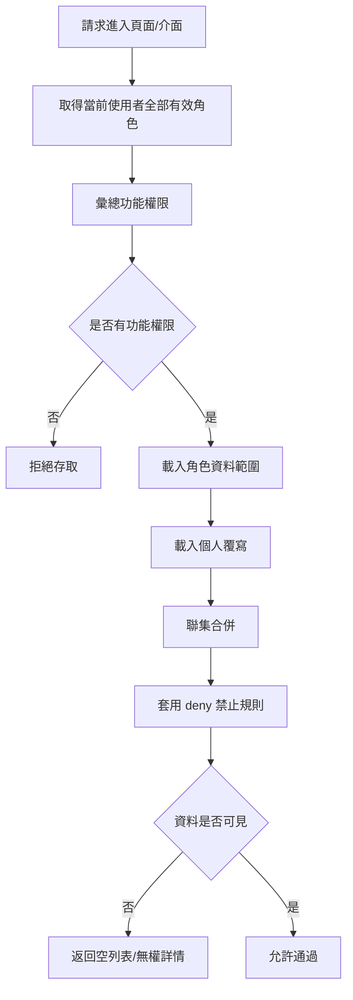
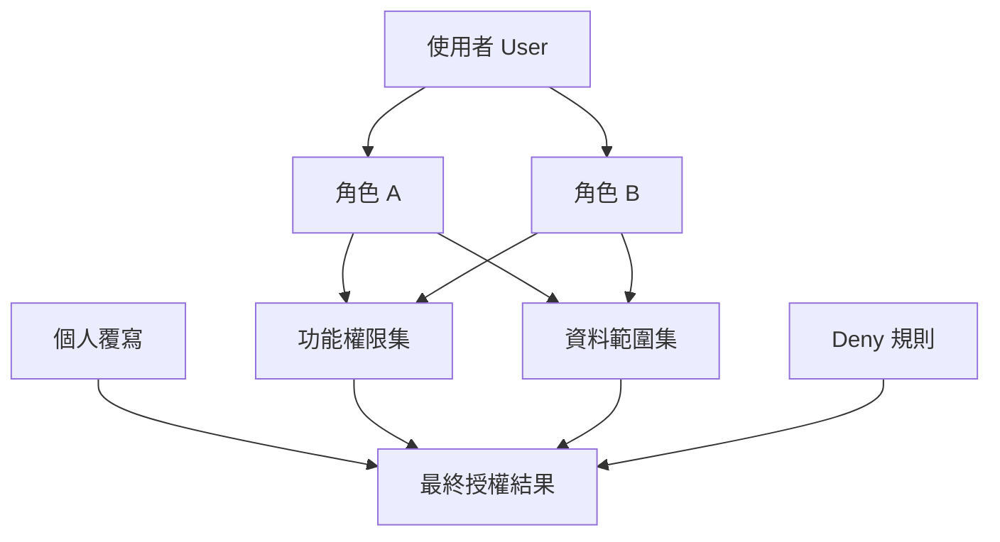
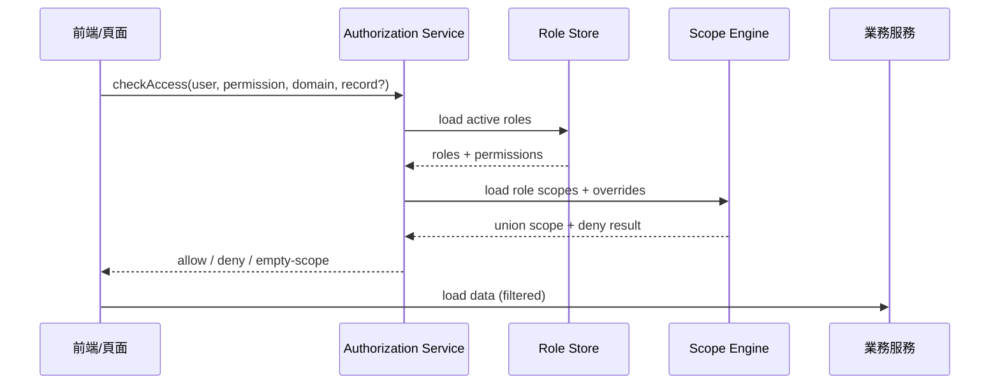
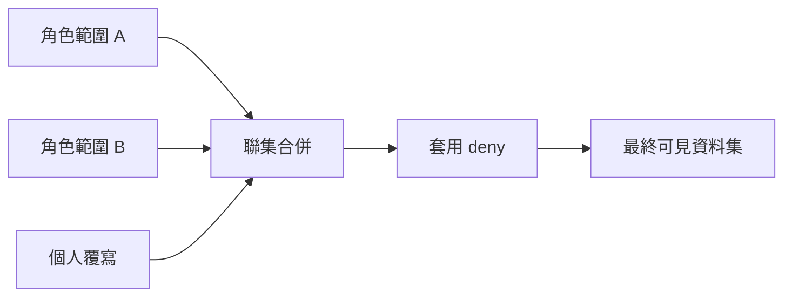

# M04《ORG－角色、功能權限與資料範圍》子 PRD

> 來源註記：本文件保留既有模塊拆分方式。凡文中未被客戶原始 PRD 明文定義的欄位、狀態碼、流程抽象或工程命名，均視為內部設計建議，不作為客戶權威需求表述。
>
> 對齊口徑：本文件已按主 PRD `v1.1` 與 `sql/tra_welfare_platform.sql` `v3.0-full` 收斂；RBAC、資料範圍、員工覆寫等內容屬當前治理模型，不直接等同客戶原始角色矩陣原文。

---

[toc]

---

## 1. 模塊名稱

ORG－角色、功能權限與資料範圍

## 2. 模塊類型

後台頁面模塊

## 3. 模塊定位

本模塊是整個平台「誰能做什麼、能看到什麼」的治理核心。
如果 M03 解決的是「組織長什麼樣、誰現在在哪個位置」，那 M04 解決的就是：

- 某個角色可以進哪些頁面、做哪些動作
- 某個角色可以看到哪些資料
- 當一個人同時擁有多個角色時，權限與資料範圍如何合併
- 當角色能力與資料可見性發生衝突時，以什麼規則裁決

總體 PRD 已將平台價值之一明確定義為：讓組織、角色、權限與資料範圍形成可治理的後台規則，並把 RBAC + Data Scope 列入 MVP 範圍。

## 4. 設計目標

本模塊設計目標如下：

1. 建立統一的 RBAC 權限治理方式，將後台功能點、操作權限與角色映射標準化，避免各模塊各自判權。
2. 建立可落地的資料範圍控制模型，支撐列表、詳情、待辦、查詢等場景的資料可見性判斷。總體 PRD 已把「資料範圍」與「權限決策流程」單獨抽出說明。
3. 明確處理多角色合併規則，採「功能權限可疊加、資料範圍聯集、deny 優先」的統一原則。
4. 保證工程可落地：`custom` 只允許預設條件組合，不允許任意 SQL，防止平台在權限治理上失控。
5. 為 WF、BEN、PAY、ANN、MCH 等模塊提供穩定的授權判斷與資料可見性服務，並與稽核模塊形成高風險追蹤閉環。

## 5. 業務場景

### 場景 A：系統管理員配置角色功能權限

系統管理員需要在後台建立或編輯角色，例如福利社承辦人、審核主管、公告管理員等，並為角色勾選可訪問的頁面與可執行的操作。總體 PRD 角色表也明確列出了這些角色及其主要操作。

### 場景 B：同一使用者具備多個角色

某位使用者可能同時是福利社承辦人與公告管理員。此時系統需要合併兩個角色的功能權限，並對資料範圍做聯集，再套用 deny 規則。這是總體 PRD 對多角色資料範圍的明確要求。

### 場景 C：有頁面權限但沒有資料範圍

使用者可能有進入某個列表頁的功能權限，但因資料範圍規則結果為空，所以頁面可打開但列表應為空，不應報系統錯誤。總體 PRD 在邊界條件中已明確寫出這條規則。

### 場景 D：角色停用後的後果

某個角色配置被停用後，該角色不應再繼續收到待辦，也不應再對應任何新的授權結果。總體 PRD 已把這點列為權限邊界。

### 場景 E：公告/商店/補助等跨模塊資料可見性控制

公告管理員可能只能管理特定 branch 的公告；福利承辦人只能看自己分處的補助申請；審核主管可跨若干 branch 查看案件。這些都不是頁面本身能解決的，而必須由本模塊提供統一資料範圍判斷。平台目標也明確要求「權限與資料範圍能正確限制列表與詳情」。

## 6. 業務流程解讀

### 6.1 權限判斷總流程

總體 PRD 已直接給出了權限決策流程圖，其核心不是單純看某個角色是否勾選某頁，而是分成兩段：

1. 是否有功能權限
2. 是否有資料可見權限

也就是說，「能進」與「能看」是兩個不同層次。

### 6.2 建議的授權決策流程

### 6.3 流程解讀

- 功能權限判斷在前：沒有功能權限，直接拒絕。
- 資料範圍判斷在後：有功能權限，不代表一定有資料可看。
- 多角色資料範圍採聯集。
- 個人覆寫晚於角色範圍載入，但早於 deny。
- deny 規則在最後生效，優先級最高。

這套順序直接來源於總體 PRD 的權限決策流程圖與權限邊界說明。

### 6.4 多角色合併原則

本模塊建議統一採用以下原則：

- **功能權限**：只要任一有效角色具備某功能點，即視為具備
- **資料範圍**：多角色取聯集
- **禁止規則**：最終結果再做裁剪，deny 優先
- **停用角色**：不參與任何合併

其中「資料範圍聯集 + deny 優先」與「停用角色不可繼續收到待辦」均有總體 PRD 直接依據。

### 6.5 `custom` 自定義範圍原則

總體 PRD 明確要求 `custom` 只能使用預設條件組合，不允許任意 SQL。
因此子 PRD 建議把 `custom` 做成「模板化條件構造器」，例如：

- branch in 指定分處
- role in 指定角色
- applicant_employee_id = self
- created_by = self
- status in 指定狀態
- business_type in 指定業務類型

而不是讓後台輸入原始 SQL。

## 7. 核心功能拆解

### 7.1 角色管理

角色管理用來定義系統中可被授權的業務角色，而不是員工主檔中的自然人。
角色至少對應總體 PRD 的主要後台角色，如福利社承辦人、審核主管、公告管理員、系統管理員、資安稽核人員等。

子能力建議包括：

- 新增角色
- 編輯角色
- 啟用 / 停用角色
- 角色標籤與說明
- 角色關聯組織上下文
- 角色引用檢查

### 7.2 功能權限配置

功能權限配置負責把角色與頁面/按鈕/API 操作點映射起來。
建議分 3 層做治理：

1. 頁面級：能否進入頁面
2. 動作級：能否新增、編輯、刪除、送審、核准、退回、匯出
3. 敏感操作級：如批量匯出、強制撤回、權限調整、手動解鎖等

這樣既能支撐前端路由與按鈕控制，也能支撐後端 API 判權。

### 7.3 資料範圍配置

資料範圍配置負責定義角色「能看到哪些資料」。
建議資料範圍類型至少包含：

- **all**：全部資料
- **org_path**：某個組織路徑下全部資料
- **branch_only**：僅某 branch
- **self_only**：僅本人相關
- **assigned_only**：僅自己待辦/指派資料
- **custom**：預設條件組合

其中 `custom` 必須遵守總體 PRD 的非 SQL 原則。

### 7.4 個人覆寫

權限決策流程圖中已明確存在「個人覆寫」步驟，因此本模塊需支援在極少數治理場景下，對個人額外增加或收斂資料範圍。

建議原則：

- 僅系統管理員可配置
- 須填寫原因
- 須有有效期
- 須產生高風險稽核

### 7.5 deny 禁止規則

deny 是資料範圍的最高優先級裁剪器。
常見用途例如：

- 某角色雖可看全 branch，但禁止看特定敏感分類
- 某管理角色可進頁面，但不可查看某些 sensitive records
- 某臨時授權到期後，需立即剔除原本聯集出來的範圍

總體 PRD 已明確 deny 優先，因此其設計不能只是備註，而要成為計算鏈的正式一環。

### 7.6 角色有效性與授權生效

角色配置應支援：

- 狀態啟用/停用
- 生效時間/失效時間
- 是否可被派發待辦
- 是否可參與權限合併

這是為了讓「停用角色不可繼續收到待辦」能在工程上落地。

### 7.7 授權結果查詢與模擬

為便於系統管理員定位問題，建議增加「授權模擬」能力：

- 選擇某位員工
- 查看其目前全部有效角色
- 查看功能權限合併結果
- 查看資料範圍聯集與 deny 後結果
- 查看最終可見模塊與可見資料摘要

這是工程與測試都非常需要的治理工具，雖非總體 PRD 明列頁名，但與其「可治理、可追溯」的原則一致。

## 8. 與其他模塊的聯動關係

### 8.1 與 M03《組織樹與任職配置》的聯動

M03 提供組織節點、固定職位與任職人；M04 在此基礎上把角色、功能權限與資料範圍掛到組織治理結構上。
兩者關係如下：

- M03 管樹與任職
- M04 管授權與可見性

### 8.2 與 AUTH 的聯動

AUTH 解決登入身份；M04 解決登入後的授權。
也就是：

- AUTH 判斷「你是不是合法登入者」
- M04 判斷「你是否能訪問某資源」

### 8.3 與 WF 的聯動

WF 的角色待辦依賴角色有效性；若某角色停用，該角色不可再收到待辦。這點總體 PRD 已明確寫入權限邊界。

此外，WF 的審批頁是否能查看某案件詳情，也需經過本模塊的資料範圍判斷。

### 8.4 與 BEN / PAY / ANN / MCH 的聯動

這些業務模塊都依賴本模塊完成以下事：

- 列表資料過濾
- 詳情頁可見性判斷
- 按鈕權限控制
- 匯出/下載權限限制
- 跨組織資料是否可訪問

總體 PRD 驗收重點也直接要求「權限與資料範圍能正確限制列表與詳情」。

### 8.5 與 SYS 的聯動

角色標籤、狀態字典、功能點字典、資料範圍類型、deny 類型等，建議由 SYS 字典管理，符合總體 PRD「所有業務狀態由字典驅動」的原則。

### 8.6 與 SEC 的聯動

權限調整本身就是高風險操作。總體 PRD 在核心業務場景中已將「權限變更」列為資安追查對象之一。
因此以下操作應寫入高風險稽核：

- 新增/停用角色
- 調整功能權限
- 調整資料範圍
- 設定個人覆寫
- 設定 deny 規則
- 批量授權/撤權

## 9. 頁面規劃

本模塊建議至少包含 4 個頁面：

### 9.1 頁面一：角色管理頁

**定位**：維護平台角色清單。

**頁面區塊**

1. 角色列表區
2. 搜尋與篩選區
3. 角色詳情區
4. 狀態與引用提示區

**列表欄位建議**

- role_code
- role_name
- role_tag
- 關聯組織類型
- 狀態
- 是否可派待辦
- 更新時間
- 更新人

**主要操作**

- 新增角色
- 編輯角色
- 停用/啟用
- 查看授權
- 查看資料範圍
- 查看引用影響

### 9.2 頁面二：功能權限配置頁

**定位**：為角色分配頁面與操作功能點。

**頁面區塊**

1. 左側角色選擇區
2. 中央功能樹/模塊樹
3. 右側權限摘要區
4. 變更差異提示區

**交互建議**

- 以模塊 → 頁面 → 動作 3 層樹展示
- 支援全選/半選
- 敏感操作項需二次確認
- 儲存前展示變更 diff

### 9.3 頁面三：資料範圍配置頁

**定位**：設定角色對各業務域的可見資料範圍。

**頁面區塊**

1. 角色摘要卡
2. 業務域切換 Tab（BEN / PAY / ANN / MCH / EMP 等）
3. 範圍類型設定區
4. 自定義條件構造區
5. deny 規則區
6. 結果預覽區

**核心交互**

- `custom` 僅允許選擇預設條件
- 不允許輸入任意 SQL
- 可即時預覽規則摘要
- 可查看「聯集前/deny 後」結果差異

### 9.4 頁面四：授權模擬 / 個人覆寫頁

**定位**：查某個員工的最終授權結果，並在合規前提下配置個人覆寫。

**頁面區塊**

1. 使用者查詢區
2. 有效角色區
3. 功能權限合併結果
4. 資料範圍計算過程
5. 個人覆寫設定區
6. 稽核提示與有效期設定區

## 10. 底層能力說明

本模塊屬頁面模塊，但同時要輸出統一授權能力。

### 10.1 能力邊界

本模塊負責：

- 角色主資料
- 功能權限映射
- 資料範圍規則
- deny 規則
- 個人覆寫
- 授權計算與模擬

本模塊不負責：

- 登入驗證
- 組織樹與任職維護
- 具體業務表單校驗
- 業務流程模板本身
- 稽核查詢頁展示

### 10.2 建議能力輸出

- `hasPermission(userId, permissionCode)`
- `getUserRoles(userId)`
- `getUserDataScope(userId, domainCode)`
- `canAccessRecord(userId, domainCode, recordId)`
- `simulateAuthorization(userId)`
- `listDeniedReasons(userId, domainCode, recordId)`

### 10.3 計算原則

- 僅納入有效且啟用中的角色
- 先算功能，再算資料
- 角色資料範圍聯集
- 個人覆寫與角色範圍合併
- deny 最後裁剪
- 最終結果提供給頁面列表、詳情、按鈕與待辦派送

## 11. 角色權限與操作路徑

### 11.1 可操作角色

- 系統管理員：主要配置者
- 資安稽核人員：可查核變更，但不應作一般授權配置
- 其他管理角色：原則上只讀或受限查看

總體 PRD 對系統管理員角色的主要操作已明確包括管理角色、權限、字典、模板、帳號等。

### 11.2 操作路徑

管理後台 → 組織與權限 → 角色管理
管理後台 → 組織與權限 → 功能權限配置
管理後台 → 組織與權限 → 資料範圍配置
管理後台 → 組織與權限 → 授權模擬 / 個人覆寫

### 11.3 權限建議

- 查看角色
- 新增/編輯角色
- 配置功能權限
- 配置資料範圍
- 配置 deny
- 配置個人覆寫
- 授權模擬
- 匯出授權報表

其中後 4 項建議視為高風險治理權限。

## 12. 關鍵字段/配置項說明

### 12.1 角色主資料字段

| 字段名        | 中文名稱     | 用途          | 備註                                 |
| ------------- | ------------ | ------------- | ------------------------------------ |
| role_id       | 角色 ID      | 角色主鍵      | 系統內唯一                           |
| role_code     | 角色代碼     | 對內識別      | 建議唯一                             |
| role_name     | 角色名稱     | 顯示名稱      | 必填                                 |
| role_tag      | 角色標籤     | 前端顯示/分類 | 可由字典驅動                         |
| status        | 狀態         | 啟用/停用     | 字典治理                             |
| is_assignable | 是否可派待辦 | 與 WF 聯動    | 建議字段                             |
| remark        | 備註         | 說明          | 可選                                 |
| revision      | 樂觀鎖版本號 | 避免覆蓋      | 總體 PRD 建議高風險主表使用 revision |

### 12.2 功能權限字段

| 字段名            | 中文名稱 | 用途                                   |
| ----------------- | -------- | -------------------------------------- |
| permission_id     | 權限 ID  | 功能點主鍵                             |
| permission_code   | 權限代碼 | 如 `BEN_CASE_APPROVE`                  |
| module_code       | 模塊代碼 | BEN / PAY / ANN / MCH / ORG / SYS      |
| page_code         | 頁面代碼 | 細分頁面                               |
| action_code       | 動作代碼 | view/create/edit/delete/approve/export |
| sensitivity_level | 敏感級別 | 一般/敏感/高風險                       |

### 12.3 資料範圍字段

| 字段名             | 中文名稱    | 用途                                                    |
| ------------------ | ----------- | ------------------------------------------------------- |
| data_scope_id      | 資料範圍 ID | 規則主鍵                                                |
| business_type      | 業務類型    | BEN_APPLICATION / PAYMENT_BATCH / ANNOUNCEMENT / MCH_CONTRACT / EMP_PROFILE |
| scope_type         | 範圍類型    | all/org_path/branch_only/self_only/assigned_only/custom |
| scope_value        | 範圍值      | 組織或條件摘要                                          |
| effect_mode        | 生效模式    | allow / deny                                            |
| priority           | 優先級      | deny 規則可輔助排序                                     |
| effective_start_at | 生效時間    | 可選                                                    |
| effective_end_at   | 結束時間    | 可選                                                    |

### 12.4 個人覆寫字段

| 字段名             | 中文名稱 | 用途                                                    |
| ------------------ | -------- | ------------------------------------------------------- |
| override_id        | 覆寫 ID  | 主鍵                                                    |
| employee_id        | 員工 ID  | 指向 EMP                                                |
| override_type      | 覆寫類型 | add_scope/remove_scope/add_permission/remove_permission |
| reason             | 覆寫原因 | 稽核必填                                                |
| effective_start_at | 生效時間 | 必填                                                    |
| effective_end_at   | 結束時間 | 建議必填                                                |
| approved_by        | 核准人   | 高風險治理                                              |

### 12.5 建議配置項

建議由 SYS 管理：

- org.auth.union_enabled
- org.auth.deny_precedence_enabled
- org.auth.custom_scope_templates
- org.auth.personal_override_enabled
- org.auth.role_deactivation_blocks_tasks
- org.auth.scope_empty_returns_empty_list
- org.auth.permission_cache_ttl_seconds

## 13. 異常情況與邊界條件

### 13.1 有功能權限但無資料範圍

應返回空列表或不可見詳情，不應報系統錯誤。這是總體 PRD 的直接規定。

### 13.2 多角色衝突

若 A 角色允許某範圍、B 角色 deny 該範圍，最終應以 deny 為準。這是總體 PRD 的直接規則。

### 13.3 停用角色

停用角色不應再產生授權結果，也不可繼續收到待辦。這同時影響授權結果與 WF 派送結果。

### 13.4 `custom` 非法表達式

不允許輸入任意 SQL；若輸入條件不在模板白名單中，應直接阻斷。這是總體 PRD 的明確邊界。

### 13.5 權限變更並發覆蓋

由於本模塊屬高風險治理主表，建議所有角色、授權、覆寫主表使用 revision，避免多人同時修改互相覆蓋。這符合總體 PRD 的工程建議。

### 13.6 歷史資料可見性

新規則上線後，不應破壞歷史稽核追溯。也就是說，當前授權結果控制「現在能不能看」，但稽核與封存仍須保留歷史變更痕跡。平台總體價值中已強調高風險操作可被追溯。

## 14. Mermaid 圖

### 14.1 角色與權限結構圖

### 14.2 權限決策時序圖

### 14.3 資料範圍計算圖

## 15. 研發落地建議

### 15.1 架構建議

- 授權服務獨立於業務服務，避免 BEN/PAY/ANN/MCH 各自重寫判權。
- 功能權限與資料範圍分層處理，避免把兩種概念混在一個 if 裡。
- 授權結果可快取，但角色停用、覆寫變更、deny 變更後要能即時失效快取。

### 15.2 資料模型建議

- `role`、`role_permission`、`role_data_scope`、`personal_override`、`deny_rule` 分表
- 所有高風險治理表加 `revision`
- 規則結果與原始配置分離，便於審計與回放

### 15.3 UI/交互建議

- 角色頁、權限頁、資料範圍頁共用同一套角色摘要頭部
- 所有高風險變更展示 diff
- `custom` 構造器做成表單，不提供自由文本 SQL 輸入框
- 授權模擬結果應可導出，便於測試與治理驗證

### 15.4 與 WF 協同建議

- 角色停用或待辦派送資格變更時，需發事件給 WF
- 待辦列表查詢也應走資料範圍過濾，避免看到不屬於自己的案件
- 對於在途待辦，需定義是立即收回還是保留；建議先採「新待辦不再派發，既有待辦保留但需管理員可轉派」的保守方案

## 16. 測試驗收要點

### 16.1 功能驗收

1. 系統管理員可建立角色並配置功能權限。
2. 可為角色配置資料範圍。
3. 多角色時，資料範圍按聯集合併。
4. deny 規則可正確裁剪聯集結果。
5. `custom` 只能使用預設條件模板，不可輸入任意 SQL。
   以上第 3、4、5 點都直接對應總體 PRD 規則。

### 16.2 聯動驗收

1. 使用者有頁面權限但無資料範圍時，列表頁顯示空，不報錯。
2. 角色停用後，該角色不可再收到待辦。
3. BEN / PAY / ANN / MCH 列表與詳情都能正確受資料範圍約束。
4. 權限變更後，前後端顯示結果一致。
   以上第 1、2 點直接對應總體 PRD 的權限邊界。

### 16.3 安全與稽核驗收

1. 角色權限調整會寫入高風險稽核。
2. 個人覆寫與 deny 變更會寫入高風險稽核。
3. 授權模擬僅限特定角色使用，並留操作紀錄。
4. 權限配置並發編輯時，revision 能阻止靜默覆蓋。
   總體 PRD 已要求高風險主表使用 revision，並要求所有高風險操作可被稽核追蹤。
