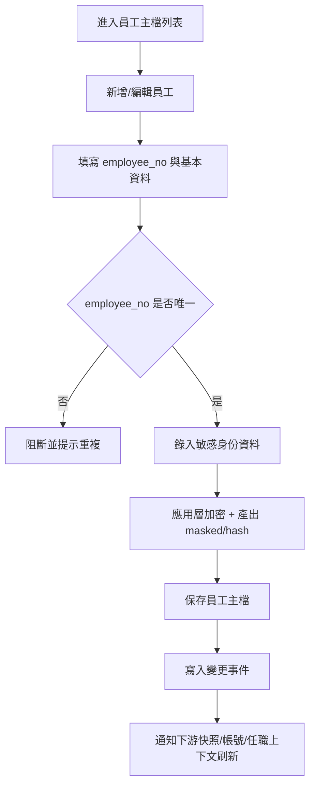
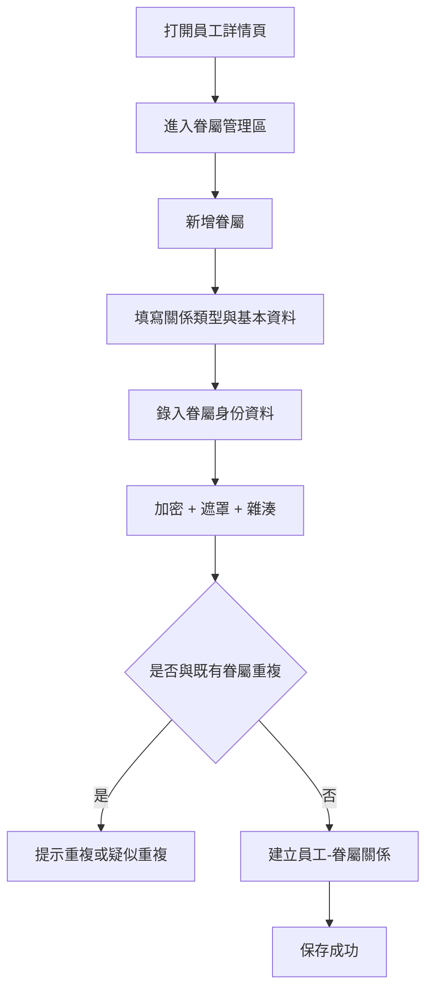
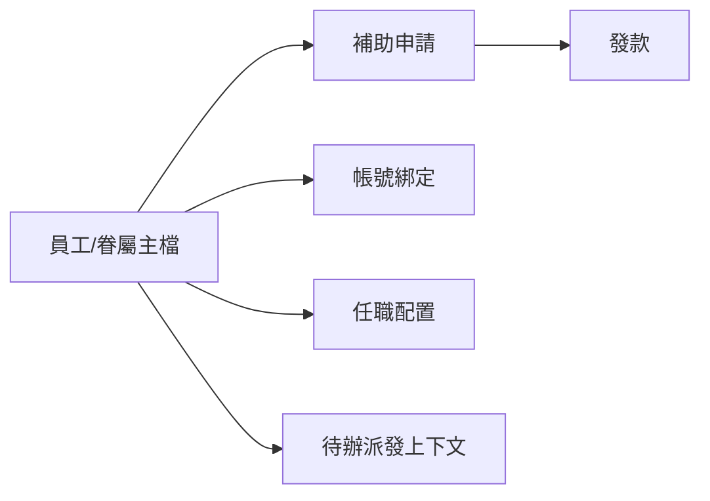
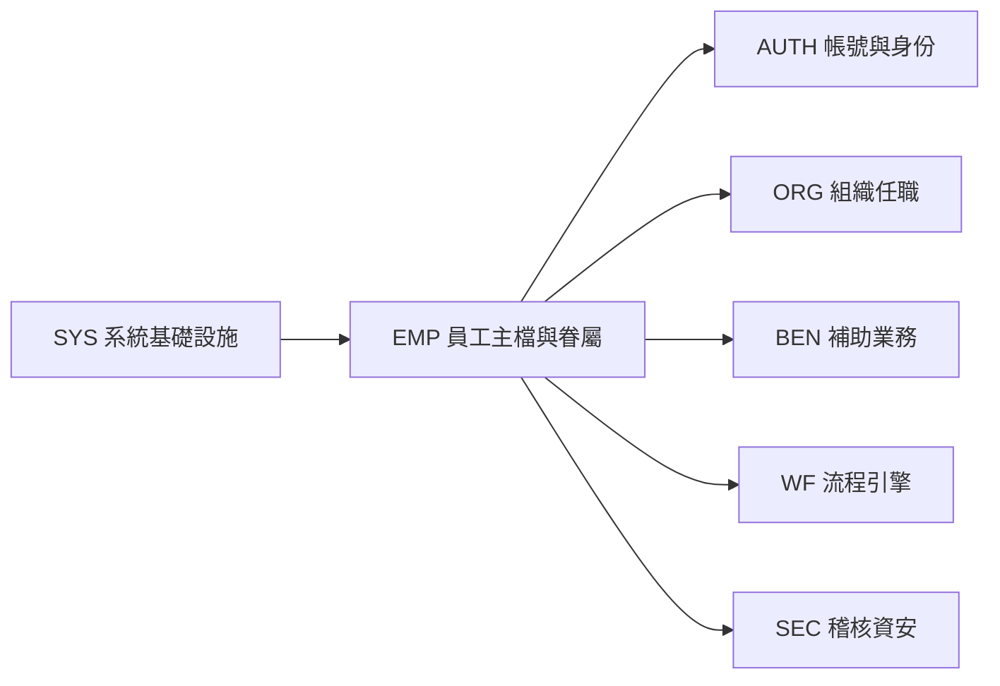
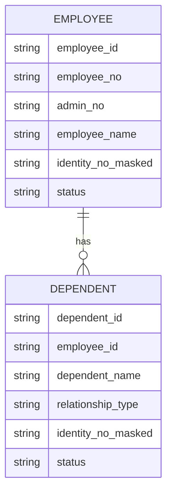
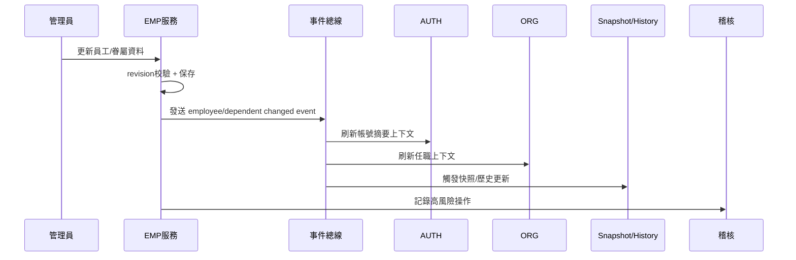

# M05《EMP－員工主檔與眷屬管理》子 PRD

> 來源註記：本文件保留既有模塊拆分方式。凡文中未被客戶原始 PRD 明文定義的欄位、狀態碼、流程抽象或工程命名，均視為內部設計建議，不作為客戶權威需求表述。
>
> 對齊口徑：本文件已按主 PRD `v1.1` 與 `sql/tra_welfare_platform.sql` `v3.0-full` 收斂；員工聯絡資料、領款福利社、眷屬就學資訊與個資保護欄位均以當前資料模型命名為準。

---

[toc]

---

## 1. 模塊名稱

EMP－員工主檔與眷屬管理

## 2. 模塊類型

後台頁面模塊

## 3. 模塊定位

本模塊是整個福利平台的人員資料真源之一，負責維護「員工本人」與「眷屬」兩層資料，為補助申請、資格校驗、流程派送、發款、公告投放、特約商店適用判斷與稽核追溯提供統一的人員主資料基礎。總體 PRD 已將 EMP 定義為維護「員工、眷屬、資格、扣繳與歷史資訊」的職工人員模塊，且在整體模組關係圖中，WF 會直接依賴 EMP。

需要特別說明的是：
本份子 PRD 聚焦 **員工主檔與眷屬管理** 兩個核心對象；EMP 中的補助資格歷史、扣繳歷史、snapshot、變更日誌雖屬同一領域，但因其本質更偏底層資料治理與歷史能力，已在拆分策略中下沉到下一份 **M06《EMP－資格歷史、扣繳歷史、快照與變更日誌》** 做專門展開。這樣可以讓本份文檔更聚焦於可操作頁面與主資料治理。

## 4. 設計目標

本模塊設計目標如下：

1. 建立平台統一的員工主檔，確保後續所有業務都以同一個 `employee_id / employee_no` 為人員識別依據。總體 PRD 已明確 `employee_no` 是 HR 主識別。
2. 建立完整且可控的眷屬資料管理能力，支撐婚嫁、喪葬、子女教育等福利場景的申請引用與資格判定。總體 PRD 雖未逐一列出補助與眷屬的對應關係，但 BEN 的主流程明確依賴資格校驗，而 EMP 是這些校驗的上游資料源。
3. 將敏感個資治理內建於主檔設計中，尤其是本人與眷屬的身分證資料，必須遵守加密、遮罩與不可明文查詢的要求。總體 PRD 已對 `identity_no` 與眷屬身分資料給出直接約束。
4. 為 AUTH、ORG、BEN、PAY、WF 提供穩定的人員資料引用能力，降低跨模塊重複建檔與資料不一致風險。總體 PRD 在字段與模組關係層面已反覆將員工主檔作為上游依賴。

## 5. 業務場景

### 場景 A：系統管理員建立或維護員工主檔

後台管理人員需要建立或維護員工基本資料，例如員工編號、姓名、顯示碼、身份資料、任職狀態與必要聯絡資訊。這些資料後續會被 AUTH 綁定帳號、被 ORG 建立任職、被 BEN 當作申請人主檔引用。總體 PRD 已將 Admin Console 中的「職工人員」列為獨立功能入口。

### 場景 B：維護眷屬資料以支撐福利申請

某員工需要申請子女教育補助、婚嫁補助或喪葬相關補助時，眷屬資料需要可被正確建立、查詢與引用，並具備基本關係類型、身份辨識與有效性控制。EMP 的「眷屬管理」正是這條鏈路的上游。

### 場景 C：補助申請引用員工主檔

BEN 建立申請時，總體 PRD 已明確 `applicant_employee_id` 指向員工主檔。也就是說，補助業務中的申請人不是自由輸入的人員資料，而應該來自 EMP 主檔。

### 場景 D：流程與權限系統按員工主檔建立上下文

ORG 將員工配置到組織角色，WF 根據角色與任職派發待辦，AUTH 又把帳號綁定到員工。若 EMP 主檔不穩定，就會導致登入、授權、待辦與資料歸屬全部失真。總體 PRD 的模組關係圖已清楚畫出 WF 對 EMP 的依賴。

### 場景 E：敏感資料保護與稽核

當後台查看或匯出員工本人及眷屬的敏感身份資料時，平台需遵守遮罩、最小可見、稽核追蹤與不可明文查詢等規則。總體 PRD 已明確指出眷屬身分資料不得明文顯示或明文查詢，平台也要求高風險操作可被稽核。

## 6. 業務流程解讀

### 6.1 員工主檔建立與維護流程

員工主檔不是隨意新增一筆人，而是要先確認它是平台認可的正式員工身份，並且以 HR 主識別為準進行建立或同步。
建議流程如下：

### 6.2 眷屬建立與綁定流程

眷屬資料管理的本質不是獨立建一個人，而是建立「某員工」與「某眷屬」之間的關係資料，同時保證眷屬身份資訊受保護。
建議流程如下：

### 6.3 主檔被業務引用的流程位置

EMP 不直接處理補助申請，但它在業務主線中的位置非常靠前：

這張圖的重點是：EMP 是「人」的真源，而不是只是一個後台資料庫頁面。

## 7. 核心功能拆解

### 7.1 員工主檔管理

負責維護員工的基礎資料與狀態資料。
總體 PRD 已明確 `employee_id`、`employee_no`、`admin_no`、`employee_name` 屬於高頻員工字段，且 `employee_no` 是 HR 主識別。

建議子能力包括：

- 員工列表查詢
- 新增員工
- 編輯員工
- 啟用/停用員工資料狀態
- 查看帳號綁定摘要
- 查看組織任職摘要
- 查看被業務引用概況

### 7.2 眷屬管理

負責維護與員工綁定的眷屬資料。
總體 PRD 已將「眷屬管理」列為 EMP 一級功能，並在資安邊界中明確要求眷屬身分資料不得明文顯示或明文查詢。

建議子能力包括：

- 眷屬列表
- 新增眷屬
- 編輯眷屬
- 關係類型管理
- 有效/失效控制
- 重複資料提示
- 關聯補助使用情況查看

### 7.3 員工與帳號關聯摘要

EMP 不直接管理登入流程，但需要展示該員工對應的帳號摘要，例如是否已建立帳號、帳號狀態、身份提供者等。這些字段在總體 PRD 的員工與帳號字段表中已有定義。

### 7.4 敏感身份資料保護

總體 PRD 對 `identity_no` 已給出明確規則：採應用層加密，另存 `identity_no_masked` 與 `identity_no_hash`；對眷屬身份資料也明確禁止明文顯示與明文查詢。
因此本模塊必須內建：

- 明文僅在受控輸入時短暫存在
- 查詢條件不支持明文身份證號
- 頁面展示默認遮罩
- 匯出需額外權限與稽核

### 7.5 主檔引用關係查看

為避免隨意修改主檔造成下游資料失真，建議提供員工主檔被哪些模塊引用的摘要查看，例如：

- 帳號是否綁定
- 是否已有任職
- 是否有補助申請
- 是否參與發款
- 是否存在待辦上下文

### 7.6 變更驅動下游刷新

雖然 snapshot、歷史與變更日誌會在 M06 詳寫，但本模塊的頁面級操作仍需明確知道：主檔修改後要產生事件，供 snapshot 回寫與夜間校正使用。總體 PRD 已直接要求 snapshot 由事件回寫與夜間校正共同維護，且排程任務中明確包含員工 snapshot 夜間校正。

## 8. 與其他模塊的聯動關係

### 8.1 與 AUTH 的聯動

AUTH 中的帳號與登入身份需要綁定到員工主檔。
EMP 提供：

- `employee_id`
- `employee_no`
- `employee_name`

AUTH 再基於此建立帳號、身份提供者與會話。總體 PRD 的員工與帳號字段說明已把這幾個字段放在同一組核心字段中。

### 8.2 與 ORG 的聯動

ORG 的任職配置是把「員工」掛到組織角色節點上，因此 ORG 的任職操作本質上依賴 EMP 主檔。沒有穩定的員工主檔，就無法完成 M03 的任職配置。

### 8.3 與 BEN 的聯動

BEN 中 `applicant_employee_id` 指向員工主檔，表明所有補助申請的申請人都應從 EMP 取得。對涉及眷屬的補助類型，眷屬資料則成為資格判斷與表單帶入的重要上游。

### 8.4 與 WF 的聯動

總體 PRD 的模組關係圖中，WF 直接依賴 EMP。這意味著流程待辦、角色上下文、申請人資訊顯示等都可能引用員工主檔。

### 8.5 與 SYS 的聯動

員工與眷屬資料的狀態、關係類型、分類、是否有效等建議由 SYS 字典管理；檔案若涉及證明材料，也必須遵循 `file_resource` 統一路徑規則。總體 PRD 對字典驅動與檔案先入 `file_resource` 都有明確要求。

### 8.6 與 SEC 的聯動

查看敏感身份欄位、匯出員工清單、匯出眷屬資料、批量更新主檔，都應進入稽核範圍。總體 PRD 要求高風險操作可被追蹤，且敏感資料保護相關行為要納入治理。

## 9. 頁面規劃

本模塊作為後台頁面模塊，建議至少包含 3 個核心頁面。

### 9.1 頁面一：員工主檔列表頁

**定位**：集中查詢與管理員工主檔。
**頁面區塊**：

1. 查詢條件區
2. 員工列表區
3. 批量操作工具列
4. 狀態摘要區

**查詢條件建議**

- 員工編號 `employee_no`
- 管理編號 `admin_no`
- 員工姓名
- 狀態
- 組織節點/branch
- 是否已綁定帳號
- 是否有任職

**列表欄位建議**

- employee_no
- admin_no
- employee_name
- 身份證遮罩值
- 帳號狀態摘要
- 所屬組織摘要
- 最近更新時間
- 更新人
- 狀態

**主要操作**

- 新增員工
- 編輯
- 查看詳情
- 查看眷屬
- 查看引用
- 匯出（受權限控制）

### 9.2 頁面二：員工詳情頁

**定位**：查看與編輯單一員工主檔。
**頁面區塊**：

1. 基本資料卡
2. 身份資料區
3. 帳號關聯摘要區
4. 任職摘要區
5. 眷屬管理區入口
6. 資料引用區
7. 變更記錄摘要區入口

**交互建議**

- 身分證號默認只展示 masked 值
- 編輯敏感欄位需額外確認
- 展示下游引用風險提示

### 9.3 頁面三：眷屬管理頁/抽屜

**定位**：維護某位員工的眷屬資料。
**頁面區塊**：

1. 員工摘要頭部
2. 眷屬列表
3. 眷屬詳情表單
4. 關係類型欄位
5. 敏感身份資料區
6. 有效狀態與備註區

**眷屬列表欄位建議**

- dependent_name
- relationship_type
- identity_no_masked
- birth_date
- status
- 是否曾被補助引用
- 更新時間

**主要操作**

- 新增眷屬
- 編輯眷屬
- 設為失效
- 查看引用情況

## 10. 底層能力說明

本模塊屬頁面模塊，但仍應輸出可被其他模塊調用的人員主檔能力。

### 10.1 能力邊界

本模塊負責：

- 員工主資料
- 眷屬主資料
- 本人/眷屬敏感身份資料保護
- 帳號/任職摘要展示
- 主檔查詢能力
- 主檔變更事件發送

本模塊不負責：

- 帳號登入與安全控制
- 組織角色任職配置
- 補助資格歷史與扣繳歷史計算
- snapshot 寫回與夜間校正實作
- 流程模板與待辦派送邏輯

### 10.2 建議查詢能力

- `getEmployeeProfile(employeeId)`
- `findEmployeeByEmployeeNo(employeeNo)`
- `listDependents(employeeId)`
- `findDependentByHash(identityNoHash)`
- `getEmployeeAccountSummary(employeeId)`
- `getEmployeeOrgSummary(employeeId)`
- `listEmployeeReferences(employeeId)`

### 10.3 事件輸出建議

- `employee_created`
- `employee_updated`
- `employee_status_changed`
- `dependent_created`
- `dependent_updated`
- `dependent_deactivated`

這些事件可供 M06 snapshot / 變更日誌、AUTH 帳號綁定檢查、ORG 任職同步與 SEC 稽核使用。

## 11. 角色權限與操作路徑

### 11.1 可操作角色

- 系統管理員：主配置者
- 福利社承辦人：視業務授權可查看或局部維護
- 審核主管：通常只讀必要範圍
- 資安稽核人員：查核敏感查看與匯出紀錄，不直接維護一般主檔

總體 PRD 的角色定義中，系統管理員負責帳號、權限、字典與平台治理，是最適合擔任本模塊主配置角色的人。

### 11.2 操作路徑

管理後台 → 職工人員 → 員工主檔
管理後台 → 職工人員 → 員工詳情
管理後台 → 職工人員 → 眷屬管理

### 11.3 權限建議

- 查看員工主檔
- 新增/編輯員工主檔
- 查看眷屬
- 新增/編輯眷屬
- 查看敏感字段
- 匯出主檔
- 匯出眷屬
- 查看引用關係

其中「查看敏感字段」「匯出主檔」「匯出眷屬」建議視為高風險操作。

## 12. 關鍵字段/配置項說明

### 12.1 來自總體 PRD 的核心字段

總體 PRD 已明確給出 EMP 與員工帳號高頻字段。

| 字段名            | 中文名稱   | 用途              | 備註           |
| ----------------- | ---------- | ----------------- | -------------- |
| employee_id       | 員工 ID    | 員工主鍵          | 系統唯一       |
| employee_no       | 員工編號   | HR 主識別         | 對內主查找鍵   |
| admin_no          | 管理編號   | 後台顯示碼/兼容碼 | 不是 HR 主識別 |
| employee_name     | 員工姓名   | 顯示姓名          | 必填           |
| account_status    | 帳號狀態   | 帳號摘要展示      | 來源 AUTH      |
| identity_provider | 身份提供者 | 帳號摘要展示      | 來源 AUTH      |

### 12.2 身份資料字段

總體 PRD 已明確身份資料治理方式。

| 字段名             | 中文名稱     | 用途                    |
| ------------------ | ------------ | ----------------------- |
| identity_no        | 身分證號     | 原始敏感值，應用層加密  |
| identity_no_masked | 身分證遮罩值 | 頁面展示                |
| identity_no_hash   | 身分證雜湊值 | 去重/比對，不作明文查詢 |

### 12.3 建議新增員工主檔字段

| 字段名            | 中文名稱    | 用途                |
| ----------------- | ----------- | ------------------- |
| employee_type     | 員工類型    | 在職/退休等         |
| employment_status | 任用狀態    | 在職/離退/停職等    |
| branch_node_id    | 所屬 branch | 與 ORG 聯動         |
| contact_phone     | 聯絡電話    | 通知輔助            |
| email             | 電子郵件    | AUTH / SYS 通知輔助 |
| snapshot_version  | 快照版本    | 與 M06 聯動         |

### 12.4 建議新增眷屬字段

| 字段名             | 中文名稱     | 用途             |
| ------------------ | ------------ | ---------------- |
| dependent_id       | 眷屬 ID      | 主鍵             |
| employee_id        | 所屬員工 ID  | 關聯員工         |
| dependent_name     | 眷屬姓名     | 顯示用           |
| relationship_type  | 關係類型     | 配偶/子女/父母等 |
| identity_no_masked | 身分證遮罩值 | 展示用           |
| identity_no_hash   | 身分證雜湊值 | 去重/查重        |
| birth_date         | 出生日期     | 資格判斷輔助     |
| status             | 狀態         | 有效/失效        |
| effective_start_at | 生效時間     | 歷史關係控制     |
| effective_end_at   | 失效時間     | 歷史關係控制     |

### 12.5 建議配置項

建議由 SYS 管理：

- emp.employee_status_dictionary
- emp.dependent_relationship_dictionary
- emp.identity_mask_rule
- emp.export_sensitive_requires_approval
- emp.enable_duplicate_identity_hash_check
- emp.profile_edit_audit_enabled

## 13. 異常情況與邊界條件

### 13.1 `employee_no` 重複

由於總體 PRD 已明確 `employee_no` 是 HR 主識別，因此出現重複時必須阻斷建立或更新。

### 13.2 `admin_no` 重複

`admin_no` 雖只是顯示碼與兼容碼，但若要求後台快速識別，也建議維持唯一；至少要有重複提示，不可默默覆蓋。總體 PRD 已明確它不是主識別。

### 13.3 身分證明文查詢

不允許以前台或後台的查詢欄位直接按身份證明文查詢，尤其眷屬更明確禁止明文顯示與明文查詢。

### 13.4 眷屬重複建立

若 `employee_id + relationship_type + identity_no_hash` 已存在有效資料，應提示重複或要求人工確認。

### 13.5 主檔被下游引用後的修改

若該員工已有帳號、任職、申請或發款資料，修改關鍵主識別欄位時需給出風險提示，避免下游關聯斷裂。

### 13.6 歷史區間重疊

總體 PRD 已明確 EMP 歷史區間不可重疊。雖本份不展開資格/扣繳歷史，但對眷屬有效期與關係記錄同樣建議沿用此原則。

### 13.7 並發更新覆蓋

總體 PRD 建議所有高風險主表都加 `revision`。對員工主檔與眷屬主檔，同樣建議使用 revision 避免多人同時編輯覆蓋。

## 14. Mermaid 圖

### 14.1 EMP 與周邊模塊關係圖

### 14.2 員工與眷屬資料模型圖

### 14.3 主檔變更與下游同步圖

## 15. 研發落地建議

### 15.1 資料設計建議

- 員工主檔與眷屬主檔分表設計
- 敏感身份值採應用層加密存儲
- 額外保存 masked/hash，滿足展示與查重
- 主表增加 `revision`，符合總體 PRD 的高風險主表原則。

### 15.2 查詢設計建議

- 常用查詢走 `employee_no`、`admin_no`、`employee_name`
- 禁止直接用明文身份證作搜索鍵
- 眷屬查重優先走 `identity_no_hash`
- 列表頁默認不返回敏感明文字段

### 15.3 事件設計建議

- 主檔修改即時發事件
- 夜間校正負責對 snapshot 做收斂修正
  總體 PRD 已明確 snapshot 由事件回寫與夜間校正共同維護，且排程任務明列員工 snapshot 夜間校正。

### 15.4 頁面與交互建議

- 敏感欄位用遮罩顯示
- 高風險編輯需要二次確認
- 匯出按鈕需單獨權限
- 眷屬新增頁先做欄位結構圖再進高保真，符合總體 PRD 的產品/設計協作建議。

## 16. 測試驗收要點

### 16.1 功能驗收

1. 可建立與編輯員工主檔。
2. `employee_no` 作為 HR 主識別可正確唯一校驗。
3. 可在員工下建立、編輯、失效眷屬資料。
4. 補助申請可正確引用員工主檔。
   以上第 2、4 點直接對應總體 PRD 的 EMP 要求與 BEN 字段定義。

### 16.2 安全驗收

1. `identity_no` 以應用層加密方式存儲。
2. 頁面僅展示 `identity_no_masked`。
3. 眷屬身份資料不可明文顯示或明文查詢。
4. 敏感查看與匯出可進入稽核。
   以上第 1、3 點直接對應總體 PRD 的個資與資安邊界。

### 16.3 聯動驗收

1. 員工主檔更新後，AUTH 帳號摘要可正確刷新。
2. 員工主檔更新後，ORG 任職查詢不失真。
3. 員工/眷屬資料修改後，可觸發後續 snapshot 更新鏈路。
4. WF 引用員工上下文時能取得最新有效資料。
   以上聯動要求與總體 PRD 的模組關係圖及 snapshot 維護原則一致。

### 16.4 邊界驗收

1. 重複 `employee_no` 建立被阻斷。
2. 明文身份證搜尋被阻斷。
3. 眷屬重複資料建立能給出提示。
4. 並發編輯時，revision 能阻止靜默覆蓋。
5. 涉及歷史有效期的眷屬關係不可出現重疊區間。
   以上第 4 點對應總體 PRD 的工程實施建議，第 5 點對應 EMP 歷史區間不可重疊要求。
