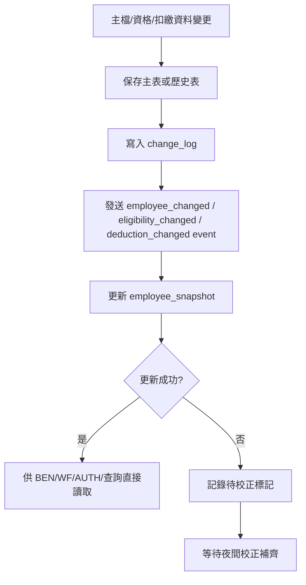
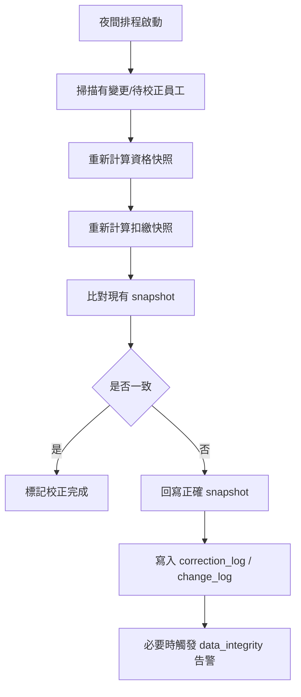
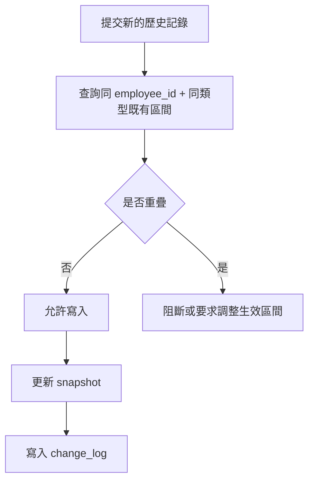
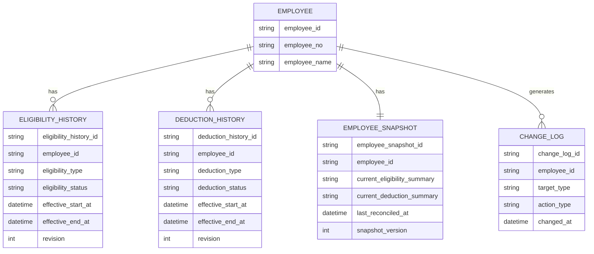
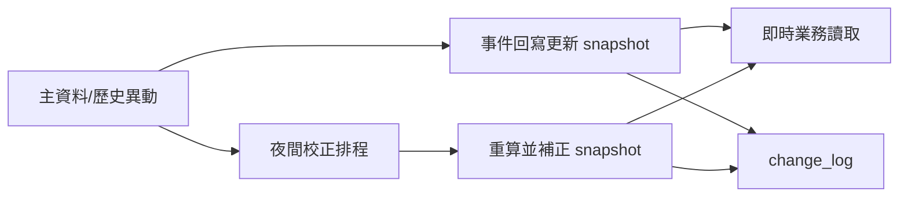
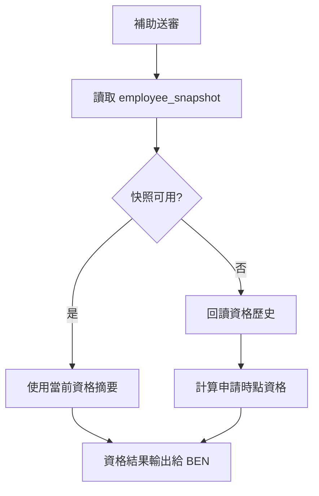

# M06《EMP－資格歷史、扣繳歷史、快照與變更日誌》子 PRD

> 來源註記：本文件保留既有模塊拆分方式。凡文中未被客戶原始 PRD 明文定義的欄位、狀態碼、流程抽象或工程命名，均視為內部設計建議，不作為客戶權威需求表述。
>
> 對齊口徑：本文件已按主 PRD `v1.1` 與 `sql/tra_welfare_platform.sql` `v3.0-full` 收斂；歷史、快照與夜間校正屬當前資料治理實作，不直接替代客戶原始欄位表述。

---

[toc]

---

## 1. 模塊名稱

EMP－資格歷史、扣繳歷史、快照與變更日誌

## 2. 模塊類型

底層能力模塊

## 3. 模塊定位

本模塊是 EMP 域中的資料治理中台，負責把「員工當前有效狀態」與「歷史演變過程」分離管理。
如果 M05 解決的是「員工與眷屬現在是誰」，那 M06 解決的就是：

- 某員工在某段時間內是否具備某類福利資格
- 某員工在某段時間內是否有特定扣繳狀態或扣繳紀錄
- 目前業務流程校驗時應該讀哪一組即時快照
- 所有主檔、資格、扣繳相關變更如何被完整留痕並可追溯

總體 PRD 對 EMP 的要求不是只有主檔，而是明確包含「補助資格歷史、扣繳歷史、變更日誌」，並要求 snapshot 由事件回寫與夜間校正共同維護、歷史區間不可重疊。這代表 EMP 不能只是一組 CRUD 頁面，而必須有一層穩定的歷史與快照能力。

## 4. 設計目標

本模塊設計目標如下：

1. 建立可追溯的資格歷史與扣繳歷史模型，讓福利資格判斷不依賴單一當前欄位，而是可回看某個時間點的有效狀態。總體 PRD 已明確將資格歷史與扣繳歷史列為 EMP 一級功能，並要求歷史區間不可重疊。
2. 建立即時快照能力，讓 BEN 等業務在送審、校驗與查詢時能讀到穩定、可高效使用的當前結果，而不必每次從多張歷史表即時計算。總體 PRD 已明確要求 snapshot 由事件回寫與夜間校正共同維護。
3. 將資料變更過程結構化留痕，支撐問題追查、版本衝突定位、稽核驗證與回溯。總體 PRD 明確包含 Change Log，且高風險操作應可被追蹤。
4. 為 BEN 的資格檢查、AUTH/ORG/WF 的員工上下文、SEC 的資料完整性與高風險治理提供統一資料來源。總體 PRD 的模塊關係圖已顯示 WF 直接依賴 EMP；BEN 在送審時必須驗證資格；SEC 掃描規則中明確有 `data_integrity` 分類。

## 5. 業務場景

### 場景 A：補助送審前檢查當前資格

職工在 BEN 送審時，系統必須先做資格、附件與年度上限檢查；其中資格部分不應臨時拼湊，而要從本模塊提供的 snapshot 或有效歷史中取得結論。總體 PRD 已明確 BEN 送審前要驗證資格。

### 場景 B：補助案件需要回溯過去某時間點資格

某案件若日後被申訴或稽核，需要回答「申請當時是否具備資格」，就不能只看現在快照，而要回看對應申請日的資格歷史區間。總體 PRD 將平台價值明確定義為每張申請、每次處理都可追蹤，這正是歷史資料存在的必要性。

### 場景 C：扣繳狀態影響福利計算或資格判斷

某些福利場景可能依賴員工是否處於特定扣繳狀態，或需要將扣繳資訊作為資格輔助判斷來源。總體 PRD 雖未展開扣繳規則公式，但既已將 Payroll Deduction History 列為 EMP 一級功能，代表它必須成為可獨立治理與查詢的資料源。

### 場景 D：主檔修改後需要同步更新即時快照

員工基本資料、眷屬、資格、扣繳任一項改變後，BEN、WF、AUTH 或報表查詢都希望看到最新有效摘要，因此系統需透過事件回寫即時更新 snapshot；若即時更新失敗或遺漏，夜間校正任務要補齊。這是總體 PRD 的直接規則。

### 場景 E：資料異常追查

若出現資格區間重疊、扣繳歷史缺口、快照與歷史不一致、送審時讀到錯誤資格等問題，系統管理員與資安稽核人員需要靠變更日誌與資料完整性規則追查根因。SEC 規則分類已明確存在 `data_integrity`，總體 PRD 亦強調高風險操作與異常可被追蹤。

## 6. 業務流程解讀

### 6.1 歷史 + 快照雙軌設計原則

本模塊不是只存歷史，也不是只存當前快照，而是採用雙軌設計：

- **歷史表**：保留完整的有效區間與變更過程
- **快照表**：保留當前可直接使用的即時摘要
- **變更日誌**：保留誰在什麼時候把什麼從什麼改成什麼

這種設計直接對應總體 PRD 的三個關鍵要求：
一是 EMP 有資格歷史、扣繳歷史與變更日誌；二是 snapshot 需由事件回寫與夜間校正共同維護；三是歷史區間不可重疊。

### 6.2 事件回寫流程

建議所有 EMP 主資料相關變更，都先落在對應主表/歷史表，再發事件更新 snapshot。

### 6.3 夜間校正流程

即時事件回寫主要保證「快」，夜間校正主要保證「準」。
總體 PRD 明確把「員工 snapshot 夜間校正」列入排程任務最低要求。

### 6.4 歷史區間治理流程

總體 PRD 明確要求歷史區間不可重疊。這意味著任何資格歷史或扣繳歷史寫入，都不能只是新增一筆，必須先檢查與既有有效區間的關係。

建議流程如下：

### 6.5 BEN 讀取流程中的位置

BEN 在送審時要做資格檢查；對工程來說，最穩定的方式是：

1. 優先讀 employee_snapshot 中的當前資格摘要
2. 若需回溯或爭議處理，再讀資格歷史
3. 若快照失真，由夜間校正或人工修復補正

這樣既滿足效能，也保留可追溯性。總體 PRD 已明確 BEN 送審必須驗證資格，主表又要求 `revision` 避免覆蓋，因此 M06 也必須具備版本與一致性治理意識。

## 7. 核心功能拆解

### 7.1 補助資格歷史管理

負責記錄員工在不同時間區間的福利資格狀態與依據。
子能力建議包括：

- 建立資格歷史記錄
- 編輯資格歷史記錄
- 關閉資格區間
- 查詢某員工當前資格
- 查詢某時間點資格
- 檢查區間重疊
- 查看資格變更來源

總體 PRD 已將 Subsidy Eligibility History 列為 EMP 一級功能，並要求歷史區間不可重疊。

### 7.2 扣繳歷史管理

負責記錄員工扣繳相關歷史變化。
子能力建議包括：

- 建立扣繳歷史
- 編輯/終止扣繳區間
- 查詢當前扣繳狀態
- 查詢歷史扣繳記錄
- 區間重疊與斷裂檢查
- 扣繳摘要回寫快照

總體 PRD 已將 Payroll Deduction History 列為 EMP 一級功能。

### 7.3 即時快照管理

快照用於承接下游高頻讀取。
建議快照至少覆蓋：

- 員工當前主檔摘要
- 當前有效資格摘要
- 當前有效扣繳摘要
- 任職/帳號/狀態關聯摘要版本號
- 最近校正時間

總體 PRD 明確要求 snapshot 欄位由事件回寫與夜間校正共同維護，因此快照不是輔助欄位，而是正式能力層。

### 7.4 變更日誌

負責記錄資料變更前後差異與來源。
建議範圍包括：

- 員工主檔關鍵字段變更
- 眷屬資料變更
- 資格歷史新增/修改/終止
- 扣繳歷史新增/修改/終止
- snapshot 校正回寫
- 人工修復資料操作

總體 PRD 已將 Change Log 列為 EMP 一級功能。

### 7.5 一致性檢查與異常標記

本模塊需提供至少 4 類一致性檢查：

- 歷史區間是否重疊
- 快照是否與歷史一致
- 主檔與快照摘要是否不一致
- 是否存在缺失的變更日誌或事件回寫失敗

由於 SEC 掃描規則已有 `data_integrity` 類型，這些檢查天然可以成為該規則分類的輸入。

### 7.6 版本衝突防護

總體 PRD 明確指出高風險主表應加 `revision`，且已送審資料被更新時要提示版本衝突而不是直接覆蓋。雖那條規則出現在流程邊界中，但它反映的是整體資料治理原則，同樣應延伸到 M06 的歷史主表與快照表。
因此建議：

- 資格歷史表加 `revision`
- 扣繳歷史表加 `revision`
- 快照表加 `revision`
- 日誌表可不依賴 revision，但要保存來源版本

## 8. 與其他模塊的聯動關係

### 8.1 與 M05《員工主檔與眷屬管理》的聯動

M05 維護主檔，M06 維護主檔延伸出的歷史、快照與變更。
兩者邊界如下：

- M05 管現在的主資料內容
- M06 管現在如何被摘要、過去如何演變、變更如何留痕

### 8.2 與 BEN 的聯動

BEN 在送審時要驗證資格、附件與上限；其中資格檢查直接依賴本模塊輸出的資格快照或資格歷史。總體 PRD 已明確 BEN 送審前不可跳過資格檢查。

### 8.3 與 WF 的聯動

總體 PRD 的模塊關係圖顯示 WF 依賴 EMP。對 M06 而言，WF 的實際依賴主要體現在：

- 待辦顯示中的員工摘要
- 申請人資料一致性
- 歷史回溯時的上下文查詢

### 8.4 與 AUTH / ORG 的聯動

當 M05 中員工狀態、身份摘要、組織上下文變動時，M06 可為 AUTH / ORG 提供穩定快照摘要，降低每次都回查多表的成本。總體 PRD 已將員工與帳號字段、組織與任職結構視為跨模塊共用字段體系。

### 8.5 與 SYS 的聯動

歷史類型、狀態、變更原因、校正來源、異常類型、快照版本狀態建議全部由 SYS 字典管理，符合總體 PRD 「所有業務狀態由字典驅動」原則。

### 8.6 與 SEC 的聯動

SEC 有 `data_integrity` 規則分類；本模塊中的區間重疊、快照不一致、異常校正、敏感資料修復都可作為該分類輸入。總體 PRD 已明確 SEC 規則分類與高風險同步寫入原則。

## 9. 頁面規劃

本模塊屬底層能力模塊，不以獨立複雜頁面為主；但為支撐治理與排錯，建議提供 3 個輔助型後台視圖。

### 9.1 視圖一：資格/扣繳歷史查看頁

**定位**：供管理員查看某員工的歷史區間與當前有效記錄。
**區塊建議**：

1. 員工摘要頭部
2. 資格歷史列表
3. 扣繳歷史列表
4. 當前有效標記
5. 區間衝突提示

### 9.2 視圖二：快照檢查頁

**定位**：供管理員查看 snapshot 與歷史的一致性。
**區塊建議**：

1. 員工摘要
2. 當前快照摘要
3. 歷史推導結果摘要
4. 差異比對區
5. 手動重算/標記待校正按鈕

### 9.3 視圖三：變更日誌頁

**定位**：查詢某員工、某字段、某類資料的變更過程。
**區塊建議**：

1. 查詢條件區
2. 變更事件列表
3. before/after 差異檢視
4. 來源操作人與時間
5. 關聯 revision / correction / audit 摘要

## 10. 底層能力說明

### 10.1 能力邊界

本模塊負責：

- 補助資格歷史
- 扣繳歷史
- 員工即時快照
- 變更日誌
- 事件回寫
- 夜間校正
- 資料一致性檢查

本模塊不負責：

- 員工與眷屬主檔表單輸入
- BEN 業務規則本身
- AUTH 登入與會話
- ORG 任職配置
- SEC 告警查詢頁展示

### 10.2 輸入輸出

**輸入**

- employee 主檔變更事件
- dependent 變更事件
- eligibility history 變更
- deduction history 變更
- manual correction 指令
- nightly reconcile scheduler trigger

**輸出**

- employee_snapshot
- current eligibility summary
- current deduction summary
- change_log record
- data_integrity issue
- correction result
- audit event（必要時）

### 10.3 建議能力接口

- `getEmployeeSnapshot(employeeId)`
- `getEligibilityAt(employeeId, atTime)`
- `getCurrentEligibility(employeeId)`
- `getCurrentDeduction(employeeId)`
- `listEligibilityHistory(employeeId)`
- `listDeductionHistory(employeeId)`
- `rebuildEmployeeSnapshot(employeeId)`
- `listEmployeeChangeLog(employeeId, targetType?)`

### 10.4 能力實現原則

- 優先事件回寫，補以夜間校正
- 快照只存當前有效摘要，不取代歷史
- 歷史為真源，快照為讀取加速層
- 所有區間變動必須經過重疊校驗
- 所有敏感修復與人工重算需可稽核

## 11. 角色權限與操作路徑

### 11.1 可操作角色

- 系統管理員：主配置與修復角色
- 福利社承辦人：通常僅查看必要摘要，不應大範圍改歷史
- 審核主管：通常只讀資格結果，不做底層維護
- 資安稽核人員：查看資料異常與修復軌跡

總體 PRD 對系統管理員與資安稽核人員的治理責任界定，與本模塊的操作分工是一致的。

### 11.2 操作路徑

管理後台 → 職工人員 → 資格/扣繳歷史
管理後台 → 職工人員 → 快照檢查
管理後台 → 職工人員 → 變更日誌

### 11.3 權限建議

- 查看資格歷史
- 編輯資格歷史
- 查看扣繳歷史
- 編輯扣繳歷史
- 查看快照
- 手動重算快照
- 查看變更日誌
- 匯出歷史與日誌

其中「編輯歷史」「手動重算快照」「匯出歷史與日誌」建議視為高風險操作。

## 12. 關鍵字段/配置項說明

### 12.1 來自總體 PRD 的核心字段與原則

總體 PRD 已明確 EMP 相關高頻字段與通用欄位，包括 `employee_id`、`employee_no`、`admin_no`、`employee_name`、`revision`，以及 snapshot 維護、歷史區間不可重疊等治理原則。

### 12.2 資格歷史字段

| 字段名                 | 中文名稱     | 用途                          | 備註     |
| ---------------------- | ------------ | ----------------------------- | -------- |
| eligibility_history_id | 資格歷史 ID  | 主鍵                          | 唯一     |
| employee_id            | 員工 ID      | 關聯員工                      | 必填     |
| eligibility_type       | 資格類型     | 區分福利資格類別              | 字典驅動 |
| eligibility_status     | 資格狀態     | eligible/ineligible 等        | 字典驅動 |
| effective_start_at     | 生效開始     | 區間起點                      | 必填     |
| effective_end_at       | 生效結束     | 區間終點                      | 可空     |
| source_type            | 來源類型     | manual/import/rule/correction | 建議     |
| source_ref_id          | 來源參照     | 對應來源單據/規則             | 可選     |
| revision               | 樂觀鎖版本號 | 併發防護                      | 建議必填 |

### 12.3 扣繳歷史字段

| 字段名               | 中文名稱     | 用途                     |
| -------------------- | ------------ | ------------------------ |
| deduction_history_id | 扣繳歷史 ID  | 主鍵                     |
| employee_id          | 員工 ID      | 關聯員工                 |
| deduction_type       | 扣繳類型     | 字典驅動                 |
| deduction_status     | 扣繳狀態     | active/inactive 等       |
| amount               | 金額         | 可選，視業務需要         |
| effective_start_at   | 生效開始     | 必填                     |
| effective_end_at     | 生效結束     | 可空                     |
| source_type          | 來源類型     | manual/import/correction |
| revision             | 樂觀鎖版本號 | 併發防護                 |

### 12.4 快照字段

| 字段名                      | 中文名稱         | 用途                                |
| --------------------------- | ---------------- | ----------------------------------- |
| employee_snapshot_id        | 快照 ID          | 主鍵                                |
| employee_id                 | 員工 ID          | 關聯員工                            |
| current_eligibility_summary | 當前資格摘要     | BEN/WF 讀取                         |
| current_deduction_summary   | 當前扣繳摘要     | 業務摘要                            |
| snapshot_version            | 快照版本         | 便於校驗                            |
| last_event_applied_at       | 最近事件應用時間 | 一致性檢查                          |
| last_reconciled_at          | 最近夜間校正時間 | 排程追蹤                            |
| snapshot_status             | 快照狀態         | normal/pending_reconcile/conflicted |

### 12.5 變更日誌字段

| 字段名          | 中文名稱    | 用途                                             |
| --------------- | ----------- | ------------------------------------------------ |
| change_log_id   | 變更日誌 ID | 主鍵                                             |
| employee_id     | 員工 ID     | 關聯員工                                         |
| target_type     | 目標類型    | profile/dependent/eligibility/deduction/snapshot |
| target_id       | 目標 ID     | 被操作資料主鍵                                   |
| action_type     | 動作類型    | create/update/close/rebuild/correct              |
| before_snapshot | 變更前摘要  | JSON 摘要                                        |
| after_snapshot  | 變更後摘要  | JSON 摘要                                        |
| changed_by      | 操作人      | 稽核                                             |
| changed_at      | 變更時間    | 稽核                                             |
| reason          | 變更原因    | 建議必填                                         |

### 12.6 建議配置項

建議由 SYS 管理：

- emp.snapshot.reconcile.cron
- emp.snapshot.rebuild.batch_size
- emp.history.overlap_block_enabled
- emp.history.allow_gap
- emp.changelog.retention_months
- emp.snapshot.auto_repair_enabled
- emp.data_integrity.alert_enabled

## 13. 異常情況與邊界條件

### 13.1 歷史區間重疊

總體 PRD 已明確要求歷史區間不可重疊，因此任何資格或扣繳記錄只要與現有有效區間重疊，就應阻斷或進入人工調整。

### 13.2 快照缺失

若員工已有歷史資料但沒有 snapshot，系統應標記待校正，不應讓下游直接讀空值當成無資格。

### 13.3 快照與歷史不一致

若快照與歷史推導結果不一致，應以歷史為真源重建快照；必要時進入 `data_integrity` 告警。

### 13.4 事件回寫失敗

事件回寫失敗時，不應中斷主交易保存，但要標記待補償，並由夜間校正補齊。這與總體 PRD 對高風險/一般操作可同步或非同步寫入的整體實施思路一致。

### 13.5 並發更新

總體 PRD 對高風險主表明確建議使用 `revision`；因此歷史表與快照表並發編輯時，應提示版本衝突，而不是直接覆蓋。

### 13.6 夜間校正覆寫人工修復

夜間校正不應無條件覆蓋人工標記為已確認的修復結果；需保留 correction source 與優先級規則。

### 13.7 敏感資料在變更日誌中的暴露

Change Log 不應明文保存 `identity_no` 等敏感資料；若需留痕，只能存 masked/hash 或字段級變更摘要。這與總體 PRD 對個資保護的整體要求一致。

## 14. Mermaid 圖

### 14.1 EMP 歷史/快照/日誌模型圖

### 14.2 事件回寫 + 夜間校正雙軌圖

### 14.3 BEN 讀取資格決策圖

## 15. 研發落地建議

### 15.1 資料模型建議

- 將資格歷史、扣繳歷史、快照、變更日誌拆表
- 歷史表與快照表均加 `revision`
- 歷史表以 `employee_id + 類型 + 生效區間` 做核心索引
- Change Log 只保留必要前後摘要，不保留敏感明文

這與總體 PRD 的通用欄位、revision 原則與個資保護方向一致。

### 15.2 計算層建議

- 下游高頻場景優先讀 snapshot
- 歷史資料作為真源與回溯依據
- 快照重建邏輯應可單人重算，也可批量夜間校正
- 區間重疊校驗封裝成共用方法，避免各處重寫

### 15.3 事件與排程建議

- EMP 主檔、眷屬、資格、扣繳任一變動都應發事件
- 夜間校正只修正一致性，不替代白天的正常即時回寫
- 排程執行結果應留 correction log，便於排錯
  總體 PRD 已明確夜間校正是必備排程之一。

### 15.4 安全與稽核建議

- 歷史修復、快照重算、批量回補應全部進入高風險稽核
- 若修復造成業務結果變動，應保留原因與來源
- `data_integrity` 類異常可與 SEC 告警規則對接
  總體 PRD 已明確 SEC 規則分類與高風險操作同步寫入原則。

## 16. 測試驗收要點

### 16.1 功能驗收

1. 可建立與查詢資格歷史。
2. 可建立與查詢扣繳歷史。
3. 主資料或歷史變更後，snapshot 可被即時更新。
4. 變更操作可寫入 change log。
   以上第 1、2、3、4 點都直接對應 EMP 模塊與 snapshot / change log 要求。

### 16.2 一致性驗收

1. 資格歷史區間不可重疊。
2. 扣繳歷史區間不可重疊。
3. 快照與歷史推導結果不一致時，夜間校正可修正。
4. 事件回寫失敗後，夜間校正可補齊。
   以上第 1、3、4 點直接對應總體 PRD 的區間與 snapshot 維護原則。

### 16.3 聯動驗收

1. BEN 送審時可正確讀取資格結果。
2. WF 顯示申請人員工摘要時，能讀到正確 snapshot。
3. M05 修改員工資料後，M06 能產生對應變更與快照刷新。
4. SEC 可接收到資料完整性異常輸入。
   以上聯動均可由總體 PRD 的模塊關係與 SEC 規則分類支撐。

### 16.4 邊界與安全驗收

1. 並發編輯歷史資料時，revision 能阻止靜默覆蓋。
2. Change Log 不保存敏感明文身份值。
3. 人工修復與快照重算都會產生稽核。
4. 夜間校正不會無條件覆蓋人工已確認修復。
   以上第 1 點直接對應總體 PRD 的工程實施建議，第 3 點對應高風險操作可被追蹤原則。
