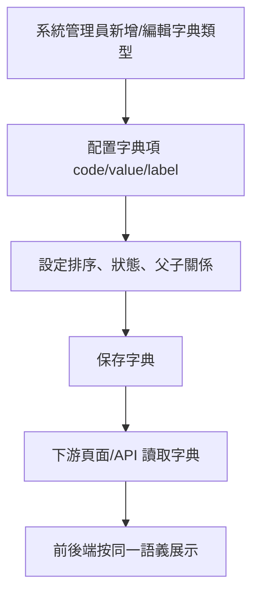
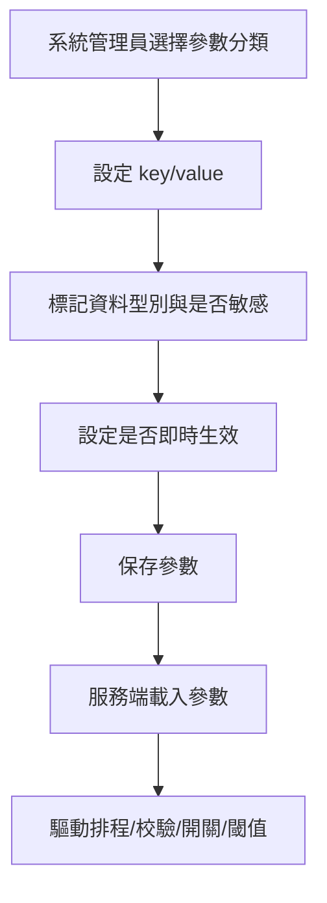
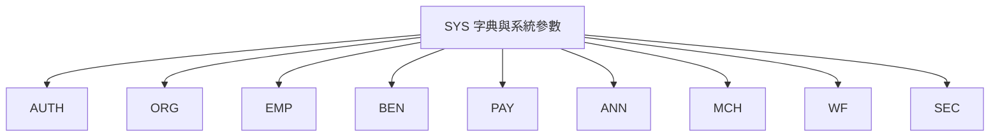
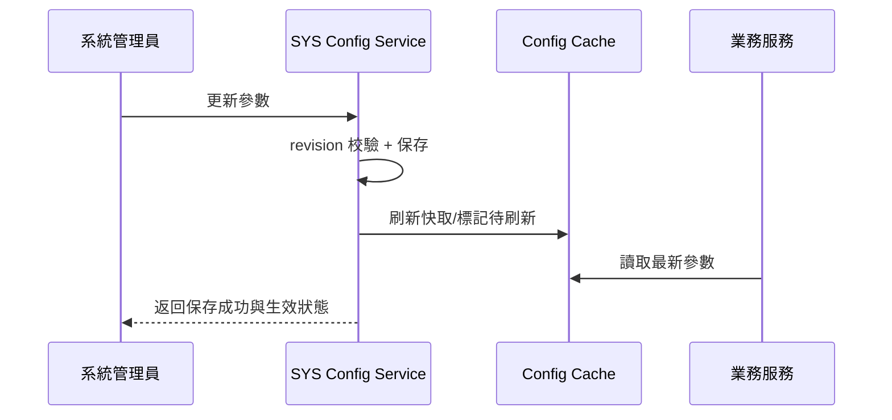

# M07《SYS－字典與系統參數》子 PRD

> 來源註記：本文件保留既有模塊拆分方式。凡文中未被客戶原始 PRD 明文定義的欄位、狀態碼、流程抽象或工程命名，均視為內部設計建議，不作為客戶權威需求表述。
>
> 對齊口徑：本文件已按主 PRD `v1.1` 與 `sql/tra_welfare_platform.sql` `v3.0-full` 收斂；字典類型、參數鍵與版本治理屬當前系統落地方式，不等同客戶原始字面需求。

---

[toc]

---

## 1. 模塊名稱

SYS－字典與系統參數

## 2. 模塊類型

後台頁面模塊

## 3. 模塊定位

本模塊是整個福利平台的「治理開關層」與「語義統一層」。
如果前面的 BEN、PAY、ANN、MCH、ORG、AUTH、EMP 解決的是具體業務流程與規則執行，那 M07 解決的是這些規則在系統裡**如何被配置、如何被統一命名、如何避免散落硬編碼**。總體 PRD 已明確將 SYS 定義為提供字典、參數、檔案、通知與模板等基礎能力的系統基礎設施，並且要求所有業務狀態由 `sys_dictionary` 驅動，不建議在前端硬編碼。

本份子 PRD 只聚焦 SYS 中的前兩塊：

- 字典管理（Dictionary Management）
- 系統參數（System Configuration）

而檔案、通知中心、通知模板、外寄任務佇列與送達記錄，會在後續 M08、M09 再單獨拆開。這樣做的原因是：字典與參數屬於全域配置治理；檔案與通知則更偏共用服務與消息流轉能力，工程邊界不同。總體 PRD 的 SYS 功能清單也正好能支持這種拆法。

## 4. 設計目標

本模塊設計目標如下：

1. 建立平台級統一語義層，讓「狀態、類型、分類、角色標籤、投放範圍」等跨模塊概念都從字典而來，而不是各頁各寫一套。總體 PRD 已明確字典需支援這些配置。
2. 建立系統參數治理能力，讓安全閾值、排程開關、功能開關、預設值、校驗閾值等可配置化，降低硬編碼風險。總體 PRD 已明確系統管理能力是平台可管理性的核心來源之一。
3. 為前台、後台、流程、通知、公告、商店、權限與稽核提供統一配置來源，提升跨模塊一致性。總體 PRD 將平台價值之一明確定義為「狀態、按鈕、流程、通知與權限規則統一治理」。
4. 為產品、設計、工程與測試提供共同語言基礎，避免出現文案叫法、枚舉值、頁面狀態與 API 狀態不一致。總體 PRD 在產品與設計協作建議中已明確要求頁面命名、狀態命名、按鈕文案先統一。

## 5. 業務場景

### 場景 A：系統管理員配置全站狀態字典

系統管理員需要維護系統中常見的狀態字典，例如通用狀態、資料分類、角色標籤、公告投放範圍、商店分類等，使 BEN、PAY、ANN、MCH、ORG、EMP 等頁面都能引用同一套選項。總體 PRD 已明確系統管理員負責字典治理，且字典要支援狀態、類型、分類、投放範圍、角色標籤等配置。

### 場景 B：工程需要避免前端硬編碼

某個業務頁要顯示 `pending / approved / returned / rejected` 等狀態，如果沒有統一字典，前端、後端、測試與文件很容易各叫各的。總體 PRD 已直接要求所有業務狀態由 `sys_dictionary` 驅動，不建議在前端硬編碼。

### 場景 C：系統參數驅動安全與流程行為

例如 AUTH 的 Captcha 觸發次數、WF 的超時掃描開關、ANN 的排程開關、通知發送排程、快照夜間校正排程，都不適合寫死在程式內，而應由系統參數統一治理。總體 PRD 已列出多種必備排程任務，也將平台治理定位為依賴字典、模板、參數與角色設定，而不是依賴硬編碼。

### 場景 D：不同模塊共用同一語義

公告模塊的 audience scope、ORG 的角色標籤、MCH 的分類代碼、全站的 status 欄位，都需要共享字典語義。總體 PRD 在 SYS 與字段說明中已反覆表明 `status` 是通用欄位，且由字典管理。

### 場景 E：測試與維運需要查看當前生效配置

當測試發現某頁面狀態不正確、某排程未觸發、某規則閾值異常時，需要能在後台快速確認字典與系統參數是否被調整，以及變更時間與變更人。總體 PRD 雖未逐一列出此頁面，但其平台治理定位、高風險追溯原則與產品/工程協作建議都支持這種可查、可控、可追蹤的設計方向。

## 6. 業務流程解讀

### 6.1 字典治理流程

字典不是單純一張「下拉選單表」，而是整個平台語義的底座。
建議流程如下：

這一流程對應總體 PRD 的兩個核心要求：
一是字典要支援狀態、類型、分類、投放範圍、角色標籤等配置；二是所有業務狀態由字典驅動、不應前端硬編碼。

### 6.2 系統參數治理流程

系統參數與字典不同，它不主要解決「顯示語義」，而是解決「系統行為與閾值」。
建議流程如下：

這樣設計能讓 AUTH、WF、ANN、EMP 等模塊把大量可變配置轉到系統參數層處理，符合總體 PRD 的治理思路。

### 6.3 SYS 在整體架構中的位置

總體 PRD 的模組關係圖中，Admin Console 直接依賴 SYS，SEC 也直接依賴 SYS；同時 BEN 補助送審時序圖中，業務服務會調用 SYS 的通知服務。這表示 SYS 並不是一個邊角設定模塊，而是支撐前後台與治理能力的共用基礎設施。

### 6.4 字典與參數的分工原則

建議後續所有模塊遵守這條治理邊界：

- **字典**：用來定義枚舉語義、可選值、展示標籤、排序與狀態
- **參數**：用來定義開關、閾值、預設值、排程配置、行為策略

例如：

- `status`、`role_tag`、`scope_type / announcement_scope_type` 應走字典
- `auth.captcha.fail_threshold`、`wf.timeout.scan.enabled`、`ann.schedule.cron` 應走系統參數

這種分工雖是子 PRD 細化，但完全符合總體 PRD 對「字典驅動狀態、參數治理平台」的定位。

## 7. 核心功能拆解

### 7.1 字典類型管理

負責維護平台有哪些字典類型。
例如：

- 通用狀態字典
- 公告投放範圍字典
- 角色標籤字典
- 商店分類字典
- 業務域字典
- 操作類型字典

總體 PRD 已點名字典至少要能支援狀態、類型、分類、投放範圍、角色標籤等配置。

### 7.2 字典項管理

在每個字典類型下，維護具體字典項。
建議能力包括：

- 新增字典項
- 編輯字典項
- 啟用/停用字典項
- 設定排序
- 設定父子級聯
- 設定前台/後台顯示標籤
- 設定是否允許被刪除

### 7.3 字典引用檢查

由於字典會被大量下游頁面與資料記錄引用，因此停用或刪除前應檢查引用影響。
例如：

- 某狀態字典是否已被 BEN 主表使用
- 某角色標籤是否已被 ORG 角色引用
- 某 audience scope 是否已被 ANN 草稿使用

這雖是子 PRD 補強，但與總體 PRD 的「平台治理而非硬編碼」方向一致。

### 7.4 系統參數分類管理

系統參數建議按領域分組，至少可包括：

- auth.*
- wf.*
- ben.*
- pay.*
- ann.*
- mch.*
- sys.*
- sec.*

這樣更便於維護、查詢與風險控制。

### 7.5 系統參數項管理

每個參數項建議支持：

- key
- value
- value_type
- default_value
- description
- scope
- status
- is_sensitive
- effective_mode（即時/重啟生效）
- revision

由於總體 PRD 已明確高風險主表應加 `revision`，且本模塊屬治理核心，參數表也建議納入 revision 管控。

### 7.6 參數生效與快取控制

系統參數通常會被各服務快取，因此本模塊除了存取參數，還應支援：

- 手動刷新
- 版本號變更
- 即時生效 / 延遲生效提示
- 參數變更事件通知

### 7.7 治理審計與差異查看

因本模塊影響面大，建議支持：

- before / after 差異查看
- 變更原因
- 變更人
- 變更時間
- 是否屬高風險配置
- 是否需二次確認

總體 PRD 已要求所有高風險操作可被稽核追蹤。

## 8. 與其他模塊的聯動關係

### 8.1 與 AUTH 的聯動

AUTH 中的 Captcha 觸發次數、鎖定閾值、Session TTL、身份提供者開關等，都適合由系統參數驅動；帳號狀態類型則應由字典管理。AUTH 自身已有明確的閾值與安全規則需求，因此高度依賴本模塊作為可配置基礎。

### 8.2 與 ORG 的聯動

ORG 的角色標籤、狀態、資料範圍類型顯示，都應依賴字典；某些授權行為預設值或治理開關則可放進系統參數。總體 PRD 也已直接提到字典支援角色標籤。

### 8.3 與 EMP 的聯動

EMP 的員工狀態、眷屬關係類型、歷史類型、快照校正參數、資料完整性治理開關，都可由本模塊承接。總體 PRD 已明確員工 snapshot 夜間校正是必備排程之一，因此相關排程參數也應歸 SYS 參數層。

### 8.4 與 BEN / PAY 的聯動

BEN / PAY 中大量狀態、業務類型、異議類型、批次狀態、確認狀態，都應由字典提供；某些校驗閾值、預設行為、是否允許某流程步驟等，則應由參數治理。總體 PRD 對這些模塊均有大量狀態與流程約束，M07 的角色就是把這些常變規則從業務代碼中抽離。

### 8.5 與 ANN / MCH 的聯動

ANN 的 audience scope、schedule type、公告類型、置頂規則；MCH 的 category code、合約狀態、適用分類等，都應依賴字典層，排程執行則依賴系統參數層。總體 PRD 已直接給出公告投放範圍、排程規則與商店分類、合約生命週期等配置語義。

### 8.6 與 M08 / M09 的聯動

M08 檔案資源、M09 通知中心與模板雖然也屬 SYS 域，但它們的很多可選值、模板類型、通知渠道類型、發送狀態，都建議由 M07 的字典層提供；排程頻率、外寄開關、預設模板策略等，則由 M07 的參數層提供。總體 PRD 已把檔案、通知中心、模板、外寄任務與送達記錄都放在 SYS 下，支持這種領域內部分層。

### 8.7 與 SEC 的聯動

SEC 對高風險配置變更、敏感檔案下載、權限變更等都要有稽核與告警能力；字典與參數變更本身也屬平台治理風險，尤其當它們影響全站狀態、通知與排程行為時。總體 PRD 已明確資安稽核人員可追查高風險操作，且高風險操作需可追溯。

## 9. 頁面規劃

本模塊作為後台頁面模塊，建議至少包含 4 個頁面。

### 9.1 頁面一：字典類型列表頁

**定位**：管理平台有哪些字典類型。

**頁面區塊**

1. 搜尋與篩選區
2. 字典類型列表區
3. 類型摘要區
4. 操作工具列

**列表欄位建議**

- dictionary_type_code
- dictionary_type_name
- category
- 狀態
- 字典項數量
- 更新時間
- 更新人

**主要操作**

- 新增字典類型
- 編輯
- 停用/啟用
- 查看字典項
- 查看引用

### 9.2 頁面二：字典項管理頁

**定位**：維護某一字典類型下的具體字典項。

**頁面區塊**

1. 類型摘要頭部
2. 字典項列表
3. 編輯抽屜/彈窗
4. 排序與狀態控制區
5. 引用檢查提示區

**列表欄位建議**

- item_code
- item_label
- item_value
- parent_item
- sort_order
- status
- remark

**交互建議**

- 支援拖拽排序或序號排序
- 停用前提示引用風險
- 對已被業務廣泛引用的字典項，不建議直接刪除，只允許停用

### 9.3 頁面三：系統參數列表頁

**定位**：集中維護系統參數。

**頁面區塊**

1. 分類導航區
2. 參數列表區
3. 當前值與預設值對比區
4. 敏感參數標識區
5. 生效說明區

**列表欄位建議**

- parameter_key
- parameter_name
- module_scope
- value_type
- current_value
- default_value
- status
- effective_mode
- revision
- updated_at
- updated_by

**主要操作**

- 新增參數
- 編輯參數
- 重置預設值
- 標記停用
- 手動刷新快取
- 查看變更歷史

### 9.4 頁面四：配置變更記錄頁

**定位**：查詢字典與參數的變更差異。

**頁面區塊**

1. 查詢條件區
2. 變更記錄列表
3. before / after 差異面板
4. 操作原因與風險等級區

這個頁面雖不是總體 PRD 直接列名，但符合其高風險操作可追蹤的整體要求。

## 10. 底層能力說明

本模塊屬頁面模塊，但同時要輸出平台共用的字典與參數讀取能力。

### 10.1 能力邊界

本模塊負責：

- 字典類型
- 字典項
- 系統參數分類
- 系統參數項
- 參數快取刷新
- 配置差異留痕
- 配置引用檢查

本模塊不負責：

- 檔案資源實體管理
- 通知訊息落表與發送扇出
- 通知模板內容編輯
- 外寄任務執行
- 具體業務規則本身的執行頁

### 10.2 建議能力接口

- `getDictionary(typeCode)`
- `getDictionaryItem(typeCode, itemCode)`
- `listDictionaryItems(typeCode, activeOnly?)`
- `getParameter(key)`
- `getParametersByPrefix(prefix)`
- `reloadParameterCache(prefix?)`
- `checkDictionaryReferences(typeCode, itemCode?)`

### 10.3 建議實作原則

- 字典讀取高頻，優先做快取
- 參數變更需有版本控制
- 配置表屬高風險治理表，建議加 `revision`
- API 對前端輸出時提供 label/value/code 三層結構，避免前端自行拼語義

這與總體 PRD 的 `revision` 原則與「不要前端硬編碼」方向一致。

## 11. 角色權限與操作路徑

### 11.1 可操作角色

- 系統管理員：主配置者
- 資安稽核人員：查看變更與追蹤風險，不建議作一般配置
- 其他管理角色：原則上只讀或不可見

總體 PRD 已明確系統管理員負責管理角色、權限、字典、模板、檔案、通知、帳號；資安稽核人員負責查詢日誌、處理告警、管理安全掃描與封存報告。

### 11.2 操作路徑

管理後台 → 系統設定 → 字典管理
管理後台 → 系統設定 → 系統參數
管理後台 → 系統設定 → 配置變更記錄

總體 PRD 的資訊架構已明確在管理後台中存在「系統設定 System Settings」入口。

### 11.3 權限建議

- 查看字典
- 新增/編輯字典
- 停用字典項
- 查看系統參數
- 編輯系統參數
- 刷新參數快取
- 查看配置差異
- 匯出配置清單

其中「編輯系統參數」「停用字典項」「刷新參數快取」建議視為高風險治理操作。

## 12. 關鍵字段/配置項說明

### 12.1 來自總體 PRD 的關鍵治理字段

總體 PRD 已明確 `status` 是通用欄位，且由字典管理；`revision` 是通用樂觀鎖欄位，用於避免多人覆蓋。

### 12.2 字典類型字段

| 字段名               | 中文名稱     | 用途           | 備註       |
| -------------------- | ------------ | -------------- | ---------- |
| dictionary_type_id   | 字典類型 ID  | 主鍵           | 系統唯一   |
| dictionary_type_code | 字典類型代碼 | 對內識別       | 建議唯一   |
| dictionary_type_name | 字典類型名稱 | 顯示名稱       | 必填       |
| category             | 分類         | 區分模塊或用途 | 可選       |
| status               | 狀態         | 啟用/停用      | 由字典驅動 |
| revision             | 樂觀鎖版本號 | 併發防護       | 建議必填   |
| remark               | 備註         | 補充說明       | 可選       |

### 12.3 字典項字段

| 字段名               | 中文名稱     | 用途             |
| -------------------- | ------------ | ---------------- |
| dictionary_item_id   | 字典項 ID    | 主鍵             |
| dictionary_type_code | 所屬字典類型 | 關聯類型         |
| item_code            | 字典項代碼   | 對內識別         |
| item_label           | 顯示文案     | 前後台展示       |
| item_value           | 實際值       | API/資料存儲可用 |
| parent_item_id       | 父項 ID      | 支援樹狀或級聯   |
| sort_order           | 排序         | 頁面展示         |
| status               | 狀態         | 啟用/停用        |
| is_system_reserved   | 是否系統保留 | 控制是否可刪除   |
| revision             | 樂觀鎖版本號 | 併發防護         |

### 12.4 系統參數字段

| 字段名         | 中文名稱     | 用途                             |
| -------------- | ------------ | -------------------------------- |
| parameter_id   | 參數 ID      | 主鍵                             |
| parameter_key  | 參數鍵       | 如 `auth.captcha.fail_threshold` |
| parameter_name | 參數名稱     | 顯示名稱                         |
| module_scope   | 模塊範圍     | AUTH/WF/BEN/ANN 等               |
| value_type     | 值類型       | string/int/bool/json/cron        |
| current_value  | 當前值       | 實際生效值                       |
| default_value  | 預設值       | 回退基準                         |
| is_sensitive   | 是否敏感     | 控制顯示與權限                   |
| effective_mode | 生效模式     | immediate/restart/manual_refresh |
| status         | 狀態         | 啟用/停用                        |
| revision       | 樂觀鎖版本號 | 併發防護                         |

### 12.5 建議參數範例

| 參數鍵                          | 說明                     |
| ------------------------------- | ------------------------ |
| auth.captcha.fail_threshold     | 連續失敗幾次觸發 Captcha |
| wf.timeout.scan.cron            | 流程超時掃描排程         |
| sys.notification.sender.enabled | 通知外寄排程開關         |
| ann.publish.scheduler.cron      | 公告排程任務             |
| mch.contract.expire.scan.cron   | 商店到期掃描排程         |
| emp.snapshot.reconcile.cron     | 員工快照夜間校正排程     |

這些範例與總體 PRD 明確提到的排程任務與治理方向一致。

## 13. 異常情況與邊界條件

### 13.1 字典被引用後直接刪除

若字典項已被業務資料使用，不應允許直接刪除，建議只允許停用並保留歷史顯示能力。

### 13.2 停用字典項導致既有資料無法展示

即使字典項被停用，歷史資料仍應能正常顯示原值或顯示「已停用字典項」，不能造成頁面空白。

### 13.3 系統參數格式錯誤

若值類型與內容不符，例如 `cron` 格式非法、布林值輸入錯誤、JSON 結構不合法，應阻斷保存。

### 13.4 敏感參數誤顯示

若參數屬敏感配置，不應在一般列表中直接明文展示，可只展示遮罩或摘要。

### 13.5 配置變更與快取不一致

若參數已保存但服務快取未刷新，需有明確提示當前生效狀態，避免操作人誤判。

### 13.6 前端仍硬編碼狀態

總體 PRD 已明確不建議前端硬編碼；若仍出現前端寫死枚舉，則本模塊再完整也無法真正實現統一治理，因此此條應作為工程驗收反向檢查項。

### 13.7 配置變更造成全站風險

例如關閉關鍵排程、錯誤調高安全閾值、停用基礎狀態字典，都可能影響全站；這類操作建議有二次確認與稽核記錄。總體 PRD 已要求高風險操作可被追蹤。

## 14. Mermaid 圖

### 14.1 SYS 字典與參數在全站中的位置

### 14.2 字典驅動展示流程

### 14.3 參數生效流程

## 15. 研發落地建議

### 15.1 資料模型建議

- `sys_dictionary_type`、`sys_dictionary_item`、`sys_parameter` 分表
- 配置主表加 `revision`
- 字典項增加 `is_system_reserved` 避免刪壞基礎語義
- 參數表支持 `value_type` 與 `effective_mode`

這與總體 PRD 的通用欄位與 revision 原則一致。

### 15.2 前後端協作建議

- 前端頁面不得自行硬編碼業務狀態枚舉
- 所有下拉、狀態 tag、分類標籤優先走 SYS API
- 頁面命名、狀態命名、按鈕文案先與字典對齊，再做高保真 UI
  總體 PRD 已直接提出這一協作要求。

### 15.3 快取與生效建議

- 字典可長快取，但需支持主動失效
- 參數按 prefix 或模塊做局部刷新
- 敏感高風險參數變更時，可要求人工確認或雙人覆核
- 服務啟動時應有預設值回退策略，避免配置缺失導致整體不可用

### 15.4 測試與維運建議

- 為每個模塊建立「依賴哪些字典 / 哪些關鍵參數」清單
- 建立配置變更 checklist
- 高風險配置變更進行灰度驗證或至少先測試環境驗證
- 把字典/API 契約納入回歸測試，避免某個字典項調整破壞前端展示

## 16. 測試驗收要點

### 16.1 功能驗收

1. 系統管理員可建立字典類型與字典項。
2. 字典可支援狀態、類型、分類、投放範圍、角色標籤等配置。
3. 系統管理員可建立與編輯系統參數。
4. 系統設定入口可在管理後台正常訪問。
   以上第 2、4 點直接對應總體 PRD 的 SYS 與資訊架構要求。

### 16.2 聯動驗收

1. ORG 的角色標籤可正確從字典讀取。
2. ANN 的投放範圍可正確從字典讀取。
3. AUTH / WF / ANN / MCH 的排程或閾值參數可從系統參數正確讀取。
4. 前後端顯示的狀態名稱與字典一致，不出現前端硬編碼偏差。
   其中第 4 點直接對應總體 PRD 的工程實施建議。

### 16.3 安全與治理驗收

1. 高風險配置變更可被稽核追蹤。
2. 敏感參數不會在無權限情況下明文展示。
3. 已被引用的字典項不能被直接刪除或刪除前有風險提示。
4. 配置變更有 before / after 差異記錄。
   以上第 1 點直接對應總體 PRD 的高風險追溯原則。

### 16.4 邊界驗收

1. 非法 `cron`、非法 JSON、錯誤型別值被阻斷。
2. 字典項停用後，歷史資料仍可正常展示。
3. 配置保存成功但快取未刷新時，頁面能正確提示生效狀態。
4. 並發修改字典或參數時，revision 能阻止靜默覆蓋。
   第 4 點與總體 PRD 的樂觀鎖版本號原則一致。
