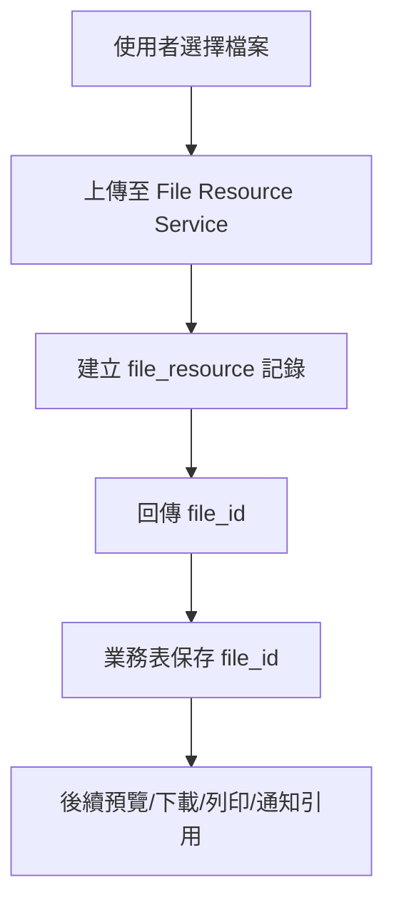
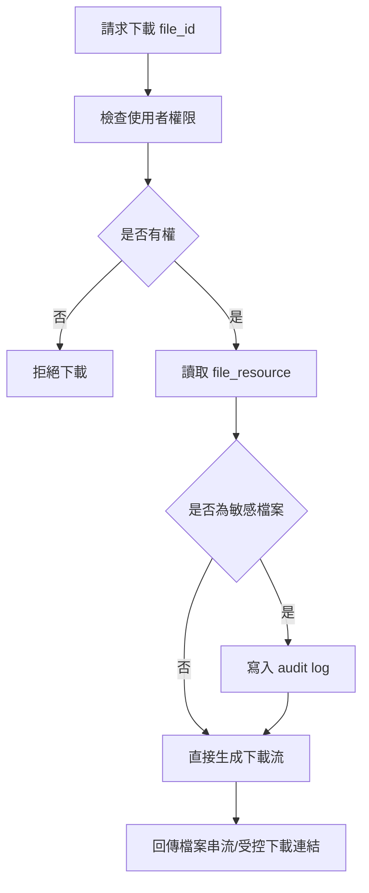
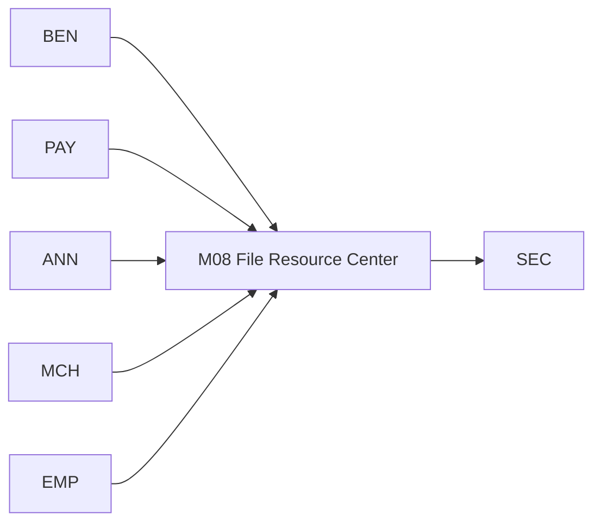
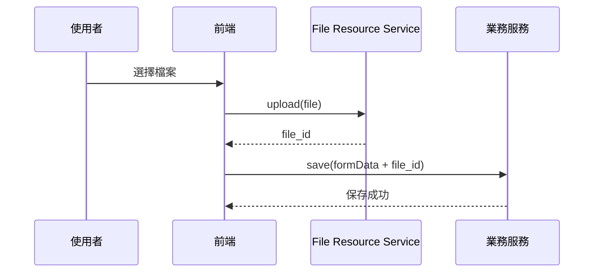
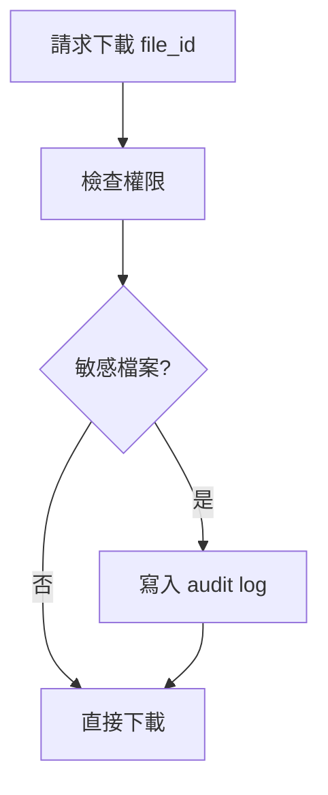

# M08《SYS－檔案資源中心》子 PRD

> 來源註記：本文件保留既有模塊拆分方式。凡文中未被客戶原始 PRD 明文定義的欄位、狀態碼、流程抽象或工程命名，均視為內部設計建議，不作為客戶權威需求表述。
>
> 對齊口徑：本文件已按主 PRD `v1.1` 與 `sql/tra_welfare_platform.sql` `v3.0-full` 收斂；除 `file_resource` 外，當前系統亦以 `file_reference` 與 `file_download_log` 承接引用與敏感下載追溯。

---

[toc]

---

## 1. 模塊名稱

SYS－檔案資源中心

## 2. 模塊類型

後台頁面模塊

## 3. 模塊定位

本模塊是全平台所有附件、傳票、證明文件、公告附檔、商店合約附件與其他上傳資源的統一入口與統一存證層。
如果 M07 解決的是全站的語義與配置治理，那 M08 解決的就是：

- 檔案先存在哪裡
- 業務資料如何引用檔案
- 預覽、下載、替換、停用與刪除怎麼治理
- 哪些下載屬於敏感下載，需要進 SEC 稽核
- 怎樣避免 BEN、PAY、ANN、MCH 各自發明一套附件路徑與檔案欄位規則

總體 PRD 對此其實已經給出非常清晰的底層原則：**檔案必須先進 `file_resource`，業務表只保存 `file_id`，全站檔案一律走同一套 `file_resource` 規則。** 這代表檔案不能附著在各模塊私有表裡任意處理，而必須由一個統一資源中心承接。

## 4. 設計目標

本模塊設計目標如下：

1. 建立平台統一的檔案資源層，讓 BEN、PAY、ANN、MCH、EMP 等所有模塊都以 `file_id` 引用檔案，而不是直接保存路徑、URL 或本地文件名。總體 PRD 已明確要求業務表只保存 `file_id`，且 `file_id` 是通用欄位。
2. 建立統一的檔案生命週期管理，讓上傳、引用、預覽、下載、替換、停用與刪除有一致規則。這是對總體 PRD「避免多套檔案路徑規則」的工程化落地。
3. 為敏感檔案建立受控下載與稽核能力，滿足資安規範。總體 PRD 已明確規定敏感檔案下載需記錄稽核。
4. 為後續通知、列印、流程、封存與稽核提供穩定的檔案引用主鍵，降低跨模塊耦合。總體 PRD 也明確指出系統管理員負責檔案治理。

## 5. 業務場景

### 場景 A：職工上傳補助附件

職工在前台申請補助時，需要上傳婚嫁、喪葬、教育等證明附件。這些檔案不能直接掛在 BEN 表內，而應先存入 `file_resource`，BEN 主表或附件關聯表只保存 `file_id`。總體 PRD 已明確補助申請涉及附件檢查，且檔案一律先進 `file_resource`。

### 場景 B：承辦建立發款批次並上傳傳票

承辦在 PAY 建立發款批次時會上傳傳票；總體字段表中已明確 `voucher_file_id` 對應傳票附件，這正是業務表只保存 `file_id` 的典型例子。

### 場景 C：公告管理員維護公告附檔

公告除了富文本內容，也可能需要附帶 PDF、規章附件、通知說明文件。這些檔案也應走 `file_resource`，由公告草稿或發布主表只持有 `file_id` 引用，而不是自帶路徑。總體 PRD 已明確 SYS 是檔案治理上游，ANN 又屬 SYS 的典型檔案消費方。

### 場景 D：商店合約附件保存與追溯

MCH 合約管理需要保存合約掃描件、補充條款與歷次版本附件。透過 `file_resource` 可以讓合約版本鏈與附件版本鏈分離治理。總體 PRD 已明確 MCH 有合約版本鏈，且檔案都應走統一路徑規則。

### 場景 E：資安稽核人員追查敏感下載

當系統偵測到敏感檔案下載，必須寫入稽核。這不只適用 EMP 敏感資料相關文件，也包括其他被標記為敏感的業務附件。總體 PRD 對敏感檔案下載稽核有直接要求。

## 6. 業務流程解讀

### 6.1 統一上傳與引用流程

檔案的核心不是「上傳後放哪」，而是「上傳成功後如何成為全站統一可引用的資源」。
建議主流程如下：

這個流程直接對應總體 PRD 的核心原則：檔案必須先進 `file_resource`，業務表只保存 `file_id`。

### 6.2 檔案下載流程

檔案下載不能只是給一個 URL，還要判斷權限、檔案狀態與敏感性，必要時寫入稽核。

總體 PRD 已明確指出敏感檔案下載需記錄稽核。

### 6.3 檔案與業務分離的意義

把檔案與業務表分離後，會得到 4 個明顯好處：

1. 檔案存放規則全站統一
2. 業務表更乾淨，只管業務主鍵與 `file_id`
3. 權限、敏感性、刪除與封存可以集中治理
4. 同一個檔案可被不同流程或不同表單結構穩定引用

這正是總體 PRD 在工程建議中強調「避免多套檔案路徑規則」的本質。

### 6.4 檔案刪除與引用關係

由於檔案被業務表用 `file_id` 引用，因此子 PRD 建議把刪除分成兩種：

- **邏輯停用/封存**：已被引用或已進流程/稽核鏈路的檔案，不應物理刪除
- **物理刪除**：僅限未被引用、未被送審、未被封存的檔案

這部分是對總體 PRD 的工程化細化；PRD 雖未直接寫刪除策略，但它已明確要求檔案統一走 `file_resource`，且全站高風險操作可被追溯。

## 7. 核心功能拆解

### 7.1 檔案上傳

提供全站統一上傳入口。
建議子能力包括：

- 單檔上傳
- 多檔上傳
- 上傳進度
- 型別檢查
- 大小限制
- 上傳後回傳 `file_id`

### 7.2 檔案資源主檔管理

所有上傳成功的檔案都建立一筆 `file_resource` 主檔記錄。
至少需承接：

- 檔案名稱
- MIME type
- 檔案大小
- 存儲位址摘要
- 上傳人
- 上傳時間
- 敏感性標記
- 目前狀態
- 關聯業務摘要

總體 PRD 未逐欄展開 `file_resource`，但已把它定義成全站唯一檔案資源容器。

### 7.3 檔案預覽

為常見可預覽檔案類型提供線上預覽能力，例如 PDF、圖片等。
這能支撐：

- 補助附件審核
- 傳票檢核
- 公告附檔查看
- 合約文件快速確認

### 7.4 檔案下載

檔案下載需支援：

- 權限校驗
- 敏感檔案審計
- 下載次數或最近下載記錄
- 失效連結/受控串流

總體 PRD 對敏感檔案下載稽核有直接要求。

### 7.5 檔案引用檢查

檔案資源中心需能回答：

- 這個 `file_id` 被哪個模塊引用
- 是否已被送審資料引用
- 是否已被通知/模板/列印引用
- 是否允許停用或刪除

這是工程落地非常關鍵的治理頁能力。

### 7.6 檔案狀態治理

建議檔案主檔支援至少以下狀態：

- uploaded：已上傳未正式引用
- active：已被有效引用
- archived：已封存
- disabled：已停用不可再新引用
- deleted：已物理刪除或邏輯刪除標記

其中狀態本身仍應由 `sys_dictionary` 管理，符合總體 PRD 的全站狀態字典化原則。

### 7.7 敏感檔案標記

由於總體 PRD 已要求敏感檔案下載寫稽核，因此本模塊需支持敏感標記能力。
建議來源可包括：

- 檔案類型預設
- 上傳場景預設
- 人工標記
- 來源模塊規則映射

## 8. 與其他模塊的聯動關係

### 8.1 與 BEN 的聯動

BEN 的附件上傳、補件與重新送審，都應依賴本模塊。
補助業務只保留 `file_id`，附件實體統一放在 `file_resource`。總體 PRD 已明確 BEN 有附件檢查，且工程上全站檔案都必須走 `file_resource`。

### 8.2 與 PAY 的聯動

PAY 的 `voucher_file_id` 是最典型的檔案引用欄位之一，說明發款批次與檔案資源中心必須直接聯動。

### 8.3 與 ANN 的聯動

公告附檔、規章附件、公告內容中的受控引用資源，都應從本模塊取得 `file_id` 與預覽/下載能力。ANN 自身只處理公告內容與發布，不應自建檔案服務。總體 PRD 已將公告與 SYS 的通知/系統能力並列在全站架構中。

### 8.4 與 MCH 的聯動

商店合約與補充附件可依賴本模塊作版本檔案承載；合約主表則保留自己的業務版本鏈與 `file_id` 關係。

### 8.5 與 EMP 的聯動

EMP 中如果涉及個資佐證、眷屬相關文件或其他主檔附件，也應依賴本模塊；由於 EMP 含敏感個資，EMP 來源的附件更容易被標記為敏感下載稽核對象。總體 PRD 已對敏感資料與敏感下載稽核提出要求。

### 8.6 與 M07《字典與系統參數》的聯動

檔案狀態、檔案類型、敏感等級、允許上傳格式、單檔大小限制、預覽能力開關等，都適合由 M07 提供字典或參數治理。總體 PRD 已明確 SYS 是共用治理層。

### 8.7 與 M09《通知中心、模板與外寄任務》的聯動

通知與模板可能需要帶出附件、引用附檔或在通知中生成下載入口，因此 M09 應依賴 M08 提供 `file_id` 解析與受控存取能力。總體 PRD 在通知扇出時序圖中已表明 SYS 內各基礎能力會與業務服務協同。

### 8.8 與 SEC 的聯動

敏感檔案下載、批量匯出、敏感檔案替換、非法刪除嘗試，都屬高風險事件，應回流 SEC。總體 PRD 已明確「敏感檔案下載需記錄稽核」，且高風險操作需可被追蹤。

## 9. 頁面規劃

本模塊作為後台頁面模塊，建議至少包含 4 個頁面/視圖。

### 9.1 頁面一：檔案資源列表頁

**定位**：集中查看與管理全站 `file_resource`。

**頁面區塊**

1. 搜尋與篩選區
2. 檔案列表區
3. 檔案摘要卡
4. 批量操作工具列

**查詢條件建議**

- file_id
- 檔案名稱
- 檔案類型
- 狀態
- 上傳人
- 上傳時間區間
- 敏感標記
- 來源模塊

**列表欄位建議**

- file_id
- original_file_name
- mime_type
- file_size
- source_module
- sensitivity_level
- status
- uploaded_by
- uploaded_at
- latest_download_at

### 9.2 頁面二：檔案詳情頁

**定位**：查看單一檔案的完整主檔、引用與操作記錄。

**頁面區塊**

1. 基本資料卡
2. 預覽區
3. 引用關係區
4. 下載歷史摘要
5. 稽核摘要區
6. 狀態操作區

### 9.3 頁面三：上傳組件/上傳抽屜

**定位**：作為 BEN、PAY、ANN、MCH、EMP 的共用上傳組件。

**核心交互**

- 支援拖拽與點選
- 即時校驗格式與大小
- 上傳完成回傳 `file_id`
- 可查看上傳失敗原因
- 可配置單檔/多檔模式

### 9.4 頁面四：檔案引用檢查頁/抽屜

**定位**：在停用或刪除前查看檔案被哪些資料引用。

**展示內容建議**

- 來源模塊
- 關聯業務單號
- 是否已送審
- 是否屬敏感檔案
- 是否允許刪除
- 歷史下載/審計摘要

## 10. 底層能力說明

### 10.1 能力邊界

本模塊負責：

- 檔案上傳
- `file_resource` 主檔
- 預覽/下載
- 檔案狀態與敏感標記
- 檔案引用檢查
- 檔案操作審計事件輸出

本模塊不負責：

- 業務附件欄位本身的業務意義判斷
- 公告內容富文本白名單過濾
- 通知外寄
- 程式碼層面的權限決策
- 封存報告頁展示

### 10.2 建議能力接口

- `uploadFile(file, context)`
- `getFileResource(fileId)`
- `previewFile(fileId, userContext)`
- `downloadFile(fileId, userContext)`
- `listFileReferences(fileId)`
- `markFileSensitive(fileId, level)`
- `changeFileStatus(fileId, status)`
- `deleteFileIfSafe(fileId)`

### 10.3 能力實現原則

- 所有業務附件先入 `file_resource`
- 業務表只存 `file_id`
- 預覽與下載都必須走受控接口
- 敏感下載必須寫稽核
- 已引用檔案優先採邏輯停用/封存，不直接物理刪除

## 11. 角色權限與操作路徑

### 11.1 可操作角色

- 系統管理員：主治理角色
- 福利社承辦人：依業務權限上傳/查看自己可見的業務附件
- 公告管理員：上傳公告附檔
- 商店承辦人：上傳合約與商店附件
- 資安稽核人員：查看敏感下載與檔案風險事件

總體 PRD 已明確系統管理員負責檔案治理，資安稽核人員負責追查敏感下載等高風險操作。

### 11.2 操作路徑

管理後台 → 系統設定 → 檔案資源中心
管理後台 → 各業務表單頁 → 共用上傳組件
資安後台 → 稽核日誌 → 敏感檔案下載查詢

### 11.3 權限建議

- 上傳檔案
- 查看檔案詳情
- 預覽檔案
- 下載檔案
- 查看敏感檔案
- 停用檔案
- 刪除檔案
- 查看檔案引用
- 匯出檔案清單

其中「查看敏感檔案」「下載敏感檔案」「停用/刪除檔案」建議視為高風險權限。

## 12. 關鍵字段/配置項說明

### 12.1 來自總體 PRD 的核心字段

總體 PRD 已明確 `file_id` 是跨模塊通用欄位，且所有業務表只保存 `file_id`，指向 `file_resource`。

### 12.2 建議的 file_resource 主檔字段

| 字段名             | 中文名稱     | 用途                              | 備註           |
| ------------------ | ------------ | --------------------------------- | -------------- |
| file_id            | 檔案 ID      | 檔案主鍵                          | 對外引用主鍵   |
| original_file_name | 原始檔名     | 顯示用途                          | 可保留上傳名稱 |
| stored_file_name   | 存儲檔名     | 存儲用途                          | 避免重名       |
| mime_type          | 檔案類型     | 預覽/校驗                         | 必填           |
| file_size          | 檔案大小     | 上傳限制/展示                     | 必填           |
| storage_path       | 存儲位址摘要 | 後端存儲定位                      | 不直接暴露前端 |
| source_module      | 來源模塊     | BEN/PAY/ANN/MCH/EMP               | 便於治理       |
| source_business_id | 來源業務主鍵 | 關聯引用來源                      | 可選           |
| sensitivity_level  | 敏感等級     | 普通/敏感/高敏                    | 建議字典化     |
| status             | 狀態         | uploaded/active/archived/disabled | 由字典管理     |
| revision           | 樂觀鎖版本號 | 併發防護                          | 建議必填       |
| uploaded_by        | 上傳人       | 稽核用途                          | 必填           |
| uploaded_at        | 上傳時間     | 稽核用途                          | 必填           |

### 12.3 引用關係字段

| 字段名              | 中文名稱     | 用途                                               |
| ------------------- | ------------ | -------------------------------------------------- |
| file_reference_id   | 引用關係 ID  | 主鍵                                               |
| file_id             | 檔案 ID      | 關聯 file_resource                                 |
| target_type         | 目標類型     | application/payment_batch/announcement/contract 等 |
| target_id           | 目標 ID      | 關聯業務資料                                       |
| reference_role      | 引用角色     | main_attachment/voucher/contract_scan 等           |
| is_active_reference | 是否有效引用 | 用於檢查刪除風險                                   |

### 12.4 建議配置項

建議由 M07 / SYS 參數治理：

- sys.file.max_size_mb
- sys.file.allowed_mime_types
- sys.file.preview.enabled_types
- sys.file.sensitive_download_audit_enabled
- sys.file.delete_if_referenced_block_enabled
- sys.file.temp_upload_retention_hours
- sys.file.download_link_ttl_seconds

## 13. 異常情況與邊界條件

### 13.1 檔案上傳成功但業務保存失敗

這種情況下 `file_resource` 已存在，但業務表未引用。
建議先標記為 `uploaded` 未引用狀態，並由清理策略或人工檢查決定是否清理。

### 13.2 已被引用的檔案被刪除

若檔案已被送審資料、已發布公告、有效合約或稽核鏈路引用，不應允許直接刪除；至少要先做引用檢查並提示風險。

### 13.3 敏感檔案無稽核下載

若敏感檔案被下載卻未落稽核，視為嚴重實作缺陷。總體 PRD 已對此有明確要求。

### 13.4 未授權使用者嘗試預覽/下載

應直接拒絕，不回傳真實存儲位址。

### 13.5 檔案類型與實際內容不符

需在上傳時做 MIME 或基礎內容檢查，避免偽裝副檔名造成風險。

### 13.6 下載連結長期有效

不建議直接暴露永久連結；應採受控串流或短時效下載票據。

### 13.7 敏感檔案被大量下載

建議作為 `operation_anomaly` 或相關高風險行為輸入 SEC。總體 PRD 對操作異常與高風險可追蹤已有明確方向。

## 14. Mermaid 圖

### 14.1 檔案資源中心與業務模塊關係圖

### 14.2 上傳與引用時序圖

### 14.3 下載審計流程圖

## 15. 研發落地建議

### 15.1 資料模型建議

- `file_resource` 與 `file_reference` 分表
- `file_resource` 作為全站唯一檔案主表
- 所有高風險主表建議加 `revision`，包括檔案主表
  這與總體 PRD 的 revision 原則一致。

### 15.2 前後端協作建議

- 所有表單上傳都應使用共用上傳組件
- 前端只拿 `file_id`，不自行拼接永久 URL
- 預覽能力按檔案類型配置，不在業務頁自行判斷

### 15.3 存儲與安全建議

- 存儲位址不直接暴露給前端
- 敏感檔案下載經過後端受控
- 對附件做大小、型別、內容基本校驗
- 下載與刪除行為都應有稽核事件輸出

### 15.4 治理建議

- 對長期未引用檔案設清理策略
- 對已引用檔案設引用檢查頁
- 對敏感下載與批量下載設告警閾值
- 將檔案治理納入系統管理員日常維運清單
  總體 PRD 已明確系統管理員負責檔案治理，且平台目標之一是提升可管理性與風險可控性。

## 16. 測試驗收要點

### 16.1 功能驗收

1. 所有業務附件上傳後，都先建立 `file_resource` 記錄。
2. 業務表只保存 `file_id`，不直接保存檔案路徑。
3. `voucher_file_id` 等業務欄位可正確引用檔案。
4. 可正常完成預覽、下載與引用檢查。
   以上第 1、2、3 點都直接對應總體 PRD 的檔案治理規則與通用字段定義。

### 16.2 聯動驗收

1. BEN 上傳附件後，送審與補件流程可持續引用同一 `file_id`。
2. PAY 傳票上傳後，批次詳情可正確展示對應附件。
3. ANN / MCH 可正確引用附檔或合約附件。
4. 已被引用的檔案在刪除前可看到引用風險提示。
   第 2 點直接可由 `voucher_file_id` 字段定義支撐。

### 16.3 安全驗收

1. 敏感檔案下載必定留下稽核記錄。
2. 未授權使用者無法預覽或下載敏感檔案。
3. 系統不暴露真實存儲位址。
4. 批量下載或異常下載可輸出風險事件給 SEC。
   其中第 1 點直接對應總體 PRD 的資安邊界。

### 16.4 邊界驗收

1. 業務保存失敗時，不會產生無法追蹤的孤兒附件。
2. 已被引用檔案不可被直接物理刪除。
3. 非法檔案型別、超大檔案、偽裝副檔名上傳被阻斷。
4. 並發更新檔案狀態時，revision 能阻止靜默覆蓋。
   第 4 點與總體 PRD 的高風險主表 revision 原則一致。
