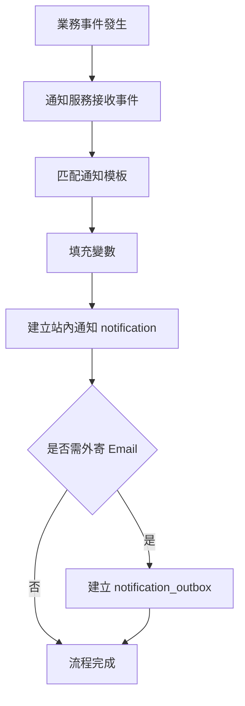
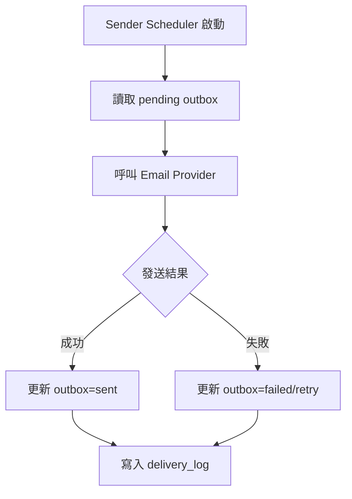
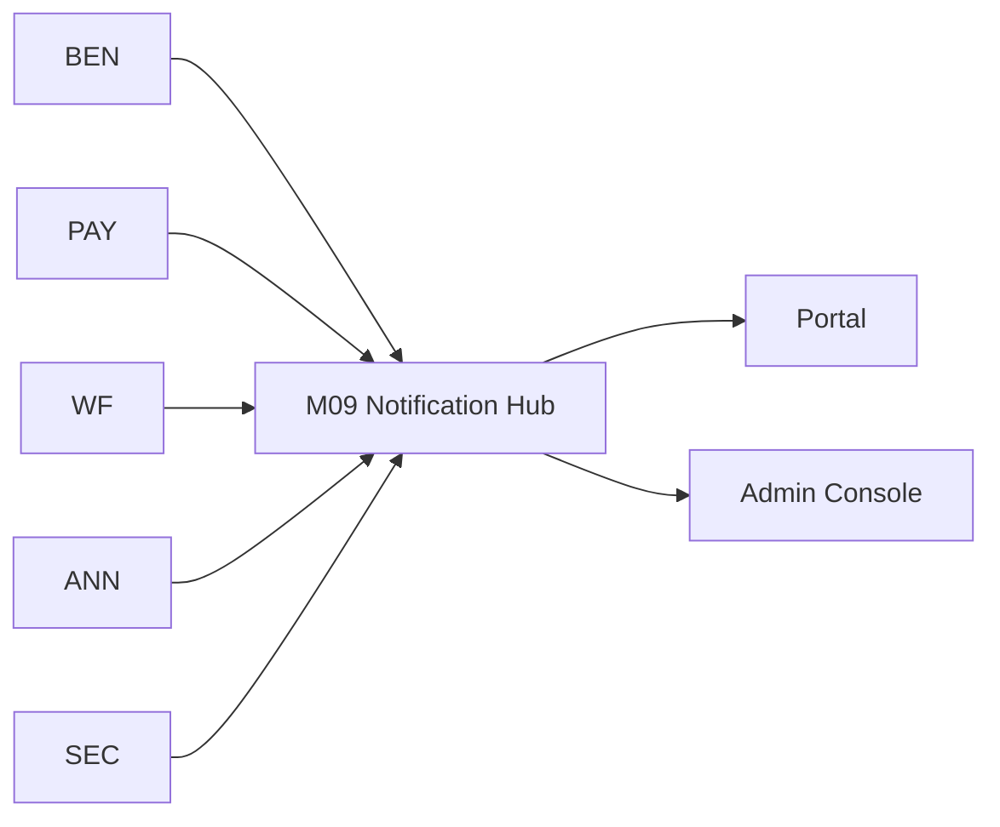
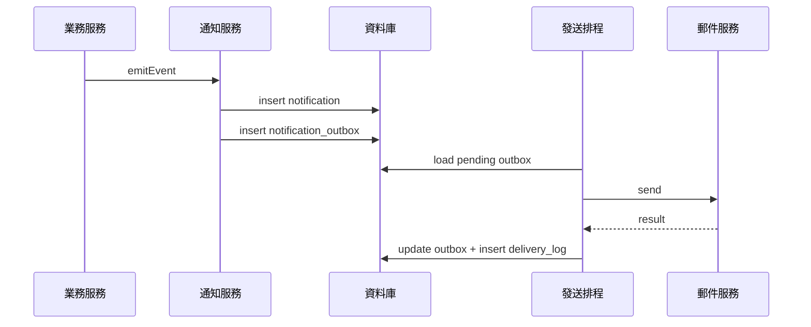
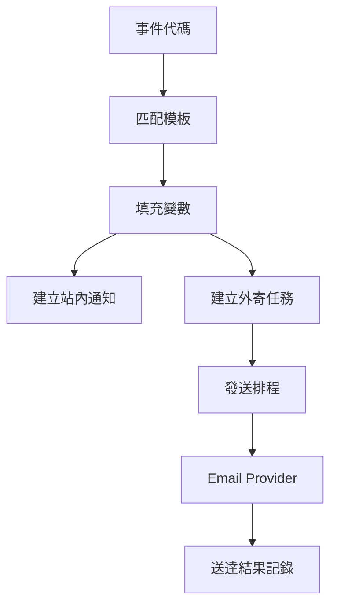

# M09《SYS－通知中心、模板與外寄任務》子 PRD

> 來源註記：本文件保留既有模塊拆分方式。凡文中未被客戶原始 PRD 明文定義的欄位、狀態碼、流程抽象或工程命名，均視為內部設計建議，不作為客戶權威需求表述。
>
> 對齊口徑：本文件已按主 PRD `v1.1` 與 `sql/tra_welfare_platform.sql` `v3.0-full` 收斂；站內通知、模板、outbox 與送達紀錄以當前資料模型命名為準。

---

[toc]

---

## 1. 模塊名稱

SYS－通知中心、模板與外寄任務

## 2. 模塊類型

底層能力模塊

## 3. 模塊定位

本模塊是整個福利平台的統一消息中台，負責把 BEN、PAY、WF、ANN、MCH、SEC 等模塊產生的業務事件，轉換成可送達、可追蹤、可稽核的通知結果。
如果 M08 解決的是「檔案資源如何被統一引用」，那 M09 解決的就是：

- 哪些業務事件要通知
- 通知以什麼模板生成內容
- 先發站內信，還是同時建立 Email 外寄任務
- 發送排程怎麼批次送出
- 發送成功或失敗如何記錄
- 資安或運維如何追查某筆通知是否真的送達

總體 PRD 已把 Notification Center、Notification Template、Notification Outbox、Delivery Log 全部列為 SYS 的一級功能，且明確規定：**同一個業務事件至少要能產生一筆站內通知；Email 是可選外寄管道。** 這代表通知不是某個業務頁的附屬提示，而是一個正式的底層能力。

## 4. 設計目標

本模塊設計目標如下：

1. 建立統一通知中台，讓補助送審、退回、核准、發款通知、異議通知、公告發布、資安告警等都走同一套能力，而不是各模塊自行發送。總體 PRD 已在 BEN 補助送審時序圖中直接畫出 BEN 調用 SYS 建立通知。
2. 保證每個業務事件至少落一筆站內通知，滿足職工與承辦對「有進度、有通知、有結果」的產品目標。總體 PRD 對 SYS 的需求與一頁總結都直接支持這一點。
3. 將 Email 外寄做成可選管道與異步任務，避免把第三方發送結果耦合進主交易流程。總體 PRD 已明確 Email 是可選外寄管道，且通知扇出採 outbox + sender scheduler。
4. 建立模板變數填充、預覽、送達記錄與追查能力，讓產品、工程、測試與資安都能驗證通知內容與送達結果。
5. 與排程任務、稽核與告警聯動，滿足總體 PRD 對通知發送排程與高風險操作追蹤的整體要求。

## 5. 業務場景

### 場景 A：補助申請送審後通知下一位處理人

職工完成補助送審後，BEN 驗證資格、附件與上限，建立流程，然後調用 SYS 建立通知，讓下一位審核人收到站內通知，必要時再外寄 Email。這條鏈路在總體 PRD 的補助申請時序圖中已有直接描述。

### 場景 B：承辦建立發款批次後通知職工領款確認

承辦建立發款批次、主管核准、人工撥款回填後，系統要通知職工去前台做領款確認。總體 PRD 的場景二、場景三都把這種通知視為主流程的一部分。

### 場景 C：異議建立後通知承辦進入處理

職工對發款提出異議後，系統建立爭議案件並通知承辦進入處理流程。這類通知具有明確的業務責任切換含義，不能依賴人工口頭通知。總體 PRD 的場景三已直接說明這一點。

### 場景 D：公告發布或排程生效後通知適用對象

公告管理員建立公告、設定投放範圍與時間窗口並完成送審，核准後若配置推播，系統可依 audience scope 建立站內通知與可選 Email 任務。總體 PRD 明確規定公告有可見窗口與排程規則，SYS 又明確提供通知中台能力。

### 場景 E：資安告警與告警送達追蹤

當 SEC 偵測到異常登入、敏感資料匯出、下載敏感檔案或權限變更時，必要時會觸發安全告警；資安人員在後台需要能查看事件結果與通知送達紀錄。總體 PRD 的場景六與 SEC 功能清單都直接提到告警送達紀錄。

## 6. 業務流程解讀

### 6.1 通知扇出總流程

總體 PRD 已直接給出通知扇出時序圖，核心流程非常清楚：

1. 業務服務 emitEvent
2. 通知服務插入站內通知
3. 通知服務插入 notification_outbox
4. 發送排程讀取 pending outbox
5. 呼叫 Email Provider 發送
6. 回寫 outbox 結果並插入 delivery log

這表示通知中台必須同時處理「站內信落表」與「外寄任務排隊」，且兩者是解耦的。

### 6.2 建議的通知建立流程

### 6.3 建議的外寄發送流程

### 6.4 流程原則解讀

本模塊建議遵守 5 條核心原則：

- **站內通知先行**：同一業務事件至少落一筆站內通知
- **外寄可選且異步**：Email 不阻塞主流程
- **模板驅動**：內容不寫死在業務代碼裡
- **送達可追蹤**：不只知道「有沒有建通知」，還要知道「有沒有送出去」
- **事件與業務解耦**：業務服務只管 emitEvent，不直接管具體發送細節

這 5 條原則都能直接從總體 PRD 的 SYS 需求與通知扇出時序圖推導出來。

## 7. 核心功能拆解

### 7.1 站內通知中心

負責管理所有站內通知主體。
總體 PRD 已明確 SYS 包含 Notification Center，且每個業務事件至少要產生一筆站內通知。

建議子能力包括：

- 建立通知
- 通知列表查詢
- 已讀/未讀狀態
- 前台與後台共用通知列表
- 來源業務跳轉
- 按角色/受眾投放
- 歷史通知保留與封存

### 7.2 通知模板

負責管理不同事件類型下的內容模板。
總體 PRD 已明確「通知模板要支持變數填充與預覽」。

建議子能力包括：

- 模板分類
- 事件代碼對應模板
- 站內版型與 Email 版型
- 變數定義
- 即時預覽
- 啟用/停用模板
- 模板版本管理

### 7.3 外寄任務佇列

負責記錄需外寄的 Email 任務。
總體 PRD 已明確 Notification Outbox 是 SYS 一級功能，且通知扇出時序圖已明示先 insert notification_outbox，再由 sender scheduler 發送。

建議子能力包括：

- 建立 outbox 任務
- pending / sending / sent / failed / cancelled 狀態管理
- 重試機制
- 發送節流
- 批次讀取
- 根據模板與收件者生成最終內容

### 7.4 發送結果記錄

負責保存每次發送結果。
總體 PRD 已明確 Delivery Log 是 SYS 一級功能，並在場景六中提到資安人員可查看通知送達紀錄。

建議子能力包括：

- 單次發送結果落表
- 成功/失敗原因記錄
- provider 回應碼摘要
- 重試次數
- 最終送達狀態
- 查詢與匯出

### 7.5 事件到模板的映射

建議在本模塊內建立 event_code 與 template_code 的穩定映射，例如：

- benefit_submitted
- benefit_returned
- benefit_approved
- payment_ack_pending
- payment_disputed
- announcement_published
- security_alert_raised

這樣可讓 BEN / PAY / ANN / SEC 只發出業務事件，不直接綁死具體模板名稱。

### 7.6 受眾與渠道決策

雖然總體 PRD 沒有把渠道策略單獨拉出來，但從「站內必有、Email 可選」可以推導出本模塊需要處理：

- 是否只發站內
- 是否同步建 Email 任務
- 哪些事件對哪些角色要外寄
- 哪些事件只在前台通知中心顯示

### 7.7 已讀、未讀與行動閉環

通知不是單純展示內容，還要能導流到下一步操作，例如：

- 補助待審 → 跳待辦中心
- 領款待確認 → 跳前台待確認領款
- 異議待處理 → 跳爭議案件
- 公告推播 → 跳公告詳情

這符合總體 PRD「對職工來說要有進度、有通知、有結果」的產品價值。

## 8. 與其他模塊的聯動關係

### 8.1 與 BEN 的聯動

BEN 是最典型的通知事件來源之一。
總體 PRD 的補助申請時序圖直接畫出 BEN 在建立流程後調用 SYS:createNotification。這說明 BEN 與 M09 的聯動是主流程級，不是可有可無。

### 8.2 與 PAY 的聯動

PAY 在以下節點都可能發通知：

- 批次核准後通知承辦可回填
- 撥款完成後通知職工領款確認
- 異議建立後通知承辦
- 異議處理結果通知職工

總體 PRD 的發款與異議場景已直接支持這些通知節點。

### 8.3 與 WF 的聯動

WF 建立待辦、退回、駁回、核准、超時時都會產生通知需求。
總體 PRD 對流程超時已有明確邊界：若未配置自動動作，只記錄事件並通知，不自動核准。這意味著通知本身就是流程治理的一部分。

### 8.4 與 ANN 的聯動

ANN 的公告發布與排程規則可決定何時建立通知任務；M09 則真正承接推播與送達追蹤。總體 PRD 已將 ANN 的可見窗口與排程規則分開，這也意味著「前台可見」與「是否通知」是兩個不同層次，需要 M09 單獨承接。

### 8.5 與 M07《字典與系統參數》的聯動

通知狀態、通知類型、渠道類型、模板類型、發送結果狀態可由字典提供；發送排程、重試次數、批量大小、渠道開關可由系統參數提供。總體 PRD 已明確 SYS 是這些共用基礎能力的治理中心。

### 8.6 與 AUTH / EMP 的聯動

M09 需要從 AUTH / EMP 取得收件人的有效身份與聯絡資訊，例如 employee_id、account 狀態、Email 等，以決定通知投遞對象。總體 PRD 已把 EMP 與 AUTH 放在統一的平台身份體系中。

### 8.7 與 SEC 的聯動

SEC 不只是通知事件來源，也是通知結果消費方。
總體 PRD 的場景六與 SEC 功能清單都明確指出資安人員可查看事件結果與通知送達紀錄，因此 M09 的 delivery log 會成為 SEC 查核的重要上游。

## 9. 頁面規劃

本模塊屬底層能力模塊，但仍建議提供 4 個治理型後台頁面。

### 9.1 頁面一：通知中心管理頁

**定位**：集中查詢與查看站內通知。

**頁面區塊**

1. 搜尋與篩選區
2. 通知列表區
3. 通知詳情抽屜
4. 已讀/未讀狀態區
5. 跳轉來源業務區

**列表欄位建議**

- notification_id
- event_code
- recipient_employee_id
- title
- channel_type
- read_status
- created_at
- source_module
- source_business_id

### 9.2 頁面二：通知模板管理頁

**定位**：維護站內與 Email 模板。

**頁面區塊**

1. 模板分類樹
2. 模板列表
3. 模板編輯區
4. 變數說明區
5. 預覽區
6. 啟用狀態區

**核心交互**

- 模板支持變數插入
- 可即時預覽填充效果
- 支持站內版型與 Email 版型切換
- 停用前提示是否被事件映射引用

### 9.3 頁面三：外寄任務佇列頁

**定位**：查看待發送、發送中、失敗、重試中的 Email 任務。

**頁面區塊**

1. 任務狀態篩選區
2. outbox 列表
3. 任務詳情區
4. 重試/取消操作區
5. 發送結果摘要區

### 9.4 頁面四：送達記錄頁

**定位**：查詢歷史送達結果。

**頁面區塊**

1. 查詢條件區
2. delivery log 列表
3. provider 回應摘要
4. 關聯通知/業務事件區
5. 失敗原因與重試歷程區

## 10. 底層能力說明

### 10.1 能力邊界

本模塊負責：

- 站內通知
- 模板管理
- 變數填充
- 外寄任務佇列
- Sender Scheduler 發送協調
- 發送結果記錄
- 通知查詢與送達追蹤

本模塊不負責：

- 具體業務事件何時發生
- 流程模板本身
- 檔案實體存儲
- 富文本白名單過濾規則本身
- 第三方郵件服務的底層能力

### 10.2 建議能力接口

- `emitNotification(eventCode, recipients, context)`
- `renderTemplate(templateCode, variables)`
- `createInAppNotification(payload)`
- `enqueueEmail(payload)`
- `loadPendingOutbox(batchSize)`
- `markOutboxSent(outboxId, providerResult)`
- `markOutboxFailed(outboxId, reason)`
- `listDeliveryLog(filters)`

### 10.3 建議能力模型

- **notification**：站內通知實體
- **notification_template**：模板主檔
- **notification_outbox**：待發送 Email 任務
- **delivery_log**：實際送達或失敗記錄
  這四層模型正對應總體 PRD 的 SYS 功能拆分。

## 11. 角色權限與操作路徑

### 11.1 可操作角色

- 系統管理員：模板、渠道、任務與送達治理主角色
- 公告管理員：可查看與自己業務相關的推播結果
- 福利社承辦人 / 審核主管：主要作為通知接收方，少量查看自己相關通知
- 資安稽核人員：查看高風險事件的通知與送達紀錄

總體 PRD 已明確系統管理員負責模板、通知等 SYS 治理；資安稽核人員可查看事件結果與通知送達紀錄。

### 11.2 操作路徑

管理後台 → 系統設定 → 通知中心
管理後台 → 系統設定 → 通知模板
管理後台 → 系統設定 → 外寄任務
管理後台 → 系統設定 → 送達記錄
前台 / 後台共用入口 → 個人通知中心

### 11.3 權限建議

- 查看通知
- 查看本人通知
- 管理通知模板
- 啟用/停用模板
- 查看外寄任務
- 手動重試任務
- 查看送達記錄
- 匯出送達記錄

其中「管理模板」「手動重試任務」「匯出送達記錄」建議視為高風險治理權限。

## 12. 關鍵字段/配置項說明

### 12.1 notification 字段

| 字段名                | 中文名稱      | 用途                     |
| --------------------- | ------------- | ------------------------ |
| notification_id       | 通知 ID       | 站內通知主鍵             |
| event_code            | 事件代碼      | 對應業務事件             |
| recipient_employee_id | 收件人員工 ID | 指向 EMP                 |
| title                 | 通知標題      | 前台/後台顯示            |
| content               | 通知內容      | 站內正文                 |
| source_module         | 來源模塊      | BEN / PAY / ANN / SEC 等 |
| source_business_id    | 來源業務主鍵  | 便於跳轉                 |
| read_status           | 已讀狀態      | unread / read            |
| read_at               | 已讀時間      | 行為追蹤                 |
| status                | 狀態          | 由字典管理               |
| revision              | 樂觀鎖版本號  | 並發控制                 |

### 12.2 notification_template 字段

| 字段名           | 中文名稱     | 用途           |
| ---------------- | ------------ | -------------- |
| template_id      | 模板 ID      | 主鍵           |
| template_code    | 模板代碼     | 對內識別       |
| channel_type     | 渠道類型     | in_app / email |
| template_name    | 模板名稱     | 顯示名稱       |
| subject_template | 標題模板     | Email/站內標題 |
| body_template    | 內容模板     | 模板正文       |
| variable_schema  | 變數結構     | 定義可用變數   |
| preview_sample   | 預覽樣本     | 測試預覽       |
| status           | 狀態         | 啟用/停用      |
| revision         | 樂觀鎖版本號 | 並發控制       |

### 12.3 notification_outbox 字段

| 字段名                | 中文名稱      | 用途                                  |
| --------------------- | ------------- | ------------------------------------- |
| outbox_id             | 外寄任務 ID   | 主鍵                                  |
| event_code            | 事件代碼      | 對應來源事件                          |
| recipient_employee_id | 收件人員工 ID | 關聯員工                              |
| recipient_email       | 收件 Email    | 外寄地址                              |
| template_code         | 模板代碼      | 對應模板                              |
| payload_snapshot      | 內容快照      | 防止模板後改影響歷史                  |
| send_status           | 發送狀態      | pending/sending/sent/failed/cancelled |
| retry_count           | 重試次數      | 發送治理                              |
| next_retry_at         | 下次重試時間  | 排程用                                |
| last_error_message    | 最近錯誤      | 追蹤用                                |
| revision              | 樂觀鎖版本號  | 並發控制                              |

### 12.4 delivery_log 字段

| 字段名              | 中文名稱      | 用途                       |
| ------------------- | ------------- | -------------------------- |
| delivery_log_id     | 送達記錄 ID   | 主鍵                       |
| outbox_id           | 外寄任務 ID   | 關聯 outbox                |
| provider_name       | 發送供應商    | Email Provider             |
| provider_message_id | 供應商消息 ID | 對外追查                   |
| delivery_result     | 發送結果      | success / failed / bounced |
| response_code       | 回應碼        | 第三方回傳摘要             |
| response_message    | 回應訊息      | 失敗原因摘要               |
| delivered_at        | 發送/送達時間 | 時間追蹤                   |

### 12.5 建議配置項

建議由 M07 / SYS 參數治理：

- sys.notification.email.enabled
- sys.notification.sender.batch_size
- sys.notification.sender.cron
- sys.notification.retry.max_count
- sys.notification.retry.interval_minutes
- sys.notification.inapp.retention_days
- sys.notification.delivery_log.retention_months

總體 PRD 已明確排程任務至少包含通知發送，且 Portal + Email 通知屬 MVP 範圍。

## 13. 異常情況與邊界條件

### 13.1 業務事件成功但通知建立失敗

建議主交易保存成功後，可容忍通知異步補償，但至少要記錄失敗事件並可重放；否則會違反「同一個業務事件至少要有一筆站內通知」的產品要求。

### 13.2 模板變數缺失

若事件上下文缺少必要變數，不應直接送空模板；應阻斷該次通知建立並記錄錯誤，便於治理。

### 13.3 Email 發送失敗

不應影響主交易；應保留站內通知，並將外寄任務標記 failed 或 retry。這與總體 PRD 的 outbox + sender scheduler 模型一致。

### 13.4 模板後改影響歷史通知

若 outbox 或 delivery log 不保存內容快照，後續模板修改會污染歷史追查。因此建議外寄任務保留 payload snapshot。

### 13.5 重複發送

若排程重複掃描或任務狀態控制不嚴，可能造成同一事件重複外寄。建議透過 outbox 狀態機與 revision 防重。

### 13.6 收件者帳號失效

若員工帳號停用或無有效 Email，可只保留站內通知或標記 Email 任務取消，不應讓整個事件失敗。

### 13.7 高風險通知未送達

若安全告警等高風險事件的通知未送達，應可進一步與 SEC 告警鏈路聯動處理。總體 PRD 的場景六已說明資安會查看事件結果與通知送達紀錄。

## 14. Mermaid 圖

### 14.1 通知中台與業務模塊關係圖

### 14.2 通知扇出時序圖

### 14.3 模板到送達結果流程圖

## 15. 研發落地建議

### 15.1 架構建議

- 將通知服務獨立於業務服務，業務只 emitEvent
- 站內通知與 Email outbox 分表
- outbox 採可重試狀態機，不將第三方結果耦合進主交易
- 高風險治理表如模板、outbox 主表建議加 `revision`，符合總體 PRD 的工程原則。

### 15.2 模板設計建議

- 模板使用變數白名單，不允許任意腳本
- 站內與 Email 模板可共用變數模型
- 預覽功能直接使用 sample payload 驗證
- 模板停用前應檢查事件映射引用

### 15.3 發送設計建議

- Sender Scheduler 按批次讀取 pending 任務
- 失敗任務採指數或固定間隔重試
- 達到最大重試次數後標記 failed
- delivery log 獨立保存每次發送結果，便於追查

### 15.4 前後端協作建議

- 通知中心、時間線、待辦提醒採共用元件設計
- 面向職工的前台通知文案避免技術術語
- 面向管理後台與資安後台的通知內容保留必要流程資訊與中文說明
  這與總體 PRD 的產品語言原則與跨模塊流程頁共用元件建議一致。

## 16. 測試驗收要點

### 16.1 功能驗收

1. 同一個業務事件至少可建立一筆站內通知。
2. 模板支持變數填充與預覽。
3. 可按事件建立外寄任務並由排程發送。
4. 可查詢發送結果記錄。
   以上 4 點都直接對應總體 PRD 的 SYS 需求與通知扇出時序。

### 16.2 聯動驗收

1. BEN 送審後可正確建立通知。
2. PAY 領款確認與異議節點可正確通知職工與承辦。
3. WF 超時若未配置自動動作，只記錄事件並通知，不自動核准。
4. SEC 可查看事件結果與通知送達紀錄。
   其中第 1、3、4 點都可由總體 PRD 直接支撐。

### 16.3 安全與治理驗收

1. 高風險通知相關操作可被稽核追蹤。
2. 模板並發修改時，revision 可阻止靜默覆蓋。
3. 發送失敗不影響主交易完成，但會保留 outbox 狀態與 delivery log。
4. 歷史送達記錄不會因模板後改被污染。
   第 1 點與總體 PRD 的高風險追溯原則一致。

### 16.4 邊界驗收

1. 模板缺少必要變數時，通知建立被阻斷並記錄錯誤。
2. Email Provider 故障時，站內通知仍保留。
3. 重複排程不會造成同一 outbox 被重複送出。
4. 無有效收件 Email 的情況下，不影響站內通知建立。
5. Portal + Email 通知能力符合 MVP 範圍。
