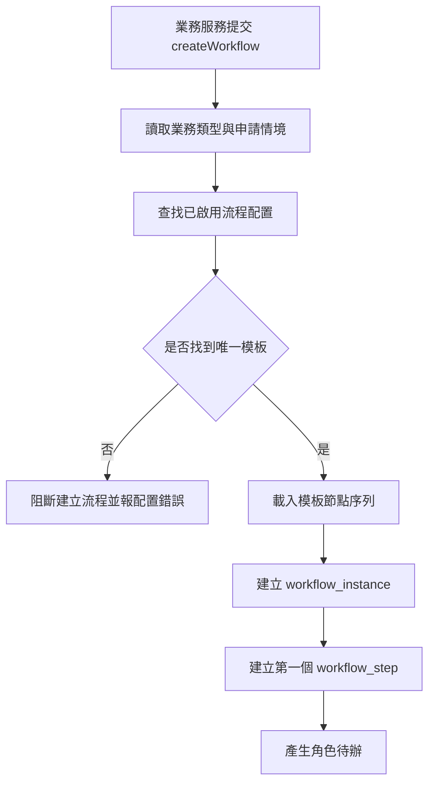
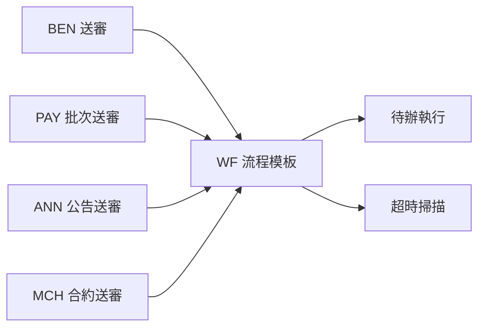
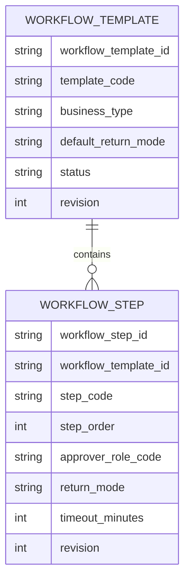
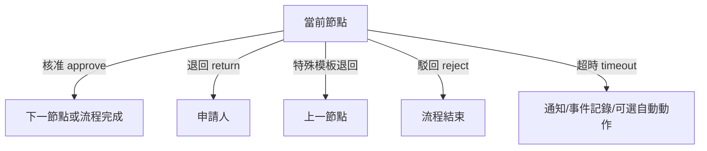

# M10《WF－流程模板與節點配置》子 PRD

> 來源註記：本文件保留既有模塊拆分方式。凡文中未被客戶原始 PRD 明文定義的欄位、狀態碼、流程抽象或工程命名，均視為內部設計建議，不作為客戶權威需求表述。
>
> 對齊口徑：本文件已按主 PRD `v1.1` 與 `sql/tra_welfare_platform.sql` `v3.0-full` 收斂；流程模板與節點屬當前系統實作，應理解為固定行政流程的落地承接，而非任意 BPM 平台需求。

---

[toc]

---

## 1. 模塊名稱

WF－流程模板與節點配置

## 2. 模塊類型

後台頁面模塊

## 3. 模塊定位

本模塊是整個福利平台的流程編排核心，負責把 BEN、PAY、ANN、MCH 等業務中的「送審」抽象成可配置、可重用、可追蹤的流程模板。
如果前面的 ORG 解決的是「誰在哪個角色位置上」，M10 解決的就是：

- 一筆業務送審時，要走哪一套流程模板
- 模板裡有哪些節點、每一節點對應什麼角色
- 每個節點允許哪些動作，例如核准、退回、駁回
- 特殊模板能否退回上一節點
- 超時時該記錄什麼、通知誰、是否有自動動作
- 如何把流程模板穩定對接到 BEN / PAY / ANN / MCH 的具體業務域

客戶原始 PRD 已明確存在多條固定行政流程，例如補助申請、發款批次、公告審批、商店/合約審批等；本文件保留「模板」一詞作為工程拆模方式，但不把任意 `domain_code → workflow_template` 抽象直接宣稱為客戶權威需求。

## 4. 設計目標

本模塊設計目標如下：

1. 建立可治理的流程配置中心，支撐補助、發款批次、公告與商店合約等不同業務域共用送審能力，但優先對齊客戶已明示的行政流程，不額外擴張為通用 BPM 平台。
2. 在 MVP 範圍內，先把原始 PRD 已定義的節點責任、待辦分派、核准/退回/駁回與超時規則做清楚，避免一開始就做過度抽象的流程引擎。
3. 將「退回預設回申請人、特定流程才可回上一節點」整理成一致規則，避免散落在各業務服務中硬編碼。
4. 與 ORG 的角色任職、M11 的待辦執行、M12 的超時掃描、M09 的通知扇出形成穩定邊界，讓工程可分層實作。總體 PRD 的模組關係圖已明確 WF 依賴 ORG 與 EMP，且補助送審時序圖已畫出 BEN 建立流程後再建立通知。
5. 為後續測試、稽核與問題追查提供一致的流程模板語義，讓每個節點、每個決策動作都可追溯。總體 PRD 已將「每一個審批節點都有歷程可查」列為平台價值。

## 5. 業務場景

### 場景 A：婚嫁補助送審時匹配補助流程模板

職工送審婚嫁、生育/育兒、教育、慰問金或社團類補助後，BEN 會先完成資格、附件與年度上限校驗，再調用 WF 建立流程實例。此時 WF 必須依補助類型與既定規則匹配正確審批鏈，產生第一個審批節點與角色待辦。總體 PRD 的補助時序圖與 BEN 需求說明都直接支持這條鏈路。

### 場景 B：發款批次送審走另一套流程模板

承辦建立發款批次後，需要送審給主管核准。這不是補助申請流程的複製，而應有獨立模板，例如節點更少、動作更聚焦於批次核准與回填前控制。總體 PRD 已將 PAY 的批次送審列為主流程之一，因此它同樣是 WF 的流程模板消費方。

### 場景 C：公告草稿送審與退回

公告管理員建立草稿、設定投放範圍與可見窗口後送審；若主管退回，系統應讓草稿回到可編輯狀態，而不是直接結束。總體 PRD 的公告發布流程圖已明確存在「退回編輯」路徑。

### 場景 D：特殊模板允許退回上一節點

一般規則下，退回預設回到申請人；但某些流程若存在多個串簽節點，可能要求退回上一節點而不是整單回到申請人。這種例外不能靠人工理解，必須在模板中明確配置。總體 PRD 已直接規定這條邊界。

### 場景 E：流程節點超時但未配置自動動作

若某節點超時，且模板沒有配置自動動作，系統應只記錄事件並通知，不自動核准。這是總體 PRD 對超時處理的明確邊界。

## 6. 業務流程解讀

### 6.1 流程模板在整體主鏈路中的位置

總體 PRD 的端到端流程圖清楚表明：
職工建立申請 → 送審 → **流程引擎建立待辦** → 主管審核 → 核准/退回/駁回。
因此 M10 的作用，不是執行單筆待辦，而是定義**送審之後這條路該怎麼走**。

### 6.2 模板匹配流程

建議 WF 在建立流程實例前，先依業務類型與既定審批規則尋找對應流程配置，再初始化節點序列。

這裡的核心規則應回到總體 PRD 已明示的業務流程差異，而不是把 `domain_code`、`workflow_template` 本身誤當成客戶已定稿的欄位模型。

### 6.3 節點推進流程

在 MVP 的單線串簽前提下，節點只會線性推進：

總體 PRD 已明確 MVP 僅支援單線串簽，不支援完整會簽，因此模板設計也要跟著收斂，不應引入多分支會簽語義。

### 6.4 動作規則解讀

每個節點至少需要支持三種動作：

- 核准 approve
- 退回 return
- 駁回 reject

其中：

- **核准**：流向下一節點，若無下一節點則流程完成
- **退回**：預設回申請人；特殊模板才回上一節點
- **駁回**：流程直接結束

總體 PRD 已把這三種動作列為 WF 一級功能，並在邊界條件中明確規定退回策略。

### 6.5 超時策略解讀

總體 PRD 對超時規則有兩條關鍵要求：

1. 超時掃描由 scheduler 每 5 分鐘執行
2. 若未配置自動動作，只記錄事件並通知，不自動核准

所以模板層應至少支持：

- 是否啟用超時監控
- 超時分鐘數
- 超時後通知誰
- 是否有自動動作
- 自動動作類型（若開啟）

但在 MVP 階段，建議**默認只做通知與事件記錄**，把自動動作設為可預留、少量白名單使用。

### 6.6 版本衝突與流程安全

總體 PRD 已明確：已送審資料若被他人更新，需提示版本衝突，不可直接覆蓋。
因此流程模板層雖不直接管理業務表，但模板必須要求下游在 `submit` 與 `approve/return/reject` 交互時攜帶 `revision` 或對應版本摘要，避免審批基於過期資料進行。

## 7. 核心功能拆解

### 7.1 流程模板管理

負責定義平台有哪些流程模板。
建議模板至少包含：

- template_code
- template_name
- process_type
- business_type
- template_scope
- status
- default_return_mode
- timeout_policy_enabled
- revision

總體 PRD 已明確平台存在多條固定業務流程；當前實作可用 `process_type / business_type` 去對應模板，但不把 `domain_code` 視為客戶權威字段。

### 7.2 流程節點配置

負責定義模板內有哪些節點，以及節點順序與責任角色。
建議每一節點至少配置：

- step_code
- step_name
- step_order
- approver_role_code / org role binding
- allowed_actions
- return_behavior
- timeout_minutes
- notify_policy

總體 PRD 已將 Workflow Step 列為 WF 一級功能。

### 7.3 角色待辦映射

M10 不直接執行待辦，但要定義模板節點如何映射到「角色待辦」語義。
也就是模板要說清楚：

- 這一節點由哪個角色處理
- 是否允許多人同角色但只取當前任職人
- 無任職人時怎麼處理
- 是否允許待辦轉派（若後續支持）

總體 PRD 已把 Review Task 列為 WF 核心功能，且模組關係圖表明 WF 依賴 ORG。

### 7.4 動作規則配置

模板需要定義每個節點支持哪些動作，並控制動作後流向。
建議配置包括：

- approve → next_step / end
- return → applicant / previous_step
- reject → end
- timeout → notify_only / auto_action

### 7.5 退回策略配置

總體 PRD 已明確：

- 預設退回申請人
- 特殊模板才可退回上一節點

因此模板層建議做成：

- `return_mode = applicant_default`
- `return_mode = previous_step_allowed`

並且只有標記為特殊模板時，UI 才可勾選上一節點退回。

### 7.6 超時策略配置

模板與節點均可配置超時策略，但以節點級為主。
建議配置：

- timeout_enabled
- timeout_minutes
- timeout_notify_roles
- auto_action_enabled
- auto_action_type
- auto_action_limit

並遵守總體 PRD 邊界：未配置自動動作時，不可自動核准。

### 7.7 模板狀態與版本管理

由於模板會被多個業務域長期引用，建議支持：

- draft：草稿
- active：啟用
- inactive：停用
- archived：封存

同時，模板更新要有版本概念，避免直接覆蓋既有送審中的實例邏輯。這是依總體 PRD 對 `revision` 與高風險主表治理原則做出的工程細化。

### 7.8 模板引用檢查

在停用或修改模板前，需檢查：

- 是否被 BEN 某 domain 使用
- 是否被 PAY 批次流程使用
- 是否被 ANN / MCH 送審使用
- 是否存在進行中的流程實例

## 8. 與其他模塊的聯動關係

### 8.1 與 BEN 的聯動

BEN 是 WF 的最核心消費方之一。
總體 PRD 已明確 BEN 送審會觸發流程；當前實作採固定業務類型對應模板，並以橋接關係維護流程實例，不要求 BEN 主表直接保存 `workflow_instance_id`。

### 8.2 與 PAY 的聯動

PAY 的批次送審同樣需要走流程模板，但其節點一般比 BEN 短、責任鏈更集中。總體 PRD 已將批次送審列為 PAY 一級功能，說明 PAY 不是繞過 WF 的特殊流程。

### 8.3 與 ANN 的聯動

ANN 的草稿送審與公告審批依賴 WF；公告流程圖已顯示送審後會出現核准、退回、駁回三種結果，這正對應 M10 模板中的動作規則。

### 8.4 與 MCH 的聯動

MCH 的合約管理與續約版本鏈，在送審階段也依賴 WF；雖合約生命週期在業務上單獨管理，但審批入口仍應走流程模板。

### 8.5 與 ORG 的聯動

M10 配節點角色，ORG 提供角色與當前任職人。
模板裡的 approver role 不是自然人，而是組織角色語義；真正派發到誰，要由 M11 執行時再結合 ORG 查詢任職人。總體 PRD 模組關係圖已表明 WF 依賴 ORG。

### 8.6 與 EMP 的聯動

流程中的申請人、被退回對象、部分上下文摘要會依賴 EMP；模組關係圖也表明 WF 依賴 EMP。

### 8.7 與 M09《通知中心、模板與外寄任務》的聯動

流程節點推進、退回、駁回、超時都會觸發通知，但 M10 不負責真正發送，只需定義事件點與通知策略摘要，實際扇出由 M09 完成。總體 PRD 的補助時序圖與通知時序圖共同支持這種分層。

### 8.8 與 M12《超時掃描與流程事件》的聯動

M10 定義超時規則，M12 負責按排程掃描與執行。
兩者邊界如下：

- M10：配置「應該怎麼超時」
- M12：執行「哪些已經超時」

## 9. 頁面規劃

本模塊作為後台頁面模塊，建議至少包含 3 個核心頁面。

### 9.1 頁面一：流程模板列表頁

**定位**：集中查看與管理所有 `workflow_template`。

**頁面區塊**

1. 搜尋與篩選區
2. 模板列表區
3. 模板摘要區
4. 操作工具列

**列表欄位建議**

- template_code
- template_name
- business_type
- 適用模塊
- 節點數
- 退回策略摘要
- 超時策略摘要
- 狀態
- revision
- updated_at
- updated_by

**主要操作**

- 新增模板
- 編輯模板
- 複製模板
- 停用/啟用
- 查看節點
- 查看引用

### 9.2 頁面二：流程模板編輯頁

**定位**：配置模板基本信息與節點序列。

**頁面區塊**

1. 模板基本資料區
2. 節點序列配置區
3. 動作規則區
4. 超時策略區
5. 引用與風險提示區
6. 版本/差異摘要區

**核心交互**

- 以線性節點方式編輯，符合 MVP 單線串簽
- 可新增、排序、刪除節點
- 可為節點選角色
- 可設定退回規則與超時規則
- 儲存前顯示差異

### 9.3 頁面三：模板引用檢查頁/抽屜

**定位**：查看某模板被哪些業務類型與流程實例引用。

**展示內容建議**

- 綁定的 business_type
- 關聯模塊（BEN/PAY/ANN/MCH）
- 進行中實例數
- 最近使用時間
- 是否允許停用
- 風險提示

## 10. 底層能力說明

本模塊屬頁面模塊，但同時要輸出可被流程執行層調用的模板能力。

### 10.1 能力邊界

本模塊負責：

- 流程模板主檔
- 節點定義
- 角色映射配置
- 動作規則配置
- 退回策略配置
- 超時規則配置
- 模板引用檢查

本模塊不負責：

- 單筆待辦實例執行
- 具體核准/退回操作落表
- 超時掃描排程執行
- 通知實際發送
- 業務主表版本控制本身

### 10.2 建議能力接口

- `getWorkflowTemplateByDomain(domainCode)`
- `getWorkflowTemplate(templateCode)`
- `listWorkflowSteps(templateId)`
- `validateTemplate(templateId)`
- `previewNextAction(templateId, stepCode, action)`
- `checkTemplateReferences(templateId)`

### 10.3 模板驗證原則

模板保存前建議驗證：

- business_type / process_type 是否可唯一映射或符合業務規則
- 節點排序是否連續
- 每個節點是否有 approver role
- return_mode 是否符合平台規則
- timeout 設定是否合法
- 特殊模板才允許 `return_to_previous_step=true`

## 11. 角色權限與操作路徑

### 11.1 可操作角色

- 系統管理員：主配置者
- 審核主管：通常只查看模板，不直接維護
- 福利社承辦人 / 公告管理員：一般不應直接改模板
- 資安稽核人員：查看模板與流程規則，不做一般配置

總體 PRD 中，系統管理員負責平台治理與設定，因此是流程模板的主配置角色。

### 11.2 操作路徑

管理後台 → 系統設定 / 流程管理 → 流程模板
管理後台 → 系統設定 / 流程管理 → 節點配置
管理後台 → 系統設定 / 流程管理 → 模板引用檢查

### 11.3 權限建議

- 查看模板
- 新增模板
- 編輯模板
- 停用模板
- 複製模板
- 查看模板引用
- 匯出模板設定

其中「停用模板」「修改節點角色」「修改退回/超時規則」建議視為高風險治理操作。

## 12. 關鍵字段/配置項說明

### 12.1 來自總體 PRD 的關鍵字段與原則

總體 PRD 已明確 `workflow_template` 用於承接固定業務流程配置；當前實作以 `process_type / business_type` 識別模板，以流程橋接維護實例關聯；工程實施上高風險主表應加 `revision`。

### 12.2 workflow_template 字段

| 字段名                 | 中文名稱     | 用途                                  | 備註         |
| ---------------------- | ------------ | ------------------------------------- | ------------ |
| workflow_template_id   | 流程模板 ID  | 主鍵                                  | 系統唯一       |
| template_code          | 模板代碼     | 對內識別                              | 建議唯一       |
| template_name          | 模板名稱     | 顯示名稱                              | 必填           |
| process_type           | 流程類型     | benefit/payment/announcement/merchant | 核心分類字段   |
| business_type          | 業務類型     | 對應補助申請、發款批次、公告送審等    | 模板匹配建議鍵 |
| template_scope         | 模板範圍     | 全域/分支/特定場景                    | 視實作需要     |
| default_return_mode    | 預設退回模式 | applicant / previous_step             | 平台規則核心   |
| timeout_policy_enabled | 是否啟用超時 | 控制模板級超時                        | 建議           |
| status                 | 狀態         | draft/active/inactive/archived        | 字典治理       |
| revision               | 樂觀鎖版本號 | 併發防護                              | 建議必填       |

### 12.3 workflow_step 字段

| 字段名               | 中文名稱     | 用途                            |
| -------------------- | ------------ | ------------------------------- |
| workflow_step_id     | 流程節點 ID  | 主鍵                            |
| workflow_template_id | 所屬模板 ID  | 關聯模板                        |
| step_code            | 節點代碼     | 對內識別                        |
| step_name            | 節點名稱     | 顯示名稱                        |
| step_order           | 節點順序     | 線性排序                        |
| approver_role_code   | 審批角色代碼 | 對接 ORG                        |
| allow_approve        | 允許核准     | bool                            |
| allow_return         | 允許退回     | bool                            |
| allow_reject         | 允許駁回     | bool                            |
| return_mode          | 退回模式     | applicant / previous_step       |
| timeout_minutes      | 超時分鐘數   | 對接 M12                        |
| auto_action_type     | 自動動作類型 | none/notify_only/other_reserved |
| revision             | 樂觀鎖版本號 | 併發防護                        |

### 12.4 建議配置項

建議由 M07 / SYS 參數治理：

- wf.template.strict_validation_enabled
- wf.template.allow_previous_step_return_for_special_only
- wf.timeout.scan.cron
- wf.timeout.default_minutes
- wf.timeout.auto_action_whitelist
- wf.workflow.instance.revision_check_enabled

其中 `wf.timeout.scan.cron` 與流程超時排程直接對應總體 PRD 的排程任務要求。

## 13. 異常情況與邊界條件

### 13.1 未配置對應模板的業務流程

若業務送審時找不到對應 `workflow_template`，應直接阻斷送審，不能默認走某個通用模板，避免審批責任錯置。

### 13.2 模板有節點但無角色

若某節點未綁 approver role，模板不得啟用；否則後續待辦無法派發。

### 13.3 退回模式違反平台規則

除特殊模板外，不應允許把退回配置成上一節點。這是總體 PRD 的直接邊界。

### 13.4 流程超時但無自動動作配置

此時只能記錄事件並通知，不能自動核准。這是總體 PRD 的直接邊界。

### 13.5 已送審資料版本衝突

若業務資料在送審後被他人更新，模板執行相關操作應提示版本衝突而非直接覆蓋。這是總體 PRD 的直接邊界。

### 13.6 停用模板但仍有進行中實例

若模板存在未結束實例，不應直接停用或至少要提示風險，並要求只影響新實例不影響舊實例。

### 13.7 MVP 內誤做會簽

由於總體 PRD 明確 MVP 不納入完整會簽，因此模板編輯頁不應暴露多分支會簽配置，避免需求膨脹。

## 14. Mermaid 圖

### 14.1 WF 模板在主鏈路中的位置

### 14.2 流程模板與節點模型圖

### 14.3 節點動作流向圖

## 15. 研發落地建議

### 15.1 資料模型建議

- `workflow_template` 與 `workflow_step` 分表
- 主表與節點表都加 `revision`
- 模板狀態與節點動作類型走字典
- 模板與 domain 綁定表可視複雜度決定是否拆分獨立映射表

這與總體 PRD 的通用欄位與 `revision` 原則一致。

### 15.2 架構分層建議

- M10 只做模板與節點配置
- M11 專做待辦與實例執行
- M12 專做超時掃描與流程事件
- M09 專做通知扇出
  這樣分層最符合總體 PRD 的共用能力設計。

### 15.3 前後端協作建議

- 模板編輯頁先用節點結構圖與線性步驟卡片表示
- 不在 MVP 放出會簽、多分支 UI
- 所有節點動作文案先與產品語言原則對齊，避免前台/後台術語混亂
- 待辦中心、通知中心、流程時間線採共用元件設計，這與總體 PRD 的實施建議一致。

### 15.4 治理建議

- 模板改動需有差異檢視
- 啟用模板前先做完整驗證
- 已啟用模板不建議直接覆蓋核心節點順序
- 特殊模板清單單獨治理，避免上一節點退回被濫用

## 16. 測試驗收要點

### 16.1 功能驗收

1. 可建立流程模板並配置節點。
2. 不同 `process_type / business_type` 可正確匹配不同 `workflow_template`。
3. 模板可配置核准、退回、駁回三種動作。
4. MVP 流程僅支援單線串簽，不支持完整會簽。
   以上 2、4 兩點直接對應總體 PRD 規則。

### 16.2 邊界驗收

1. 退回預設回申請人。
2. 只有特殊模板才可退回上一節點。
3. 超時後若無自動動作配置，只記錄事件並通知。
4. 已送審資料被更新時，會提示版本衝突而不是覆蓋。
   以上 4 點都直接對應總體 PRD 邊界條件。

### 16.3 聯動驗收

1. BEN 送審時可成功建立流程實例。
2. PAY 批次送審可匹配正確模板。
3. ANN 草稿送審可走核准／退回／駁回鏈路。
4. 模板節點角色可正確對接 ORG，供後續待辦建立。
   其中第 1、3 點直接可由總體 PRD 的補助時序圖與公告流程圖支撐。

### 16.4 治理與安全驗收

1. 模板高風險修改可被稽核追蹤。
2. 並發修改模板時，revision 可阻止靜默覆蓋。
3. 停用模板前可檢查引用風險。
4. 不會因模板配置錯誤而把待辦派到未定義角色。
   第 1、2 點與總體 PRD 的高風險治理與 `revision` 原則一致。
