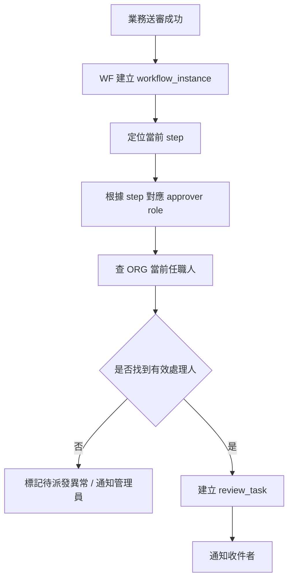
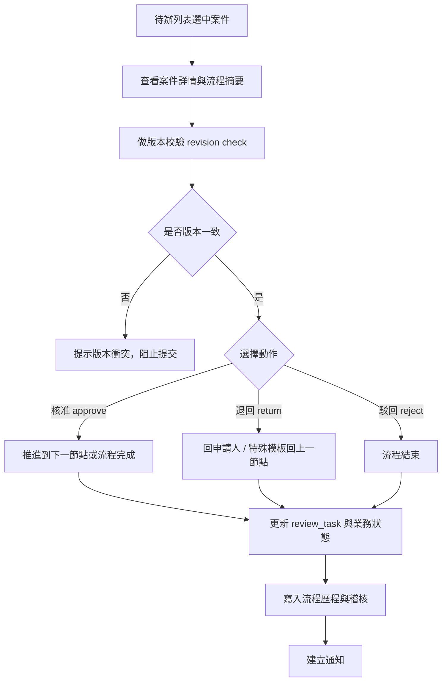
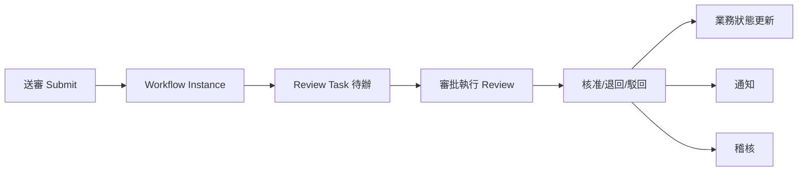
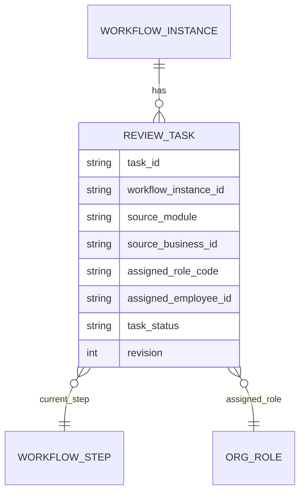
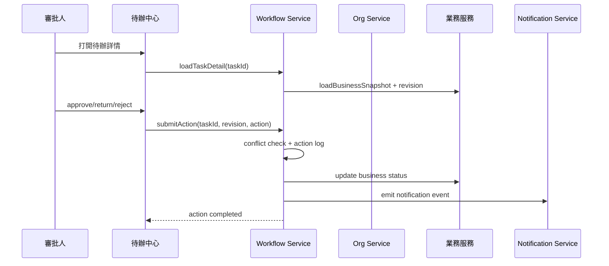

# M11《WF－待辦中心與審批執行》子 PRD

> 來源註記：本文件保留既有模塊拆分方式。凡文中未被客戶原始 PRD 明文定義的欄位、狀態碼、流程抽象或工程命名，均視為內部設計建議，不作為客戶權威需求表述。
>
> 對齊口徑：本文件已按主 PRD `v1.1` 與 `sql/tra_welfare_platform.sql` `v3.0-full` 收斂；待辦、版本衝突與操作歷程以當前系統治理方式表述。

---

[toc]

---

## 1. 模塊名稱

WF－待辦中心與審批執行

## 2. 模塊類型

後台頁面模塊

## 3. 模塊定位

本模塊是流程引擎在管理後台的「執行面」，負責承接 M10 已定義好的流程模板，把抽象節點變成可以由承辦人、主管或其他審批角色實際處理的待辦事項。
如果 M10 解決的是「流程應該怎麼被配置」，那 M11 解決的就是：

- 某一筆申請或批次，現在卡在哪個節點
- 這個節點應該由誰來處理
- 處理人打開待辦後可以看到哪些資料
- 審批時可以執行哪些動作
- 動作執行後流程怎麼流轉
- 待辦、審批結果、流程時間線與通知如何同步更新

總體 PRD 的端到端流程圖已非常明確地把「送審 → 流程引擎建立待辦 → 主管審核」畫成主線，並在管理後台資訊架構中單獨列出 `待辦中心 Review Center`，這說明待辦中心不是某個業務列表上的附屬按鈕，而是一個獨立、跨模塊的執行入口。

## 4. 設計目標

本模塊設計目標如下：

1. 建立統一的待辦中心，承接 BEN、PAY、ANN、MCH 等所有走流程的業務，使審批角色不必在各模塊之間來回尋找待辦。總體 PRD 已把待辦中心列為管理後台的一級入口，且 WF 被定義為全站共用能力。
2. 將待辦的接收、查看、核准、退回、駁回做成一致的執行模式，降低不同業務域操作風格不一致的問題。總體 PRD 的產品目標與價值都強調「流程、按鈕、狀態與通知規則統一治理」。
3. 在審批執行層強制落實關鍵邊界條件，例如版本衝突提示、退回策略、停用角色不得繼續收到待辦、超時後通知而非默許通過。
4. 為 M09 通知中心、SEC 稽核日誌、BEN/PAY/ANN/MCH 業務狀態更新提供標準化事件出口，讓每個審批動作都可被追蹤。總體 PRD 已明確高風險操作要可稽核，且每個審批節點都應有歷程可查。

## 5. 業務場景

### 場景 A：審核主管處理補助待辦

職工送審婚嫁補助後，BEN 驗證完成，WF 建立待辦，主管在待辦中心打開案件詳情後，可執行核准、退回或駁回。核准後案件進入待發款池；退回則回到申請人；駁回則流程結束。這條鏈路直接來自總體 PRD 的端到端流程圖與核心場景一描述。

### 場景 B：主管處理發款批次待辦

承辦建立發款批次並送審後，主管在待辦中心查看批次摘要、附件與風險資訊，核准後承辦才可進行人工撥款回填。總體 PRD 已明確批次核准後才可執行撥款。

### 場景 C：公告管理員收到退回待辦結果

公告草稿送審後，若主管選擇退回，公告管理員應看到一筆可追溯的退回結果，並在公告模塊中進入退回編輯狀態，而不是被直接駁回或無狀態回傳。總體 PRD 的公告流程圖已明確存在「退回編輯」分支。

### 場景 D：流程資料在審批期間被他人修改

當主管打開待辦後，若申請主表或相關資料已被其他人更新，系統必須提示版本衝突，阻止基於舊版本做核准／退回／駁回。總體 PRD 已直接把這條列為流程邊界條件。

### 場景 E：角色被停用後不應再收到新待辦

若某角色配置在 ORG 中被停用，該角色不應繼續收到待辦。這不是模板層能解決的，而必須在待辦建立與待辦查詢層真正落地。總體 PRD 已把這條列為權限邊界。

## 6. 業務流程解讀

### 6.1 待辦在整體主流程中的位置

總體 PRD 的主流程非常清楚：
職工建立申請 → 送審 → 流程引擎建立待辦 → 主管審核 → 核准/退回/駁回。
因此 M11 的核心不是流程模板本身，而是**把模板實例化之後的「當前可執行工作」呈現給正確的人**。

### 6.2 待辦建立流程

待辦的建立應由流程實例推進事件驅動，而非手工建單。

這個流程是把 M10 的模板節點配置、ORG 的任職、M09 的通知真正串起來的地方。WF 依賴 ORG 與 EMP、BEN 送審後建立流程並通知下一位審核人，也都在總體 PRD 的模組關係與補助時序圖中被明確畫出。

### 6.3 審批執行流程

待辦中心的審批執行流程建議如下：

其中版本衝突、退回策略與動作集合都直接來自總體 PRD。

### 6.4 核准、退回、駁回的執行語義

- **核准 approve**：完成當前待辦，推進至下一節點；若已是最後節點，則流程完成。
- **退回 return**：預設回申請人；只有特殊模板才能回上一節點。
- **駁回 reject**：流程直接結束，業務單據進入駁回/結束狀態。

這是總體 PRD 對流程動作最核心的執行語義。

### 6.5 待辦查詢與跨模塊共用

待辦中心是跨模塊頁，因此查詢條件不應只看某個業務域，而要同時支持：

- 按處理狀態查
- 按來源模塊查
- 按 business_type / source_module 查
- 按申請單號/批次單號查
- 按送審時間查
- 按節點角色查

這種跨模塊統一頁的設計，也符合總體 PRD 在實施建議中提出的「跨模組流程頁應採用共用元件設計」。

### 6.6 超時與待辦的關係

M11 本身不負責排程掃描，但要承接超時結果。也就是說，當 M12 掃描到某筆待辦已超時，M11 至少要能：

- 在待辦詳情中展示超時標識
- 產生超時歷程
- 觸發通知
- 若模板有配置自動動作，則顯示自動處理結果

而若未配置自動動作，則只能通知與記錄，不可直接自動核准。這條邊界直接來自總體 PRD。

## 7. 核心功能拆解

### 7.1 待辦列表

提供所有可被當前使用者處理的待辦清單。
建議子能力包括：

- 我的待辦
- 已處理待辦
- 按模塊分類
- 按狀態分類
- 快速搜尋單號/關鍵字
- 超時標記
- 優先級標記

總體 PRD 已將待辦中心作為管理後台獨立入口。

### 7.2 待辦詳情

待辦詳情頁是審批真正發生的地方。
建議至少展示：

- 業務摘要
- 申請人/建立人摘要
- 流程節點摘要
- 當前節點責任角色
- 歷史審批紀錄
- 附件/關聯資料
- 版本資訊
- 可執行動作區

### 7.3 審批執行

支持：

- 核准
- 退回
- 駁回
- 填寫意見
- 二次確認高風險動作
- 提交後鎖定防重複提交

總體 PRD 已明確 WF 的核心動作為 Return / Reject / Approve。

### 7.4 角色待辦派發

待辦建立時應按角色派發，而不是寫死某個人。
建議能力包括：

- 從模板節點取 approver role
- 從 ORG 取當前任職人
- 無任職人時標記異常
- 停用角色不派發
- 多角色上下文時只派發對應角色的人

總體 PRD 已明確 WF 有 `Review Task`，且被停用的角色配置不可繼續收到待辦。

### 7.5 流程時間線/審批歷程

每筆待辦都應能看到：

- 何時送審
- 何時建立待辦
- 誰處理了哪個節點
- 執行了什麼動作
- 退回或駁回原因
- 是否發生超時/通知

這對應總體 PRD 的「每一個審批節點、每一筆通知都有歷程可查」價值目標。

### 7.6 版本衝突檢查

待辦執行前必須比對當前業務資料 revision。
建議能力包括：

- 進入詳情時讀取 revision
- 提交前再次校驗 revision
- 若不一致，返回版本衝突提示與刷新入口
- 不允許帶著舊版本直接 approve/return/reject

總體 PRD 已明確這條邊界。

### 7.7 通知與事件輸出

待辦相關動作執行後，需輸出事件供 M09 通知與 SEC 稽核使用，例如：

- task_created
- task_approved
- task_returned
- task_rejected
- task_timed_out
- task_assignment_failed

## 8. 與其他模塊的聯動關係

### 8.1 與 M10《流程模板與節點配置》的聯動

M10 決定流程怎麼設計，M11 負責把這套設計真正執行起來。
兩者邊界如下：

- M10：模板、節點、動作規則、退回規則、超時規則
- M11：待辦建立、待辦列表、審批動作執行、歷程展示

### 8.2 與 ORG 的聯動

M11 在建立角色待辦時依賴 ORG 取得當前任職人；若角色被停用，則不應繼續派發新待辦。總體 PRD 已明確這條權限邊界。

### 8.3 與 BEN 的聯動

BEN 送審時建立流程，待辦執行後 BEN 需根據結果更新單據狀態，例如：

- approve → 進入待發款池
- return → 回到可修改
- reject → 案件結束
  這些結果都能在總體 PRD 的主流程圖中找到直接映射。

### 8.4 與 PAY 的聯動

PAY 批次送審後，主管在待辦中心審核；核准後承辦才可撥款回填。總體 PRD 已明確批次未核准前不可回填。

### 8.5 與 ANN / MCH 的聯動

ANN 與 MCH 的送審雖然資料結構不同，但在待辦中心的執行模式應一致：查看摘要 → 執行核准/退回/駁回 → 更新結果 → 建立通知。總體 PRD 的公告流程圖已明確對應這種模式。

### 8.6 與 M09《通知中心、模板與外寄任務》的聯動

M11 每次建立待辦、處理待辦、超時或異常，都可輸出通知事件。總體 PRD 的補助時序圖與通知扇出圖已證明流程服務與通知服務是分層協作。

### 8.7 與 SEC 的聯動

核准、退回、駁回、異常派發、版本衝突拒絕提交，都應形成稽核事件。總體 PRD 已明確高風險操作需可被追蹤。

## 9. 頁面規劃

本模塊作為後台頁面模塊，建議至少包含 3 個核心頁面。

### 9.1 頁面一：待辦中心列表頁

**定位**：提供當前使用者統一查看與進入待辦。

**頁面區塊**

1. 待辦統計摘要區
2. 搜尋與篩選區
3. 待辦列表區
4. 快速動作區

**查詢條件建議**

- 來源模塊
- business_type
- 單號（application_no / batch_no）
- 申請人
- 當前節點
- 送審時間
- 超時狀態
- 已讀/未讀
- 已處理/未處理

**列表欄位建議**

- task_id
- source_module
- business_no
- applicant_name
- current_step_name
- assigned_role
- submitted_at
- due_at
- timeout_flag
- task_status

### 9.2 頁面二：待辦詳情頁

**定位**：查看單筆待辦的完整上下文與執行審批。

**頁面區塊**

1. 業務摘要卡
2. 申請人/批次摘要區
3. 附件與關聯資料區
4. 流程時間線區
5. 歷史審批區
6. 版本資訊區
7. 審批操作區

**核心交互**

- 打開詳情時檢查當前 revision
- 核准/退回/駁回前二次確認
- 退回需填原因
- 駁回需填原因
- 衝突時禁止提交並提示刷新

### 9.3 頁面三：已處理紀錄頁

**定位**：查看自己已處理的歷史待辦。

**頁面區塊**

1. 查詢條件區
2. 已處理列表
3. 處理結果摘要
4. 跳轉原單據與流程時間線入口

這個頁面有助於審批責任追查，也符合總體 PRD 提倡的歷程可查。

## 10. 底層能力說明

本模塊屬頁面模塊，但同時要輸出流程執行層的能力。

### 10.1 能力邊界

本模塊負責：

- review_task 建立與查詢
- 待辦列表與詳情
- 核准/退回/駁回執行
- 流程歷程展示
- 版本衝突校驗
- 審批事件輸出

本模塊不負責：

- 流程模板定義
- 超時排程掃描
- 通知發送實體
- 業務表單自身校驗規則
- 角色與資料範圍配置本身

### 10.2 建議能力接口

- `createReviewTask(workflowInstanceId, stepId)`
- `listMyPendingTasks(userId, filters)`
- `getTaskDetail(taskId, userId)`
- `approveTask(taskId, revision, comment)`
- `returnTask(taskId, revision, reason)`
- `rejectTask(taskId, revision, reason)`
- `listTaskTimeline(workflowInstanceId)`
- `checkTaskConflict(taskId, revision)`

### 10.3 執行原則

- 所有動作必須基於當前有效待辦
- 所有提交前都做 revision 校驗
- 停用角色不可建立新待辦
- 動作完成後寫入歷程、稽核與通知事件
- 任何高風險失敗不可靜默吞掉

## 11. 角色權限與操作路徑

### 11.1 可操作角色

- 審核主管：主要審批角色
- 福利社承辦人：視流程可能承接初審或部分處理待辦
- 公告管理員：在退回後主要查看結果，不一定作主管審批
- 系統管理員：查看與治理異常待辦
- 資安稽核人員：查看審批軌跡與高風險事件

總體 PRD 對這些角色的主要操作已有明確描述。

### 11.2 操作路徑

管理後台 → 待辦中心 → 我的待辦
管理後台 → 待辦中心 → 待辦詳情
管理後台 → 待辦中心 → 已處理紀錄

### 11.3 權限建議

- 查看本人待辦
- 查看待辦詳情
- 核准待辦
- 退回待辦
- 駁回待辦
- 查看流程時間線
- 查看版本衝突明細
- 匯出已處理紀錄

其中「核准」「駁回」「匯出待辦資料」建議視為高風險操作。

## 12. 關鍵字段/配置項說明

### 12.1 來自總體 PRD 的核心字段與原則

總體 PRD 已明確通用欄位包含 `workflow_instance_id` 與 `revision`，補助主表含 `submitted_at`、`approved_at`、`returned_reason`，且流程相關異常需做版本衝突保護。

### 12.2 review_task 字段

| 字段名                | 中文名稱          | 用途                                                  | 備註                      |
| --------------------- | ----------------- | ----------------------------------------------------- | ------------------------- |
| task_id               | 待辦 ID           | 主鍵                                                  | 系統唯一                  |
| workflow_instance_id  | 流程實例 ID       | 關聯流程                                              | 通用欄位延伸              |
| source_module         | 來源模塊          | BEN/PAY/ANN/MCH                                       | 便於跨模塊查詢            |
| source_business_id    | 來源業務 ID       | 關聯申請/批次/公告等                                  | 必填                      |
| business_no           | 業務單號          | 顯示用                                                | application_no / batch_no |
| applicant_employee_id | 申請人員工 ID     | 指向 EMP                                              | 便於顯示                  |
| current_step_id       | 當前節點 ID       | 對應模板節點                                          | 必填                      |
| assigned_role_code    | 指派角色代碼      | 對接 ORG                                              | 必填                      |
| assigned_employee_id  | 當前處理人員工 ID | 任職解析結果                                          | 可為空但需異常標記        |
| task_status           | 待辦狀態          | pending/processing/approved/returned/rejected/expired | 字典治理                  |
| due_at                | 截止時間          | 超時判斷                                              | 由模板推導                |
| submitted_at          | 建立待辦時間      | 來源送審時間                                          | 可映射主表                |
| completed_at          | 完成時間          | 動作完成時間                                          | 可空                      |
| revision              | 樂觀鎖版本號      | 併發防護                                              | 建議必填                  |

### 12.3 task_action_log 字段

| 字段名          | 中文名稱    | 用途                                           |
| --------------- | ----------- | ---------------------------------------------- |
| action_log_id   | 動作日誌 ID | 主鍵                                           |
| task_id         | 待辦 ID     | 關聯待辦                                       |
| action_type     | 動作類型    | approve/return/reject/timeout/conflict_blocked |
| action_by       | 操作人      | 員工 ID                                        |
| action_comment  | 操作說明    | 核准意見/退回原因/駁回原因                     |
| action_at       | 操作時間    | 稽核與流程歷程                                 |
| before_revision | 操作前版本  | 衝突追蹤                                       |
| after_revision  | 操作後版本  | 結果追蹤                                       |

### 12.4 建議配置項

建議由 M07 / SYS 參數治理：

- wf.review_center.default_page_size
- wf.review_center.show_timeout_first
- wf.task.revision_check_enabled
- wf.task.conflict_block_hard_enabled
- wf.task.assignment_fail_notify_enabled
- wf.task.return_reason_required
- wf.task.reject_reason_required

## 13. 異常情況與邊界條件

### 13.1 版本衝突

已送審資料若被他人更新，審批執行必須提示版本衝突，不得直接覆蓋。這是總體 PRD 的直接規定。

### 13.2 停用角色仍收到待辦

若角色已被停用卻仍能收到新待辦，屬嚴重規則落地失敗。總體 PRD 已明確禁止。

### 13.3 無任職人

若模板節點指定的角色目前無任職人，系統不得默默派發給未知對象；應標記待派發異常並通知管理員處理。

### 13.4 退回流向錯誤

除特殊模板外，不得把退回送到上一節點。總體 PRD 已明確這條規則。

### 13.5 超時後自動核准

若模板未配置自動動作，超時後只能記錄事件並通知，不可自動核准。這是總體 PRD 的直接規定。

### 13.6 已完成待辦重複提交

approve/return/reject 成功後，原待辦不可再次提交，避免重複流轉。

### 13.7 業務資料已失效或被刪除

若來源業務資料被停用、封存或不存在，待辦詳情需給出明確異常提示，不可顯示空白頁。

## 14. Mermaid 圖

### 14.1 待辦中心在整體流程中的位置

### 14.2 review_task 與流程/組織關係圖

### 14.3 審批執行時序圖

## 15. 研發落地建議

### 15.1 架構分層建議

- M10 管模板
- M11 管待辦與審批執行
- M12 管超時掃描
- M09 管通知扇出
- ORG 管任職查詢
  這樣最符合總體 PRD 的共用能力拆層方式。

### 15.2 併發控制建議

- 待辦詳情打開與提交時雙重做 revision 校驗
- `review_task`、`task_action_log`、關聯業務主表都保留版本信息
- 已完成待辦操作按鈕應在前後端雙重鎖定

### 15.3 頁面與交互建議

- 待辦中心、時間線、通知中心採共用元件設計
- 退回與駁回原因採標準化輸入區
- 超時待辦在列表中高亮
- 衝突提示要明確指出「資料已更新，請重新整理後再處理」
  總體 PRD 已明確建議跨模組流程頁採共用元件設計。

### 15.4 治理建議

- 記錄所有審批動作的 before / after 摘要
- 對派發失敗與無任職人建立專門異常事件
- 對長時間未處理待辦與重複衝突待辦做監控
- 已停用角色與角色異動時，增量刷新未來待辦派發規則

## 16. 測試驗收要點

### 16.1 功能驗收

1. 送審後可正確建立待辦。
2. 待辦中心可正確展示待處理案件。
3. 審批人可執行核准、退回、駁回。
4. 核准後流程可推進；退回後可回申請人；駁回後流程結束。
   以上直接對應總體 PRD 的主流程與 WF 功能清單。

### 16.2 邊界驗收

1. 已送審資料被更新時，會提示版本衝突而不是覆蓋。
2. 非特殊模板不允許退回上一節點。
3. 未配置自動動作時，超時只記錄事件並通知。
4. 停用角色不會再收到新待辦。
   以上 4 點都直接對應總體 PRD 的邊界條件。

### 16.3 聯動驗收

1. BEN 送審後主管可在待辦中心收到案件。
2. PAY 批次送審後主管可正確審核。
3. ANN 退回後公告可回到退回編輯狀態。
4. M09 可收到 task_created / approved / returned / rejected 事件並建立通知。
   其中第 1、2、3 點均可由總體 PRD 的場景與流程圖直接支撐。

### 16.4 治理與安全驗收

1. 核准、退回、駁回都會寫入稽核。
2. 並發操作時，revision 可阻止靜默覆蓋。
3. 已完成待辦不可重複提交。
4. 派發失敗或無任職人可產生可追蹤異常事件。
   第 1、2 點與總體 PRD 的高風險追溯與 revision 原則一致。
