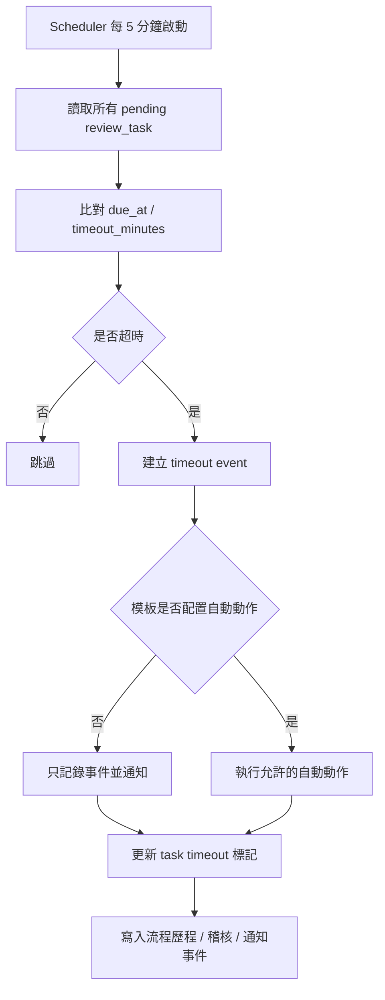
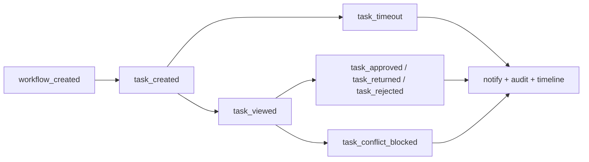
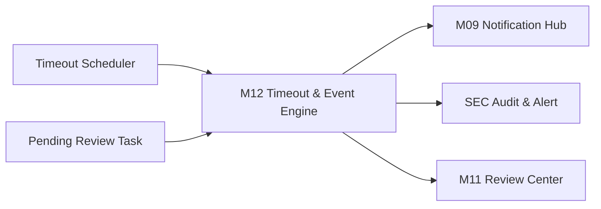
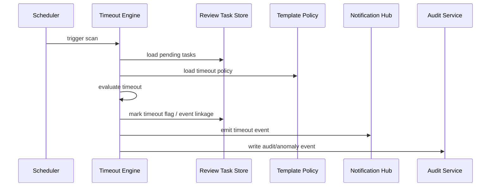
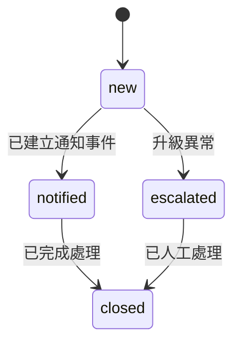

> 來源註記：本文件保留既有模塊拆分方式。凡文中未被客戶原始 PRD 明文定義的欄位、狀態碼、流程抽象或工程命名，均視為內部設計建議，不作為客戶權威需求表述。
>
> 對齊口徑：本文件已按主 PRD `v1.1` 與 `sql/tra_welfare_platform.sql` `v3.0-full` 收斂；`workflow_event`、`workflow_timeout_scan_run` 與排程頻率屬當前系統實作，具體執行節奏由系統參數控制。

# M12《WF－超時掃描與流程事件》子 PRD

## 1. 模塊名稱

WF－超時掃描與流程事件

## 2. 模塊類型

底層能力模塊

## 3. 模塊定位

本模塊是流程引擎的「時間治理層」與「事件中樞層」，負責把流程從靜態模板與人工待辦，延伸為可被時間驅動、可被觀測、可被通知、可被追查的執行系統。
如果 M10 解決的是「流程模板怎麼定義」，M11 解決的是「待辦怎麼被人處理」，那 M12 解決的就是：

- 哪些流程節點已經超時
- 超時之後要產生哪些事件
- 事件要通知誰、記錄到哪裡、是否升級為安全/治理問題
- 在未配置自動動作時，如何嚴格遵守“不自動核准”的平台邊界
- 流程中的建立、派發、超時、衝突阻斷、完成等事件，如何形成統一事件流

總體 PRD 雖然只把 WF 的「超時處理」列為一級功能，但同時已明確給出三個關鍵實施前提：
一是超時掃描由 scheduler 每 5 分鐘執行；二是未配置自動動作時只記錄事件並通知；三是排程任務最低集合裡包含流程超時掃描。這代表超時不是待辦頁上的附屬標記，而是需要獨立成模塊的底層能力。

## 4. 設計目標

本模塊設計目標如下：

1. 建立統一的流程超時掃描機制，按固定節奏檢查所有有效待辦與節點是否逾期，滿足總體 PRD 對「每 5 分鐘掃描」的明確要求。
2. 建立流程事件標準化模型，讓流程建立、待辦建立、指派失敗、超時、核准、退回、駁回、衝突阻斷等都能形成可追蹤事件，支撐通知、稽核與後續治理。這是根據總體 PRD 對「每一個審批節點、每一筆通知、每一次異議都有歷程可查」的整體價值延伸出的工程化要求。
3. 嚴格落實邊界：未配置自動動作時，超時後只能記錄事件並通知，不可自動核准。這是總體 PRD 的直接規定。
4. 為 M09 通知中台、SEC 稽核資安、M11 待辦中心與業務主表狀態變更提供穩定事件出口，讓流程治理與觀測能力成為平台通用基建。總體 PRD 已明確通知發送採事件扇出模型，且資安人員可查看事件結果與通知送達紀錄。
5. 支撐 MVP 範圍內的單線串簽與基本超時治理，不把系統推向過重的 BPM 複雜度。總體 PRD 已明確 MVP 不納入完整會簽。

## 5. 業務場景

### 場景 A：主管長時間未處理補助待辦

職工送審補助後，流程已建立待辦，但主管在規定時間內未處理。此時 M12 需要在下一輪排程掃描時識別該待辦已超時，產生 timeout event，通知相關角色，並在待辦中心顯示超時標記；若模板未配置自動動作，則不能替主管自動核准。這完全對應總體 PRD 對超時掃描與超時邊界的規則。

### 場景 B：發款批次卡在主管核准節點

承辦建立發款批次並送審後，主管長時間未核准，造成後續人工撥款與職工領款確認延遲。M12 應識別該待辦超時，輸出事件與通知，讓承辦、主管或管理員知曉瓶頸點。總體 PRD 已將發款批次核准作為主流程一部分，且主流程對時間節點具明確責任鏈。

### 場景 C：公告或商店合約流程超時

公告送審或商店合約送審若卡住，不應默默無聲；系統需透過超時掃描與事件通知，讓公告管理員、承辦與主管知道流程停滯位置。總體 PRD 已明確公告與商店都走統一審批機制。

### 場景 D：流程事件需要被通知中心與稽核系統共同消費

例如 `task_created`、`task_timeout`、`task_approved`、`task_conflict_blocked` 這些流程事件，既可能觸發 M09 建立站內通知，也可能進入 SEC 的操作異常或資料完整性追查。總體 PRD 已明確通知採事件扇出，SEC 又能查看事件結果與通知送達紀錄。

### 場景 E：角色配置異常導致流程事件升級

若某步驟到期時發現對應角色已停用、或無有效任職人可承接升級通知，M12 應把此類情況記為 assignment anomaly / timeout anomaly，而不只是靜默失敗。總體 PRD 已明確停用角色不可繼續收到待辦，且平台要求所有高風險操作可被追蹤。

## 6. 業務流程解讀

### 6.1 超時掃描在整體流程中的位置

總體 PRD 的端到端流程是：建立申請 → 送審 → 流程建立待辦 → 主管審核 → 核准/退回/駁回。M12 補上的，是這條主鏈裡「主管還沒動作之前，時間是否已經越界」的治理能力。也就是說，M12 不改變主流程方向，但負責監控主流程是否停滯。

### 6.2 超時掃描主流程

依總體 PRD，掃描頻率應為每 5 分鐘。

### 6.3 流程事件主流程

除了 timeout，本模塊還應統一治理流程執行中的事件流。建議事件流如下：

這裡的 `task_timeout`、`task_conflict_blocked`、`task_created` 雖然是子 PRD 細化出的事件名，但其存在的必要性直接來自總體 PRD 對超時掃描、版本衝突、通知與歷程追查的要求。

### 6.4 未配置自動動作時的嚴格邊界

總體 PRD 已明確：流程超時後，若未配置自動動作，系統只記錄事件並通知，不自動核准。這是本模塊最重要的治理紅線。
因此子 PRD 建議：

- 預設 `auto_action_type = none`
- MVP 默認只做 `notify_only`
- 只有被顯式白名單允許的模板/節點，才可以配置非空 auto action
- UI 與 API 均要阻止未授權模板啟用自動核准類配置

### 6.5 事件與通知的分層關係

M12 不負責真正發送通知，只負責產生流程事件。
事件 → M09 模板匹配 → 站內通知 / Email outbox → 發送與送達記錄。
這種分層完全符合總體 PRD 的通知扇出時序圖。

### 6.6 事件與稽核的分層關係

M12 也不直接承擔 SEC 的完整查詢頁，而是輸出可被稽核消費的事件，例如：

- timeout
- auto_action_executed
- assignment_failed
- conflict_blocked
- repeated_timeout
- timeout_notification_failed

總體 PRD 對 SEC 的規則分類已明確存在 `operation_anomaly`、`data_integrity` 等類別，因此流程事件天然可以成為這些分類的輸入。

## 7. 核心功能拆解

### 7.1 超時掃描排程

提供固定頻率掃描能力。
總體 PRD 明確要求每 5 分鐘掃描一次。
建議子能力包括：

- 掃描啟停控制
- 分批掃描 pending task
- 只掃描有效流程與有效節點
- 支援多輪掃描防重
- 掃描結果統計

### 7.2 Timeout 判斷引擎

根據 `due_at`、`timeout_minutes`、`task_status`、`step_status` 判斷是否超時。
建議能力包括：

- 節點級超時計算
- 任務級超時計算
- 已完成待辦排除
- 已取消/已駁回流程排除
- 重複超時去重

### 7.3 流程事件標準化

建立統一事件模型。建議至少支持：

- workflow_created
- workflow_started
- task_created
- task_timeout
- task_reassigned_reserved
- task_conflict_blocked
- task_approved
- task_returned
- task_rejected
- workflow_completed
- workflow_terminated

### 7.4 Timeout 後通知觸發

當 timeout event 發生時，根據模板策略產生通知事件，交由 M09 扇出。
至少可支持：

- 通知當前處理人
- 通知其主管/管理員
- 通知申請人（視業務需要）
- 通知系統管理員處理流程異常

### 7.5 自動動作控制

雖然總體 PRD 沒有要求 MVP 實作完整自動動作，但它明確保留了「若未配置自動動作」這一前提，因此子 PRD 必須把 auto action 邊界說清楚。
建議能力包括：

- `none`
- `notify_only`
- `reserved_future_action`

MVP 不建議開放真正的自動核准、自動退回。

### 7.6 流程事件時間線輸出

把事件輸出給 M11 待辦詳情頁與時間線頁，形成可追蹤的過程紀錄。
總體 PRD 已明確跨模組流程頁如待辦中心、時間線、通知中心應採共用元件設計。

### 7.7 異常掃描與升級

對以下情況可標記為升級事件：

- 連續多輪 timeout 未處理
- timeout 後通知未成功建立
- 節點角色失效
- due_at 缺失
- task 與 template step 不一致

## 8. 與其他模塊的聯動關係

### 8.1 與 M10《流程模板與節點配置》的聯動

M10 定義：

- timeout_minutes
- timeout_policy_enabled
- auto_action_type
- timeout_notify_roles

M12 執行：

- 實際掃描
- timeout 判斷
- event 產生
- auto action 邊界控制

也就是：

- M10 回答「應該怎麼超時」
- M12 回答「現在是否已經超時」與「超時後要輸出什麼事件」

### 8.2 與 M11《待辦中心與審批執行》的聯動

M11 展示與執行待辦；M12 為待辦提供時間治理與事件補充。
具體聯動包括：

- 待辦列表顯示超時標記
- 待辦詳情顯示 timeout 歷程
- timeout 後若有人再處理，需能看到超時背景

### 8.3 與 M09《通知中心、模板與外寄任務》的聯動

M12 輸出流程事件，M09 消費事件並建立通知。
總體 PRD 的通知扇出時序圖已確立這種事件式通知模型。

### 8.4 與 ORG 的聯動

若 timeout 需要通知角色或主管，M12 仍需經由 ORG 解析當前角色任職人；若角色已停用或無任職人，則應產生 assignment anomaly 事件。總體 PRD 已明確停用角色不可繼續收到待辦。

### 8.5 與 BEN / PAY / ANN / MCH 的聯動

這些模塊都是流程超時掃描的業務域消費方。
M12 對它們的主要價值不是改業務規則，而是：

- 暴露流程停滯點
- 形成超時通知
- 提供時間線與稽核證據
- 支撐 SLA 式管理（子 PRD 工程細化）

### 8.6 與 SEC 的聯動

timeout、重複 timeout、auto action executed、assignment anomaly、notification failure 都可成為 SEC 的 `operation_anomaly` 或其他規則輸入。總體 PRD 已明確 SEC 有掃描規則、告警與送達記錄，且高風險操作要可追蹤。

## 9. 頁面規劃

本模塊屬底層能力模塊，不以複雜業務表單頁為主，但建議提供 3 類治理頁面/視圖。

### 9.1 視圖一：超時監控頁

**定位**：查看所有已超時或即將超時的流程待辦。

**頁面區塊**

1. 搜尋與篩選區
2. 超時待辦列表
3. 風險摘要卡
4. 處理建議區

**列表欄位建議**

- task_id
- source_module
- business_no
- current_step_name
- assigned_role
- assigned_employee
- due_at
- overtime_minutes
- timeout_round
- notification_status

### 9.2 視圖二：流程事件時間線頁

**定位**：查看某一 `workflow_instance` 的完整事件流。

**頁面區塊**

1. 流程摘要
2. 事件時間線
3. 事件詳情抽屜
4. 關聯通知與稽核摘要

### 9.3 視圖三：掃描執行紀錄頁

**定位**：查看 scheduler 每輪掃描的執行情況。

**頁面區塊**

1. 執行批次列表
2. 掃描統計
3. 失敗任務明細
4. 異常事件摘要

## 10. 底層能力說明

### 10.1 能力邊界

本模塊負責：

- 流程超時掃描
- timeout 判斷
- 流程事件標準化
- timeout 後通知觸發事件
- 流程事件時間線輸出
- 掃描執行紀錄
- timeout 異常升級

本模塊不負責：

- 流程模板編輯
- 單筆待辦核准/退回/駁回執行
- 通知實際發送
- 安全告警查詢頁
- 業務主表本身的內容編輯

### 10.2 建議能力接口

- `scanTimeoutTasks(batchSize)`
- `evaluateTaskTimeout(taskId)`
- `emitWorkflowEvent(instanceId, eventType, payload)`
- `listWorkflowEvents(instanceId)`
- `getTimeoutDashboard(filters)`
- `listTimeoutScanRuns(dateRange)`
- `replayTimeoutNotification(taskId)`
- `markTimeoutHandled(taskId, comment)`

### 10.3 事件模型建議

建議事件主表至少包含：

- event_id
- workflow_instance_id
- task_id
- event_type
- event_source
- event_payload_snapshot
- severity_level
- created_at
- created_by_system
- processed_status

## 11. 角色權限與操作路徑

### 11.1 可操作角色

- 系統管理員：查看掃描結果、處理流程異常、治理配置
- 審核主管：查看與自己相關的 timeout 結果
- 福利社承辦人 / 公告管理員 / 商店承辦人：查看與自己業務相關的流程停滯
- 資安稽核人員：查看高風險事件、超時告警與送達結果

總體 PRD 已明確系統管理員負責平台治理，資安稽核人員負責查詢日誌、處理告警與封存報告。

### 11.2 操作路徑

管理後台 → 流程管理 / 系統設定 → 超時監控
管理後台 → 流程管理 / 系統設定 → 流程事件時間線
管理後台 → 流程管理 / 系統設定 → 掃描執行紀錄
資安後台 → 安全告警 / 稽核日誌 → 關聯流程異常事件

### 11.3 權限建議

- 查看超時監控
- 查看流程事件
- 查看掃描執行紀錄
- 手動重發 timeout 通知
- 匯出異常事件
- 標記異常已處理

其中「手動重發 timeout 通知」「匯出異常事件」建議視為高風險治理權限。

## 12. 關鍵字段/配置項說明

### 12.1 來自總體 PRD 的關鍵字段與原則

總體 PRD 已明確通用欄位包括 `workflow_instance_id` 與 `revision`；排程任務最低集合包含流程超時掃描；高風險主表建議加 `revision`。

### 12.2 workflow_event 字段

| 字段名               | 中文名稱     | 用途                                                | 備註           |
| -------------------- | ------------ | --------------------------------------------------- | -------------- |
| event_id             | 事件 ID      | 主鍵                                                | 系統唯一       |
| workflow_instance_id | 流程實例 ID  | 關聯流程                                            | 通用欄位延伸   |
| task_id              | 待辦 ID      | 關聯 review_task                                    | 可空           |
| event_type           | 事件類型     | timeout / approved / returned / conflict_blocked 等 | 核心字段       |
| source_module        | 來源模塊     | BEN/PAY/ANN/MCH/WF                                  | 便於追查       |
| severity_level       | 嚴重等級     | low/medium/high/critical                            | 可供 SEC 使用  |
| payload_snapshot     | 事件載荷快照 | 保存當時上下文                                      | 建議 JSON 摘要 |
| processed_status     | 處理狀態     | new/notified/escalated/closed                       | 字典治理       |
| created_at           | 建立時間     | 事件時間                                            | 必填           |

### 12.3 timeout_scan_run 字段

| 字段名                 | 中文名稱    | 用途                          |
| ---------------------- | ----------- | ----------------------------- |
| scan_run_id            | 掃描批次 ID | 主鍵                          |
| started_at             | 開始時間    | 排程啟動時間                  |
| finished_at            | 結束時間    | 排程完成時間                  |
| scanned_task_count     | 掃描任務數  | 統計                          |
| timeout_hit_count      | 命中超時數  | 統計                          |
| event_created_count    | 事件建立數  | 統計                          |
| notify_triggered_count | 通知觸發數  | 統計                          |
| failed_count           | 失敗數      | 排錯                          |
| run_status             | 執行狀態    | success/partial_failed/failed |

### 12.4 timeout_policy 摘要字段

雖配置主體在 M10，但本模塊執行時至少需要讀取：

- timeout_enabled
- timeout_minutes
- auto_action_type
- timeout_notify_roles
- timeout_escalation_level

### 12.5 建議配置項

建議由 M07 / SYS 參數治理：

- `wf.timeout.scan.cron`
- `wf.timeout.scan.batch_size`
- `wf.timeout.event.dedup_window_minutes`
- `wf.timeout.notify.retry_enabled`
- `wf.timeout.auto_action.whitelist_enabled`
- `wf.timeout.max_escalation_round`
- `wf.timeout.scan.partial_fail_alert_enabled`

其中 `wf.timeout.scan.cron` 與流程超時排程直接對應總體 PRD 要求。

## 13. 異常情況與邊界條件

### 13.1 未配置自動動作卻自動核准

這是明確違反總體 PRD 的行為。若發生，應視為嚴重實作缺陷。

### 13.2 超時事件重複建立

若同一待辦在短時間內多輪掃描命中超時，應有去重策略，避免通知轟炸與時間線污染。

### 13.3 角色停用或無任職人

timeout 後若需升級通知卻找不到有效角色接收方，應建立 assignment anomaly 事件，不可靜默略過。總體 PRD 已明確停用角色不可繼續收到待辦。

### 13.4 due_at 缺失或配置非法

若待辦缺少 due_at 或 timeout_minutes，應記為配置異常事件，而不是默認永不超時。

### 13.5 通知事件建立成功但通知發送失敗

此時流程事件仍應保留，並由 M09 / SEC 後續追查送達問題。總體 PRD 已明確事件結果與通知送達紀錄都應可查。

### 13.6 掃描批次部分失敗

若某輪掃描中部分待辦處理失敗，不應整批回滾；應保留成功結果、記錄失敗清單並允許補掃。

### 13.7 已完成待辦仍被掃到

掃描條件必須排除非 pending 任務，否則會造成假性超時。

## 14. Mermaid 圖

### 14.1 超時掃描與事件輸出關係圖

### 14.2 Timeout 掃描時序圖

### 14.3 流程事件生命週期圖

## 15. 研發落地建議

### 15.1 架構分層建議

- M10 配模板與 timeout policy
- M11 執行待辦與審批
- M12 掃描 timeout 與輸出 event
- M09 發送通知
- SEC 消費高風險或異常 event

這種分層最符合總體 PRD 的共用能力設計。

### 15.2 排程實作建議

- 固定 5 分鐘啟動一次掃描
- 分批拉取 pending task，避免單輪掃描過重
- 每輪掃描保留 run log
- 對同一 task timeout 事件做去重窗口控制

其中「每 5 分鐘」與「流程超時掃描屬最低必備排程」直接來自總體 PRD。

### 15.3 事件設計建議

- event payload 保留當時 step、role、business_no、due_at、overtime_minutes 摘要
- 不直接把模板或通知內容塞進業務主表
- 流程事件與通知任務分表，降低耦合
- 事件可作為時間線、告警與報表的共同上游

### 15.4 安全與治理建議

- 未授權 auto action 一律禁止
- timeout、衝突阻斷、通知失敗都應能進 SEC
- 高風險流程異常事件可同步寫入，其他可按策略非同步寫入；這與總體 PRD 對 SEC 的高風險同步寫入原則相符，但屬子 PRD 的工程化細化。

## 16. 測試驗收要點

### 16.1 功能驗收

1. scheduler 可按每 5 分鐘週期執行流程超時掃描。
2. pending task 到期後可正確命中 timeout。
3. 命中 timeout 後可建立流程事件。
4. timeout 事件可觸發通知事件並顯示在待辦時間線中。
   以上 1、2、3 點都直接對應總體 PRD 的 WF timeout 規則與排程要求。

### 16.2 邊界驗收

1. 未配置自動動作時，超時後只記錄事件並通知，不會自動核准。
2. 已完成待辦不會被重複掃成 timeout。
3. 角色已停用時，不會再作為新通知/新待辦接收方。
4. 若 due_at 缺失，可產生配置異常事件。
   其中第 1、3 點直接對應總體 PRD 邊界。

### 16.3 聯動驗收

1. BEN / PAY / ANN / MCH 的流程節點都可被 timeout engine 正確掃描。
2. M09 可正確消費 timeout event 並建立站內通知 / 外寄任務。
3. M11 可在待辦中心正確展示 timeout 標記與事件時間線。
4. SEC 可查看流程異常事件與送達結果關聯。
   其中第 2、4 點直接可由總體 PRD 的通知扇出圖與資安場景支撐。

### 16.4 治理與安全驗收

1. timeout 事件、重複 timeout、通知失敗、assignment anomaly 都可被追蹤。
2. 掃描執行紀錄可查詢每輪成功/失敗統計。
3. 未授權模板不可啟用 auto action。
4. 並發情況下不會重複建立同一 timeout 事件。
   第 1 點與總體 PRD 的「所有高風險操作都能被稽核追蹤」一致。
